## **R E S P E C T** women

Preventing violence against women, second edition

logo: World Health Organization logo: UNITED NATIONS HUMAN RIGHTS OFFICE OF THE HIGH COMMISSIONER logo: UN D P logo: UNFPA logo: UN WOMEN logo: United Nations Office on Drugs and Crime logo: UNAIDS

logo: Ministry of Foreign Affairs of the Netherlands logo: Australian Government logo: Global Affairs Canada logo: uKaid from the British people logo: Sida SWEDISH INTERNATIONAL DEVELOPMENT COOPERATION AGENCY logo: World Bank Group

---

NO_CONTENT_HERE

---

# R E S P E C T

women

Preventing violence against women, second edition

logo: World Health Organization

logo: United Nations Human Rights Office of the High Commissioner

logo: UNDP

logo: UNFPA

logo: UN Women

logo: United Nations Office on Drugs and Crime

logo: UNAIDS

logo: Ministry of Foreign Affairs of the Netherlands

logo: Australian Government

logo: Global Affairs Canada

logo: UKaid from the British people

logo: Sida Swedish International Development Cooperation Agency

logo: World Bank Group

---

RESPECT women: preventing violence against women, second edition

ISBN 978-92-4-011702-0 (electronic version)

ISBN 978-92-4-011703-7 (print version)

**© World Health Organization 2025**

Some rights reserved. This work is available under the Creative Commons Attribution-NonCommercial-ShareAlike 3.0 IGO licence (CC BY-NC-SA 3.0 IGO; [https://creativecommons.org/licenses/by-nc-sa/3.0/igo](https://creativecommons.org/licenses/by-nc-sa/3.0/igo)).

Under the terms of this licence, you may copy, redistribute and adapt the work for non-commercial purposes, provided the work is appropriately cited, as indicated below. In any use of this work, there should be no suggestion that WHO endorses any specific organization, products or services. The use of the WHO logo is not permitted. If you adapt the work, then you must license your work under the same or equivalent Creative Commons licence. If you create a translation of this work, you should add the following disclaimer along with the suggested citation: "This translation was not created by the World Health Organization (WHO). WHO is not responsible for the content or accuracy of this translation. The original English edition shall be the binding and authentic edition".

Any mediation relating to disputes arising under the licence shall be conducted in accordance with the mediation rules of the World Intellectual Property Organization ([http://www.wipo.int/amc/en/mediation/rules/](http://www.wipo.int/amc/en/mediation/rules/)).

**Suggested citation.** RESPECT women: preventing violence against women, second edition. Geneva: World Health Organization; 2025. Licence: CC BY-NC-SA 3.0 IGO.

**Cataloguing-in-Publication (CIP) data.** CIP data are available at [https://iris.who.int/](https://iris.who.int/).

**Sales, rights and licensing.** To purchase WHO publications, see [https://www.who.int/publications/book-orders](https://www.who.int/publications/book-orders). To submit requests for commercial use and queries on rights and licensing, see [https://www.who.int/copyright](https://www.who.int/copyright).

**Third-party materials.** If you wish to reuse material from this work that is attributed to a third party, such as tables, figures or images, it is your responsibility to determine whether permission is needed for that reuse and to obtain permission from the copyright holder. The risk of claims resulting from infringement of any third-party-owned component in the work rests solely with the user.

**General disclaimers.** The designations employed and the presentation of the material in this publication do not imply the expression of any opinion whatsoever on the part of WHO concerning the legal status of any country, territory, city or area or of its authorities, or concerning the delimitation of its frontiers or boundaries. Dotted and dashed lines on maps represent approximate border lines for which there may not yet be full agreement.

The mention of specific companies or of certain manufacturers’ products does not imply that they are endorsed or recommended by WHO in preference to others of a similar nature that are not mentioned. Errors and omissions excepted, the names of proprietary products are distinguished by initial capital letters.

All reasonable precautions have been taken by WHO to verify the information contained in this publication. However, the published material is being distributed without warranty of any kind, either expressed or implied. The responsibility for the interpretation and use of the material lies with the reader. In no event shall WHO be liable for damages arising from its use.

---

iii

# Contents

Acknowledgements / p.v
Methods / p.vi
Introductions / p.1

I
Know the facts / p.2

II
Assess risk and protective factors / p.4

III
Implement 7 strategies to prevent violence against women / p.8

IV
Assess evidence for interventions / p.10

V
Develop a theory of change / p.12

---

iv

## VI

Apply the guiding principles for prevention for effective policy and programming / p.14

## VII

Strengthen enabling environment for prevention / p.16

## VIII

Adapt and scale-up what works / p.18

## IX

Monitor, evaluate and measure progress / p.20

## X

Commit to action!

/ p.23

---

v

# Acknowledgements

The second edition of RESPECT women, preventing violence against women has benefitted from the inputs of all the agency focal points that have collaborated to make this an interagency prevention framework. This includes agency representatives from the Department of Foreign Affairs and Trade, Government of Australia, Global Affairs Canada, Ministry of Foreign Affairs of the Netherlands, Swedish International Development Cooperation Agency, Foreign and Commonwealth Office of the United Kingdom and Great Britain, United Nations Development Programme (UNDP), United Nations Fund for Population (UNFPA), United Nations Human Rights Office of the High Commissioner(OHCHR), Joint UN Programme on HIV and AIDS (UNAIDS), Joint United Nations Entity for Gender Equality and the Empowerment of Women (UN Women) and the World Bank Group.

The update of RESPECT women was carried out by WHO’s Department of Sexual, Reproductive, Maternal, Child and Adolescent Health and Ageing (LHR) and the UNDP/UNFPA/UNICEF/World Bank/WHO Special Programme of Research on Human Reproduction (HRP). It was led by Avni Amin. Inputs were provided by Anna Hoover (WHO consultant), Saba Zariv (former WHO staff), and Anna Rita Ronzoni (Regional Office for the Eastern Mediterranean).

To update RESPECT women, three systematic reviews were commissioned. One led by Chelsea Ullman (Global Women’s Institute at the George Washington University), another by Maureen Murphy (Global Women’s Institute at the George Washington University) and a third by Jo Spangaro (University of Wollongong). WHO thanks all the co-authors of these three systematic reviews.

WHO also thanks experts who participated in an expert consultation in 2022 and subsequently reviewed a draft of the revised framework for content relevant to humanitarian settings. This includes representatives from the International Committee of the Red Cross (ICRC), International Federation of Red Cross and Red Crescent Societies (IFRC), International Organization for Migration (IOM), International Medical Corps, and the United Nations High Commissioner for Refugees (UNHCR).

The second edition of RESPECT has also benefitted from lessons learned from implementing the 2019 edition in countries including Bhutan, Indonesia, Nigeria, and Vietnam.

---

vi

# Methods

The update of RESPECT women to develop the second edition was based on three systematic reviews. One led by Chelsea Ullman (Global Women's Institute at the George Washington University) was [published in 2025 in the BMJ Public Health](https://bmjpublichealth.bmj.com/content/3/1/e001126)a and it focused on updating the systematic review from 2015 focusing on interventions to prevent violence against women.

Another led by Maureen Murphy (Global Women's Institute at the George Washington University) focused on identifying the risk and protective factors that influence violence against women in humanitarian settings and was published in Trauma, Violence and Abuse in 2023.b

A third systematic review focusing on interventions to address violence against women in humanitarian settings was led by Jo Spangaro (University of Wollongong) and it was published in Conflict and Health in 2021.c

The review led by Ullman contributed to minor updates to the evidence rating of individual intervention categories in document. Whereas the two reviews on humanitarian settings led to addition of a page on humanitarian and updating of evidence ratings of individual intervention categories in the document.

An early draft of the humanitarian content was presented at an expert consultation in 2022 attended by humanitarian or GBV focal points from ICRC, IFRC, IOM, IRC UNFPA, UNHCR, UNICEF, and Save the Children. A subsequent draft was reviewed by some of these agencies plus the agencies that have endorsed the framework with their logo. Declaration of interests were obtained from the non-state actions (i.e. ICRC, IFRC, IOM and IRC) and no conflicts of interest were found.

---

1

# Introduction

The primary audience for this document is policymakers. Programme implementers working on preventing and responding to violence against women will also find it useful for designing, planning, implementing, and monitoring and evaluating interventions and programmes.

## What is new?

First, the update addresses interventions appropriate for humanitarian emergencies. Second, the evidence-base is updated for RESPECT in development settings through a systematic review of reviews. Third, the update explicitly encourages users to address the disproportionate risks faced by certain groups, including adolescent girls, women with disabilities, indigenous women, and trans women, among others, while adapting to context.

---

2

# Know the **facts**

Violence against women (VAW) is a **violation of human** **rights**, is rooted in gender inequality, is a **public health** **problem**, and an impediment to sustainable development.

Nearly **1 in 3 (30%)**d women worldwide have experienced physical and/or sexual violence by an **intimate partner** or sexual violence, not including sexual harassment, by any perpetrator.

Globally, **25%**d of ever-partnered women 15 years and older have experienced physical and/or sexual violence by an **intimate partner** in their lifetime.

Increasingly, violence in homes and communities is continuing online as **technology-facilitated** gender-based violence (TF- GBV).

Adolescent girls, young women, women belonging to ethnic and other minorities, women living with HIV, trans women, and women with disabilities face a **higher risk** of experiencing different forms of violence.

---

3

**Humanitarian emergencies** may exacerbate existing violence and lead to additional forms of violence against women.

Globally, the estimated share of women victims of **homicide** committed by an **intimate partner** is almost 30%.e

Violence negatively affects women’s physical and mental **health** and well-being. It has **social and economic consequences** and costs for families, communities and societies.

Low education levels, exposure to violence in childhood, unequal power in intimate relationships, and attitudes and norms accepting violence and **gender inequality increase the risk** of experiencing intimate partner violence and sexual violence.

Low education, child maltreatment or exposure to violence in the family, harmful use of alcohol, attitudes accepting of violence and **gender inequality increase risk of perpetrating** intimate partner violence.

The majority (**55-95%**)f of women survivors of violence **do not** **disclose or seek any type of services**.

Violence against women is **preventable**. To prevent violence, mitigate the risk factors and amplify the protective factors.

---

4

# **II the risk** **Assess & protective factors**1

## **Risk Factors**g

Discriminatory laws on property ownership, marriage, divorce and child custody

Low levels of women’s employment and education

Absence or lack of enforcement of laws addressing violence against women

Gender discrimination in institutions (e.g. police, health)

**SOCIETAL**

Harmful gender norms that uphold male privilege, limit women’s autonomy and stigma

High levels of poverty and unemployment

High rates of violence and crime

Availability of drugs, alcohol and weapons

**COMMUNITY**

High levels of inequality in relationships/ male-controlled relationships/ dependence on partner

Men's multiple sexual relationshipsh

Men's use of drugs and harmful use of alcohol

**INTERPERSONAL**

Childhood experience of violence and/ or exposure to violence in the family

Mental health conditions

Attitudes condoning or justifying violence as normal or acceptable or stigmatizing women

**INDIVIDUAL**

---

5

### SOCIETAL

Laws that:

* promote gender equality

* promote women’s access to formal employment

* address violence against women and against children

### COMMUNITY

Norms that support non-violence and gender equitable relationships, and promote women’s empowerment

Norms that promote positive masculinities including among boys and men

Reduce availability and access to alcohol and firearms

### **Protective** **Factors**

### INTERPERSONAL

Intimate relationships characterized by gender equality, including in shared decision-making and household responsibilities

### INDIVIDUAL

Non-exposure to violence in the family

Secondary education for women and men and less disparity in education levels between women and men

Both men and boys and women and girls are socialized to, and hold gender equitable attitudes

---

6

# Additional **risk** **factors** in **humanitarian** **emergencies**

## **Risk** **Factors**b

Exposure to conflict or natural disaster

State systems failing or fragile

Breakdown of rule of law and criminal impunity in conflict settings

**SOCIETAL**

Break down of social networks

Decrease in physical security

Systematic targeting of women for rape

Proliferation of weapons

Increased criminal activities

Drug and alcohol use by armed groups

**COMMUNITY**

Increase in men's controlling behaviours

Resistance to changing gender roles of women

Men's multiple sexual partner's due to family separation

Increase in partner's alcohol use to cope with stress related to insecurity

**INTERPERSONAL**

Increase in mental health conditions due to disaster or conflict

Sexual exploitation in female-headed households

Women's economic activities that expose them to violence

Forced marriages of girls

**INDIVIDUAL**

---

7

SOCIETAL

Disaster preparedness planning that includes prevention and response to violence against women

Strengthening the rule of law and ending impunity for violence against women in conflict settings

COMMUNITY

Increasing access for women to safe economic opportunities

Improving camp security

Reducing access to alcohol and drugs

Ensuring women's access to humanitarian aid

Access to education and other community resources

INTERPERSONAL

Men hold gender equitable attitudes

Family reunification efforts

Reducing access to alcohol and drugs

INDIVIDUAL

Improving access to mental health care

Ensuring girls can remain in school

Support livelihoods for parents of girls

**Protective** **Factors**

---

8

illustration: RESPECT framework graphic

R E S P E C T

III Implement 7 strategies to prevent violence against women2

---

9

**Relationship skills strengthened**

refers to strategies aimed at individuals or groups of women, men or couples to improve skills in interpersonal communication, conflict management and shared decision-making.

**Empowerment of women**

refers to both economic and social empowerment including inheritance and asset ownership, microfinance plus gender and empowerment training interventions, collective action, creating safe spaces and mentoring to build skills in self-efficacy, assertiveness, negotiation, and self-confidence.

**Services ensured**

refers to a range of services including police, legal, health, and social services provided to survivors.

**Poverty reduced**

refers to strategies targeted to women or the household whose primary aim is to alleviate poverty ranging from cash transfers, savings, microfinance loans, labour force interventions.

**Environments made safe**

refers to efforts to create safe schools, public spaces and work environments, among others.

**Child and adolescent abuse prevented**

refers to establishing nurturing family relationships, prohibiting corporal punishment, and implementing parenting programmes as mentioned in INSPIRE - 7 strategies for preventing violence against children.i

**Transformed attitudes, beliefs, and norms**

refers to strategies that challenge harmful gender attitudes, beliefs, norms and stereotypes that uphold male privilege and female subordination, that justify violence against women and that stigmatize survivors. These may range from public campaigns, group education to community mobilization efforts.

---

## Relationships skills strengthened

Group-based workshops with women and men to promote egalitarian attitudes and relationships

icon: H

icon: L

Skills building for healthy relationships for couples where there is no violence including communication and conflict resolution.

icon: H

icon: rhrd

<u>**EXAMPLE**</u>

**Group-based**

**Workshops**

In the two-year period following the implementation of *Stepping Stones* in South Africa with female and male participants aged 15–26 years, men were less likely to perpetrate intimate partner violence, rape and transactional sex in the intervention group compared to the baseline.i

## Empowerment of women

Empowerment training for women and girls including life skills, safe spaces, mentoring, safety planning and decision-making

icon: H

icon: L

icon: +

Inheritance and asset ownership policies and interventions

icon: H

icon: L

Micro-finance or savings and loans plus gender and empowerment or psychosocial support

icon: H

icon: L

icon: +

<u>**EXAMPLE**</u>

**Microfinance plus gender and empowerment**

The MAISHA programme in Tanzania integrated an existing microfinance intervention in Mwanza city with an adapted ten-session social empowerment training. Women who received the MAISHA intervention were significantly less likely to report past year physical or sexual intimate partner violence by about 31% compared to the control group. They were also less likely to express attitudes accepting of intimate partner violence.k

## Services ensured

Empowerment counselling interventions or psychological support to support access to services (i.e. advocacy)

icon: H

icon: L

icon: +

Alcohol misuse prevention interventions

icon: H

icon: L

<u>Shelters</u>

icon: H

icon: L

Hotlines

icon: H

icon: L

One-stop crisis centres

icon: H

icon: L

Perpetrator interventions (including justice interventions like protection orders and arrests)

icon: H

icon: L

Women’s police stations/units

icon: H

icon: L

icon: +

Screening in health services

icon: H

icon: L

Sensitization and training of institutional personnel without changing the institutional environment

icon: H

icon: L

Survivor-centered services, group therapy and psychosocial support, including mobile interventions

icon: +

<u>**EXAMPLE**</u>

**Advocacy for survivors**

The Community Advocacy Project in Michigan and Illinois, United States, is designed to help survivors of intimate partner abuse re-gain control of their lives. Trained advocates provide individually tailored assistance to survivors so that women can access community resources and social support. The intervention decreased recurrance of violence and depression and improved quality of life and social support with positive change lasting 2 more years.l

## **IV Assess the evidence on interventions**3

---

11

## **Poverty** **reduced**

Economic transfers, including conditional/ unconditional cash transfers, vouchers, and in-kind transfers plus psychosocial <u>support</u> for <u>survivors</u>

icon: H icon: L icon: +

Labour force interventions including employment policies, livelihood and employment training

icon: H ![icon: eflk)

Microfinance or savings interventions without any additional components

icon: H ![icon: cgeh)

### EXAMPLE

#### Economic transfers

In Northern Ecuador, a cash, vouchers and food transfer programme implemented by the World Food Programme (WFP) was targeted to women in poor urban areas, intending to reduce poverty. Participating households received monthly transfers equivalent to $40 per month for a period of 6 months. The transfer was conditional on attendance of monthly nutrition trainings. The evaluation showed reductions in women’s experience of controlling behaviours, physical and/or sexual violence by intimate partners by 19 to 30%. A plausible mechanism for this was reduced conflict within couples related to poverty-related stresses.m

## **Environments** **made safe**

Safety patrol groups and provision of firewood/alternative <u>energy</u>

icon: +

Organizational policy and personnel training on sexual harassment, exploitation, and <u>abuse</u>

icon: +

Infrastructure and transport

icon: H icon: L

Bystander interventions

icon: H icon: L

Whole School interventions

icon: H icon: L

### EXAMPLE

#### Right to play - preventing violence among and against children in schools

In Hyderabad (Sindh Province), Pakistan, a right to play intervention reached children in 40 public schools. Boys and girls were engaged in play-based learning providing them opportunity to develop life skills such as confidence, communication, empathy, coping with negative emotions, resilience, cooperation, leadership, critical thinking and conflict resolution that help combat conflict, intolerance, gender discrimination and peer violence. An evaluation showed decreases in peer victimization by 33% among boys and 59% among girls at 24 months post intervention; in corporal punishment by 45% in boys and 66% in girls; and in witnessing of domestic violence by 65% among boys and by 70% in girls.n

## **Child and adolescent** **abuse prevented**

Home visitation and health worker outreach

icon: H ![icon: ciar)

Parenting interventions

icon: H ![icon: homf) icon: +

Psychological support interventions for children who experience violence and who witness intimate partner violence

icon: H ![icon: wdcd)

Life skills / school-based curriculum, rape and dating violence prevention training

icon: H ![icon: hpyg)

## **Transformed attitudes,** **beliefs, and norms**

Legal aid and assistance plus support for survivors

icon: +

Community mobilization

icon: H icon: L icon: +

Group-based workshops with women and men to promote changes in attitudes and norms

icon: H icon: L icon: +

Social marketing or edutainment and group education

icon: H icon: H L icon: L

Group education with men and boys to change attitudes and norms

icon: H icon: L icon: +

Stand-alone awareness campaigns/single component communications campaigns

icon: H icon: L icon: +

### EXAMPLE

#### Community Mobilizations SASA!

Community Mobilizations SASA! is a community intervention in Uganda that prevents violence against women by shifting the power balance between men and women in relationships. Studies show that in SASA! communities 76% of women and men believe physical violence against a partner is not acceptable while only 26% of women and men in control communities believe the same. At the cost of US$ 460 per incident case of partner violence averted in trial phase, intervention is cost-effective and further economies of scale can be achieved during scale-up.o

### **LEGEND**4,5

icon: • **promising**, >1 evaluations show significant reductions in violence outcomes

icon: square **more evidence needed**, > 1 evaluations show improvements in intermediate outcomes related to violence

icon: diamond **conflicting**, evaluations show conflicting results in reducing violence6

icon: hollow square **no evidence**, intervention not yet rigorously evaluated

icon: triangle **ineffective**, >1 evaluations show no reductions in violence outcomes

**H** World Bank High Income Countries (HIC)

**L** World Bank Low and Middle Income Countries (LMIC)

**+** Humanitarian setting or context*

*only those interventions that have been evaluated in humanitarian settings are reflected with the "+" icon.

---

12 Develop a theory of change

# Develop a theory of change

```mermaid
graph TD
    A["Relationship skills strengthened"]
    B["Empowerment of women"]
    C["Services ensured"]
    D["Poverty reduced"]
    E["Environments made safe"]
    F["Child and adolescent abuse prevented"]
    G["Transformed attitudes, beliefs, and norms"]
    H["Limitations on women's autonomy"]
    I["Children exposed to violence"]
    J["Social norms that perpetuate male power"]
    K["Inadequate services"]
    L["Inadequate legal and social protections for women"]
    M["Lack of political will and resources"]
    N["Under-resourced women's organizations or movements"]
    O["Exposure to disease outbreak, armed conflict, or natural disaster"]
    P["Forced migration or displacement"]
    Q["Communities and services disrupted"]
    R["INTERVENTIONS"]
    S["BARRIERS"]
    T["Women facing violence"]
    U["Families affected by violence"]
    V["Communities with high levels of violence"]
    W["Building on resiliency and knowledge, and resourcing and supporting communities to find solutions"]

    R --> Q
    R --> P
    R --> O
    R --> N
    R --> M
    R --> L
    R --> K
```

**Relationship skills strengthened**
**Empowerment of women**
**Services ensured**
**Poverty reduced**
**Environments made safe**
**Child and adolescent abuse prevented**
**Transformed attitudes, beliefs, and norms**

<u>**INTERVENTIONS**</u>

**Women facing violence**
**Families affected by violence**
**Communities with high levels of violence**

**BARRIERS**

Limitations on women's **autonomy**
Children exposed to **violence**
Social norms that perpetuate **male power**
Inadequate **services**
Inadequate **legal and social protections** for women
Lack of **political will and resources**
Under-resourced **women's organizations or movements**
Exposure to **disease outbreak, armed conflict, or natural disaster**
Forced **migration or displacement**
Communities and services **disrupted**

Building on resiliency and knowledge, and resourcing and supporting communities to find solutions

---

13

Programmes to address VAW widely implemented

Increased resources and political will to address VAW

icon: dot

Increased awareness about VAW as a public health problem and that it is preventable

Programmes addressing violence against women are prioritized and strengthened in humanitarian emergencies

OUTPUTS

Sectoral outcomes related to health, economic, and social development improved (e.g. improved mental health, reduced household poverty, improved women's and child health, improved women's education and earnings, and reduced absenteeism)

Families, communities and institutions believe in and uphold gender equality as a norm and no longer accept VAW

Men accept and treat women as equals

Women can make autonomous decisions

Women have knowledge of their rights and access to programmes

Women can access response services

OUTCOMES

Improved health and development outcomes in households, community and society

Women are exercising their human rights and contributing to development

Violence against women is reduced or eliminated

Equality and respect are practiced in intimate, family and community relationships

Interpersonal conflicts are resolved peacefully

IMPACT

---

14
CORE VALUES

# **VI** Apply the **guiding** **principles** for effective policy and programming

### Put women’s safety first and do no harm

Ensure confidentiality of information and anticipate and address unintended consequences such as backlash from family/community. Protect safety service providers and ensure that essential life-saving services continue to be provided in humanitarian settings 1

### **Promote gender equality** and **women’s human rights**

Ensure that analysis of unequal gender and power relations and male privilege over women is at the center of programming; Share decision-making power with communities; uphold human rights of stateless persons and migrants 2

GENERATE AND DISSEMINATE KNOWLEDGE

### Leave no one behind

Address multiple and intersecting forms of discrimination based on sex, gender, class, race, ethnicity, disability, sexual orientation, gender identity and HIV status 3

### Develop a theory of change

Elaborate how programming inputs will lead to changes in intermediate outcomes and likely impacts 4

### Promote evidence informed programming

Strengthen monitoring and evaluation systems to build the evidence base on what works and facilitate knowledge sharing to inform programming 5

---

15
PROGRAMME DESIGN

### Use participatory approaches

Stimulate personal reflection and critical thinking, and build on the voice, agency and skills of people. Design programming in collaboration with communities, and strengthen their expertise and skills

### Promote multi-sectoral coordination

logo: programme design element

7 Support equitable partnerships across sectors and organizations, and at local and national levels, recognize strengths, expertise, and experience within communities; invest in long-term sustainable partnerships.

### Implement combined interventions

icon: combined interventions

Facilitate collective programming with individuals, families and communities to address the multiple risk factors and multiple forms of violence within families and communities.

### Address the prevention continuum

Multi-sectoral survivor-centered response services should be in place to link to prevention interventions

icon: life-course approach

### Take a life-course approach

Implement programmes that work with children, adolescents and young people for early interventions

---

16

# <u>VII</u> Strengthen **enabling** **environment** for prevention

a Build **political** **commitment** from leaders and policy makers to speak out, condemning violence against women.

icon: person speaking at a podium

b Invest in, build on the work of, resource, and support **women's organizations** **advancing gender** **equality and rights**.7

icon: two people holding signs

c Put in place and facilitate enforcement of **laws and** **policies** that address violence against women and that promote gender equality, including access to secondary education.8

icon: gender equality symbol

---

17

**d Allocate resources** to programmes, research, and to strengthen institutions and capacities of the health, education, law enforcement, and social services sectors to address violence against women.

icon: money

**e Integrate** minimum service standards for survivors into emergency preparedness and planning.

icon: checklist

**f Ensure** that humanitarian responses prioritize prevention of sexual exploitation and abuse (PSEA).

icon: warning

---

18 **VIII**

# Adapt and **scale-up** what works

Violence prevention interventions that have been shown to work on a pilot basis can be scaled-up in different ways. They can be expanded by adding more beneficiaries; they can be adapted and replicated in another geographic location; and there can be expansion in coverage of the same intervention over a wider geographic area. Interventions that are being scaled-up in a new setting need to be adapted to context. This requires an understanding of the local culture, values and resources.

In humanitarian emergencies, scaling up interventions will require working with humanitarian response systems in a complementary manner to state institutions. Scaling up interventions in emergencies requires efforts to facilitate women's participation in emergency preparedness, response and peace processes to improve access to protection and response services.

Interventions identified as promising (pages 10-11) can be adapted and scaled-up with attention to the guiding principles for prevention and to the adaptation and scaling-up considerations on the next page; those classified as “more evidence needed" (pages 10-11) may need to be replicated or further refined before they are scaled-up; and those identified as "conflicting" or "no evidence" need to be further evaluated.

---

19

* **a** **Align with national commitments** (e.g. a national plan, policy, strategy) to end violence against women, or to promote gender equality or women’s health.9

* **b** **Identify and maintain fidelity to core principles** of gender equality, rights and safety as well as to minimum “dosage”, while also adapting to context, including language and culture.

* **c** **Programme for synergy**, combining multiple strategies and interventions at the individual, interpersonal, community and societal levels for sustained impact.

* **d** **Invest in capacity among implementers**, and giving enough time to scale-up and to allow for change to occur and sustain.

* **e** **Build on on-going initiatives**, integrating prevention activities into existing health, development and other existing sectoral programmes.

* **f** **Design with “scale” in mind**, investing for the long-term, keeping costs and sustainability in mind.

* **g** **Start small, document and evaluate** the adaptation and scale-up in order to innovate and strengthen evidence-informed programming.

* **h** **Support a community of practice** among programme developers and implementers to facilitate learning and knowledge sharing.

---

20 **IX**

# Monitor, evaluate and measure **progress**

Progress in preventing violence against women can be measured in the short and the long-term.

**1.** In the long-term, the impact of prevention programmes can be measured as reductions in prevalence of different forms of violence against women.

**2.** At the global level, countries are required to report **progress** in preventing violence against women as part of SDG targets. Two indicators are proposed:

* prevalence of intimate partner violence in the last 12 months among women aged 15 years and older (SDG target 5.2 - eliminate all forms of violence against women and girls);p

* proportion of young women and men aged 18–29 years who experienced sexual violence by age 18 (SDG target 16.2 - End abuse, exploitation, trafficking and all forms of violence against and torture of children).q

---

21

**3.** In the short to medium term, interim indicators that contribute towards reductions in prevalence of violence against women will depend on the types of programmes. These can include, for example, improvements in:

* gender equitable attitudes and norms

* equitable power in relationship with partner

* women’s autonomy, agency and/or self-efficacy

* girls' and women's education.

**4.** It is important to specify a theory of change elaborating how the programme will likely improve interim indicators and how these in turn will contribute to reducing prevalence of violence against women.

**5.** It is important to evaluate before scaling-up and to monitor the scaling-up on an on-going basis to ensure that resources are invested in programmes that work, unintended or harmful outcomes are mitigated, and the scaling-up process takes into account the local context.

**6.** Data collection is more complicated in humanitarian emergencies due to access, rapidly changing nature of the situation and moving populations, which requires flexibility to explore alternative evaluation methods.

---

22

Ending violence
against women
begins
with

**R E S P E C T**

illustration: two people talking with lines connecting to the word RESPECT

---

23

# The way forward: a **call to action**

Commit to change

Start today

Support evidence-based approaches

Join others

---

24

# Citations

a. Ullman C, Amin A, Bourassa A, et al. Interventions to prevent violence against women and girls globally: a global systematic review of reviews to update the RESPECT women framework. [BMJ Public Health](https://bmjpublichealth.bmj.com/content/3/1/e001126) 2025;3:e001126.

b. Murphy, M., Ellsberg, M., Balogun, A., & García-Moreno, C. (2022). Risk and Protective Factors for Violence Against Women and Girls Living in Conflict and Natural Disaster-Affected Settings: A Systematic Review. Trauma, Violence, & Abuse, 24(5), 3328-3345.

c. Spangaro, J., Toole-Anstey, C., MacPhail, C.L. et al. The impact of interventions to reduce risk and incidence of intimate partner violence and sexual violence in conflict and post-conflict states and other humanitarian crises in low and middle income countries: a systematic review. [Confl Health](https://conflictandhealth.biomedcentral.com/articles/10.1186/s13031-021-00417-x) 15, 86 (2021).

d. Violence against women, 2023 estimates: Global, regional and national prevalence estimates for intimate partner violence against women and non-partner sexual violence <u>against women.</u> Geneva: WHO, 2025.

e. UNODC and UN Women. <u>Femicides in 2023: Global Estimates</u> of Intimate Partner/Family Member Femicides. United Nations publication, 2024.

f. García-Moreno C, Jansen HAFM, Ellsberg M, Heise L, Watts C. <u>WHO multi-country study on women’s health and domestic violence</u> against women. Geneva: WHO, 2005.

g. WHO, LSHTM. <u>Preventing Intimate partner violence and sexual</u> violence: generating evidence and taking action. Geneva: WHO, 2010.

h. World Health Organization and UNAIDS. <u>16 Ideas for addressing</u> <u>violence against women in the context of the HIV epidemic - A</u> programming tool. Geneva: WHO, 2013.

i. INSPIRE: Seven strategies for ending violence against children. Geneva: WHO, 2016.

j. Jewkes R, Nduna M, Levin J, Jama N, Dunkle K, Puren A et al. Impact of Stepping Stones on incidence of HIV and HSV-2 and sexual behaviour in rural South Africa: cluster randomised controlled trial. [BMJ](https://www.bmj.com/content/337/bmj.a506), 2008; 337:a506.

k. Kapiga S, Harvey S, Mshana G, Hansen CH, Mtolela GJ, Madaha F, Hashim R, Kapinga I, Mosha N, Abramsky T, LeesS. A social empowerment intervention to prevent intimate partner violence against women in a microfinance scheme in Tanzania: findings from the MAISHA cluster randomised controlled trial. <u>Lancet</u> Global Health. 2019;7(10):e1423-34.

l. Sullivan, CM, Bybee, DI (1999), Reducing violence using community-based advocacy for women with abusive partners. Journal of Consulting and Clinical Psychology, Volume 67, No. 1, p43-53.

m. Hidrobo M, Peterman A, Heise L (2016), The effect of cash, vouchers and food transfers on intimate partner violence: evidence from a randomized experiment in Northern Ecuador. <u>American</u> <u>Economic</u> Journal Applied Economics, Volume 8, No 3, p284-303.

n. Karmaliani, R., McFarlane, J., Khuwaja, H. M. A., et al., Right To Play’s intervention to reduce peer violence among children in public schools in Pakistan: a cluster-randomized controlled trial. Global Health Action, 2020; 13(1).

o. Abramsky T, Devries K, Kiss L, Nakuti J, Kyegombe N, Starmann E, Cundill B, Francisco L, Kaye D, Musuya T, Michau L, Watts C (2014), Findings from the SASA! Study: a cluster randomized controlled trial to assess the impact of a community mobilization intervention to prevent violence against women and reduce HIV risk in Kampala, Uganda. BMC Medicine, Volume 12:122.

p. SDG Indicators: Indicator 5.2.1 metadata. UN Statistics Division – the United Nations.

q. SDG Indicators: Indicator 16.2.1 metadata. UN Statistics Division – the United Nations.

---

**25**

# Endnotes

1 These are for both perpetration of and victimization from intimate partner violence (IPV)

2 The 7 strategies are not mutually exclusive, should not be seen as silos, and there are some overlaps across them.

3 Although specific interventions and their examples are listed under one particular strategy, it is important to note that many of them reflect combination/bundled programming with multi-component and multi-level interventions that fall across more than 1 of the 7 strategies of RESPECT. Their categorization under one strategy reflects the primary intent of the intervention. For example, some interventions under transforming norms also include relationship strengthening skills. Likewise, empowerment of women interventions may include an economic transfer component. Therefore, these strategies should not be seen as stand-alone but as approaches whose impact may be better enhanced in combination with others.

4 Evidence ratings are largely derived from systematic reviews of more than 1 evaluation of interventions that mostly use experimental designs including randomized, cluster randomized and quasi-experimental methods. It is recognized that for some strategies such as justice sector interventions, alternative evaluation methods may be more appropriate including time series, observational and cross-sectional designs despite being typically considered lower quality. This is an emerging field and hence, there is a great deal of variation in rigor of study design and evaluation. The sources for these reviews and studies are provided as part of references.

5 The evidence base for RESPECT has been updated in 2024 based on two systematic reviews. One systematic review focusing on prevention interventions in humanitarian settings has informed the addition of evidence key in the legend for humanitarian settings. The systematic review for humanitarian settings is published and cited as publication number z in the references. Humanitarian setting evidence is indicated with + corresponding to the level of evidence. The second systematic review of reviews on prevention intervention reviews published since 2015 when the last review was published in the Lancet (see citation number a in references). Additionally an evidence and gap map has been published along with a dedicated one stop shop website with all resources related to RESPECT including an implementation guide. The website can be accessed here: https://respect-prevent-vaw.org/ evidence

6 Refers to evaluations where some studies may show positive impacts and others may show no impacts or negative impacts, highlighting that the impact of interventions may be context specific. Hence, any replication or adaptation of the intervention must pay close attention to the contextual or implementation factors.

7 For humanitarian settings there are additional principles and considerations for involvement and engagement of women's organizations and this will be elaborated as a separate one page guiding principles for investing in women's organizations in humanitarian settings, which will draw from consultations with networks of women's rights organizations in humanitarian settings.

8 This includes laws and policies that: criminalize sexual abuse; promote equality in inheritance; ban child marriage and FGM; marriage, custody and divorce laws that guarantee equality for women; action plans that promote gender equality and address violence against women. It also includes implementing justice and law enforcement services such as arrest orders and legal aid.

9 Even where there is no national commitment to ending violence against women, there may be other commitments to empower women, to gender equality, or to women’s health that may be useful to consider.

---

For more information, contact
Department of Sexual, Reproductive, Maternal,
Child and Adolescent Health and Ageing
World Health Organization
20 Avenue Appia
CH 1211, Geneva 27
Switzerland

Email: [srhrel@who.int](mailto:srhrel%40who.int?subject=)
[https://www.who.int/health-topics/violence-against-women](https://www.who.int/health-topics/violence-against-women)