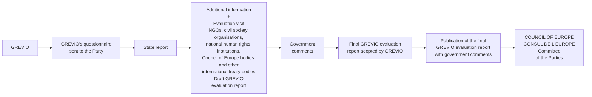

# 6th GENERAL REPORT ON GREVIO’S ACTIVITIES

photo: group of GREVIO experts

covering the period from January to December 2024

## G R E V I O
Group of Experts on Action against Violence against Women and Domestic Violence

COUNCIL OF EUROPE
logo: Council of Europe
CONSEIL DE L'EUROPE

---

# 6th GENERAL REPORT ON GREVIO’S ACTIVITIES

GREVIO
Group of Experts on
Action against Violence
against Women and
Domestic Violence

covering the period from
January to December 2024

Council of Europe

---

French Edition :
6ᵉ rapport général
sur les activités du GREVIO

The reproduction of extracts (up to 500 words) is authorised, except for commercial purposes as long as the integrity of the text is preserved, the excerpt is not used out of context, does not provide incomplete information or does not otherwise mislead the reader as to the nature, scope or content of the text. The source text must always be acknowledged as follows “© Council of Europe, year of the publication”. All other requests concerning the reproduction/translation of all or part of the document, should be addressed to the Directorate of Communications, Council of Europe (F-67075 Strasbourg Cedex or publishing@coe.int). All other correspondence concerning this document should be addressed to the Violence against Women Division, Directorate General of Democracy and Human Dignity, Council of Europe.

Documents and Publications Production Department (DPDP), Council of Europe,
Cover Photo: Council of Europe
Photos: Council of Europe, Latvian Government, Shutterstock

© Council of Europe, May 2025
Printed at the Council of Europe

---

# Contents

**FOREWORD BY MARIA-ANDRIANI KOSTOPOULOU, PRESIDENT OF GREVIO** 5
**ACTIVITIES** 10
Introduction 10
GREVIO meetings 11
Evaluation visits and procedures 13
Working groups 14
HUDOC-GREVIO database 15
**MEMBERSHIP AND BUREAU** 16
**SIGNATURES AND RATIFICATIONS OF THE CONVENTION** 18
Signatures and developments regarding the application of the Istanbul Convention 18
Reservations 18
**COMMUNICATION** 20
Publications 20
Participation in events 25
Online HELP course on violence against women 26
**10TH ANNIVERSARY OF THE ENTRY INTO FORCE OF THE ISTANBUL CONVENTION** 28
**FOCUS SECTION: A SHRINKING SPACE FOR WOMEN’S RIGHTS DEFENDERS** 33
Introduction 33
Legal instruments for the protection of human rights defenders 35
GREVIO’s findings on women’s rights defenders 38
**RELATIONS WITH THE COMMITTEE OF THE PARTIES** 49
**CO-OPERATION WITH OTHER COUNCIL OF EUROPE BODIES AND INSTITUTIONS** 51
Committee of Ministers 51
Parliamentary Assembly 52
Congress of Local and Regional Authorities 54
Commissioner for Human Rights 55
European Court of Human Rights 56
Gender Equality Commission 59
The Co-operation Unit of the Gender Equality Division 60
Steering Committee for the Rights of the Child 60
**CO-OPERATION WITH CIVIL SOCIETY AND NATIONAL INSTITUTIONS**
**FOR THE PROTECTION OF HUMAN RIGHTS** 62
Role of NGOs and civil society, including national human rights institutions 62
**CO-OPERATION WITH INTERNATIONAL ORGANISATIONS** 65
United Nations 65
Platform of Independent Expert Mechanisms on Discrimination and Violence against Women (EDVAW Platform) 66
European Union 68
Organization for Security and Co-operation in Europe (OSCE) 69
**CONCLUDING REMARKS** 70

► Page 3

---

<table>
<tr><td>APPENDIX 1 – LIST OF GREVIO ACTIVITIES BETWEEN JANUARY AND DECEMBER 2024</td><td>72</td></tr>
<tr><td>APPENDIX 2 – TIMELINE OF GREVIO’S BASELINE EVALUATION PROCEDURE (2016-2027)</td><td>73</td></tr>
<tr><td>APPENDIX 3 – PROVISIONAL TIMETABLE OF GREVIO’S FIRST THEMATIC EVALUATION ROUND PROCEDURE ON THE THEME “BUILDING TRUST BY DELIVERING SUPPORT, PROTECTION AND JUSTICE” (2023-2028)</td><td>75</td></tr>
<tr><td>APPENDIX 4 – SIGNATURES AND RATIFICATIONS OF THE COUNCIL OF EUROPE CONVENTION ON PREVENTING AND COMBATING VIOLENCE AGAINST WOMEN AND DOMESTIC VIOLENCE</td><td>77</td></tr>
<tr><td>APPENDIX 5 – LIST OF GREVIO MEMBERS</td><td>79</td></tr>
<tr><td>APPENDIX 6 – GREVIO’S SECRETARIAT (FROM JANUARY TO DECEMBER 2024)</td><td>80</td></tr>
<tr><td>APPENDIX 7 – WORKFLOW OF THE MONITORING MECHANISM</td><td>81</td></tr>
</table>

4 ► 6th General Report on GREVIO’s activities

---

photo: Maria-Andriani Kostopoulou

GREVIO President Maria-Andriani Kostopoulou

# Foreword by
## Maria-Andriani Kostopoulou,
## President of GREVIO

It is an honour for me as the President of the Group of Experts on Action against Violence against Women and Domestic Violence (GREVIO) to introduce the 6th general report on GREVIO’s activities, which covers the period from January to December 2024. The year 2024 marked the 10th anniversary of the entry into force of the Council of Europe Convention on Preventing and Combating Violence against Women and Domestic Violence (the Istanbul Convention) and provided us with a great opportunity to take stock of the progress made by the parties to the convention and to identify a number of issues that require continued attention and more efficient measures.

We have thus seen 10 years of action, a decade during which the Istanbul Convention has offered a solid legal basis to parties and has guided them on how to provide holistic responses and achieve better results. I can say with conviction that there is a “before” and an “after” the Istanbul Convention.

For example, before, there were many countries that provided support services for victims of violence, at least to some extent. Now it is a legal obligation to do so for parties to the convention, according to standards that place women’s rights and needs at the centre. While there are still challenges in several parties, we are also seeing progress in many places regarding women’s access to such services and regarding the forms of violence covered. Ten years ago, there were only a few countries in Europe that criminalised rape on the basis of a lack of consent. Now,

► Page 5

---

more and more national legislators are moving away from a force-based definition to a consent-based approach, progressively aligning law with women’s lived reality. There is still a need to strive for comprehensive implementation of criminal codes, but this positive development has been linked to growing access to justice for women victims of sexual violence.

Before the Istanbul Convention entered into force, the legal possibility to evict domestic abusers from their own homes existed in some places, but this was far from a European standard. The convention elevated this to a legal obligation, and the past few years have seen its introduction in many countries. Although GREVIO may find fault with the level of implementation or with the sanctions for breaches imposed, or with the fact that such orders may not swiftly be followed up by longer-term protection orders that also include children, it is important to take in the paradigm shift this stands for: women and child victims of domestic violence are to remain safe in their own homes. This is “my home is my castle” re-appropriated for women and children who, because of the regime of abuse, manipulation and control they have experienced, need stability to rebuild their lives.

Also, before the Istanbul Convention, there was of course some level of policy making on violence against women, but now there is the obligation to set up a national co-ordinating body to identify lacunae and to monitor and evaluate existing policies. These bodies now exist in nearly all parties to the convention. The Istanbul Convention has helped to establish entities whose sole role is to ensure good policy making, implementation and evaluation on the various forms of violence against women. GREVIO will continue to provide further guidance in this respect.

It is important to acknowledge these and many other achievements in the field of combating violence against women, but it is equally vital to identify where responses are lagging behind risks and needs and what must be further addressed and improved. The GREVIO reports offer valuable insights, highlighting areas that require immediate action and at the same time providing tailor-made guidance to national authorities.

Indeed, a considerable body of expertise is concentrated not only in GREVIO’s baseline evaluation reports but also in the thematic evaluation reports that address the theme of “Building trust by providing support, protection and justice”. The thematic evaluation cycle aims to provide further input for more efficient implementation of the convention and assesses the progress made since the baseline evaluation in relation to the 19 articles under review. An innovative feature of GREVIO’s thematic evaluation reports is the section entitled “Emerging trends in the areas of violence against women and domestic violence”. For each country report, these sections offer reflections on wider trends in the implementation of the convention that transcend the article-by-Article analysis, pointing both to progress and setbacks as well as to worrying developments in terms of an increase in particular forms of violence against women and girls.

Undoubtedly, the journey towards ending violence against women is a long one. Occasionally, the sea may be calm and the journey smooth. Often enough though, it is undulating and even tempestuous. But a calm sea never made a skilled sailor. Political will is of vital importance and countering violence against women must remain

Page 6 ► **6th General Report on GREVIO’s activities**

---

high on the political agenda. Violence against women is not just like any offence but a serious human rights violation, the root causes of which are deeply anchored in social and cultural structures and the norms and values that govern society.

Hardships are painful but often have silver linings and it is through unity that meaningful progress can be achieved. Parties to the convention can thus rely on the extensive monitoring mechanism established by the convention, which serves as a beacon that illuminates the path towards making a real difference on the ground.

It is in the above spirit that my colleagues in GREVIO – Laura Albu, Guillaume Barbe, María Rún Bjarnadóttir, Pascale Franck, Päivi Hirvelä, Marie-Claude Hofner, Ivo Holc, Olena Kharytonova, Helmut Tichy, Ellen O’Malley-Dunlop (second Vice-President), Pille Tsopp-Pagan, Aleid Van den Brink (first Vice-President), Grzegorz Wrona and Angelina Zaporojan-Pirgari – and myself continue the work of GREVIO, by delivering specific guidance to parties on how to navigate through complex issues. I am particularly grateful for my colleagues’ devotion, work and commitment. They come from a variety of professional backgrounds – all of them internationally recognised experts in their respective fields – and I can proudly say that the multidisciplinary expertise of GREVIO’s members presents an added value to the interpretation of the convention’s provisions.

On the frontline of the fight against violence against women stand the women’s rights defenders. Their actions have always been instrumental in shaping the agendas and challenging discriminatory law and prejudicial norms and practices. The convention acknowledges the key role that women’s rights NGOs play in the field. It requires the authorities to recognise, encourage and support, at all levels, the work of NGOs and civil society combating violence against women and to establish effective co-operation with these organisations.

In its monitoring work, GREVIO has had occasion to highlight positive developments in this regard, for example in cases where national authorities tap into the expertise of women’s rights NGOs or involve them in the design and implementation of policies to prevent and combat violence against women. That being said, there have been several findings where GREVIO has identified shortcomings in the support that women’s rights NGOs receive or even worrisome trends that go as far as stifling the women’s movement. The shrinking space for civil society organisations has a negative impact on all organisations, but it hits women’s organisations particularly hard. Therefore, in light of its findings, GREVIO took the decision to dedicate this year’s focus section to the “shrinking space for women’s rights defenders”. This focus section serves as a reminder and re-acknowledgement of the crucial role of the women’s rights defenders and sends a strong message about the multiple challenges that they face and the need for authorities to take action.

The global context of regression on women’s rights is leading to a reduction in opportunities for women’s rights organisations to participate in policy making on violence against women and to the side-lining of their expertise. There are also concerns that women’s rights NGOs may face particular financial hardships, intimidation, threats and attacks as a result of their political stance or the criticism they may articulate for government policies. This is a serious threat to freedom of expression – one of

**Foreword by Maria-Andriani Kostopoulou, President of GREVIO ►** Page 7

---

the essential foundations of a democratic society. GREVIO has been alerted to such occasions during its evaluation visits.

Moreover, GREVIO has stressed in its report how important it is to ensure that specialist support provision remains in the hands of those providers who have the relevant experience and who comply with the principles of the Istanbul Convention. We are seeing more and more tendering procedures that do not prioritise quality and expertise and the recognition of violence against women as a gendered phenomenon. The women’s movement has long been at the forefront of service provision for victims and their expertise and decades of experience must be recognised according to the convention. They must have a seat at the table when policies are discussed and made and their voices must be heard. We are increasingly concerned about examples of women’s rights organisations being side-lined or not involved, or other organisations taking over simply because they submitted lower bids. The shrinking space for women to speak out and call attention to the root causes of violence against women is something that GREVIO is also concerned about.

The presence of a strong and autonomous feminist movement and freedom of human rights defenders to exercise their activities are critical factors to drive implementation of the Istanbul Convention across all parties and ultimately to promote change in the area of violence against women. Maintaining a safe and enabling environment and strengthening the protection of women’s human rights defenders fall squarely within the scope of the convention.

Beyond this focus section, this 6th General Report also presents the wide range of GREVIO activitiesin a number of areas of the convention. During 2024, GREVIO not only engaged in a number of evaluation visits and the approval or adoption of reports but also adopted the “Questionnaire on legislative and other measures giving effect to the provisions of the Council of Europe Convention on Preventing and Combating Violence against Women and Domestic Violence as adapted for the European Union”. This was a momentous step, preceding the launch of the GREVIO baseline evaluation in respect of the EU.

In parallel, GREVIO continued to hold exchanges of views with the second pillar of the monitoring mechanism of the convention, the Committee of the Parties, aiming to further the implementation of its findings through an open and fruitful dialogue. Enhancing synergies with the European Court of Human Rights and other Council of Europe bodies and institutions has been another important item on the agenda of GREVIO, as was the co-operation with civil society, national human rights institutions and international organisations. Moreover, GREVIO continued its joint action with the Platform of Independent Expert Mechanisms on Discrimination and Violence against Women (the EDVAW Platform), a platform that comprises seven United Nations and regional independent expert mechanisms on violence against women and women’s rights operating at the international and regional levels. The platform adopted for the first time an action plan for its activities, resting on three core pillars: strengthening the EDVAW Platform, increasing its visibility and engaging in joint advocacy.

As shown in the activity report, 2024 was another productive year for GREVIO, a year full of achievements and developments but one that also gave us the opportunity to take stock of the progress made and to shed light on the various areas where more

8 ► **6th General Report on GREVIO’s activities**

---

action is needed at national level. I would like to thank again my colleagues for their tireless work and support. In addition, I would like to express my sincere gratitude to the Secretariat to the convention. The Executive Secretary, Johanna Nelles, and all members of the Secretariat are our companions on this journey, and nothing would have been achieved without their precious support and work. It is so important to always acknowledge the valuable contributions of all these amazing people that, each in their own way, give their best to this common effort. My thanks also go to the staff of the Council of Europe at all levels. Unity is our strength, and it is through collective action that we can more efficiently fight violence against women.

I hope you enjoy reading the report!

**Foreword by Maria-Andriani Kostopoulou, President of GREVIO** ► Page 9

---

photo: GREVIO meeting participants

34th GREVIO meeting, Strasbourg, France, 15-18 October 2024

# Activities

## ~~Introduction~~

1. GREVIO, the Group of Experts on Action against Violence against Women and Domestic Violence, is the independent body established under Article 66 of the Council of Europe Convention on Preventing and Combating Violence against Women and Domestic Violence (Istanbul Convention; CETS No. 210) that is tasked with monitoring the convention. GREVIO is composed of 15 independent and impartial experts who have expertise in the field of violence against women and are of high moral character. Their term of office is four years, renewable once. At the European level, GREVIO is currently the only independent panel of experts monitoring the implementation of binding international legal provisions in the area of violence against women.

2. GREVIO launched its first (baseline) evaluation procedure in spring 2016, after adopting a questionnaire on legislative and other measures giving effect to the Istanbul Convention in its entirety. Working on a country-by-country basis, GREVIO carries out a first (baseline) evaluation of each country that has ratified the convention. Since 2023, GREVIO has been undertaking its first thematic evaluation procedure, focusing on the theme of “Building trust by delivering support, protection and justice”. For both the baseline evaluation and the first thematic evaluation round, GREVIO initiates the procedure by addressing a questionnaire to the party

► Page 10

---

concerned, inviting the authorities to respond by way of a comprehensive report in which all the relevant issues raised by the questionnaire should be addressed. While the questionnaire for the baseline evaluations covered all articles of the convention, the questionnaire was adapted to the focused scope of the first thematic evaluation round and thus covers 19 articles of the convention, including the development of policies to prevent and combat violence against women and their financing; data collection; the prevention of gender-based violence; the support for and protection of victims; consideration of situations of violence against women in child custody and access decisions; prohibition of alternative dispute resolution; investigation, prosecution and conviction rates; risk assessment and protective measures; and emergency restraining and protection orders.

3. In addition to the information provided by the parties, GREVIO also collects information from various other sources, including non-governmental organisations (NGOs), other members of civil society, national human rights institutions, Council of Europe bodies (Parliamentary Assembly, Human Rights Commissioner and other pertinent bodies) and other international treaty bodies. After analysing the state report, GREVIO carries out an evaluation visit to the party concerned and subsequently draws up its draft evaluation report. The draft report is discussed in a GREVIO meeting and, following its approval by all GREVIO experts, it is sent to the relevant national authorities for comments. Following the receipt and consideration of these comments, GREVIO adopts the final report. GREVIO’s evaluation report is made public on the Istanbul Convention website, together with any final comments received from the state party concerned. The Committee of the Parties, which is the other body involved in the monitoring process and that is composed of the representatives of the parties to the convention, subsequently receives GREVIO’s reports and may adopt, on the basis of GREVIO’s conclusions, recommendations addressed to each of the parties.

## ~~GREVIO meetings~~

4. In 2024, GREVIO held three meetings: its 32nd meeting in March, its 33rd meeting in June and its 34th meeting in October. Much of its meeting time was dedicated to discussions on the new thematic evaluation reports drawn up under the theme of “Building support by delivering support, protection and justice”. The first set of these new reports were discussed and adopted in their draft version at GREVIO’s 32nd meeting. These included reports on Austria, Albania and Monaco. Further thematic evaluation reports were discussed at GREVIO’s 33rd meeting in June, focusing on Denmark, Finland, Montenegro, Spain and Sweden, again in their first reading. All eight reports were subsequently approved in their final version and published between September and December 2024. They focus closely on the advancements made in the implementation of the convention’s provisions in relation to the four pillars in as far as they contribute to instilling a sense of trust and protection in victims: prevention, protection, prosecution and comprehensive policies. By highlighting progress made in these areas since the baseline evaluation procedure, they show the level of engagement with GREVIO’s previous findings and offer insights into important developments.

**Activities** ► Page **11**

---

5. An innovative feature of GREVIO’s thematic evaluation reports is the section entitled “Emerging trends in the areas of violence against women and domestic violence”. For each country report, these sections offer reflections on wider trends in the implementation of the Istanbul Convention that transcend the article-by-article analysis, pointing both to progress and setbacks as well as to worrying developments in terms of an increase in particular forms of violence against women and girls. Among the positive trends is the important progress made in terms of the alignment of legislation with the requirements of the Istanbul Convention in many parties. This is linked to a growing trend towards improvements in access to justice for women, notably for victims of sexual violence, with more and more parties complying with the requirement of the Istanbul Convention in the area of rape legislation and the need to introduce a consent-based definition of rape in criminal law. This positive trend, however, needs to be seen in the context of the growing rates of sexual violence perpetrated among younger and younger age groups, often in peer settings, an alarming trend identified by GREVIO. In several of its reports, GREVIO offered reflections on the impact of growing levels of consumption of violent pornography by young people, including children, without the ability to contextualise or comprehend it, pointing to increasingly harmful impacts where access to contextualised discussions around sexuality, gender equality, non-stereotyped gender roles, mutual respect, gender-based violence against women and the right to personal integrity is limited. In another alarming trend, GREVIO identified the increasing exposure of women and girls to violence against women in its digital dimension, whether this is image-based abuse, online stalking or through technology, or sexual harassment online.

6. In parallel, GREVIO’s baseline evaluation procedures continued in relation to those parties that had not yet undergone this procedure. In January 2024, GREVIO carried out its baseline evaluation visit to the United Kingdom and subsequently drew up its baseline evaluation report for its first reading at its 34th meeting in October.

7. In addition, GREVIO adopted its 5th General Report of Activities, at its 33rd meeting in June, covering the period from January to December 2024. It includes a thematic focus section that provides an overview of approaches taken in parties to the Istanbul Convention regarding risk assessment and risk management in preventing and combating violence against women and domestic violence. Over the course of its evaluation procedures, GREVIO identified different approaches to risk assessment and management, ranging from the systematic use of internationally recognised risk-assessment tools to less standardised approaches, insufficient emphasis placed on their use, or the existence of tools developed to suit the national context with insufficient recognition for important red flags such as the perpetrator’s possession of firearms.

8. During its 32nd meeting in March 2024, GREVIO engaged in exchanges of views with Ms Carlien Scheele, Director of the European Institute for Gender Equality (EIGE) on possible synergies and co-operation. Ms Scheele gave a presentation on the impact of their work with particular focus on the Gender Equality Index and the work of EIGE in fields such as cyberviolence on social media.

Page 12 ► **6th General Report on GREVIO’s activities**

---

9. During its 34th meeting in October 2024, GREVIO held an exchange of views with Judge Ivana Jelić, Vice-President of the European Court of Human Rights, and Judge Davor Derenčinović from the Court, aimed at taking stock of progress in the cross-fertilisation between the Istanbul Convention and the European Convention on Human Rights. Judge Jelić presented the Court’s case law and discussed the aspect of discrimination against women in recent judgments, while Judge Derenčinović spoke about the “double fortification” of human rights provided by the joint effect that the Istanbul Convention and the European Convention on Human Rights have when applied in synchronicity. Both exchanges prompted in-depth discussions on themes of common interest and showed the interrelatedness of GREVIO’s work with important human rights entities.

photo: Exchange of views with the European Court of Human Rights

Exchange of views with the European Court of Human Rights

## ~~Evaluation visits and procedures~~

photo: Evaluation visit to Italy, October 2024

Evaluation visit to Italy, October 2024

10. In 2024, GREVIO carried out a baseline evaluation visit to the United Kingdom and thematic evaluation visits to Finland, France, Italy, Montenegro, the Netherlands, Portugal, Serbia, Spain and Sweden. The duration of these visits varied, depending on the size of the party visited, ranging from five to eight days.

11. Through its meetings with state and civil society actors held during these visits, GREVIO was able to assess the situation on the ground in relation to the measures taken by the parties under review in relation to preventing and combating violence against women. Many visits included on-site meetings at specialist support services for women victims of violence, such as domestic violence shelters, counselling services, and rape crisis and sexual assault referral centres, as well as at police stations and centres for social work. While baseline evaluation visits seek to ensure fact-finding in

**Activities** ► Page **13**

---

relation to all aspects of the Istanbul Convention, thematic evaluation visits focus specifically on the theme of “Building trust by providing support, protection and justice”. Emphasis is placed on assessing progress made since the baseline evaluation in relation to the 19 articles under review and identifying specific trends in relation to violence against women.

12. GREVIO’s evaluations are organised on the basis of provisional timetables for the baseline and for the first thematic evaluation procedure covering the period 2023-2028 (see Appendices 2 and 3). During the period under review, GREVIO also initiated nine first thematic evaluation procedures in relation to Andorra, Belgium, Malta, the Netherlands, Poland, Romania, San Marino, Serbia and Slovenia. It also initiated its baseline evaluation procedure in relation to Latvia. State reports were received from six parties (Andorra, Belgium, Malta, San Marino, the Netherlands and Serbia) in 2023, while the deadline for the remainder of the parties was set for 2024.

photo: Evaluation visit to Serbia

Evaluation visit to Serbia, October 2024

cedures in relation to Andorra, Belgium, Malta, the Netherlands, Poland, Romania, San Marino, Serbia and Slovenia. It also initiated its baseline evaluation procedure in relation to Latvia. State reports were received from six parties (Andorra, Belgium, Malta, San Marino, the Netherlands and Serbia) in 2023, while the deadline for the remainder of the parties was set for 2024.

### ~~Working groups~~

13. Following the ratification of the Istanbul Convention by the European Union (EU) on 28 June 2023 (with entry into force on 1 October 2023) and in line with Rule 46 of GREVIO’s Rules of Procedure, allowing GREVIO to set up working groups to carry out its duties, GREVIO decided at its 31st meeting to establish the Working Group on GREVIO’s evaluation of the EU (the working group). The working group was tasked to reflect on and agree the modalities and timeline for GREVIO’s evaluation of the EU’s compliance with the provisions of the convention. It was equally tasked with developing a draft questionnaire to be used for GREVIO’s evaluation of the EU, subject to GREVIO’s approval. The working group was composed of four GREVIO members, Maria-Andriani Kostopoulou (GREVIO President), Laura Albu, Olena Kharytonova and Helmut Tichy, appointed by GREVIO and supported by three members of the Secretariat of the Istanbul Convention Monitoring Mechanism, and was given a renewable mandate until December 2025. The working group held several online meetings in the course of 2024 and submitted a draft “Questionnaire on legislative and other measures giving effect to the provisions of the Council of Europe Convention on Preventing and Combating Violence against Women and Domestic Violence (Istanbul Convention) as adapted for the European Union” to GREVIO (the EU Questionnaire), which was adopted by GREVIO on 18 October 2024 at its 34th plenary meeting.

14. The questionnaire is an adaptation of the original baseline evaluation questionnaire adopted by GREVIO on 11 March 2016 that accounts for the differences between states parties and the EU as a supranational organisation. The adapted questionnaire, therefore, reflects the same articles and pillars of the convention addressed in the original questionnaire, with no additional questions introduced. Nonetheless, it asks the EU to provide information only on those areas where the

Page **14** ► **6th General Report on GREVIO’s activities**

---

EU has competence to act through legislative, policy, strategic or other measures. The questionnaire, upon receipt, shall be used by the European Union as a basis for its report on legislative and other measures giving effect to the provisions of the convention as provided for under its Article 68, paragraph 1, which it shall submit to GREVIO at the end of 2025.

## HUDOC-GREVIO database

**15.** The HUDOC-GREVIO database enables public users to access and search for documents published by GREVIO. The database is regularly updated and directly accessible from the Istanbul Convention homepage and the HUDOC database of the European Court of Human Rights.

16. The main objective of this database is to allow users to search for key documents emanating from the monitoring mechanism of the Istanbul Convention using various filters and key words and thus retrieve relevant information.

17. The following types of documents are available in the HUDOC-GREVIO database, in English and/or French:

* GREVIO baseline evaluation reports and related final government comments;

* GREVIO thematic evaluation reports and related final government comments;

* government comments on evaluation reports;

* recommendations issued by the Committee of the Parties;

* government responses to the recommendations issued by the Committee of the Parties;

* conclusions issued by the Committee of the Parties;

* government responses to the conclusions issued by the Committee of the Parties;

* thematic sections of the general reports on GREVIO’s activities;

* GREVIO general recommendations.

18. The database continues to be widely used as a public source for all documents published by GREVIO and saw an increase in its use of 61% in 2024.

**Activities** ► Page 15

---

photo: GREVIO members at the 34th GREVIO meeting

GREVIO members, 34th GREVIO meeting, Strasbourg, France, 15-18 October 2024

## Membership and Bureau

19. GREVIO’s mandate and composition requirements are set out in Article 66, para- graphs 1 and 2, of the Istanbul Convention and further expanded on in Resolution CM/Res(2014)43 of the Committee of Ministers on rules on the election procedure of the members of the Group of Experts on Action against Violence against Women and Domestic Violence (GREVIO). Article 66 provides that GREVIO shall have between 10 and 15 members, depending on the number of parties to the convention, and that it shall take into account a gender and geographical balance, as well as multi- disciplinary expertise in the area of human rights, gender equality, violence against women and domestic violence, or in the assistance to and protection of victims. GREVIO members should therefore be nationals of states parties to the convention, be nominated by them and elected by the Committee of the Parties for a four-year term, renewable once.

20. The first 10 GREVIO members were elected on 4 May 2015, for a term of four years. The ratification of the Istanbul Convention by Germany on 12 October 2017 brought the total number of ratifications to 25, triggering the procedure to fill the remaining five seats on GREVIO. The Committee of the Parties subsequently elected, at its fifth meeting on 24 May 2018, five additional members, with a mandate of four years starting on 1 September 2018.

21. Since then, membership has remained at 15, with elections held by the Committee of the Parties each time one or more mandates came to an end. Since the latest changes to the composition of GREVIO in 2023, representing a significant renewal in membership, no changes have occurred.

► Page **16**

---

22. Elected in June 2023 as President of GREVIO, Maria-Andriani Kostopoulou continued to serve in this role in 2024 together with first Vice-President Aleid van den Brink and second Vice-President Ellen O’Malley-Dunlop, also serving since June 2023. The Bureau has taken an active role in setting the agenda for GREVIO meetings and in representing GREVIO externally.

**Membership and Bureau** ► Page 17

---

photo: Ratification document of the Istanbul Convention as prepared by the Government of Latvia

Ratification document of the Istanbul Convention as prepared by the Government of Latvia
© Laura Celmiņa, Ministry of Foreign Affairs of the Republic of Latvia

# **Signatures and ratifications** **of the convention**

## <u>**Signatures and developments regarding**</u> ~~**the application of the Istanbul Convention**~~

23. As of 31 December 2024, there were a total of 39 ratifications of the Istanbul Convention (38 parties and the European Union) and seven signatures not followed by ratification. Despite some incremental steps taken in some Council of Europe member states towards ratification and interest regularly expressed by non member states invited to accede, no new developments in terms of the convention’s ratification have taken place.

## ~~Reservations~~

24. The possibility for parties to enter reservations to the convention is strictly regulated under its Article 78. To promote uniformity in the parties’ level of implementation of their obligations, the convention aims to encourage them to consider withdrawing and/or reviewing their reservations. Besides foreseeing the possibility for parties to withdraw their reservations at any time by a declaration addressed to the Secretary General of the Council of Europe (Article 78, paragraph 4), Article 79 subjects reservations to a limited period of validity (five years from the entry into force of the convention in respect of the party concerned) and to a system of compulsory renewal (Article 79, paragraphs 1 and 2). Moreover, the convention provides that any party that makes a reservation is under the duty to provide GREVIO with an explanation for the grounds justifying its continuance, before its renewal or upon request (Article 79, paragraph 3).

▶ Page **18**

---

25. At its 19th meeting held in November 2019, GREVIO decided that it would review the information provided by the party on the reasons for upholding the reservation and assess the situation in the area covered by the reserved article/provision in the context of the country assessment. If after such a review, GREVIO identifies an inadequate response to violence against women in terms of a significant lack of protection, prevention or prosecution as a result of the reservation, GREVIO may invite the party under evaluation to consider revoking the reservation.

26. In the course of 2024, several parties made declarations regarding their earlier reservations. While some parties upheld their reservations, several withdrew or only partially upheld these. For example, Andorra notified the Secretary General on 25 April 2024 of its decision to uphold its earlier reservation with regard to Article 30, paragraph 2. Ireland, on 28 March 2024 communicated its intention to renew its earlier reservation on Article 31, paragraph 2, while withdrawing its reservation on Article 44, paragraph 3. The reservations put forward by Malta, for which the period of five years expired in 2024, have automatically been extended for six months, pursuant to Article 79, paragraph 2 of the convention. In December 2024, Switzerland issued its notification of withdrawal of its reservation in relation to Article 59 with effect from January 2025.

27. The reservation previously put in place by North Macedonia was not extended during 2024, after it lapsed on 1 January 2024.

28. Last, Sweden decided to fully maintain its previous reservations regarding Article 44, paragraph 3, and Article 58. Denmark communicated its decision to renew its reservation on Article 44, paragraph 3, while the validity of its reservation retaining the right to provide for non-criminal sanctions, instead of criminal sanctions, for the behaviour referred to in Article 34 of the Convention was automatically extended. However, both parties renewed their reservations without providing an explanation to GREVIO, as per the requirement in Article 79, paragraph 3, of the Istanbul Convention. Following a debate by GREVIO at its 33rd meeting on the importance of explanations for the renewal of reservations, GREVIO decided to request the Secretariat to issue letters to all parties that fail to provide reasons upon the renewal of their reservations, reminding them of their obligation stemming from Article 79, paragraph 3. In April 2024, Greece provided GREVIO with reasons for renewing, in October 2023, its reservation on Article 44, paragraphs 1(e), 3 and 4.

**Signatures and ratifications of the convention** ► Page 19

---

photo: person holding a GREVIO thematic evaluation report on Finland

# Communication

## ~~Publications~~

### GREVIO evaluation reports

29. In accordance with Article 68, paragraph 11, of the Istanbul Convention, GREVIO reports are made public as from their adoption, together with any comments by the party concerned. Following the initiation of the first thematic evaluation procedure in 2023, eight GREVIO thematic evaluation reports were published in 2024, in respect of Austria, Monaco, Albania, Spain, Montenegro, Sweden, Finland and Denmark (in order of publication), and are available on the Istanbul Convention website. A press release is issued whenever a report is published and press conferences may be held and interviews given by GREVIO members and the Secretariat in order to provide information on the report and evaluation process. On the occasion of the publication of the thematic evaluation report on Finland, GREVIO presented its monitoring results on Finland at a press conference in Helsinki, followed by an event with national experts to launch the report, marking also the 10th anniversary of the entry into force of the Istanbul Convention. This in-person presentation to the media and an expert audience served as an important platform for the dissemination of GREVIO’s findings and resulted in important media coverage (*Yle’s Swedish-language TV channel (13’20-15’30), Yle’s radio channel*).

► **20**

---

30. Upon publication, GREVIO evaluation reports have attracted considerable media interest, raising awareness and visibility of their findings. For example, the GREVIO report on Austria received significant coverage by national news, including in *Der Standard*, *ORF*, *Die Presse*, *Salzburger Nachrichten*, *Puls 24* and *Die Nachrichten*, and by international news as well, such as *Agence Europe* and *ANSA*. Similarly, the GREVIO report on Spain received extensive coverage by national news, including in *El Periódico*, *La Nueva España*, *Publico/EFE*, *Europea Press/Teleprensa*, *El Triangle*, *Cadena Ser*, *20 Minutos*, *La Republica/ACN* and *The European Times*. The media underlined the adoption of positive legal and policy measures, including the Multiannual Joint Plan on Violence Against Women (2023-2027). In Montenegro, national media outlets (RTCG, CDM, Actuelno, AntenaM, Vijesti, Press, RTNK, N1), focused on the urgent need to address gender stereotypes, improve investigations and prosecutions, and enhance victim protection. Finally, international and national media drew attention to the publication of GREVIO thematic evaluation reports on Denmark (*Mirage News*, *FINCHANNEL*, *vudailleurs.com*) and on Sweden (*FermPers*, *VIA TT*, *ETC*).

**5th General Report on GREVIO’s activities**

photo: 5th General Report on GREVIO's activities cover

31. GREVIO published its 5th General Report on 15 October 2024, covering its monitoring work from January to December 2023. It extends and elaborates on GREVIO’s previous general reports, addressing GREVIO’s activities, composition and communications, encompassing its co-operation with other Council of Europe bodies and institutions and external stakeholders, the latter including organisations such as the United Nations and the European Union, as well as with NGOs and civil society.

32. The 5th General Report included a new theme in its focus section: the role and importance of risk assessment and risk management in preventing and combating

violence against women. The focus section underscores the critical role of systematic, evidence-based risk assessment in protecting victims of violence against women and domestic violence, as emphasised in Article 51 of the Istanbul Convention. These assessments must evaluate key risk factors, such as firearm possession, prior abuse and coercive control, in order to identify immediate dangers and enable swift intervention. The focus section also highlights the importance of victim-centred and dynamic risk management, ensuring that safety is prioritised in all protective measures.

33. Linked to this is the requirement for multi-agency approaches to interventions, which enhances co-ordination between law-enforcement agencies, social services, specialist support services and the healthcare sector to develop tailored safety plans for high-risk victims, reducing the likelihood of re-victimisation. Accountability and consistency in risk-assessment practices are crucial, particularly in cases involving lethal threats. Further emphasising the need to protect children exposed to domestic violence, the focus section underscores the importance of incorporating risk assessment and screening into custody and visitation decisions to prevent further harm.

**Communication** ► Page 21

---

# Study on safe and effective perpetrator programmes

photo: Guidance for safe and effective perpetrator programmes: Article 16 of the Istanbul Convention A comparative study and recommendations on programmes for perpetrators of domestic and sexual violence

34. In June 2024, a new publication was launched, providing an overview of existing models and approaches for programmes for perpetrators and their results. It responds to the need for such analysis stated in the Declaration on the Prevention of Domestic, Sexual and Gender-Based Violence (Dublin Declaration) adopted by 38 member states of the Council of Europe in September 2022.1 The signatories to this declaration had specified the need to “identify promising practices and develop guidelines for the operation of perpetrator programmes to ensure baseline quality standards in line with the principles of the Istanbul Convention”, notably a victim-centred approach that focuses on ensuring victims’ safety and support and full respect for their human rights.

35. The study, entitled “Guidance for safe and effective perpetrator programmes: Article 16 of the Istanbul Convention”, highlights the importance of establishing effective programmes for perpetrators of domestic and sexual violence, in line with the principles of the Istanbul Convention, and provides a comparative analysis of existing models across member states. The aim is to improve understanding of the effectiveness of these programmes and share best practices.

36. It provides an overview of existing models and approaches to programmes for perpetrators of domestic and sexual violence, along with their outcomes. The study highlights promising practices and identifies common challenges in the design and implementation of such programmes. Targeted at decision makers, policy makers, service providers and practitioners, it offers practical recommendations for the safe and effective implementation of perpetrator programmes.

37. The study features two key sections. The first part examines programmes for perpetrators of domestic violence, focusing on legal and policy frameworks, identifying various service providers and emphasising the importance of ensuring victim safety. It offers practical guidance on designing and implementing these programmes effectively. The second section addresses programmes targeting perpetrators of sexual violence, including those committed against adults and children. This part also considers interventions for young people displaying harmful sexual behaviour. Both sections conclude with checklists designed to help stakeholders implement and evaluate perpetrator programmes.

38. Finally, the publication provides a valuable resource for cross-border collaboration and knowledge sharing among member states. It underscores the importance of developing consistent, evidence-based practices to tackle domestic and sexual violence while holding perpetrators accountable. It also stresses the need for

1. Council of Europe (2022), Declaration of Council of Europe Ministers on the Prevention of Domestic, Sexual and Gender-Based Violence, available at: [https://rm.coe.int/dublin-declaration-sept-2022/1680a85149](https://rm.coe.int/dublin-declaration-sept-2022/1680a85149).

Page 22 ► **6th General Report on GREVIO’s activities**

---

co-ordination between criminal justice systems, social services and support networks to ensure the effective rehabilitation of perpetrators and the protection of victims.

# Communication around the International Day for the Elimination of Violence against Women

39. The United Nations designated 25 November as the International Day for the Elimination of Violence against Women, aiming to promote global awareness of all forms of violence against women. This date also initiates the “16 days of activism against gender-based violence”, which run until 10 December (Human Rights Day) and represent a period committed to actively addressing and eradicating violence against women and girls on a global scale through different actions. In 2024, as in previous years, GREVIO engaged in various initiatives to shed light on a range of aspects that require attention to prevent and combat violence against women.

40. Prior to this important date, GREVIO’s President Maria-Andriani Kostopoulou participated in an exchange of views with the Gender Equality Commission of the Council of Europe on 21 November 2024. On this occasion, she emphasised the progress made in implementing the Istanbul Convention, the need for stronger prevention and legal frameworks and the growing concern over violence against women in the digital sphere, highlighting the importance of cross-sectoral collaboration to address these issues.

41. At another meeting, the inauguration of the Council of Europe network of specialised lawyers and NGOs assisting women victims of violence on 22 November 2024, the GREVIO President exchanged with lawyers in private practice and those representing women victims through specialist support services on the importance of the Istanbul Convention. She presented on the theme “The role of *lex specialis* human rights conventions and their monitoring in strategic litigation: the example of the Istanbul Convention”. The network is open to lawyers from all Council of Europe

photo: Inaugural meeting of the Network of specialised lawyers and NGOs assisting women victims of violence

Inaugural meeting of the Network of specialised lawyers and NGOs assisting women victims of violence, Strasbourg, France, 22 November 2024

**Communication** ► Page **23**

---

member states and is to serve as a knowledge-sharing platform for strategic litiga- tion on violence against women. In this context, the findings from GREVIO’s baseline and thematic evaluation procedures provide useful background information and are frequently referenced in case law from the European Court of Human Rights.

42. In addition to the activities of the president around 25 November, GREVIO members and the Secretariat participated in a range of activities at national level, raising the profile of the Istanbul Convention and the monitoring work by GREVIO. Among these was an international gathering on violence against women organised by the City of Strasbourg (“Les assises européennes de lutte contre les violences faites aux femmes”), which aimed to provide knowledge and understanding of the issues at stake in Europe’s response to violence against women. Pascale Franck, member of GREVIO, presented to an international audience of experts, followed by a workshop for the general public given by the Secretariat. Visibility of the Istanbul Convention was high, generated not only through publications and speeches but with the help of photography. The exhibition “Through the lens – a decade of the Istanbul Convention”, prepared by the Violence against Women Division to offer a visual rendition of core articles of the convention and examples of their implementation, was shown for the duration of the event, which attracted over 2 000 visitors.

photo: Photography exhibition Through the Lens - A decade of the Istanbul Convention

„Photography exhibition „Through the Lens - A decade of the Istanbul Convention“, displayed by the City of Strasbourg in November 2024

43. Moreover, on 25 November 2024, Council of Europe Secretary General Alain Berset issued a statement highlighting the ongoing progress in addressing violence against women since the entry into force of the Istanbul Convention, while emphasising the need for further efforts, particularly in adopting a legal definition of rape based on freely given consent and tackling emerging issues like online sexual harassment.

44. During the 16 days of activism, The Council of Europe’s main accounts on X, LinkedIn and Instagram, as well as the @CoE_Women X account, ran awareness-raising messages on violence against women generally and highlighted the relevance of the

Page 24 ► **6th General Report on GREVIO’s activities**

---

Istanbul Convention and GREVIO’s work specifically in the context of the 10th anniversary of its entry into force (see below). With more than 50 posts and over 50 000 impressions, this communication effort showed the impact of GREVIO’s tailor-made and country-specific assessments and engaged the public through key messages.

45. The messages were disseminated using powerful hashtags such as #IstanbulConventionSavesLives, #endVAW and #16DaysofActivism, or #ConventiondIstanbul and #ViolencesSexuelles for the French-speaking audience, amplifying their reach and increasing visibility, encouraging a global conversation on the importance of combating gender-based violence against women.

screenshot_from_computer: Council of Europe Women empow.. .. - Nov 24, 2024 .. 10 Years, 10 pictures! Starting 25 Nov and during the #16DaysOfActivism, we will unveil 10 powerful photos celebrating a decade of the #IstanbulConvention. Each image tells a story of progress, advocacy & challenges in combating VAW. Stay tuned to discover them all! •• #EndVAW THROUGH THELENS A DECACE OF COMMITVENTTO THE SITMERA COREITIONS .75. Q t714 O 20 sld 1.7K □I

## ~~Participation in events~~

46. In the period under review, GREVIO members and the Secretariat participated in over 100 events in various countries around Europe, with some events also taking place in the USA, Kazakhstan and Benin. These included conferences, seminars, online events, study visits and congresses organised by a variety of stakeholders, including Council of Europe bodies, the United Nations, the European Union, national ministries, embassies, permanent representations, courts, civil society and academic institutions. The events addressed a wide array of topics, ranging from sexual violence and perpetrator programmes to the role of family courts in ensuring safety after domestic violence through child custody decisions and emerging issues and future directions for gender equality and women’s rights. While some events aimed at general presentations of the Istanbul Convention and GREVIO’s role in its monitoring, others catered to specific audiences on specific topics, or constituted specialist training activities for judges, for example. The number and variety of requests for representation by GREVIO has continuously grown over the past years. A few examples are provided in the following paragraphs.

47. Guillaume Barbe presented on the added value of the Istanbul Convention during an outreach activity organised with the support of the French Embassy in Benin. Addressing all parliamentarians in Benin during an event organised in May 2024, he explained the importance of the Istanbul Convention, its set of standards and its monitoring mechanism consisting of GREVIO and the Committee of the Parties.

48. Ellen O’Malley-Dunlop, second Vice-President of GREVIO, presented insights from GREVIO’s monitoring of the issue of child contact decisions after domestic violence to an audience of practitioners and academics attending a conference organised by the University of Oxford entitled “The family justice response to domestic abuse: a six-country empirical study of the experiences of survivors, judges, lawyers and court-appointed experts”.

**Communication** ► Page 25

---

49. Maria-Andriani Kostopoulou, President of GREVIO, participated in an international conference on sexual violence on 4 October 2024, in Matera, Italy, organised by Women free from Violence, an NGO recently set up by former GREVIO members. In her presentation, she examined how the Istanbul Convention, particularly through the efforts of GREVIO, addressed not only sexual violence per se but also the crucial 

 issue of consent – a fundamental pillar of justice and gender equality.

photo: Maria-Andriani Kostopoulou at a conference

Maria-Andriani Kostopoulou, President of GREVIO, Matera, Italy

50. The GREVIO President also participated actively as a speaker in several hearings organised by the Council of Europe Parliamentary Assembly, for example a hearing held in June 2024 in Riga, Latvia, on the topic of the role of parliamentarians in implementing and monitoring the Istanbul Convention.

~~**Online HELP course on violence against women**~~

51. The Council of Europe Programme on Human Rights Education for Legal Professionals (HELP) aims to enhance and improve the capacity of all legal professionals – judges, lawyers and prosecutors – in all Council of Europe member states and beyond. Its key goal is to encourage legal professionals to apply 

 photo: woman looking out a window 

 Violence Against Women and Domestic Violence 

 HELP HUMAN RIGHTS EDUCATION FOR LEGAL PROFESSIONALS 

 logo: Council of Europe 

 European human rights standards in their daily work, through free and accessible online courses on human rights topics. The HELP course on violence against women, created in 2017, has been continuously adapted into a growing number of national versions and officially launched for different types of legal professionals, including law students. The course has been gradually implemented in the learning curricula of national institutions providing training for the judiciary and other categories of legal professionals. So far, the course has seen a total of 13 669 enrolments and 4 369 individuals completing it since its introduction. Of these, 712 individuals enrolled and 495 completed it in 2024 alone. The course is currently available in 28 languages.

52. In 2021, the online course “Violence against women and domestic violence for law enforcement” was added to the HELP online catalogue, offering law-enforcement professionals the opportunity to learn theoretical and practical concepts related to violence against women, its many forms and impacts on victims and society at large. The course also provides guidelines on how to respond to cases of violence against women and domestic violence, quickly and effectively, including techniques for

Page 26 ► **6th General Report on GREVIO’s activities**

---

interviewing victims and perpetrators and practical steps that should be followed by first responders, investigators and other stakeholders who work to combat violence against women and domestic violence and to protect victims. Since its inception, the course has seen 3 049 individuals completing it in the 11 languages it is now available in. The numbers of enrolment and completion are steadily increasing and stood at 3 062 enrolments, with 1 382 completing the course by the end of 2024.

**Communication** ► Page **27**

---

illustration: A diverse group of people holding banners celebrating the 10th anniversary of the Istanbul Convention

## **10th anniversary of the** **entry into force of the** **Istanbul Convention**

53. On 1 August 2014, the Istanbul Convention entered into force following its 10th ratification. Since then, many more ratifications have followed, bringing the number of states parties to 38. In addition, in 2023, the European Union acceded to the convention. The monitoring work of GREVIO began two years after entry into force and has already led to the adoption of 36 baseline evaluation reports and eight reports under its first thematic evaluation procedure.

54. Nearly all parties to the Istanbul Convention have benefited from the tailor-made guidance provided by GREVIO, and much progress in the implementation of the Istanbul Convention has been made. A prime example of the advances made is the alignment of legislation with the requirements of the Istanbul Convention, notably in the area of criminal law. Consent-based definitions of rape and sexual violence have been introduced in many parties, in some cases despite initial hesitations about this shift in paradigm. Image-based abuse and online stalking are being criminalised more widely, and inspiration is being sought from GREVIO’s General Recommendation No. 1 on the digital dimension of violence against women to address the growing concern of online and technology-facilitated violence against women. Efforts in investigation and prosecution are being sparked by the introduction of new criminal offences that are specific to the digital manifestations of violence against women.

► Page 28

---

55. Progress has also been made in the number and types of national policy documents such as action plans or strategies on violence against women. Many now address the phenomenon entirely on the basis of the provisions of the Istanbul Convention, with definitions fully aligned with convention standards. Other national policy documents have been strengthened in terms of their comprehensiveness, moving beyond a focus on domestic violence to more holistic responses to violence against women. Efforts to integrate the issue of violence against women into programmatic policy aims in relation to women with disabilities, minority women and Roma women are emerging, as are, in some countries, efforts to address the specific experiences of LBTI women when providing responses to domestic violence and other forms of violence against women.

56. In some countries, financial resources for policy measures as well as for specialist support services for women and girls have been stepped up. Many parties to the Istanbul Convention have introduced, for the first time, sexual assault referral or rape crisis centres, offering victims of rape and sexual assault state-of-the art forensic services as well as DNA storage options together with medical care and trauma support, irrespective of their willingness to report. Gaps in terms of the quantity and quality of specialist service provision are beginning to close in several parties, although domestic violence shelter capacity is still lacking in many. These efforts are frequently accompanied by training initiatives, notably for law-enforcement officers but also social workers and healthcare professionals. Innovative practices are emerging that ensure initial training of relevant professionals by embedding violence against women in mandatory course content featuring in university curricula.

photo: woman browsing brochures on a display rack

### “United around gender equality: making space for women and girls”: a conference celebrating the Istanbul Convention

57. To celebrate these achievements and to mark the milestone of a decade of action around the implementation of the Istanbul Convention, a conference was organised on 30 May 2024 by the Council of Europe under the aegis of the Lithuanian Presidency of the Committee of Ministers, that served both as the annual conference of the Gender Equality Commission and an occasion to mark the 10th anniversary of the Istanbul Convention. Entitled “United around gender equality:

photo: conference attendees in a large hall

**10th anniversary of the entry into force of the Istanbul Convention** ► Page 29

---

making space for women and girls”, the conference highlighted the political will of Council of Europe member states, as expressed in the Reykjavik Declaration “United around our values” and through the new Council of Europe Gender Equality Strategy 2024-2029, which includes preventing and combating violence against women and girls.

58. The afternoon session of the conference showcased the transformative impact of the Istanbul Convention. Ambassador Tanja Gonggrijp, Chair of the Committee of the Parties, opened the session alongside Maria-Andriani Kostopoulou, President of GREVIO, and Darian Pavli, Judge at the European Court of Human Rights. The conference’s centrepiece was the panel “Impact of the Istanbul Convention in practice”, which examined the practical application of the Istanbul Convention through testimonies from professionals illustrating its influence on professional practice across Europe, as identified through the monitoring by GREVIO. The broader policy framework was explored in contributions from experts such as Feride Acar, the first President of GREVIO, and representatives of Women against Violence Europe (WAVE Network), the Government of Switzerland and the Government of France, offering strategies for strengthening efforts to combat violence against women. The session concluded with remarks by Marja Ruotanen, Director General of Democracy and Human Dignity, who emphasised the need for continued political commitment.

photo: conference session

### Photography exhibition: “Through the lens: a decade of commitment to the Istanbul Convention”

59. On the occasion of this celebration, a photo exhibition was opened, offering 10 visual interpretations of core standards of the Istanbul Convention. The exhibition entitled “Through the lens: a decade of commitment to the Istanbul Convention” offered one image per year of the convention’s existence. Each image showcased a practical example of the convention’s implementation, such as a specialist support service for victims of sexual violence, a training session for law students on the Istanbul Convention, a family judge handling a case of child contact after domestic violence, women’s rights organisations supporting women with experiences of gender-based violence, and law-enforcement officers and their role in issuing emergency barring and protection orders.

60. The achievements in terms of the implementation of the Istanbul Convention were illustrated through the lens of photography, with the images not only documenting the milestones achieved but also serving as a reminder of the work that lies ahead to prevent and combat violence against women.

61. Subsequent to the initial launch of the exhibition on the occasion of the conference marking the 10th anniversary of the convention, the photo collection was later revealed image by image in digital format online as part of the Council of Europe’s contribution to the 16 Days of Activism against Gender-based Violence. It

Page 30 ► **6th General Report on GREVIO’s activities**

---

photo: ON TE CROIT sign

photo: protest scene

photo: group discussion

photo: conference room

logo: THROUGH THE LENS A DECADE OF COMMITMENT TO THE ISTANBUL CONVENTION

photo: bedroom interior

photo: person working at desk

icon: QR code with headphones

photo: two women talking

photo: medical examination

photo: building entrance

photo: person playing game

was widely run on social media and subsequently was made public in its entirety on the Istanbul Convention website. It offers an enhanced experience for visitors because of the audio narration by Maria-Andriani Kostopoulou, President of GREVIO, which was added to offer viewers more information on GREVIO and its work and is accessible through a QR code. The exhibition is available as a travelling exhibition and may be booked via the Istanbul Convention website.

62. In view of the importance of the topic, the photography exhibition was on display in the Council of Europe’s main building, the Palais de l’Europe, from 18 November to 13 December 2024, in recognition of the International Day for the Elimination of Violence against Women on 25 November and as part of the 16 Days of Activism on Gender-based Violence. Viewers were also invited to engage with the exhibition by leaving messages next to the pictures, contributing to a collective show of support and solidarity. All messages were collected and screened by the Violence against Women Division and made available to GREVIO.

photo: person taking photo of exhibition

**10th anniversary of the entry into force of the Istanbul Convention** ► Page **31**

---

# Testimonies on the impact of the Istanbul Convention and GREVIO’s monitoring work

63. Using video formats in addition to photography, a video series was developed to show, through video testimonies from government officials and other professionals, examples of the convention’s impact. The videos feature insightful interviews with representatives from Denmark, France, Finland, Moldova, Romania and Switzerland, highlighting the challenges faced, the measures taken and the positive outcomes of strengthening their policies and approaches to preventing and combating violence against women on

photo: Jeppe Schmidt speaking in a video interview

Jeppe Schmidt, Ministry of the Interior, Police Department, speaking on the impact of the Istanbul Convention in Denmark

the basis of the Istanbul Convention. Several of these testimonies refer to the positive impact of the findings presented by GREVIO to the authorities in its baseline evaluation reports. They underscore the importance of the tailor-made guidance provided by GREVIO and ultimately the inherent value of independent monitoring.

# Event: “Meet the GREVIO President on the occasion of the 10th anniversary of the Istanbul Convention’s entry into force”

64. Last in the series of events and communication efforts around the 10th anniversary of the convention, the GREVIO President, on 21 November 2024, offered behind-the-scenes insights into GREVIO’s work and progress on the implementation of the Istanbul Convention at an internal meeting for Council of Europe staff and members of permanent representations to the Organisation. The informal manner of the session provided a unique opportunity for participants to gain insights into the role and work of GREVIO, to hear the president’s reflections on the convention’s impact over the past decade and witness her personal commitment to advancing its implementation.

Page 32 ► **6th General Report on GREVIO’s activities**

---

photo: women's rights demonstration

# Focus section: a shrinking space for women’s rights defenders

## ~~Introduction~~

65. Women’s rights defenders often work on the frontline, challenging patriarchal norms, traditional gender roles and discriminatory laws. Advocacy around violence against women and the provision of support and protection for victims of gender-based violence form an important aspect of their work. Their contribution to the implementation of international legal standards on women’s rights, such as the United Nations Convention on the Elimination of all Forms of Discrimination against Women (UN CEDAW Convention) and the Istanbul Convention is vital. For this reason, formal recognition of this essential role, notably in the context of preventing and combat-ing violence against women, is expressed in Article 9 of the Istanbul Convention.

66. Since the entry into force of the Istanbul Convention in 2014, GREVIO has been monitoring the level of such recognition in practice. In its 36 baseline evaluation reports published to date, it has seen varying degrees of recognition and partnership, with the level of involvement of NGOs in policy making, their overall support, recognition and funding opportunities ranging from comprehensive to minimal. Variation not only exists across the different parties to the convention, but frequently also within, as funding for NGOs and priorities in service provision for victims often fall within the competence of local authorities and municipalities. There is also great variation in terms of funding and support from the authorities per type of NGO. GREVIO has frequently found, in its baseline evaluation reports, that

► Page 33

---

NGOs that provide support services for women and girls from specific communities, such as migrant women, or for specific experiences of gender-based violence, such as “honour-related” violence, forced marriage or female genital mutilation (FGM), experience difficulties when seeking formal recognition and partnership with the authorities or in accessing public funding. In many instances, structural barriers and complex bureaucracy around funding opportunities prevent them from competing with non-specialist entities that lack the specific experience that grassroots or community-based organisations typically offer. It is important to guarantee service provision for all forms of violence against women that is specialist and of high quality and that places the rights and needs of women victims at their centre and works towards their empowerment.

67. Each of GREVIO’s reports on its general activities to date has provided a snapshot of the situation of women’s rights NGOs working to end violence against women, revealing a mixed picture, with on the one hand positive practices ranging from consultative processes embodied in policy making to increases in state funding for some NGOs, and on the other hand, challenges where co-operation between state actors and specialist support services was lacking, leading to increasing isolation of women’s NGOs in their daily work. A decline in co-operation and dialogue with specialist organisations as well as in their involvement in political processes, together with decreasing funding opportunities, was observed in many of these snapshots.2

68. While the implementation of the Istanbul Convention requires robust action from state authorities, it also envisages a strong role for women’s rights organisations, including those emanating from grassroots movements and those operating on feminist principles. In recent times, however, GREVIO has noted a growing number of developments that seem to reduce, rather than expand, the space in which such women’s rights organisations operate. As funding opportunities dry up or become inaccessible to certain NGOs, as competition with non-specialist and for-profit organisations rises and as individual examples of legal consequences for activism around women’s rights come to light, it is important to shine a light on the environment in which women’s rights organisations in Europe, especially those operating on feminist principles, engage with state authorities, advocate women’s rights and provide support services and counselling for women and girls who are victims of gender-based violence.

69. This focus section therefore covers the theme of a shrinking space for women’s rights defenders, which is to be seen in light of the 2023 commitment of Heads of State and Government of the Council of Europe member states, as expressed in the Reykjavik Declaration, to supporting and maintaining a safe and enabling environment for civil society.3 In view of the obligation, under the Istanbul Convention, to recognise the essential role of women’s rights NGOs and specialist women’s support services in preventing and combating violence against women, there is great need to foster an enabling environment that allows these organisations to operate freely

2. 5th General Report on GREVIO’s activities, paragraph 122; 3rd General Report on GREVIO’s activities, paragraph 125.

3. United around our values – Reykjavik Declaration, 4th Summit of Heads of State and Government, 2023, p. 16, available at: [www.edoc.coe.int/fr/le-conseil-de-l-europe-en-bref/11619-united-around-our-values-reykjavik-declaration.html#](https://edoc.coe.int/fr/le-conseil-de-l-europe-en-bref/11619-united-around-our-values-reykjavik-declaration.html).

Page **34** ► **6th General Report on GREVIO’s activities**

---

and effectively, including by ensuring the long-term sustainability of their activities – and their safety.

70. As defenders of women’s human rights, women’s rights NGOs working on violence against women fall under the scope of protection of many international and regional policy documents that deal with human rights defenders. The Council of Europe’s Committee of Ministers has defined human rights defenders as “anyone who, individually or with others, acts to protect or promote human rights, regardless of his/her profession or other status” and has also confirmed that “national human rights institutions (NHRIs) and civil society organisations working for the protection and promotion of human rights are human rights defenders”.4 This definition is in line with the first major international document dedicated to the topic, the 1998 United Nations General Assembly Declaration on Human Rights Defenders.5

photograph: ~~Legal instruments for the protection~~ of human rights defenders

71. Internationally and regionally, the concern around human rights defenders and their contribution to the global human rights agenda has given rise to the adoption of a number of legal instruments. This section presents the most important of these instruments, starting with instruments adopted by the Council of Europe.

## Council of Europe instruments for the protection of human rights defenders

72. The protection of human rights defenders is a priority for the Council of Europe. Following several early recommendations and resolutions by the Committee of Ministers on the status of institutions such as ombudsperson offices and NHRIs, the Heads of State and Government first agreed in 2005 that the Council of Europe should play a dynamic role in protecting the right of individuals to actively defend human rights and promoting the engagement of non-governmental organisations to the same end.6 In 2008, the Committee of Ministers adopted the Declaration on Council of Europe action to improve the protection of human rights defenders and promote their activities,7 followed by the 2017 Guidelines for civil participation in political decision making, which aim to provide a solid basis for governments and civil society to work together to strengthen democracy.8 The value of “the work of all human rights defenders, including NHRIs and civil society organisations, which each make important contributions to an environment of respect for and the active promotion of human rights” was further acknowledged in the 2018 recommendation of the Committee of Ministers to member states on the need to strengthen the

4. Committee of Ministers Recommendation CM/Rec(2018)11 on the need to strengthen the protection and promotion of civil society space in Europe, preamble, paragraph 14.

5. Declaration on the Right and Responsibility of Individuals, Groups and Organs of Society to Promote and Protect Universally Recognized Human Rights and Fundamental Freedoms, A/RES/53/144, 1998.

6. Action plan adopted at the 3rd Council of Europe Summit in Warsaw 2005, CM(2005)80, section 2.

7. Decl(06/02/2008), adopted on 6 February 2008.

8. CM(2017)83, adopted on 27 September 2017.

**Focus section: a shrinking space for women’s rights defenders ► Page 35**

---

protection and promotion of civil society space in Europe.9 In this recommendation, women human rights defenders were explicitly mentioned for the first time, as the Committee of Ministers expressed “grave concern about the considerable and increasing number of allegations and reports of threats of a serious nature, risks and dangers faced by human rights defenders, including women human rights defenders, online and offline, and the prevalence of impunity for violations and abuses against them”.10 The recommendation further called on member states to “ensure women human rights defenders are able to access specific support, funding and protection, including against gender-based violence, and guarantee an environment in which they can work free from violence and discrimination”.11

73. Five years later, at the 4th Council of Europe Summit in 2023 in Reykjavik, the Heads of State and Government reaffirmed their commitment to “step up and strengthen the Council of Europe’s engagement with democratic actors in Europe and its efforts to create an enabling environment for human rights defenders”, albeit without specifically mentioning women.12

74. The Council of Europe Parliamentary Assembly, in particular through its Committee on Legal Affairs and Human Rights, has been monitoring the situation of human rights defenders since 2006, with the mandate of a General Rapporteur on the situation of human rights defenders created in 2018. The Assembly also adopted four resolutions and recommendations on strengthening the protection of human rights defenders in Council of Europe member states, in 2009, 2012, 2016 and 2018. Most recently, in 2024, the Parliamentary Assembly adopted its first resolution specifically dedicated to women’s human rights defenders, acknowledging that they “face multiple challenges and risks” and “are often threatened and attacked for what they do, for the ideas they promote and for who they are or who they are perceived to be”.13 It further notes that “the rise in populism and misogyny has a negative impact on the work of women human rights defenders in Europe” and that “anti-gender movements see them as a threat because they challenge the so-called ‘traditional vision’ of women in society”.14 In this resolution, the Assembly reiterated the responsibility of states to provide an enabling environment for women human rights defenders and to ensure their protection.

75. The protection of human rights defenders and the development of an enabling environment for their activities also fall within the scope of the Council of Europe Commissioner for Human Rights.15 Activities included a round table held by the Commissioner in 2022 with human rights defenders from Council of Europe member states, and the 2024 publication of a recommendation on ending repression of human rights defenders assisting refugees, asylum seekers and migrants in Europe. In addition, the Commissioner has addressed the situation of individual human

9. Recommendation CM/Rec(2018)11, adopted on 28 November 2018.
10. Ibid., preamble.
11. Ibid., III.b.
12. Reykjavik Declaration adopted at the 4th Council of Europe Summit in Reykjavik 2023, CM(2023)57, paragraph 25.
13. Resolution 2554, adopted on 25 June 2024, paragraph 3.
14. Ibid., paragraph 4.
15. Resolution (99) 50 on the Council of Europe Commissioner for Human Rights.

Page 36 ► **6th General Report on GREVIO’s activities**

---

rights defenders in several statements, including most recently a women’s rights defender in Andorra, against whom criminal proceedings were launched following her reporting to the United Nations Committee on the Elimination of Discrimination against Women and to the media on the obstacles women and girls face in enjoying their human rights in Andorra. In her statement, the Commissioner emphasised that this had a chilling effect on the work of human rights defenders, as well as on others who stand up for the rights of women and girls in Andorra.16

76. Last, the importance of strengthening the protection of human rights defenders is underscored by the procedure available at the level of the Private Office of the Secretary General for investigating alleged reprisals against them because of their interaction with the Council of Europe. Introduced in 2018 and subsequently revised, it allows for external direct reporting by human rights defenders and non-governmental organisations in addition to Council of Europe entities. Allegations of reprisals will be assessed and proposals for follow-up action made. Information on the types of cases brought to the attention of the Secretary General is subsequently compiled in a report to the Committee of Ministers annually.

## Other relevant international and regional instruments for the protection of human rights defenders

## United Nations (UN)

77. Following up on the above-mentioned 1998 UN Declaration on Human Rights Defenders, the UN General Assembly adopted several resolutions regarding its promotion and implementation.17 One of these resolutions, in 2013, was specifically dedicated to women human rights defenders and expressed grave concern that “women human rights defenders are at risk of and suffer from violations and abuses … of their fundamental rights to life, liberty and security of person, to psychological and physical integrity, to privacy and respect for private and family life and to freedom of opinion and expression, association and peaceful assembly”. The resolution further acknowledged that “the rights of some women human rights defenders are violated or abused and their work stigmatized owing to discriminatory practices and those social norms or patterns that serve to condone violence against women or perpetuate practices involving such violence”.18 In addition, the Human Rights Council adopted numerous resolutions on human rights defenders.19

78. The Human Rights Council further established the mandate of a Special Rapporteur on the situation of human rights defenders in 2000. Two mandate holders have since dedicated their annual reports to the specific challenges women’s rights

16. Statement published on 29 November 2023, available at: www.coe.int/en/web/commissioner/-/andorra-guarantee-the-right-to-freedom-of-expression-for-women-s-rights-defender-vanessa-mendoza-cort%C3%A9s-and-ensure-an-enabling-environment-for-women-s-rights-defenders.

17. See, for example, Res. 66/164 of 19 December 2011, Res. 70/161 of 17 December 2015, Res. 72/247 of 24 December 2017, Res. 74/146 of 18 December 2019 and Res. 76/174 of 16 December 2021, Res. 78/216 of 19 December 2023.

18. Res. 68/181 of 18 December 2013, preamble.

19. See, for example, Res. 13/13 of 25 March 2010, Res. 22/6 of 21 March 2013, Res. 31/32 of 24 March 2016, Res. 34/5 of 23 March 2017, Res. 40/11 of 21 March 2019 and Res. 43/16 of 22 June 2020.

**Focus section: a shrinking space for women’s rights defenders ► Page** 37

---

defenders face. The 2011 report was the first to focus exclusively on the situation of women human rights defenders and those working on women’s rights or gender issues, emphasising the need to recognise the specific nature and seriousness of the violations against them and provide gender-specific protection. The 2019 report followed up on this issue, also focusing on the additional gendered risks and obstacles women human rights defenders face and recognising their important role in the promotion and protection of human rights.

79. At the level of United Nations treaty bodies, the San José Guidelines aim at providing practical guidance to enhance the efficiency and effectiveness with which protection is provided by treaty bodies to individuals and groups at risk of or facing intimidation or reprisals for seeking to co-operate or co-operating with United Nations human rights treaty bodies. They were borne out of recognition for increasing instances of intimidation and reprisals for individuals co-operating with UN treaty bodies and set out the core functions of the focal points within treaty bodies to address this issue and take action.

## Organization for Security and Co-operation in Europe (OSCE)

80. In a joint effort to address the issue of protection for human rights defenders, the Council of Europe, together with the OSCE, issued Joint Guidelines on Freedom of Association, explicitly covering human rights defenders. These were jointly published in 2014 by the European Commission for Democracy through Law of the Council of Europe (Venice Commission) and the Office for Democratic Institutions and Human Rights (ODIHR) of the Organization for Security and Co-operation in Europe (OSCE).

81. In addition, the 2014 ODIHR/OSCE Guidelines on the Protection of Human Rights Defenders contribute to an enhanced understanding of the need to protect human rights for all and are based on OSCE commitments. They are informed by key international instruments relevant to the protection of human rights defenders, in particular the UN Declaration mentioned above. In a report on the challenges faced by human rights defenders in the OSCE region in the period 2014-2016, specific examples of women’s human rights defenders silenced or hindered in their work are listed, including women’s rights organisations providing services for domestic violence victims.

## ~~GREVIO’s findings on women’s rights defenders~~

82. Against the backdrop of international legal standards, principles and guidelines for the protection of human rights defenders, many of which specifically reference the vulnerabilities and gender-related experiences of women human rights defenders, GREVIO’s findings from its monitoring work offer important insights into the situation on the ground for those who provide assistance, counselling or legal representation to women and girls for experiences of gender-based violence. In many instances these are women human rights defenders, working for human rights organisations, legal aid

photo: women marching in a protest

Page 38 ► **6th General Report on GREVIO’s activities**

---

offices, advocacy organisations or counselling services. In many more instances, these are women’s rights defenders, because they specifically advocate advances on women’s right to live free from gender-based violence, notably on the basis of the Istanbul Convention.

83. Their work is increasingly coming under scrutiny because of the rise of anti-rights and anti-feminist movements, which is leading to increasing opposition to fundamental principles of human rights and to vocal opposition to the core aims and principles of the Istanbul Convention as the most far-reaching legally binding instrument to prevent and combat violence against women and domestic violence. In its 1st General Report on GREVIO’s Activities, GREVIO elaborated on the contestations and objectives levelled at the convention in its focus section, and its president at the time, Feride Acar, in her foreword, exposed these as “reactionary currents” that target women’s equality with men and impede or slow down the convention’s ratification and implementation.

84. The selection of findings from the first set of thematic evaluation reports drawn up under the theme of “Building support by delivering protection, support and justice”, published in 2024 and discussed below, demonstrate that these impediments persist and may be growing in some parties to the convention. The global context of regression on women’s rights is leading to a reduction in opportunities for women’s rights organisations to participate in policy making on violence against women, to the side-lining of their expertise and to a shrinking space in which to operate and advocate a strong implementation of the Istanbul Convention. It is also leading to instances in which women’s rights advocates are being silenced and intimidated, or their organisations’ funding reduced. On more than one occasion during evaluation visits, women’s rights advocates and organisations have shared with GREVIO delegations their concern that expressing their point of view may negatively impact their funding in the future or may cost them their seat at the table. This overall development is particularly felt by activists and organisations that focus on the situation of LBTI women and girls, as well as those representing women and girls at particular risk of intersecting forms of discrimination because of their residence status, their migrant background or their disability, to name but a few.

85. The presence of a strong and autonomous feminist movement, however, is a critical factor to drive implementation of the Istanbul Convention across all parties and to promote policy change in the area of violence against women. It is also an indicator of a safe and enabling environment conducive to human rights work generally and to the promotion and effective implementation of women’s rights specifically. It is in this context that the findings below and concerns expressed in some of GREVIO’s baseline evaluation reports, as well as in its first thematic evaluation reports published in 2024 and summarised, must be seen.

# Silencing and intimidation of NGOs and individual women activists, including journalists

86. Women’s rights defenders often face violence, threats and misogynistic and gendered hate speech for their work. The current climate of regression on women’s rights emboldens discourses that question the need for further action on women’s

**Focus section: a shrinking space for women’s rights defenders ► Page 39**

---

rights and attitudes that deny the existence of violence against women and the need for action to address it. Among the emerging trends identified by GREVIO in its thematic evaluation report on Spain, it listed a growing discourse denying the existence of violence against women and calling into question the need for policies to promote gender equality and to combat violence against women in Spain – a phenomenon that can be witnessed in the context of wider attempts to roll back on women’s rights in many countries, but that GREVIO has observed as impacting negatively on gender equality gains in Spain.20

87. In a 2023 survey on the situation of women human rights defenders around the globe conducted by Kvinna till Kvinna, 75% of the respondents stated that they or their organisation have been harassed or threatened (online and/or offline) in the past few years because of their work – an increase of 15% on the previous survey in 2021.21 In its baseline evaluation reports, GREVIO has presented examples of such intimidation and regression. For example, women’s rights groups and civil society actors in Poland had drawn GREVIO’s attention to the increasing atmosphere of mistrust, fear and uncertainty resulting from the omnipresent risk of downscaling or closing services and the perceived lack of constructive institutional dialogue and co-operation.22 In addition, statements made by some national or local officials targeting NGOs and civil society representatives, and the police raids on four women’s rights NGOs in the context of the All Poland Women’s Strike in 2016, had had a chilling effect on many women’s rights activists, which had been amplified by smear campaigns against some.23 Furthermore, GREVIO had noted with grave concern that the harmful discourse on the basis of misinterpretations of the Istanbul Convention had contributed to diverting attention from the acute need to improve specialist support provision and primary prevention of the different forms of violence against women, among other issues.24 In its baseline evaluation report on Serbia, GREVIO had noted the growing isolation in which several women’s rights NGOs operated as well as the lack of political support.25 It had emphasised the particular level of isolation of and lack of support and funding for NGOs advocating the rights of Roma women, and had pointed to an erosion of trust resulting from contracts being awarded to non-specialist entities rather women’s rights organisations with decades of experience.26 In its baseline evaluation report on Georgia, GREVIO had expressed concern over the threats and aggression that women human rights defenders, including those providing specialist support services for and advocacy around violence against women, were facing from society, often with high degrees of impunity.27 It had noted that they were very likely to become victims of sexual violence, threats and defamation, and that not enough had been done by the authorities to address the situation.28

20. See GREVIO’s first thematic evaluation report on Spain, paragraph 7.
21. The state of women human rights defenders 2023, Kvinna till kvinna, p. 9.
22. See GREVIO‘s baseline evaluation report on Poland, paragraph 44.
23. Ibid.
24. Ibid.
25. See GREVIO’s baseline evaluation report on Serbia, paragraph 35.
26. Ibid, paragraph 36.
27. See GREVIO’s baseline evaluation report on Georgia, paragraph 55.
28. Ibid.

Page 40 ► **6th General Report on GREVIO’s activities**

---

88. In all three instances, GREVIO had called for new approaches to be found to ensure active government support and recognition of independent women’s specialist support services as required by Article 9 of the Istanbul Convention, and to involve them as partners in the institutional response to all forms of violence against women.

89. Women’s rights defenders may also experience intimidation and attempts to silence their voices through the use of defamation laws or other legal procedures, including in connection with their co-operation with women’s human rights treaty bodies.29 The case of *Giardi v. San Marino* (Application No. 13935/23) brought before the European Court of Human Rights in March 2023 concerned a woman human rights defender who had met with GREVIO in the course of its baseline evaluation procedure in 2020 and had provided information on the situation of violence against women in San Marino. In 2022, the San Marino Parliament mandated the government to launch an investigation concerning allegations of having provided false information to GREVIO, with the possibility of criminal pursuit should a crime have been committed. The government saw no elements to warrant an investigation and considered the matter closed. Ms Giardi’s complaint to the European Court of Human Rights was made under Article 10 regarding the possible interference with her right to freedom of expression, in that the decision by the San Marino Parliament had a chilling effect on her as a woman and a member of civil society, regardless of the investigation being closed. In her application to the Court, the applicant had specifically emphasised that the underlying aim of the measure was to intimidate lawyers and activists alike from pursuing the defence of human rights by, *inter alia*, assisting monitoring bodies. The case was struck out of the list of cases by the Court on 10 October 2024 after a friendly settlement between the applicant and the government had been reached, in which San Marino undertook to pay Ms Giardi €4 000 for pecuniary and non pecuniary damage, costs and expenses.30

90. Last, it is important to mention the growing digital dimension of violence against women’s rights defenders or against those women and girls who express their opinion publicly in their capacity as journalist, politician or other. In its first thematic evaluation report on Finland, GREVIO found that 48% of women reported experiencing digital violence, and that there was a concerning rise in online violence and sexist hate speech targeting women in public life. The country’s female-led government between 2019 and 2023 was subjected to widespread misogynistic online harassment, while female journalists faced systematic and extensive online smear campaigns. Moreover, the growing influence of anti-gender movements exacerbated digital violence, particularly targeting women’s rights organisations and their representatives, often extending these threats beyond the online realm into physical spaces.

29. See the case addressed by the Commissioner for Human Rights in her statement on 29 November available at: www.coe.int/en/web/commissioner/-/andorra-guarantee-the-right-to-freedom-of-expression-for-women-s-rights-defender-vanessa-mendoza-cort%C3%A9s-and-ensure-an-enabling-environment-for-women-s-rights-defenders. In January 2024, the woman human rights defender was acquitted of all charges.

30. See [www.hudoc.echr.coe.int/fre?i=001-237613](http://www.hudoc.echr.coe.int/fre?i=001-237613).

**Focus section: a shrinking space for women’s rights defenders ► Page 41**

---

# Lack of inclusion of civil society expertise in policy design, implementation and evaluation of measures

91. As already identified in several of its baseline evaluation reports, the eight thematic evaluation reports by GREVIO published in 2024 have consistently observed the need for parties to step up their measures to assure the adequate inclusion of NGOs at the level of policy design and evaluation. Despite some progress, numerous parties continue to assign merely a marginal role for NGOs in this regard as detailed below, impeding the formulation of policy that can comprehensively address violence against women and promote substantive change in a holistic manner as required by the Istanbul Convention.

92. For this reason, Article 7, paragraph 3, of the Istanbul Convention sets out the requirement to involve all relevant actors, including national human rights institutions and civil society organisations, in efforts taken to adopt and implement coordinated policies for the implementation of the convention. This is in articulation of the requirement under Article 9 to ensure their recognition and support. In keeping with its line adopted during its baseline evaluation procedure, GREVIO consistently stressed in its thematic evaluation reports that a holistic response to violence against women must involve the effective collaboration and inclusion of all relevant actors, including women’s rights NGOs operating nationally, regionally and locally, to ensure diversity and to create policies built around the experiences of all women and girls.

## Insufficient NGO involvement in policy design

93. In its thematic evaluation reports adopted throughout the course of 2024, GREVIO noted that, overall, the opportunities for NGOs to influence policy design remained limited. For instance, in its report on Finland, GREVIO welcomed the establishment of a working group within the NAPE Committee (the Committee for Combating Violence against Women and Domestic Violence) serving as the national co-ordinating body. However, the role of NGOs within this body remained largely advisory.31 GREVIO made similar findings in its report on Albania, where NGO involvement in the design of policies remained in an advisory capacity and was largely symbolic.32 In Austria, while GREVIO acknowledged the government’s strong expression of political support to the Istanbul Convention and its implementation at national level, GREVIO emphasised the need to implement a consultative process with NGOs to strengthen this commitment. Additionally, GREVIO highlighted the ostensible link between insufficient data collection and the lack of evidence-based policy making in Austria, underscoring the need for stronger information-driven approaches. Moreover, it welcomed Austria’s efforts to instate several working groups on issues related to violence against women and the integration of NGOs therein, but found that such co-ordination around a government programme did not make up for the lack of an all-encompassing strategy/action plan at national level drawn up with the expertise of all actors, including NGOs.33 Similarly, GREVIO found that women’s rights NGOs in Spain were lacking institutionalised channels

31 See GREVIO’s first thematic evaluation report on Finland, paragraph 18.
32 See GREVIO’s first thematic evaluation report on Albania, paragraph 16, in fine.
33 See GREVIO’s first thematic evaluation report on Austria, paragraphs 19-20.

Page 42 ► **6th General Report on GREVIO’s activities**

---

for their regular involvement in policy making. This was felt particularly acutely by women’s rights NGOs working directly with women victims exposed to intersecting forms of discrimination.34

94. These findings are a continuation of a trend already identified in several baseline evaluation procedures, notably in relation to Andorra, Belgium, Finland, France, Georgia, Italy, Malta, Portugal and Serbia.35

## Side-lining NGOs from the development of specialised training programmes

95. During its baseline evaluations, GREVIO had noted a decline in the engagement of specialised NGOs in some parties to the convention where they appeared to be increasingly replaced by partnerships with “generalist” organisations, signalling a reduced emphasis on the work of entities and organisations focused on specialist support services for women victims of violence.36

96. GREVIO’s findings made in its first set of thematic evaluation reports suggest a continuation of this development, suggesting a reduction of involvement of such groups across all levels of policy. This is particularly visible in the declining recognition and inclusion of their expertise in designing and delivering adequate training programmes – a valuable contribution to capacity building across sectors and an exercise that many women’s rights organisations have in the past engaged in.

97. In its thematic report on Spain, for example, GREVIO called for increased funding for NGO-led projects aimed at training healthcare professionals on intersectional discrimination of women victims of gender-based violence. In its baseline evaluation report, GREVIO had previously invited the Spanish authorities to incorporate the experience and opinion of independent women’s organisations, including community-based and grassroots NGOs and those representing specific groups of women such as migrant women, women with disabilities, women in rural areas and Roma women, into the design of policies and measures.37 To date, GREVIO has noted that limited opportunities exist for such groups in Spain to play an active role in contributing meaningfully to training professionals, exacerbated by the lack of funding for such purposes.38

98. In its thematic report on Monaco, while GREVIO acknowledged positive developments in training, it urged the government to expand the role of NGOs in both training and teaching teams, particularly to cover topics related to women exposed to intersectional discrimination.39 GREVIO’s evaluation reports, both baseline and thematic, shed light on the credentials and capacity of NGOs to address the needs

34. See GREVIO’s first thematic evaluation report on Spain, paragraph 30.

35. See GREVIO’s baseline evaluation reports on: Andorra, paragraph 42; Belgium, paragraph 39; Finland, paragraph 21; France, paragraph 41; Georgia, paragraph 53; Italy, paragraph 59; Malta, paragraph 27; Portugal, paragraphs 29-30; San Marino, paragraph 32; and Serbia, paragraph 25.

36. See for example GREVIO’s baseline evaluation reports on France, paragraph 52; and Sweden, paragraph 39.

37. See GREVIO’s baseline evaluation report on Spain, paragraph 47.

38. See GREVIO’s first thematic evaluation report on Spain, paragraph 70.

39. See GREVIO’s first thematic evaluation report on Monaco, paragraph 49.

**Focus section: a shrinking space for women’s rights defenders ► Page 43**

---

of victims that experience intersectional discrimination and the vital importance of their involvement to creating an integrated approach to combating violence against women. NGOs working for and with women victims of violence exposed to or at risk of intersectional discrimination are pivotal to tailoring programmes to equip professionals with the skills needed to address violence against women across all levels of discrimination. In its thematic evaluation report on Albania, GREVIO noted that on occasion NGOs contributed to the training of staff at the co-ordinated referral mechanism in some municipalities, but pointed to the importance of framing this co-operation in protocols and expanding it to other municipalities to allow victims to benefit and to reinforce their trust in the functioning of this mechanism.40

99. In view of the complexity of the various forms of violence against women and girls and the many possible interlocking factors that may affect the help-seeking experience, it is important to tap into the accrued experience of the many long-standing women’s rights organisations and specialist support services for victims of the different forms of violence that exist across the different parties to the Istanbul Convention when designing and implementing training programmes for professionals.

## Limited funding for women’s specialist support organisations

100. Adding to the lack of formalised channels for the involvement of women’s rights organisations in policy design and formal training are the limited funding opportunities and amounts available. As set out in Article 8 of the Istanbul Convention, parties have an obligation to allocate suitable resources for targeted measures to be met, including the provision of funding to NGOs, which by and large remain the main service providers for women and girl victims of violence. The baseline evaluation procedures had already identified a host of funding shortcomings and challenges, and GREVIO had urged or strongly encouraged a large number of parties to overhaul their funding structures for specialist support service providers and move towards long-term financing plans in order to improve sustainability, while also increasing the overall funding amounts available.41 In addition, GREVIO had identified challenges around short-term funding contracts and tendering procedures that favour larger, non-specialist entities over services run by specialist support services operating on feminist principles and borne out of the feminist movement with decades of experience.

101. While there is some evidence of these issues being addressed, it appears from the first thematic evaluation procedures completed by GREVIO in 2024 that several of the funding challenges faced by women’s rights organisations persist, significantly limiting their ability to provide specialist support and counselling to women victims of violence.

40. See GREVIO’s first thematic evaluation report on Albania, paragraph 64.
41. See for example GREVIO’s baseline evaluation reports on Andorra, paragraph 38; Denmark, paragraph 27; France, paragraph 48; Georgia, paragraph 49; Monaco, paragraph 32; Poland, paragraph 40-41; Portugal, paragraph 46; Serbia, paragraph 37; Slovenia, paragraph 56; and Sweden, paragraph 27.

Page 44 ► **6th General Report on GREVIO’s activities**

---

# Short-term contracts as a funding challenge

102. The provision of sustainable and long-term funding for women’s rights organisations providing specialist support services for women and girls experiencing or at risk of gender-based violence has long been a concern for GREVIO. In several of its baseline evaluation reports, it urged or strongly encouraged parties to the convention to increase the level of available funding in order to ensure the sustainability of service provision for victims over time.42 Many funding streams for women’s rights organisations working in the area of violence against women, including in service provision for victims, are short-term, which has prompted GREVIO to call for more reliable and long-term grants to ensure sustainable funding that allows service continuity and enables NGOs to engage in strategic capacity-building efforts.

103. From GREVIO’s first set of thematic evaluation reports, it appears that concerns around the sustainability of service provision by specialist women’s rights NGOs persist in several parties. In its thematic report on Montenegro, for example, GREVIO highlighted that the funding situation remained precarious. Currently, the state covers only around 50% of the costs, allocating funding via yearly contracts and awarding them through public calls for service provision.43 GREVIO expressed concern over contracts being limited to 11 months for the helpline, forcing the operators to seek out additional funding and rely on volunteer work to remain operative. GREVIO flagged that the short-term funding model in Montenegro increased challenges for service continuity. Although project-based calls make some funding available, gaps and delays in allocation were observed. To exemplify, in 2022, only half of the €200 000 allocated for yearly contracts was distributed, and even so with several months’ delay.44 Alarmingly, 38% of the women’s civil society organisations in Montenegro faced difficulty in covering overhead costs, jeopardising their service provision.45

104. Short-term contracts as a funding challenge continues to be at the forefront of GREVIO’s thematic evaluation reports in parties such as Austria, where numerous NGO projects face discontinuation after just one year because of the government’s desire to fund a variety of initiatives. While GREVIO acknowledged the positive aspects of its current financing diversification, it underscored the need to balance diversity with service continuity. Respectively, Denmark’s NGO-run services also rely on short-term grants, restricting their capacity for long-term planning.46 In this regard, GREVIO welcomed the government’s efforts to explore a new funding model, aimed at more stable and transparent criteria for funding.

42. See GREVIO’s baseline evaluation reports on: Andorra, paragraph 38; Austria, paragraph 26; Denmark, paragraph 27; France, paragraph 48; Italy, paragraph 54; Malta, paragraph 32; Monaco, paragraph 32; Poland, paragraph 42; Portugal, paragraph 46; San Marino, paragraph 28; and Slovenia, paragraph 56.
43. See GREVIO’s first thematic evaluation report on Montenegro, paragraph 121.
44. See GREVIO’s first thematic evaluation report on Montenegro, paragraph 26.
45. See GREVIO’s first thematic evaluation report on Montenegro, paragraph 28.
46. See GREVIO’s first thematic evaluation report on Denmark, paragraph 31.

**Focus section: a shrinking space for women’s rights defenders ► Page 45**

---

# Competing for funding with for-profit entities and non-specialist service providers

105. Another recurrent observation made in GREVIO’s first set of thematic evaluation reports published in 2024, and which needs to be seen as a continuation from the situation identified in a large number of baseline evaluation procedures, is the overall low level of funding available for essential services provided by NGOs, such as domestic violence shelters and counselling services. This matter had caught GREVIO’s attention in several of its baseline evaluation reports, including on Austria, Andorra, Denmark, France, Malta, Montenegro, the Netherlands, Portugal, Serbia and Slovenia.47 In addition to this topical finding, GREVIO’s thematic evaluation reports flagged that many specialised services now also face competition for funding with for-profit entities, often large entities at an advantage in terms of competitive bidding, or non-specialist organisations, which poses significant challenges to their operational capacity and for service provision for victims.

photo: Drawing made by a young resident of a domestic violence shelter in Serbia

Drawing made by a young resident of a domestic violence shelter in Serbia. “We need a safe place to be. Mom and I”

106. In its thematic evaluation report on Spain, for example, while GREVIO noted that the overall funding for NGOs had increased, the bulk of the subsidies went to larger organisations, leaving behind smaller and community-based entities working directly with migrants, refugees, women in rural areas, and LBTI women, as well as those addressing issues like forced marriage and FGM.48 GREVIO expressed additional concern at the tendency to award public tenders to the lowest bidders, a system that led staff wages to be curbed together with service quality, exacerbating the precarious working conditions for providers.49 Similarly, GREVIO highlighted in its thematic evaluation report on Austria that larger NGOs benefited from multi-annual contracts, whereas smaller NGOs, particularly those addressing intersectional discrimination, remained reliant on short-term contracts. The financial disparity resulted in high staff turnover and hindered long-term planning for specialised services beyond basic violence protection. Such approaches significantly limited the ability of small and grassroots organisations to engage in advocacy and service provision that represents and reflects the needs of women and girls subject to intersectional discrimination.

107. In its thematic evaluation report on Sweden, GREVIO noted a prioritisation of for-profit and commercially run entities over women’s rights organisations, with social welfare services favouring referrals to for-profit commercial or privately run entities that do not provide victim-centred specialist support services.50 This, GREVIO noted, came in addition to the fact that resources were being distributed by the government to all organisations that aid “victims of crime”, an umbrella term that

47. See GREVIO’s baseline evaluation reports on: Austria, paragraph 24; Denmark, paragraph 26; France, paragraph 47; Malta, paragraph 31; Montenegro, paragraph 43; the Netherlands, paragraph 46; Portugal, paragraph 45; and Serbia, paragraph 38.

48. See GREVIO’s first thematic evaluation report on Spain, paragraph 35.

49. Ibid., paragraph 36.

50. See GREVIO’s first thematic evaluation report on Sweden, paragraph 21.

Page 46 ► **6th General Report on GREVIO’s activities**

---

GREVIO noted does not make clear how much of the governmental budget reaches organisations providing domestic violence shelters as a form of specialist support services for women victims of domestic violence.51 Ultimately, GREVIO found that such a shift threatened the financial stability of shelters and specialist service providers with decades of experience, rendering them dependent on per capita funding from municipalities.

108. This type of funding has often applied to domestic violence shelters and has placed significant limits on their resources, as identified by GREVIO in several of its baseline evaluation reports. Annual lump-sum financing schemes, in contrast, would allow for guarantees through more predictable funding and ensured service stability and delivery, particularly in rural locations. This was espoused in Finland’s baseline evaluation report by GREVIO, in which the government was commended for establishing a legal basis for lump-sum funding for a 12-month period, regardless of service demand.52

## Licensing systems for NGOs as barriers to the provision of services by specialist support organisations

109. In recent years, GREVIO has observed a development towards the introduction, in some parties to the convention, of licensing systems for NGOs running specialist support services for women victims of violence. These licences are mainly required for entities wishing to run, or to continue to run, domestic violence shelters. For example, GREVIO had already noted this issue in its baseline evaluation report on Montenegro, where, in 2018, a licensing system had been introduced for organisations that provide services to victims of violence against women and domestic violence, with the goal of ensuring quality of services. It had expressed concern that the criteria set were difficult to fulfil for smaller entities and had expressed concern that the new system might result in more control of civil society organisations while at the same time lowering the quality of available services, as the gendered understanding of violence against women had not been made a precondition for NGOs to acquire a licence.

110. These concerns seem to have materialised, as GREVIO noted in its first thematic evaluation report on Montenegro, published on 22 November 2024. Civil society organisations and public institutions alike have drawn GREVIO’s attention to the fact that the high threshold for obtaining a licence and the adjustments and investments that were necessary for such a step hampered their provision of services to victims of violence against women and domestic violence.53 Many services previously in operation, especially small civil society organisations, were unable to comply with the required staff-client ratio or the requirement to employ only licensed staff, of which there were few, and ceased their operations as a result.54 Moreover, the licensing criteria do not include a requirement to base the provision of services on a gendered understanding of violence against women, meaning that organisations with little

51. See GREVIO’s first thematic evaluation report on Sweden, paragraph 20.
52. See GREVIO’s first thematic evaluation report on Finland, paragraph 115.
53. See GREVIO’s first thematic evaluation report on Montenegro, paragraph 5.
54. See GREVIO’s first thematic evaluation on report Montenegro, paragraphs 6 and 19.

**Focus section: a shrinking space for women’s rights defenders ► Page 47**

---

experience in the field may be selected as providers – to the detriment of small and specialised entities. In discussing the question of licensing systems in its section on emerging trends, under the heading of “Quality control or obstacle? Introduction of a licensing system for service providers”, GREVIO concluded that any licensing system needed to be designed in a way that enabled the gender-sensitive provision of services for victims of violence against women and their children, including by grassroots organisations with ample experience in the field.

111. Similarly, GREVIO found that in Albania, a licence was one of the preconditions for applying for funding, together with criteria that many smaller or more recently established NGOs found it difficult to comply with, such as a certain number of years of experience. Moreover, extensive documentation had to be handed over to the relevant authorities by hand in order to apply.55 GREVIO found that the licensing system in place in Albania and the other conditions essentially excluded newer NGOs and has *de facto* led to no financing being awarded to entire categories of organisations, such as NGOs providing services for women victims suffering from disabilities or Roma women.56 In both reports, GREVIO found that the difficulties in obtaining funding from public entities resulted in continued reliance of NGOs on external donors to remain operative, which it found to bear its own set of risks for the continuity of the provision of specialist support services for victims of violence as mandated by the Istanbul Convention. Despite some positive steps taken, notably in Albania on the part of the authorities to slowly take ownership of the national response to violence against women, including through taking over the financing and management of important services in the field, GREVIO had found the persisting challenges around the funding of women’s rights organisations providing specialist support services to stand in the way of improving the geographical disparity in terms of provision.57

## Outlook

112. The challenges, as highlighted in this section, that women’s rights organisations and women’s rights defenders experience in carrying out their work to prevent and combat the different forms of violence against women will continue to feature in GREVIO’s country monitoring work. Indeed, in its evaluation procedures carried out in 2024, GREVIO found that several of the difficulties spelled out above persisted and reiterated the importance of parties taking resolute measures to acknowledge and address the shortcomings identified.

55 See GREVIO’s first thematic evaluation report on Albania, paragraph 26.
56 See GREVIO’s first thematic evaluation report on Albania, paragraph 26.
57 See GREVIO’s first thematic evaluation report on Albania, paragraphs 5 and 26.

Page 48 ► **6th General Report on GREVIO’s activities**

---

photo: 17th meeting of the Committee of the Parties

17th meeting of the Committee of the Parties, Strasbourg, France, 17 December 2024

# Relations with the Committee of the Parties

113. The Committee of the Parties and GREVIO represent the two pillars of the monitoring system set up by the Istanbul Convention. In 2024, the close relationship between the two bodies continued under Tanja Gonggrijp as Chair of the Committee of the Parties.

114. In accordance with Article 68, paragraph 12, the Committee of the Parties may, on the basis of GREVIO’s baseline evaluation reports and conclusions, issue recommendations to parties, thus ensuring the equal participation of all the parties in the monitoring procedure of the convention, strengthening co-operation among parties and between them and GREVIO to ensure the proper and effective implementation of the convention. In 2024, the baseline evaluation report on Liechtenstein was transmitted by GREVIO to the Committee of the Parties and considered by the committee. As per the committee’s standard approach, it recommended that the respective governments take immediate action in respect of certain findings made by GREVIO in its evaluation reports. It further requested them to report to the Committee of the Parties, within three years, on the measures taken to improve the implementation of the convention in those areas and to take measures to implement the further conclusions of GREVIO’s baseline evaluation report.

► Page 49

---

115. Moreover, under Rule 26 of GREVIO’s internal rules of procedure, the President of GREVIO may periodically meet with the Committee of the Parties to inform it about its work, as well as about any other issue relating to the good functioning of the monitoring mechanism of the convention. During the period covered by this report, one such exchanges of views was held at the Committee’s 16th meeting on 31 May 2024.

116. Referring to the successful conference organised by the Council of Europe in celebration of the 10th anniversary of the entry into force of the Istanbul Convention the day before, the GREVIO President presented the committee with information on progress made in the implementation of the convention over the past decade as identified by the monitoring. Moreover, she informed the committee of the ongoing evaluations under GREVIO’s first thematic evaluation procedure dedicated to the theme of “Building trust by delivering support, protection and justice”, concerning Albania, Austria, Denmark and Monaco, as the first set of parties, and Finland, Montenegro, Spain and Sweden, as the second set of parties. The GREVIO President explained that under its first thematic evaluation procedure, GREVIO’s aim was to address the very articles of the Istanbul Convention that require parties to build a responsive, empowering and victim-oriented system of support for women and girls experiencing gender-based violence. Stressing the strong alignment in the progress identified both by GREVIO and the Committee of the Parties in their respective procedures, the GREVIO President emphasised the strong interconnection between the two, as the thematic evaluation reports consistently referred to the recommendations and conclusions adopted by the committee. Moreover, she reiterated the requirement set out in Article 79, paragraph 3, of the Istanbul Convention, which obliges parties to provide GREVIO with an explanation of the reasons for the renewal of a reservation upon expiry and welcomed several withdrawals of reservations over the last years.

117. Moreover, during its 33rd meeting, GREVIO took stock of the results of the baseline evaluation procedure by discussing the process and the results of the follow-up procedure on the recommendations issued by the Committee of the Parties. Discussing the interplay between GREVIO’s findings and reports and the recommendations adopted by the Committee of the Parties and the results of its conclusions in relation to the first set of parties that had carried out the entire process, the Group of Experts noted that important progress had been made, which it took note of for its work on the thematic evaluation procedure.

Page 50 ► **6th General Report on GREVIO’s activities**

---

photo: Council of Europe building

# Co-operation with other
## Council of Europe bodies
## and institutions

### Committee of Ministers

118. In 2024, GREVIO continued its fruitful co-operation with the Committee of Ministers with a view to furthering the common goal of strengthening the impact of the Istanbul Convention. An example of engagement with the Committee of Ministers is the annual exchange of views that took place between the GREVIO President and the Committee of Ministers on 19 November 2024.

119. During this exchange, the GREVIO President informed the Committee of Ministers about the developments in relation to GREVIO’s first thematic evaluation procedure and sketched out the challenges as well as the progress unearthed. Against the backdrop of the 10th anniversary of the convention’s entry into force, she listed several reasons that still contributed to the perpetration of violence against women by men and that were also impacting young men and boys. Among other things, GREVIO had identified these in its emerging trends on violence against women, a new section in its thematic evaluation reports under the theme of “Building trust by delivering support, protection and justice”. Citing such trends, the President of GREVIO informed the Committee of Ministers of the continuous lack of systematic primary prevention efforts, the growing consumption of violent pornography and its impact on children and young people, which may be linked to growing rates of sexual violence among younger and younger age groups. The growing digital dimension of all forms of violence against women, including domestic violence, was

► Page 51

---

also of concern in view of the unmatched level of investigation and prosecution, although the new thematic evaluation reports revealed some promising examples of effective and large-scale prosecution in some countries. Last, the often insufficient attention to the gendered aspects of perpetration contributed to policies that did not address the link between women’s inequality with men and violence against women. She recalled that in line with the spirit of the Istanbul Convention, violence against women must be recognised as a cause and a consequence of women’s inequality with men in order to address it effectively. This, the president emphasised in her speech, required a strong commitment to achieving women’s equality with men, which many worry was dwindling at international level.

120. Looking ahead, the President of GREVIO offered a comparative image of the Istanbul Convention before and after its entry into force, referring to the many advances made, notably in the area of legislation, comprehensive policy making, budget allocations and the provision of specialist support services. This, she concluded, had been made possible because of the strong political engagement shown by the parties to the Istanbul Convention and the many partnerships entered into at national, regional and local level to ensure its implementation.

## Parliamentary Assembly

121. Throughout 2024, GREVIO engaged with the Parliamentary Assembly of the Council of Europe in various ways, consolidating its long-standing co-operation.

122. On 24 January 2024, Aleid Van Den Brink, GREVIO’s Vice-President, took part in a meeting organised by the Parliamentary Assembly Network “Women Free from Violence”. In her presentation, she underlined the progress achieved since the ratification of the Istanbul Convention, as highlighted in GREVIO’s baseline evaluations carried out for almost all parties to the convention. She welcomed in particular the increasing number of countries who had adopted a national strategy to combat violence against women, made progress in terms of data collection, expanded the range of support services for women victims of violence, introduced laws to criminalise an increasing number of forms of violence against women covered by the Istanbul Convention and extended their use of protection orders. She stressed that these achievements constituted a clear response to those discouraging ratification of the Istanbul Convention. At the same time, she pointed to the need for further improvements in several areas, including the persisting lack of co-ordination and evaluation of policies to combat violence against women, the lack of funding, in particular for specialist services providing essential support to women victims of violence, and the need to substantially enhance the training of professionals and to tackle all forms of violence against women covered by the Istanbul Convention. She also informed the network of the launch of GREVIO’s first thematic evaluation round, focusing on the theme of “Building trust by delivering support, protection and justice”. Moreover, she hinted at the importance of the EU’s accession to the convention in 2023, which sent out a strong political message. She concluded by reiterating the crucial role that parliamentarians can play in ensuring full implementation of the Istanbul Convention.

Page **52** ► **6th General Report on GREVIO’s activities**

---

photo: GREVIO President, Maria-Andriani Kostopoulou speaking to the Committee on Equality and Non-discrimination of the Parliamentary Assembly

GREVIO President, Maria-Andriani Kostopoulou speaking to the Committee on Equality and Non-discrimination of the Parliamentary Assembly, Strasbourg, France, 30 September 2024

123. On 30 September 2024, Maria-Andriani Kostopoulou, President of GREVIO, took part, together with the Vice-President of the Committee of the Parties to the Istanbul Convention, in a hearing organised by the Parliamentary Assembly as part of the preparation of a new report by the Assembly, “Promoting the Istanbul Convention and improving its implementation, building on lessons learned”. While highlighting multiple examples of engagement in implementing the Istanbul Convention at national level, she focused on persisting challenges. She stressed in particular the need for primary and secondary prevention of violence against women to be stepped up, in line with the 2022 Declaration on the Prevention of Domestic, Sexual, and Gender-Based Violence (Dublin Declaration) committing the member states of the Council of Europe to more efforts in the primary, secondary and tertiary prevention of all forms of violence against women.58 As regards protection, she insisted on the need to address challenges faced by many groups of women who fall through the cracks because they cannot access specialist services, such as shelters or counselling services, because of a disability, because of their residence status, because they are substance abusers or because they are a trans woman. Additionally, she shared GREVIO’s concern about the fact that women’s rights organisations are increasingly being side-lined in the provision of specialist services. Concerning investigations and prosecution, she deplored the persistently high rates of attrition in cases of domestic violence, rape, stalking or any digital manifestations of violence against women. She concluded by sharing with the Assembly members some of the trends observed by GREVIO in its new thematic reports, including the growing phenomenon of online and technology-facilitated violence against women and girls and the growing consumption of (violent) pornography by children and young adults and its linkage with sexual violence against girls and young women.

58. See footnote 1.

**Co-operation with other Council of Europe bodies and institutions ► Page 53**

---

124. Additionally, the Assembly adopted two texts highlighting the important role played by the Istanbul Convention in fighting violence against women. In Resolution 2576 (2024) on preventing and combating violence and discrimination against lesbian, bisexual and queer women in Europe, the Assembly exposed the experience of LBQ women of stigma and discrimination based on gender, sexual orientation and their specific identity as women who do not conform to societal expectations, stereotypical gender-related roles or so-called standards of femininity. In this context, the resolution called on Council of Europe member and observer states to sign, ratify and implement the Istanbul Convention. It reiterated this call in Resolution 2554 (2024) on protecting women human rights defenders in Europe.

## Congress of Local and Regional Authorities

125. Local and regional authorities play an important role in the implementation of the Istanbul Convention. In many parties, the responsibility to set up and fund specialist support services such as domestic violence shelters lies with the municipalities. In others, it is at the regional level that policies on violence against women are developed and implemented. Several of GREVIO’s baseline and first thematic evaluation reports discuss these and many other issues of relevance to local and regional authorities in the implementation of the Istanbul Convention.

photo: GREVIO President, Maria-Andriani Kostopoulou and Mathieu Mori, Secretary General of the Local and Regional Authorities of the Council of Europe, 20 November 2024

GREVIO President, Maria-Andriani Kostopoulou and Mathieu Mori, Secretary General of the Local and Regional Authorities of the Council of Europe, 20 November 2024

126. At the same time, GREVIO’s reports published in 2024 have expressed concern around women politicians’ exposure to online violence and sexist hate speech, including misogynistic online harassment.59 Linked to the growing exposure of women and girls to various types of online and technology-facilitated violence, this phenomenon required extensive awareness raising and the need to deconstruct deep-seated gender stereotypes and misogynist attitudes, including on the basis of Recommendation CM/Rec(2019)1 of the Committee of Ministers of the Council of Europe to member States on preventing and combating sexism.

127. At the initiative of the GREVIO President, Maria-Andriani Kostopoulou, on 20 November 2024 she held a bilateral exchange of views with Mathieu Mori, Secretary General of the Congress of Local and Regional Authorities of the Council of Europe, to discuss these and other issues of common concern. Their fruitful discussion found expression in a news item and statement published by the Congress ahead of the International Day for the Elimination of Violence against Women on 25 November, entitled “Protecting women from violence more effectively through local and regional

59. See GREVIO’s first thematic evaluation reports on Austria, paragraph 45, and on Finland, paragraph 5.

Page 54 ► **6th General Report on GREVIO’s activities**

---

action”. It specifically pointed to the Congress’s intention to initiate, on the basis of the Istanbul Convention, new activities in this area in 2025, reinforcing the findings of GREVIO as well as the recommendations of the Committee of the Parties. As both provide guidance to all levels of government, including on the role of local and regional authorities in the implementation of policies targeting violence against women, they serve as an important starting point for improved service provision, awareness raising and community-based responses to violence against women. A debate on violence against women in politics was subsequently included in the agenda of its 48th session in 2025.

## Commissioner for Human Rights

128. In 2024, the Council of Europe Commissioner for Human Rights continued to actively address issues pertaining to violence against women as one of the priority areas of work. In particular, Commissioner Dunja Mijatović published, in February 2024, a report on sexual and reproductive health and rights, showing a mixed picture of progress and challenges, including the persistence of forms of violence against women such as forced sterilisation and forced abortion.60

129. Her mandate subsequently ended, and on 20 November 2024, GREVIO’s President met with the newly elected Commissioner for Human Rights, Michael O’Flaherty. She presented GREVIO’s recent work, in particular the launch of its new thematic evaluation cycle, and some of the main findings arising out of this work. She also informed the Commissioner about the launch of GREVIO’s 5th general report on activities and highlighted in particular its focus section on the role and importance of risk assessment and risk management in preventing and combating violence against women. Moreover, Ms Kostopoulou informed the Commissioner about the steps taken following accession by the EU to the Istanbul Convention to launch photo: Maria-Andriani Kostopoulou and Michael O’Flaherty

Maria-Andriani Kostopoulou, GREVIO President, and Michael O’Flaherty, Council of Europe Commissioner for Human Rights

the baseline evaluation of the implementation of the convention by this new party. The Commissioner for Human Rights and the President of GREVIO also exchanged views on the importance of advocating ratification of the Istanbul Convention by those member states that have not yet done so. They agreed to continue to regularly exchange views and information and to keep up the active co-operation between their respective secretariats.

130. In December 2024, Commissioner O’Flaherty addressed the issue of compensation for women victims of forced sterilisation in the Czech Republic in letters to

60. “Sexual and reproductive health and rights in Europe: progress and challenges”, follow-up report to the 2017 Issue Paper, February 2024.

**Co-operation with other Council of Europe bodies and institutions** ► Page **55**

---

the Prime Minister, the Speaker of the Chamber of Deputies and the President of the Senate of the country.61 The letters called for the urgent extension of the law on compensation for victims of forced sterilisation conducted between 1966 and 2012, most of whom were Roma women.

## European Court of Human Rights

131. Since its entry into force, the Istanbul Convention has provided new international law standards that can serve as guidance to the European Court of Human Rights (the “Court”) when issuing judgments related to member states’ legal obligations to prevent and prosecute violence against women, including domestic violence, and to protect victims. GREVIO’s past activity reports have systematically referenced these, tracing the increasing variety of thematic areas within the wider field of violence against women as covered in the case law of the Court.

132. In several judgments concerning violence against women and domestic violence delivered in 2024 (*X v. Greece*, Application No. 38588/21, 13 February 2024; *Z v. the Czech Republic*, Application No. 37782/21, 20 June 2024; *Oghlishvili v. Georgia*, Application No. 7621/19, 4 July 2024; *Vieru v. the Republic of Moldova*, Application No. 17106/18, 19 November 2024; *M.Ș.D. v. Romania*, Application No. 28935/21, 3 December 2024; *Hasmik Khachatryan v. Armenia*, Application No. 11829/16, 12 December 2024; and *Y v. the Czech Republic*, Application No. 10145/22, 12 December 2024), the Court addressed, among other issues, domestic violence-related suicides, the digital dimension of violence against women, the lack of victim-friendly measures in a case of sexual violence and insufficient investigations into rape allegations, frequently referring to the Istanbul Convention and/or GREVIO baseline evaluation reports.

133. The case of *X v. Greece* concerned the applicant’s report of having been raped while on holiday in Greece. She complained that no measures had been taken by the authorities to protect her from secondary victimisation, and that she had not been provided with information on her rights as a victim. The Court referred to GREVIO’s baseline evaluation report on Greece, which had emphasised that the experience in the criminal justice system was still highly traumatic for many women and girl victims of sexual violence. The Court found violations of Articles 3 and 8 of the European Convention on Human Rights (“Convention”) on account of the Greek authorities’ failure to adequately respond to and investigate allegations of rape.

134. The case of *Oghlishvili v. Georgia* concerned the failure of the domestic authorities to respond to the applicants’ daughter’s reports of domestic violence. The victim was subsequently found dead. The Court found that the duration of the investigation of over six years did not comply with the requirement to display particular diligence and vigour when investigating cases involving violence against women, and that the domestic authorities had failed to effectively investigate the allegations of domestic violence and whether the victim’s death had resulted from suicide or whether she had been murdered. The Court found a violation of Article 2 of the Convention under its procedural limb.

61. See [www.coe.int/en/web/commissioner/-/czech-republic-the-authorities-should-extend-the-law-on-compensation-for-victims-of-forced-sterilisations](http://www.coe.int/en/web/commissioner/-/czech-republic-the-authorities-should-extend-the-law-on-compensation-for-victims-of-forced-sterilisations).

Page 56 ► **6th General Report on GREVIO’s activities**

---

135. Similarly, in the case of *Vieru v. the Republic of Moldova*, the Court dealt with the issue of insufficient investigations into a domestic violence-related death, finding a violation of Article 2 of the Convention. In its assessment of the merits of the case, the Court referred to GREVIO’s findings in its baseline evaluation report on Moldova, using it as evidence for the insufficiency of the domestic legal framework pertaining to domestic violence, the lack of its effective application in practice and the cultural stereotypes women face in Moldova. The Court moreover found a procedural violation of Article 3 of the Convention on account of the lack of protection of the victim from her violent husband and a failure to hold him to account for acts of domestic violence. It also found a violation of Article 14 of the Convention because of the general institutional passivity and a lack of awareness of the phenomenon of domestic violence and gender-based violence by the Moldovan authorities.

136. The case of *M.Ș.D. v. Romania* concerned the non-consensual sharing of intimate images and private data of the applicant by her ex-partner. In its judgment, the Court referenced the relevant provisions of the Istanbul Convention, GREVIO’s baseline evaluation report on Romania and GREVIO’s 1st General Recommendation on the digital dimension of violence against women. It reiterated that online violence, or “cyberviolence”, was closely linked with offline violence and fell to be considered as another facet of the complex phenomenon of domestic violence. It found that the Romanian authorities had failed to act swiftly upon the applicant’s reports to the police, had failed to secure the evidence and had demonstrated passivity towards her case, which ultimately led to the prosecution becoming time-barred, despite the perpetrator having admitted to the facts. The Court found a violation of the applicant’s right to respect of her private life (Article 8 of the Convention).

137. The judgment in the case of *Hasmik Khachatryan v. Armenia* concerned the inadequacy of the domestic legal framework to protect the applicant from the serious acts of domestic violence her husband had subjected her to; the lack of state protection from further violence; and the fact that her husband had been exempted from serving his sentence after his criminal conviction, which led to the finding of a violation of Article 3 of the Convention. In addition, the applicant complained that there had been no possibility under Armenian law to claim non-pecuniary damage from the perpetrator. The Court, including through a comparative law analysis assessing all 36 GREVIO baseline evaluation reports published so far, concluded, for the first time, that Article 3 of the Convention included a positive obligation on the contracting states to enable the victims of domestic violence to claim compensation in respect of non-pecuniary damage from the perpetrators of domestic violence directly, or indirectly through the state concerned. It therefore also found a violation of Article 3 of the Convention on that count.

138. Not only do the above judgments demonstrate the importance of GREVIO’s work for the jurisprudence of the European Court of Human Rights, but the Court’s jurisprudence also continues to be a vital source for GREVIO’s work. Its thematic evaluation reports published in 2024 contain numerous references thereto. GREVIO’s thematic evaluation reports on Monaco, Montenegro and Sweden recalled that state authorities were not only under a duty to carry out a risk assessment pursuant to Article 51 of the Istanbul Convention, but also following the judgment in the case

**Co-operation with other Council of Europe bodies and institutions** ► Page **57**

---

of *Kurt v. Austria* [GC] (Application No. 62903/15, 15 June 2021), in which the Court had established further criteria for the procedures for such risk assessment. In relation to Article 31 of the Istanbul Convention, GREVIO’s thematic evaluation reports on Albania, Austria, Denmark, Finland, Monaco, Montenegro, Spain and Sweden pointed to the judgment in the case of *Bîzdîga v. the Republic of Moldova* (Application No. 15646/18, 17 October 2023), in which the Court had required that an assessment of any risks of violence or other forms of ill-treatment formed an integral part of proceedings concerning custody and visitation rights, and that the failure to take into account incidents of domestic violence in the determination of child contact rights could lead to a violation of Article 8 of the Convention (*Luca v. the Republic of Moldova*, Application No. 55351/17, 17 October 2023). The topic of risk assessments in a domestic violence context was also explored in depth in the focus section of the 5th General Report on GREVIO’s activities of 2024, where the relevant case law of the Court was amply referenced. Finally, in its thematic report on Austria, GREVIO quoted the judgment in the case of *Vučković v. Croatia* (Application No. 15798/20, 12 December 2023), in which the Court had observed that there was a broad international consensus on the need to stand firm on sexual abuse and violence against women, which is why domestic courts needed to pay particular attention when deciding to apply community service instead of prison for such crimes.

139. In view of this cross-fertilisation between the two conventions, GREVIO continued its close co-operation with the European Court of Human Rights, including through a fruitful exchange of views with the Court’s Vice-President Ivana Jelić and Judge Davor Derenčinović at its 34th meeting in October. A month later, on 19 November 2024, Maria-Andriani Kostopoulou, President of GREVIO, met Marko Bošnjak, the President of the Court. Ivana Jelić, Vice-President of the Court, and Marialena Tsirli, Registrar of the Court, also attended the meeting, together with the Executive Secretary to the Istanbul Convention, Johanna Nelles. The respective presidents took stock of the growing cross-fertilisation between the European Convention on Human Rights and the Istanbul Convention and agreed to highlight the interplay between the two in the context of activities marking the 75th anniversary of the European Convention on Human Rights in 2025.

photo: GREVIO President Maria-Andriani Kostopoulou and President of the European Court of Human Rights Marko Bošnjak

GREVIO President Maria-Andriani Kostopoulou and President of the European Court of Human Rights Marko Bošnjak

140. Moreover, to contribute to the monitoring of the Court’s judgments by the Committee of Ministers, GREVIO’s Secretariat and the Department of Execution of Judgments have expanded their co-operation and information exchange. The strengthened collaboration allows for a more effective identification of potential issues related to the execution of judgments concerning violence against women and

Page 58 ► **6th General Report on GREVIO’s activities**

---

domestic violence, while also providing guidance for improving national legal and institutional responses in the field. In turn, the execution monitoring process informs GREVIO about how member states address the gaps highlighted in its reports and align their domestic laws and practices with the standards of the Istanbul Convention.

## Gender Equality Commission

141. Synergies and co-operation between GREVIO and the Gender Equality Commission (GEC), and their respective secretariats, continued and were further strengthened throughout 2024. A prime example was the joint organisation of the high-level conference entitled “United around gender equality: making space for women and girls”, held on 30 May 2024. Serving both as the annual conference of the Gender Equality Commission and a celebratory event to mark the 10th anniversary of the Istanbul Convention, the conference brought together members of the Gender Equality Commission as well as all former and current members of GREVIO. It reinforced their common goal of working towards greater advances in gender equality by linking advances made in this regard with the efforts to prevent and combat violence against women under the Istanbul Convention. This link is clearly made in the Istanbul Convention but is also visible in the new Council of Europe Gender Equality Strategy 2024-2029, launched at this conference and which includes preventing and combating violence against women and girls.

142. Moreover, GREVIO’s President, Maria-Andriani Kostopoulou, participated in an exchange of views with the Gender Equality Commission of the Council of Europe on 21 November 2024. On this occasion, she emphasised the progress made in implementing the Istanbul Convention, the need for stronger primary prevention efforts and the growing concern over violence against women in the digital sphere, highlighting the importance of cross-sectoral collaboration to address these issues.

143. Another important example of synergies and co-operation with the Gender Equality Commission that GREVIO embarked on in 2024 is the contribution it offers to the drafting process of a new Council of Europe recommendation on combating technology-facilitated violence against women and girls. The Committee of Ministers mandated the GEC/PC-eVIO – a drafting committee consisting of members of the Gender Equality Committee and the Council of Europe Committee on Crime Problems (CDPC), and serviced by both secretariats – to draft a recommendation on this topic, building upon GREVIO’s General Recommendation No. 1 on the digital dimension of violence against women. The committee held its first meeting on 1 and 2 October 2024, during which GREVIO was represented by one of its members, Ms María Rún Bjarnadóttir, as the designated member to offer GREVIO’s expertise and perspective. She presented GREVIO’s General Recommendation to the committee and provided input on effective strategies for preventing and combating digital manifestations of violence against women. Her contributions were structured around the four pillars of the Istanbul Convention: prevention, protection, prosecution and co-ordinated policies.

**Co-operation with other Council of Europe bodies and institutions** ► Page **59**

---

# ~~The Co-operation Unit of the Gender Equality Division~~

144. On 11 and 12 July 2024, GREVIO member Angelina Zaporojan-Pigari participated in the conference “Synergy for Change” in Budapest, hosted by the Co-operation Unit of the Gender Equality Division within the framework of the “Ending violence against women: multi-country programme (2022-2025)”. The conference was designed for representatives of civil society organisations active in combating violence against women 

 photo: GREVIO member Angelina Zaporojan-Pigari at the Synergy for Change conference 

 GREVIO member Angelina Zaporojan-Pigari, Budapest, 11-12 July 2024 

 and promoting gender equality. It brought together 91 women’s rights activists and professionals from 26 countries for a day and a half of learning and exchange on awareness raising on violence against women in the context of global challenges.

145. Participants exchanged experiences and best practices in raising awareness about gender equality and preventing violence against women. Four workshops were held, focusing on the digital aspects of violence against women, sexism and gender stereotypes, women’s access to justice and countering the backlash against gender equality.

146. In the framework of the Council of Europe project Combating Digital and Sexual Violence against Women in Bosnia and Herzegovina (June 2023 to December 2024), run by the Co-operation Unit of the Gender Equality Division, the Secretariat participated in an event entitled “The legal and practical application of the consent-based definition of sexual violence in Council of Europe member States”, held in Sarajevo on 23 October 2024, which included a presentation on the notion of freely given consent and the case law of the European Court of Human Rights.

147. Moreover, members of the Secretariat actively engaged in further initiatives led by the Co-operation Unit of the Gender Equality Division, in particular as part of the meetings of the SYNERGY Network, a platform supported by the EEA and Norway Grants to combat gender-based violence. These discussions explored critical issues such as the protection of children from domestic violence, measures to protect victims of violence, GREVIO findings and Istanbul Convention standards and good practices, risk assessment and perpetrator-oriented programmes.

# Steering Committee for the Rights of the Child

148. Throughout 2024, GREVIO continued to contribute to the work of the Committee of Experts on the Rights and the Best Interests of the Child in Parental Separation and in Care Proceedings (CJ/ENF-ISE), a sub-committee to the Steering Committee for the Rights of the Child. Over the course of the year, the committee prepared and adopted the draft recommendation on the protection of the rights and best interests of the child in care proceedings, along with its draft explanatory memorandum.

Page 60 ► **6th General Report on GREVIO’s activities**

---

Additionally, it developed draft implementation tools on the protection of the rights and best interests of the child in parental separation and care proceedings.

149. GREVIO provided written input to these documents, emphasising the need to incorporate measures to ensure the safety and well-being of both the mother and child in cases involving domestic violence witnessed by the child. These measures include, for instance, the integration of screening and risk-assessment mechanisms in parental separation and care proceedings to detect domestic violence and protect women and children from post-separation abuse. This may involve prescribing supervised visitations or the withdrawal of parental rights where necessary. Furthermore, GREVIO highlighted the importance of ensuring that relevant professionals receive training on the dynamics of domestic violence and stressed that mediation should not be mandatory in custody and visitation proceedings in cases involving domestic violence, in accordance with Article 48 of the Istanbul Convention.

150. These instruments were adopted by the parent committees of the CJ/ENF-ISE, namely the European Committee for Legal Co-operation (CDCJ) and the Steering Committee for the Rights of the Child (CDENF), during their joint meeting held from 2 to 5 December 2024.

151. In addition, GREVIO also contributed to the work of the Committee of Experts on the Prevention of Violence (ENF-VAE), also established under the supervision of the Steering Committee for the Rights of the Child (CDENF). ENF-VAE is mandated to develop a non-binding instrument on age-appropriate comprehensive sexuality education to strengthen, *inter alia*, efforts to prevent and combat violence against children, including sexual violence and harmful behaviour. The Secretariat participated in the committee’s meetings and provided input on the “Feasibility study on age-appropriate comprehensive sexuality education to strengthen responses for – *inter alia* – preventing and combating violence, including risky or harmful sexual behaviour by children”, the draft guidance note on safeguarding children from the risks of accessing online pornography and the draft recommendation of the Committee of Ministers on age-appropriate comprehensive sexuality education to strengthen responses to, *inter alia*, preventing and combating violence against children. Such synergies were ensured with a view to ensuring the compliance of the committee’s work with the standards of the Istanbul Convention and GREVIO’s findings.

**Co-operation with other Council of Europe bodies and institutions ► Page 61**

---

photo: conference participants

Conference: “Synergy for change: Civil society raising awarness on violence against women in a context of global challenges”, Budapest, Hungary, 11-12 July 2024

# Co-operation with civil society and national institutions for the protection of human rights

## <u>Role of NGOs and civil society,</u> ~~including~~ national human rights institutions

152. Civil society has long played a very important role in preventing and combating violence against women and domestic violence. Their involvement includes advocacy, awareness raising and delivering essential services, which complement the efforts of state authorities. These services are crucial for women who have experienced violence, and civil society actors have accumulated valuable expertise through their long-standing work. The Istanbul Convention, particularly its Article 9, recognises the importance of involving NGOs in all efforts to end violence against women and domestic violence on a national and international level. It also provides a framework for civil society and national human rights institutions to participate in and contribute to the monitoring work of GREVIO.

▶ Page **62**

---

153. The number of civil society organisations participating in GREVIO’s work has grown significantly over the years, which is evidenced by the number of consolidated reports submitted to GREVIO concerning the Istanbul Convention. In the course of the baseline evaluation of the United Kingdom that took place in the period under review, no less than 15 shadow reports were received from NGOs in all four nations that constitute the United Kingdom, some of which were submitted under the auspices of umbrella organisations or coalitions. NGOs dedicated to addressing the needs of women who are, or may be, exposed to intersectional discrimination have also demonstrated a keen interest in participating in GREVIO’s work. In continuation of this trend, NGOs focusing on women with disabilities proactively submitted written contributions to GREVIO, as did NGOs representing trans women, which adds to the diversity of reports received from NGOs in the past, for example on the perspectives of Roma women and those of migrant women. Moreover, in the context of its baseline evaluation of the UK, GREVIO received for the first time a report from an organisation representing older women.

154. This positive trend also continued in the first thematic evaluation round, which was launched in 2023. During its evaluations of Italy, Finland, France, Montenegro, the Netherlands, Portugal, Serbia, Spain and Sweden, GREVIO received a large number of contributions from civil society organisations indicating a sustained interest in GREVIO’s monitoring process. For the first thematic evaluation of Finland, a diverse range of civil society organisations provided written submissions, including a shadow report contributed to by 25 women’s rights organisations, as well as submissions from the Non-Discrimination Ombudsperson, the Sámi Parliament and the Finnish Human Rights Centre. In the context of its evaluation of France, GREVIO also received a consolidated shadow report gathering contributions from a wide range of NGOs. Similarly, Serbian women’s rights organisations made substantial written contributions to GREVIO’s thematic evaluation process, either through individual submissions or consolidated reports, addressing a wide range of topics. Ahead of its visit to Spain for instance, GREVIO received a shadow report prepared under the auspices of an umbrella organisation, another report from several NGOs working with migrant and refugee women focusing on the situation of these women and a submission from several academics on practices regarding custody and visitation rights in the context of domestic violence. Civil society organisations, including organisations providing specialist services for women victims, are also regularly consulted during GREVIO’s on-site visits.

155. GREVIO continues to recognise the need to exchange in depth with national human rights institutions, including ombudspersons and other national human rights bodies. As key stakeholders, they are consistently invited to participate in GREVIO’s evaluation process, including by submitting shadow reports and attending meetings and round-table meetings during country visits. In this respect, it met with the Spanish national ombudsperson office (Defensor del Pueblo) during its visit to Spain; with the Portuguese ombudsperson (Provedor de Justiça); with the French national human rights institution, the National Consultative Commission for Human Right; with the Equality Ombudsman and Ombudsman for children in Sweden; and with the Equality and Human Rights Commission, the Scottish Human Rights Commission and the Northern Ireland Human Rights Commission in the framework of GREVIO’s

**Co-operation with civil society and national institutions for the protection of human rights** ► Page 63

---

visit to the United Kingdom. Similarly during its evaluation visit to Finland, GREVIO had exchanges with the Deputy Chancellor of Justice, the Finnish Human Rights Centre, the Non-Discrimination Ombudsman, the Ombudsman for Equality, the Ombudsman for Older People and the Parliamentary Ombudsman of Finland.

156. Apart from national NGOs and umbrella organisations, GREVIO has established during its evaluation work regular and enduring co-operation with international coalitions and networks, who have an essential role in mobilising local organisations to better address the relevant issues, including with the European Disability Forum, the International Lesbian, Gay, Bisexual, Trans and Intersex Association (ILGA Europe) and the End FGM European Network.

157. The level of state recognition of and support for NGOs and civil society active in preventing and combating violence against women, a fundamental element of the Istanbul Convention, is discussed in the focus section of this report in the context of the theme chosen: “Shrinking space for women’s rights defenders”. However, it should be noted that Article 9 does not form part of the first thematic evaluation procedure that was launched in 2023. GREVIO’s findings on the support of and co-operation with NGOs in parties to the convention are covered in relation to the funding of civil society organisations or in the thematic evaluation reports section, “Emerging trends in the areas of violence against women and domestic violence”.

Page 64 ► **6th General Report on GREVIO’s activities**

---

photo: Council of Europe session at the United Nations

68th session of the Commission on the Status of Women, New York, United States, 11-22 March 2024

## Co-operation with
## international organisations

158. Since its inception, GREVIO has engaged in co-operation with international organisations, intergovernmental structures and international and regional monitoring bodies that operate in the area of violence against women.

**United Nations**

159. Throughout 2024, GREVIO pursued its exchanges with several UN entities, in particular in the context of the Platform of Independent Expert Mechanisms on Discrimination and Violence against Women.

160. In March, GREVIO’s President represented GREVIO at the 68th session of the Commission on the Status of Women, where she participated in various side events, organised by a variety of GREVIO stakeholders, including governments, parliamentarians and NGOs. Speaking on the topic of the importance of gender-sensitive parliaments for women’s rights and the implementation of the Istanbul Convention, forced marriage and the contribution regional monitoring mechanisms such as GREVIO can offer to the United Nations Women, Peace and Security Agenda, she brought GREVIO’s perspective to global discussions, including in a set of bilateral meetings as part of the EDVAW Platform, which met with the Secretary General of the United Nations and the President of the UN General Assembly, among other high-level mandate holders (see below).

161. In October 2024, the President of GREVIO participated as a speaker at a side event to the 57th regular session of the UN Human Rights Council in Geneva, co-organised by the Permanent Representations of the Netherlands in Geneva and

► Page 65

---

Strasbourg, the Permanent Representation of Austria in Geneva and the Council of Europe Permanent Delegation in Geneva and co-sponsored by Canada, Kazakhstan, Mexico and Mozambique. Entitled “Strengthening action against violence against women through co-operation”, this side event focused on the need for collective action to prevent and combat violence against women globally, allowing the GREVIO President to emphasise the importance of strong legally binding standards such as those contained in the Istanbul Convention. She explained that the Istanbul Convention offered a road map for co-ordinated action at all levels of government and across sectors, while ensuring the strong involvement of women’s rights organisations and specialist support services operating on feminist principles.

162. Interest in the Istanbul Convention and the monitoring work carried out by GREVIO was also expressed by the United Nations Office on Drugs and Crime (UNODC), which requested GREVIO to appoint a member to participate in a UNODC-led comparative legal analysis of domestic laws enacted by selected countries to address and respond to firearms-related gender-based violence and violence against women. Ivo Holc was appointed by the GREVIO Bureau to participate and contribute to the related meetings held during 2025.

163. Ahead of the 2025 review process of the Beijing Declaration and Platform for Action, Pille Tsopp-Pagan represented GREVIO in the Beijing +30 Regional Review Meeting held in October in Geneva. Organised by UN Women, this regional review process included the preparation of regional reports and the organisation of regional intergovernmental meetings. In moderating the panel “Ending violence against women in the European region”, she offered key messages on the impor- photo: P. TSOPP-PAGAN

GREVIO member Pille Tsopp-Pagan, Geneva, Switzerland, 21-22 October 2024

tance of regional treaties such as the Istanbul Convention and their implementation for the advancement of the global women’s rights agenda under the umbrella of the Beijing Platform for Action.

164. Regular co-operation with UNHCR continued throughout 2024, most notably in the context of the preparation of baseline evaluation procedures and visits by GREVIO.

**Platform of Independent Expert Mechanisms**
**on Discrimination and Violence against**
**Women (EDVAW Platform)**

165. The Platform of Independent Expert Mechanisms on Discrimination and Violence against Women (EDVAW Platform) gathers seven United Nations and regional independent expert mechanisms on violence against women and women’s rights operating at the international and regional levels. It aims to strengthen institutional co-operation between the mechanisms with a view to undertaking joint action to

Page 66 ► **6th General Report on GREVIO’s activities**

---

harmonise and improve the implementation of the existing international legal and policy frameworks on violence against women.

166. Following its decision to introduce a rotating presidency from among its members, the GREVIO President became the first-ever president of the platform, chairing its meetings and setting the agenda for one year from 1 February 2022 to 31 January 2023, which was followed by the presidency of the UN Working Group on Discrimination of Women and Girls leading into 2024. In March 2024, the CEDAW Committee together with the Committee of Experts of the Follow-up Mechanism to the Belém do Pará Convention (MESECVI) were elected as co-chairs for the period of 1 March 2024 to 28 February 2025. Under this joint leadership, the platform adopted, for the first time, an action plan for its activities, resting on three core pillars: strengthening the EDVAW Platform; increasing its visibility; and engaging in joint advocacy.62 To this end, it issued two joint statements: on the occasion of International Women’s Day, 8 March, it published a statement entitled “Awareness and Action – Poverty, Inequality and Gender-Based Violence against Women”, while the statement chosen for 25 November, the International Day for the Elimination of Violence Against Women, focused on women and girls affected by different forms of conflict, including the use of weapons.63

167. Moving beyond public statements, the members of the platform contributed throughout the year to a joint position paper on the current global context in relation to the Beijing Declaration and Platform for Action and violence against women. Ahead of the 30th anniversary of the Fourth World Conference on Women and the adoption of the Beijing Declaration and Platform for Action (1995), the position paper aims to set out the position, observations and photo: EDVAW Platform’s members and Philemon Yang, President of the 79th session of the United Nations General Assembly, New York, United States, 12 March 2024

EDVAW Platform’s members and Philemon Yang, President of the 79th session of the United Nations General Assembly, New York, United States, 12 March 2024

recommendations of the EDVAW Platform on the eradication of gender-based violence and discrimination against women and girls. It also seeks to inform the 69th session of the Commission on the Status of Women, which is devoted to concentrating on the review and appraisal of the implementation of the Beijing Declaration and Platform for Action. Under the leadership of the two co-chairs, GREVIO and all other members of the platform collected, throughout the year, their respective experiences as regional or global monitoring mechanisms, presenting the progress made and highlighting any challenges, regression and setbacks.

168. Throughout 2024, GREVIO continued its close co-operation with members of the EDVAW Platform by attending the platform’s meetings, online and in-person, including

62. Action plan of the EDVAW Platform for the period of 1 March 2024 to 28 February 2025, available at [www.ohchr.org/sites/default/files/2024-09/action-plan-edvaw-28-1-en.pdf](https://www.ohchr.org/sites/default/files/2024-09/action-plan-edvaw-28-1-en.pdf).

63. Information on all EDVAW Platform activities and statements are available on its official website, available at [www.ohchr.org/en/edvaw](https://www.ohchr.org/en/edvaw). Information on GREVIO and the EDVAW Platform is available at [www.coe.int/en/web/istanbul-convention/edvaw-platform](https://www.coe.int/en/web/istanbul-convention/edvaw-platform).

**Co-operation with international organisations** ► Page **67**

---

its plenary meeting held on the margins of the 68th session of the Commission on the Status of Women held in New York on 13 March. The President of GREVIO represented GREVIO at these and other high-level meetings, including the platform’s meeting with the Secretary General of the United Nations, António Guterres, the Executive Director of UN Women, Nyaradzayi Gumbonzvanda, and the ambassador of the Philippines as the incoming chair of the Commission on the Status of Women (69th session in 2025). Raising not only the profile of the EDVAW Platform but also visibility for GREVIO as a regional monitoring mechanism, these meetings offered opportunities for fruitful exchanges on the role of the platform at global level, in particular the support it may provide to the UN Women, Peace and Security Agenda by strengthening synergies between the EDVAW Platform and Security Council Resolution 1325 (2000) and subsequent resolutions in the current context.

## European Union

169. Following the entry into force of the convention for the European Union on 1 October 2023, the EU became the 38th party to the Istanbul Convention. The EU now benefits from the highest standards in the fight against violence against women as it can participate in multilateral exchanges within the Committee of the Parties and receive tailor-made, expert guidance by GREVIO in the framework of the EU evaluation procedure carried out in accordance with Article 66, paragraph 1, of the convention.

170. A momentous step, preceding the launch of the GREVIO baseline evaluation in respect of the EU, was the adoption of the “Questionnaire on legislative and other measures giving effect to the provisions of the Council of Europe Convention on Preventing and Combating Violence against Women and Domestic Violence as adapted for the European Union” by GREVIO on 18 October 2024 at its 34th plenary meeting. This questionnaire was initially developed for the baseline evaluation of all parties to the convention but was adapted by GREVIO in light of the supranational nature of European Union. The adapted questionnaire, therefore, reflects the same articles and pillars of the convention addressed in the original questionnaire, with no additional questions having been introduced. The questions are formulated to account for action taken at the level of EU institutions, bodies and agencies and any legislative or other measures taken by the EU to place obligations on EU member states and to ensure their effective implementation. While broadly formulated, they are to be understood as pertaining only to those areas where the EU has competence to act through legislative, policy, strategic or other measures. In response to the questionnaire, the EU is expected to submit a consolidated report to GREVIO by end of November 2025, after which an evaluation visit to EU institutions, bodies and agencies will be planned for 2026. GREVIO’s baseline evaluation report, expected for publication in 2027, will offer a comprehensive and detailed assessment of the level of compliance of EU legislative, policy, strategic or other measures with the provisions of the Istanbul Convention.

171. During the reporting period GREVIO, its working group and its Secretariat maintained regular contact with the European Commission to discuss matters relating to GREVIO’s future evaluation of the EU. GREVIO and its Secretariat also

Page 68 ► **6th General Report on GREVIO’s activities**

---

held fruitful exchanges with various EU institutions, bodies and agencies, including the Fundamental Rights Agency (FRA), the European Institute for Gender Equality (EIGE), the European Union Agency for Asylum (EUAA), the European Council and the EU Diplomatic Academy.

172. In particular, GREVIO President Maria-Andriani Kostopoulou spoke at the Gender Equality Forum, organised by EIGE in December 2024, on the issue of how to tackle gender-based violence in the EU, also in light of the new EU gender-based violence survey carried out by Eurostat, FRA and EIGE. GREVIO’s 1st Vice-President Aleid Van den Brink, on the other hand, spoke at a meeting organised by FREMP (the Working Party on Fundamental Rights, Citizens Rights and Free Movement of Persons), the European Council preparatory body that is responsible for matters relating to the implementation of the Istanbul Convention by the EU. More specifically, she provided information on GREVIO’s working methods, the baseline evaluation questionnaire adapted to the EU and GREVIO’s future evaluation on the EU.

## Organization for Security and Co-operation in Europe (OSCE)

173. In October 2024, on the occasion of the OSCE Human Dimension Meeting in Vienna, the GREVIO President, Maria-Andriani Kostopoulou, delivered the key-note speech during the meeting’s segment on violence against women. To all of the 57 participating states of the Organization for Security and Co-operation in Europe (OSCE) she provided an overview of the progress made, covering earlier and more recent advances made since the 10 years of the convention’s entry into force. Tracing the developments under photo: GREVIO President Maria-Andriani Kostopoulou at the OSCE Warsaw Human Dimension Conference

GREVIO President, Maria-Andriani Kostopoulou, at the OSCE Warsaw Human Dimension Conference, Poland, on 14 October 2024

the baseline evaluation procedure and the more recent first thematic evaluation procedures, she shared key messages about the convention’s implementation with this audience, many of which represented parties to the Istanbul Convention, signatories to the convention or states invited to accede to it, such as Kazakhstan.

174. With a view to deepening potential collaboration and synergies, the GREVIO President met, on the margins of the Human Dimension Meeting, with Lara Scarpitta, OSCE Senior Adviser on Gender Issues, and Elmaja Bavcic, Gender Adviser. The meeting allowed both sides to discuss their respective work on violence against women, particularly in the area of online and technology-facilitated violence. A “Women’s power breakfast”, also organised on the margins of the Human Dimension Meeting, offered the GREVIO President an opportunity to exchange views with high-level representatives of the Office of Democratic Institutions and Human Rights (ODIHR) on the issue of violence against women in politics, a topic recently addressed by the OSCE/ODIHR and of growing concern to GREVIO.

**Co-operation with international organisations** ► Page **69**

---

photo: Annual exchange of views between the GREVIO President and the Committee of Ministers

Annual exchange of views between the GREVIO President and the Committee of Ministers, Strasbourg, France, 19 November 2024

## Concluding remarks

175. GREVIO’s activities and the developments in relation to the Istanbul Convention presented in its 6th activity report demonstrate the continuous importance for the European region of legally binding standards on violence against women and domestic violence. Ten years after the convention’s entry into force, the progress made in its implementation is visible not only from the corpus of baseline evaluation reports but also from the growing number of subsequent and thematic evaluation reports, published for the first time in 2024. The picture that emerges is one of a high level of engagement with the standards of the Istanbul Convention and the findings made by GREVIO in respect of their level of implementation across the parties to the convention. While GREVIO’s first thematic evaluation reports focus on the theme of “Building trust by delivering support, protection and justice” and thereby a selection of relevant provisions instead of the entirety of the convention, they nonetheless reveal progress across a large variety of obligations under the Istanbul Convention. This is most visible in the area of legislative alignment with the requirements of the convention, notably in criminal law. It is also very visible in the newer generation of policy documents such as national strategies or action plans on violence against women, which offer a basis for more comprehensive and joined-up action involving a multitude of actors across a wide array of sectors.

► Page **70**

---

176. This progress, as encouraging as it is, is being made in a context of growing levels of perpetration of various forms of violence against women. This includes perpetration by increasingly young age groups, with sexual violence perpetrated by young men and teenage boys against young women and girls on the rise in many countries. This is a trend identified by GREVIO in several of its thematic evaluation reports, with some evidence of this development being driven by violent pornography that many young people, including children, are exposed to without the possibility of contextualising or comprehending the experience. Digital manifestations of violence against women in all its forms is equally on the rise, with image-based abuse of women and girls spiralling into normality and online stalking and sexual harassment becoming a fact of life for many, in particular young women and girls, minority and migrant women and girls, LBTI women and girls or those in the public eye as journalists, politicians or women human rights defenders. This normalisation of violence against women as well as the rise of anti-gender and anti-feminist discourses and movements, also evidenced by GREVIO’s fact-finding, require the immediate scaling up of primary prevention efforts, which are currently no match for the growing proliferation of anti-rights rhetoric. In many countries, women’s rights organisations and advocates, whose expertise and networks may serve to develop and amplify preventive messages and advocacy, are increasingly struggling for recognition, financial support and partnerships. Women’s rights organisations operating on feminist principles subsequently see their opportunities and space for action reduced. Worse, there is a growing sense of marginalisation and side-lining, as well as fear of reprisal or exposure to violence and smear campaigns among the many women and girls who speak out against violence against women and anti-rights rhetoric. Their contribution, however, is needed more than ever to collectively address the growing signs of regression in the area of women’s rights. International legal standards on violence against women and domestic violence form part of the rules-based international legal order and are vital for the realisation of human rights for all, including women’s right to live free from violence.

**Concluding remarks** ► Page 71

---

# Appendix 1 – list of GREVIO activities between january and december 2024

## GREVIO meetings

* 32nd GREVIO meeting, Strasbourg, 19-22 March 2024

* 33rd GREVIO meeting, Strasbourg, 18-21 June 2024

* 34th GREVIO meeting, Strasbourg, 15-18 October 2024

## GREVIO’s first thematic evaluation reports (in order of publication)

* Austria adopted on 21 June 2024 and published on 10 September 2024

* Monaco adopted on 21 June 2024 and published on 12 September 2024

* Albania adopted on 21 June 2024 and published on 17 September 2024

* Spain adopted on 18 October 2024 and published on 21 November 2024

* Montenegro adopted on 18 October 2024 and published on 22 November 2024

* Sweden adopted on 18 October 2024 and published on 28 November 2024

* Finland adopted on 18 October 2024 and published on 3 December 2024

* Denmark adopted on 18 October 2024 and published on 18 December 2024

## Evaluation visits

## Baseline evaluation visits

* United Kingdom from 18 to 26 January 2024

## First thematic evaluation visits

* Finland from 15 to 19 January 2024

* Sweden from 12 to 16 February 2024

* Spain from 24 February to 1 March 2024

* Montenegro from 4 to 8 March 2024

* Portugal from 24 to 28 June 2024

* France from 23 to 27 September 2024

* Netherlands from 30 September to 4 October 2024

* Italy from 23 to 31 October 2024

* Serbia from 18 to 22 November 2024

► Page 72

---

# Appendix 2 – Timeline of GREVIO’s baseline evaluation procedure (2016-2027)

<table>
<thead>
<tr><th>PARTIES TO THE CONVENTION</th><th>Questionnaire to be sent</th><th>Deadline for state reports</th><th>Evaluation visits</th><th>Publication of GREVIO baseline evaluation reports</th></tr>
</thead>
<tbody>
<tr><td>Austria</td><td>March 2016</td><td>September 2016</td><td>November 2016</td><td>September 2017</td></tr>
<tr><td>Monaco</td><td>March 2016</td><td>September 2016</td><td>December 2016</td><td>September 2017</td></tr>
<tr><td>Albania</td><td>September 2016</td><td>January 2017</td><td>April 2017</td><td>November 2017</td></tr>
<tr><td>Denmark</td><td>September 2016</td><td>January 2017</td><td>May 2017</td><td>November 2017</td></tr>
<tr><td>Montenegro</td><td>January 2017</td><td>May 2017</td><td>November 2017</td><td>September 2018</td></tr>
<tr><td>Türkiye***</td><td>January 2017</td><td>May 2017</td><td>November 2017</td><td>September 2018</td></tr>
<tr><td>Portugal</td><td>May 2017</td><td>September 2017</td><td>February 2018</td><td>January 2019</td></tr>
<tr><td>Sweden</td><td>May 2017</td><td>September 2017</td><td>March 2018</td><td>January 2019</td></tr>
<tr><td>Finland</td><td>November 2017</td><td>March 2018</td><td>October 2018</td><td>September 2019</td></tr>
<tr><td>France</td><td>November 2017</td><td>March 2018</td><td>October 2018</td><td>December 2019</td></tr>
<tr><td>Italy</td><td>February 2018</td><td>June 2018</td><td>March 2019</td><td>January 2020</td></tr>
<tr><td>Netherlands</td><td>February 2018</td><td>June 2018</td><td>March 2019</td><td>January 2020</td></tr>
<tr><td>Serbia</td><td>February 2018</td><td>June 2018</td><td>March 2019</td><td>January 2020</td></tr>
<tr><td>Spain</td><td>September 2018</td><td>February 2019</td><td>October 2019</td><td>November 2020**</td></tr>
<tr><td>Belgium</td><td>September 2018</td><td>February 2019</td><td>October 2019</td><td>September 2020</td></tr>
<tr><td>Andorra</td><td>September 2018</td><td>February 2019</td><td>February 2020</td><td>November 2020</td></tr>
<tr><td>Malta</td><td>September 2018</td><td>February 2019</td><td>February 2020</td><td>November 2020</td></tr>
<tr><td>Poland</td><td>February 2019</td><td>September 2019</td><td>September 2020</td><td>September 2021</td></tr>
<tr><td>San Marino</td><td>September 2019</td><td>February 2020</td><td>September 2020</td><td>September 2021</td></tr>
<tr><td>Slovenia</td><td>February 2019</td><td>October 2019</td><td>September 2020</td><td>September 2021</td></tr>
<tr><td>Romania**</td><td>September 2019</td><td>February 2020</td><td>July 2021</td><td>June 2022</td></tr>
</tbody>
</table>

73 ► Page 73

---

<table>
<thead>
<tr><th>**PARTIES TO THE CONVENTION**</th><th>**Questionnaire to be sent**</th><th>**Deadline for state reports**</th><th>**Evaluation visits**</th><th>**Publication of GREVIO baseline evaluation reports**</th></tr>
</thead>
<tbody>
<tr><td>**Bosnia and Herzegovina****\*\***</td><td>September 2019</td><td>February 2020</td><td>September/October 2021</td><td>October 2022</td></tr>
<tr><td>**Germany****\*\***</td><td>February 2020</td><td>June 2020</td><td>Sept./October 2021</td><td>October 2022</td></tr>
<tr><td>**Estonia***</td><td>October 2020</td><td>March 2021</td><td>Feb./March 2022</td><td>November 2022</td></tr>
<tr><td>**Cyprus**</td><td>October 2020</td><td>March 2021</td><td>Feb./March 2022</td><td>November 2022</td></tr>
<tr><td>**Switzerland**</td><td>February 2021</td><td>June 2021</td><td>Feb./March 2022</td><td>November 2022</td></tr>
<tr><td>**Iceland**</td><td>February 2021</td><td>June 2021</td><td>Feb./March 2022</td><td>November 2022</td></tr>
<tr><td>**Norway****\*\***</td><td>February 2021</td><td>June 2021</td><td>Feb./March 2022</td><td>November 2022</td></tr>
<tr><td>**Georgia****\*\***</td><td>February 2021</td><td>June 2021</td><td>Feb./March 2022</td><td>November 2022</td></tr>
<tr><td>**Croatia**</td><td>September 2021</td><td>February 2022</td><td>Sept./October 2022</td><td>September 2023</td></tr>
<tr><td>**Luxembourg**</td><td>September 2021</td><td>February 2022</td><td>Sept./October 2022</td><td>September 2023</td></tr>
<tr><td>**North Macedonia**</td><td>September 2021</td><td>February 2022</td><td>Sept./October 2022</td><td>September 2023</td></tr>
<tr><td>**Greece**</td><td>February 2022</td><td>September 2022</td><td>March 2023</td><td>November 2023</td></tr>
<tr><td>**Ireland**</td><td>February 2022</td><td>September 2022</td><td>March 2023</td><td>November 2023</td></tr>
<tr><td>**Liechtenstein**</td><td>February 2022</td><td>September 2022</td><td>March 2023</td><td>November 2023</td></tr>
<tr><td>**Moldova**</td><td>February 2022</td><td>September 2022</td><td>March 2023</td><td>November 2023</td></tr>
<tr><td>**Ukraine**</td><td>January 2023</td><td>June 2023</td><td>May 2025</td><td>September 2026</td></tr>
<tr><td>**United Kingdom**</td><td>January 2023</td><td>June 2023</td><td>Jan./February 2024</td><td>May 2025</td></tr>
<tr><td>**Latvia**</td><td>September 2024</td><td>March 2025</td><td>Sept./October 2025</td><td>September 2026</td></tr>
<tr><td>**European Union**</td><td>January 2025</td><td>November 2025</td><td>May/June 2026</td><td>December 2027</td></tr>
</tbody>
</table>

\* Changes to the timeline due to the adoption of the reporting form.

\*\* Changes to the timeline due to the Covid-19 pandemic.

\*\*\* With effect from 1 July 2021, Türkiye withdrew from the Istanbul Convention and is no longer a state party to this convention.

Page 74 ► 6th General Report on GREVIO’s activities

---

# Appendix 3 – Provisional timetable of GREVIO’s first thematic evaluation round procedure on the theme “building trust by delivering support, protection and justice” (2023-2028)

<table>
<thead>
<tr><th>PARTIES TO THE CONVENTION</th><th>Questionnaire to be sent</th><th>Deadline for state reports</th><th>Evaluation visits</th><th>Publication of GREVIO evaluation reports</th></tr>
</thead>
<tbody>
<tr><td>Austria</td><td>January 2023</td><td>June 2023</td><td>Sept./October 2023</td><td>September 2024</td></tr>
<tr><td>Monaco</td><td>January 2023</td><td>June 2023</td><td>Sept./October 2023</td><td>September 2024</td></tr>
<tr><td>Albania</td><td>January 2023</td><td>June 2023</td><td>Sept./October 2023</td><td>September 2024</td></tr>
<tr><td>Denmark</td><td>January 2023</td><td>June 2023</td><td>Sept./October 2023</td><td>November 2024</td></tr>
<tr><td>Montenegro</td><td>May 2023</td><td>October 2023</td><td>Feb./March 2024</td><td>November 2024</td></tr>
<tr><td>Sweden</td><td>May 2023</td><td>October 2023</td><td>Feb./March 2024</td><td>November 2024</td></tr>
<tr><td>Finland</td><td>May 2023</td><td>October 2023</td><td>Feb./March 2024</td><td>November 2024</td></tr>
<tr><td>Spain</td><td>July 2023</td><td>December 2023</td><td>Feb./March 2024</td><td>November 2024</td></tr>
<tr><td>Portugal</td><td>May 2023</td><td>October 2023</td><td>June 2024</td><td>April 2025</td></tr>
<tr><td>France</td><td>January 2024</td><td>June 2024</td><td>Sept./October 2024</td><td>September 2025</td></tr>
<tr><td>Italy</td><td>January 2024</td><td>June 2024</td><td>Sept./October 2024</td><td>November 2025</td></tr>
<tr><td>Netherlands</td><td>January 2024</td><td>June 2024</td><td>Sept./October 2024</td><td>September 2025</td></tr>
<tr><td>Serbia</td><td>January 2024</td><td>June 2024</td><td>Sept./October 2024</td><td>September 2025</td></tr>
<tr><td>Belgium</td><td>March 2024</td><td>September 2024</td><td>Feb./March 2025</td><td>November 2025</td></tr>
<tr><td>Andorra</td><td>March 2024</td><td>September 2024</td><td>Feb./March 2025</td><td>November 2025</td></tr>
<tr><td>Poland</td><td>March 2024</td><td>January 2025</td><td>July 2025</td><td>September 2026</td></tr>
<tr><td>San Marino</td><td>March 2024</td><td>September 2024</td><td>Feb./March 2025</td><td>November 2025</td></tr>
<tr><td>Malta</td><td>March 2024</td><td>September 2024</td><td>Sept./October 2025</td><td>September 2026</td></tr>
<tr><td>Slovenia</td><td>September 2024</td><td>March 2025</td><td>Sept./October 2025</td><td>September 2026</td></tr>
</tbody>
</table>

75 ► Page 75

---

<table>
<thead>
<tr><th>**PARTIES TO THE CONVENTION**</th><th>**Questionnaire to be sent**</th><th>**Deadline for state reports**</th><th>**Evaluation visits**</th><th>**Publication of GREVIO evaluation reports**</th></tr>
</thead>
<tbody>
<tr><td>**Romania**</td><td>September 2024</td><td>March 2025</td><td>Sept./October 2025</td><td>September 2026</td></tr>
<tr><td>**Estonia**</td><td>September 2024</td><td>March 2025</td><td>Sept./October 2025</td><td>September 2026</td></tr>
<tr><td>**Germany**</td><td>October 2024</td><td>September 2025</td><td>Feb./March 2026</td><td>November 2026</td></tr>
<tr><td>**Switzerland**</td><td>March 2025</td><td>October 2025</td><td>Feb./March 2026</td><td>November 2026</td></tr>
<tr><td>**Norway**</td><td>March 2025</td><td>September 2025</td><td>Feb./March 2026</td><td>November 2026</td></tr>
<tr><td>**Georgia**</td><td>March 2025</td><td>September 2025</td><td>Feb./March 2026</td><td>November 2026</td></tr>
<tr><td>**Cyprus**</td><td>September 2025</td><td>March 2026</td><td>September/October 2026</td><td>September 2027</td></tr>
<tr><td>**Croatia**</td><td>September 2025</td><td>March 2026</td><td>Sept./October 2026</td><td>September 2027</td></tr>
<tr><td>**Iceland**</td><td>September 2025</td><td>March 2026</td><td>Sept./October 2026</td><td>September 2027</td></tr>
<tr><td>**North Macedonia**</td><td>September 2025</td><td>March 2026</td><td>Sept./October 2026</td><td>September 2027</td></tr>
<tr><td>**Bosnia and Herzegovina**</td><td>March 2026</td><td>September 2026</td><td>Feb./March 2027</td><td>November 2027</td></tr>
<tr><td>**Greece**</td><td>March 2026</td><td>September 2026</td><td>Feb./March 2027</td><td>November 2027</td></tr>
<tr><td>**Ireland**</td><td>March 2026</td><td>September 2026</td><td>Feb./March 2027</td><td>November 2027</td></tr>
<tr><td>**Liechtenstein**</td><td>March 2026</td><td>September 2026</td><td>Feb./March 2027</td><td>November 2027</td></tr>
<tr><td>**Moldova**</td><td>March 2026</td><td>September 2026</td><td>Feb./March 2027</td><td>November 2027</td></tr>
<tr><td>**Luxembourg**</td><td>September 2026</td><td>March 2027</td><td>Sept./October 2027</td><td>September 2028</td></tr>
<tr><td>**United Kingdom**</td><td>September 2026</td><td>March 2027</td><td>Sept./October 2027</td><td>September 2028</td></tr>
<tr><td>**Ukraine**</td><td>TBC</td><td>TBC</td><td>TBC</td><td>TBC</td></tr>
<tr><td>**Latvia**</td><td>TBC</td><td>TBC</td><td>TBC</td><td>TBC</td></tr>
<tr><td>**European Union**</td><td>TBC</td><td>TBC</td><td>TBC</td><td>TBC</td></tr>
</tbody>
</table>

76 ► **6th General Report on GREVIO’s activities**

---

# Appendix 4 – signatures and ratifications of the Council of Europe Convention on Preventing and Combating Violence against Women and Domestic Violence

<table>
<thead>
<tr><th>**PARTY**</th><th>**Signature**</th><th>**Ratification**</th><th>**Entry into force**</th></tr>
</thead>
<tbody>
<tr><td>**Albania**</td><td>19/12/2011</td><td>04/02/2013</td><td>01/08/2014</td></tr>
<tr><td>**Andorra**</td><td>22/02/2013</td><td>22/04/2014</td><td>01/08/2014</td></tr>
<tr><td>**Armenia**</td><td>18/01/2018</td><td></td><td></td></tr>
<tr><td>**Austria**</td><td>11/05/2011</td><td>14/11/2013</td><td>01/08/2014</td></tr>
<tr><td>**Azerbaijan**</td><td></td><td></td><td></td></tr>
<tr><td>**Belgium**</td><td>11/09/2012</td><td>14/03/2016</td><td>01/07/2016</td></tr>
<tr><td>**Bosnia and Herzegovina**</td><td>08/03/2013</td><td>07/11/2013</td><td>01/08/2014</td></tr>
<tr><td>**Bulgaria**</td><td>21/04/2016</td><td></td><td></td></tr>
<tr><td>**Croatia**</td><td>22/01/2013</td><td>12/06/2018</td><td>01/10/2018</td></tr>
<tr><td>**Cyprus**</td><td>16/06/2015</td><td>10/11/2017</td><td>01/03/2018</td></tr>
<tr><td>**Czech Republic**</td><td>02/05/2016</td><td></td><td></td></tr>
<tr><td>**Denmark**</td><td>11/10/2013</td><td>23/04/2014</td><td>01/08/2014</td></tr>
<tr><td>**Estonia**</td><td>02/12/2014</td><td>26/10/2017</td><td>01/02/2018</td></tr>
<tr><td>**Finland**</td><td>11/05/2011</td><td>17/04/2015</td><td>01/08/2015</td></tr>
<tr><td>**France**</td><td>11/05/2011</td><td>04/07/2014</td><td>01/11/2014</td></tr>
<tr><td>**Georgia**</td><td>19/06/2014</td><td>19/05/2017</td><td>01/09/2017</td></tr>
<tr><td>**Germany**</td><td>11/05/2011</td><td>12/10/2017</td><td>01/02/2018</td></tr>
<tr><td>**Greece**</td><td>11/05/2011</td><td>18/06/2018</td><td>01/10/2018</td></tr>
<tr><td>**Hungary**</td><td>14/03/2014</td><td></td><td></td></tr>
<tr><td>**Iceland**</td><td>11/05/2011</td><td>26/04/2018</td><td>01/08/2018</td></tr>
<tr><td>**Ireland**</td><td>05/11/2015</td><td>08/03/2019</td><td>01/07/2019</td></tr>
</tbody>
</table>

► Page 77

---

<table>
<thead>
<tr><th></th><th></th><th></th><th></th></tr>
</thead>
<tbody>
<tr><td>Italy</td><td>27/09/2012</td><td>10/09/2013</td><td>01/08/2014</td></tr>
<tr><td>Latvia</td><td>18/05/2016</td><td>10/01/2024</td><td>30/04/2024</td></tr>
<tr><td>Liechtenstein</td><td>10/11/2016</td><td>17/06/2021</td><td>01/10/2021</td></tr>
<tr><td>Lithuania</td><td>07/06/2013</td><td></td><td></td></tr>
<tr><td>Luxembourg</td><td>11/05/2011</td><td>07/08/2018</td><td>01/12/2018</td></tr>
<tr><td>Malta</td><td>21/05/2012</td><td>29/07/2014</td><td>01/11/2014</td></tr>
<tr><td>Monaco</td><td>20/09/2012</td><td>07/10/2014</td><td>01/02/2015</td></tr>
<tr><td>Montenegro</td><td>11/05/2011</td><td>22/04/2013</td><td>01/08/2014</td></tr>
<tr><td>Netherlands</td><td>14/11/2012</td><td>18/11/2015</td><td>01/03/2016</td></tr>
<tr><td>North Macedonia</td><td>08/07/2011</td><td>23/03/2018</td><td>01/07/2018</td></tr>
<tr><td>Norway</td><td>07/07/2011</td><td>05/07/2017</td><td>01/11/2017</td></tr>
<tr><td>Poland</td><td>18/12/2012</td><td>27/04/2015</td><td>01/08/2015</td></tr>
<tr><td>Portugal</td><td>11/05/2011</td><td>05/02/2013</td><td>01/08/2014</td></tr>
<tr><td>Republic of Moldova</td><td>06/02/2017</td><td>31/01/2022</td><td>01/05/2022</td></tr>
<tr><td>Romania</td><td>27/06/2014</td><td>23/05/2016</td><td>01/09/2016</td></tr>
<tr><td>San Marino</td><td>30/04/2014</td><td>28/01/2016</td><td>01/05/2016</td></tr>
<tr><td>Serbia</td><td>04/04/2012</td><td>21/11/2013</td><td>01/08/2014</td></tr>
<tr><td>Slovak Republic</td><td>11/05/2011</td><td></td><td></td></tr>
<tr><td>Slovenia</td><td>08/09/2011</td><td>05/02/2015</td><td>01/06/2015</td></tr>
<tr><td>Spain</td><td>11/05/2011</td><td>10/04/2014</td><td>01/08/2014</td></tr>
<tr><td>Sweden</td><td>11/05/2011</td><td>01/07/2014</td><td>01/11/2014</td></tr>
<tr><td>Switzerland</td><td>11/09/2013</td><td>14/12/2017</td><td>01/04/2018</td></tr>
<tr><td>Türkiye*</td><td>11/05/2011</td><td>14/03/2012</td><td>01/08/2014</td></tr>
<tr><td>Ukraine</td><td>07/11/2011</td><td>18/07/2022</td><td>01/11/2022</td></tr>
<tr><td>United Kingdom</td><td>08/06/2012</td><td>21/07/2022</td><td>01/11/2022</td></tr>
<tr><td></td><td></td><td></td><td></td></tr>
<tr><td colspan="4">INTERNATIONAL ORGANISATION</td></tr>
<tr><td>European Union</td><td>13/06/2017</td><td>28/06/2023</td><td>01/10/2023</td></tr>
</tbody>
</table>

* Withdrawn with effect from 1 July 2021

Page 78 ► **6th General Report on GREVIO’s activities**

---

# Appendix 5 – List of GREVIO members

<table>
<thead>
<tr><th>Member</th><th>Nominated by</th><th>Title</th><th>From</th><th>To</th></tr>
</thead>
<tbody>
<tr><td>Maria-Andriani Kostopoulou</td><td>Greece</td><td>President (re-elected member)</td><td>01/06/2023</td><td>31/05/2027</td></tr>
<tr><td>Aleid Van den Brink</td><td>Netherlands</td><td>First Vice-President (re-elected member)</td><td>01/09/2022</td><td>31/08/2026</td></tr>
<tr><td>Ellen O’Malley-Dunlop</td><td>Ireland</td><td>Second Vice-President</td><td>01/09/2022</td><td>31/08/2026</td></tr>
<tr><td>Laura Albu</td><td>Romania</td><td>Member</td><td>01/09/2022</td><td>31/08/2026</td></tr>
<tr><td>Guillaume Barbe (France)</td><td>France</td><td>Member</td><td>01/06/2023</td><td>31/05/2027</td></tr>
<tr><td>María Rún Bjarnadóttir</td><td>Iceland</td><td>Member (re-elected)</td><td>01/06/2023</td><td>31/05/2027</td></tr>
<tr><td>Pascale Franck</td><td>Belgium</td><td>Member</td><td>01/06/2023</td><td>31/05/2027</td></tr>
<tr><td>Päivi Hirvalä</td><td>Finland</td><td>Member</td><td>01/09/2022</td><td>31/08/2026</td></tr>
<tr><td>Marie-Claude Hofner</td><td>Switzerland</td><td>Member (re-elected)</td><td>01/06/2023</td><td>31/05/2027</td></tr>
<tr><td>Ivo Holc</td><td>Slovenia</td><td>Member (re-elected)</td><td>01/06/2023</td><td>31/05/2027</td></tr>
<tr><td>Olena Kharytonova</td><td>Ukraine</td><td>Member</td><td>01/06/2023</td><td>31/05/2027</td></tr>
<tr><td>Helmut Tichy</td><td>Austria</td><td>Member</td><td>01/06/2023</td><td>31/05/2027</td></tr>
<tr><td>Pille Tsopp-Pagan</td><td>Estonia</td><td>Member</td><td>01/06/2023</td><td>31/05/2027</td></tr>
<tr><td>Grzegorz Wrona</td><td>Poland</td><td>Member</td><td>01/09/2022</td><td>31/08/2026</td></tr>
<tr><td>Angelina Zaporojan-Pirgari</td><td>Republic of Moldova</td><td>Member</td><td>01/06/2023</td><td>31/05/2027</td></tr>
</tbody>
</table>

► Page 79

---

photo: GREVIO secretariat members

## Appendix 6 – GREVIO’s
## secretariat (from january
## to december 2024)

► Johanna Nelles, Executive Secretary

► Francesca Montagna, Administrator

► Elif Sariaydin, Administrator

► Sabrina Wittmann, Administrator

► Francoise Kempf, Administrator

► Mihail Stojanoski, Administrator

► Severina Spassova, Administrator

► Kerstin Schinnerl, Senior Project Officer (until 31 October 2024)

► Sara Prifti, Trainee until 29 February and Project Officer (since April 2024)

► Christine Ebel, Principal Administrative Assistant

► Ioana Voelkel, Principal Administrative Assistant

► Joanna Szelezniak, Administrative Assistant

► Zsuzsanna Molnar, Administrative Assistant

► Danilo Leal, Administrative Assistant (since 1 October 2024)

► Page 80

---

# Appendix 7 – Workflow of the Monitoring mechanism

► Page 81

---

PREMS 050325
**ENG**

GREVIO is the independent expert body responsible for monitoring the implementation of the Council of Europe Convention on Preventing and Combating Violence against Women and Domestic Violence (Istanbul Convention) by the parties, made up of 15 independent experts. It draws up and publishes reports evaluating legislative and other measures taken by the parties to give effect to the provisions of the convention. In cases where action is required to prevent a serious, massive or persistent pattern of any acts of violence covered by the convention, GREVIO may initiate a special inquiry procedure. GREVIO may also adopt, where appropriate, general recommendations on themes and concepts of the convention.

**www.coe.int**

The Council of Europe is the continent’s leading human rights organisation. It comprises 46 member states, including all members of the European Union. All Council of Europe member states have signed up to the European Convention on Human Rights, a treaty designed to protect human rights, democracy and the rule of law. The European Court of Human Rights oversees the implementation of the Convention in the member states.

COUNCIL OF EUROPE

logo: Council of Europe