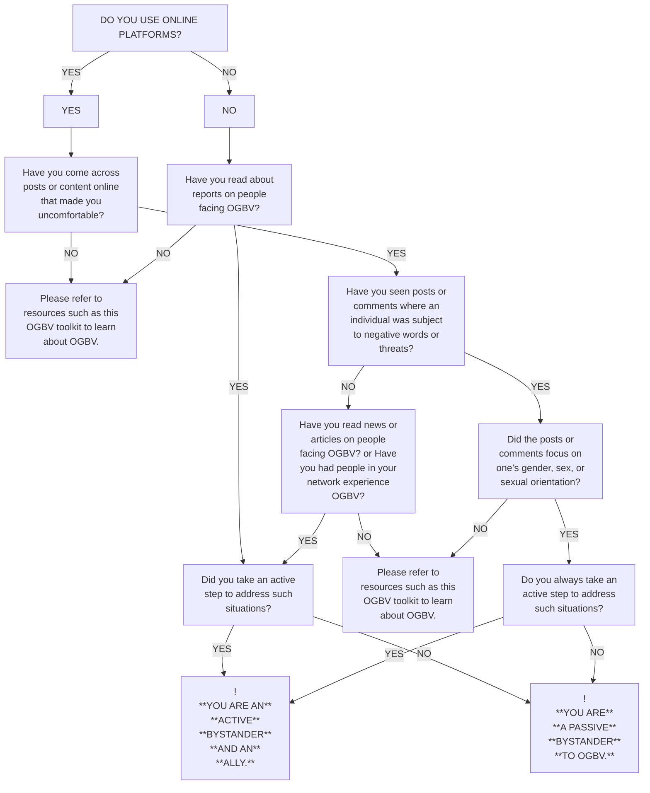

TOOLKIT

# YOUTH GUIDE TO END ONLINE GENDER-BASED VIOLENCE

000001010 11011011110 11000100

icon: window controls

icon: window controls

illustration: woman with digital network

illustration: woman with social media icons

icon: heart

illustration: woman with security icons

illustration: woman with search bar

illustration: woman with recording interface

icon: window controls

icon: speech bubble

logo: Generation Equality

30 FOR 2030

logo: UN Women

---

# TABLE OF CONTENTS

icon: laptop with loading text

icon: cursor arrows

<table>
<thead>
<tr><th></th><th></th></tr>
</thead>
<tbody>
<tr><td>About</td><td>2</td></tr>
<tr><td>Acknowledgements</td><td>3</td></tr>
<tr><td>Abbreviations &#x26; Acronyms, Key Terms and Concepts</td><td>4</td></tr>
<tr><td>Background</td><td>5</td></tr>
<tr><td>1. Clear Segmentation of Tech-Based and Tech-Facilitated Online Gender-Based Violence</td><td>7</td></tr>
<tr><td>2. Forms of Online Gender-Based Violence</td><td>10</td></tr>
<tr><td>3. Emerging Forms of Online Gender-Based Violence</td><td>18</td></tr>
<tr><td>4. Consequences of Online Gender-Based Violence</td><td>22</td></tr>
<tr><td>5. Reporting Online Gender-Based Violence</td><td>26</td></tr>
<tr><td>6. Useful Tips when Dealing with Online Gender-Based Violence</td><td>36</td></tr>
<tr><td>7. Recommendations for Stakeholders to End Online Gender-Based Violence</td><td>41</td></tr>
<tr><td>8. Online Opposition to Gender Equality</td><td>51</td></tr>
<tr><td>9. Bystander Interventions</td><td>54</td></tr>
<tr><td>10. Boys and Men as Allies in Preventing and Responding to Online Gender-Based Violence</td><td>66</td></tr>
<tr><td>11. Rural Women and OGBV: Unpacking Challenges, Shaping Solutions</td><td>83</td></tr>
<tr><td>12. OGBV against women and gender-diverse people with disabilities</td><td>91</td></tr>
<tr><td>13. OGBV and the LGBTQI+ community</td><td>101</td></tr>
<tr><td>14. Guidelines: Zero Tolerance for OGBV</td><td>115</td></tr>
<tr><td>15. Feminist and Gender-Transformative Technologies</td><td>131</td></tr>
</tbody>
</table>

---

photo: digital illustration of three diverse women in a tech-themed environment

# YOUTH GUIDE TO END ONLINE GENDER-BASED VIOLENCE

icon: three dots

## ABOUT

**The Youth Guide To End Online Gender-Based Violence toolkit is an actionable learning and knowledge product developed by the 30 for 2030 Network, a youth cohort in the Asia-Pacific region supported by UN Women. The toolkit has been created for:**

* Youth.

* **Survivors of online gender-based violence (OGBV).**

* **Anyone interested in learning about and taking action against OGBV.**

* **Individuals or organizations interested in inclusive and gender-transformative digital spaces and technologies.**

**The toolkit is a downloadable PDF, designed to be easily accessible for anyone to read and utilize to raise awareness. If you have feedback or would like more information, please contact Lauren Da Silva<lauren.dasilva@unwomen.org>**

icon: three dots

## 30 FOR 2030 NETWORK

**UN Women Regional Office for Asia and the Pacific launched the 30 for 2030 Network as a youth leadership network that brings together young decision-makers, civic and business innovators, feminists, entrepreneurs, technology pioneers, educators, activists, artists, journalists, and more. The 30 for 2030 thought leaders and experts are determined change makers to accelerate progress toward the 2030 Agenda from a feminist perspective, break down gender barriers and make gender equality a working reality in their spheres of influence. The network acts as an advisory community and an accelerator of exceptional people with the vision, courage, and influence to drive positive change for a gender equal world. The network has developed this toolkit with the support of UN Women.**

**For more information about the network:** <u>https://t.ly/ibBxj</u> **CLICK HERE** 30 FOR 2030

2

---

photo: digital illustration of three diverse individuals with technology icons

# YOUTH GUIDE TO END ONLINE GENDER-BASED VIOLENCE

photo: Ayesha Amin

AYESHA AMIN

photo: Darla Bautista

DARLA BAUTISTA

photo: Divya Goyal

DIVYA GOYAL

photo: Hafsah Muheed

HAFSAH MUHEED

photo: Hanlu Hu

HANLU HU

photo: Jolly Nguyen

JOLLY NGUYEN

photo: Kirthi Jayakumar

KIRTHI JAYAKUMAR

photo: Lauralyn

LAURALYN

photo: Monal Bhattarai

MONAL BHATTARAI

photo: Nabila Abbas

NABILA ABBAS

photo: Nala Amirah

NALA AMIRAH

photo: Natalie Au

NATALIE AU

photo: Nathaniel Diong

NATHANIEL DIONG

photo: Phatteeya Yongsanguanchai

PHATTEEYA YONGSANGUA

photo: Priyal Keni

PRIYAL KENI

photo: Radhika Modi

RADHIKA MODI

photo: Rhea See

RHEA SEE

photo: Rijve Arefin

RIJVE AREFIN

photo: Sabrina Tamayo

SABRINA TAMAYO

photo: Sanjana Chhantyal

SANJANA CHHANTYAL

photo: Sidhant Maharaj

SIDHANT MAHARAJ

photo: S M Shaikat

S M SHAIKAT

photo: Tanmaya Kshirsagar

TANMAYA KSHIRSAGAR

photo: Zahra Al Hilaly

ZAHRA AL HILALY

## ACKNOWLEDGEMENTS

**Youth Leaders in the 30 for 2030**
**Network:**

Ayesha Amin

---

YOUTH GUIDE TO END ONLINE GENDER-BASED VIOLENCE

icon: search

ABBREVIATIONS & ACRONYMS

icon: search

CSO

civil society organization

icon: search

GBV

gender-based violence

icon: search

ICT

information & communication technology

icon: search

MRA

men’s rights activist

icon: search

MRM

men’s rights movement

icon: search

OGBV

online gender-based violence

### KEY TERMS & CONCEPTS

icon: dots

icon: bullet

**ALLY**

A person who offers their support to a particular group of people in society that they themselves do not belong to, in order to help ensure their basic rights and ability to be happy and successful in society.

**FEMICIDE**

The killing of women because of their sex and/or gender.

**GENDER**

UN Women defines gender as the social attributes and opportunities associated with being male and female and the relationships between women and men and girls and boys, as well as the relations between women and those between men. These attributes, opportunities and relationships are socially constructed and are learned through socialization processes. They are context- and time-specific, and changeable.

**GENDER-BASED VIOLENCE**

Harmful acts directed at an individual based on their gender. It is rooted in gender inequality, the abuse of power and harmful norms.

**GENDER BLIND**

Any intervention that ignores and fails to respond to the different roles, responsibilities, capabilities, needs and priorities of women and men.

GOT IT

ACCEPT

### KEY TERMS & CONCEPTS

icon: dots

**GENDER DIGITAL GAP**

The difference between women and men in terms of accessing, using, and controlling technology and the internet.

**GENDER TRANSFORMATIVE**

**GENDER TRANSFORMATIVE** Any intervention that actively challenges and deconstructs harmful gender stereotypes and norms, and also actively promotes gender equality, and the empowerment of women and girls.

**ONLINE VIOLENCE**

The use of computer systems to cause, facilitate, or threaten violence against individuals, that results in (or is likely to result in) physical, sexual, psychological or economic harm or suffering. Also commonly referred to as cyber violence or technology-facilitated violence. May include the exploitation of the individual's circumstance, characteristics or vulnerabilities.

**ONLINE GENDER-BASED VIOLENCE (OGBV)**

Any form of violence that is enabled by or perpetrated by using technology or a digital interface, in particular the internet or smart devices. Also referred to as technology-facilitated gender-based violence. It can target one’s gender, sex, or sexual orientation.

**PATRIARCHY**

The social system in which men hold the greatest power, have privilege and control over land and other resources.

**SEXUAL VIOLENCE**

Any sexual act committed against the will of another person, either when this person does not give consent or when consent cannot be given. Sexual violence is not confined to any particular assigned sex or gender identity, or sexual orientation.

GOT IT

ACCEPT

4

---

YOUTH GUIDE TO END ONLINE GENDER-BASED VIOLENCE

<table>
<thead>
<tr><th></th><th></th></tr>
<tr><th>**ALERT**</th><th></th></tr>
<tr><th>!</th><th></th></tr>
<tr><th>**ONLINE VIOLENCE**</th><th></th></tr>
<tr><th>**AFFECTS MILLIONS OF**</th><th></th></tr>
<tr><th>**PEOPLE WORLDWIDE.**</th><th></th></tr>
</thead>
<tbody>
<tr><td>STOP OGBV</td><td>FIND OUT MORE</td></tr>
</tbody>
</table>

## BACKGROUND

Online violence affects millions of people worldwide. Anybody can become a victim of online violence. However, compared to men, women and girls experience online violence in a highly gendered way. For women, girls and gender-diverse people, sexualized hate and threats are common. Perpetrators aim to assert power and control, threaten, shame, and silence them through various forms of online violence.

Online gender-based violence (OGBV) can occur in intimate or non-intimate relationships. Perpetrators may be current or former partners, family members, colleagues, friends, officials, or people unknown to survivors. Unlike offline forms of gender-based violence (GBV), in OGBV the number of perpetrators can quickly reach the thousands or millions as individuals can easily view a post and participate in the harm with just one click.

COVID-19 has exacerbated OGBV. During lockdown, there was a 50-70-percent increase of internet usage globally, and as a consequence OGBV

**DID YOU KNOW**
In 2021, the prevalence of OGBV is estimated to be as high as 88 percent in Asia and the Pacific3, with adolescent girls and those from vulnerable backgrounds disproportionately affected4.

increased as well1. Misogynistic Facebook posts and tweets increased by 168 percent in India, Malaysia, and Sri Lanka during those countries’ lockdowns compared to the same period in 20192.

In Pakistan, a helpline supporting survivors of OGBV reported 136 cases in March and April 2020. This was nearly three times the number for January and February of the same year, before the country’s lockdowns5.

1 UN Women. 2020. “Online and ICT* facilitated violence against women and girls during COVID-19.” <u>Available here.</u>
2 UN Women. 2020. ”Social Media Monitoring on COVID-19 and Misogyny in Asia and the Pacific.” Brief. <u>Available here.</u>
3 The Economist Intelligence Unit. 2021. “Measuring the prevalence of online violence against women.” Infographic. <u>Key findings available here.</u>
4 UN Women. 2020. “Online violence against women in Asia: A multicountry study.” <u>Available here.</u>
5 Digital Rights Foundation. 2020. “COVID 19 and Cyber Harassment.” Policy brief. <u>Available here.</u>

5

---

YOUTH GUIDE TO END ONLINE GENDER-BASED VIOLENCE

## BACKGROUND

**ALERT**
!
**ONLINE VIOLENCE**
**CAUSES HARM IN REAL**
**LIFE!**
STOP OGBV FIND OUT MORE

OGBV has grave consequences not only for women and girls but for society as a whole. An analysis of documented cases in the Philippines showed that survivors of OGBV experienced emotional harm (83%), sexual assault (63%) and physical harm (45%). In Pakistan, online harassment has resulted in femicide, suicide, physical violence, emotional distress, women losing their jobs, and women and girls silencing themselves in online spaces6.

OGBV is deeply rooted in discriminatory social norms and gender inequality, and is often connected to offline violence. It is an active barrier against women’s and girls’ freedom of speech and their involvement in the public agenda. OGBV undeniably widens the gender digital gap, and is ultimately a threat to peaceful, sustainable and gender-equal societies.

**REMINDER**
**ONLINE SAFETY IS NOT A**
**DREAM!**
STOP OGBV FIND OUT MORE

OGBV is preventable, just like any other form of GBV. Research shows that prevention efforts, if tailored and aimed at all levels can lead the way to ending OGBV. Such efforts must include governments, private sector, tech companies, communities and individuals, along **DID YOU KNOW** with adequate response services to survivors.

The ecosystem of information technology and related services is particularly important. Improving the online safety, well-being and opportunities for women and girls will mean addressing gender inequalities in the relevant professional and educational spheres. This deconstruction of our currently gender-blind and gender-biased tech ecosystems could be achieved by: involving more girls and women in the fields of science, technology, mathematics and engineering (STEM); supporting women-led tech companies; and mainstreaming gender in our current tech ecosystem including artificial intelligence. This would ultimately help to build a gender-transformative ecosystem.

**As young people, we strongly believe that a world**
**without OGBV is possible, as is a**
**gender-transformative tech ecosystem. The only**
**thing we need is the will and courage to start the**
**change, the rest will follow. In the words of disability**
**rights activist Helen Keller: “Alone we can do so**
**little; together we can do so much! ”**

https://asiapacific.unwomen.org/sites/default/files/Field%20Office%20ESEAsia/Docs/Publications/2020/12/ap-ICT-VAWG-report-7Dec20.pdf UN Women. 2020. “Online violence against women in Asia: A multicountry study.” Available here.

6

---

YOUTH GUIDE TO END ONLINE GENDER-BASED VIOLENCE

# CLEAR SEGMENTATION OF TECH-BASED AND TECH-FACILITATED OGBV

illustration: digital devices and icons

1

---

# YOUTH GUIDE TO END ONLINE GENDER-BASED VIOLENCE

icon: router

icon: globe

## WHAT IS TECH-FACILITATED OGBV?

**Tech-facilitated OGBV is violence**
**that is amplified by using technology,**
but that also manifests in the offline
world. Such behaviour can start offline
and migrate online, or vice versa.

icon: speech bubble

## WHAT IS TECH-BASED OGBV?

**Tech-based OGBV refers to cases**
**where the GBV is completely**
**online,** using only the digital
space to inflict violence.

icon: speech bubble

icon: hand pointer

**CASE STUDY 1:**

A is in an intimate relationship with B. Due to a career opportunity A has decided to move cities. A asked to break up so they could each focus on themselves. B was not happy with the situation and asked A to reconsider. Since A wanted to pursue the initial decision, B published intimate photos of A without consent on social media. This resulted in A being dismissed from work, and A’s family facing social isolation and trolling from the internet. This severely impacted her mental health, resulting in poor performance in the new workplace as well.

**IS THIS TECH-FACILITATED OR TECH-BASED OGBV?**

This is tech-facilitated OGBV since the violence perpetrated online resulted in offline forms of violence and consequences impacting an individual's socio-economic needs.

**CASE STUDY 2:**

C is 15 years old and uses social media to blog about a hobby through an open page. D has been interacting with C’s Instagram page through liking and commenting. C has been engaging with all users following the page. D continues commenting and starts direct messaging C. C replies to all direct messages to all engaging with the page. D starts asking personal questions and leaving rude remarks if C delays in reply. D in anger has started cyberstalking C and trolling publicly on the page, resulting in C completely quitting social media and no longer using online spaces.

**IS THIS TECH-FACILITATED OR TECH-BASED OGBV?**

This is tech-based OGBV since technology is used as a medium to inflict violence, and the support needed to counter such violence also requires tech support.

8

---

# YOUTH GUIDE TO END ONLINE GENDER-BASED VIOLENCE

icon: network and digital devices

icon: hand cursor

WHY DO WE SEPARATE TECH-FACILITATED AND TECH-BASED OGBV?

**Differentiating between tech-facilitated and tech-based OGBV is increasing among grassroot advocates and workers in the space of OGBV.**

Grassroot advocates have noted the need for different intervention and prevention mechanisms for the two types of OGBV. This is also a turning point in countries designing legal frameworks to regulate violence in the digital space. There is a gap in research focusing on this differentiation. This gap is critical and is anticipated to become a focus area, according to feminist consultations with grassroot communities.

Tech-facilitated GBV requires intervention in the form of evolving legal policies, as well as social and tech support as countermeasures. The need for digital literacy focusing on hygiene and safety through community resources is also essential. Gender-transformative and feminist tech works as solutions in addressing tech-based OGBV.

icon: globe

### TECH-FACILITATED

* Doxxing1

* Identity theft, impersonation, and the creation of fake profiles

* Gender-based hate speech

* Online sexual harassment and bullying

* Non-consensual dissemination of intimate photos and videos

* Sexploitation

* Sextortion

### TECH-BASED

icon: two dots

* **Cyberflashing**

* **Cyberstalking**

* **Digital voyeurism**

* **Morphing or transmogrification**

* **Online grooming**

* **Online threats and blackmail**

* **Zoom bombing**

1 “Doxxing” refers to the non-consensual publication of someone’s personal information online, such as their real name and physical address, often knowingly putting them at risk of further harassment or abuse from third parties.

9

---

YOUTH GUIDE TO END ONLINE GENDER-BASED VIOLENCE

icon: number 2

# FORMS OF ONLINE GENDER-BASED VIOLENCE

illustration: collage of icons representing online harassment including a skull, a cross, a broken heart, an angry face, a thumbs down, a lightning bolt, a recording indicator, and a laptop with eyes

**rec**

**www**

---

# YOUTH GUIDE TO END ONLINE GENDER-BASED VIOLENCE

## REMINDER

**There are multiple forms of OGBV. All of them result in harmful consequences. OGBV, in all forms, intersect with racism, homophobia, transphobia, ableism and other discriminatory systems in many of its manifestations.**21

## FORMS OF ONLINE GENDER-BASED VIOLENCE

## 1 **CYBERFLASHING**

**Cyberflashing** refers to the act of sending unsolicited photographs of genitalia or sexual acts with the intent of silencing a person. Individuals are typically targeted for their sex, gender, or sexual orientation.22

https://www.cigionline.org/publications/technology-facilitated-gender-based-violence-overview/

https://asiapacific.unwomen.org/sites/default/files/Field%20office%20ESEAsia/Docs/Publications/2020/12/ap-ICT-VAWG-report-7Dec20.pdf

11

icon: two dots

photo: hand holding a smartphone displaying a photo and accept/decline buttons

---

# FORMS OF ONLINE GENDER-BASED VIOLENCE

## 2 **DIGITAL VOYEURISM**

**Digital voyeurism** refers to filming, watching, and sharing online films or videos of people’s bodies through live or pre-recorded videos.23 It may occur through the deployment of hidden cameras in innocuous objects or through photographs stolen from the person and disseminated without their consent. Sometimes, individuals can be deepfaked or superimposed onto online images. The images produced from such acts are known as creepshots.24

illustration: a person using a laptop with eyes on the screen

12

illustration: a hand holding a smartphone filming a person

## 3 **CYBERSTALKING**

**Cyberstalking** refers to the surveillance or monitoring of a person through digital technology. It may especially be used to prevent victims from escaping an abusive situation, such as domestic and intimatepartner violence.25

23 https://t.ly/ajPZj

24 https://t.ly/il2Yy

25 https://t.ly/ajPZj

---

# FORMS OF ONLINE GENDER-BASED VIOLENCE

## 4 **DOXING**

**Doxing** refers to the disclosure of personal data online along with malicious suggestions for others to contact the person targeted to cause more harm or with indecent intent.26

26 https://asiapacific.unwomen.org/sites/default/files/Field%2000ffice%2020ESEAsia/Docs/Publications/2020/12/ap-ICT-VAWG-report-7Dec20.pdf

illustration: laptop with open windows showing a lock, a house, a profile picture, and an email icon

## 5 **GENDER-BASED HATE SPEECH**

**Gender-based hate speech** includes hurtful, harmful, hateful, insulting, demeaning, shaming, and vitriolic statements, comments, or other forms of expression that target a person for their sex, gender, or sexual orientation; and includes comments suggesting that the person targeted deserves to face harm or should harm themselves.27

27 https://asiapacific.unwomen.org/sites/default/files/Field%2000ffice%2020ESEAsia/Docs/Publications/2020/12/ap-ICT-VAWG-report-7Dec20.pdf

illustration: stylized figures holding smartphones

13

---

YOUTH GUIDE TO END GENDER-BASED VIOLENCE

## FORMS OF ONLINE GENDER-BASED VIOLENCE

6

## IDENTITY THEFT, IMPERSONATION, AND THE CREATION OF FAKE PROFILES

Identity theft, impersonation, and the creation of fake profiles can include posing as a person to others, either acting in a humiliating or harmful manner or extorting money from those the target knows. For example, perpetrators may pretend to be their female target, advertise sexual services online, and provide an address and other contact information. 28

<u>**https://t.ly/il2Yy**</u> 28 https://asiapacific.unwomen.org/sites/default/files/Field%20Office%20ESEAsia/Docs/Publications/2020/12/ap-ICT-VAWG-report-7Dec20.pdf

icon: computer interface

other: illustration of digital manipulation

## 7 MORPHING OR TRANSMOGRIFICATION

**Morphing or transmogrification** refers to morphing, superimposing, and splicing photographs or videos to create “deep fakes” and uploading them onto pornographic platforms, with the intention of sexualising and demeaning the individual targeted. 29

<u>**https://t.ly/il2Yy**</u> 29 https://asiapacific.unwomen.org/sites/default/files/Field%20Office%20ESEAsia/Docs/Publications/2020/12/ap-ICT-VAWG-report-7Dec20.pdf

14

---

YOUTH GUIDE TO END GENDER-BASED VIOLENCE

## FORMS OF ONLINE GENDER-BASED VIOLENCE

8 **NON-CONSENSUAL DISSEMINATION OF INTIMATE PHOTOS AND VIDEOS**

**Non-consensual dissemination of intimate photos and videos** involves the dissemination of intimate photographs, videos, and audios of an individual without their consent. It also involves threatening to release or circulate these images and blackmailing the victim to achieve a particular end. 30

https://t.ly/il2Yy 30 https://asiapacific.unwomen.org/sites/default/files/Field%20Office%20ESEAsia/Docs/Publications/2020/12/ap-ICT-VAWG-report-7Dec20.pdf

icon: uploading **UPLOADING.....**

illustration: hand holding phone

9 **ONLINE GROOMING**
15

**Online grooming** refers to the process of establishing or building a relationship with a victim through the use of the internet or other digital technologies to facilitate either online or offline sexual contact with that person. 31

31 https://www.unicef.org/eap/media/4706/file

---

# FORMS OF ONLINE GENDER-BASED VIOLENCE

**10**

## **ONLINE SEXUAL** **HARASSMENT AND** **BULLYING**

**Online sexual harassment and bullying** refers to sexual harassment that takes place through the Internet in the form of messaging, emailing, calls, and direct-messaging through a variety of platforms. 32 This may be carried out by a single individual or a group of individuals, in which case it is called networked harassment. 33

32 https://asiapacific.unwomen.org/sites/default/files/Field%20Office%20ESEAsia/Docs/Publications/2020/12/ap-ICT-VAWG-report-7Dec20.pdf

33 https://www.cigionline.org/publications/technology-facilitated-gender-based-violence-overview/

photo: hands pointing at a laptop screen

illustration: person holding a smartphone

# **11 ONLINE THREATS AND** **BLACKMAIL**

Online threats and blackmail refers to the act of threatening to share information about an individual (including images or videos) to the public, their friends or family online, unless a demand is met. 34 It is very common and deters women from coming forward. Women who have pursued cases against these practices have been intimidated and forced to recant through further blackmail, such as threats to release material or compromising images (whether genuine or fake) online. 35

34 https://www.thinkuknow.co.uk/parents/articles/online-blackmail/

35 https://asiapacific.unwomen.org/sites/default/files/Field%20Office%20ESEAsia/Docs/Publications/2020/12/ap-ICT-VAWG-report-7Dec20.pdf

16

---

# FORMS OF ONLINE GENDER-BASED VIOLENCE

icon: microphone

## **12** **SEXPLOITATION**

**Sexploitation** refers to the commercial exploitation of sexual material or sex via digital media. This includes the sale or dissemination of intimate information non-consensually to pornographic sites, installing livestreaming feed unbeknownst to a person being targeted and selling / renting the stream on a pornographic site, and selling deep fakes.36

36 https://www.cigionline.org/publications/technology-facilitated-gender-based-violence-overview/

illustration: hands on a screen with video calls

17

illustration: camera recording a person changing clothes

## **13** **SEXTORTION**

icon: padlock

**Sextortion** refers to extorting sex or sexual favours by threatening to disseminate a person’s intimate images and footage of rape.37

37 https://asiapacific.unwomen.org/sites/default/files/Field%20Office%20ESEAsia/Docs/Publications/2020/12/ap-ICT-VAWG-report-7Dec20.pdf

## **14** **ZOOM BOMBING**

**Zoom bombing** occurs when people join online gatherings to post sexist, pornographic or anti-feminist content to shock and disturb viewers.38

38 https://www.cigionline.org/publications/technology-facilitated-gender-based-violence-overview/

---

YOUTH GUIDE TO END ONLINE GENDER-BASED VIOLENCE

icon: number 3

# EMERGING FORMS OF ONLINE GENDER-BASED VIOLENCE

illustration: person looking at a smartphone with social media notifications

**12**

---

YOUTH GUIDE TO END ONLINE GENDER-BASED VIOLENCE

# INFLUENCER-DRIVEN OGBV

photo: social media live stream interface

**In 2022, the Oxford English Dictionary updated its**
**definition of “influencer” to include:**

**1. “Marketing. A person who has the ability to**
**influence other people’s decisions about the**
**purchase of particular goods or services.”**

**2. “A well-known or prominent person who uses**
**the internet or social media to promote or**
**generate interest in products, often for payment.”**

These additions mark a trend in recent years where some influencers build a following by deliberately courting controversy and generating provocative content, especially male influencers selling misogynistic views.1 2

Such influencers manipulate social media algorithms and target young and impressionable boys to share controversial content to achieve maximum views and engagement.

While this is an emerging form of OGBV, its impact is felt even in the offline world. Teachers are being confronted by more and more students expressing misogynistic attitudes by influencers that normalize misogyny, making it seem socially acceptable.3

icon: report thumbnail and view report button
<u>**VIEW REPORT**</u>

To know more about influencer-driven OGBV, check out the report titled **Online Opposition to Gender**
**Equality: Understanding opposition to gender**
**equality and feminism in the virtual space**,

produced by Quilt.AI and UN Women Regional Office for Asia and the Pacific. It examines online opposition to gender equality in Bangladesh, India, and the Philippines, showing country-specific oppositional narratives and tactics, as well as ones those countries have in common.

1 <u>https://www.theguardian.com/technology/2022/aug/06/andrew-tate-violent-misogynistic-world-of-tiktok-new-star</u>

2 https://www.vox.com/culture/2023/1/10/23547393/andrew-tate-toxic-masculinity-qa

19

3 <u>https://www.tes.com/magazine/teaching-learning/secondary/andrew-tate-how-schools-tackle-misogyny</u>

---

YOUTH GUIDE TO END ONLINE GENDER-BASED VIOLENCE

## AI-BASED CHATBOTS

icon: warning sign

**Artificial intelligence (AI) chatbots** 
**like OpenAI's ChatGPT-4,** 
**Microsoft's Tay, and IBM's Watson** 
**have received recognition for their** 
**innovative capabilities.** However, 
these changes have had unintended 
consequences, particularly in relation 
to the internet proliferation of 
gender-based violence.

Because chatbots are being linked into more and more internet platforms, social media platforms, and other communication channels, there is a concern that a sizable audience could access them.

This wide accessibility may increase the dissemination of offensive material and violence against women. Additionally, any initial bias in the training data or user input could make the problem worse because chatbots learn from user interactions.

An AI chatbot developed by OpenAI called ChatGPT-4 relies on material available online for the sample data it uses to generate its responses. The chatbot may reinforce harmful gender stereotypes despite being objective, as was the case when it suggested historically stereotypical university subject selections for a boy and a girl. This bias could subtly normalize and defend harmful gendered behaviour.

**Another example is provided by Tay, a Microsoft** 
**AI chatbot. Designed to learn from Twitter chats,**

**Tay started sending out hostile comments,** 
**including sexist and misogynistic slurs, within 24** 
**hours of its 2016 release. The chatbot's algorithm** 
**was effectively a mirror, reflecting the worst** 
**aspects of modern ideals like gender violence.**

IBM's Watson has also demonstrated something similar. As a result of identifying text with feminine codes as more emotive and subtly promoting gender stereotypes, its tone-analyser tool has come under fire.

Like people, certain AI-powered virtual assistants, such as Apple's Siri and Amazon's Alexa, first responded complacently to inappropriate or abusive language. In such cases, the initial programming posed the risk of normalizing harmful and unfavourable behaviour towards women.

These examples show how impersonal AI chatbots might unintentionally perpetuate gender stereotypes that support online gender violence. This automatic prejudice arises from the statistical linkages used by AI models.

### REMINDER

icon: dots

**To address these issues, the AI communities,** 
**organizations, and politicians must work** 
**together.** The initial steps in tackling the problem are improving AI models, ensuring that diverse representation is available in training data, and actively combating biases. These approaches must include solid governance frameworks that promote equity, transparency, and accountability in AI technologies.

The security of users should also be a primary consideration for AI developers, who should put protections in place to prevent gender-based abuse via AI chatbots. By acknowledging and addressing gender bias in AI, we may work towards creating a digital environment that values diversity and equity.

20

---

YOUTH GUIDE TO END ONLINE GENDER-BASED VIOLENCE

illustration: smartphone with chat interface and hearts

# DATING APPS

icon: exclamation mark in triangle

**HOWEVER, THERE ARE SOME MEASURES**
**PEOPLE CAN TAKE TO PROTECT THEMSELVES,**
**INCLUDING THE FOLLOWING:**

• **Setting boundaries early on** to make it apparent what behaviours are acceptable and unacceptable. If someone crosses these boundaries, feel free to cut them off or report them.

• **Every reputable dating app has mechanisms for**
**reporting inappropriate behaviour.** Use them if you experience any form of unwanted attention or harassment.

• **Avoid sharing sensitive personal information** like your home or business address unless you are confident about the other person.

• **A quick web search on someone you're**
**considering seeing in person is a good idea.** Look up any data that is out there to check for anything concerning.

• **Choose a public area for your initial meetings.** Tell a friend or family member about your plans, and consider having a "safe" word or phrase you can text them if you start to feel unsure.

• **Pay attention to your intuition if something**
**about a person or a conversation seems off.** It is better to end a potentially dangerous encounter early than to jeopardize your safety.

• **Security features like picture verification,**
**blocking, reporting, and even "panic" buttons**
**that alert authorities are offered by several apps.** Recognise when to use these features, and become familiar with them.

• **Review the privacy policies of the applications**
**you use on a regular basis** to see how your data is handled and who has access to it.

**The use of dating apps has led to an increase in**
**the frequency of OGBV. The widely used app**
**Tinder, for instance, has been the subject of**
**several claims of harassment and abuse. Users**
**have reported receiving unwanted sexually explicit**
**texts and images, stalking, and even violent**
**threats.**

Bumble, an app that exclusively lets women initiate discussions, to offer women more control over the engagement, has also seen reports of cyberstalking, misogyny, and verbal abuse.

Grindr, with a focus on the LGBTQ+ community, has documented instances of bigotry, harassment, and the 'outing' of sexual orientations that are not publicly disclosed.

These incidents bring to light the serious issue of online gender-based violence made possible through dating applications.

21

---

YOUTH GUIDE TO END ONLINE GENDER-BASED VIOLENCE

# 4 CONSEQUENCES OF ONLINE GENDER-BASED VIOLENCE

illustration: a person looking sad with a thought bubble containing various icons representing negative emotions and online harassment

---

YOUTH GUIDE TO END ONLINE GENDER-BASED VIOLENCE

icon: collection of various icons representing online violence

**ALERT!**

**ACCORDING TO A RECENT**
**STUDY, 92 PER CENT OF**
**WOMEN SHARED THAT OGBV**
**HARMS THEIR SENSE OF**
**WELLBEING.** 39

**LIKE MOST FORMS**
**OF GBV, ONLINE**
**VIOLENCE ALSO HAS**
**SIGNIFICANT RIPPLE**
**EFFECTS THAT**
**TRANSLATE BEYOND**
**THE SURVIVOR.**

While the immediate and full impact is felt by the survivor, the ripple effects include self-censorship, disengagement with the online space, emotional, physical and psychological harm, and economic damage. Survivors’ families and friends may face repercussions and can also withdraw from online engagement in certain situations.

39 https://onlineviolencewomen.eiu.com/

23

---

YOUTH GUIDE TO END ONLINE GENDER-BASED VIOLENCE

**REMINDER**

**OGBV HAS MANY**
**CONSEQUENCES THAT ARE**
**LONG-TERM; MOST OF THE**
**TIME, OGBV IS A CONTINUUM**
**OF OFFLINE GBV.** 40

icon: bullet point

SOME EXAMPLES OF THE CONSEQUENCES OF ONLINE GENDER-BASED VIOLENCE:

icon: group of people

**SOCIAL ISOLATION:**

OGBV may result in the survivor’s withdrawal from public life, including their family and friends, especially in the case of non-consensual dissemination of intimate photos and videos.41

icon: money bags

**ECONOMIC CONSEQUENCES:**

The effects of OGBV comes with an economic cost that involves the loss of jobs, earning capacity, social capital, and professional standing.42 The survivor may also be subject to financial losses as a result of OGBV.

icon: head with brain

icon: broken heart

**PSYCHOLOGICAL AND EMOTIONAL**
**CONSEQUENCES:**

OGBV can be as harmful as physical violence if not more. It can culminate in stress, trauma, anxiety, sleep disorders, depression, eating disorders, even physical pain.43 It can create a sense of fear and anxiety around one’s safety, and lead to isolation. Very severe forms of OGBV can also cause death by suicide. 44

icon: eye with tear

**FEMICIDE:**

Femicide, or the gender-related killing of women, is the killing of women because of their sex and/or gender.45 One form of femicide is namely ‘honour’-based killing, which is the murder of women and girls by family members or partners. The family believe the victim has brought shame and dishonour. OGBV may trigger ‘honour’-based killing, for example when intimate images of victim have been leaked to their communities.

40 https://www.ohchr.org/sites/default/files/Online_VAW_Statement.pdf

41 https://www.apc.org/sites/default/files/APCSubmission_UNSR_VAW_GBV_0_0.pdf

42 https://www.ndi.org/our-stories/impact-online-violence-against-women-2021-uganda-general-elections

43 https://t.ly/sVt2T / https://www.undp.org/serbia/news/online-violence-has-real-life-consequencesitismybusiness#:~:text=This%20form%20of%20violence%20against,%2C%20depression%2C%20even%20physical%20pain

44 https://www.amnesty.org/en/latest/news/2018/03/online-violence-against-women-chapter-6-6/

45 UN General Assembly, Violence against women, its causes and consequences, A/71/398, p. 9.

https://digitallibrary.un.org/record/845361?ln=en

**24**

---

YOUTH GUIDE TO END ONLINE GENDER-BASED VIOLENCE

icon: group with prohibited symbol

icon: bullet point

### SILENCING, SELF-CENSORSHIP, AND SOCIETAL CONSEQUENCES:

OGBV is very often used to silence people. Survivors tend to deactivate or delete accounts or quit platforms altogether, they may lose their social capital, professional standing, and their freedom of expression.46

For example, research has shown the grave impact of OGBV on freedom of expression; more than 76 per cent of women experiencing abuse or harassment on social media shared that they think twice when they interact online, 32 per cent shared they stopped commenting on certain issues all together.47

icon: bar chart

**IN ADDITION, OGBV HAS A NEGATIVE IMPACT ON GIRLS’ AND WOMEN’S INVOLVEMENT IN PUBLIC AND POLITICAL AGENDAS.**

icon: pointing hand

**61% OF WOMEN IN**

**OF WOMEN IN**

<u>**GOVERNMENT BELIEVE**</u>

<u>**THAT THE MAIN DRIVE**</u>

**BEHIND THE**

<u>**HARASSMENT THEY FACE**</u>

**IS TO DETER WOMEN FROM ENGAGING AND INVOLVING IN POLITICAL LEADERSHIP POSITIONS.**48

25

icon: bullet point

### EDUCATION AND WORKFORCE:

The impact is also seen with a withdrawal in education and the labour force. Girls may skip or drop out of school to avoid bullying that is connected to OGBV. Women have quit their jobs or leave employment altogether as a result of OGBV or threats of OGBV. Research has illustrated that women’s involvement in the workforce equates to economic growth; and increasing educational access for women’s and girls’ has a positive impact on a more inclusive economic growth.49

icon: pointing hand

**OGBV IS A BARRIER AGAINST GIRLS’ AND WOMEN’S FREEDOM OF EXPRESSION AND THEIR INVOLVEMENT IN EDUCATION, THE LABOUR FORCE AND POLITICAL AND PUBLIC DISCUSSION.**

**IT UNDENIABLY WIDENS EXISTING GENDER INEQUALITIES THAT WORK AGAINST PEACEFUL, PROSPEROUS AND SUSTAINABLE SOCIETIES.**

icon: quote mark

**PERSPECTIVE**

icon: quotation marks

**THE ABUSE DEFINITELY MAKES ME PAUSE BEFORE I WEIGH IN ON ANYTHING. IT MAKES ME FEAR FOR MY FAMILY.**
-
PAMELA MERRITT, BLOGGER AND ACTIVIST 50

46 https://www.ndi.org/our-stories/impact-online-violence-against-women-2021-uganda-general-elections

47 https://www.amnesty.org/en/latest/press-release/2017/11/amnesty-reveals-alarming-impact-of-online-abuse-against-women/

48 https://www.ipu.org/resources/publications/issue-briefs/2016-10/sexism-harassment-and-violence-against-women-parliamentarians

49 https://www.unwomen.org/en/what-we-do/economic-empowerment/facts-and-figures

50 https://www.amnesty.org/en/latest/press-release/2017/11/amnesty-reveals-alarming-impact-of-online-abuse-against-women/

---

YOUTH GUIDE TO END ONLINE GENDER-BASED VIOLENCE

icon: number 5

# REPORTING ONLINE GENDER-BASED VIOLENCE

The illustration depicts a computer screen displaying multiple browser windows, each containing a warning icon and the word **REPORT**. Several mouse cursors are shown clicking on these windows, and a pair of eyes is visible at the bottom of the screen.

---

YOUTH GUIDE TO END ONLINE GENDER-BASED VIOLENCE

illustration: hands typing on a laptop with a report button on the screen

**EXPERIENCING OGBV CAN BE STRESSFUL. SEEKING HELP AND SUPPORT CAN ALSO BE DIFFICULT** DEPENDING ON YOUR SITUATION:

i.e. considering the legal context of the country you are in, or if any support mechanisms are in place. Support services for OGBV may also not be available or be inefficient in helping you.

**Some options to report OGBV are listed, however, it is your choice which option you would like to take, or if any of these options are relevant to the situation you are in.**

27

---

28
YOUTH GUIDE TO END ONLINE GENDER-BASED VIOLENCE

# REPORTING ONLINE GENDER-BASED VIOLENCE

## OPTION 1: REPORTING
## ON THE PLATFORM

While the process of reporting may vary on different channels, most platforms allow the person reporting to retain their privacy. This means no information of theirs is shared when a report is made. Links to how you can report abuse or harassment across a few commonly used online platforms can be found below:

* HOW TO REPORT
* HOW TO REPORT
* HOW TO REPORT
* HOW TO REPORT
* HOW TO REPORT
* HOW TO REPORT
* HOW TO REPORT
* HOW TO REPORT

## REMINDER

**TO RESPOND TO OGBV,**
**ONLINE PLATFORMS SHOULD**
**OFFER USER-FRIENDLY AND**
**AGE APPROPRIATE**
**REPORTING MECHANISMS**
**THAT ARE AVAILABLE IN**
**LOCAL LANGUAGES.**

photo: hand holding smartphone displaying reporting interface

28

---

YOUTH GUIDE TO END ONLINE GENDER-BASED VIOLENCE

# REPORTING ONLINE GENDER-BASED VIOLENCE

## OPTION 2: REPORTING TO THE POLICE

**Laws around OGBV change from one country**
**to another. Stronger legislation addressing**
**OGBV, to better prevent and respond to it, is**
**certainly needed across Asia and the Pacific.**

Survivors may be hesitant in reporting to the police due to the lack of legislation, prosecution and response from the police to OGBV cases. Survivors also hesitate in contacting the authorities because they fear further escalation of violence.

It is always best to think through the ‘pros and cons’ when reporting OGBV and consider what option would offer the most protection for the survivor. If survivors’ decide to report OGBV to the police or take legal action, it is important to have accurate and thorough documentation, screenshots, messages or more about the event(s) of online violence and harassment.51 Support from an advocate, lawyer, or advocacy organization can be valuable in navigating this decision. Some countries in this region have organisations that specialize in supporting survivors of OGBV and making reports.

51 https://t.ly/eIrAj https://glitchcharity.co.uk/wp-content/uploads/2021/09/Fix-the-Glitch-A4-holding-x4-A6-cards-1.pdf

photo: police officer interviewing a survivor

## REMINDER

## **POLICE AND JUSTICE** **SYSTEMS SHOULD HAVE THE**
## **CAPACITY TO RESPOND TO** **OGBV WITH A**
## SURVIVOR-CENTRED
## APPROACH.

Governments need to invest in gender-transformative capacity building of prosecution as well as targeting harmful gender norms present for all those involved.

icon: decorative graphic

29

---

YOUTH GUIDE TO END ONLINE GENDER-BASED VIOLENCE

# REPORTING ONLINE GENDER-BASED VIOLENCE

## OPTION 3: REPORTING AT YOUR WORKPLACE

**COVID-19 and work from home measures have resulted in a rise in online sexual harassment in the workplace. Essentially, this means messages of a sexual nature sent via email, texts or social media and cyber harassment. One in three women shared that they experienced online abuse in their workplace according to the study of eSafety Commissioner of Australia.**52

When OGBV takes place at work, it is uncomfortable, affecting work performance and commitment to work. In some cases, it may result in women quitting or losing their jobs. Perpetrators may be colleagues or managers who hold more power and authority.

In many instances, women choose to ignore harassment at work or remain quiet due to the fear of negative consequences including loss of employment, stigmatisation and victim-blaming. A survey in Pakistan found that 54 per cent of women believe that women should quit their jobs if they face harassment, and 83 per cent admit that men get away with the harassment.53 Companies or organisations should have clear policies on prevention and response to OGBV, however, in most cases, they do not have any policies in place or either, do not efficiently implement relevant policies.

**If you wish to report an incident of OGBV, you can report it to your line manager, human resources, or a trusted fellow colleague by following the internal policy of your organisation.** If policies and practices are not in place, you can consult a union, a civil society organization (CSO) providing support on violence against women (VAW) at work or a legal professional in employment law.

icon: reminder dots

### REMINDER

**TO RESPOND TO GBV AT WORK INCLUDING OGBV, THE WORKPLACE SHOULD TAKE CONCRETE STEPS IN CHANGING TOXIC WORK CULTURES THAT REINFORCE HARMFUL GENDER NORMS AND HAVE POLICIES AND PRACTICES IN PLACE FOR REPORTING VIOLENCE AND RECEIVING SUPPORT!**

illustration: woman working at desk

logo: workplace support

52 https://t.ly/zdx3g https://www.esafety.gov.au/research/women-spotlight-how-online-abuse-impacts-women-their-working-lives/report

53 https://t.ly/AZLc2 https://www.esafety.gov.au/research/women-spotlight-how-online-abuse-impacts-women-their-working-lives/report

30

---

YOUTH GUIDE TO END ONLINE GENDER-BASED VIOLENCE

## REPORTING ONLINE GENDER-BASED VIOLENCE

### OPTION 4: REPORTING AT YOUR SCHOOL

**If you are bullied by a classmate or a group of classmates in your school, it may be difficult and uncomfortable to seek help. It may even feel impossible to go to school. Over 60 per cent of students shared that their ability to learn and feel safe at school were affected by the online violence they experienced. 10 per cent of students stated that they skipped school at least once due to online violence.**54

To survivors: never forget that the OGBV you are experiencing is not your fault. The perpetrators, who may or may not be your classmates, are violating your basic rights. Schools should be equipped with child protection and safeguarding principles and preferably offer counselling support for students going through GBV including OGBV. If your school has support mechanisms in place, you may want to seek help and get some support, or seek support from a trusted adult.

54 https://cyberbullying.org/federal-commission-on-school-safety

icon: warning sign

### CALLING ALL MINORS

If you experience OGBV you can consider consulting a trusted adult, guardian, teacher, counselor, parent or person in your life, or contacting a child helpline.

icon: dots

### REMINDER

**TO SURVIVORS: NEVER FORGET THAT THE OGBV YOU ARE EXPERIENCING IS NOT YOUR FAULT. THE PERPETRATORS, WHO MAY OR MAY NOT BE YOUR CLASSMATES, ARE VIOLATING YOUR BASIC RIGHTS.**

Schools should be equipped with child protection and safeguarding principles and preferably offer counselling support for students going through GBV including OGBV. If your school has support mechanisms in place, you may want to seek help and get some support, or seek support from a trusted adult.

photo: student at desk

icon: books

31

---

YOUTH GUIDE TO END ONLINE GENDER-BASED VIOLENCE

## REPORTING ONLINE GENDER-BASED VIOLENCE

## OPTION 5: GETTING SUPPORT FROM CSOs OR HOTLINES WORKING IN PREVENTION AND RESPONSE TO OGBV

**When OGBV takes place, we may feel that we are all alone and this has only happened to us. But it is important to always remember that OGBV is a prevalent problem affecting millions of girls and women globally.**

**You are not alone** and there are help and support mechanisms in place even if you do not want to report it and take legal action. You can remain anonymous.

Across Asia and the Pacific, there are hotlines and helplines, chatbots, youthled and women-led CSOs that provide information and support including general awareness-raising information, from legal advice, to counselling for survivors of OGBV.

Across Asia and the Pacific, there are hotlines and helplines, chatbots, youthled and women-led CSOs that provide information and support including general awareness-raising information, from legal advice, to counselling for survivors of OGBV.

**Some of these hotlines are confidential so you do not have to share your personal details. You can solely access information and support. Listed here are a few of the chatbots, helplines, and CSOs:***

icon: network of people connecting to a laptop

\*This list of organisations is crowdsourced and added with a basic background check in terms of their verifiable credentials. The 30 for 2030 network and UN Women are not responsible for the conduct or operations of any of the organisations listed in the interactive map. Users are advised to exercise caution and discretion and do their due diligence before engaging with the organisations listed here.

icon: cursor

<u>**ACCESS NOW:**</u> 24/7 DIGITAL SECURITY <u>HELPLINE</u>

**Access Now offers real-time, direct technical assistance and advice to civil society groups and activists, media organizations, journalists and bloggers, and human rights defenders.**

They help at-risk people and communities at risk to improve digital security practices, and provide rapid-response emergency assistance in nine languages (Arabic, English, Spanish, French, German, Italian, Portuguese, Russian, Spanish and Tagalog, Arabic, and Italian).

32

---

YOUTH GUIDE TO END ONLINE GENDER-BASED VIOLENCE

icon: hand cursor

### <u>CYBERSAATHI</u>

icon: checkmark

**is an initiative that provides information on**
**laws relating** to cybercrimes and remedies for
different forms of online violence.

### <u>ESAFETY</u>

icon: checkmark

**is the world's first government agency**
**committed to** keeping its citizens safer online.
This facilitates reporting, resources and tech
support.

### <u>STOPNCII.ORG</u>

icon: checkmark

**StopNCII.org is operated by the Revenge**
**Porn Helpline which is part of SWGfL, an**
**international charity that believes that**
**everyone should benefit from technology,**
**free from harm.** Founded in 2000, SWGfL
works with a number of partners and
stakeholders around the world to protect
everyone online.

### <u>/https://kryss.network</u> KRYSS NETWORK

icon: checkmark

**KRYSS Network, focuses on three key areas**
**of change in trying aims to enable equal**
**access and the right to freedom of opinion**
**and expression for all,** especially women/girls
and gender non-conforming persons. These
Its three key areas of change are: shaping
public discourse for gender equality and
non-discrimination;, elimination of hate
speech and online gender-based
violenceOGBV;, and institutional reforms and
social change.

### <u>MARU CHATBOT</u>

icon: checkmark

**Created by activists worldwide, the digital**
**tool builds on Plan International’s landmark**
**research revealingfinding that nearly half**
**(42%) of girls lose self- esteem or**
**confidence,** or feel mentally or emotionally
stressed, after being exposed to online
harassment. The platform provides advice and
resources from experts and activists on how
to learn more about online harassment, how
to protect yourself from it, report and
respond to it, or support others going
through it.

### <u>NYAAYA</u>

icon: checkmark

**is an open-access, digital resource that**
**provides simple, actionable, reliable and**
**accessible legal information to all Indians,**

helping you solve your day-to-day legal
problems so that you are aware of your rights
and feel empowered to seek justice. Nyaaya
was launched in November 2016 and is the
first organization in India to focus specifically
on making the laws accessible for non-lawyers
and empowering them to seek justice. They
also partnered with Bumble India in
developing the safety handbook.

### /https://www.instagram.com/purplecode_id ~~PURPLECODE COLLECTIVE~~

icon: checkmark

**is a collective movement engaged in issues**
**related to technology and feminism.** The two
topics are connected due to the fact thatas
sexual violence and various discrimination or
restrictions on the rights of women or other
genders are often found in the digital realm.
Their main goal is to increase awareness on
the importance of feminism on the internet,
and assist OGBV survivors. of Online Gender
Based Violence.

33

---

YOUTH GUIDE TO END ONLINE GENDER-BASED VIOLENCE

icon: cursor stack

## <u>RIGHT TO BE</u>
icon: checkmark

**Right to Be aims to equip people with the tools to combat harassment in their everyday lives** and to create impact in the organisations, institutions, and businesses around them. Their easy-to-access resources focus on OGBV on various social media and digital communication platforms.

## <u>SAFENET</u>
icon: checkmark

**Southeast Asia Freedom of Expression Network - SAFEnet implements four main programmes:** policy advocacy to support the fulfilment of digital rights; support for victims of digital rights violations; capacity building for civil society on digital rights; and solidarity for civil society who are fighting for human rights in digital spaces.

## <u>FMA:</u> FOUNDATION FOR MEDIA <u>ALTERNATIVES</u>
icon: checkmark

**The non-profit Foundation for Media Alternatives (FMA) is registered as a non-stock, non-profit organization with the Securities and Exchange Commission (SEC) of the Philippines.** It assists citizens and communities in the Philippines- especially civil society organizations (CSOs) and other disadvantaged sectors - in the strategic and appropriate use of information and communications technologies (ICTs) for democratization and popular empowerment.

## <u>ONLINE VIOLENCE RESPONSE HUB</u>
icon: checkmark

**The Online Violence Response Hub is a resource centre where women journalists can come to find the latest information on online abuse.** From psychosocial trauma response to the latest digital safety guides, the Hub puts everything in one place, allowing the journalist to focus on their safety instead of having to comb the internet for answers.

## <u>NEPAL -</u> NATIONAL WOMEN <u>COMMISSION</u>
icon: checkmark

**The National Women Commission - Nepal has developed a platform to make complaints online** as per the National Women Commission Act 2063 and National Women Commission Regulations 2065.

icon: dots **IMPORTANT**

While OGBV is a shared experience that knows no borders, unique lived experiences make it necessary for different pathways to address, learn, and understand OGBV.

**HERE IS A REGIONAL DIRECTORY OF YOUTH-LED AND YOUTH-CENTRIC ORGANISATIONS ENGAGED IN ADDRESSING OGBV IN A VARIETY OF WAYS.**

icon: cursor stack

34

---

YOUTH GUIDE TO END ONLINE GENDER-BASED VIOLENCE

icon: hand cursor

# YOUTH-CENTRIC INTERACTIVE MAP

## INFO

**WHETHER YOU ARE A BYSTANDER**
**OR SURVIVOR, OR SOMEONE**
**LOOKING TO LEARN, THESE**
**ORGANISATIONS ON THE MAP ARE A**
**POWERFUL STARTING POINT.**

The interactive mapping exercise involved circulating a survey, calling for inputs on organisations operating across the region. The survey gathered data on a variety of dimensions to prioritise intersectionality, to understand the unique areas of focus for each organisation.

## WHAT IS IT?

**With this interactive map, we hope to**
**provide you with:**

**Amplified Awareness:** Learn about what organizations across APAC are doing to tackle OGBV.

**Network of Collaborators:** Forge meaningful relationships with organizations either as a potential volunteer or a generous donor.

**Inspirational Exchange:** Gain inspiration from witnessing the journey of other active youth.

**We invite everyone from the**
**Asia-Pacific region to engage with this**
**list and update it with newer ones.**

If you would like to contribute to this list with details of your own organisation or an organisation you are familiar with (and have the consent to share)

## <u>FILL OUT THIS FORM</u>

logo: form icon

**To access the organisations on the**
**interactive map:**

<u>CLICK HERE</u>

https://www.futuremindsnetwork.org/research

logo: link icon

**35**

---

YOUTH GUIDE TO END ONLINE GENDER-BASED VIOLENCE

icon: number 6

# USEFUL TIPS

## **WHEN DEALING** **WITH ONLINE**
## GENDER-BASED
## VIOLENCE

OGBV occurs because perpetrators commit offences, and systems consistently fail to prevent it from happening.

However, preventing OGBV can happen if we all work together to establish safe, inclusive online spaces for everyone.

icon: broken heart

icon: online interaction elements

**While it is not the survivor's**
**responsibility to prevent OGBV, when**
**systems fail to protect them, they are**
**left with no other option but to defend**
**themselves.**

**HELP**

Although we believe that none of these recommendations may make you free from the risk of OGBV, **here are some**
**simple steps that may make you feel a**
**bit safer when interacting online:**

36

---

YOUTH GUIDE TO END ONLINE GENDER-BASED VIOLENCE

# STEPS TO TAKE TO MINIMISE THE RISK OF OGBV

icon: social media post interface
icon: social media post interface
icon: social media post interface
icon: social media post interface
icon: social media post interface
icon: social media post interface
icon: social media post interface

**Think thoroughly**
**whether you want**
**to keep your social**
**media life public or**
**private.** If you
choose the former,
exercise caution at
all times with
respect to the
amount of
information you
disclose on social
media.

In order to ensure
that nobody gets
access to your
personal details
**make sure you are**
**managing your**
**passwords and**
**privacy settings**
efficiently and
updating them from
time to time.

37

---

YOUTH GUIDE TO END ONLINE GENDER-BASED VIOLENCE

# STEPS TO TAKE TO MINIMISE THE RISK OF OGBV

icon: recording indicator **rec**

**Hacking webcams** is also a very common phenomenon, so make sure you are always checking your hardware from time to time. As a precautionary measure, don't position your webcam or laptop/desktop camera in your personal space at home to ensure that nobody has undue access to record any information and use it against you.

icon: skull warning Consider using **security measures on all your digital devices** such as anti-virus programmes and two-factor authentication to protect yourself.54

54 <u>https://t.ly/8jcvx</u>

38

---

YOUTH GUIDE TO END ONLINE GENDER-BASED VIOLENCE

# **ANYONE CAN** **BE A VICTIM OF**
# **OGBV. FOR** **SURVIVORS:**

You can share this knowledge with anyone and everyone who is going through OGBV.

icon: report

**Do not retaliate**
**in the moment.**
As a first step you can block the perpetrator, but remember to as this will help you lodge a complaint in the future.

<u>**SUPPORT**</u>

icon: support

**Do not blame**
**yourself for being**
**in this situation.**
Reach out to a trusted friend/ family/adult or to a relevant organisation involved in responses to OGBV.

39

---

YOUTH GUIDE TO END ONLINE GENDER-BASED VIOLENCE

icon: document with exclamation mark

**Leave no details**
**out however**
**small when you**
**are reporting,**
you never know
what would help
support your
case.

icon: phone and laptop with www and x

**Try to distance**
**yourself from**
**phones, laptops**
**and technology**
in general during this
time, spend time
doing alternative
activities with
people you trust.54

icon: message to survivors

**MESSAGE**
**TO ALL**
**SURVIVORS**

**It is important to always**
**remember that even if you**
**follow the steps above,**
**OGBV may still occur and**
**it is not your fault.**

The fault lies with the
perpetrator, they have
made the decision to harm
you and you hold no
responsibility for their
actions.

55 https://eca.unwomen.org/sites/default/files/2022-02/ONLINE<u>%20cyberV%20women%20ENG.pdf</u>

40

---

YOUTH GUIDE TO END ONLINE GENDER-BASED VIOLENCE

# 7 RECOMMENDATIONS FOR STAKEHOLDERS TO END OGBV

illustration: collage of digital windows showing various people in professional and educational settings, including a speaker, people working on laptops, a woman presenting a chart, a woman teaching children, and a student, with various UI elements like cursors, a recording indicator, and notification icons

**rec**

<u>TAKE ACTION</u>

---

YOUTH GUIDE TO END ONLINE GENDER-BASED VIOLENCE

icon: cross
icon: envelope
icon: cursor
icon: notification
icon: speech bubble
icon: star

**IMPORTANT!**

**TO PREVENT AND ELIMINATE**
**OGBV, WORK NEEDS TO BE DONE**
**AT INDIVIDUAL, SOCIETAL AND**
**GOVERNMENTAL LEVELS.**

Here are some recommendations for Governments, CSOs, academics, social media networks, activists and other stakeholders to help end OGBV.

# **HOW CAN WE** **PREVENT ONLINE**
# GENDER-BASED
# VIOLENCE?

OGBV is increasing at an alarming rate, it impacts society as a whole. Despite its concerning effects, OGBV, just like other forms of Gender-Based Violence is certainly preventable.

logo: take action

**TAKE ACTION**

**RECOMMENDATIONS**
**FOR STAKEHOLDERS**
**TO END ONLINE**
**GENDER-BASED**
**VIOLENCE**

icon: hand cursor

42

---

YOUTH GUIDE TO END ONLINE GENDER-BASED VIOLENCE

icon: cursor pointers

**1.**
# GOVERNMENT

illustration: person speaking at a podium in a browser window

**The creation and implementation of laws**
**and policies is a solid start towards ending**
**OGBV.** Gender-transformative laws and
legislation is required to prevent OGBV
before it occurs and respond more
effectively to the needs of the survivors.

icon: prison bars

icon: money and coins

**Offering accessible and safe mechanisms**
**to report** OGBV and obtain protection.

icon: document with seal

**Providing gender-transformative training**
**for law enforcement** officers for them to
investigate OGBV cases and prosecute the
perpetrators.57

**Keeping disaggregated data on OGBV.**

icon: scales of justice

icon: handcuffs

**Monitoring and promoting evidence-based**
**interventions** and best practices to prevent
and respond to OGBV.

57 <u>https://t.ly/3tZD4</u>

43

---

YOUTH GUIDE TO END ONLINE GENDER-BASED VIOLENCE

icon: cursor pointers

# **2.** PRIVATE SECTOR AND TECH COMPANIES

illustration: video call with exclamation bubble

**Centering human rights and gender**
**equality at the centre of work,** not as an
add-on.

icon: computer screen with password and lock

**Providing safe, accessible, and transparent**
**reporting and complaints procedures** in
local languages that are age and local
context appropriate.58

icon: two people talking

**Providing continuous**
**transformative training for staff** at all levels
in line with OGBV to ensure women and
girls safety online.

icon: document with seal

**Integrating gender-transformative policies**
**and practices at institutional levels,**
removing the barriers against women’s
leadership and decision-making roles.

**Investing in feminist technologies.**59

icon: email with warning sign

**Having clear policies and practices to**
**prevent and respond** to Violence against
Women at Work including OGBV at work.

icon: smartphone with female symbol

<u>https://t.ly/BHqUf</u>
58 59 Brief: Online and ICT-facilitated violence against
women and girls during COVID-19 | Digital library:
~~Publications~~

44

---

YOUTH GUIDE TO END ONLINE GENDER-BASED VIOLENCE

icon: hand pointers

## **3.** CSOs, WOMEN AND YOUTH-LED ORGANISATIONS

icon: presentation with warning

**Monitoring initiatives and programmes that**
**are working towards ending OGBV,** and
carrying forward best practices for future
programmes.60

icon: computer and phone

**Having specialised support services and**
**helplines** for the survivors of OGBV
including counselling.

icon: customer service agent

**Advocating for data collection** and also
collecting disaggregated data on OGBV
when running prevention and response
programmes.61

icon: document with seal

**Advocating and mobilising for**
**gender-transformative legislation** and
implementation on OGBV.

icon: magnifying glass on laptop

icon: bar chart

60 <u>**https://t.ly/BHqUf**</u>
61 Brief: Online and ICT-facilitated violence against women and girls during COVID-19 | Digital library: Publications
45

---

YOUTH GUIDE TO END ONLINE GENDER-BASED VIOLENCE

icon: cursor stack

## **4.** COMMUNITY-LEVEL INTERVENTION THAT CAN BE DONE BY THE GOVERNMENTS, PRIVATE SECTOR, AND CSOs

illustration: people in a meeting

**All those in the community should be** **mobilised** to challenge harmful gender norms and to promote consent, respect, and gender equality.

icon: gender symbol

**Running education campaigns and** **edutainment programmes** to strengthen awareness, prevent OGBV, and promote safe online spaces.62

icon: megaphone

**Raising awareness on how to identify what** **OGBV is,** recognising when it occurs, and promoting active bystander approaches.63

icon: books

icon: person with mask

62 63 Brief: Online and ICT-facilitated violence against women and girls during COVID-19 | Digital library: Publications

icon: person with lightning bolt

**46**

---

YOUTH GUIDE TO END ONLINE GENDER-BASED VIOLENCE

icon: cursor stack

# **5.** SCHOOLS AND TEACHERS64

illustration: teacher in classroom

**Integrating subjects** such as healthy relationships, consent, bullying, and online safety in schools’ curriculum.

icon: computer with password

**Creating psychologically and physically safe environments.**

icon: chat bubbles with people

**Modelling caring and respectful relationships,** and enforcing positive ways of discipline and conflict resolution.

icon: speech bubble with person and lightning bolt

**Listening to and supporting the survivors of OGBV.**

**Referring the survivor to the required services** with clear referral pathways.

icon: heart in hand

**Having policies and support systems in place** also for school staff who experience OGBV.

icon: envelope with warning

64 <u>https://t.ly/pGUTY</u> https://www.unesco.org/en/articles/qa-role-teachers-preventing-and-addressing-school-violence
47

---

# YOUTH GUIDE TO END ONLINE GENDER-BASED VIOLENCE

icon: cursor stack

**6.** PARENTS65

illustration: family with warning sign

**Teaching and modelling healthy**
**relationships,** respect, consent, and
constructive communications.

icon: password entry

**Openly speaking to children about online**
**safety** and agreeing on certain boundaries
in terms of social media and tech usage.

icon: chat bubbles

**Knowing where and how to get help and**
**assistance in case of OGBV.**

icon: parent and child

**Being familiar with the platforms or digital**
**tools** that children use including their
privacy and confidentiality settings.

icon: phone with notifications

**Supporting and standing with your child no**
**matter what** and listening to them without
judgement.

icon: speech bubble with person and lightning bolt

65 https://www.unicef.org/eap/media/5141/file

48

---

# YOUTH GUIDE TO END ONLINE GENDER-BASED VIOLENCE

icon: hand cursor

**7.** ACADEMIA AND UNIVERSITIES

illustration: online classroom with warning

**Having and generating more research and**
**disaggregated data to reveal the**
**prevalence and effects of OGBV,**
specifically research on people from vulnerable and minority backgrounds and their experience with OGBV.

icon: question mark

icon: document

**Integrating gender-transformative tech**
**designs** and development within schools’ curriculum.

icon: books

icon: phone

chart: bar chart

49

---

YOUTH GUIDE TO END ONLINE GENDER-BASED VIOLENCE

icon: exclamation mark in circle

**REMINDER**

**IT IS IMPORTANT** **TO:**

**have consistent collaboration** between the governments, CSOs including women’s rights and youth-led organisations, feminist tech companies, private sector, academia, universities, and ICT-intermediaries.

**invest in feminist technologies, involving** **more women and girls in** design and development of digital solutions, and deconstructing current gender-blind tech ecosystem.

**close the gender digital gap and ensuring** **equitable and safe access to ICTs** (information and communication technologies) for everyone.

logo: laptop with take action button

**DEAR READER, WE** **NEED YOU TO** **END OGBV.**

**It may seem obvious but please always** **maintain a respectful and safe online space** **for everyone.** We cannot eliminate OGBV, unless each and every person stops violating other people's right to have safe online experiences!

**Please avoid committing OGBV. Know** **what it is, and don't do it.** Show respect, and avoid liking or sharing exploitative material. Challenge and question others who commit OGBV!

50

---

YOUTH GUIDE TO END ONLINE GENDER-BASED VIOLENCE
8

# ONLINE OPPOSITION TO GENDER EQUALITY

illustration: a hand holding a smartphone with a cracked screen displaying a gender equality symbol, surrounded by social media notification icons

---

YOUTH GUIDE TO END ONLINE GENDER-BASED VIOLENCE

icon: alert

# ALERT!

**As gender equality advances, so has the uprising of**
**the men’s rights movement (MRM). Men’s rights**
**activists (MRAs) have embraced an anti-feminist**
**rhetoric.**

These movements advocate that men are victims of oppressive feminism, an ideology that MRAs believe should be eliminated.

!

icon: exclamation mark

## REMINDER

**The internet has helped the MRM**
**by being a reliable platform to**
**spread misogynistic propaganda**
**on a huge scale, assembling**
**people online and offline.**

**Quilt.AI in partnership with UN Women conducted** research **revealing the widespread online**
**opposition to gender equality.** In India, MRAs have leveraged platforms to promote the anti-feminist rhetoric; feminist-opposing campaigns were found with hashtags #fakefeminism and #MensLivesMatter on social media. Outcomes of the research also observed an increase in searches related to opposition narratives, for example, the frequency of the search keyword “why are men better than women” increased by 81 percent from 2020 to 2021. Online platforms have made it easier for people to unite and stage an organized opposition, which findings suggest can lead to offline consequences such as stalking.

In the Philippines, it was found that perpetrators of online violence used social media safety settings (e.g. anonymity) to their advantage, making them untraceable. Research comparing 2020 to 2021 found that the incidence of search keywords such as “women belong in the kitchen” rose by 375 percent.

In Bangladesh, research showed that MRAs strategically utilized social media platforms to mobilize on-the-ground protests. **This online**
**support for the MRM’s campaign against gender**
**equality only exacerbates OGBV, giving validation**
**and opportunities to commit in-person violence**
**against girls and women.**

52

---

# YOUTH GUIDE TO END ONLINE GENDER-BASED VIOLENCE

photo: laptop screen showing a video call with a woman and various social media icons

## ANTI-FEMINIST TACTICS AND NARRATIVES ONLINE

**Tactics are the different methods of attack used by men’s groups to oppose**
**gender equality.** Narratives are the discourses they create and spread to discredit
feminists and promote a patriarchal agenda. The figure below shows the most
prominent narratives and tactics used in the so-called manosphere globally. The
research mentioned above found that online tactics are consistent with the tactics
outlined in the sources below.

icon: hand pointing right

### TACTICS

**DEFLECT**

icon: cross mark

Shifting the focus away from women’s rights issues

**DENY**

icon: cross mark

Denying the validity of gender equality and women’s rights issues

**DISCOUNT**

icon: cross mark

Minimizing the importance of gender equality and women’s rights issues

**THREATEN**

icon: cross mark

Threatening to harm women and women’s rights activists

**FLIPPING THE NARRATIVE**

icon: cross mark

Countering feminist claims with opposing narratives (positively) centring on men

**DISCREDIT**

icon: cross mark

Casting doubts on the legitimacy, motives and methods of women’s rights activists

**DIVIDE**

icon: cross mark

Disrupting the unity between women’s rights activists

icon: hand pointing right

### NARRATIVES

**JUSTIFYING VIOLENCE AND**
**HOSTILITY TOWARDS WOMEN !**

**JUSTIFYING THE BELITTLING**
**OF WOMEN**

**PORTRAYING MEN AS VICTIMS**
**OF GENDER EQUALITY**

**JUSTIFYING THE EXCLUSION**
**OF WOMEN**

**PROMOTION OF PATRIARCHY AND**
**MALE PRIVILEGE**

<u>https://t.ly/MotxS</u> Source: UN Women. 2021. ''Online Opposition to Gender Equality: Understanding opposition to gender equality and feminism in the virtual space''. Unpublished report.

53

---

YOUTH GUIDE TO END ONLINE GENDER-BASED VIOLENCE

icon: number 9 in a speech bubble

# BYSTANDER INTERVENTIONS

illustration: a person in a hijab using a laptop, with various speech bubbles containing symbols of online harassment, and a person standing behind them

---

YOUTH GUIDE TO END ONLINE GENDER-BASED VIOLENCE

## DISCLAIMER

THESE STRATEGIES ARE BROADLY GENERIC AND CAN BE USED ACROSS DIFFERENT CONTEXTS. **HOWEVER,** **YOU ARE THE BEST JUDGE OF YOUR** **UNIQUE COUNTRY AND SOCIETY** **CONTEXT, AND THAT KNOWLEDGE** **SHOULD INFORM YOUR USE OF THIS** **INFORMATION.**

### **WHO IS A** **BYSTANDER?**

**Primary Perpetrator:** The individual who initiates and incites OGBV by creating OGBV content is the primary perpetrator. In many countries, legal actions can be taken against the actions of the primary perpetrator.

**Secondary Perpetrator:** Those who recklessly download, forward or otherwise share OGBV content are considered secondary perpetrators and can be made accountable for spreading the harm. This applies whether or not they are aware if the content is violent or was disseminated without the consent of the subject. There is no legal obligation to stop wrongful acts online or offline, however the online actions of people other than the primary perpetrator can result in continued OGBV. <u>https://t.ly/2ccHj</u> <u>Secondary perpetrators are frequently used by primary perpetrators to worsen the effects of OGBV.</u>

The easy and rapid dissemination of OGBV across multiple platforms and networks, and the contribution to OGBV of secondary perpetrators in facilitating OGBV, make the actions of those secondary perpetrators particularly dangerous.

icon: m

### BYSTANDER:

icon: X

**A bystander is any individual who**
**is present when an incident occurs**
**– but is not directly involved in the**
**event itself.**1 The term bystander is usually associated with a negative event. The bystander does not take any action when they observe OGBV.

### ACTIVE BYSTANDER AND ALLY:

icon: X

**Active Bystander and Ally is an**
**individual who witnesses OGBV**
**and then** takes active steps to address the OGBV.

55
1 https://stagingdummy.wixsite.com/saahas/bystander-intervention

---

YOUTH GUIDE TO END ONLINE GENDER-BASED VIOLENCE

# IMPORTANT QUESTION!

**YOU SEE AN**
**INCIDENT**
**OF OGBV,** WHAT
DO YOU DO?

icon: exclamation mark

## OPTION ONE

icon: eye

icon: plus sign

icon: megaphone

**WITNESS**
**OGBV**

**AMPLIFY**
**IT**

I AM A SECONDARY PERPETRATOR

icon: cursor

## OPTION TWO

icon: eye

icon: plus sign

icon: x mark

**WITNESS**
**OGBV**

**DO**
**NOTHING**

I AM A BYSTANDER

icon: cursor

icon: window with exclamation mark

## OPTION THREE

icon: eye

icon: plus sign

icon: raised fist

**WITNESS**
**OGBV**

**TAKE**
**ACTION**

I AM AN ACTIVE BYSTANDER & ALLY

icon: cursor

icon: cursor

56

---

YOUTH GUIDE TO END ONLINE GENDER-BASED VIOLENCE

## BYSTANDER INTERVENTIONS

## WHY DOES BEING A POSITIVE OR ACTIVE BYSTANDER MATTER?

**An active bystander and ally can help to stop OGBV from escalating further, provide support to the survivors or prevent OGBV from occurring in the first place.** Sometimes, bystanders don’t intervene because they don’t know what to do, or don’t want to attract danger to themselves, or simply assume that it is not their business. We need to break away from this thinking by realising that every effort goes a long way and makes a difference.

**Many people are vulnerable to, have faced, are facing or are under threat of facing OGBV across the world.**

icon: eye

**PUBLIC OGBV:**

Sometimes this is visible, such as in cases of harassment on a public page, which take place in public view Active Bystanders can play a pivotal role through interventions. They can report the OGBV posts or contact the page’s admin. To either prevent or mitigate an incident if it hasn’t already happened, the active bystander can ensure public pages have clear community guidelines that prevent users from posting OGBV content.

icon: exclamation mark

**HIDDEN OGBV:**

Other times OGBV occurs out of public view such as the primary perpetrator sending direct messages inciting OGBV to the victim. If the victim shares experiencing such an incident to a third party, the third party becomes a bystander and will transition into an active bystander and ally if they extend support to the survivor. The support can be in several forms such as helping report the incident to authorities or connecting the survivor to credible mental health resources.

illustration: bystander intervention

icon: dots

**REMINDER**

**IT IS IMPORTANT TO PLAY AN ACTIVE ROLE IN RECOGNIZING THE POTENTIALLY ACTIVE ROLE OF BYSTANDERS, BECAUSE THE LACK OF TIMELY INTERVENTION CAN CONTRIBUTE TO GRAVE CONSEQUENCES THAT COULD HAVE BEEN PREVENTED.**

DO NOT JUDGE

**SUPPORT**

icon: cursor

57

---

YOUTH GUIDE TO END ONLINE GENDER-BASED VIOLENCE

## BYSTANDER INTERVENTIONS

### WHAT IS BYSTANDER INTERVENTION?

**Bystander intervention typically refers to an individual or group of bystanders, who are not connected directly with an incident, but who take steps to change the outcome of a given situation – by intervening.** This could be anything from stepping in, to calling the police, or reporting an incident at the right time. It could also involve taking active steps to protect an individual, or to help the individual report an incident.

icon: hand pointer

### WHAT ARE THE FOUR Ds OF BYSTANDER INTERVENTION?

**DISTRACTION**

icon: checkmark

**Create a distraction that is enough for a perpetrator to discontinue the abusive, wrong, and violent behaviour.** This format works well for offline bystander intervention, if not quite as well online. We’re sharing this as valuable information anyway! In the real world, as a bystander, you have the power do things as spilling a drink, intervening to ask for directions, asking the victim to come and help with a task, telling the perpetrator that their car is getting towed or they’ve received a request to re-park the vehicle, or even simply screaming loudly. Online, you can change the subject or steer the online discussion in a different direction. This can act as a distraction and shift focus from the harmful behaviour.

### DELEGATION

icon: checkmark

One way to delegate intervention is to report the incident to the platform or to a trusted authority. To know more about reporting, look at our <u>**dedicated section**</u>. Sometimes it can be challenging to report an incident of OGBV on your own. You may support a survivor by opting to report on their behalf, and perhaps reach out to a group of friends and trusted people to report an incident.

### DIRECT

icon: checkmark

**Directly confronting a person who is abusive can be very tricky, even online. This is the least recommended course of action as it puts you in a vulnerable position.** However, if you are in a position of relative power, you may be well placed to intervene. For example, if you find someone being abusive in a WhatsApp group where you have admin status. Similarly, if you are the head of a workplace team, and an incident of OGBV unfolds within your team, you can intervene directly, too. If you moderate or own an online community, set clear guidelines on acceptable behaviour and have a process for addressing breaches.

### DELAY

icon: checkmark

<u>**If the situation is too dangerous to challenge</u> <u>then and there (such as there is the threat of</u> <u>violence or you are outnumbered) just walk</u> <u>away.**</u> Wait for the situation to pass then ask the victim later if they are OK. Or report it when it’s safe to do so – it’s never too late to act. Providing support to survivors after an incident is a very helpful way to be an active bystander. Reach out to the person being harassed or targeted, privately if possible. Let them know you saw what happened and that you're there for them.

58

---

YOUTH GUIDE TO END ONLINE GENDER-BASED VIOLENCE

## BYSTANDER INTERVENTIONS

## HOW CAN YOU BE AN EFFECTIVE BYSTANDER ONLINE?

One of the most difficult things to detect as a bystander in OGBV is who the offender really is, and where they are located. It should be a priority to surround yourself with as much support as is possible to keep yourself safe and supported online. Much work around OGBV takes place in private through one-to-one messenger platforms or messaging functions within public social media platforms, which requires the person facing it to speak up or speak out to make others aware it is happening. On the other hand, harassment and abuse that takes place in public can be seen quite easily.

illustration: group of four diverse people standing together

**IT SHOULD BE A PRIORITY TO SURROUND YOURSELF WITH AS MUCH SUPPORT AS <u>POSSIBLE</u> TO KEEP YOURSELF SAFE AND SUPPORTED ONLINE.**

icon: warning sign with text STEP ONE ASSESS IF THE INCIDENT INVOLVES OGBV

**To determine impersonation or fake profiles,**

verify with the person in question through another channel and check if they have created a new profile. If you can’t verify this, ask the person a question to which only you and they - and definitely not an imposter - can have an answer. For example, you may ask them to name where you first met, or to tell you when your birthday is, or something specific to your previous interactions with them.

**To determine if the image or graphic or content is gender-based violence,**

check if you can trace the source of the image, and if not, reach out to the person in question and gently ask if they are aware of this incident and if they can confirm that they did not consent to it. Once you do so, with their consent, offer appropriate support.

**In cases where you see a person being trolled and harassed publicly,**

the signs are self-evident, and you can intervene DIRECT to address the situation using the strategies listed below.

**In cases where the survivor themselves shares about the incident with you,**

believe the survivor and offer up the support DIRECT they require.

DIRECT

59

---

YOUTH GUIDE TO END ONLINE GENDER-BASED VIOLENCE

## BYSTANDER INTERVENTIONS

icon: step two follow these simple steps to be a supportive bystander online

**Read up on the community guidelines, terms of engagement and rules of the platforms you are a member of.**

It is a good idea to refresh your memory from time to time, and to keep up with any platform changes and developments that may come to be with new rules in place.

**Be vigilant and watchful for instances of abuse and harassment.**

You may choose to be a listener online by looking through your timelines or looking through any responses or content written to address anyone you know who may be vulnerable to abuse or harassment.

icon: exclamation marks

**Report the user being abusive and working against the platform’s guidelines,**

Most platforms such as Twitter and Facebook DIRECT allow for anonymous reporting, where no details of the person reporting are shared with the one being reported. Most platforms also respond to the reporter with an update on the status of their report.

**Assess the person who may seem like they are harassing or abusing someone before you get involved,** because online abuse can be traumatic.

It can also be a good idea for you to ensure that none of your personal information, accounts or other details are open to access or misuse. Always pick your battles and make sure not to put yourself in any danger.

**If you know someone who has been harassed or abused, be empathetic and inclusive to their needs.**

Listen to them and understand them – online abuse and harassment can be as damaging and painful as any other form of abuse. You may encourage them to get professional help by seeing a therapist or counsellor, or to seek legal recourse.

**Engage with the person being harassed online privately and ask if they are being harassed and if you can help them.**

Discuss ways you can engage, and help them navigate and understand the rules of the platform so they know what their rights are. This can also ensure that you defer to their choices and they remain in charge.

icon: x

60

---

YOUTH GUIDE TO END ONLINE GENDER-BASED VIOLENCE

## BYSTANDER INTERVENTIONS

icon: step three 12 possible actions you can take

icon: exclamation mark

**REPORT AND FLAG**

Use the platform's reporting mechanisms to flag abusive content, behaviour, or accounts. Most social media platforms have a reporting system in place for harassment or inappropriate content.

icon: speech bubble

**DOCUMENT EVIDENCE**

Before content is taken down or deleted, it might be useful to screenshot or document the incident, for future evidence.

icon: number 2

**SUPPORT THE TARGET**

Reach out to the person being harassed or targeted, privately if possible, to show your support. Let them know you saw what happened and that you're there for them.

icon: speech bubble with number 1

**CHALLENGE THE PERPETRATOR**

If you feel it is safe to do so, call out the person displaying harmful behaviour. Sometimes, simply letting them know that others are watching can be a deterrent.

icon: speech bubble with number 1

**DISRUPT THE CONVERSATION**

Change the subject or steer the online discussion in a different direction. This can act as a distraction and shift focus from the harmful behaviour.

icon: speech bubbles

**EDUCATE AND ADVOCATE**

Share resources, articles, or other tools on digital safety, consent, and respectful behaviour online.

icon: hearts

**PROMOTE POSITIVE ONLINE CULTURE**

By actively advocating for and engaging in positive online behaviour, you can help set the tone for online communities you're part of.

icon: document

**CREATE A SAFE SPACE**

If you moderate or own an online community, set clear guidelines on acceptable behaviour and have a process for addressing breaches.

icon: megaphone

**AMPLIFY VOICES**

Share and elevate the stories and perspectives of those who have experienced OGBV, with their consent. This raises awareness and can lead to more systemic changes.

icon: person with plus sign

**PARTICIPATE IN ONLINE CAMPAIGNS**

Engage in or support online movements or campaigns that address OGBV. This can include hashtag campaigns, awareness days, or online petitions.

icon: thumbs down

**ENCOURAGE PLATFORM RESPONSIBILITY**

Petition or call for social media platforms to take a more proactive role in stopping OGBV. This can include pushing for better reporting systems, more stringent content monitoring, or clearer community guidelines.

icon: envelope

**COLLABORATE WITH ORGANIZATIONS**

Connect with organizations working against OGBV. They often have resources or strategies that can be deployed in specific incidents.

61

---

YOUTH GUIDE TO END ONLINE GENDER-BASED VIOLENCE

## CASE STUDIES

## CASE ONE: OGBV AT THE WORKPLACE

icon: exclamation mark in circle

**M and S were in the early stage of their careers and had both joined the same organization as coders. They had begun dating in the final month at college and continued dating briefly while at work.**

S wanted to declare their relationship to human resources to avoid any negative consequences of non-disclosure, but M did not want anyone to know about their relationship status. With time, S came to understand that M was possessive, jealous, and often suspicious of S and the people S talked to and interacted with. S wasn’t happy and didn’t want to stay in a relationship that left her feeling uncomfortable and anxious, so she initiated a breakup with M. M resisted the breakup, but when M realized S had made up their mind, he gave in.

**The following week, an email began to do the rounds in their friends’ circle at the organization, and soon spread wider, carrying intimate conversations that M and S had shared, as well as some private images.** S had a conversation with G, her closest friend in the office, on what felt right to do. S felt uncomfortable reporting it alone and wanted all the help they could get. G rounded up a few trusted friends, who all printed out copies of the email, and submitted it to the Internal Complaints Committee under the country’s law on preventing sexual harassment at the workplace. An inquiry followed, and M was found to be in the wrong. M was then asked to leave the organization for violating the code of conduct.

icon: person working on laptop with email notification

**THIS WAS A CASE OF SUCCESSFUL BYSTANDER INTERVENTION, SPECIFICALLY IN THE FORM OF DELEGATION AND DELAY.**

62

---

YOUTH GUIDE TO END ONLINE GENDER-BASED VIOLENCE

**CASE STUDIES**

**CASE TWO:**
OGBV ON
SOCIAL MEDIA

icon: exclamation mark in circle

**P was scrolling on a social media portal during her lunch break as**
**she usually did, when something caught her eye. One of her**
**closest friends had put up a picture of herself after her first dance**
**recital.** This was a huge milestone for her friend, who had conquered
the pain caused by a major spinal cord condition to pursue her
dream of becoming a dancer.

P noticed that there were beautiful words of
praise and support for her friend and was
about to add her own comments of
encouragement, when she found that a few
boys in her circle had commented on the
picture with a cache of slurs that mocked her
friend for her body type and size, her
appearance, and her medical condition. One
went so far as to issue a rape threat if she
continued to dance because “it was offensive
to the internet.” P was appalled. She took
screenshots of all the comments and reported
each handle that left these hurtful comments
on her friend’s photograph. Within 24 hours, P
received notifications from the platform that
the comments were indeed offensive and that
the accounts of the boys behind it were
suspended.

screenshot_from_computer: social media post showing a dancer and comments

**THIS WAS A CASE OF SUCCESSFUL**
**BYSTANDER INTERVENTION,**
**SPECIFICALLY IN THE FORM OF**
**DELEGATION AND DELAY.**

63

---

YOUTH GUIDE TO END ONLINE GENDER-BASED VIOLENCE

## CASE STUDIES

icon: exclamation mark

## CASE THREE: OGBV IN THE PUBLIC EYE

**Z is a film actor with several powerful roles to her credit. She is**
**particularly known for her choice of scripts in telling difficult**
**stories that most others choose not to take on.** After the trailer of an upcoming film was released, Z received an outpouring of messages from men on her social media handle, threatening to kill, severely injure, and sexually assault her.

Z decided to turn away and not do anything about it, until a point came where they had begun attacking her children online through graphic images. Z tried reporting the incident online to the platform but didn’t get the support she needed. She put up a note on social media saying that she had tried to report it, but this didn’t make a difference and she said that she was going to quit social media for a while. In the run-up to deactivating her account, an unofficial association of her fans came together to both lodge a complaint with the platform and with the cyber cell in their country, and within a short time, Z received the support she wanted to press charges and to proceed with fighting her case in court.

**THIS WAS A CASE OF SUCCESSFUL**
**BYSTANDER INTERVENTION,**
**SPECIFICALLY IN THE FORM OF**
**DELEGATION AND DELAY.**

**It's important to approach each situation**
**thoughtfully. While some interventions might**
**be effective in one scenario, they might**
**exacerbate the situation in another. Assessing**
**the context and being supportive of the**
**victim's choices and needs should always be**
**the priority.**

64

---

YOUTH GUIDE TO END ONLINE GENDER-BASED VIOLENCE

**PRACTICAL EXCERCISE**

**WHAT’S MY ROLE**
IN ONLINE GENDER-
BASED VIOLENCE?

65

---

YOUTH GUIDE TO END ONLINE GENDER-BASED VIOLENCE

logo: 10

# BOYS AND MEN AS ALLIES IN PREVENTING AND RESPONDING TO ONLINE GENDER-BASED VIOLENCE

illustration: digital interface showing two people in browser windows with social media notification icons and a support button

SUPPORT

---

YOUTH GUIDE TO END ONLINE GENDER-BASED VIOLENCE

icon: support button with cursor

icon: hand cursor

**YOU CAN BECOME AN ALLY**
**AND THERE ARE MANY**
**WAYS FOR YOU TO**
**PREVENT AND RESPOND TO**
**OGBV BOTH** AT AN
INDIVIDUAL AND AT A
COMMUNITY LEVEL.

It must be recognized that most of the perpetrators of OGBV are boys and men, even if the majority of boys and men do not condone it. Most of those affected are girls, women, and gender-diverse people, even if it is important to acknowledge that boys and men can also be victims of online violence. The road to gender equality is led by girls, women, and gender-diverse people, but **we can't achieve**
**gender equality without the engagement of**
**everyone.**

Men and boys have a positive and vital role to play in ending OGBV. We know that many out there are passionate about gender equality and ending all forms of GBV including OGBV. But some are staying silent because they do not know what to say, or are unsure of their role.

**67**

## HEADS UP!

icon: x

**We know many of you reading**
**this chapter are passionate about**
**ending OGBV. Do the following**
**questions relate to you?**

If so, you are in the right place!

icon: m

* **How can I support a victim** of domestic violence online?

* **What steps can I take when I**
**see aggressive language** towards other genders online?

* **What do I do when a friend**
**makes a joke about rape** on social media?

* How can I be **part of the**
**solution?**

---

# YOUTH GUIDE TO END ONLINE GENDER-BASED VIOLENCE

## START WITH YOURSELF

**Check your own behaviour to make sure that you are ensuring a safe internet for everyone.** Become aware of your gender biases even the unconscious ones. The ultimate goal is ending OGBV.

icon: cursor arrows

HERE ARE A FEW WAYS FOR YOU AS AN INDIVIDUAL TO MAKE A CHANGE:

icon: hand pointer RESPECT icon: x

DO | DON’T

* **Develop and promote healthy masculinities:**

Men and boys can challenge harmful masculine norms that contribute to violence against women and girls, both online and offline. This includes promoting concepts such as emotional vulnerability, empathy, and respect for boundaries and consent.

Be respectful and use non-violent and non-discriminatory language when talking to women and girls online.

* **Don’t use hate speech, sexist or aggressive language online.**

* **Don’t keep sending messages when a woman has told you no.** Recognise that no means no. Do not create multiple accounts to communicate with anyone, this is classified as online stalking.

icon: speech bubbles

* **Educate yourself and others:**

By taking the time to understand the nature, extent, and impact of online gender-based violence, men and boys can effectively educate themselves and others. They can share resources, participate in awareness campaigns, and engage in discussions about respectful online behaviour.

Inform yourself of the realities of men’s violence against women online.

icon: dots REMINDER

**SUPPORT VICTIMS AND SURVIVORS:**

Listen (or read), believe, respect and do not judge.

Men and boys can provide emotional support to victims of online gender-based violence, affirming their experiences, and helping them to navigate processes for reporting abuse and seeking support.

DO NOT JUDGE **SUPPORT** icon: cursor

68

---

YOUTH GUIDE TO END ONLINE GENDER-BASED VIOLENCE

HERE ARE A FEW WAYS FOR YOU AS AN INDIVIDUAL **TO MAKE A CHANGE:**

CONTINUED

icon: hand pointing **LANGUAGE** icon: x

DO DON’T

* **Report incidences:**

Many online platforms have reporting features for inappropriate content or abusive behaviour. Men and boys should use these tools to report any instances of online gender-based violence they come across.

icon: report screenshot

* **Don’t respond to or address online**
**violence by using a language that is**
**inherently sexist or that enforces**
**violence.**

While there is no right way to respond to OGBV, there are definitely a few wrong ways. For example, we have seen some men’s responses to OGBV and OGBV-supportive behaviours are wrong because they are unethical or ineffective, or both. For example, using violent language online to stop violent language you see online. For instance, when a male friend makes a violence supportive comment or joke online, you are unlikely to change his mind with a hostile personal attack.

icon: thumbs down and skull

icon: warning dots **WARNING**

**BY USING EQUALLY VIOLENT**
**LANGUAGE TO OPPOSE OGBV,**
**THE ONLY THING YOU DO IS TO**
**REINFORCE SEXIST LANGUAGE,**
**UNFORTUNATELY, NOTHING**
**ELSE.**

**STOP OGBV** FIND OUT MORE icon: cursor

69

---

YOUTH GUIDE TO END ONLINE GENDER-BASED VIOLENCE

# HERE ARE A FEW WAYS FOR YOU AS AN INDIVIDUAL TO MAKE A CHANGE:

CONTINUED

## AWARENESS AND COLLABORATION X

DO

### Speak up:

One of the simplest but most effective ways men and boys can be allies is by using their voices to challenge harmful behaviours when they see it happening. This can involve speaking up when they witness instances of online gender-based violence, such as cyberbullying, trolling, or sharing non-consensual explicit content. It’s important to call out these behaviours and make it clear that they’re unacceptable.

### Promote positive male peer relationships:

Prevention work promotes positive and respectful male peer relations where men hold each other to account, intervening as active bystanders and challenging the condoning of violence against women if required.

Raise awareness with your friends about OGBV, healthy and unhealthy online behaviour, and encourage them to become allies.

icon: heart logo **Question the homophobic (anti-LGBTQI+) norms content you see online** – these also limit the lives of the men producing and consuming such content, and prop up dominating forms of manhood.

icon: moustache **Challenge traditional images of manhood** and harmful masculinities that keep you from taking a stand.

icon: megaphone alert

**There is a wrong way of raising awareness!**

Do not share information that is not coming from credible sources. Always cross-check information before you share not to contribute to disinformation.

icon: laptop warning

70

---

YOUTH GUIDE TO END ONLINE GENDER-BASED VIOLENCE

# HERE ARE A FEW WAYS FOR YOU AS AN INDIVIDUAL TO MAKE A CHANGE:

CONTINUED

icon: pointing finger

## COLLABORATE WITH ORGANIZATIONS:

icon: check mark

Many organizations work towards the prevention of online gender-based violence. Men and boys can join these efforts by volunteering, fundraising, or lending their skills to these causes.

icon: pointing finger

## PREPARE FOR RESISTANCE:

icon: check mark

Efforts to engage men and boys are likely to be met with resistance and backlash. This should be expected and can even be a sign that you are on the right track. Backlash and resistance can be a normal response to challenging systems and beliefs that are entrenched and have been collectively reinforced for generations.

illustration: group of diverse men

INFO

For more information on actions men can take please take a look at **Men Speak up**.

<u>**Visit Website**</u>

71

---

YOUTH GUIDE TO END ONLINE GENDER-BASED VIOLENCE

illustration: laptop with speech bubbles and smartphone displaying advocacy message

## ADVOCATE FOR SAFER ONLINE SPACES

icon: check mark

Men and boys can use their influence to advocate for safer digital platforms, supporting initiatives that aim to make social media and online spaces more respectful and equitable. They can contact platform administrators or lawmakers to demand stronger regulations against online gender-based violence.

Boycott films and TV, websites, music and literature that portray women in a sexually degrading or violent manner.

## DON’T CONSUME OR FUND MEDIA WHICH IS SEXIST

icon: x mark

Don’t consume media which endorses and normalizes men’s violence against women.

72

---

YOUTH GUIDE TO END ONLINE GENDER-BASED VIOLENCE

## HOW CAN YOU ADVOCATE ONLINE?

### PRACTICE POSITIVE ONLINE BEHAVIOUR

By modelling positive behaviour, such as respectful communication, and respecting the privacy and consent of others online, men and boys can set a standard for others to follow.

Boycott and resist sexist and violence-supportive culture online: Use inclusive, non-sexist language. Sexist language helps create a culture where other genders are second-class citizens, less than men, and the language of online violence and abuse becomes more acceptable.

### DON’T REPOST GENDER DISCRIMINATORY CONTENT

Don’t like or repost content that is gender discriminatory and that promotes harmful gender stereotypes. Don’t share violent or non-consensual images or videos or any other content online even as a joke **with anyone**. If an image is shared with you, this does not mean that you have the right to show it to others.

### RECOGNISE MYTHS YOU SEE IN MAINSTREAM MEDIA

Mainstream media may sometimes reinforce harmful gender norms, stereotypes and unhealthy notions of romantic relationships.

Recognise the red flags and myths you see in mainstream media online. For example, when you see non-consensual sex, remind yourself this is rape. Find and celebrate forms of media and culture (books, film, music, blogs, etc.) that affirm gender equality and non-violence.

### RECOGNISE THAT NO MEANS NO

Don’t keep sending messages when a woman has told you no. Recognise that no means no.

Do not create multiple accounts to communicate with anyone, this is classified as online stalking.

illustration: woman holding up hand in stop gesture with consent information box

**IMPORTANT**

**WHAT IS** **CONSENT?**

<u>**http://www.consentiseverything.com/#sthash.hXOMYizl.dpuf**</u> <u>**FIND OUT HERE**</u>

73

---

YOUTH GUIDE TO END ONLINE GENDER-BASED VIOLENCE

icon: exclamation mark in circle

**REMINDER**

logo: icon

**MAINTAIN**
**ACCOUNTABILITY**
**TO WOMEN**

**Accountability to women is vital for a**
**truly transformative approach towards**
**gender equality that avoids exploitative**
**practices.**

The contributions from a diverse range of long-standing thinkers, activists, and professionals provide invaluable guidance for our initiatives.

Therefore, it’s crucial that male advocates’ work remains centred around the voices and concerns of various groups including survivors, women with disabilities, women of colour, gender-diverse and sexually diverse individuals, and migrant and refugee women.

78

---

YOUTH GUIDE TO END ONLINE GENDER-BASED VIOLENCE

icon: heart speech bubble

**ALERT!**

**BECOMING MALE ALLIES AGAINST OGBV IS**
**DEFINITELY DOABLE!**

**WE NEED TO SHIFT THE GLOBAL SOCIAL AND**
**CULTURAL GENDER NORMS THAT UNDERPIN**
**OGBV.**

This requires that groups, movements, communities, and governments mobilize to take action. Here are a few ways in which they can!

**SIX WAYS FOR YOU TO SUPPORT CAMPAIGNS AND COMMUNITIES**

**HOW CAN I HELP?**

icon: social media interaction illustration

icon: search

75

---

YOUTH GUIDE TO END ONLINE GENDER-BASED VIOLENCE

icon: 1

# BE BOLD

Develop the sense that you are compelled to action. You no longer have a choice to do nothing, or say nothing online and doing nothing contributes to the problem. You can make a difference, and you have strengths and skills which can help.

Get used to speaking up online! Make a fuss, be political, cause a stir! You will become comfortable with questioning assumptions and challenging gender social norms online.

In doing this, you are moving from helplessness to action by learning what to do and how to do it! Remember, allyship is about supporting others in combatting gender-based violence. It involves listening, learning, and taking actions that create safer, more equitable online spaces for everyone.

icon: NO MORE VIOLENCE

icon: megaphone

icon: 2

# LEARN A LANGUAGE FOR SPEAKING ABOUT VIOLENCE AGAINST WOMEN:

Men must learn a language for speaking about OGBV. This enables men to raise the issue with friends, colleagues, sons, and others, challenge violence supportive comments and behaviours, and speak out in other ways.

76

---

YOUTH GUIDE TO END ONLINE GENDER-BASED VIOLENCE

icon: number 3

# DON’T SEE ONLY OTHER MEN AS THE PROBLEM:

It is tempting for individual men to think that the problem of OGBV only concerns other men.

In working together to end OGBV, you must critically scrutinise your own attitude and practices, and avoid “exceptionalizing” yourself as fundamentally better than other men.

icon: illustration of hands pointing

icon: number 4

# DON’T WAIT UNTIL YOU’RE PERFECT:

While some men claim that they are free of the problem, others know they are not and feel they must wait for perfection before they can speak up. Instead, for men to play a positive role in ending OGBV, we do not have to be perfect.

In the end, we all take responsibility for our actions and attitudes, recognise the hurt we have caused, and strive to be better.

77

---

YOUTH GUIDE TO END ONLINE GENDER-BASED VIOLENCE

icon: number 5

# FIND AND BUILD COMMUNITIES OF SUPPORT:

Communities of support online are helpful to your ability to sustain a personal commitment to and involvement in ending OGBV.

Build communities of support through friends, groups, and networks.

This allows them to have friendships with other men and “do masculinity” in a new way.

Example initiatives:

HeForShe CHAMPIONS

icon: speech bubble

FARHAN AKHTAR: WHAT IS A REAL MAN

icon: OGBV graphic

# DON’T DOMINATE:

We live in a patriarchal society. Some men deliberately or inadvertently behave in dominating ways online: using their new-found knowledge to “one-up” women; claiming to be better feminists than women; playing one women’s group against another; or taking over women’s spaces.

Men and women learn to relate in ways which advantage men as a group and disadvantage women as a group, because of wider gender inequalities and gender norms. It should not surprise us that these same gendered patterns of interaction are visible sometimes in the online world.

78

---

YOUTH GUIDE TO END ONLINE GENDER-BASED VIOLENCE

icon: exclamation mark

INFO

icon: ellipsis

IF YOU WANT TO BE AN ADVOCATE IN TRANSFORMATIVE MASCULINITIES...

Read the Self-Learning Booklet:

Understanding Masculinities and Violence Against Women and Girls

<u>https://trainingcentre.unwomen.org/RESOURCES_LIBRARY/Resources_Centre/masculinities%20booklet%20.pdf</u>

VIEW BOOKLET

icon: cursor

INFO

icon: ellipsis

WHAT IS THE DEFINITION OF MASCULINITY?

Masculinity can be defined as “a way of living for men‘’ or “a way of being a male”. It is what a society tells us about men and “how to be a man”.

In short, it is the roles, behaviours, activi- ties, and attributes that are seen as appro- priate for boys and men in a given society.

79

---

YOUTH GUIDE TO END ONLINE GENDER-BASED VIOLENCE

# CREATE A SAFE SPACE FOR BOYS TO BECOME ALLIES

**Adults or organizations who specifically work with boys**
**play a key role in ensuring safe spaces for them to**
**become allies in ending OGBV.**

It is common for young people to try to “fit in” with their peer groups and avoid actions that may increase the likelihood of being made fun of or being ostracized by the group. Many boys who witness OGBV may realize that it is wrong but they may hesitate to take action because they are worried about how their peers will perceive their active stance. Thus, it is vital to create an environment where boys feel safe and empowered to become active advocates against OGBV.

icon: checkmark

**HERE ARE A FEW WAYS**
**TO ENCOURAGE BOYS**
**TO BECOME ALLIES:**

icon: pointing hand

**SPREAD AWARENESS THAT GENDER**
**EQUALITY BENEFITS EVERYONE,**
**INCLUDING BOYS:**

Unfortunately, there is the myth that gender equality benefits only women and girls. However, in reality, gender equality is great for men and boys too. For example, dismantling harmful masculinities that creates a great pressure on boys and men is key to achieve gender equality. The pressure caused by strict notions of “manhood” is proven to lead to increased risk of suicide and increased use of alcohol and drugs among boys and men. Gender equality will free boys and men from this pressure.

In instances where boys want to get involved, they may not know how to or believe that they cannot change anything. But in reality, every one of us matters and every little thing we do helps achieve more gender equal societies. It is important to have an inclusive and encouraging language and attitude when talking about gender equality.

illustration: boys using laptops

icon: pointing hand

**DISMANTLE HARMFUL GENDER NORMS**
**AND, MASCULINITIES AND REINFORCE**
**THE QUALITIES OF HEALTHY**
**RELATIONSHIPS:**

From early ages, children and young people should be receiving information and gaining awareness on harmful gender norms and harmful masculinities as well as healthy notions of relationships including consent.

Most important of all, adults including parents and teachers should be great role models by treating children and young people with respect and mirroring the qualities of healthy social norms and relationships. As the saying goes, actions always speak louder than words.

icon: pointing hand

**LEARN ABOUT OGBV:**

It is important to conduct informational sessions at grassroots level to educate boys on OGBV. The seriousness of the issue must be communicated through real world examples from their communities. Online violence should be taken with the same seriousness as physical violence. Empathetic approach should be at the core of these information sessions.

80

---

YOUTH GUIDE TO END ONLINE GENDER-BASED VIOLENCE

## CREATE A SAFE SPACE FOR BOYS TO BECOME ALLIES

## CONTINUED

icon: illustration of two people at a laptop

icon: pointing hand

**BECOME AN ACTIVE BYSTANDER**

Boys should have practical skills on the actions they can take when they observe their peers engaging in questionable activities online. Open conversations should be encouraged and collaborative group activities should be conducted in schools and community centres, where men and boys discuss ideas on how they can become active bystanders. They should be equipped with the knowledge to identify OGBV and be provided with resources to address it.

icon: pointing hand

**DISCUSS OGBV:**

It is vital to normalize talking about OGBV in peer groups of boys. This eliminates the fear of boys being the odd one out when they talk about or take an active stance against OGBV. Team-building exercises should be conducted on how boys can discuss OGBV with their peers. The insights gained from such exercises should be utilized to design programmes on engaging men and boys. Boys should be encouraged to call out their peers who are engaged in “locker-room” talk online or offline.

icon: illustration of a laptop and speech bubbles

icon: illustration of a person with speech bubbles

icon: pointing hand

**BE A RESPONSIBLE ONLINE USER:**

Boys should have access to various training exercises and resources that provide information on how they can be responsible online users. They should be encouraged to review online posts before they like or share them. This is because there is a possibility that they are unknowingly sharing OGBV content. Additionally, boys should also be engaged in exercises on how they should reflect and respond when their peers point out their online activities.

Boys should be encouraged and empowered

**MORE RESOURCES ON NEXT PAGE**

icon: pointing hand

**ENGAGE AND LEAD:**

Boys should be encouraged and empowered to be actively engaged in and lead conversations and initiatives against OGBV. If their social circles do not know about OGBV, they can be the ones to introduce the topic. They should be encouraged to adopt a safe intervention approach and be provided with resources such as the ones mentioned in this toolkit.

**MORE RESOURCES ON NEXT PAGE**

icon: pointing hand

81

---

YOUTH GUIDE TO END ONLINE GENDER-BASED VIOLENCE

**EACH OF US HAS A ROLE TO PLAY. BE SUPPORTIVE AND BELIEVE IN THE STORIES SHARED.**

**Call out discrimination. But most importantly, take time to confront and reflect on your own beliefs and why you have them.** Sometimes we are part of the problem and admitting our faults and committing to change how we think and act as people is the first step. Give yourself the permission and compassion to show up with more humanity and kindness.

**– AUSTRALIAN MALE CEO, 22**

MORE RESOURCES

icon: G

**XY is a website focused on men, masculinities, and gender politics.** XY is a space for the exploration of issues of gender and sexuality, the daily issues of men’s and women’s lives, and practical discussion.

<u>**http://www.xyonline.net**</u> <u>VISIT XY</u>

icon: G

**MenEngage is a global alliance of organizations and individuals dedicated to promoting gender justice, human rights, and social justice.** Their vision is a world where everyone can participate in balanced, fulfilling relationships and reach their maximum potential. MenEngage aims to represent a unified voice emphasizing the necessity of involving men and boys in the pursuit of gender equality.

**/http://menengage.org** VISIT MENENGAGE

82

---

YOUTH GUIDE TO END ONLINE GENDER-BASED VIOLENCE

11

**RURAL WOMEN AND OGBV:**
**UNPACKING CHALLENGES,**
**SHAPING SOLUTIONS**

illustration: a person using a laptop to participate in a video call, with various digital interface icons and emoticons surrounding the screen

---

YOUTH GUIDE TO END ONLINE GENDER-BASED VIOLENCE

illustration: digital windows with warning icons and a central reminder box

icon: hand cursor

**ONLINE GENDER-BASED VIOLENCE (OGBV) IS A MONSTER WE ALL FACE, BUT IT HITS HARDER FOR SOME - ESPECIALLY RURAL WOMEN. WHY?**

**WELL, IT'S A TRICKY MIX OF LOCATION, RESOURCES, AND SOCIETY.**

**INFO**

icon: menu dots

**Tech struggles**

**Tech struggles** In simple terms, rural women just don't get the same internet access. This isn't just about logging into Facebook or streaming music. It's about joining online conversations, learning, and connecting. Lack of tech-savvy skills and poor internet connection add up, making rural women easier targets for OGBV.

**Society stings**

**Society stings** Think about the rules and traditions in some rural areas. Gender norms, societal pressures, and low access to resources can make women feel trapped in a cycle of violence, unable to seek help. We need to flip the script!

Think about the rules and traditions in some rural areas. Gender norms, societal pressures, and low access to resources can make women feel trapped in a cycle of violence, unable to seek help. We need to flip the script!

84

---

YOUTH GUIDE TO END ONLINE GENDER-BASED VIOLENCE

# CASE STUDIES: REAL STORIES, REAL PEOPLE

icon: G

## CASE STUDY 1: OGBV AND RURAL WOMEN IN INDIA

A study from rural India shows a high rate of OGBV affecting rural women, largely due to limited digital access and low tech literacy. Incidents include online harassment, cyberbullying, and involuntary sharing of personal images. However, cultural and societal pressures often prevent these women from reporting OGBV. The findings underscore the urgent need for interventions and programmes to empower rural Indian women to use the internet safely and tackle OGBV.

**CULTURAL AND SOCIETAL PRESSURES OFTEN PREVENT WOMEN IN INDIA FROM REPORTING OGBV.**

icon: REPORT

icon: REC loading...

**OGBV IS EXACERBATED BY GEOGRAPHIC ISOLATION.**

icon: G

## CASE STUDY 2: OGBV AND RURAL WOMEN IN THE PACIFIC ISLANDS:

Research in rural parts of the Pacific Islands reveals unique challenges rural women face with OGBV, exacerbated by geographic isolation and poor internet access. This limited connectivity often exposes them more to OGBV, including cyberbullying, online harassment, and digital stalking. Cultural norms and patriarchal societies further intensify these experiences. This study stresses the need for unique, targeted interventions to empower Pacific Island rural women and enhance their online safety.

85

---

YOUTH GUIDE TO END ONLINE GENDER-BASED VIOLENCE

## UNDERSTANDING THE CONTEXT: CHALLENGES FACED BY RURAL WOMEN

We need to design solutions that really work for rural women. **Here's a glimpse into the issues:**

icon: clouds

### TECH WOES

Rural areas are often short-changed when it comes to digital tech. That means fewer chances for rural women to engage online, and more opportunities for OGBV. Digital literacy is another big one - if you don't know how to use tech safely, you're at higher risk of falling prey to online violence.

### MONEY MATTERS

Rural communities often have less access to jobs and resources. This imbalance of power and economic dependency can make OGBV worse. Limited financial resources may hinder rural women's ability to seek legal support or move to safer locations, trapping them in abusive situations and perpetuating their vulnerability to OGBV.

icon: clouds

### OLD SCHOOL RULES

icon: dots

In many rural communities, age-old traditions and gender roles are still the norm. These can tie women down, leaving them more vulnerable to OGBV. Reporting OGBV or seeking help can also be taboo, due to fear of backlash.

### ISOLATION STATION

Being rural means being cut off from support services like helplines or counselling. If you're facing OGBV, it can feel like there's no escape or support.

KNOWING THE ISSUES IS THE FIRST STEP. THE NEXT? LET'S BUILD STRATEGIES TO TACKLE OGBV HEAD-ON AND ~~EMPOWER~~ RURAL WOMEN AND GIRLS!

8

86

---

YOUTH GUIDE TO END ONLINE GENDER-BASED VIOLENCE

# **HOW YOU CAN HELP STOP OGBV** **AGAINST RURAL WOMEN**

**Hey there, change-makers!**

Here's how you can prevent and respond to OGBV in rural areas:

## BE THE CHANGE:
## PREVENTION AND RESPONSE

icon: fist raised

* **1. Skills training:** You can help rural women master the basics of using the internet safely. We're talking about things like browsing, email usage, and responsible social media use. Remember, it's about making it simple and accessible for everyone.

* **2. Safety first:** Let's help rural women take control of their online safety. Encourage understanding of strong passwords, how to spot phishing attempts*, and how to use privacy settings on social media.

* **3. Know the signs and speak up:** Teach rural women to recognize OGBV and let them know how to report it. This will help them feel safe and empowered to seek help when faced with OGBV.

* **4. Smart surfing:** Equip rural women with critical thinking and media literacy skills. Then they'll be able to separate real info from fake news, and to challenge harmful gender biases.

* **5. Stronger together:** Create supportive spaces where rural women can share experiences and learn from each other. Peer-to-peer learning is a powerful tool!

icon: asterisk

## SPEAK UP: LEGAL REFORMS
## AND POLICY ADVOCACY

icon: megaphone

* **1. Push for better laws:** Advocate for laws that take rural women's unique challenges into account and protect them from OGBV.

* **2. Strengthen the response:** We need law enforcement that knows how to handle OGBV cases properly. Let's push for better training and reporting mechanisms.

* **3. Join forces:** Connect with various stakeholders (government, tech companies, local communities) to make sure rural women's voices are heard in policy-making.

icon: x mark

* **4. Gender equality:** Push for policies that are gender-responsive and promote gender equality in the digital world.

* **5. Leverage global commitments:** Use international platforms to urge governments to prioritize tackling OGBV.

**REMEMBER, WE'RE STRONGER**
**TOGETHER, AND EACH OF US**
**HAS A PART TO PLAY!**

\* Phishing is when fraudsters try to trick internet users into handing over personal information or money, for example by impersonating a different person or organization.

87

---

YOUTH GUIDE TO END ONLINE GENDER-BASED VIOLENCE

# **HOW YOU CAN HELP STOP OGBV** **AGAINST RURAL WOMEN**

## CONTINUED

### EMPOWER UP: EMPOWERMENT AND CAPACITY-BUILDING

* **1. Digital literacy:** We need programmes that help rural women get savvy about technology. Learning about basic digital skills can minimize their vulnerability to OGBV.

* **2. Leadership boost:** Help rural women grow their confidence and communication abilities. When they can challenge oppressive norms, they become powerful allies against OGBV.

* **3. Seat at the table:** Encourage rural women to take part in community decisions. Their unique perspectives are invaluable in shaping policies and initiatives related to OGBV.

Let's celebrate the success stories and learn from them. By focusing on these actions, we can all help combat OGBV and create a world free from violence and discrimination. So, let's roll up our sleeves and get started!

88

---

YOUTH GUIDE TO END ONLINE GENDER-BASED VIOLENCE

# **SELF REALIZATION QUESTIONNAIRE** **FOR RURAL WOMEN**

## QUESTIONNAIRE

1 **How familiar are you with online platforms and technology?** Are you able to access the internet easily in your rural community? 

 icon: check 

 icon: cross

2 **Have you ever experienced or witnessed any form of online gender-based violence** **(OGBV) in your community** or among other rural women? If yes, please describe. 

 icon: check 

 icon: cross

3 **Are you aware of the different types of OGBV that rural women may face,** such as cyberbullying, online harassment, non-consensual sharing of intimate images, or stalking? 

 icon: check 

 icon: cross

4 **Have you faced any challenges in using online platforms and technology** due to limited access, affordability, or lack of digital literacy resources in your rural community? 

 icon: check 

 icon: cross

5 **How confident do you feel in navigating the internet and using online tools and** **applications?** Are there specific areas where you would like to improve your digital skills? 

 icon: check 

 icon: cross

6 **Have you received any training or education on digital literacy, online safety, and** **the prevention of OGBV?** If yes, please describe. 

 icon: check 

 icon: cross

7 **Are you familiar with the support services or helplines available to address cases** **of OGBV in your country or community?** If yes, have you ever sought support from these services? If not, what do you think are the reasons for this lack of awareness or access? 

 icon: check 

 icon: cross

8 **Do you feel empowered to speak out against OGBV and advocate for your rights in** **the online space as a rural woman?** What are the challenges you face in expressing your voice and concerns? 

 icon: cross

9 **How connected do you feel to other rural women who may have experienced or** **are knowledgeable about OGBV?** Are there networks or support groups available to you in your rural community? 

 icon: check 

 icon: cross

10 **Have you ever shared your experiences of OGBV with other rural women or** **community members?** How did they respond? Are there specific cultural or social factors that influence discussions around OGBV? 

 icon: check 

 icon: cross

89

---

YOUTH GUIDE TO END ONLINE GENDER-BASED VIOLENCE

CONTINUED

# SELF REALIZATION QUESTIONNAIRE FOR RURAL WOMEN

## QUESTIONNAIRE

icon: dots

<table>
<tr><td>11</td><td>Do you believe that the existing policies and legal frameworks adequately address the challenges faced by rural women in relation to OGBV? If not, what improvements or specific measures do you suggest?</td><td>[yes] [no]</td></tr>
<tr><td>12</td><td>How confident are you in reporting instances of OGBV to relevant authorities or online platforms? Are there any barriers or concerns that prevent you from reporting such incidents?</td><td>[yes] [no]</td></tr>
<tr><td>13</td><td>Have you participated in any initiatives or campaigns focused on raising awareness about OGBV or promoting digital safety in rural areas? If yes, please describe your involvement and the impact it had on you and your community.</td><td>[yes] [no]</td></tr>
<tr><td>14</td><td>Are there specific cultural or social norms in your rural community that influence perceptions of and responses to OGBV? How do these norms impact the reporting and addressing of OGBV incidents?</td><td>[yes] [no]</td></tr>
<tr><td>15</td><td>How do you perceive the potential of digital technologies and online platforms to empower rural women and address the challenges they face, including OGBV?</td><td>[yes] [no]</td></tr>
<tr><td>16</td><td>Are there any specific resources or support systems that you believe would be beneficial for rural women in addressing OGBV? This could include training programmes, helplines, or community-led initiatives.</td><td>[yes] [no]</td></tr>
<tr><td>17</td><td>What role do you see rural women playing in preventing and addressing OGBV in their communities? How can their voices be better amplified and their contributions recognized?</td><td>[yes] [no]</td></tr>
<tr><td>18</td><td>How do you envision the future of digital inclusion and safety for rural women? What are your hopes and aspirations in this regard?</td><td>[yes] [no]</td></tr>
</table>

## EMPOWER UP!

icon: cursor

photo: woman on laptop screen

90

---

YOUTH GUIDE TO END ONLINE GENDER-BASED VIOLENCE

icon: number 12

# OGBV AGAINST WOMEN AND GENDER-DIVERSE PEOPLE WITH DISABILITIES

illustration: people using technology with accessibility icons

---

YOUTH GUIDE TO END ONLINE GENDER-BASED VIOLENCE

illustration: smartphone with icons representing different disabilities connected by lines

## IMPORTANT!

**One in five women live with a <u>disability.**</u> The intersection of both gender and disability creates unique and multi-layered manifestations of violence in the digital sphere.

**THIS SECTION COVERS THE WAYS IN WHICH WOMEN AND GENDER-DIVERSE PEOPLE WITH DISABILITIES EXPERIENCE OGBV.**

The section also covers the factors that contribute to this violence, and recommendations for stakeholders to address this intersection.

There is very limited evidence on the specific forms of OGBV experienced by women and gender-diverse people with disabilities, and the factors that contribute to their heightened vulnerability to OGBV, particularly in the Asia-Pacific region. To gather information on this, we contacted organizations and individuals working with women and gender-diverse people with disabilities on GBV across the region. A total of four organisations and individual activists agreed to share their insights. In addition, four survivors agreed to share their experiences, and worked closely with one of the authors of this section to create highly anonymized versions of their cases with slight modifications to contexts to preserve confidentiality. (Free, prior, and informed consent was collected from all the organizations and individuals. Their preference for anonymity and confidentiality was strictly adhered to)

## KEY TERMS

## DISABILITY

People with disabilities include those who have long-term physical, mental, intellectual or sensory impairments, which, in interaction with various barriers, may hinder their full and effective participation in society on an equal basis with <u>others.</u>

## ABLEISM

A set of beliefs or practices that devalue and discriminate against people with physical, intellectual, or psychosocial disabilities, and often rests on the assumption that people with disabilities need to be “fixed” in one way or <u>another.</u>

## ACCESSIBILITY

The practice of making information, activities, and/or environments sensible and usable for as many people as possible. Accessibility refers to the access, on an equal basis with others, to the physical environment, to transportation, to information and communication, including information and communication technologies and systems, and to other facilities and services open or provided to the public, in both urban and rural areas.

92

---

YOUTH GUIDE TO END ONLINE GENDER-BASED VIOLENCE

# OGBV CHALLENGES FACED BY WOMEN AND GENDER-DIVERSE PEOPLE WITH DISABILITIES

icon: prohibition sign

## TECH ACCESS

icon: two dots

Women with disabilities have lower access to information and communication technologies (ICTs) and digital skills than non-disabled <u>women.</u> It is now widely known that OGBV particularly affects women with lower levels of digital skills. OGBV can also affect those who are not online and includes acts of violence via digital technologies that do not make use of the internet such as through audio or video <u>recordings.</u>

icon: envelope

## OGBV ROADBLOCKS

icon: two dots

Women and gender-diverse people with disabilities experience disproportionate levels of harassment, violence and discrimination online, based on their gender and <u>disability. This</u> stems from unequal power relations with regards to both gender and disability, expressed in the form of discriminatory social norms, inaccessibility of infrastructure (including digital spaces), and lack of recognition of legal capacity and rights. GBV against women and gender-diverse people with disabilities takes perverse forms, including violence from caregivers, withholding of medication and assistive devices, and forced <u>institutionalization.</u>

icon: bell

## LEGAL PROTECTION

icon: two dots

Women and gender-diverse people with disabilities rely on assistive technologies, including ICTs for communication, mobility, accessing information, education and social services, and to stay connected with friends, family and support systems. Digital technologies are <u>indispensable</u> for their independence, participation, and <u>autonomy.</u> Although technology opens up enormous opportunities for women and gender-diverse people with disabilities, the threats of technology on their safety, wellbeing, and agency has not received adequate attention from policy makers and producers of technology.

photo: person sitting with laptop

93

---

YOUTH GUIDE TO END ONLINE GENDER-BASED VIOLENCE

icon: bell with number 10

# HOW DO DIGITAL TECHNOLOGIES EXACERBATE OGBV AGAINST WOMEN AND GENDER-DIVERSE PEOPLE WITH DISABILITIES?

**Women with disabilities experience higher levels of OGBV compared to non-disabled women. Specific forms of OGBV against women with disabilities recorded in a 2016 survey in Australia included receiving indecent messages, misuse of their online accounts and technological devices, tracking, and image-based abuse:** where images of a sexual nature were taken and/or shared <u>without consent,</u> or they were exposed to sexual content without their consent. More alarmingly, this survey also revealed that this violence was most commonly perpetrated by individuals known to the survivor such as intimate partner, neighbour, friend or even parent. The COVID-19 pandemic has exacerbated OGBV against women around the world, including against women and gender-diverse people with disabilities.

icon: quotation marks

### PERSPECTIVE

In Indonesia, there have been instances of people with intellectual disabilities being coerced into pornographic acts which were then recorded and shared online without their consent.

—
**Independent Consultant from Disability-Inclusive Sexual and Reproductive Health and Rights, Indonesia**

94

icon: hand holding megaphone

A SURVEY IN VIET NAM, 2021:

# 76.8% OF WOMEN WITH DISABILITIES HAVE EXPERIENCED OGBV.

of which 62% had experienced body shaming, 47% had experienced negative comments, 56% had experienced theft of social network accounts, and 64 % had experienced hacking.13

icon: laptop computer

### FORMS OF OGBV

AGAINST WOMEN AND GENDER-DIVERSE PEOPLE WITH DISABILITIES

icon: lightning bolt

icon: lightning bolt

### ABLEIST HARASSMENT

Ableist harassment refers to the targeting and mistreatment of individuals online on the basis of their disability, chronic illness, medical condition, and physical appearance. Women and gender-diverse people with disabilities are subjected to offensive comments, slurs, and threats online targeting both their gender and disability.

icon: lightning bolt

### DISABILITY-BASED ONLINE ABUSE

Disability-based online abuse encompasses acts of online violence that exploit the difficulties and functional limitations experienced by people with disabilities. In such instances, perpetrators use their knowledge of a woman’s disability to mock her or incite OGBV. For instance, women with intellectual and developmental disabilities are particularly vulnerable to online abuses where perpetrators impersonate the identity of the target.14 In such instances, a perpetrator can confuse the woman and exploit any difficulties she may have in communicating.

---

YOUTH GUIDE TO END ONLINE GENDER-BASED VIOLENCE

illustration: digital accessibility icons

icon: lightning bolt

### INACCESSIBILITY OF DIGITAL SPACES

Inaccessibility of digital spaces can exacerbate OGBV against women and gender-diverse people with disabilities by making it harder for them to ensure their safety, recognize instances of OGBV, report abuse, and seek support. For instance, blind women are often unable to recognize if they have been subjected to image-based abuse. Deaf women are unable to seek support for OGBV if helplines do not provide video call options and sign language interpretation. Several countries in the Asia-Pacific region have adopted legislations to promote digital accessibility. However, the implementation of these measures remains far from adequate. 15

icon: lightning bolt

### LOWER AWARENESS OF DIGITAL SAFETY

Women and gender-diverse people with disabilities are less aware of digital safety measures and support systems for OGBV due to lower levels of education and social isolation. The majority of survivors therefore never report incidences of violence, and instead are forced to disengage from digital spaces.

illustration: caregiver and woman at computer

icon: lightning bolt

### CARE, CONTROL AND COERCION

Women and gender-diverse people with disabilities require care and support from caregivers – who can be family members, partners, or paid carers. Unfortunately, dependence on others for care and support exposes them to aggravated risks online, including economic violence, hacking, and stocking. They might need assistance with setting up their profiles and passwords on digital platforms either because of inaccessibility, or difficulties in typing or remembering their details. They are therefore vulnerable to exploitation and abuse from carers, current or former partners, or family members. A recent study from Australia found that perpetrators would incite violence against women with intellectual disabilities by taking control of their devices through changing passwords and ensuring that banking, security questions and location information is only accessible to them.16

13 Huyen D. T., Mai D. T., Thone H. T., Phuong G. T., Thuan G. T. (2021) “Research on Online Gender-Based Violence against Women and Girls with Disabilities”. Hanoi Association of People with Disabilities (DP Hanoi), Vietnam.

14 Harris B. and Woodlock D. (2021) “For my Safety”: Experiences of Technology-Facilitated Abuse among Women with Intellectual disability or Cognitive Disability. Report Prepared for eSafety. Queensland University of Technology: Queensland, Australia.

15 https://g3ict.org/publication/dare-index-2020-global-progress-by-crpd-states-parties

16 Harris B. and Woodlock D. (2021) “For my Safety”: Experiences of Technology-Facilitated Abuse among Women with Intellectual disability or Cognitive Disability. Report Prepared for eSafety. Queensland University of Technology: Queensland, Australia.

95

---

YOUTH GUIDE TO END ONLINE GENDER-BASED VIOLENCE

# IMPORTANT

icon: three money bags with dollar signs

INVESTMENT IS NEEDED IN TECHNOLOGICAL INNOVATIONS CENTRING THE PERSPECTIVES OF WOMEN AND GENDER-DIVERSE PEOPLE WITH DISABILITIES AND CREATE SYSTEMS TO SUPPORT THEIR PARTICIPATION AND LEADERSHIP IN TECHNOLOGICAL DESIGN AND APPLICATION.

logo: speech bubble **“PERSPECTIVE**

Technology is often used to track the movement and activities of women with disabilities, online and offline, by family members, partners and even support workers. Women with disabilities are often infantilized, and it is believed that they are incapable of taking care of themselves. This patronising attitude is used to justify surveillance over their lives.

- **Queer Disability Rights** **Activist and Family and** **Sexual Violence** **Professional, Australia**

96

icon: browser window with code and error symbol

icon: lightning bolt **ALGORITHMIC DISCRIMINATION** **AND BIAS**

Emerging technologies such as artificial intelligence (AI) risk exacerbating the oppression of women and gender-diverse people with disabilities in the virtual world. Such technologies are coded, most often by non-disabled people, and rely on data that fail to account for the diversity associated with disability. For instance, content moderation algorithms used by TikTok suppress content by <u>users deemed to be</u> <u>“ugly,” portray “abnormal body shapes,” or be</u> “negative.”17 <u>These forms of censorship can be</u> particularly harmful for women with disabilities as social networking sites can otherwise be an important platform for them to connect with their support systems and organise against the violation of their human rights.

AI is increasingly being deployed to generate image descriptions to increase the accessibility of social media platforms. But these automated descriptions have been found to lack accuracy, and misrepresent crucial details about identity (e.g., race, gender, age), and surroundings.18 In the absence of accurate, meaningful and appropriate descriptions, people with disabilities would be unable to recognize if they have been subjected to image-based abuse.

18 Stangl, A., Morris, M. R., & Gurari, D. (2020). " Person, Shoes, Tree. Is the Person Naked?" What People with Vision Impairments Want in Image Descriptions. In Proceedings of the 2020 chi conference on human factors in computing systems (pp. 1-13).

---

YOUTH GUIDE TO END ONLINE GENDER-BASED VIOLENCE

## LEGAL PROTECTIONS AND REPORTING OGBV

REPORT TEKRK

**OGBV's overlap with the experiences of**
**people with disabilities is not adequately**
**represented in current legal frameworks.** The
ambiguity around definitions, especially
concerning disability-based online violence,
and the breadth of digital accessibility,
complicates this further. **While the**
**Convention on the Rights of Persons with**
**Disabilities under Articles 6 and 7 ensures**
**protection for women and gender-diverse**
**individuals with disabilities, it doesn't**
**explicitly cover OGBV.** Nonetheless, these
individuals are entitled to a life free from
violence and exploitation and have the right to
privacy, freedom of expression, and
information access.

### IMPORTANT

icon: X

THE CHALLENGE LIES IN NATIONS WITH NO LAWS ADDRESSING OGBV OR THOSE LACKING PROVISIONS FOR OGBV TARGETING THESE INDIVIDUALS.

icon: exclamation mark

## REPORTING OGBV

icon: photograph

Reporting OGBV is complex as the community guidelines of online platforms do not recognise diverse manifestations of violence based on gender and disability. Women and gender-diverse people with disabilities, often due to deeply entrenched societal prejudices - are not believed while reporting violence. They also confront numerous barriers when seeking GBV support, stemming from societal norms and an inaccessible law-enforcement system. Reporting can lead to negative repercussions and further discrimination. The fear of losing access to technology deters women and gender-diverse people with disabilities from reporting OGBV as disengagement from digital spaces can further exacerbate their marginalisation.

### **HOW SHOULD A PERSON WITH** **DISABILITIES WHO**
### EXPERIENCES OGBV RESPOND?

* **Report the incident on the platform.** Even if guidelines don't recognize OGBV against women and gender-diverse individuals with disabilities, it's essential to file a report under the most fitting category.

* **Consider involving the police,** building a solid case emphasizing the heightened sensitivity due to the individual's gender identity and disability.

* **Engage with legal professionals or**
**organizations** supporting People with Disabilities to navigate the incident, ensuring the person accesses comprehensive support.

97

---

YOUTH GUIDE TO END ONLINE GENDER-BASED VIOLENCE

# EXPERIENCES OF WOMEN AND GENDER-DIVERSE PEOPLE WITH DISABILITIES FROM THE ASIA PACIFIC REGION

icon: speaker

## ZOOM BLOCKING

icon: dots

During a COVID-19 lockdown, L, a young woman with a hearing impairment, attended a Zoom work meeting. After persistent requests, the company had finally provided close captioning and American Sign Language (ASL) interpretation for her. For one session, L wore festive attire due to a virtual wedding she was going to attend later. During the meeting, the close captioning suddenly stopped, and she noticed some colleagues laughing. Through the ASL interpreter, L learned they'd made a sexually inappropriate joke about her outfit. She reported this act of OGBV to her company's HR, which led to the culprits’ employment being terminated.

icon: prohibition sign

## REPORT OR BLOCK?

icon: dots

N, a blind teenager, had just dived into the world of social media and connected with friends on platforms such as Facebook. Suddenly, she started getting confusing and inappropriate texts and calls from people she didn't know. One stranger, who said they were a woman, even sent her pictures she couldn't see and very inappropriate messages that made N feel extremely uncomfortable. Distressed, N blocked the stranger and deleted the Messenger app from her phone. She kept the incident to herself, afraid that her parents might limit her internet access or take away her phone. N needed her phone and computer, as she was reliant on screen-reading software (installed on her computer and smartphone) to access books and information, write exams, and connect with friends.

icon: speech bubble with number 1

## INFLUENCING BULLIES

icon: dots

C, a queer and bisexual individual in their early twenties, is a model who uses a wheelchair. They took to social media to showcase their outfits and support others facing body-shaming. However, after sharing their initial photos, several users cruelly mocked C's disability and questioned their right to model. Worse, these users redistributed C's photos without permission. Initially, the platform didn't react to C's complaint, but with the help of supportive friends who also reported the issue, the accounts of the bullies were finally suspended.

icon: eye with slash

## BLINDSIDED

icon: dots

J, a talented copywriter with a visual impairment, was tasked to collaborate with a new team at her advertising agency. During their initial meeting, the male members of the team deviated from the agenda and began using overtly explicit and irrelevant language. When J voiced her discomfort, they not only persisted but also offered inappropriate descriptions of male anatomy. Instead of supporting her, the sole female colleague on the team accused J of overreacting. The situation escalated when one man mocked J's visual impairment, insinuating she couldn't write about things she hadn't seen. Distressed, J disconnected from the call and promptly reported the incident to the agency's human resources department. After a thorough investigation, the individuals involved were dismissed from their positions.

98

---

YOUTH GUIDE TO END ONLINE GENDER-BASED VIOLENCE

## RECOMMENDATIONS

icon: person speaking at podium

**FOR GOVERNMENTS:**

1. **Recognize the intersectional nature of**
**violence experienced** by women and
gender-diverse people with disabilities in
legislation, policies, and mechanisms for the
prevention and response to OGBV.

2. **Consult with women and gender-diverse**
**people with disabilities** and their
representative organisations to understand
their experiences of using emerging forms of
technologies, the specific forms of violence
they face and the gaps in existing support
mechanisms, and strengthen their participation
in policy making and implementation.

3. **Legally mandate both public and**
**private-sector entities** to make their
technology products accessible for people with
diverse disabilities.

4. **Formulate programmes to address the**
**digital divide** and digital skills gap among
people with disabilities, focusing on women
and gender-diverse people with disabilities.

5. **Provide gender-transformative and**
**disability-sensitive training** to
law-enforcement officers to respond to cases
of OGBV.

6. **Invest in the accessibility of the justice**
**system** by ensuring that premises, helplines
and websites are accessible, that information is
available in alternative formats, and by
employing sign-language interpreters and
special educators.

7. **Collect data on OGBV,** disaggregated by
disability status.

8. **Promote the participation of women and**
**gender-diverse people with disabilities in**
**deliberations about privacy and security,**
and formulate regulations to respond to their
intersectional experiences.

icon: people presenting

**FOR CIVIL SOCIETY**
**ORGANIZATIONS:**

1. **Include women and gender-diverse people**
**with disabilities** in programmes on OGBV
prevention and response.

2. **Ensure that support mechanisms** such as
helplines and counselling centres **are**
**accessible.**

3. **Advocate for an intersectional perspective**
**on legislation,** policies, and support services
for OGBV.

4. **Collect data on OGBV** in prevention and
response programmes, disaggregated by
disability status.

5. **Run awareness-raising and educational**
**campaigns** on the intersection of gender and
disability for communities.

6. **Ensure the participation of women and**
**gender-diverse people** with disabilities in
programme design and implementation.

icon: hand pointing

**FOR INTERNET PLATFORMS:**

1. **Set up a designated team to respond to**
**cases of OGBV.**

2. **Expand the scope of current community**
**guidelines to include disability-specific**
**violence** to facilitate wider and more accurate
reporting of instances of OGBV targeting
women and gender-diverse people with
disabilities.

3. **Ensure that reporting mechanisms are**
**accessible** to people with a range of disabilities
and that support is available in local languages.

4. **Train members of the response teams**
on the intersection of gender and disability.

5. Comply with the Web Content Accessibility
Guidelines of the World Wide Web
Consortium, to make platforms and products
accessible for people with disabilities.

99

---

YOUTH GUIDE TO END ONLINE GENDER-BASED VIOLENCE

## RECOMMENDATIONS

icon: computer users

## FOR PRIVATE AND TECH COMPANIES:

1. **Integrate an intersectional lens into policies** and practices across the institution.

2. **Invest in technological innovations led by** **people with disabilities,** with a particular attention to women and gender-diverse people with disabilities.

3. **Provide accessible procedures for reporting** **violence in the workplace,** including OGBV.

4. **Include disability as an element of training** **on unconscious bias.**

5. **Develop resources and tools for inclusive** **consultation with a range of individuals,** especially women and gender-diverse people with disabilities.

icon: hand cursor

## FOR ORGANIZATIONS OF PEOPLE WITH DISABILITIES

1. **Mobilize and advocate for the inclusion of** **the specific forms of OGBV** experienced by women and gender-diverse people with disabilities in legislation, policies and mechanisms on OGBV.

2. **Ensure greater representation** of women and gender-diverse people with disabilities in the organization.

3. **Organize awareness-raising and** **educational campaigns** on the rights of women and gender-diverse people with disabilities, including in the digital sphere, for individuals, families, social workers, law-enforcement officers, and government officials.

**4. Disseminate information about digital** **safety and support systems** among women and gender-diverse people with disabilities and their families in accessible formats.

icon: computer users

## FOR ACADEMIC INSTITUTIONS AND RESEARCHERS:

1. **Centre research on the impact of OGBV** on women and gender-diverse people with disabilities and the gaps in the extant law and policy paradigms, privileging their lived experiences and perspectives.

2. **Invest resources to create an enabling and** **supportive environment** to increase the representation and participation of people with disabilities, particularly women and gender-diverse people with disabilities, in technological research and application.

3. **Ensure that research outputs and** **publications are disseminated in accessible** **formats.**

4. **Create ethical research guidelines** to govern the process of gathering data specific to the context of OGBV targeting women and gender-diverse people with disabilities given the range of sensitivities involved.

5. **Adopt and implement a zero-tolerance** **policy to prevent,** mitigate, and address any instance of OGBV targeting women and gender-diverse people with disabilities within the academic institution.

100

---

logo: rainbow graphic

13

## OGBV AND THE LGBTQI+ COMMUNITY

illustration: smartphone screen showing a live stream with a pride flag, negative comments, and social media notification icons

---

YOUTH GUIDE TO END ONLINE GENDER-BASED VIOLENCE

<u>&$!#%!</u>

illustration: laptop screen showing two people with a pride flag, a block button, and speech bubbles

BLOCK

**LGBTQI+ OGBV refers to** the harassment, discrimination, and violence experienced by the queer community in digital spaces based on their sexual orientation, gender identity, gender expression, or sex characteristics.

Understanding that this intersectionality adds layers of challenges in online spaces, this section of the toolkit will help queer individuals and allies to better understand, act, and support those victims of OGBV.

**INFO**

**We cover four main elements** **in this section to help you** **better understand how to:**

* Understand the current situation and how OGBV looks different for the people from LGBTQI+ community;

* Explore how technology accelerates OGBV for LGBTQI+ people;

* Access support systems in Asia and the Pacific Countries; and

* Workbook and self-assessment checklist.

102

---

YOUTH GUIDE TO END ONLINE GENDER-BASED VIOLENCE

## KEY TERMS

**SEXUAL ORIENTATION**

A person’s sexual orientation can be derived from their sexual attraction, sexual behaviour, and/or sexual identity. <u>It includes, but is not limited to,</u> lesbian, gay bisexual, queer, heterosexual, and asexual.

**GENDER IDENTITY**

Gender identity refers to each person’s deeply felt internal and individual experience of gender, which may or may not correspond with the sex assigned at birth, including the personal sense of the body.

**QUEER**

Describing or relating to a sexual identity or gender identity that is different from traditional ideas about sex and gender <u>e.g. non-binary, bisexual, or transgender</u>.

**SEX CHARACTERISTICS**

The distinction between males and females is based on the biological differences in sexual characteristics <u>(Statistics NZ, 2010).</u> Sex is biologically determined and is based on chromosomal and physical attributes.

**GENDER EXPRESSION**

How someone expresses or presents elements of masculinity and/or femininity externally <u>(HRC, 2008).</u> This includes clothing, mannerisms, voice, and other behaviours. Someone’s gender expression may or may not reflect their gender identity.

icon: hands holding pride flags

103

---

YOUTH GUIDE TO END ONLINE GENDER-BASED VIOLENCE

illustration: LGBTQI+ rights in Asia and the Pacific

**WHAT IS THE**
**STATUS OF LGBTQI+**
**RIGHTS IN ASIA AND**
**THE PACIFIC?**

**LGBTQI+ rights in the Asia Pacific region are**
**complex and vary widely between countries. Social**
**attitudes towards LGBTQI+ individuals in the**
**region are influenced by cultural, religious, and**
**traditional factors.** Acceptance varies significantly
across countries, with some societies being more
open and tolerant, while others remain conservative
and discriminatory. In some countries, such as
Indonesia and Malaysia, the situation for LGBTQI+
individuals have been deteriorating.6

**In a progressive timeline of LGBTQI+ rights in Asia,**

India took a significant step by decriminalizing
same-sex consensual activities in 2018 by
overturning Section 377 of the Indian Penal Code.7
The following year, in 2019, Taiwan set a landmark by
becoming the first Asian nation to legalize same-sex
marriage.8 Singapore followed India's footsteps and
decriminalized same-sex consensual activities in
2022.9 Fast forward to July 2023, Nepal etched its
name as the first South Asian country to recognize
same-sex marriages.10 Meanwhile, the Philippines has
instituted local ordinances to safeguard LGBTQI+
rights, though national recognition of same-sex
marriage is still pending. As of September 2023,
Thailand's Parliament is actively reviewing a bill that,

if given the green light, would position it as the
pioneering nation in Southeast Asia to formally
recognize same-sex civil partnerships, bestowing
extended rights to these couples.11

**Legal gender recognition remains a challenge for**
**transgender people in the Asia-Pacific region,** as
the majority cannot obtain official identification
documents reflecting their gender identity.12 Some
protection against discrimination based on sexual
orientation, gender identity, gender expression, and
sexual characteristics (SOGIESC) does exist in 17
countries in the region. However, instruments and
institutions are generally weak.13

6 https://asia.nikkei.com/Spotlight/Asia-Insight/LGBT-rights-in-Asia-Small-steps-forward-and-big-steps-back

7 https://time.com/5388231/india-decriminalizes-homosexuality-section-377/

8 https://www.amnesty.org/en/latest/press-release/2019/05/taiwan-<u>same-sex-marriage-law/</u>

9 https://www.hrw.org/news/2022/08/22/singapore-decriminalize-gay-sex

10 https://www.rfi.fr/en/international/20230709-nepal-becomes-first-south-asian-country-to-allow-same-sex-marriage

11 https://www.nationthailand.com/thailand/general/40031427

12 https://www.undp.org/asia-pacific/publications/legal-gender-recognition-multi-country-legal-and-policy-review-asia

13 https://www.ilo.org/wcmsp5/groups/public/---ed_norm/---normes/documents/publication/wcms_700554.pdf

104

---

YOUTH GUIDE TO END ONLINE GENDER-BASED VIOLENCE

photo: two people on a computer screen

illustration: digital harassment and discrimination icons
illustration: digital harassment and discrimination icons

## OGBV VIOLENCE AGAINST LGTBQI+ PEOPLE IN ASIA AND THE PACIFIC

The rise of OGBV has been a growing concern in the Asia-Pacific region. OGBV targets all women who use technology, including cis and trans women and people who present as feminine, non-binary, or gender-diverse individuals. This form of violence shares characteristics with other forms of GBV and can have severe consequences for LGBTQI+ individuals, who are already vulnerable due to discrimination and exclusion.

The social environment, laws, and regulations in the Asia-Pacific region contribute to OGBV against LGBTQI+ people by perpetuating discrimination, exclusion, and stigmatization.

The lack of legal recognition and protection for LGBTQI+ individuals in many countries exacerbates their vulnerability to online violence and harassment. Furthermore, conservative social attitudes and cultural norms can reinforce negative stereotypes and contribute to the marginalization of LGBTQI+ individuals, making them more susceptible to OGBV.

To address these issues, it is crucial to promote legal and social reforms that recognize and protect LGBTQI+ rights, raise awareness about the harmful effects of OGBV, and foster a more inclusive and tolerant society in the Asia-Pacific region.

105

---

YOUTH GUIDE TO END ONLINE GENDER-BASED VIOLENCE

## **HOW IS TECH** **ACCELERATING**
## **ONLINE VIOLENCE** **AGAINST LGBTQI+**
## PEOPLE?

While technology and social media have opened up many new opportunities for LGBTQI+ individuals, they have also created pathways for increased harassment, abuse, and violence targeted at the LGBTQI+ community.

The anonymity, vast network effects, and lack of oversight that characterize much of the internet allow abuse to thrive. When combined with entrenched societal prejudices, these technological factors have resulted in a sharp rise in violence and discrimination experienced by LGBTQI+ individuals online.

icon: illustration of person taking selfie and pixelated heart

icon: lightning bolt

### REMINDER

**LGBTQI+ youth, in particular, face**
**significant risks as they take**
**advantage of the internet's**
**potential for self-expression and**
**community building.** While coming out and connecting with others online can be empowering, it also makes them more visible targets for abuse, threats, and cyberbullying.

icon: exclamation mark in triangle

icon: news feed with skull

icon: broken heart

**106**

---

YOUTH GUIDE TO END ONLINE GENDER-BASED VIOLENCE

## REMINDER

The anonymity, vast network effects, and lack of oversight that characterize much of the internet allow abuse to thrive.

**When combined with entrenched societal prejudices, these technological factors have resulted in a sharp rise in violence and discrimination.**

## FORMS OF OGBV AGAINST THE LGBTQI+ COMMUNITY

# 1 **HOMOPHOBIC AND TRANSPHOBIC HARASSMENT**

Homophobic and transphobic harassment refers to the targeted mistreatment of individuals based on their sexual orientation or gender identity. This can include offensive comments, slurs, or threats made online.

In the Asia-Pacific region, LGBTQI+ individuals often face extreme discrimination and violence, which can be exacerbated by technology-facilitated harassment.14 In South-East Asia, queerphobic hate speech is an everyday reality for LGBTQI+ individuals while navigating online spaces. This is particularly prevalent in countries where consensual same-sex sexual relations continue to be criminalized, such Brunei, Indonesia, Malaysia, and Myanmar, perpetuating a legally repressive environment that discriminates against LGBTQI+ individuals.15

14 https://asiapacific.unwomen.org/en/stories/statement/2023/05/international-day-against-homophobia-biphobia-intersexphobia-and-transphobia

15 https://www.icj.org/avoiding-overreach-shaping-state-responses-to-anti-lgbti-online-hate-speech-in-southeast-asia/

screenshot_from_computer: social media post with a pixelated heart crossed out and angry emoji comments

107

---

# FORMS OF OGBV AGAINST THE LGBTQI+ COMMUNITY

illustration: hand reaching out of a laptop screen holding a profile card with a rainbow flag

## 2 DOXING AND OUTING

Doxing is the act of revealing personal information about someone online without their consent, such as their real name, home address, or workplace.16 Outing refers to the act of openly revealing sensitive or personal information about someone, such as sexual orientation or gender identity, without their consent, for purposes of embarrassing or humiliating them. These acts can have severe consequences for LGBTQI+ individuals, who may face prosecution, discrimination, violence, or social stigma as a result.17 LGBTQI+ populations are especially at risk of being doxed by perpetrators who wish to out them. This can often be through events they attend where identifying information is circulated about them later or by meeting someone online who later outs them. In Bangladesh, Pakistan, and India, survivors reported experiencing physical violence as a consequence of online abuse — from family members as well as from the perpetrators of the online abuse.18

In the Asia-Pacific region, deep-rooted social attitudes and stigma surrounding LGBTQI+ identities contribute to the fear of being exposed or judged. The fear of public scrutiny and the potential negative consequences for their personal and professional lives can discourage LGBTQI+ individuals from coming out.

16 https://onlineharassmentfieldmanual.pen.org/defining-online-harassment-a-glossary-of-terms/#doxing

17 https://www.cigionline.org/publications/technology-facilitated-gender-based-violence-overview/

18 https://doi.org/10.1145/3290605.3300232

19 https://www.icrw.org/wp-content/uploads/2021/09/USAID-TFG-BV-Indonesia.pdf

**ALERT!**

Not only do outing and doxing have significant impacts on one’s social life and mental health, but reporting online violence may also inadvertently reveal their LGBTQI+ status, creating additional vulnerabilities.19

108

---

# YOUTH GUIDE TO END GENDER-BASED VIOLENCE

## FORMS OF OGBV AGAINST THE LGBTQI+ COMMUNITY

illustration: hands typing on a laptop with a lightning bolt

icon: pride flags and emoji reactions

## 4 MISGENDERING AND DEADNAMING

Misgendering is the act of intentionally using the wrong gender pronouns for someone, while deadnaming refers to using a transgender person's name from before they transitioned.25 Twitter banned targeted deadnaming and misgendering in 2018, but the policy was quietly removed in 2023.26

Deadnaming is a pervasive issue that affects many transgender individuals, particularly those who are public figures or have a significant online presence. Deadnaming can be particularly harmful to transgender individuals who are still in the process of transitioning, as it can undermine their identity and cause emotional distress.

25 https://sg.news.yahoo.com/twitter-quietly-reversed-its-policies-to-allow-for-intentional-deadnaming-and-misgendering-181754382.html

26 https://apnews.com/article/twitter-elon-musk-transgender-deadnaming-hateful-conduct-ae1b7285bb906e04b26ff9751ec0c2ce

## 3 CYBERBULLYING AND TROLLING

Cyberbullying involves the use of digital communication tools to harass, threaten, or intimidate others, while trolling refers to intentionally upsetting or provoking others online.20 LGBTQI+ individuals in the Asia-Pacific region are more likely to experience cyberbullying and trolling than non-LGBTQI+ individuals.21 This can include targeted harassment, derogatory comments, and threats, which can lead to negative mental health outcomes.

In Indonesia, there was a particular rise in anti-LGBTQI+ rhetoric in social media between 2016–2017, which is attributed to a range of factors, including the political environment and an increased publicity of events in media.22 Key events include the Minister of Higher Education calling for a campus ban on LGBTQI+ individuals, the Indonesian Psychiatric Association labeling homosexuality as a mental disorder, and the media amplifying anti-LGBTQI+ sentiment through articles and bans on same-sex emojis and TV portrayals.23 In Pakistan, after the 2019 International Women’s Day marches, videos of supporters chanting pro-LGBTQI+ slogans went viral within six hours of posting, and galvanized attacks against women and LGBTQI+ groups. Photos of participants in the marches were shared on social media without consent, followed by hateful and degrading comments including death and rape threats.24

20 https://blog.securly.com/10/04/2018/the-10-types-of-cyberbullying/

21 https://www.esafety.gov.au/lgbtiq/learning-lounge/dealing-with-online-abuse/online-hate-discrimination

22 Boellstorff, T. “Om Toleran Om: Four Indonesian Reflections on Digital Heterosexism.” Media, Culture and Society 42, no. 1 (2020): 7–24. https://doi.org/10.1177/0163443719884066.

23 Boellstorff, T. “Om Toleran Om: Four Indonesian Reflections on Digital Heterosexism.” Media, Culture and Society 42, no. 1 (2020): 7–24. https://doi.org/10.1177/0163443719884066.

24 https://asiapacific.unwomen.org/sites/default/files/Field%20Office%20ESEAsia/Docs/Publications/2020/12/ap-ICT-VAWG-report-7Dec20.pdf.

109

---

FORMS OF OGBV AGAINST THE LGBTQI+ COMMUNITY

illustration: hand holding a smartphone displaying a pixelated image, surrounded by digital icons

## 5 **REVENGE PORN AND** **NON-CONSENSUAL** **DISTRIBUTION OF** **INTIMATE IMAGES**

Revenge porn, also known as non-consensual pornography or image-based sex abuse, is the sharing of intimate material or sexually explicit content without the consent of the person in the photo or video.27 In Singapore, revenge porn is considered a criminal offense, with penalties for distributing intimate images without consent.28

illustration: person sitting at a computer screen with multiple user profile icons displayed

## 6 **ONLINE STALKING** **AND HARASSMENT**

Online stalking and harassment involve the persistent and unwanted pursuit or monitoring of someone online, often causing fear or distress. This can include monitoring someone's online activities, sending unwanted messages, or spreading false information about them.29

Findings from India indicate that not only are transgender women more at risk of experiencing online harassment compared to cisgender women, but people writing about LBGTQI+ issues also experience online harassment.30 In Pakistan, individuals identifying as gender non-binary faced increased cyber harassment during the COVID-19 pandemic.31

### DID YOU KNOW

In May 2021, a video of a Thai gay couple's wedding ceremony posted on an Indonesian-based social media platform went viral. The video attracted misogynistic, homophobic, and transphobic comments from Indonesian netizens, as well as death threats sparking a growing trend of online hate speech and the targeting of minority groups, particularly members of the LGBTQI+ community, on social media platforms in Indonesia.32

27 <u>https://t.ly/1A2T8</u>

28 <u>https://t.ly/ehdEi</u>

29 <u>https://t.ly/dy4vO</u>

30 <u>https://t.ly/2q7cn</u>

31 <u>https://t.ly/3Xcjh</u>

32 Trolls flood Thai couple's gay wedding photos with death <u>threats | South China Morning Post (scmp.com)</u>

110

---

# FORMS OF OGBV AGAINST THE LGBTQI+ COMMUNITY

illustration: A hand interacting with a dating app interface on a smartphone screen, showing a profile photo with hearts and a lightning bolt icon.

## 7 **ONLINE DATING AND HOOKUP VIOLENCE**

LGBTQI+ individuals using dating and hookup apps may face violence and abuse in the form of unwanted sexual advances, harassment, and threats. This can include deception, manipulation, or coercion to engage in unwanted sexual activities, as well as physical or emotional abuse.33

There is an increasing amount of extortion and sextortion cases via dating apps in India. Some perpetrators have counterfeit accounts on the LGBTQI+ dating application Grindr. Victims reported that conversations quickly became threatening from individuals who demanded money in exchange for not releasing their compromising photographs or videos. The anonymity afforded by online platforms facilitated their criminal activities.34

illustration: A smartphone screen displaying social media icons and a rainbow-colored user profile icon with a red prohibition sign over it, alongside a locked padlock icon.

## 8 **DISCRIMINATORY ALGORITHMS AND ONLINE PLATFORMS**

Online platforms are discriminatory if they are used in a way that perpetuates or exacerbates discrimination against LGBTQI+ individuals. This can include biased algorithms that unfairly target or exclude certain groups, or demonetize LGBTQI+ content, as well as online platforms that facilitate harassment or discrimination.35 Instagram, Facebook, Twitter, Tiktok, and YouTube have been criticized for failing to protect their LGBTQI+ users or leaving out essential forms of protection.36

33 <u>https://t.ly/10Tnr</u>

34 https://t.ly/q0z_4

35 <u>https://t.ly/nW3tB</u>

36 <u>https://t.ly/L5ie0</u>

111

---

# YOUTH GUIDE TO END GENDER-BASED VIOLENCE

## FORMS OF OGBV AGAINST THE LGBTQI+ COMMUNITY

## 9 LACK OF LEGAL PROTECTION

icon: shield with keyhole and social media post

Many countries in the Asia-Pacific region lack comprehensive legal protections for LGBTQI+ individuals, which can exacerbate their vulnerability to OGBV. In some cases, conservative social attitudes and cultural norms can reinforce negative stereotypes and contribute to the marginalization of LGBTQI+ individuals, making them more susceptible to online violence and harassment.37 What’s more, the absence of effective legal remedies or protections also creates a sense of powerlessness and discourages LGBTQI+ individuals from reporting OGBV.

icon: speech bubble with heart and number 1

* **There is very limited data** on OGBV experienced by the LGBTQI+ community in Asia and the Pacific region, primarily due to the fear of discrimination or further negative consequences.

* **This fear compounds the risks** associated with reporting abuse and restricts access to support services.

* **LGBTQI+ individuals are hesitant to report** online violence cases due to social attitudes and stigma, as they fear exposure and judgment.

* **Concerns about family dynamics** and the potential negative repercussions of coming out also hinder reporting.

* **The possibility of facing discrimination** in employment and housing further discourages reporting, as disclosure of personal information may exacerbate vulnerabilities.

* **The absence of robust legal remedies and protections** specific to OGBV targeting LGBTQI+ individuals contribute to a sense of powerlessness and deters reporting.

### REMINDER!

icon: dots

**These barriers lead to**
**underreported cases and a limited**
**understanding of the scope and**
**impact of online violence faced by**
**the LGBTQI+ community.** It is crucial to address these challenges by raising awareness in society and online communities and promoting allyship. By fostering understanding, empathy, and support, we can create an environment where LGBTQI+ individuals feel safe to express themselves online or even in real life, report online violence whenever it occurs, access necessary assistance, and advocate for change.

<u>**https://t.ly/MT3U7**</u>

37 https://asiapacific.unwomen.org/en/stories/statement/2023/05/international-day-against-homophobia-biphobia-intersexphobia-and-transphobia.

112

---

YOUTH GUIDE TO END ONLINE GENDER-BASED VIOLENCE

icon: decorative dots

## HEADS UP!

**THIS IS A**
**SELF-ASSESSMENT**
**CHECKLIST THAT WILL**
**HELP YOU RECOGNIZE**
**YOUR ALLYSHIP TOWARDS**
**THE LGBTQI+ COMMUNITY.**

**ARE YOU PART OF A SUPPORT SYSTEM?**

image: laptop with support system question

## SCORING SYSTEM:

icon: heart If you answer “Yes”, give yourself: 10 points

icon: broken heart If you answer “No”, give yourself: 0 points

icon: pride flag At the end, sum up the points you collect to understand where your allyship lies and what steps you can take further.

icon: exclamation mark

**START YOUR**
**CHECKLIST**
**HERE:**

icon: cursor

YES

NO

<table>
<thead>
<tr><th></th><th>YES</th><th>NO</th></tr>
</thead>
<tbody>
<tr><td>icon: megaphone **I make an effort to amplify LGBTQI+ voices and stories by sharing their content, articles, and achievements on social media platforms.**</td><td>**+10 points**</td><td>**+0 points**</td></tr>
<tr><td>icon: thumbs down When I come across pages attacking the LGBTQI+ community on social media, **I make an effort to correct them, block the account, or restrict the account.**</td><td>**+10 points**</td><td>**+0 points**</td></tr>
<tr><td>icon: speech bubbles **When I come across opportunities** like workshops and fellowships for the LGBTQI+ community online, I share them with people I know who identify with the community.</td><td>**+10 points**</td><td>**+0 points**</td></tr>
<tr><td>icon: speech bubble with 1 **I don’t use derogatory terms** to refer to members of the LGBTQI+ community.</td><td>**+10 points**</td><td>**+0 points**</td></tr>
<tr><td>icon: user with plus **When I join meetings, I rename myself to add my pronouns** or mention my pronouns while introducing myself and ask for others' preferred pronouns too.</td><td>**+10 points**</td><td>**+0 points**</td></tr>
</tbody>
</table>

113

**SCROLL DOWN TO CONTINUE THE CHECKLIST** icon: hand cursor

---

YOUTH GUIDE TO END ONLINE GENDER-BASED VIOLENCE

<table>
<thead>
<tr><th></th><th>YES</th><th>NO</th></tr>
</thead>
<tbody>
<tr><td>icon: fist **I participate in Pride events**, rallies, or marches to show my support for the LGBTQI+ community.</td><td>**+10 points**</td><td>**+0 points**</td></tr>
<tr><td>icon: person **I support LGBTQI+ businesses**, artists, and organizations by purchasing their products or attending their events.</td><td>**+10 points**</td><td>**+0 points**</td></tr>
<tr><td>icon: speech bubble **I make an effort to use gender-neutral language** whenever possible, avoiding assumptions about someone's gender identity or sexual orientation.</td><td>**+10 points**</td><td>**+0 points**</td></tr>
<tr><td>icon: heart **I donate or volunteer my time and resources** to LGBTQI+ organizations, charities, or initiatives.</td><td>**+10 points**</td><td>**+0 points**</td></tr>
<tr><td>icon: folder **I seek out and consume media** (books, movies, TV shows, etc.) that represent diverse LGBTQI+ stories and characters.</td><td>**+10 points**</td><td>**+0 points**</td></tr>
</tbody>
</table>

icon: heart
**WHAT YOUR** **SCORE SAYS** **ABOUT YOUR** **ALLYSHIP**

**Score 0-30: Limited allyship** This score suggests a limited understanding of or engagement with allyship towards the LGBTQI+ community. We encourage you to continue learning about the LGBTQI+ community to become a stronger ally.

**Score 40-60: Developing allyship** This score indicates a developing awareness and effort to support the LGBTQI+ community with engagement and understanding of LGBTQI+ issues. Continued

education and research, active engagement, and advocacy can help to further enhance allyship.

**Score 70-90: Strong allyship** This score reflects a strong commitment to supporting and advocating for the LGBTQI+ community. You have tried to understand LGBTQI+ issues well, are actively engaged in promoting inclusivity, and are growing as an ally. However, there may still be opportunities to further expand knowledge and take action in support of the community.

**Score 100: Exemplary allyship** This perfect score represents exemplary allyship towards the LGBTQI+ community. You have understood the deep meaning of LGBTQI+ issues, actively advocate, and show consistent support.

icon: dots

### REMINDER!

**Allyship is a continuous** **journey, and regardless of** **the score, there is always** **room for growth, learning,** **and improvement.** The goal is to strive for progress and to consistently support and uplift the voices and experiences of the LGBTQI+ community.

icon: hearts

114

---

YOUTH GUIDE TO END ONLINE GENDER-BASED VIOLENCE

icon: number 14 with cursor

# GUIDELINES: ZERO TOLERANCE FOR OGBV

**Our zero-tolerance guidelines**
**are aimed at offering support to**
**specific establishments in their**
**use of cyberspace and digital**
**technologies.**

**The intention is** for the guidelines to serve as a starting point for organizations to enhance their reporting and accountability mechanisms, and as a springboard for advocacy for young people engaging with these organizations.

icon: take action button

---

YOUTH GUIDE TO END ONLINE GENDER-BASED VIOLENCE

### REMINDER

While these guidelines have a wide interpretation and applicability, individual contexts may require their refinement or alteration. Accordingly, they prioritize the creation and maintenance of safe and accountable spaces, with room for unique lived experiences, country contexts, and social situations.

**Got it!**

icon: person working on laptop

**Workplace** guidelines

**Dating Platform** guidelines

icon: person presenting document

**Schools & Universities** guidelines

**Social Media** guidelines

**Online Gaming Platform** guidelines

**116**

---

YOUTH GUIDE TO END ONLINE GENDER-BASED VIOLENCE

photo: person working on a laptop

## Workplace guidelines

icon: pointing hand

**Workplaces are crucial environments where the**
**fight against OGBV can be both impactful and**
**demonstrative.** In an era where the boundaries
between our professional and digital lives blur daily,
employers and institutions must take the lead in
cultivating safe online spaces. Implementing robust
guidelines that cover prevention, protection, and
redress can play an instrumental role in countering
OGBV. As you review the guidelines outlined below,
remember that every step, no matter how small,
brings us closer to a professional world free from the
threat of digital harm.

### PREVENTION

### SAFE TOOLS

icon: exclamation mark

Prioritize adopting accessible
technologies, software, and
tech-based and digital
networking and work tools
with in-built privacy and
reporting facilities to ensure
that their staff feel safe while
using them.

### OGBV POLICIES

Establish strong policies and
regulations to address OGBV
across work platforms, and
any other platforms centred
around the work relationships.
These policies may include,
but are not limited to defining
different forms of OGBV,
defining procedures to report
and investigate incidents of
OGBV, identify the
consequences of committing
OGBV, and appropriate
standards of behaviour.

### PROTECTION

### INVESTIGATION COMMITTEE

Establish (in line with any
legal provisions in force) a
committee of individuals from
within and outside the
organization that will
investigate incidents of OGBV
when they are reported.

### ADVISORY COMMITTEE

Create a committee to serve
as an ombudsperson to
advise the organization on
new developments in OGBV
and address them through
appropriate in-house policy
measures. Organizations may
also liaise with third-party
providers.

### REDRESS

### SURVIVOR SUPPORT

Establish a clear reporting
mechanism that maintains
confidentiality and receives
reports of such incidents with
respect and kindness, and
ensures accountability to
action these incidents
through an investigation, if
the reporting individual seeks
to take action.

### RESTORATIVE JUSTICE

Introduce an option for
restorative justice processes,
where victims can choose to
engage with their aggressor
in a controlled and moderated
environment to facilitate
understanding and healing.

icon: document

117

---

YOUTH GUIDE TO END ONLINE GENDER-BASED VIOLENCE
**CONTINUED**

photo: person working on a laptop

## Workplace guidelines

### PREVENTION

**OGBV TRAINING**

icon: speech bubble

Build and roll-out training programmes to create awareness on OGBV, the extent zero-tolerance approach to OGBV, and on the safeguards and measures in place within the organization.

### SURVIVOR PROTECTION

icon: two people

Commit not to discriminate in hiring, staffing or other terms and conditions of employment against any person (i) for disclosing their status as a survivor/victim of OGBV, (ii) because the person is perceived as a victim of OGBV, or (iii) because the person has submitted a complaint or disclosed concerns about OGBV to the organization.

### PROTECTION

**ENSURE CONFIDENTIALITY**

Commit not to retaliate or take punitive actions against any employee for submitting a complaint of OGBV, for disclosing their status as a victim or survivor of OGBV, or for acts of OGBV against the employee that occur in or have an impact on the workplace.

**WELLNESS & COUNSELING**

Offer accessible wellness and counseling services to all staff members, ensuring those affected by OGBV have spaces to discuss and address their trauma and concerns without judgement or fear of reprisal.

### REDRESS

**SAFETY PLAN**

Commit to make every reasonable effort to collaborate with a victim or survivor of OGBV to develop a Safety Plan that recognizes and encourages workplace modifications to reduce the risk of OGBV.

**SURVIVOR SUPPORT**

Commit to maintain confidentiality around any and all information related to an employee being a victim or survivor of OGBV, to the extent permissible by law and organizational policy.

**118**

---

YOUTH GUIDE TO END ONLINE GENDER-BASED VIOLENCE

**Workplace Case Study (hypothetical)**

**TAKING ACTION FOR SAFER BROWSING**

icon: computer screen with www

Tech For Us is a fictitious global online media platform allowing people across the world to post articles about a variety of different topics. The organization publishes up to 20,000 articles per day, including opinion pieces, reviews, and investigative pieces. Tech For Us has recently experienced rampant GBV on their platforms. Contributors who identify as women or gender-diverse have experienced instances of doxing, sexual harassment, and comments. This was the result of articles going viral discussing the rise of gender inequality and transphobia. After receiving thousands of complaints, the organization recognised the urgency to create a safer online community for both users and readers.

**After internal discussions, the organization**
**decided to implement a Zero-Tolerance**
**Policy. The policy included:**

**1. Adequate and accessible reporting**
**mechanisms:** After a rigorous consultation process with users who were subjected to rampant experiences of OGBV, Tech For Us revamped their reporting processes to ensure users felt safe and supported by the organization. The reportingprocess is now equipped with the necessary resources and supports people to investigate and take action promptly.

**2. Accountability and awareness campaign:** Tech For Us felt an awareness and accountability campaign was vital moving forward, to ensure any new users understand the intent of their Zero-Tolerance Policy. The

campaign focussed on making users aware of the importance of protecting their online communities from OGBV. The campaign also provided tools for reporting OGBV content.

**3. Internal support:** Tech For Us felt that it was also vital to increase internal support, roles, and resources to maintain the sustainable practices highlighted in the zero-tolerance policy. The organization created a new dedicated position to ensure Tech For Us can examine reporting trends, and how to consistently improve the Zero-Tolerance Policy.

**As a result of these new commitments, Tech**
**For Us has seen great results.**

With the organization creating a shift in the culture of reporting and accountability, there has been a surge in reported incidents from both users and readers. Users felt empowered and supported by Tech For Us to disclose their experiences on the platform, and optimistic in seeking committed services. Users who reported incidents also felt dedication from the new team due to the quick increase in addressing their reported incidents. Beyond reporting, there was an increase in articles published online discussing the importance of changing and shifting the culture of online gender-based violence.

icon: pointing hand

Both users and Tech For Us felt that a community-driven approach prevailed in challenging the status quo.

119

---

YOUTH GUIDE TO END ONLINE GENDER-BASED VIOLENCE

icon: dating platform illustration

## **Dating Platform** guidelines

icon: pointing finger

**In the digital age, dating platforms have**
**transformed the way we connect, express ourselves,**
**and find love and friendships.** However, with this
convenience comes the significant responsibility of
ensuring the safety and well-being of users. The rise
of OGBV is especially concerning in such intimate
spaces. Dating platforms must go beyond just
connecting individuals by taking robust measures to
prevent, protect against, and redress any form of
OGBV. As we delve into these guidelines, we hope to
see dating platforms evolve as secure, respectful, and
supportive spaces for everyone.

**PREVENTION** **PROTECTION** **REDRESS**

**CATFISHING** **REPORTING** **MONITORING**

icon: plus sign Require photo verification from all users, or limit features available to non-verified users. Ensure platform interface provides clear access to community guidelines and reporting measures. Ensure prompt updates for victims about any action taken against perpetrators of OGBV.

**CATFISHING** **REPORTING** **SURVIVOR SUPPORT**

icon: exclamation mark Strengthen verification technology and regularize verification checks to prevent catfishing. Enable reporting for matches who made the users feel unsafe or uncomfortable. Raise awareness for groups providing services for support, help, and advice through community guidelines or campaigns.

**CATFISHING** **REPORTING** **SURVIVOR SUPPORT**

icon: plus sign Encourage users to conduct sufficient investigation to verify identities of their connections (i.e. check verification status, or relevant social media) before meeting in person. Initiate stronger information dissemination campaigns on community guidelines with focus on OGBV. Provide complimentary services for trauma support (i.e. one-to-one chat sessions or links to handbooks for survivors of OGBV).

120

---

<page_header>YOUTH GUIDE TO END ONLINE GENDER-BASED VIOLENCE
</page_header>

## CONTINUED

## **Dating Platform** guidelines

photo: people using dating apps

<table>
<thead>
<tr><th>**PREVENTION**</th><th>**PROTECTION**</th><th>**REDRESS**</th></tr>
</thead>
<tbody>
<tr><td>**BODY SHAMING**</td><td>**REPORTING**</td><td>**OFFENDER ACCOUNT CREATION**</td></tr>
<tr><td>Include reporting features for body-shaming comments.</td><td>Enable option to report perpetrators even if they attempt to hide from their victims through “unmatch” features.</td><td>Prevent reported offenders from creating accounts with different or fake email addresses or numbers.</td></tr>
<tr><td>**BODY SHAMING**</td><td>**INVESTIGATION**</td><td>**RESTRAINING ACCESS**</td></tr>
<tr><td>Consider investing in AI to add “Does this bother you?” prompts if there are any body shaming words that pop up on the platform interactions.</td><td>Prioritize hiring and upskilling for security teams to ensure prompt and sufficient investigation on reports.</td><td>Ensure users who have been reported multiple times for similar offences have limited access or are flagged for manual review before interacting with new matches.</td></tr>
<tr><td>**FRAUD/SCAMS**</td><td>**INVESTIGATION**</td><td>**ACCOUNT BAN**</td></tr>
<tr><td>Strengthen technology for detecting exchange of financial or personal information on the app.</td><td>Ensure anonymity of reports.</td><td>Institute stricter account bans for users found guilty of scams or fraudulent activities. They should be prevented from accessing the platform for a specific duration or permanently based on the severity.</td></tr>
<tr><td>**DATA PRIVACY**</td><td>**ACCOUNT DELETION**</td><td>**DATA RECOVERY SUPPORT**</td></tr>
<tr><td>Ensure timely, comprehensive, and user-friendly prompts for confirming and reviewing user data privileges.</td><td>Strengthen reporting follow-through of bots or fake accounts through increased speed in deletion after reporting.</td><td>In cases where users have had their data or privacy compromised, provide them with steps or support to recover or secure their personal information.</td></tr>
<tr><td>**DATA PRIVACY**</td><td>**ENCRYPTION**</td><td>**BREACH NOTIFICATION**</td></tr>
<tr><td>Ensure complete and regular monitoring of data-storage environments to prevent hacking and identity theft.</td><td>Enhance security by implementing end-to-end encryption for all user interactions and shared data.</td><td>Notify all users promptly if there's a data breach, detailing the nature and extent of the breach, and the steps they should take.</td></tr>
</tbody>
</table>

icon: speech bubble with 1

icon: speech bubbles

icon: envelope with 10

icon: exclamation mark

icon: folder

<page_footer>**121**
</page_footer>

---

YOUTH GUIDE TO END ONLINE GENDER-BASED VIOLENCE

icon: person presenting

## Schools & Universities guidelines

icon: pointing hand

**Educational institutions, both schools and universities, play a**
**pivotal role in shaping the thoughts, behaviors, and attitudes**
**of young individuals.** It's imperative for these institutions to be
sanctuaries of learning, free from any form of OGBV. While
technology has significantly enhanced the education process,
it has also introduced new vulnerabilities. Hence, it is crucial for
institutions to be proactive in preventing, protecting against,
and redressing OGBV, ensuring a safe and inclusive learning
environment for all.

icon: pointing hand

**Maintaining an environment that is safe from OGBV is a**
**collective responsibility.** Schools and universities must work in
tandem with students, staff, and parents to create a holistic
approach, ensuring that everyone can thrive in an atmosphere
of respect, understanding, and safety.

### PREVENTION

### OGBV POLICIES

icon: document

Formulate comprehensive policies that address OGBV, including preventive measures, reporting mechanisms, and disciplinary actions.

### CLASSROOM GUIDELINES

icon: megaphone

Establish clear classroom rules and guidelines for online interactions, emphasizing respectful behaviour and zero tolerance for OGBV; and limit the use of social media within school premises to minimize the risk of OGBV incidents.

### PROTECTION

### REPORTING MECHANISMS

Create an accessible online platform for reporting incidents of OGBV, ensuring confidentiality and ease of use for students, teachers, and parents; and designate in-person reporting areas in schools where students can seek assistance and report OGBV incidents.

### REPORTING MECHANISMS

Develop guidelines and procedures for students to report any concerns or incidents involving teachers, especially in online settings, ensuring a safe space for students to voice their concerns.

### REDRESS

### SURVIVOR SUPPORT

Establish physical and online safe spaces within schools to provide support and resources for victims of OGBV.

### SURVIVOR SUPPORT

Appoint school counsellors and designate teacher counsellors to provide emotional support and guidance to students affected by OGBV.

**122**

---

YOUTH GUIDE TO END ONLINE GENDER-BASED VIOLENCE

icon: person presenting

**Schools & Universities** guidelines

**CONTINUED**

**PREVENTION**

**ENFORCEMENT**

icon: document

Develop and enforce policies that promote a respectful and inclusive environment in classrooms, hallways, and other school settings.

**STUDENT TRAINING**

icon: speech bubble

Tailor training sessions to address different age groups, ensuring age-appropriate information and guidance on preventing and responding to OGBV.

**PARTNERSHIPS**

icon: hearts

Foster partnerships with external organizations that address OGBV to provide support, resources, and guidance to schools. Encourage dialogues and collaborations between schools, sharing best practices and promoting collective efforts to combat OGBV.

**PROTECTION**

**TEACHER-PARENT-STUDENT** **ASSOCIATION**

Establish a teacher-parent-student association to facilitate open communication and collaboration on matters related to OGBV and student safety.

**PEER SUPPORT GROUPS**

Establish student-led peer support groups that work in tandem with school administration to address concerns, facilitate workshops, and create awareness campaigns about OGBV.

**AWARENESS CAMPAIGNS**

Run regular campaigns in collaboration with external organizations to keep students and staff updated about the evolving nature of OGBV and the resources available.

**REDRESS**

**TEACHER TRAINING**

Develop comprehensive training programmes to equip teachers, counsellors, and administrators with the necessary skills to respond sensitively and effectively to reports of OGBV.

**SURVIVOR SUPPORT**

Ensure confidentiality, support, and appropriate referrals are provided to victims of OGBV.

**PREVENT RECURRENCE**

Create a committee comprising teachers, students, and parents to address reported incidents and implement necessary measures to prevent recurrence.

**123**

---

# YOUTH GUIDE TO END ONLINE GENDER-BASED VIOLENCE

icon: warning sign

**Schools & Universities Case Study (real)**

icon: person with lightning bolt and smartphone

## ZERO-TOLERANCE POLICIES AT YALE UNIVERSITY

**Yale University in the United States has taken**
**a unified approach in conducting and creating**
**policies regarding the zero-tolerance**
**approach towards sexual harassment and**
**sexual misconduct.**

In 2011, Yale University came under great scrutiny for images surfacing within fraternities allegedly committing sexual misconduct, including practices of pledges chanting “no means yes!” The zero-tolerance policy emphasizes prevention, awareness, support, and disciplinary actions for offenders. The <u>policy</u> has since been updated numerous times <u>https://t.ly/lrRpr</u> over the years, and includes bystander intervention training and various awareness campaigns over the past decade.

The University of Michigan, also in the US, has taken similar steps in adopting new policies regarding its zero-tolerance stance on sexual

misconduct and sexual harassment. The University of Michigan also established a Sexual Assault Prevention and Awareness Centre (SAPAC). SAPAC addresses sexual assault, intimate-partner violence, stalking, and sexual and gender-based harassment on campus through prevention education for faculty and students, as well as support for survivors.

/https://sapac.umich.edu

icon: pointing hand

SAPAC has used social media to create comprehensive campaigns to the university community, and places a large emphasis on creating a community that enforces zero tolerance for sexual harassment; establishing a space that is safe for students and staff to educate themselves, but also seek support.

124

---

YOUTH GUIDE TO END ONLINE GENDER-BASED VIOLENCE

photo: people using social media
logo: social media guidelines

## **Social Media** guidelines

icon: hand pointer **Social media platforms are increasingly becoming central to**
**our daily lives, connecting us across vast distances, and**
**providing a medium for self-expression.** Yet, the faceless
nature of these platforms can sometimes embolden malicious
behaviors, particularly OGBV. To preserve the essence of these
platforms while ensuring the safety and respect of all users, it is
essential for companies to adopt proactive and reactive
strategies against OGBV. The following guidelines are aimed at
enhancing prevention, protection, and redress for users who
might be at risk or have already encountered OGBV on these
platforms.

icon: hand pointer **The onus is on social media platforms to constantly innovate**
**and refine their policies, tools, and outreach efforts.** The
guidelines below represent a call to action, highlighting the
need for a multi-pronged approach to tackle OGBV, while also
providing a blueprint for fostering a more respectful and
inclusive online community.

<table>
    <tr>
        <th>PREVENTION</th>
        <th>PROTECTION</th>
        <th>REDRESS</th>
    </tr>
<tr>
        <td>**OGBV GUIDELINES**</td>
<td>**CONTENT MODERATION**</td>
<td>**SURVIVOR SUPPORT**</td>
    </tr>
<tr>
        <td>icon: megaphone Communicate the platform's policies, guidelines, and actions taken against OGBV openly and transparently. Publish regular reports on the number of reported incidents, actions taken, and outcomes.</td>
<td>Train content moderators on identifying and addressing OGBV. Provide them with clear guidelines on handling reports related to gender-based violence and ensure that they have a deep understanding of the issue.</td>
<td>Provide resources and support to users who have experienced OGBV, including information on reporting, available legal remedies, counselling services, and links to relevant helplines and support organizations.</td>
    </tr>
<tr>
        <td>**DETECTION OF OGBV**</td>
<td>**INVESTIGATION OF SEXUAL ABUSE ACCOUNT FOLLOWERS**</td>
<td>**“HACKER” CRACKDOWN**</td>
    </tr>
<tr>
        <td>icon: exclamation mark Invest in developing and using technology tools (such as AI) to detect and mitigate OGBV, e.g. AI-based content filtering, keyword monitoring, or proactive detection systems to identify and remove harmful content.</td>
<td>Consider flagging or investigating accounts that follow the perpetrators of sexual abuse content.</td>
<td>Focus on curbing fraudulent accounts that promise “insider” benefits as scams. (i.e. account reinstatement for falsely accused accounts, “hacker” accounts to read messages, etc.)</td>
    </tr>
</table>

125

---

YOUTH GUIDE TO END ONLINE GENDER-BASED VIOLENCE

photo: people using social media

**Social Media guidelines**

**CONTINUED**
126

**PREVENTION**

**ENHANCE INTERNAL**
**CONTROLS ON ACCESSING**
**SEXUAL ABUSE IMAGERY**

icon: exclamation mark

Disable users from accessing results for search terms that are associated with illicit and illegal material (e.g. any terms related to child pornography).

**TEENAGE PRIVACY**

Enhance privacy controls and ease of access to privacy tools for teen-owned accounts.

icon: exclamation mark

**PROTECTION**

**ACCOUNT REINSTATEMENT**

Invest in larger moderation teams and build accessible, easy-to-use chat support for reinstatement of falsely accused “fake” accounts.

**CURB SPREAD OF INTIMATE**
**CONTENT**

Enable easier and quicker takedown of the non-consensual circulation of intimate images. Enable alerts for non-consensual capturing of private content.

**REDRESS**

**RESEARCH**

Collect and publish gender-disaggregated data to better understand OGBV and be transparent about it. Support research initiatives to advance knowledge in the field and inform evidence-based policy decisions.

**CYBERBULLYING RESPONSE**

Develop and maintain partnerships with counseling and mental health organizations, providing affected users with access to professional help and resources for combating the emotional distress caused by OGBV.

---

YOUTH GUIDE TO END ONLINE GENDER-BASED VIOLENCE

Social Media guidelines **Testimonies**

**REPORTING IMAGE-BASED ABUSE**

icon: smartphone with profile image

**TOOL ALERT!**

Are you worried someone might share your intimate images online? Has this already happened to you?

StopNCII may be able to help take them down.

<u>https://stopncii.org</u> <u>**Visit StopNCII**</u>

icon: cursor

icon: quotation mark

A few years ago, I decided to put on the hijab. Wearing the hijab meant so much to me, however, as I had been active on social media when I did not wear the hijab, unfortunately, there are many images of me without the hijab that are available online that can be easily accessed by anyone. This was a really huge issue for me, especially as image-based abuse often only takes the format of sexually explicit images being shared. Whilst these photos have been shared online of me without the hijab, I feel frustrated that I cannot report this distribution of my intimate photos without my consent. Trying to report these issues to the police was almost meaningless, when my experiences hardly fell under what constituted ‘image-based abuse.’

However, upon finding out that the eSafety Commission in Australia takes the approach of having a more inclusive definition of image-based abuse, I am now confident in reporting individuals who have disseminated my private images without my consent.

**It is frustrating to hear that protection**
**guidelines are not clear and are still taking on**
**limited definitions that do not protect**
**intersectional identities.**

**- SARAH**

icon: quotation mark

127

---

YOUTH GUIDE TO END ONLINE GENDER-BASED VIOLENCE

photo: person playing video games

# **Online Gaming Platform** guidelines

**Online gaming platforms offer users the chance to**
**escape into alternate realities, explore new worlds,**
**and connect with fellow gamers from across the**
**globe.** However, like many other online spaces, they
are not immune to the pervasive issue of OGBV. As
gaming communities grow and diversify, there's an
increasing need to ensure these platforms are
inclusive, safe, and respectful for everyone. The
guidelines proposed below aim to address the
multiple facets of OGBV within the realm of online
gaming, ensuring both preventative and reactive
measures are in place.

**In an ever-evolving online environment, gaming**
**platforms must continuously reassess and adapt**
**their strategies and approaches to tackling OGBV.**
These guidelines serve as a foundational roadmap
towards creating a more inclusive and respectful
gaming community.

### PREVENTION

### PRIORITIZE USER SAFETY

icon: exclamation mark

Recognize and acknowledge that online and digital gaming
platforms can be sites of gender-based violence, and
commit to prioritizing the safety of all members and
users regardless of their gender.

### GENDER INCLUSIVE GAMES

Recognize that abuse and violence on gaming platforms
may be inherent in the game features and to commit to
building gender-inclusive and -sensitive game features,
characters, and related paraphernalia.

### PROTECTION

### REPORTING MECHANISMS

Establish a strong reporting mechanism that prioritizes
the confidentiality and privacy of the user making
the report, and at the same time sends alerts to the
platform administrators for immediate action.

### SURVIVOR SUPPORT

Evaluate reports with an iteration of human
involvement rather than an automated process to
facilitate a clear evaluation of a situation of OGBV.

### REDRESS

### PROMPT ACTION

Prioritize and investigate incidents, and take prompt
action when a case of OGBV is found.

### SURVIVOR SUPPORT

Make available all appropriate resources and support to
users who have experienced OGBV, including information
on reporting, available legal remedies, counselling
services, and links to relevant helplines and support
organizations.

icon: speech bubble

128

---

YOUTH GUIDE TO END ONLINE GENDER-BASED VIOLENCE

photo: person playing video game

## Online Gaming Platform guidelines

**CONTINUED**

**PREVENTION**

**PARTICIPATORY GAME** **DESIGN**

icon: document

Actively seek feedback from diverse user groups, especially those underrepresented in gaming, to inform game design and features, ensuring that game narratives, characters, and environments don't perpetuate harmful stereotypes or biases.

**COMMUNITY GUIDELINES**

icon: megaphone

Establish strong community guidelines that acknowledge and address OGBV in its full range, with due care to account for the complexities involved in multiple intersections that produce unique gendered experiences. Community guidelines around addressing OGBV should take into account the impact of disability, age, sex, gender, sexual orientation, race, caste, ethnicity, and indigeneity, among other factors, on women and gender-diverse people.

**CLEAR POLICIES**

icon: exclamation mark

Communicate the platform's policies, guidelines, and actions taken against OGBV openly and transparently. Publish regular reports on the number of reported incidents, actions taken, and outcomes.

**PROTECTION**

**CONTENT MODERATORS’** **TRAINING**

Train content moderators on identifying and addressing OGBV. Provide them with clear guidelines on handling OGBV reports and ensure that they have a deep understanding of the issue.

**REPORTING MECHANISMS**

Build robust reporting mechanisms that offer space for a reporting user to articulate the full nature of the incident, acknowledging that a predetermined checklist will not successfully capture the nuances involved in an incident when reported.

**SAFE CHAT MECHANISMS**

Implement AI-driven tools to detect and curb offensive language in real-time chat, while allowing users to have more granular controls over their chat interactions.

**REDRESS**

**RESEARCH**

Collect and publish sex-disaggregated data to better understand OGBV and be transparent about it. Support research initiatives to advance knowledge in the field and inform evidence-based policy decisions.

**SURVIVOR SUPPORT**

Cooperate with the law to enable the supply of evidence and other data points to help a survivor’s case before the law.

**ACCOUNTABILITY**

Ensure transparent disciplinary actions against perpetrators, ranging from temporary bans to permanent expulsion, based on the severity and recurrence of the offense.

129

---

YOUTH GUIDE TO END ONLINE GENDER-BASED VIOLENCE

icon: dots

**REMINDER**

**IN OUR RAPIDLY DIGITALIZING WORLD, YOUNG PEOPLE ARE NAVIGATING MYRIAD PLATFORMS, EACH OFFERING UNIQUE EXPERIENCES BUT ALSO BEARING POTENTIAL RISKS, ESPECIALLY IN THE FORM OF OGBV.**

**YOUTH GUIDE TO END ONLINE GENDER-BASED VIOLENCE**

**AS WE DISSECTED THROUGH SECTORS LIKE WORKPLACES, SCHOOLS, UNIVERSITIES, SOCIAL MEDIA, AND ONLINE GAMING PLATFORMS, THE CRITICALITY OF A HOLISTIC APPROACH IN ADVOCATING FOR THE SAFETY OF YOUNG INDIVIDUALS BECAME EVIDENT.**

**Each section underscored the urgency to pre-empt potential harm through prevention, shield the vulnerable through protection, and mend the affected through redress. By advocating for robust OGBV guidelines, we not only empower the youth to recognize and resist any form of digital violence but also obligate platforms and institutions to prioritize the safety and wellbeing of their young patrons.**

**The intersection of gender, age, and digital space is delicate. It's where identities are discovered, voices are found, and connections are forged. A zero-tolerance approach against OGBV is not just about punishment or**

**reparation;** it's about fostering an online environment where young individuals, regardless of gender, can thrive without fear, prejudice, or harm. Our collective aim should be to weave a digital tapestry where respect, understanding, and safety are foundational threads, and where every young user feels valued, protected, and heard. This set of guidelines is a significant stride in that direction, paving the way for a more inclusive and respectful digital future.

icon: take action

130

---

YOUTH GUIDE TO END ONLINE GENDER-BASED VIOLENCE
15

# FEMINIST AND GENDER-TRANSFORMATIVE TECHNOLOGIES

illustration: abstract digital head and laptop with eye icon

---

# YOUTH GUIDE TO END ONLINE GENDER-BASED VIOLENCE

**ADDRESSING OGBV IS A CRITICAL ASPECT OF RESPONSIBLE TECH DEVELOPMENT**

CREATING SAFE, <u>INCLUSIVE</u> TECH SOLUTIONS FOR OGBV PREVENTION ~~&~~ PROTECTION

icon: laptop with safety message and speech bubbles

**In today's digital landscape, where technology**
**shapes our daily lives, individuals and companies**
**in the tech industry must prioritize user safety and**
**inclusivity. Addressing OGBV is a critical aspect of**
**responsible tech development.** As tech creators, you have a responsibility to address these issues and contribute to a more equitable tech ecosystem.

To create equitable technology, the various capacities, experiences and needs of all different individuals must be central to the research, design, implementation and evaluation of your tech solutions. By involving girls, women, and marginalized communities in the process, you can

challenge existing power dynamics and ensure that our technology empowers diverse voices and is accessible to all.

To combat OGBV, tech companies need to demonstrate strong leadership commitment, foster a culture of safety and equality, and implement policies that condemn OGBV while providing effective reporting channels.

It's also crucial to bring an intersectional lens to product development and design processes, from those relating to user interface and user experience (UI and UX) to content moderation systems. Such a lens requires seeking input from diverse stakeholders, conducting risk assessments, and implementing robust safeguards.

By adopting a comprehensive approach, tech companies can actively combat OGBV and create an environment that promotes inclusivity, safety, and empowerment for all users.

**132**

---

# YOUTH GUIDE TO END ONLINE GENDER-BASED VIOLENCE

engineering_drawing: abstract circuit board graphic

## QUESTIONS OF SELF-REFLECTION FOR DIFFERENT STAKEHOLDERS

icon: stylized head profile

**This section provides an overview of questions to**
**consider when running a tech company. We**
**recommend sharing these questions with the**
**relevant people in your company to encourage**
**them to start bringing an OGBV perspective to the**
**table when researching, designing, implementing,**
**monitoring, and reviewing policies, processes,**
**products, or services.**

## As leadership and
**management, are you**
**committed to addressing**
**OGBV?**

a. Have you publicly announced your commitment to addressing OGBV?

b. Are you developing and implementing policies reinforcing your commitment?

c. Are you regularly reviewing and evaluating your OGBV policies?

d. Do you periodically partner with helplines, non-governmental organizations, or hotlines for additional support?

e. Do you collaborate on research, knowledge sharing, and joint initiatives with other tech companies, organizations, and experts to address OGBV?

2 **Are your human resources,**
**customer support, and**
**community management**
**departments creating a safe**
**and inclusive environment**
**that addresses OGBV**
**(and GBV)?**

a. Are you promoting a culture of empathy, respect, and diversity by hiring diverse teams?

b. Have you established metrics and key performance indicators to measure the effectiveness of OGBV prevention efforts?

c. Are you regularly addressing OGBV (and GBV) and training support staff on recognizing and responding to OGBV incidents?

d. Are you establishing clear protocols for handling user reports and supporting victims?

e. Are you providing training and support, especially mental health support, for your content moderators?

f. Are you fostering a supportive and empathetic environment for users seeking assistance?

g. Do you collaborate with external organizations and resources to ensure comprehensive support services?

logo: speech bubbles SHARE THESE QUESTIONS AND FIND OUT!

133

---

YOUTH GUIDE TO END ONLINE GENDER-BASED VIOLENCE

# QUESTIONS OF SELF-REFLECTION FOR DIFFERENT STAKEHOLDERS

3 **As product developers**
**and designers, are you**
**proactively preventing**
**OGBV risks and fostering**
**inclusivity in your**
**processes?**

a. Are you prioritizing user safety and well-being as core design principles?

b. Are you conducting user ~~research with~~ groups of diverse perspectives and experiences to understand potential risks and vulnerabilities?

c. Are you incorporating features that empower users to control their privacy and security settings?

d. Are you implementing content moderation, reporting mechanisms, and other features to address abusive content and behaviour?

e. Are you regularly assessing and reviewing existing measures to identify areas for improvement?

f. Are you seeking user, expert, and stakeholder feedback to inform ongoing enhancements?

g. Are you staying updated on emerging trends, technologies, and best practices related to OGBV prevention?

4 **Is your legal and compliance**
**department addressing OGBV**
**to maintain trust with**
**internal and external**
**stakeholders?**

a. Are you familiarizing yourself with relevant laws and regulations on OGBV?

b. Are you working closely with product development to ensure compliance with data protection and privacy regulations?

c. Are you collaborating with external organizations or experts to stay updated on legal developments?

5 **Is your marketing and**
**communications department**
**addressing OGBV?**

a. Are you promoting a culture of respect and inclusivity in marketing campaigns?

b. Are you educating users about the platform's commitment to preventing OGBV?

c. Are you implementing educational campaigns and initiatives to raise awareness about OGBV, empowering users to recognize it and intervene safely and effectively?

d. Are you engaging in partnerships or initiatives to raise awareness about the issue?

icon: dots **Want more actionable items?** View our comprehensive Product Development & Design Cheat Sheet for OGBV Prevention & Protection here. icon: checkmark

134

---

# YOUTH GUIDE TO END ONLINE GENDER-BASED VIOLENCE

PRODUCT DEVELOPMENT AND DESIGN CHEAT SHEET FOR OGBV PREVENTION AND RESPONSE

icon: laptop with self reflect text

## SELF REFLECT, DESIGN, REPEAT.

**For product developers and designers, this comprehensive cheat sheet expands on the self-reflection questions in the earlier section. It details why it's important to ask such questions and how to proactively prevent OGBV risks and foster inclusivity in all stages of your research, development, review, and enhancement processes.**

This quick-reference guide is a solid foundation for preventing and responding to OGBV through equitable technologies. We encourage you to build upon this foundation by amplifying diverse voices on your team and within your user base, ensuring a truly inclusive and impactful approach.

**135**

---

YOUTH GUIDE TO END ONLINE GENDER-BASED VIOLENCE

# PRODUCT DEVELOPMENT AND DESIGN CHEAT SHEET FOR OGBV PREVENTION AND RESPONSE

**Are you prioritizing user safety and well-being as core design principles?**

## WHY IS THIS IMPORTANT?

Prioritizing user safety and well-being as core design principles demonstrates a commitment to creating a safe and positive user experience. It helps build user trust and contributes to a responsible and ethical product.

* From the beginning, incorporate user safety and well-being considerations into the design process.

* Conduct risk assessments with people of diverse perspectives and experiences to identify potential user vulnerabilities and risks.

* Establish design guidelines and standards prioritizing safety, security, and user well-being.

* Collaborate with experts in user safety and well-being to inform design decisions.

* Regularly evaluate and iterate on the design to ensure it aligns with user safety and well-being.

icon: decorative pattern

**Are you conducting user research with people of diverse perspectives and experiences to understand potential risks and vulnerabilities?**

## WHY IS THIS IMPORTANT?

User research with diverse perspectives and experiences helps uncover potential risks and vulnerabilities that different user groups may face. It enables the design team to create inclusive solutions that address the needs of all users.

* Identify user segments (i.e. personas) based on demographics, backgrounds, and experiences.

* Conduct user interviews, surveys, and focus groups with people diverse in age, disability, educational background, ethnicity, race, gender identity & sexual orientation, financial background, marital and childcare/parental status, religion, and physical appearance.

* Ask specific questions related to OGBV experiences and concerns.

* Analyse and synthesise research findings to identify common themes and insights.

* Use the research findings to inform design decisions, feature prioritization, and risk mitigation strategies.

icon: page number 2

136

---

YOUTH GUIDE TO END ONLINE GENDER-BASED VIOLENCE

# PRODUCT DEVELOPMENT AND DESIGN CHEAT SHEET FOR OGBV PREVENTION AND RESPONSE

**Are you incorporating features that empower users to control their privacy and security settings?**

## WHY IS THIS IMPORTANT?

Empowering users to manage their privacy and security settings is essential for fostering a sense of control and agency. It helps users protect themselves from potential risks and harassment.

* Provide clear and accessible privacy and security settings within the product.

* Offer options for users to customize their privacy preferences, such as visibility, data sharing, and notification controls.

* Educate users about the available privacy and security features through user onboarding and in-product guidance.

* Continuously evaluate and enhance the privacy and security features based on user feedback and industry best practices.

* Regularly communicate updates and improvements to users to maintain transparency and trust.

* Conduct regular security audits and vulnerability assessments to prevent unauthorized access and data breaches.

**Pro Tip: is the information you're providing in the local language?**

icon: decorative chain

**Are you implementing content moderation, reporting mechanisms and other features to address abusive content and behaviour?**

## WHY IS THIS IMPORTANT?

Content moderation and reporting mechanisms are crucial for addressing abusive content and conduct within the product or service. They help create a safe and respectful online environment for users.

* Implement a combination of automated moderation tools, artificial intelligence, machine learning, and trained human reviewers to detect and remove abusive or harmful content and respond to user reports promptly and appropriately.

* Establish clear guidelines and policies for user conduct and content standards.

* Enable users to report abusive content, harassment, or inappropriate behaviour easily.

* Develop granular controls, such as blocking, muting or restricting accounts and content, to allow users to customize their experience and respond to any negative encounters.

* Integrate features to encourage users to think critically about the content they encounter, promoting fact-checking and questioning of potentially harmful or misleading information.

* Continuously monitor and update moderation practices based on user feedback, emerging trends, and evolving best practices.

* Implement regular audits of content moderation algorithms to identify and rectify any discriminatory patterns.

**137**

---

YOUTH GUIDE TO END ONLINE GENDER-BASED VIOLENCE

# PRODUCT DEVELOPMENT AND DESIGN CHEAT SHEET FOR OGBV PREVENTION AND RESPONSE

**Are you regularly assessing and reviewing existing measures to identify areas for improvement?**

## WHY IS THIS IMPORTANT?

Regular assessment and review of current measures are critical to ensure that OGBV prevention efforts remain effective and responsive to evolving challenges. It allows the design team to identify gaps or shortcomings and implement necessary improvements.

* Conduct periodic evaluations of existing OGBV prevention measures, considering user, stakeholder, and internal team feedback.

* Analyze data and metrics related to incidents, user feedback, and support requests to identify areas of concern or improvement.

* Engage in continuously monitoring industry trends, research, and emerging technologies to stay informed about new risks and best practices.

* Perform usability testing and gather user feedback to assess the effectiveness and user-friendliness of existing prevention features.

* Collaborate with cross-functional teams, including legal, compliance, and community management, to gain comprehensive insights and identify improvement opportunities.

**Are you seeking user, expert, and stakeholder feedback to inform ongoing enhancement**

## WHY IS THIS IMPORTANT?

Involving users, experts, and stakeholders in feedback helps gain valuable insights and perspectives. It ensures that OGBV prevention efforts align with user needs and community expectations.

* Establish channels for users to provide feedback and suggestions related to OGBV prevention.

* Actively engage with user communities, conducting surveys or focus groups to gather input.

* Seek input from external experts, such as NGOs or advocacy organizations, to gain specialized insights.

* Collaborate with stakeholders, including community managers, support teams, and legal experts, to gather their perspectives and expertise.

* Regularly review and consider feedback when deciding on design improvements and new features.

icon: decorative pattern

icon: decorative pattern

icon: decorative pattern

138

---

YOUTH GUIDE TO END ONLINE GENDER-BASED VIOLENCE

# PRODUCT DEVELOPMENT AND DESIGN CHEAT SHEET FOR OGBV PREVENTION AND RESPONSE

**Are you staying updated on emerging trends, technologies, and best practices related to OGBV prevention?**

## WHY IS THIS IMPORTANT?

Staying ~~informed about~~ emerging trends, technologies, and best practices is crucial to address new challenges and continuously improving OGBV prevention measures proactively.

* Assign team members or designate a specific role responsible for monitoring industry trends and best practices.

* Stay informed through industry publications, research papers, conferences, and webinars.

* Engage in networking and knowledge-sharing activities with other professionals in the field.

* Follow relevant organizations, experts, and thought leaders on social media to stay updated on the latest developments.

* Regularly discuss and share relevant insights within the team to keep informed and incorporate new knowledge into design decisions.

139

---

# YOUTH GUIDE TO END ONLINE GENDER-BASED VIOLENCE

# RESOURCES AND REFERENCES

icon: hand pointing right

## RECOMMENDED RESOURCES

* <u>**OGBV Prototypes by Tech Policy Design Lab.**</u> <u>Participants from their</u> workshops produced 11 prototypes that can help create safer online experiences for women and tackle OGBV. They created fictional platforms for the participants to build their solutions. These apps allowed participants to think about and design solutions for what is necessary rather ~~than just~~ what is currently possible. The prototypes produced during the workshops were based on a set of personas of highly visible women online.

* <u>**Guidance on the Safe and Ethical Use of Technology to Address</u> <u>Gender-based Violence and Harmful Practices:** Implementation Summary</u> by the UN Population Fund (UNFPA).

* <u>**Orbits</u> - a global field guide to advance intersectional, survivor-centred, and trauma-informed interventions to TGBV [technology-facilitated gender-based violence].** This guide is a joint initiative of Chayn and End Cyber Abuse.

* <u>**Safety by Design,**</u> ~~by the eSafety~~ Commissioner of Australia

* **Design Principles to Combat Domestic Abuse,** by IBM

* **Global Affairs Canada:** Playbook for Gender Equality in the Digital Age, by Digital Inclusion Lab at Global Affairs Canada.

icon: hand pointing right

## ORGANIZATIONS

* Tech Policy Design Lab

* World Wide Web Foundation

* Feminist Internet

* Chayn

* End Cyber Abuse

* Association for Progressive Communications (APC)

icon: hand pointing right

## RELEVANT STUDIES, REPORTS, AND ARTICLES

* **University of Melbourne - UNFPA (2023).** <u>Measuring technology-facilitated</u> <u>gender-based violence.</u> A discussion paper

* <u>**Ranjit, Tanisha, and Shraddha Mahilkar (2023).** Online Gender Based-Violence</u> <u>And Its Impact On The Civic Freedoms of Women Human Rights Defenders in</u> <u>the Indo-Pacific. International Center for Not-for-Profit Law</u>

140

---

TOOLKIT

icon: window controls

# YOUTH GUIDE TO END ONLINE GENDER-BASED VIOLENCE

logo: Generation Equality

logo: 30 for 2030

logo: UN Women