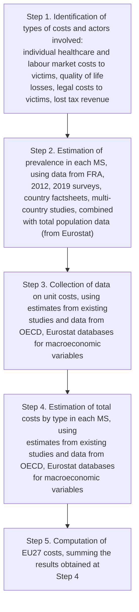

logo: European Parliament

# <u>Combating</u> <u>gender-based</u> <u>violence:</u> <u>Cyber</u> violence

<u>European added</u> value assessment

### STUDY

EPRS | European Parliamentary Research Service
Authors: Niombo Lomba, Cecilia Navarra and Meenakshi Fernandes
European Added Value Unit
PE 662.621 – March 2021
EN

---

NO_CONTENT_HERE

---

# Combating gender-based violence: Cyber violence

## European added value assessment

With the rise of new technology and social media, gender-based cyber violence is a constantly growing threat with impacts at individual, social and economic levels, on women and girls and on society generally.

There is currently no common definition or effective policy approach to combating gender-based cyber violence at EU or national level. Action taken so far has been inadequate, and the cross-border nature of gender-based cyber violence has yet to be properly addressed either.

This European added value assessment (EAVA) supports the European Parliament in its right to request legislative action by the Commission, and complements its own-initiative legislative report 'Combating gender-based violence: Cyber violence' (2020/2035(INL)).

Examining the definition and prevalence of gender-based cyber violence, the legal situation and individual, social and economic impacts, the EAVA draws conclusions on the EU action that could be taken, and identifies eight policy options. The costs to individuals and society are substantial and shown to be in the order of €49.0 to €89.3 billion. The assessment also finds that a combination of legal and non-legal policy options would generate the greatest European added value, promote the fundamental rights of victims, address individual, social and economic impacts, and support law enforcement and people working with victims. The potential European added value of the policy options considered is a reduction in the cost of gender-based cyber violence ranging from 1 to 24 %.

EPRS | European Parliamentary Research Service

---

# AUTHORS

Niombo Lomba, Cecilia Navarra and Meenakshi Fernandes, European Added Value Unit, Directorate-General for Parliamentary Research Services (EPRS).

This paper has been drawn up by the European Added Value Unit of the Directorate for Impact Assessment and European Added Value, within the Directorate-General for Parliamentary Research Services (EPRS) of the Secretariat of the European Parliament.

The <u>first annexed study</u> on the European added value assessment on combating gender-based cyber violence was written by Jack Malan, James Eager, Clara Burillo Feduchi, Michaela Brady and Ivan Bosch Chen from the Centre for Strategy & Evaluation Services LLP (CSES), with external quality assurance inputs from Merja Pentikäinen and Ben Hayes. The <u>second annexed research paper</u> on a quantitative assessment of the European added value on gender-based cyber violence was written by Dr Stella Capuano (ICF). Both studies were conducted at the request of the European Added Value Unit (EPRS).

EPRS acknowledges collaboration with the European Union Agency for Fundamental Rights (EU FRA) to obtain disaggregated data from the Crime, Safety and Victims' Rights – Fundamental Rights Survey to support the analysis.

To contact the authors, please email: [eprs-europeanaddedvalue@europarl.europa.eu](mailto:eprs-europeanaddedvalue@europarl.europa.eu)

# LINGUISTIC VERSIONS

Original: EN

Manuscript completed in March 2021.

# DISCLAIMERANDCOPYRIGHT

This document is prepared for, and addressed to, the Members and staff of the European Parliament as background material to assist them in their parliamentary work. The content of the document is the sole responsibility of its author(s) and any opinions expressed herein should not be taken to represent an official position of the Parliament.

Reproduction and translation for non-commercial purposes are authorised, provided the source is acknowledged and the European Parliament is given prior notice and sent a copy.

Brussels © European Union, 2021.

PE662.621
ISBN: 978-92-846-7890-7
DOI: 10.2861/23053
CAT: QA-02-21-301-EN-N

[eprs@ep.europa.eu](mailto:eprs@ep.europa.eu)

http://www.eprs.ep.parl.union.eu (intranet)

[http://www.europarl.europa.eu/thinktank](http://www.europarl.europa.eu/thinktank) (internet)

[http://epthinktank.eu](http://epthinktank.eu/) (blog)

---

Combating gender-based violence: Cyber violence

# Executive summary

## Background

Gender-based cyber violence is a phenomenon that was inconceivable 30 years ago. More and more women and girls are experiencing harassment, stalking and other kinds of threats while online. With the ever-growing use of **social media**, the **threats women and girls experience online** have an effect on how they use the internet. Although there are many examples of women, female politicians and female journalists experiencing cyber violence and even going to court owing to harassment or other forms of cyber violence, not a lot of data or evidence has been gathered on the phenomenon. Meanwhile, the EU Member States react and act differently when dealing with the topic. It is known that gender-based cyber violence does not necessarily happen in isolation but that in many cases there is a connection with gender-based violence face-to-face; online and off-line violence is in many cases connected and/or intertwined. The coronavirus pandemic has potentially worsened the situation as people's social lives have shifted online.

## Why should the EU act?

Having identified a wide range of gaps in existing EU actions and legislation and the negative impacts on woman and girls individually, socially and economically on account of gender-based cyber violence, this paper supports the need to act and/or intervene at EU level. Whether on the lack of **harmonised legal definitions**, the lack of **awareness**-raising and under-**reporting** or the need for more research and data, greater momentum would be achieved by EU action, not least since this is also a **cross-border** issue.

This European added value assessment (EAVA) 'Combating gender-based violence: Cyber violence' is intended to underpin the European Parliament's right to request legislative action by the Commission. This is in line with Article 225 of the Treaty on the Functioning of the European Union (TFEU). Own-initiative legislative reports (INIL) must be given prompt and detailed consideration by the European Commission as set out in point 10 of the Interinstitutional Agreement on Better Law-making of 13 April 2016. The European Parliament's Committees on Civil liberties, Justice and Home Affairs (LIBE) and on Women's Rights and Gender Equality (FEMM) jointly requested the permission to draw up an own-initiative legislative report on combating gender-based violence: cyber violence (2020/2035(INL)).

## Scope of the assessment

Beginning with a discussion on the definition of gender-based cyber violence, this assessment also considers the prevalence, and the legal, individual, social and economic impacts of gender-based cyber violence, and examines the regulatory framework at EU and national levels. To this end 12 EU Member States were analysed in greater depth. Having explored the legal base, and identified the weakness and gaps in the existing EU legal system, the paper suggests policy responses the EU could take. The assessment then discusses the **qualitative and quantitative impacts**, including economic estimates of the impacts of the policy options identified. External experts were commissioned to conduct additional analysis and contribute to a study and a paper; these are both annexed to this paper.

## The status quo

The study estimates that **4 to 7 % of women in the EU-27 have experienced cyber harassment during the past 12 months, while between 1 and 3 % have experienced cyber stalking**. The ranges in the estimates reflect the underlying uncertainty arising from the lack of robust and recent cross-country data available on the phenomenon. It appears nevertheless that younger age groups face the greatest risk and that the prevalence of the phenomenon has risen with greater internet

I

---

EPRS | European Parliamentary Research Service

and social media use. The prevalence of gender-based cyber violence is likely to continue to rise in the coming years, especially among adolescents.

Cyber violence has a direct impact on victims, first and foremost in terms of **mental health**, reflected in an increased incidence of depression and anxiety disorders. A number of **social and economic** **impacts** can also be identified: withdrawal from the public debate, costs incurred for seeking legal and healthcare assistance, labour market impacts in terms of lower presence at work, risks of job loss or lower productivity, and reduced quality of life due to poor mental health itself. Some of these impacts compound other forms of discrimination faced by women, e.g. the gender pay gap on the labour market. Moreover, they have an **intersectional** dimension and have to be observed together with other forms of discrimination and hate speech towards lesbian, gay, bisexual, transgender, intersex, and questioning (LGBTIQ) people, as well as women from racial minority groups and different religious communities.

This set of impacts generates costs affecting victims as well as society. Some impacts are tangible and can translate into economic costs, while others are intangible and cannot be monetised, despite being of major relevance.

Some of the costs of gender-based cyber violence were quantified by means of an economic assessment. These costs included healthcare costs, legal costs, labour market costs and costs associated with a reduced quality of life.

The economic assessment estimated the **overall costs** of cyber harassment and cyber stalking at between **€49.0 and €89.3 billion**. The largest cost category was the monetised value of the loss in terms of quality of life, which accounted for more than half of the overall costs (about 60 % for cyber harassment and about 50 % for cyber stalking). Labour market impacts were also found to be substantial, together accounting for approximately 30 % for cyber harassment and 35 % for cyber stalking, the higher costs for the latter owing to lower labour force participation. Healthcare costs and legal costs, while contributing less to overall costs, were nonetheless substantial.

### European added value

The analysis of the scope of the problem, the identified gaps and the resulting impact have led to the development of a set of policy options. These policy options were all EU-level actions, both legislative and non-legislative.

icon: arrow **Legislative policy options**

* Policy option 1: secure EU accession to the Istanbul Convention or develop similar EU legislation.

* Policy option 2: develop a general EU directive on (gender-based) cyber violence.

* Policy option 3: develop EU legislation on the prevention of gender-based cyber violence.

* Policy option 4: strengthen the existing legal framework.

**Non-legislative policy options**

* Policy option 5: facilitate EU and national-level awareness raising.

* Policy option 6: back national-level victim support and safeguarding services.

* Policy option 7: conduct research into gender-based cyber violence.

* Policy option 8: expand existing EU collaboration with tech companies on illegal hate speech.

Among the **legislative policy options**, the qualitative analysis suggests that ratification of the Istanbul Convention or development of similar legislation (policy option 1) could offer the most benefits. It would take into account online and offline gender based violence and adjust to international legislation. Policy option 2 is expected to have overall qualitatively similar impacts,

II

---

Combating gender-based violence: Cyber violence

despite displaying lower levels of relevance and coherence. The legislative options are the most promising, mainly owing to the development of a legal definition and associated consequences/sanctions. A 6-12 % reduction in costs could potentially be achieved with policy option 1 – EU accession to the Istanbul Convention or the development of similar EU legislation. Developing a general EU directive on (gender-based) cyber violence (policy option 2) could lead to a 5-15 % reduction in costs.

Looking at the **non-legislative options**, all policy options 5 to 8 could have a positive impact quantitatively, whereas policy option 8 is the most promising with a potential reduction of 15-24 % in costs. Relying only on soft measures and facilitating EU and national level action (policy option 5) is comparatively weaker (1- 5 % reduction). A summary of the assessment of the policy options is found in the table below.

In the qualitative analysis it is deemed that the greatest impact would be a combination of legal policy options 1 and 2 combined with the non-legal policy options 5 to 8. Thus, the analysis of the policy options indicates the **strongest impact when combining legislative and non-legislative** **legislative actions**.

From an economic perspective, most of the policy options under consideration would likely lead to a substantial reduction in the cost of gender-based cyber violence that would outweigh the costs of implementing the policy option. The reduction in costs arises either from a reduction in the prevalence of cyber violence and/or from a reduction in its mental health impacts.

The European added value (EAV) of action in this area varies depending on the policy option. The policy options considered in this study offer an **EAV that ranges between 1 and 24 % of the** **baseline costs, i.e. from €490 to 893 million and €11.8 to 21.4 billion** per year depending on the policy option considered.

Assessment of the policy options

<table>
<thead>
<tr><th></th><th colspan="4">Legal policy options</th><th colspan="4">Non-legislative policy options</th></tr>
<tr><th>**Criteria**</th><th>**Policy option 1**</th><th>**Policy option 2**</th><th>**Policy option 3**</th><th>**Policy option 4**</th><th>**Policy option 5**</th><th>**Policy option 6**</th><th>**Policy option 7**</th><th>**Policy option 8**</th></tr>
</thead>
<tbody>
<tr><td>Stakeholder impacts</td><td>+++</td><td>+++</td><td>++</td><td>+</td><td>+</td><td>++</td><td>+</td><td>++</td></tr>
<tr><td>Impacts on fundamental rights</td><td>+++</td><td>+++</td><td>++</td><td>+</td><td>+</td><td>++</td><td>+</td><td>+</td></tr>
<tr><td>Benefits</td><td>+++</td><td>+++</td><td>++</td><td>+</td><td>+</td><td>++</td><td>+</td><td>++</td></tr>
<tr><td>Costs</td><td>+++</td><td>+++</td><td>+++</td><td>+++</td><td>+</td><td>+</td><td>+</td><td>+</td></tr>
<tr><td>Risk of non-implementation</td><td>+++</td><td>+++</td><td>+++</td><td>++</td><td>++</td><td>++</td><td>+</td><td>+</td></tr>
<tr><td>Relevance</td><td>+++</td><td>++</td><td>+++</td><td>++</td><td>+++</td><td>+++</td><td>+++</td><td>++</td></tr>
<tr><td>Effectiveness</td><td>+++</td><td>++</td><td>+</td><td>+</td><td>+</td><td>++</td><td>+</td><td>++</td></tr>
<tr><td>Efficiency</td><td>++</td><td>+++</td><td>+</td><td>+</td><td>++</td><td>++</td><td>++</td><td>+++</td></tr>
<tr><td>Coherence</td><td>+++</td><td>++</td><td>+</td><td>++</td><td>+++</td><td>+++</td><td>+++</td><td>+</td></tr>
</tbody>
</table>

III

---

EPRS | European Parliamentary Research Service

<table>
<tr><td>Subsidiarity, proportionality &#x26; necessity</td><td>+++</td><td>+++</td><td>+</td><td>+</td><td>++</td><td>++</td><td>+++</td><td>+++</td></tr>
<tr><td>Feasibility</td><td>+</td><td>++</td><td>+</td><td>++</td><td>+++</td><td>+++</td><td>+++</td><td>+++</td></tr>
<tr><td>Estimated reduction in costs*</td><td>6-12%</td><td>5-15%</td><td>5-10%</td><td>5-10%</td><td>1-5%</td><td>Not quantified</td><td>15-20%</td><td></td></tr>
<tr><td colspan="9">European added value assessment</td></tr>
<tr><td>Qualitative assessment</td><td>++</td><td>+++</td><td>+</td><td>+</td><td>+</td><td>+</td><td>+</td><td>++</td></tr>
<tr><td>Quantitative assessment (€ billion)*</td><td>€2.9-10.7</td><td>€2.4-13.4</td><td>€2.4-8.9</td><td>€2.4-8.9</td><td>€0.5-4.5</td><td>Not quantified</td><td>€7.3-21.4</td><td></td></tr>
</table>

Source: Annex I to this paper. *Author estimations based on an extrapolation of the methodology used in Annex II for women aged 18 to 29 to all women aged 18 and over.

Note: Scoring system: 0 = no impact; + to +++ = varying degrees of impact, from + = low impact to +++ = high impact.

IV

---

Combating gender-based violence: Cyber violence

Table of contents

**1. Introduction** 1

**2. Defining gender-based cyber violence** 4
 2.1. Definitions 4

 2.2. Prevalence 7

**3. Regulatory framework** 9

 3.1. Applicable EU law /current legal framework 9

 3.2. National regulation 9

 3.3. UN approaches and Council of Europe treaties 10

**4. Gender-based cyber violence and current developments** 11
 4.1. Policy context 11

 4.2. Weaknesses in the existing EU legal system 12

 4.3. Gaps identified 12

 4.4. Costs of the status quo 14

 4.4.1. Impacts of gender-based cyber violence 14
 4.4.2. Quantification of the costs 18

**5. Possible EU policy responses to current weaknesses** 20
 5.1. EU right to act – legal basis 20

 5.2. Policy options and their impacts 20

 5.2.1. Qualitative and quantitative analysis by policy option 21

**6. European added value –Resumé** 27

**ANNEX I** **33**

**ANNEX II** **191**

V

---

EPRS | European Parliamentary Research Service

## Table of figures

Figure 1 - Legal definitions of gender-based cyber violence in 12 Member States 7

Figure 2 - Structure of impacts of gender-based cyber violence 14

## Table of tables

Table 1 - Methodological approach for assessing European added value 2

Table 2 - Existing definitions relating to gender-based cyber violence 4

Table 3- Prevalence of cyber violence experienced by women in the EU (past 12 months) 8

Table 4 - Overview of gaps in tackling gender-based cyber violence 13

Table 5 - Economic costs of gender-based cyber violence: yearly costs (euros, 2019) 19

Table 6 - Accession to the Istanbul Convention or similar legislation 21

Table 7 - Develop a general EU directive 22

Table 8 - develop general EU legislation 23

Table 9 - Strengthen the existing legal framework 23

Table 10 - Facilitate awareness raising 24

Table 11 - Backing of victim support and safeguarding services 25

Table 12 - Conduct research and gather data 25

Table 13 - Expand collaboration with tech companies on illegal hate speech 26

VI

---

Combating gender-based violence: Cyber violence

# 1. Introduction

This European added value assessment (EAVA) on combating gender-based cyber violence is intended to support the European Parliament in its right to request legal action by the Commission. This is in line with Article 225 of the Treaty on the Functioning of the European Union. Own-initiative legislative reports (INIL) must be given detailed and prompt consideration by the European Commission as stipulated in point 10 of the Interinstitutional Agreement on Better Law-making of 13 April 2016. The European Parliament Committees on Civil Liberties, Justice and Home Affairs (LIBE) and on Women's Rights and Gender Equality (FEMM) jointly requested the permission to draw up an own-initiative legislative report on combating gender-based cyber violence (2020/2035(INL)).

## 1.1. Methodology and scope of the assessment

This European added value assessment on 'gender-based violence: cyber violence' starts with an introduction explaining the methodology and scope of the assessment and giving a short background. Defining gender-based cyber violence and displaying its prevalence is not only a matter of topical debate, it is also necessary in order to proceed with discussing the regulatory framework for the currently applicable EU law and legal framework, as well as national approaches. The assessment also covers the policy context of gender-based cyber violence and current developments, weaknesses in the existing EU legal system and gaps that have been identified. An examination is made of potential EU policy responses that could address weaknesses, including the EU's right to act and its legal basis, and the need to act or intervene at EU level. The study then discusses policy options and their qualitative and quantitative impact, including economic estimates. The assessment closes by summing up the European added value of the various options. Here, positive net benefit is defined as that which would be better achieved by the EU than at national level alone and thus the European added value that could potentially be realised.

To access a broad range of evidence, qualitatively and quantitatively, the European added value assessment is accompanied by an external study and a research paper. The idea of the main body of this paper is to give a brief overview of the European added value assessment and its supporting annexes. In addition, the assessment expands on the analysis presented in Annex II, by including other age groups, notably women aged 30 and over and also adolescents. For more in-depth reading material and analysis see the supporting annexes.

The study (Annex I) takes a more in-depth look at the qualitative aspects of combating gender-based cyber violence, and the research paper (Annex II) is intended to look at the quantitative and thereby economic perspective. The study and the paper refer to each other and are complementary. They can also be read separately however.

⮚ Annex I: J. Malan et al., European added value assessment on combating gender-based cyber violence.

⮚ Annex II: S. Capuano, Quantitative assessment of the European added value of combating gender-based violence: Cyber violence.

Table 1 describes in a nutshell the methodology used in the two annexes to measure the European added value of combating gender-based cyber violence.

1

---

EPRS | European Parliamentary Research Service

Table 1 – Methodological approach for assessing European added value

<table>
<thead>
<tr><th></th><th>Annex I (Malan et al.)</th><th>Annex II (Capuano)</th></tr>
</thead>
<tbody>
<tr><td>Scope</td><td>• Analysis of the current legal setting, possible legal impacts and benefits, and legal policy options • Analysis of the status quo and of the current gaps • Evaluation of impacts and benefits on society and individuals, including EU policy options</td><td>• Estimates of the economic costs of gender-based cyber violence in the European Union • Two forms of cyber violence (cyber harassment and cyber stalking) within the 18-29 age-group analysed • Impact of policy options identified Annex I at EU level on the potential reduction of the identified costs.</td></tr>
<tr><td>Approach</td><td>• Qualitative (with quantitative elements)</td><td>• Quantitative (with qualitative elements)</td></tr>
<tr><td>Method</td><td>• Desk research and literature review • Data collection and analysis • 32 interviews with key stakeholders • 12 EU Member States analysed in country factsheets1 • Gaps, issues, risks and principles used to identify where regulatory intervention could be needed • Identification of scenarios and their comparison to the baseline</td><td>• Economic benefits projected as a reduction of baseline costs linked to each policy option • A bottom-up approach is applied: identification of the group of agents that are assumed to bear costs, estimation of unit costs for each group of agents and of total costs by type, and computation of overall total costs</td></tr>
<tr><td>Outcome</td><td>• Eight policy options considering EU competences, principles of subsidiarity and proportionality and political feasibility • Qualitative assessment: stakeholder impacts, impacts on fundamental rights, benefits, costs, risk of non-implementation, relevance, effectiveness, efficiency, coherence, subsidiarity, proportionality and necessity, European added value and feasibility • 12 country factsheets</td><td>• Economic benefits of eight policy options • Quantitative estimates of tangible costs Individual costs: legal costs, quality of life loss, individual direct and indirect health costs Societal costs: public health costs and lost tax revenue</td></tr>
<tr><td>Limitations</td><td>• Data availability is restricted and the only Europe-wide datasets are from 2012. As gender-based cyber violence has developed further, more recent figures (for instance on internet use) were taken into account • 12 EU Member States could be analysed.</td><td>• Relevant data to estimate prevalence were limited. Scenarios had be constructed that drew on various available sources. Focus on a single age group • Only cyber harassment and cyber stalking could be assessed. Other forms of cyber violence may also cause additional costs • Only some types of costs could be quantified. The cost figures are therefore underestimated.</td></tr>
</tbody>
</table>

Source: Compiled by the authors on the basis of Annexes I and II to this paper.

1 The 12 Member States are Belgium, Czechia, Germany, Spain, France, Italy, Lithuania, the Netherlands, Poland, Romania, Finland and Sweden. They were chosen using the criteria of a broad geographical balance and representation of different national legal and policy approaches. The factsheets provide definitions of gender-based cyber violence and its forms in use in each country; national-level data on the scale, prevalence and impacts of gender-based cyber violence; and the legal, policy and governance frameworks for gender-based cyber violence. For more, see the country factsheets annexed to Annex I to this paper.
2

---

Combating gender-based violence: Cyber violence

## 1.2. Background

Gender-based cyber violence is a phenomenon that could not have been imagined 30 years ago. More and more women and girls are experiencing harassment, stalking and other threats while online. Against the backdrop of the growing use of social media, the threats woman and girls experience online affects the way they participate on the internet. Although there are many examples of women, female politicians and female journalists experiencing cyber violence and even going to court as a result of harassment or other forms of cyber violence, not a lot of data or evidence has been gathered on these phenomena. Furthermore, Members States take differing approaches to the issue. Analysis, such as that conducted by **the European Institute for Gender Equality** (EIGE)2 or **Plan International,**3 demonstrates what women and girls have to face. It is also known that gender-based cyber violence does not necessarily happen in isolation. In many cases there is a connection with face-to-face gender-based violence and **offline and online violence are often connected** and/or intertwined.

The European Commission's advisory committee on equal opportunities for women and men has stated that cyber violence can take the form of: hate speech, cyber harassment, trafficking, sexual exploitation and cyber stalking, to give just a few examples. As the prevalence of social media and online platforms develop, these forms of violence are also developing, as the UN special rapporteur on violence against women has stated.4

It is also necessary to consider the specific context in which the online communication takes place. This can vary from social media platforms to discussion sites, dating apps and chat rooms. There is a difference between online and offline gender-based violence, although they sometimes go hand in hand. This is also true for the perpetrators themselves. They can be people close to the victims such as partners, relatives, colleagues or classmates. However, they can also be unknown users of online communication and thereby anonymous.

The following instances in which politicians or journalists have been victims of gender-based cyber violence illustrate the situation well. A Romanian journalist faced a campaign by her perpetrator when reporting non-consensual pornography.5 As victim and journalist she faced discredit and humiliation. In 2017, a Swedish study highlighted that 7 out of 10 women in the media, from editors to journalists, had experienced threats or harassment online. In 2019, when a German political television programme asked all female members of the Bundestag about their experiences of hate speech, 90 % said they had faced hate speech online.6 These very prominent cases indicate the **worsening situation for women and girls,** one that has potentially been exacerbated by the coronavirus pandemic as even more of people's social lives have shifted online.7

2 <u>Cyber violence is a growing threat, especially for women and girls,</u> European Institute for Gender Equality, 2017; and, <u>Estimating the costs of gender-based violence in the European Union,</u> European Institute for Gender Equality, 2014.

3 S. Goulds et al., <u>Free to be Online? Girls and young women's experiences of online harassment,</u> Plan International, 2020.

4 <u>Report of the Special Rapporteur on Violence against Women, Its causes and Consequences on online violence against women and girls from a human rights perspective</u> A/HRC/38/47, UN Human Rights Council, 2018.

5 V. Dimulescu, The power of grassroots initiatives: lessons from survivor-led research in Romania, in <u>When Technology Meets Misogyny: Multi-level, Intersectional Solutions to Digital Gender-Based Violence,</u> GenPol, 2019.

6 J. Lang, <u>Hass auf Frauen, die den Mund aufmachen,</u> Süddeutsche Zeitung, 22 October 2019.

7 L. Taylor, <u>Love, tech and online abuse of women in the time of coronavirus,</u> Reuters, 4 January 2021.

3

---

EPRS | European Parliamentary Research Service

# 2. Defining gender-based cyber violence

This chapter looks at the definition of gender-based cyber violence and its prevalence, with a view to developing policy options and examining their European added value.

## 2.1. Definitions

As mentioned in Chapter 1, gender-based cyber violence is an evolving issue, in terms both of the complexity of the situation, and of continuing changes in technology and behaviour. Although there is broad understanding of what gender-based cyber violence is and what it constitutes, there is **no distinct definition**, at either **EU** or national level.8

Various players, institutions and committees have looked at the question of defining cyber violence and gender-based cyber violence. In many cases, only specific aspects were analysed, such as cybercrime or cyber violence against children, violence against women, for instance. There are **definitions**, for example, from the **Cybercrime Convention Committee**, **Budapest Convention** on Cybercrime, and **Istanbul Convention** on preventing and combating violence against women and domestic violence (all three instigated by the Council of Europe), the above-mentioned European Commission advisory committee on equal opportunities for women and men, and the UN Special Rapporteur on violence against women. Table 2 presents an overview of existing definitions relating to gender-based cyber violence.

Table 2 – Existing definitions relating to gender-based cyber violence

<table>
<thead>
<tr><th>Definition</th><th>Focus</th><th>Relevance</th><th>Legally binding</th></tr>
</thead>
<tbody>
<tr><td>**Cybercrime Convention Committee, Council of Europe.** Defines cyber violence as the 'use of computer systems to cause, facilitate, or threaten violence against individuals that results in, or is likely to result in [...] harm or suffering and may include the exploitation of the individual's circumstances, characteristics or vulnerabilities.'9</td><td>Cyber violence</td><td>Directly relevant</td><td>Non-legal</td></tr>
<tr><td>**Budapest Convention on Cybercrime, Council of Europe.**10 Defines a range of different cybercrimes under the following headings: offences against the confidentiality, integrity and availability of computer data and systems; computer-related offenses; content-related offences, focusing on child pornography; and offences related to infringements of copyright and related rights.</td><td>Cybercrime</td><td>Indirectly relevant</td><td>Legally binding</td></tr>
<tr><td>**Advisory Committee on Equal Opportunities for Women and Men.** 'Cyberviolence against women is an act of gender-based violence perpetrated directly or indirectly through information and communication technologies that results in, or is likely to result in, physical, sexual, psychological or economic harm or suffering to women and girls, including threats of such acts,</td><td>Cyber violence against women</td><td>Directly relevant</td><td>Non-legal</td></tr>
</tbody>
</table>

8 Cyber violence and hate speech online against women, European Parliament, Policy Department for Citizens' Rights and Constitutional Affairs, 2018; and Annex I to this paper.

9 Cyberviolence webpage on the Cybercrime portal, Council of Europe, 26 February 2021.

10 Convention on Cybercrime (Budapest Convention), Council of Europe, 2001.

4

---

Combating gender-based violence: Cyber violence

<table>
<thead>
<tr><th>Definition</th><th>Focus</th><th>Relevance</th><th>Legally binding</th></tr>
</thead>
<tbody>
<tr><td>whether occurring in public or private life, or hindrances to the use of their fundamental rights and freedoms. Cyberviolence against women is not limited to but includes violations of privacy, stalking, harassment, gender-based hate speech, personal content sharing without consent, image-based sexual abuse, hacking, identity theft, and direct violence. Cyberviolence is part of the continuum of violence against women: it does not exist in a vacuum; rather, it both stems from and sustains multiple forms of offline violence.11</td><td></td><td></td><td></td></tr>
<tr><td>**UN Special Rapporteur on Violence against Women.** 'Any act of gender-based violence against women that is committed, assisted or aggravated in part or fully by the use of ICT, such as mobile phones and smartphones, the Internet, social media platforms or email, against a woman because she is a woman, or affects women disproportionately.'12</td><td>Cyber violence against women</td><td>Directly relevant</td><td>Non-legal</td></tr>
<tr><td>**Istanbul Convention on preventing and combating violence against women and domestic violence.** Within the Convention, violence against women is understood as 'a violation of human rights and a form of discrimination against women and shall mean all acts of gender-based violence that result in, or are likely to result in, physical, sexual, psychological or economic harm or suffering to women, including threats of such acts, coercion or arbitrary deprivation of liberty, whether occurring in public or in private life'.13 Further, for it to be gender-based against women it must be 'directed against a woman because she is a woman' or it must affect women disproportionately. Similar definitions that focus on the types of harm caused are used by the **European Institute for Gender Equality** (EIGE)14 and the **UN Declaration on the Elimination of Violence against Women.**15</td><td>Violence against women</td><td>Directly relevant</td><td>Legally binding</td></tr>
<tr><td>**Directive on Attacks against Information Systems.**16 Establishes minimum rules concerning the definition of the following criminal offences: illegal access to information systems; illegal system interference; illegal data interference; illegal interception; tools used for committing offences; and incitement, aiding and abetting and attempt.</td><td>Cybercrime</td><td>Indirectly relevant</td><td>Legally binding</td></tr>
</tbody>
</table>

11 <u>Opinion on combatting online violence against women,</u> European Commission Advisory Committee on Equal Opportunities for Women and Men, April 2020.

12 <u>Report of the Special Rapporteur on violence against women, its causes and consequences on online violence against</u> <u>women and girls from a human rights perspective</u> A/HRC/38/47, UN Human Rights Council, 2018.

13 Convention on preventing and combating violence against women and domestic violence (Istanbul convention), Council of Europe, 2011.

14 <u>Forms of Gender-based violence,</u> European Institute for Gender Equality (EIGE), 25 February 2021.

15 <u>Declaration on the Elimination of Violence against Women,</u> UN Office of the High Commissioner for Human Rights, 1993.

16 <u>Directive 2013/40/EU</u> of 12 August 2013 on attacks against information systems.

5

---

EPRS | European Parliamentary Research Service

<table>
<thead>
<tr><th>Definition</th><th>Focus</th><th>Relevance</th><th>Legally binding</th></tr>
</thead>
<tbody>
<tr><td>**Directive on Combating Sexual Abuse of Children.**17 Establishes minimum rules concerning the definition of criminal offences and sanctions in the area of sexual abuse and sexual exploitation of children, child pornography and solicitation of children for sexual purposes. Children are defined as any person under the age of 18.</td><td>Cyber violence and crimes against children</td><td>Indirectly relevant</td><td>Legally binding</td></tr>
</tbody>
</table>

Source: Annex I to this paper.

In line with Annex I to this paper, there is understood to be a close interaction between gender-based violence and gender-based cyber violence. There are also effects and aspects unique to gender-based cyber violence. In line with an earlier EIGE analysis,18 cyber violence cannot be seen separately from violence. Furthermore, there are discussions on the terminology from a technological perspective that can lead to differing understandings of what cyber violence is, e.g. excluding information and communication technology-facilitated violence and technology-facilitated violence from cyber violence. It is important to say, that in the context of this paper, the following forms of gender-based violence were examined:

* ⮚ **cyber stalking,**

* ⮚ **trolling,**

* ⮚ **cyber harassment and bullying,**

* ⮚ **hate speech online,**

* ⮚ **flaming,**

* ⮚ **image-based sexual abuse / non-consensual pornography,**

* ⮚ **and doxing.**19

At the national level, Annex I to this paper made a more in-depth analysis of 12 Member States.20 As shown in Figure 1, this research identified three different approaches to legal definitions of gender-based cyber violence in those countries. One Member State has a general legal definition (Romania). The vast majority have a legal definition of (a) specific form(s) of gender-based cyber violence (e.g. France and the Netherlands) and several countries have no explicit legal definitions (e.g. Sweden and Poland).

17 [Directive 2011/93/EU](https://eur-lex.europa.eu/legal-content/EN/TXT/PDF/?uri=CELEX:32011L0093&from=EN) of 13 December 2011 on combating the sexual abuse and sexual exploitation of children and child pornography.

18 <u>Cyber violence is a growing threat, especially for women and girls,</u> European Institute for Gender Equality, 2017; and, Estimating the costs of gender-based violence in the European Union, European Institute for Gender Equality (EIGE), 2014.

19 For a more detailed discussion on the categories and typologies as well as their definitions, see Annex I to this paper and Cyber violence and hate speech online against women, European Parliament, Policy Department for Citizens' Rights and Constitutional Affairs, 2018.

20 Those 12 Member States are Belgium, Czechia, Germany, Spain, France, Italy, Lithuania, the Netherlands, Poland, Romania, Finland and Sweden. For more see Annex I to this paper.

6

---

Combating gender-based violence: Cyber violence

<u>Figure 1 – Legal definitions of gender-based cyber violence in 12 Member States</u>

map: Legal definitions of gender-based cyber violence in 12 Member States

**Source:** Annex I to this paper
**Note:** Member States analysed: BE, CZ, FI, FR, DE, IT, LT, NL, PO, RO, ES and SE.

## 2.2. Prevalence

The prevalence of gender-based cyber violence in the EU is challenging to establish on account of the limited availability of data from all Member States. The lack of clear and consistent definitions of the various forms of gender-based cyber violence means that estimates of prevalence from different studies and Member States cannot be easily compared or aggregated. Moreover, the fact that gender-based cyber violence is not criminalised in most Member States implies that police and justice data are not available.

Following the methodology set out in Annex II, this study constructs **three scenarios** for the prevalence of two forms of gender-based cyber violence experienced by women in the past 12 months – **cyber harassment and cyber stalking** (see Table 3). These scenarios draw largely on data from two surveys carried out by the EU Fundamental Rights Agency (FRA). One survey concerned with violence against women gathered information about cyber stalking and cyber harassment in 2012. Another survey on crime, safety and human rights was fielded in 2019 and included a question about cyber harassment.21 Respondents to the 2019 survey included men and women while the 2012 survey targeted only women. Data for this analysis was obtained directly from FRA for women, by age group of interest.

**Scenario 1** draws on Member State data from the 2012 and 2019 FRA surveys. The estimate for cyber harassment is based on responses from women to the 2019 survey. The estimate for cyber stalking

21 <u>Crime, safety and victims' rights, </u>European Union Agency for Fundamental Rights (EU FRA), Publication Office of the European Union, 2021.

7

---

EPRS | European Parliamentary Research Service

is based on an estimate from the 2012 survey, which is inflated by the increase in cyber harassment between 2012 and 2019. **Scenario 2** draws on Member State data from the 2012 FRA survey and does not adjust the estimates by any factor. **Scenario 3** inflates the Member State estimates from the 2012 FRA survey using trend data on social media usage.

EU-level estimates are then constructed for each scenario, taking into account the population level of the Member States. Considering the three scenarios, the study estimates that **4 to 7 % of women** **in the EU-27 have experienced cyber harassment during the past 12 months**. The share of women in the EU who have experienced **cyber stalking during the past 12 months is lower at** **1 to 3 %**. The ranges in the estimates reflect the underlying **uncertainty** resulting from the lack of available robust and recent cross-country data on the phenomenon.

The share of women who have experienced cyber violence **in their lifetime is higher – FRA** **estimates that 1 in 10 women (11 %) have experienced cyber harassment or cyber stalking** **since the age of 15**.22 The rate of cyber violence appears to be linked to the increase in **internet** and social media usage. For example, Sweden had the highest prevalence of cyber harassment in 2012 as well as one of the highest rates of internet access. Similarly, Romania had one of the lowest rates of cyber harassment in 2012 and also the lowest rate of internet access (see Annex I). Between 2012 and 2019, the level of internet access among households increased from 76 % to 90 % in the EU.23 **Younger age groups** are also at greater risk of cyber violence – for example, the prevalence of cyber harassment was 20 % among women aged 18 to 29 as compared with 13 % among women aged 30 to 39 (see Annex I). FRA has also investigated experiences of cyber harassment among specific risk groups, for example, LGBTIQ people and Jews.24 More than one in five (22 %) LGBTIQ people had experienced cyber harassment in the past 12 months, which is higher than the general female population.25 Among Jews, 7 % reported receiving offensive or threatening emails or text messages while 10 % reported offensive comments posted on the internet, including social media, in the past 12 months.26 Among migrants and minorities, the percentages were 1 and 2 % respectively.27

Table 3– Prevalence of cyber violence experienced by women in the EU (past 12 months)

<table>
<thead>
<tr><th></th><th>Cyber harassment</th><th>Cyber stalking</th></tr>
</thead>
<tbody>
<tr><td>Scenario 1</td><td>7 %</td><td>3 %</td></tr>
<tr><td>Scenario 2</td><td>4 %</td><td>1 %</td></tr>
<tr><td>Scenario 3</td><td>6 %</td><td>2 %</td></tr>
<tr><td>Overall range:</td><td>4-7 %</td><td>1-3 %</td></tr>
</tbody>
</table>

Note: EPRS estimates obtained applying the methodology used in Annex II for women aged 18 to 29 to all women aged 18 and over. The weighted estimates use 2019 population data available from Eurostat.

22 Violence against women: an EU-wide survey – Main Results, European Union Agency for Fundamental Rights (EU FRA), 2018.

23 Households – level of internet access. Eurostat, 2019.

24 A long way to go for LGBTI equality, European Union Agency for Fundamental Rights (EU FRA), 2020.

25 Online data explorer for LGBTI survey, European Union Agency for Fundamental Rights (EU FRA), 2020.

26 Experiences and perceptions of antisemitism Second survey on discrimination and hate crime against Jews in the EU, European Union Agency for Fundamental Rights (EU FRA), 2018.

27 Second European Union Minorities and Discrimination Survey Main results, European Union Agency for Fundamental Rights (EU FRA), 2017.

8

---

Combating gender-based violence: Cyber violence

## 3. Regulatory framework

This chapter offers a brief overview28 of existing regulatory frameworks and approaches at EU, national and international levels. In this context it is worth noting the absence of a defined regulatory framework on gender-based cyber violence within the EU.

## 3.1. Applicable EU law /current legal framework

The EU has **no 'single' approach** to combating gender-based cyber violence. Nevertheless, there are currently several **ways cyber violence can be addressed** at EU level. This possibility includes soft law and legislation applying to online media and platforms as well as crimes. Examples of relevant regulations include the General Data Protection Regulation (GDPR)29, the e-Commerce Directive,30 the Audio-visual Media Services Directive31 and the Code of Conduct on Countering Illegal Hate Speech Online (non-binding).32 Further directives addressing crimes and the transnational cross-border nature of (cyber) violence against women are the Victims' Rights Directive,33 the Anti-Trafficking Directive,34 and the Directive on Combating Sexual Abuse of Children. 35

## 3.2. National regulation

In the absence of easily accessible information on EU Member States' legislation on the subject, as part of this research the legal approaches of 12 Member States were analysed. Furthermore, the Council of Europe 36 collects and provides information on cyber violence, for instance on existing legislation, policies and justice measures. As mentioned in Chapter 2, there is no one distinct definition of cyber violence, which makes it difficult to analyse the measures taken by the Member States. Still, it is clear that the Member States vary in their legislative approaches to combating gender-based cyber violence.

The outcome of the analysis of the 12 Members States shows that criminal law provisions are used to address online cyber violence although they are not specifically designed to do so. Four different types of legislation addressing gender-based cyber violence were identified. Some Member States use a mix of the four approaches.

* ⮚ Some **Member States criminalise gender-based cyber violence**, e.g. Romania and France.

* ⮚ **Others criminalise specific types of cyber violence without addressing the**
  **gender angle**, e.g. Belgium, Czechia, Spain and France. (Exception: all Member States criminalise child pornography).

28 For a more in-depth analysis see Annex I to this paper and <u>Cyber violence and hate speech online against women,</u> Policy Department for Citizens' Rights and Constitutional Affairs, European Parliament, 2018.

29 <u>Regulation (EU) 2016/679</u> of 27 April 2016 on the protection of natural persons with regard to the processing of personal data and on the free movement of such data.

30 [Directive 2000/31/EC](https://eur-lex.europa.eu/legal-content/EN/ALL/?uri=CELEX%3A32000L0031) of 8 June 2000 on certain legal aspects of information society services, in particular electronic commerce, in the internal market ('Directive on electronic commerce').

31 [Directive 2018/1808](https://eur-lex.europa.eu/eli/dir/2018/1808/oj) of 14 November 2018 on the Audiovisual Media Services Directive.

32 <u>Code of Conduct on Countering Illegal Hate Speech Online,</u> European Commission, 2016.

33 [Directive 2012/29/EU](https://eur-lex.europa.eu/legal-content/EN/ALL/?uri=CELEX%3A32012L0029) of 25 October 2012 establishing minimum standards on the rights, support and protection of victims of crime.

34 [Directive 2011/36/EU](https://eur-lex.europa.eu/legal-content/EN/ALL/?uri=CELEX%3A32011L0036) of 5 April 2011 on preventing and combating trafficking in human beings and protecting its victims.

35 [Directive 2011/93/EU](https://eur-lex.europa.eu/legal-content/EN/TXT/?uri=celex%3A32011L0093) of 13 December 2011 on combating the sexual abuse and sexual exploitation of children and child pornography.

36 <u>Council of Europe Webportal,</u> Council of Europe, 26 February 2021.

9

---

EPRS | European Parliamentary Research Service

* On **cyber bullying**, Italy37 addresses the protection of minors and some provisions of the Criminal Code can be used for combating violence online.

* On **cyber harassment**, Austria is at the forefront.

* **Hate speech** without a specific gender component is criminalised in Spain, the Netherlands, Bulgaria, Greece, Croatia, Portugal and Malta.

* In a third category are **Member States that use existing provisions not specific to online crimes**. These countries include Germany, Spain, Finland and the Netherlands.

* Last but not least are **Member States working on the basis of non-criminal provisions**. Germany, Lithuania and Ireland aim to prevent gender-based cyber violence using this approach.

## 3.3. UN approaches and Council of Europe treaties

At international level there is a set of legal and policy frameworks. The United Nations (UN) and the **Council of Europe** have voted on various resolutions, recommendations and reports.

Examples of **UN decisions** include the UN General Assembly resolution on protecting women human rights defenders,38 the UN Human Rights Council resolution on the promotion, protection and enjoyment of human rights on the internet,39 the UN General Assembly resolution on the right to privacy in the digital age,40 the <u>UN Agenda 2030,</u>41 and General Recommendation No 35 on gender-based violence against women (CEDAW Committee).42 Furthermore, the UN Special Rapporteur on Violence Against Women has released a report focusing on online gender-based violence.43

The **Council of Europe** has a set of treaties and protocols in place. These include the Budapest Convention on Cybercrime,44 the Istanbul Convention on preventing and combating violence against women and domestic violence45 and the Lanzarote Convention on Protection of Children against Sexual Exploitation and Sexual Abuse.46 The European Union is moving towards ratifying the Istanbul Convention but has not yet done so. Six EU Members States have still to ratify the convention.47

37 In 2019, Italy passed a law criminalising non-consensual pornography (Article 10, Law No 69, 19 July 2019).

38 Resolution adopted on 18 December 2013. <u>Promotion of the Declaration on the Right and Responsibility of</u> <u>Individuals, Groups and Organs of Society to Promote and Protect Universally Recognized Human Rights and</u> Fundamental Freedoms: protecting women human rights defenders, United Nations General Assembly, 2013.

39 Resolution adopted on 1 July 2016. The promotion, protection and enjoyment of human rights on the Internet, Human Rights Council, 2016.

40 The right to privacy in the digital age, United Nations General Assembly, 2013.

41 UN Agenda 2030, United Nations (UN), 2015.

42 General Recommendation No 35 on gender-based violence against women, Committee on the Elimination of Discrimination against Women (CEDAW), 2017.

43 <u>Report of the Special Rapporteur on violence against women, its causes and consequences on online violence against</u> <u>women and girls from a human rights perspective</u> A/HRC/38/47, UN Human Rights Council, 2018.

44 Convention on Cybercrime (Budapest Convention), Council of Europe, 2001.

45 Convention on preventing and combating violence against women and domestic violence (Istanbul Convention), Council of Europe, 2011.

46 <u>Council of Europe Convention on the Protection of Children against Sexual Abuse</u> (Lanzarote Convention), Council of Europe, 2007.

47 For more see Chart of signatures and ratifications of Treaty 210, Council of Europe Treaty Office, 2020; Council of Europe Webportal, Council of Europe, accessed 26 February 2021; and <u>EU Accession to the Council of Europe</u> Convention on Preventing and Combating Violence Against Women ('Istanbul Convention'), Legislative Train Schedule, European Parliament, 2020.

10

---

Combating gender-based violence: Cyber violence

# 4. Gender-based cyber violence and current developments

## 4.1. Policy context

The European Commission and the European Parliament identified **violence against women** and cyber violence as pertinent issues needing action a number of years ago. The Juncker Commission included violence against women and victim protection in its Strategic Engagement for Gender Equality 2016-2019.48 Cyber security has been on the agenda since 2013 as part of the cyber security strategy for the European Union.49 The digital single market strategy50 also included issues relating to trust and security. In parallel, the Commission launched various strategies, for instance on delivering a better internet for our children51 and increasing female participation52 in the digital sector.53

In addition, the Commission set up several new programmes, guidelines and actions, for instance in 2017 on stronger cooperation on a global alliance to fight violence against women and girls together with the Organisation for Economic Cooperation and Development (OECD), the Council of Europe and UN Women.54 Other examples of initiatives are NON.NO.NEIN campaign – Say NO! Stop violence against women,55 and programmes on awareness raising, monitoring and detecting online hate speech, e.g. MANDOLA56 and others.57

The European Parliament has been quite active and vocal in seeking **greater gender diversity in the digital world and combating cyber violence**. This includes reports proposing measures to combat mobbing and sexual harassment, including online,58 a resolution on empowering women and girls through the digital sector, and a resolution on gender equality in the media sector.59 Parliament has looked specifically at combating sexual harassment and abuse in the EU60 and at the fight against cybercrime.61 In its 2017 resolution on EU accession to the Council of Europe Convention on preventing and combating violence against women and domestic violence62

48 Strategic Engagement for Gender Equality 2016-2019, European Commission, 2015.

49 Cyber security strategy for the European Union, European Commission, 2013.

50 A Digital Single Market Strategy for Europe, COM(2015) 192 final, European Commission, 2015.

51 A European Strategy to deliver a Better Internet for our Children, European Commission, 23 February 2021.

52 Women in Digital, European Commission, 10 March 2020.

53 For more see Cyber violence and hate speech online against women, European Parliament, Policy Department for Citizens' Rights and Constitutional Affairs, 2018.

54 Joint communiqué on Global Action to Combat Violence against Women, Organisation for Economic Co-operation and Development (OECD), the Council of Europe, the European Commission, and UN Women, 2017.

55 Non.No.Nein campaign, European Commission, 2018.

56 Monitoring and Detecting OnLine Hate Speech (MANDOLA), 26 February 2021.

57 For more see Cyber violence and hate speech online against women, European Parliament, Policy Department for Citizens' Rights and Constitutional Affairs, 2018.

58 Resolution of 11 September 2018 on <u>measures to prevent and combat mobbing and sexual harassment at workplace,</u> <u>in public spaces, and political life in the EU</u> (2018/2055(INI)), September 2018.

59 Resolution of 17 April 2018 on empowering women and girls through the digital sector (2017/3016(RSP)), European Parliament, April 2018.

60 Resolution of 26 October 2017 on combating sexual harassment and abuse in the EU (2017/2897(RSP)), European Parliament, October 2017.

61 Resolution of 3 October 2017 on the fight against cybercrime (2017/2068(INI)), European Parliament, October 2017.

62 Resolution of 12 September 2017 on the <u>proposal for a Council decision on the conclusion, by the European Union,</u> <u>of the Council of Europe Convention on preventing and combating violence against women and domestic violence</u> (COM(2016)0109 – 2016/0062(NLE)), European Parliament, September 2017.

11

---

EPRS | European Parliamentary Research Service

Parliament pledged to work at tackling gender-based violence online. Parliament has also been active on the proposal on an e-privacy regulation63 and on the Audiovisual Media Services Directive.64 In 2020, the LIBE and FEMM committees held a joint hearing on combating gender-based cyber violence.65

## 4.2. Weaknesses in the existing EU legal system

Social media and platforms, online communication and apps facilitate our life and are nowadays an essential part of our societies. As shown in Chapter 2, the threat posed to women and girls online is unfortunately growing however. **The existing legislation does not provide the mechanisms needed to address gender-based cyber violence adequately.** There is no common understanding of what cyber violence is or what gender-based cyber violence means for the victims or society as a whole. The Member States have divergent approaches and do not cover all aspects of the problem. The existing EU-level measures do not include gender-based cyber violence despite its **cross-border nature**. This also is true of the recognition of specific types of gender-based cyber violence. Moreover, not all Member States are intending to sign the Istanbul Convention.66

## 4.3. Gaps identified

This section identifies and presents in further detail current gaps and shortcomings hindering the fight against gender-based cyber violence and its many forms. These are summarised in Table 4.

A first set of gaps relates to the **lack of appropriate legal tools** at EU level. The **absence of a harmonised definition** means that the extent to which Member States combat and prevent gender-based cyber violence differs significantly, leaving wide disparities in protection between Member States, despite the potentially **cross-border nature** of the violence perpetrated (being perpetrated via information and communication technology). More specific legal challenges relate to: i) law enforcement practices that risk producing further mental health strain on victims; ii) technical challenges of accessing evidence in the online environment; and iii) legal challenges of conducting cross-border investigations in the EU.

**Lack of awareness** persists, in both the private and public spheres, for various reasons, including persisting gender stereotypes. Victims may not be aware of their rights and/or may face many obstacles in obtaining support, reporting crimes, being taken seriously, and recovering from the incident. **Under-reporting** is partially linked to this issue, together with other factors such as fear, and this goes together with low prosecution rates. At the same time, little investment is made in **investigating the scale and impact** of the phenomenon, thus limiting collective awareness of the issue. There is also a severe **lack of support services and safeguarding measures** for victims of gender-based cyber violence, and when they do exist structures are often underfunded.

63 <u>Proposal for a regulation on the respect for private life and the protection of personal data in electronic</u> communications, Legislative Train Schedule, European Parliament, 21 January 2021.

64 Audiovisual Media Services Directive (AVMSD), European Commission, 7 July 2020.

65 Hearing on combating gender-based violence: cyber violence by the two Committees LIBE and FEMM, European Parliament, November 2020.

66 For more see Annex I to this paper.

12

---

Combating gender-based violence: Cyber violence

Table 4 – Overview of gaps in tackling gender-based cyber violence

<table>
<thead>
<tr><th>Challenge</th><th>Type of challenge</th><th>Impacts</th><th>Relevant stakeholders</th></tr>
</thead>
<tbody>
<tr><td>**Lack of a harmonised legal definition of gender-based cyber violence**</td><td>Legal Policy</td><td>• Divergent legal and policy approaches to tackling gender-based cyber violence and its many forms across the Member States. • Lack of a basis for cross-border cooperation on gender-based cyber violence. • Lack of a gender and intersectional perspective in existing legislation. • Lack of a 'cyber' perspective in existing legislation.</td><td>EU institutions Member State authorities Victims of gender-based cyber violence</td></tr>
<tr><td>**Lack of awareness** of gender-based cyber violence across all stakeholder groups</td><td>Policy</td><td>• Low prosecution levels for online violence.67 • Victims in general lack awareness of their rights and the services available to them.68</td><td>Population as a whole Victims of gender-based cyber violence Public authorities (EU &#x26; Member States) Law enforcement</td></tr>
<tr><td>**Under-reporting** of gender-based cyber violence</td><td>Policy</td><td>• Systematic under-reporting by victims to law enforcement.69 • Low prosecution levels for online violence.70</td><td>Victims of gender-based cyber violence Law enforcement</td></tr>
<tr><td>**Victim support and safeguarding challenges**</td><td>Policy Financial</td><td>• Inadequate victim support, considering response and referral by law enforcement.71 • Regional co-funding structures impact sustainability of victim support services.72 • Victim support services generally are under-funded.73</td><td>Victims of gender-based cyber violence Providers of victim support services Law enforcement</td></tr>
<tr><td>**Limited research and knowledge** on various aspects of the phenomenon</td><td>Research</td><td>• Limited quantitative data and research on the scale and prevalence of the issue. • Limited quantitative data on the social and economic impacts of gender-based cyber violence on victims and other stakeholders. • Limited EU-wide research on the legal approaches to the issue.</td><td>EU institutions &#x26; relevant agencies (EIGE, FRA, Europol, Eurojust, ENISA) Member State authorities Academic and research institutions</td></tr>
<tr><td>**Investigative challenges**, including difficulties accessing evidence and working cross-border.</td><td>Legal Technical</td><td>• Low prosecution levels for online violence.74 • Difficulties accessing evidence.</td><td>Victims &#x26; perpetrators of gender-based cyber violence Law enforcement Tech companies</td></tr>
</tbody>
</table>

67 F. Andersson, K.N. Hedqvist and D. Shannon, <u>Threats and violations reported to the police via individuals via the</u> internet, NCCP, 2015.

68 The Victims' Rights Directive 2012/29/EU. European Implementation Assessment, EPRS, European Parliament, 2017.

69 <u>Report submitted by Poland pursuant to Article 68, paragraph 1 of the Council of Europe Convention on preventing</u> and combating violence against women and domestic violence (Baseline Report), GREVIO, Council of Europe, 2020.

70 F. Andersson, K.N. Hedqvist and D. Shannon, <u>Threats and violations reported to the police via individuals via the</u> internet, NCCP, 2015.

71 C. Barlow and I. Awan, <u>You Need to Be Sorted Out With a Knife: The Attempted Online Silencing of Women and People</u> of Muslim Faith Within Academia, Social Media + Society, 2016.

72 Concluding observations on the sixth periodic report of the Czech Republic CEDAW/C/CZE/CO/6, Committee on the Elimination of Discrimination against Women, Council of Europe, 2016.

73 The Victims' Rights Directive 2012/29/EU. European Implementation Assessment, EPRS, European Parliament, 2017.

74 F. Andersson, K.N. Hedqvist and D. Shannon, <u>Threats and violations reported to the police via individuals via the</u> internet, NCCP, 2015.

13

---

EPRS | European Parliamentary Research Service

## 4.4. Costs of the status quo

### 4.4.1. Impacts of gender-based cyber violence

Gender-based cyber violence has a number of impacts on individuals and society. Some impacts are **tangible** and can be translated into economic costs, while others are **intangible** and cannot be monetised, though still being of major relevance.

The primary effect of cyber violence is the emotional strain and psychological burden suffered by victims, which impacts on their **mental health**.75 Suffering cyber harassment can result in lower self-esteem and increase distress when interacting with others online. Research shows that victims of cyber violence can experience concentration problems, stress, anxiety and panic attacks after such incidents.

Figure 2 – Structure of impacts of gender-based cyber violence

*   **Individual mental health impacts**:
    *   Mental health**: anxiety**, low self esteem**, depression**, post-traumatic stress disorder (PTSD), lack of trust and of sense of control
    *   Withdrawal from social life
*   **Social and economic impacts**:
    *   **Absence from work (days lost), risk of losing job**
    *   **Reduced productivity**
    *   **Reduced quality of life**
    *   Withdrawal from social media and fewer opportunities of social networks and connections
    *   Lower participation in public debate and in the democratic arena
    *   **Higher costs for legal and healthcare services**
*   **Wider society impacts**:
    *   **Lost tax income due to lower labour incomes**
    *   Increased unemployment and other macroeconomic impacts owing to lower labour incomes
    *   'Silencing' of women in public spaces

Source: Based on Annex I and II to this paper.
Note: **Items in bold are those quantified.**

When it comes to cyber stalking in particular (in a similar way to offline stalking) victims are known to experience heightened anxiety levels and PTSD (post-traumatic stress disorder) symptomology. Another prominent mental health consequence among victims of cyber violence is depression, feelings of helplessness, pessimistic views of the future, and a lack of confidence in ability to control their own lives. A number of self-protective measures are often put in place that imply withdrawal from social media and more broadly from social interaction. The implications for victims' personal relationships can be significant. Depression is also among the health consequences for victims of non-consensual pornography, which can lead to substance abuse and PTSD symptoms. A sense of

75 See Annex I to this paper, section 3.2.1.

14

---

Combating gender-based violence: Cyber violence

isolation, shame and lack of trust can result from the barrage of abusive language following an episode of image-based abusive behaviour.

These forms of violence have a number of **economic consequences**. These can be grouped under three broad categories:76

* ⮚ **cost of seeking help: legal and healthcare costs**;

* ⮚ **labour market impacts** (reduced employment and productivity), damage to career (including through negative effects of withdrawal by social media), and lost output;77

* ⮚ **reduced quality of life** as a consequence of poor mental health, that can be monetised as disability-adjusted life years (DALY).78

The direct costs of seeking help and protection include legal costs, healthcare costs, but may also include costs of online protection devices and costs of moving house if personal details are abusively shared.

Worsening mental health impacts productivity at work and absences from work; victimisation from cyber violence, moreover, can affect women's employment and participation in the labour market. A noteworthy example is non-consensual pornography, which can damage women in their ability to get a job or lead to their dismissal from their current job. This has proved to be an issue particularly for teachers and in recruitment cases where employers frequently run online searches on prospective employees. professionals and entrepreneurs who need social media for work, networking, marketing, etc. can also suffer economic consequences. Being pushed off platforms for fear of cyber violence can result in economic damage.

These impacts bring about costs at an aggregate level, where they have an **enforcing effect**, because of further negative economic consequences and consequences on other actors, and because they sum up and reinforce existing inequalities. The latter is for example true in the labour market, where **women face discrimination on several levels**. In both employment and wages there is a major gender gap: for example, according to Eurostat data from 2018,79 women's gross hourly wages are 14.8 % lower than those of men.

This is also true in terms of the '**silencing effect**', whereby women withdraw from the public space (including the online sphere) to preserve their safety. Research shows that that targeted abuse towards women (including journalists and politicians) in online spaces is having the effect of pushing them out of certain discussions, and this can have the effect of discouraging participation by women in democratic life. This adds up to the already low presence of women in political life, as highlighted by an EIGE study in 2020.80

There is also an **intersectional dimension** in gender-based cyber violence, where it is possible to observe the 'multiplicative effect' of discriminatory and violent behaviours and hate crimes. Cyber violence can be stronger towards lesbian, bisexual and transgender women, as well as women from

76 These impacts are similar in nature to the impacts identified for gender-based violence generally, which include missing work (paid and unpaid), poor physical and mental health status, and out-of-pocket expenditure for accessing services (see e.g. CDC, 2003, EIGE, 2014, UK Home Office, 2019 and Sacco, 2019).

77 Annex I and Annex II to this paper.

78 Annex II to this paper. Another example of studies using the cost of reduced quality of life in the context of physical violence and abusive behaviours is a recent European Commission study on the costs of the trafficking of human beings, according to which victims of trafficking are subject to physical, sexual and mental injuries that reduce quality of life; a value is placed on these losses in quality of life using the health-oriented framework of the global burden of disease (GBD), in which losses are expressed as disability adjusted life years (DALYs).

79 Difference in the average gross hourly wage of men and women, <u>Gender gap in unadjusted form,</u> Eurostat, 2021.

80 Gender Statistics Database: Women and men in decision-making, European Institute for Gender Equality (EIGE), 2020.

15

---

EPRS | European Parliamentary Research Service

racial minority groups and different religious communities.81 Among migrants, second generations and minorities, physical and online harassment can lead to lower trust in institutions and ultimately damage social integration.82 A FRA survey on antisemitism83 indicates that victimisation by hate crimes may push people to emigrate because they do not feel safe where they are (the survey shows that this has been an increasing phenomenon in recent years).

This is also true of offline violence against women; in the 2012 FRA study, 34 % of the respondents with disabilities had experienced physical, sexual or psychological violence and threats of violence, compared with 19 % of women who did not have a disability.84

The breach of a victim's **fundamental rights**, such as freedom of speech or expression, and protection from discrimination, moreover, has an impact at societal as well as individual level, since protection of **fundamental rights** is enshrined in international, EU and national law.

Moreover, the impacts on labour market participation and earnings have also negative **macroeconomic** effects, as pointed out in research on Vietnam, which estimates the **macroeconomic** loss due to violence against women, taking into account the structural linkages of production, which contribute to the generation of employment and income in the economy (the economic loss is estimated at 0.96 % of GDP at factor cost).85

Persons **other than the direct victims** can suffer the consequences of cyber violence. This could include journalists reporting incidents potentially becoming victims of gender-based cyber violence themselves. Another example are human content moderators on digital platforms who can experience serious psychological issues due to their extended exposure to upsetting, graphic, and violent content.

81 It is likely that the mental health impact of cyber violence is higher among women belonging to these groups, even though it may be difficult to isolate this from the negative impact on mental health of discrimination already experienced in daily life.

82 Second European Union Minorities and Discrimination Survey, Main results, European Union Agency for Fundamental Rights (EU FRA), 2017.

83 Experiences and perceptions of antisemitism, Second survey on discrimination and hate crime against Jews in the EU, European Union Agency for Fundamental Rights (EU FRA), 2018.

84 <u>Challenges to women's human rights in the EU: Gender discrimination, sexist hate speech and gender-based violence against women and girls,</u> European Union Agency for Fundamental Rights (EU FRA), 2017.

85 S. Raghavendra, N. Duvvury and S. Ashe, The Macroeconomic Loss due to Violence Against Women: The Case of Vietnam, Feminist Economics, Vol. 23(4), pp. 62-89, 2017.

16

---

Combating gender-based violence: Cyber violence

## Cyber violence among adolescents.

Cyber violence has specific incidence and impacts on adolescents. It can take different forms and evidence varies a lot depending on the definition used.

Online sexual violence – which affects children and youths disproportionately Council of Europe, 2018 – is of course a major issue. It is addressed by several national laws and by international instruments, such as the Lanzarote Convention on Protection of Children against Sexual Exploitation and Sexual Abuse, which criminalises all forms of abuse against children including forms of cyber violence, including online sexual exploitation and sexual abuse, such as grooming, child pornography and corruption of children.

Several research projects have indicated the relevance of cyber harassment and cyberbullying, meanwhile, but to differing extents depending on country, time, age group and definition used. Estimates from the US Youth Internet Safety Surveys concluded that online harassment increased from 6 % in 2000 to 11 % in 2010 among the 10 to 17 age group. Girls made up an increasing proportion of victims: 69 % of victims were girls in 2010 compared with 48 % in 2000.

<u>More recent research,</u> focusing on cyberbullying, indicates a growing phenomenon: a 2019 study – again in the US – indicates that 36.5 % of adolescents (12 to 17 year-old school students), out of a sample of about 5 000, have experienced cyberbullying during their lifetime. About 30 % of respondents indicated having experienced one or more forms of cyberbullying over the previous 30 days. The phenomenon involves both boys and girls. The prevalence of girls among victims is higher (38.7 % as opposed to 34.1 %), while offenders are more frequently boys (16.1 % as opposed to 13.4 %). A 2015 Vodafone survey of 4 720 13 to 18 year-olds in several countries found that an average of around 18 % teens surveyed had been cyberbullied (New Zealand 30 %, USA 27 %, Ireland 26 %, Italy 11 %, Czech Republic and Spain 8 %). A 2013 survey in Portugal of adolescents aged 12 to 16 indicated that cyber-victimisation was widely experienced by those adolescents (66.1 %), mainly among the older ones. Other research projects on Asian countries indicate that prevalence can be between 26 % and 33 % in Malaysia and reaching 80 % in the case of the Philippines (among 13 to 16 year-olds).

There is also evidence of cyber dating abuse among teenagers. A US study for instance found that 26 % of adolescents from 7th to 12th grade had experienced cyber-dating abuse. A recent study in Spain indicates that almost half of adolescents (44.1 %) indicated having occasionally displayed some cyber-control behaviour toward their partners; this research shows that sexist attitudes play an important role.

These forms of violence have mental health consequences for adolescents, as is observed for adults, but of course with specific traits. The 2015 Vodafone survey indicates that about 40 % of respondents who were victims of cyberbullying felt depressed or helpless, 26 % felt 'completely alone' and 18 % experienced suicidal thoughts. The impact on school appears important (for 21 % of victims) and about 38 % did not involve their parents because of shame and similar feelings.

Research shows that fear is a common emotional response that results from personal and social perceptions of risk and has potentially adverse effects on heath and quality of life. It can harm both the sense of trust and the school outcomes of victims. Moreover, there is often an overlap between victims and perpetrators, thus showing a 'violence generating' cycle. Other results point at a significant relationship between cyber victimisation and a number of mental health problems and self-damaging coping strategies among adolescents: anxiety, depression and decreased self-esteem are the most common direct impacts, together with a decreased quality of relationship with parents and peers. Substance abuse and increased violence at school appear as expressions of decreased quality of life. Some studies also identify suicidal thoughts as an important consequence.

Sources:

M.J. Cava, B. Martínez-Ferrer, S. Buelga and L. Carrascosa, 'Sexist attitudes, romantic myths, and offline dating violence as predictors of cyber dating violence perpetration in adolescents', *Computers in Human Behavior*, Vol. 111, p. 106449, 2020.

L.M. Jones, K.J. Mitchell and D. Finkelhor, 'Online harassment in context: Trends from three youth internet safety surveys (2000, 2005, 2010)', *Psychology of violence*, Vol. 3(1), p.53, 2013.

C.L. Nixon, 'Current perspectives: the impact of cyberbullying on adolescent health', *Adolescent health, medicine and therapeutics*, Vol. 5, p.143, 2014.

F. Pereira, B.H. Spitzberg and M. Matos, 'Cyber-harassment victimization in Portugal: Prevalence, fear and help-seeking among adolescents', *Computers in Human Behavior*, Vol. 62, pp. 136-146, 2016.

J.M. Zweig, M. Dank, J. Yahner and P. Lachman, 'The rate of cyber dating abuse among teens and how it relates to other forms of teen dating violence', *Journal of Youth and Adolescence*, Vol. 42(7), pp. 1063-1077, 2013.

17

---

EPRS | European Parliamentary Research Service

## 4.4.2. Quantification of the costs

Some of the costs of gender-based cyber violence were quantified by means of an economic assessment.86 These costs included healthcare costs, legal costs, labour market costs and costs to quality of life. The calculations took into account the prevalence of cyber harassment and cyber stalking in each Member State.87 Aggregated at EU-level they represent an overall cost to EU society.

Victims of gender-based violence may seek **legal recourse**, generating legal costs. Some evidence suggests that the percentage of victims who seek legal intervention is low, which may be due in part to limited recognition of gender-based cyber violence as a crime. The analysis assumes that only 5 % of victims seek legal recourse. As reliable data on the cost of legal proceedings for cyber violence was not available, the assessment drew on data for general legal proceedings in the EU.88

**Healthcare costs** stem from an increased risk of developing **mental health** conditions, in particular anxiety and depression disorders, which research suggests are common among victims of cyber violence.89 It was assumed that more severe forms of cyber violence such as cyber stalking would generate more severe consequences e.g. a higher risk of developing depression, whereas cyber harassment might have less serious consequences, e.g. a high risk of developing an anxiety disorder. Drawing on the available literature, the analysis assumed that about 40 % of victims of either form of cyber violence would experience a mental health disorder.90 The healthcare costs of anxiety and depression disorders include the costs of all goods and services relating to the prevention, diagnosis and treatment of a disorder, e.g. medical consultations, hospitalisations and medication.91

Victims may also suffer a **loss in quality of life due to the health consequences** of gender-based cyber violence. Disability weightings for anxiety and depression disorders among women were obtained from the Global Burden of Disease study and applied to the estimated number of women affected by these two conditions to obtain an estimate for the number of lost 'healthy life years'.92 The number of 'healthy life years' lost was then monetised using the value of a 'healthy life year', assumed to be €75 000 for a single person.93

Poorer mental health can also have an impact on **employment and productivity**. According to the OECD, the employment rate among people suffering chronic depression is about 30 percentage

86 See Annex II to this paper.

87 Please refer to Section 2.2 for more information concerning the definition of the scenarios.

88 <u>Study on the Transparency of Costs of Civil Judicial Proceedings in the European Union</u>, Final report, HOCHE and European Commission, 2007. The study does not provide data for Croatia, Malta or Romania. Figures for these countries were approximated using the average cost for the other countries. The figures were inflated to 2017 values using the price index for professional services, obtained from the Eurostat database (indicator: service producer prices – annual data [sts_sepp_a]).

89 See, for instance, D. Acquadro Maran and T. Begotti, 'Prevalence of cyberstalking and previous offline victimization in a sample of Italian university students', Social Sciences, Vol. 8(30), 2019; and F. Stevens, J.R.C. Nurse and B. Arief, 'Cyber Stalking, Cyber Harassment and Adult Mental Health: a Systematic Review', Journal of Cyberpsychology, Behavior, and Social Networking, 2019.

90 This assumption is drawn from the following study: M. Lindsay, J. Booth, J. Messing and J. Thaller, 'Experiences of Online Harassment Among Emerging Adults: Emotional Reactions and the Mediating Role of Fear', Journal of Interpersonal Violence, 2015.

91 A. Gustavsson, M. Svensson, F. Jacobi, C. Allgulander, J. Alonso, E. Beghi, R. Dodel, M. Ekman, C. Faravelli, L. Fratiglioni and B. Gannon, 'Cost of disorders of the brain in Europe 2010', European Neuropsychopharmacology, Vol. 21(10), pp. 718-779, 2011. This source is used by the OECD for the estimation of total costs of mental health in Europe.

92 <u>'The Global Burden of Disease Study 2019'</u>, The Lancet, 2020 and <u>related data.</u>

93 Study on the economic, social and human costs of trafficking in human beings within the EU, European Commission, 2020.

18

---

Combating gender-based violence: Cyber violence

points lower than among persons who report no mental health conditions.94 Another study reports that, on average, each worker with a mental health condition loses 30.9 days of work per year.95 The analysis made several assumptions. First it assumed that victims of cyber violence would be employed at the same rate as the female population in the same age group in each country in the absence of mental health consequences of cyber violence. Second, it assumed that victims of cyber harassment who developed an anxiety disorder suffered a risk of lower productivity while victims of cyber stalking who developed a depression disorder could suffer both lower productivity as well as lower participation in the labour market.

With these assumptions, the impacts on employment and productivity were monetised using Member State-level data on average wages and employment rates of women, as well as data on hours worked each year.96 **Lost tax revenue** was then estimated for the lost labour market income due to lower labour market participation and productivity of the victims of gender-based cyber violence.97

The economic assessment did not investigate the macro-economic effects that could ensue owing to victims' lower productivity and labour income. Lower income leads to lower consumption, which can decrease aggregate demand with adverse impacts on a country's GDP growth in the long run.

Table 5 summarises the findings from the quantitative analysis. The overall costs of cyber harassment and cyber stalking perpetrated against women over 18 years of age were estimated to range from **€49.0to 89.3 billion**. The wide range reflects the underlying **uncertainty** concerning the prevalence of cyber harassment and cyber stalking experienced by women in the EU. The largest cost category is quality of life, which accounts for more than half of overall costs (61 % for cyber harassment and 53-56 % for cyber stalking). The labour market impacts are also substantial together accounting for about 30 % for cyber harassment and 34-38 % for cyber stalking, the higher costs for the latter due to lower labour force participation. Healthcare costs and legal costs, while contributing less to overall costs, are nonetheless substantial.

Table 5 – Economic costs of gender-based cyber violence: yearly costs (euros, 2019)

<table>
<thead>
<tr><th></th><th>**Cyber harassment  costs (€)**</th><th>**Cyber stalking  costs (€)**</th><th>**Cyber harassment  and Cyber stalking  costs (€)**</th></tr>
</thead>
<tbody>
<tr><td>Legal costs</td><td>417.5-826.1 million</td><td>417.5-826.1 million</td><td>0.76-1.5 billion</td></tr>
<tr><td>Healthcare costs</td><td>2.1-4.0 billion</td><td>1.3-2.7 billion</td><td>3.4-6.7 billion</td></tr>
<tr><td>Quality of life costs</td><td>18.3-34.1 billion</td><td>10.0-18.9 billion</td><td>28.3-53.0 billion</td></tr>
<tr><td>Lower participation in the labour market</td><td>n.a.</td><td>4.0--5.9 billion</td><td>4.0--5.9 billion</td></tr>
<tr><td>Lower productivity</td><td>6.9-12.4 billion</td><td>1.7-2.9 billion</td><td>8.6-15.3 billion</td></tr>
<tr><td>Lost tax revenue</td><td>2.2-4.1 billion</td><td>1.7-2.8 billion</td><td>3.9-6.9 billion</td></tr>
<tr><td>**Total**</td><td>**29.9-55.4 billion**</td><td>**19.0-33.9 billion**</td><td>**49.0-89.3 billion**</td></tr>
</tbody>
</table>

Note: These EPRS estimates extrapolate the methodology used in Annex II for women aged 18 to 29 to all women aged 18 and over. The analysis leveraged data by Member State and age group for labour market parameters (e.g. wages and employment rate) and disability weightings to estimate losses in quality of life.

94 Health at Glance, Organisation of Economic Cooperation and Development (OECD)/European Union, 2018.

95 Compass for Action for Mental Health and Well Being, Mental health in the workplace in Europe, Consensus Paper, European Commission, 2017.

96 OECD indicator for average annual hours actually worked per worker and Eurostat indicators for labour market participation and average wages (earn_ses18_28 and lfsa_egan).

97 OECD online database, Dataset: Table I.6. All-in average personal income tax rates at average wage by family, single person, no child.

19

---

EPRS | European Parliamentary Research Service

# 5. Possible EU policy responses to current weaknesses

## 5.1. EU right to act – legal basis

With the above-mentioned problem definition and gaps analysis this paper supports the need to act or intervene at EU level. Whether on the lack of harmonised legal definitions, awareness raising, and reporting or the need for more research and data, a stronger impetus is achieved by EU action, in particular since this is a cross-border issue.

Although the Treaty on the Functioning of the European Union (TFEU) offers only a limited legal basis for EU action in the area of criminal law, there is room for manoeuvre. Chapter 4 TFEU, on judicial cooperation in criminal matters, allows for EU action. In Articles 82 TFEU and following, the possibility is given to establish minimum rules by means of directives. As such Article 83 and 84 TFEU could provide the legal basis for EU intervention.98

* **Article 83(1) TFEU** could be the basis for a directive, should cyber violence i) be on the list of crimes, ii) be defined as a 'particularly' serious crime, and iii) have a cross-border component.

* **Article 84 TFEU** offers the possibility to 'promote and support the action of Member States in the field of crime prevention'. Action could include awareness-raising initiatives, improvements to existing rules and the establishment of networks of national contact points.

## 5.2. Policy options and their impacts

A set of policy options have been developed on the basis of the analysis of the scope of the problem, the identified gaps and the resulting impact. These policy options are all EU-level actions, both legislative and non-legislative:99

* **Legislative policy options**

    * Policy option 1: secure EU accession to the Istanbul Convention or develop similar EU legislation.

    * Policy option 2: develop a general EU directive on (gender-based) cyber violence.

    * Policy option 3: develop EU legislation on the prevention of gender-based cyber violence.

    * Policy option 4: strengthen the existing legal framework.

* **Non-legislative policy options**

    * Policy option 5: facilitate EU- and national-level awareness raising.

    * Policy option 6: back national-level victim support and safeguarding services.

    * Policy option 7: conduct research into gender-based cyber violence.

    * Policy option 8: expand the existing EU collaboration with tech companies on illegal hate speech.

98 For a more in-depth analysis see Annex I to this paper and Cyber violence and hate speech online against women, European Parliament, Policy Department for Citizens' Rights and Constitutional Affairs, 2018.

99 For more see Annex I to this paper.

20

---

Combating gender-based violence: Cyber violence

## 5.2.1. Qualitative and quantitative analysis by policy option

This section describes each policy option in brief and analyses its impact, benefit, costs and European added value. Within the remit of this research, further criteria have also been analysed, e.g. the risk of non-implementation, relevance, effectiveness, efficiency, coherence, subsidiarity, proportionality and necessity, and feasibility.100 For a summary of the above-mentioned qualitative criteria see Table 6.

### Legislative policy options

**Policy option 1**: secure EU accession to the Istanbul Convention and/or develop similar EU legislation

In 2015, the European Commission announced its intention to ratify the Istanbul Convention. However, some Member States question accession and the content of the convention. The European Parliament has asked for an opinion of the Court of Justice of the European Union (CJEU) in this regard. Should ratification not be finalised in the near future, a legislative proposal on preventing and combating gender-based violence and domestic violence could be considered. This proposal would entail objectives similar to those of the Istanbul Convention and maintain its ratification. New EU legislation could meanwhile address gender-based cyber violence explicitly.

If the EU legislative proposal includes gender-based cyber violence explicitly, this policy option has the potential to have a considerable impact on costs by increasing the rate of prosecution and thus deterring perpetrators, leading to a lower prevalence. The increase in legal costs would be expected to be more than offset by the reduction in costs relating to a lower prevalence of cyber violence. Moreover, enhanced support for victims could help to mitigate the mental health consequences of cyber violence. Overall, the policy option could lead to a 6 to 12 % reduction in costs.

<u>Table 6 – Accession</u> to the Istanbul Convention or similar legislation

<table>
<thead>
<tr><th>**Policy option 1**</th><th>**Assessment**</th></tr>
</thead>
<tbody>
<tr><td>**Impacts**</td><td>Positive impacts could be expected for victims and perpetrators of gender-based cyber violence as well as for the working practice of law enforcement and professionals working with victims. Addressing cyber violence explicitly, new EU legislation would have very positive impact. Very positive impacts could also be expected in terms of fundamental rights, in particular through increased access to legal recourse. This would include guaranteeing the protection of fundamental rights as well contributing to respect for other fundamental rights, for example prohibition of inhumane treatment, respect for private and family life, freedom of expression and the right to life.</td></tr>
<tr><td>**Benefits**</td><td>Social and economic benefits could potentially be achieved by the subsequent reduction in gender-based cyber violence, such as greater participation of women and girls online, less discrimination, victims being better protected, authorities having a clear legal framework.</td></tr>
<tr><td>**Costs**</td><td>Ratification of the Istanbul Convention would entail some administrative financial costs. In addition, higher legal costs arising from victims seeking recourse could be expected.</td></tr>
<tr><td>**European added** **value**</td><td>The expected benefits outweigh the costs and significant European added value could be achieved. The direct approach explicitly referencing cyber violence would be even more valuable.</td></tr>
</tbody>
</table>

100 For an in-depth analysis see Annex I to this paper.

21

---

EPRS | European Parliamentary Research Service

Source: Based on Annex I and II to this paper plus the authors' own assessment.

Policy option 2: develop a general EU directive on (gender-based) cyber violence

With an EU directive on gender-based cyber violence based on Article 83(1) TFEU, minimum rules could be established regarding the definition of criminal offences and sanctions, i.e. cyber violence as part of computer crime. Two options are on the table: i) a general directive on cyber violence explicitly referencing gender-based cyber violence or ii) a directive on gender-based cyber violence. This would require a harmonised definition at EU level.

The impacts of this policy option would be qualitatively similar to those identified for policy option 1. The establishment of a common legal definition could increase the likelihood that victims of gender-based cyber violence would seek legal resource and mitigate the degree of victimisation (on account of the deterrent effect on perpetrators). Overall, the policy option could lead to a 5 to 15 % reduction in costs.

<u>Table 7 – Develop a</u> general EU directive

<table>
<thead>
<tr><th>**Policy option 2**</th><th>**Assessment**</th></tr>
</thead>
<tbody>
<tr><td>**Impacts**</td><td>A positive impact would be achieved for stakeholders, in particular regarding the individual rights perspective of victims. Should such a directive include the gender perspective, positive impacts on safeguarding fundamental rights could be expected such as the prohibition of inhumane treatment, the right to respect for private and family life, right to effective remedy, the right to freedom of expression and the prohibition of discrimination.</td></tr>
<tr><td>**Benefits**</td><td>Society would benefit from a reduction in gender-based cyber violence, greater participation of women and girls online and less discrimination. Victims could be better protected and authorities in charge would profit from a clearly defined framework and more support on cross-border elements. The Member States could also benefit from a more effective cooperation.</td></tr>
<tr><td>**Costs**</td><td>There are financial costs involved in implementing and transposing the directive into national legislation both at EU and national level. Legal costs for victims may also increase.</td></tr>
<tr><td>**European added** **value**</td><td>As gender-based cyber violence has a cross-border component by nature and owing to the lack of national regulation, a joint EU approach would generate European added value.</td></tr>
</tbody>
</table>

Source: Based on Annex I and II to this paper plus authors' own assessment.

Policy option 3: develop EU legislation on the prevention of gender-based cyber violence

Although Article 84 TFEU cannot be the legal basis for establishing a common legal and binding definition and typology on gender-based cyber violence, Article 84 TFEU could be applied to promote and support crime prevention action at national level. This could be done either on gender-based violence with explicit reference to cyber violence or by means of a new initiative on gender-based cyber violence. It is possible that these soft measures could mitigate the risk of victims developing mental health disorders and the associated costs. Overall, the policy option could lead to a 5 to 10 % reduction in costs.

22

---

Combating gender-based violence: Cyber violence

Table 8 – develop general EU legislation

<table>
<thead>
<tr><th>**Policy option 3**</th><th>**Assessment**</th></tr>
</thead>
<tbody>
<tr><td>**Impacts**</td><td>Law enforcement, professionals working with victims and victims themselves would experience positive impacts. Such legislation would also have a positive impact on respect for fundamental rights. Impacts would in all cases be limited however owing to a lack of harmonisation.</td></tr>
<tr><td>**Benefits**</td><td>Benefits are to be expected in terms of the improved mental health of victims, leading to improved labour market outcomes and quality of life. Better cooperation and increased awareness across all stakeholders and the EU population would help to reduce the scale and prevalence of gender-based cyber violence.</td></tr>
<tr><td>**Costs**</td><td>Implementing legislation, including research, support for victims and awareness-raising campaigns would entail financial costs.</td></tr>
<tr><td>**European added** **value**</td><td>As there are deficiencies in the legal frameworks at EU- and national level and owing to the cross-border nature of cyber violence, added value would be achieved, though less than under policy options 1 and 2.</td></tr>
</tbody>
</table>

Source: Based on Annex I and II to this paper plus authors' own assessment.

**Policy option 4: strengthen the existing legal framework**

Existing EU legislation could be amended by adding a gender dimension and defining forms of cyber violence. This could be done for directives on cybercrime and by introducing an online perspective to existing EU legislation. An example would be the Victims' Rights Directive (Directive 2012/29/EU), which could be amended in order to include gender-based cyber violence and its specific characteristics. This would not involve a harmonised definition however. Gender-based cyber violence would not therefore be defined in the EU and Member States would still have diverging approaches as defined under their respective laws.

In response to this policy option, more victims may seek legal recourse, which could lead to a small increase in costs. Enhanced support for victims could also mitigate the mental health impacts of cyber violence. Overall, the cost reduction due to this policy option would be expected to be comparable to policy option 3 (5 to 10 %).

<u>Table 9 – Strengthen</u> the existing legal framework

<table>
<thead>
<tr><th>**Policy option 4**</th><th>**Assessment**</th></tr>
</thead>
<tbody>
<tr><td>**Impacts**</td><td>With this indirect approach the impact would not be as strong as with options 1 to 3. Nevertheless, victims, professionals working with victims and law enforcement would experience positive impacts. The same is true concerning fundamental rights.</td></tr>
<tr><td>**Benefits**</td><td>Benefits could include increased rights of victims of gender-based cyber violence and improved mental health and quality of life.</td></tr>
<tr><td>**Costs**</td><td>Costs would be connected with transposing EU legislation in the Member States as well as with the revision of applicable EU law. Victims may incur greater legal costs.</td></tr>
<tr><td>**European added** **value**</td><td>European added value would be achieved as the legal framework would be strengthened.</td></tr>
</tbody>
</table>

Source: Based on Annex I and II to this paper plus the authors' own assessment.

23

---

EPRS | European Parliamentary Research Service

## Non-legislative policy options

### Policy option 5: facilitate EU- and national-level awareness raising

In addition to existing programmes and initiatives addressing awareness raising and combating violence against women, supplementary activities incorporating both the online and gender dimension could be introduced. This would enable the cross-border nature of gender-based cyber violence to be addressed. More funding could be initiated to support Member States in their national awareness campaigns. The European Commission or Europol could be tasked with coordinating such initiatives. Such initiatives could be introduced via the Justice programme and / or the Rights and Values programme.

This policy option would result in effects similar to those under policy option 4 in terms of a slight increase in legal costs and a decrease in mental health costs. The effectiveness of enforcement may be lower and more indirect than if reinforced by a legal measure. Overall, the policy option could lead to a 1 to 5 % reduction in costs.

<u>Table 10 – Facilitate</u> awareness raising

<table>
<thead>
<tr><th>**Policy option 5**</th><th>**Assessment**</th></tr>
</thead>
<tbody>
<tr><td>**Impacts**</td><td>Positive impacts may be seen for victims, professionals working with victims, perpetrators and law enforcement. Better awareness of the effects of gender-based cyber violence would lead to better respect for fundamental rights. However, as this would not include any legal mechanism and would only target awareness raising the impact would not be as strong.</td></tr>
<tr><td>**Benefits**</td><td>EU citizens' awareness of gender-based violence would be strengthened. Victims would benefit from a lower risk of mental health disorders and improved quality of life.</td></tr>
<tr><td>**Costs**</td><td>Costs would be incurred from developing the Justice programme, increased funding with for EU awareness-raising campaigns and support for Member States in their initiatives.</td></tr>
<tr><td>**European added** **value**</td><td>Added value could be achieved at EU level as the awareness raising campaign would address the cross-border nature of the issue, and Member States' initiatives would receive financially support.</td></tr>
</tbody>
</table>

Source: Based on Annex I and II to this paper plus authors' own assessment.

## Policy option 6: back national-level victim support and safeguarding services

To overcome insufficient support for victims and safeguarding activities of Member States, instruments such as training for law enforcement and professionals working with victims could be developed and offered. Such training courses would increase knowledge of victims' rights and perspectives, support for victims, and the connection between off- and online violence. Were the legal definition to be harmonised EU-wide, programmes could be set up by the European Union Agency for Law Enforcement Training (CEPOL) under the Justice programme. Also, under this policy option, activities or services for victims in Members States could be supported, leading towards mitigation of mental health impacts. Hence, the benefits of the policy option would be similar to those seen under policy option 3. Policy options 3 and 6 could be more effective if linked.

24

---

Combating gender-based violence: Cyber violence

<u>Table 11 – Backing</u> of victim support and safeguarding services

<table>
<thead>
<tr><th>**Policy option 6**</th><th>**Assessment**</th></tr>
</thead>
<tbody>
<tr><td>**Impacts**</td><td>There would be a positive impact on the work of law enforcement and professionals working with victims, with a positive effect on the experiences of victims, and greater respect for fundamental rights.</td></tr>
<tr><td>**Benefits**</td><td>Training courses would improve the effectiveness of safeguarding and victim support mechanisms. Victims would profit from the better understanding of gender-based cyber violence and its application by law enforcement. Victims' mental health would also benefit.</td></tr>
<tr><td>**Costs**</td><td>Funding of training programmes, victim support services and developing the Justice programme would generate costs.</td></tr>
<tr><td>**European added value**</td><td>European added value would be created as the lack of training at national level would filled and cross-border aspects addressed.</td></tr>
</tbody>
</table>

Source: Based on Annex I and II to this paper plus authors' own assessment.

### Policy option 7: conduct research on gender-based cyber violence

This policy option addresses the lack of research and data on gender-based cyber violence. More research initiatives could be supported, while complementing existing research. Research could be done by and with EU institutions such as EIGE, FRA, EUROPOL and EUROJUST. Those agencies could also support policy-making with better informed and evidence-based decision making. Examples of areas where research is needed include: the prevalence and scale of gender-based cyber violence, social, economic and other impacts, and legal and policy approaches in the EU and the Member States. Whether benefits were realised or not would depends strongly on whether the research projects funded provided relevant and feasible policy recommendations. Hence, although this policy option has the potential to generate major benefits, it is likely that these will be realised in the long rather than the short run.

<u>Table 12 – Conduct</u> research and gather data

<table>
<thead>
<tr><th>**Policy option 7**</th><th>**Assessment**</th></tr>
</thead>
<tbody>
<tr><td>**Impacts**</td><td>Policy-making would be positively impacted by a better understanding of the issue. There would be no direct impact for victims, professionals working with victims, law enforcementor fundamental rights.</td></tr>
<tr><td>**Benefits**</td><td>The benefits would be a better understanding of the approaches to, and scale, impacts and nature of gender-based cyber violence in the Member States and the EU.</td></tr>
<tr><td>**Costs**</td><td>Costs would arise from research and data collection.</td></tr>
<tr><td>**European added value**</td><td>Added value would be achieved through the support offered, a greater understanding of the issue and policy-makers' support for the development of EU-wide policy responses.</td></tr>
</tbody>
</table>

Source: Based on Annex I and II to this paper plus authors' own assessment.

25

---

EPRS | European Parliamentary Research Service

**Policy option 8: expand EU collaboration with tech companies on illegal hate speech**

This policy option is aimed at extending the scope of the existing Code of Conduct on Countering Illegal Hate Speech Online101 and related activities in order to cover gender-based violence, such as gender-based hate speech online. It would support a better understanding within and adequate reaction by platforms and IT companies respectively. This policy option could result in the circulation of threatening material online being limited and the prevalence of gender-based cyber violence being reduced. Being a non-legislative policy option, the effects could be similar to those expected under policy options 1 and 2. Overall, the policy option could lead to a 15 to 24 % reduction in costs.

Table 13 – Expand collaboration with tech companies on illegal hate speech

<table>
<thead>
<tr><th>**Policy option 8**</th><th>**Assessment**</th></tr>
</thead>
<tbody>
<tr><td>**Impacts**</td><td>A quicker reaction to gender-based cyber violence, such as on online hate speech, would have a positive impact on victims. It would also strengthen their fundamental rights.</td></tr>
<tr><td>**Benefits**</td><td>Identification and moderation of gender-based cyber violence would be of benefit to victims and society at large.</td></tr>
<tr><td>**Costs**</td><td>The technical development of tools and training of staff would generate costs. However, those could be seen as normal operating costs. The European Commission would face greater costs in connection with monitoring and reporting.</td></tr>
<tr><td>**European added value**</td><td>As platforms and IT companies tend to operate cross-border and cyber violence is of a cross-border nature, addressing the issue would add value. As most companies do not or would not act Member State by Member State a single code of conduct would facilitate their work.</td></tr>
</tbody>
</table>

Source: Based on Annex I and II to this paper plus authors' own assessment.

101 [Code of Conduct on Countering Illegal Hate Speech Online](https://ec.europa.eu/info/policies/justice-and-fundamental-rights/combatting-discrimination/racism-and-xenophobia/eu-code-conduct-countering-illegal-hate-speech-online_en), European Commission, 2016.

26

---

Combating gender-based violence: Cyber violence

## 6. European added value –Resumé

The analysis of the scope of the problem, the gaps identified and the resulting impact led to the development of a set of policy options. These policy options are all EU-level measures, both legislative and non-legislative.

icon: arrow **Legislative policy options**

* Policy option 1: secure EU accession to the Istanbul Convention or the development of similar EU legislation.

* Policy option 2: develop a general EU directive on (gender-based) cyber violence.

* Policy option 3: develop EU legislation on the prevention of gender-based cyber violence.

* Policy option 4: strengthen the existing legal framework.

**Non-legislative policy options**

* Policy option 5: facilitate EU and national level awareness raising.

* Policy option 6: back national level victim support and safeguarding services.

* Policy option 7: conduct research on gender-based cyber violence.

* Policy option 8: expand the existing EU collaboration with tech companies on illegal hate speech.

Among the **legislative policy options**, the qualitative analysis suggests that ratification of the Istanbul Convention or the development of similar legislation (policy option 1) could offer the most benefits. It would take into account online and offline gender-based violence and adjust to international legislation. Policy option 2 is expected to have overall qualitatively similar impacts, despite displaying lower levels of relevance and coherence. Legislative options are the most promising mainly on account of the development of a legal definition and associated consequences/sanctions. A 6 to 12 % reduction in costs could potentially be achieved with policy option 1 – EU accession to the Istanbul Convention or the development of similar EU legislation. Developing a general EU directive on (gender-based) cyber violence (policy option 2) could lead to a 5 to 15 % reduction in costs.

Looking at the **non-legislative options**, all policy options 5 to 8 could have a positive impact quantitatively, whereas policy option 8 is the most promising, potentially reducing costs by 15 to 24 %. Relying on soft measures alone and facilitating EU and national-level action (policy option 5) would be comparatively weaker (1 - 5 % reduction). A summary of the assessment of the policy options is to be found in the table below.

In the qualitative analysis it is deemed that the greatest impact would be a combination of legal policy options 1 and 2 combined with the non-legal policy options 5 to 8. Therefore, analysis of the policy options indicates the **strongest impact when combining legislative and non-legislative legislative actions**.

From an economic perspective, most of the policy options under consideration would likely lead to a substantial reduction in the costs of gender-based cyber violence that would outweigh the costs of implementing the policy option. The reduction in costs would arise from a reduction in the prevalence of cyber violence and/or from a reduction in its mental health impacts.

The European added value (EAV) of action in this area varies depending on the policy option. The policy options considered in this study offer an **EAV ranging between 1 and 24 % of the baseline costs, translating as between €490 to 893 million and €11.8 to 21.4 billion** per year depending on the policy option considered.

27

---

EPRS | European Parliamentary Research Service

## Assessment of the policy options

<table>
<thead>
<tr><th></th><th colspan="4">Legal policy options</th><th colspan="4">Non-legislative policy options</th></tr>
<tr><th>**Criteria**</th><th>**Policy option 1**</th><th>**Policy option 2**</th><th>**Policy option 3**</th><th>**Policy option 4**</th><th>**Policy option 5**</th><th>**Policy option 6**</th><th>**Policy option 7**</th><th>**Policy option 8**</th></tr>
</thead>
<tbody>
<tr><td>Stakeholder impacts</td><td>+++</td><td>+++</td><td>++</td><td>+</td><td>+</td><td>++</td><td>+</td><td>++</td></tr>
<tr><td>Impacts on fundamental rights</td><td>+++</td><td>+++</td><td>++</td><td>+</td><td>+</td><td>++</td><td>+</td><td>+</td></tr>
<tr><td>Benefits</td><td>+++</td><td>+++</td><td>++</td><td>+</td><td>+</td><td>++</td><td>+</td><td>++</td></tr>
<tr><td>Costs</td><td>+++</td><td>+++</td><td>+++</td><td>+++</td><td>+</td><td>+</td><td>+</td><td>+</td></tr>
<tr><td>Risk of non-implementation</td><td>+++</td><td>+++</td><td>+++</td><td>++</td><td>++</td><td>++</td><td>+</td><td>+</td></tr>
<tr><td>Relevance</td><td>+++</td><td>++</td><td>+++</td><td>++</td><td>+++</td><td>+++</td><td>+++</td><td>++</td></tr>
<tr><td>Effectiveness</td><td>+++</td><td>++</td><td>+</td><td>+</td><td>+</td><td>++</td><td>+</td><td>++</td></tr>
<tr><td>Efficiency</td><td>++</td><td>+++</td><td>+</td><td>+</td><td>++</td><td>++</td><td>++</td><td>+++</td></tr>
<tr><td>Coherence</td><td>+++</td><td>++</td><td>+</td><td>++</td><td>+++</td><td>+++</td><td>+++</td><td>+</td></tr>
<tr><td>Subsidiarity, proportionality &#x26; necessity</td><td>+++</td><td>+++</td><td>+</td><td>+</td><td>++</td><td>++</td><td>+++</td><td>+++</td></tr>
<tr><td>Feasibility</td><td>+</td><td>++</td><td>+</td><td>++</td><td>+++</td><td>+++</td><td>+++</td><td>+++</td></tr>
<tr><td>Estimated reduction in costs</td><td>6-12%</td><td>5-15%</td><td>5-10%</td><td>5-10%</td><td>1-5%</td><td>Not quantified</td><td>15-20%</td><td></td></tr>
<tr><td colspan="9">European added value assessment</td></tr>
<tr><td>Qualitative assessment</td><td>++</td><td>+++</td><td>+</td><td>+</td><td>+</td><td>+</td><td>+</td><td>++</td></tr>
<tr><td>Quantitative assessment (€ billion)*</td><td>€2.9-10.7</td><td>€2.4-13.4</td><td>€2.4-8.9</td><td>€2.4-8.9</td><td>€0.5-4.5</td><td>Not quantified</td><td>€7.3-21.4</td><td></td></tr>
</tbody>
</table>

Source: Annex I to this paper. *Authors' estimations based on an extrapolation of the methodology used in Annex II for women aged 18 to 29 to all women aged 18 and over.

Note: Scoring system: 0 = no impact; + to +++ = varying degrees of impact, from + = low impact to +++ = high impact.

28

---

Combating gender-based violence: Cyber violence

# REFERENCES

**Supporting analysis**

Annex I: Malan J. et al., European added value of combating gender-based cyber violence.

Annex II: Capuano S., Quantitative assessment of the European added value of combating gender-based violence: Cyber violence.

**In-house**

<u>Cyber violence and hate speech against women</u>, Policy Department for Citizens' Rights and Constitutional Affairs, European Parliament, September 2018.

<u>The Victims' Rights Directive 2012/29/EU. European Implementation Assessment</u>, EPRS, European Parliament, December 2017.

**European Parliament**

<u>EU Accession to the Council of Europe Convention on Preventing and Combating Violence Against Women ('Istanbul Convention')</u>, Legislative Train Schedule, European Parliament, 2020.

<u>Hearing</u> on combating gender-based violence: cyber violence by the LIBE and FEMM committees, European Parliament, November 2020.

<u>Proposal for a regulation</u> on the respect for private life and the protection of personal data in electronic communications, Legislative Train Schedule, European Parliament, 21 January 2021.

<u>Resolution</u> of 11 September 2018 on measures to prevent and combat mobbing and sexual harassment at workplace, in public spaces, and political life in the EU (2018/2055(INI)), September 2018.

<u>Resolution</u> of 12 September 2017 on the proposal for a Council decision on the conclusion, by the European Union, of the Council of Europe Convention on preventing and combating violence against women and domestic violence (COM(2016)0109 – 2016/0062(NLE)), European Parliament, September 2017.

<u>Resolution</u> of 17 April 2018 on empowering women and girls through the digital sector (2017/3016(RSP)), European Parliament, April 2018.

<u>Resolution</u> of 26 October 2017 on combating sexual harassment and abuse in the EU (2017/2897(RSP)), European Parliament, October 2017.

<u>Resolution</u> of 3 October 2017 on the fight against cybercrime (2017/2068(INI)), European Parliament, October 2017.

**European institutions, bodies and agencies**

A Digital Single Market Strategy for Europe, <u>COM(2015) 192 final</u>, European Commission, 2015.

<u>A European Strategy to deliver a Better Internet for our Children</u>, European Commission, 23 February 2021.

<u>A long way to go for LGBTI equality</u>, European Union Agency for Fundamental Rights (EU FRA), 2020.

<u>Audiovisual Media Services Directive (AVMSD)</u>, European Commission, 7 July 2020.

<u>Code of Conduct on Countering Illegal Hate Speech Online</u>, European Commission, 2016.

<u>Compass for Action for Mental Health and Well Being</u>, Mental health in the workplace in Europe, Consensus Paper, European Commission, 2017.

<u>Crime, safety and victims' rights</u>, European Union Agency for Fundamental Rights, Publications Office of the European Union (EU FRA), 2021.

<u>Cyber security strategy for the European Union</u>, European Commission, 2013.

<u>Cyber violence is a growing threat, especially for women and girls</u>, European Institute for Gender Equality (EIGE), 2017.

Difference between average gross hourly wage between men and women. <u>Gender gap in unadjusted form</u>. Eurostat, 2021.

<u>Directive 2000/31/EC</u> of 8 June 2000 on certain legal aspects of information society services, in particular electronic commerce, in the internal market ('Directive on electronic commerce').

29

---

EPRS | European Parliamentary Research Service

<u>Directive 2011/36/EU</u> of 5 April 2011 on preventing and combating trafficking in human beings and protecting its victims.

<u>Directive 2011/93/EU</u> of 13 December 2011 on combating the sexual abuse and sexual exploitation of children and child pornography.

<u>Directive 2012/29/EU</u> of 25 October 2012 establishing minimum standards on the rights, support and protection of victims of crime.

<u>Directive 2013/40/EU</u> of 12 August 2013 on attacks against information systems.

<u>Directive 2018/1808</u> of 14 November 2018 on the Audiovisual Media Services Directive.

Estimating the costs of gender-based violence in the European Union, European Institute for Gender Equality (EIGE), Luxembourg: Publications Office of the European Union, 2014.

Estimating the costs of gender-based violence in the European Union, European Institute for Gender Equality (EIGE), 2014.

<u>Experiences and perceptions of antisemitism Second survey on discrimination and hate crime against</u> Jews in the EU, European Union Agency for Fundamental Rights, (EU FRA), 2018.

Forms of gender-based violence, European Institute for Gender Equality (EIGE), 25 February 2021.

Gender Statistics Database: Women and men in decision-making, European Institute for Gender Equality (EIGE), 2020.

Health at Glance, Organisation of Economic Cooperation and Development (OECD)/European Union, 2018.

Joint communiqué on Global Action to Combat Violence against Women, Organisation for Economic Cooperation and Development (OECD), the Council of Europe, the European Commission, and UN Women, 2017.

[Non.No.Nein campaign](https://ec.europa.eu/justice/saynostopvaw/), European Commission, 2018.

Online data explorer for LGBTI survey, European Union Agency for Fundamental Rights, (EU FRA), 2020.

Opinion on combatting online violence against women, European Commission Advisory Committee on Equal Opportunities for Women and Men, April 2020.

<u>Regulation (EU) 2016/679</u> of 27 April 2016 on the protection of natural persons with regard to the processing of personal data and on the free movement of such data.

Second European Union Minorities and Discrimination Survey Main results, European Union Agency for Fundamental Rights (EU FRA), 2017.

Strategic Engagement for Gender Equality 2016-2019, European Commission, 2015.

Study on the economic, social and human costs of trafficking in human beings within the EU, European Commission, 2020.

Study on the transparency of Costs of Civil Judicial Proceedings in the European Union, Final report, HOCHE and European Commission, 2007.

Violence against women: an EU-wide survey – Main Results, European Union Agency for Fundamental Rights (EU FRA), 2018.

Women in Digital, European Commission, 10 March 2020.

**Other institutions**

Chart of signatures and ratifications of Treaty 210, Council of Europe Treaty Office, 2020.

Concluding observations on the sixth periodic report of the Czech Republic CEDAW/C/CZE/CO/6, Committee on the Elimination of Discrimination against Women, Council of Europe, 2016.

Convention on Cybercrime (Budapest Convention), Council of Europe, 2001.

Convention on preventing and combating violence against women and domestic violence (Istanbul Convention), Council of Europe, 2011.

Convention on the Protection of Children against Sexual (Lanzarote convention), Council of Europe, 2007.

Council of Europe Webportal, Council of Europe, 26 February 2021.

30

---

Combating gender-based violence: Cyber violence

Cyberviolence webpage on the Cybercrime portal, Council of Europe, 26 February 2021.

Declaration on the Elimination of Violence against Women, UN Office of the High Commissioner for Human Rights, 1993.

<u>General Recommendation</u> No 35 on gender-based violence against women, Committee on the Elimination of Discrimination against Women (CEDAW), 2017.

The economic and social costs of domestic abuse, Home Office Research Report 107, Home Office of the United Kingdom, 2019.

Report submitted by Poland pursuant to Article 68, paragraph 1 of the Council of Europe Convention on preventing and combating violence against women and domestic violence (Baseline Report), GREVIO, Council of Europe, 2020.

Report of the Special Rapporteur on violence against women, its causes and consequences on online violence against women and girls from a human rights perspective A/HRC/38/47, UN Human Rights Council, 2018.

<u>Resolution</u> adopted on 1 July 2016 on the promotion, protection and enjoyment of human rights on the Internet, Human Rights Council, 2016.

<u>Resolution</u> adopted on 18 December 2013, Promotion of the Declaration on the Right and Responsibility of Individuals, Groups and Organs of Society to Promote and Protect Universally Recognized Human Rights and Fundamental Freedoms: protecting women human rights defenders, United Nations General Assembly, 2013.

The right to privacy in the digital age, United Nations General Assembly, 2013.

UN Agenda 2030, United Nations (UN), 2015.

**Others**

Acquadro Maran D. and Begotti T., <u>'Prevalence of cyberstalking and previous offline victimization in a</u> sample of Italian university students', *Social Sciences*, Vol. 8(1), 2019, pp. 30-39.

Andersson F., Hedqvist K. N. and Shannon D., <u>Threats and violations reported to the police via individuals</u> via the internet, NCCP, 2015.

Barlow C. and Awan I., <u>'You Need to Be Sorted Out With a Knife: The Attempted Online Silencing of</u> Women and People of Muslim Faith Within Academia', *Social Media + Society*, 2016.

Cava M. J., Martínez-Ferrer B., Buelga S. and Carrascosa L., 'Sexist attitudes, romantic myths, and offline dating violence as predictors of cyber dating violence perpetration in adolescents', *Computers in Human Behavior*, Vol. 111, p. 106449, 2020.

Center for Disease Control and Prevention, <u>Costs of Intimate Partner Violence Against Women in the</u> United States, Atlanta, Georgia, 2003.

Dimulescu V., The power of grassroots initiatives: lessons from survivor-led research in Romania. In: <u>When</u> <u>Technology Meets Misogyny: Multi-level, Intersectional Solutions</u> to Digital Gender-Based Violence, GenPol, 2019.

Goulds S. et al., Free to be Online? Girls and young women's experiences of online harassment, Plan International, 2020.

Gustavsson A., Svensson M., Jacobi F., Allgulander C., Alonso J., Beghi E., Dodel R., Ekman M., Faravelli C., Fratiglioni L. and Gannon B., 'Cost of disorders of the brain in Europe 2010', *European Neuropsychopharmacology*, Vol. 21(10), 2011, pp. 718-779.

Jones L. M., Mitchell K. J. and Finkelhor D., 'Online harassment in context: Trends from three youth internet safety surveys (2000, 2005, 2010)', *Psychology of violence*, Vol. 3(1), 2013, pp. 53-69

Lang J., 'Hass auf Frauen, die den Mund aufmachen', *Süddeutsche Zeitung*, 22 October 2019.

Lindsay M., Booth J., Messing J. and Thaller J., 'Experiences of Online Harassment Among Emerging Adults: Emotional Reactions and the Mediating Role of Fear', *Journal of Interpersonal Violence*, 2015.

Nixon C. L., <u>'Current perspectives: the impact of cyberbullying on adolescent health'</u>, *Adolescent health, medicine and therapeutics*, Vol. 5, 2014, pp. 143-258.

31

---

EPRS | European Parliamentary Research Service

Pereira F., Spitzberg B. H. and Matos M., 'Cyber-harassment victimization in Portugal: Prevalence, fear and help-seeking among adolescents', *Computers in Human Behavior*, Vol. 62, 2016, pp. 136-146.

Saccro S., Häusliche Gewalt Kostenstudie für Deutschland, Brandenburg Technical University Cottbus – Senftenberg Nürnberg, 2019.

Stevens F., Nurse J.R.C. and Arief B., 'Cyber Stalking, Cyber Harassment and Adult Mental Health: a Systematic Review', *Journal of Cyberpsychology, Behavior, and Social Networking*, 2019.

Taylor L., Love, tech and online abuse of women in the time of coronavirus, Reuters, 4 January 2021.
The Global Burden of Disease Study 2019, and related data, The Lancet, 2020.

Zweig J. M., Dank M., Yahner J., and Lachman P., 'The rate of cyber dating abuse among teens and how it relates to other forms of teen dating violence', *Journal of Youth and Adolescence*, Vol. 42(7), 2013, pp. 1063-1077.

32

---

Annex I

# European added value assessment on Combating gender-based Cyber violence

## Annex

The study ‘European added value assessment on Combating gender-based Cyber violence’ was commissioned by the European Parliament’s European Added Value (EAVA) Unit and carried out by the Centre for Strategy & Evaluation Services in the later part of 2020 and early 2021. The study examines the nature and scale of the problem of gender-based cyber violence, existing legal frameworks at the EU level and across the Member States that can be used to tackle the problem, and the case for additional measures. A total of eight policy options are developed and assessed.

The study’s overall conclusion is that there should be additional EU intervention under Article 83 TFEU involving a combination of legislative and non-legislative actions. On the legislative side, the ratification of the Istanbul Convention and/or the implementation of similar EU rules (Policy Option 1) is likely to have the highest impact on the problem of gender-based cyber violence. However, for greater impact, this measure could be combined in one Directive with other legal measures, such as the strengthening of the existing legal framework, and a range of non-legislative measures including crime prevention and support for victims. As such, ideally Policy Option 1 should be combined with non-legislative supporting measures (Policy Options 5 to 8).

EPRS | European Parliamentary Research Service

---

# AUTHORS

This study has been written by Jack Malan, James Eager, Clara Burillo Feduchi, Michaela Brady and Ivan Bosch Chen from the Centre for Strategy & Evaluation Services LLP (CSES), with external quality assurance inputs from Merja Pentikäinen and Ben Hayes, at the request of the European Added Value Unit of the Directorate for Impact Assessment and European Added Value, within the Directorate-General for Parliamentary Research Services (EPRS) of the Secretariat of the European Parliament.

# ADMINISTRATORSRESPONSIBLE

Niombo Lomba, Cecilia Navarra and Meenakshi Fernandes, European Added Value Unit.

To contact the publisher, please e-mail: [eprs-europeanaddedvalue@europarl.europa.eu](mailto:eprs-europeanaddedvalue@europarl.europa.eu)

# LINGUISTIC VERSIONS

Original: EN

Manuscript completed in February 2021.

# DISCLAIMER AND COPYRIGHT

This document is prepared for, and addressed to, the Members and staff of the European Parliament as background material to assist them in their parliamentary work. The content of the document is the sole responsibility of its author(s) and any opinions expressed herein should not be taken to represent an official position of the Parliament.

Reproduction and translation for non-commercial purposes are authorised, provided the source is acknowledged and the European Parliament is given prior notice and sent a copy.

Brussels © European Union, 2021.

PE 662.621
ISBN: 978-92-846-7890-7
DOI: 10.2861/23053
CAT: QA-02-21-301-EN-N

[eprs@ep.europa.eu](mailto:eprs@ep.europa.eu)

[http://www.eprs.ep.parl.union.eu](http://www.eprs.ep.parl.union.eu/) (intranet)

[http://www.europarl.europa.eu/thinktank](http://www.europarl.europa.eu/thinktank) (internet)

[http://epthinktank.eu](http://epthinktank.eu/) (blog)

---

Annex I: European added value assessment on Combating gender-based Cyber violence

# Executive summary

The study ‘European added value assessment on Combating gender-based Cyber violence’ was commissioned by the European Parliament’s EAVA Unit and carried out by the Centre for Strategy & Evaluation Services in the later part of 2020 and early 2021.

Below we provide a summary of the study’s main study findings and the conclusions. We first briefly summarise the study aims:

## Study aims and methodology

The aim of this study was to provide an assessment on the possible European added value of EU action to help combat gender-based cyber violence. To this end, the research was designed to:

* Provide a review of the literature.

* Highlight the main issues, risks and principles that are identified in the academic and policy debates that could require regulatory intervention.

* Compare baseline scenarios (no change to the current situation) with other possible scenarios (including adoption of a specific legislation at the EU level) and compare these options.

* Identify the policy options considering EU competences, principles of subsidiarity and proportionality and feasibility.

The scope of the study covered three elements: (i) an analysis of the current legal setting, possible legal impacts and benefits, and legal policy options; (ii) an evaluation of impacts and benefits on society and individuals, including EU policy options; and (iii) an analysis of the economic impacts and benefits, as well as the quantification of the European Added Value of the identified policy options.

The research carried out by CSES involved a combination of desk research, an interview programme with key stakeholders in a sample of 12 Member States, and two virtual focus groups with respectively EU-level and national stakeholders.

## Current situation with regard to gender-based cyber violence

Gender-based cyber violence is a growing phenomenon that has significant impacts on victims, businesses and other stakeholders, and society as a whole. However, whilst there is plenty of anecdotal evidence, there is only limited quantification of the problem in terms of its **prevalence**. That said, in terms of prevalence, the EIGE has found that one in ten women experience cyber-harassment by the age of 15, and cyber-harassment is just one of many types of gender-based cyber violence.

**Gender-based cyber violence exists as an interaction between cyber violence and gender-based violence.** It can be seen as the continuation of offline gender-based violence in the online environment. As the European Commission’s Advisory Committee on Equal Opportunities for Women and Men, and others such as the UN Special Rapporteur on violence against women, have suggested cyber violence can take **many different forms including** hate speech, cyber harassment, cyberstalking, trafficking and sexual exploitation, sharing content without consent, hacking, identity theft, cyberbullying and doxing. Existing forms of cyber violence and gender-based cyber violence are constantly evolving and new forms are emerging. The UN Special Rapporteur on violence against women noted that new technologies “will inevitably give rise to different and new manifestations of online violence against women”1.

1 UN Human Rights Council. (2018). Report of the Special Rapporteur on violence against women, its causes and consequences on online violence against women and girls from a human rights perspective. A/HRC/38/47.

I

---

EPRS | European Parliamentary Research Service

Another noteworthy feature is that there is a **wide variety of online communication channels** and means can be used to perpetrate gender-based cyber violence, including via social media, web content, discussion sites, dating websites, comment sections and gaming chat rooms. This is a key difference between online and offline gender-based violence, as the ease and scale at which many forms of gender-based cyber violence can be perpetrated is significantly greater than for offline forms of gender-based violence. There are also **different types of perpetrators** including relatives, acquaintances, ex or current partners, co-workers, classmates and anonymous users.

As Section 2 of the report explains, existing research suggests that the **impact of cyber violence on** **victims** includes reputational damage, mental illness, disruptions to living situations, invasions of privacy, silencing or withdrawal from the online environment, and damage to personal relationships as a by-product of being active online and reduced engagement in democratic life. In addition to the **effects on individuals and more broadly the social impacts,** there are also significant **financial consequences** of cyber violence such as healthcare costs incurred as a result of harassment, damage to career prospects, job loss and time taken off work. Indirect financial effects include the costs to law enforcement agencies and victim support organisations that deal with cases of cyber violence, as well as negative **economic impacts** for businesses and other organisations.

Perhaps not surprisingly, the complexity and constantly evolving nature of gender-based cyber violence means that there is currently **no agreed definition of the problem**.

Although **definitions of gender-based cyber violence, and cyber violence** more generally, have been developed, for example by the European Commission’s Advisory Committee on Equal Opportunities for Women and Men and the UN Special Rapporteur on Violence against Women, an agreed definition of gender-based cyber violence that encompasses the wide variety of forms of gender-based cyber violence and reflects the variable terminology that is used does not exist. There is, however, **broad agreement between key international and EU stakeholders on the main** **elements of a definition**, i.e. it should be broad, reflect links between offline and online violence against women, be coherent with existing definitions of cybercrime, cyber violence and gender-based violence, and consider the different components of gender-based cyber violence. The components include the different forms of gender-based cyber violence, the mechanisms through which cyber violence is perpetrated, the different types of perpetrators and the constant evolution of the online environment in which such violence takes place.

### Existing legal frameworks and scope for EU intervention

Having examined the nature and extent of the problem, our report then analyses **existing** **legislation and policies to combat gender-based cyber violence**.

As Section 4 of the report argues, without a common definition, it has been left to each EU Member State to develop its own definition of cyber violence and — assuming of course that it is considered to be a crime — its own criminal justice framework to tackle the problem. Our assessment suggests that there are a wide range of approaches to dealing with gender-based cyber violence. The Member States’ laws addressing cyber violence often apply the existing framework for offline crimes to the online environment. The diversity of approaches, lack of a common definition, the fact that the problem is transnational insofar as online cyber violence is borderless, and the gaps and deficiencies in existing legislative and policy responses, taken together, suggest that there are shortcomings in the existing legal frameworks and that there is **scope for EU intervention**.

An assessment of the **scope for EU intervention** is provided in Sections 4 and 5 of the report. Although EU intervention could take the form of non-legislative measures, there is a case for a legal measure to tackle the problem of a lack of a harmonised definition of gender-based cyber violence and shortcomings in the legal basis for cross-border cooperation and information sharing to tackle

II

---

Annex I: European added value assessment on Combating gender-based Cyber violence

the problem. The **legal basis for such an intervention** could be provided by Articles 83 and 84 of the TFEU.

Thus, **Article 83(1)** provides an opportunity for developing a general Directive on (gender-based) cyber violence if three key criteria are met. These criteria are that cyber violence should be: (i) covered by the closed list of crimes detailed in **Article 83(1)**; (ii) considered a ‘particularly serious crime’; and (iii) include a cross-border dimension. In addition, **Article 84** of the TFEU provides for the possibility to establish measures to promote and support the action of Member States in the field of crime prevention but excluding any harmonisation of the laws and regulations of the Member States. As such, **Article 84** could be used for specific initiatives, such as initiatives to raise awareness, establish a network of specific national contact points or initiatives to improve enforcement of existing rules.

Non-legislative supporting measures of a **‘soft law’** nature at the EU level could include steps to support and share good practices with non-governmental organisations and public authorities with regard to addressing gender-based cyber violence and encouraging social media and tech companies generally to adopt measures to more effectively tackle the problem.

A total of eight **legislative and non-legislative policy options** are assessed in Section 5 of the report. The report’s conclusion is that EU intervention is justified and that this should consist of a combination of legislative and non-legislative actions. With regard to the legislative aspect, the options include ratifying the Istanbul Convention and/or developing similar legislation on violence against women (policy option 1); developing a general EU directive on (gender-based) cyber violence (policy option 2); developing an EU directive implementing crime prevention measures (policy option 3); and making amendments to strengthen the existing EU legal framework (policy option 4). The non-legislative options include support for awareness-raising initiatives (policy option 5), victim support and safeguarding (policy option 6), research (policy option 7) and collaboration with IT companies (policy option 8).

**Overall, it is suggested that there should be EU intervention involving a combination of legislative and non-legislative actions.** On the legislative side, the greatest positive impact would be achieved by the adoption of policy option 1 – ratifying the Istanbul Convention and/or developing similar legislation. Although policy option 2 would also deliver significant positive impacts, the broader scope of policy option 1, that aligns to the existing international legal framework and considers online and offline forms of gender-based violence, ensures it would be a more relevant and coherent legislative option. For greater impact, policy option 1 could be combined with the strengthening the existing legal framework through policy option 4 and all non-legislative supporting measures, as described by policy options 5 to 8. These non-legislative options would be efficient to implement and could enhance the impacts of the legislative policy options.

Below, we summarise our assessment of the strengths and weaknesses of the various policy options. We use the following scoring system to summarise our assessment of the relative merits of each policy option in relation to the different criteria: 0 = no impact; + to +++ = varying degrees of impact, from + = low impact to +++ = high impact.

III

---

EPRS | European Parliamentary Research Service

Summary assessment of proposed policy options

<table>
<thead>
<tr><th></th><th colspan="4">**Legal policy options**</th><th colspan="4">**Non-legislative policy options**</th></tr>
<tr><th>**Criteria**</th><th>Policy option 1</th><th>Policy option 2</th><th>Policy option 3</th><th>Policy option 4</th><th>Policy option 5</th><th>Policy option 6</th><th>Policy option 7</th><th>Policy option 8</th></tr>
</thead>
<tbody>
<tr><td>Stakeholder impacts</td><td>+++</td><td>+++</td><td>++</td><td>+</td><td>+</td><td>++</td><td>+</td><td>++</td></tr>
<tr><td>Impacts on fundamental rights</td><td>+++</td><td>+++</td><td>++</td><td>+</td><td>+</td><td>++</td><td>+</td><td>+</td></tr>
<tr><td>Benefits</td><td>+++</td><td>+++</td><td>++</td><td>+</td><td>+</td><td>++</td><td>+</td><td>++</td></tr>
<tr><td>Costs</td><td>+++</td><td>+++</td><td>+++</td><td>+++</td><td>+</td><td>+</td><td>+</td><td>+</td></tr>
<tr><td>Risk of non-implementation</td><td>+++</td><td>+++</td><td>+++</td><td>++</td><td>++</td><td>++</td><td>+</td><td>+</td></tr>
<tr><td>Relevance</td><td>+++</td><td>++</td><td>+++</td><td>++</td><td>+++</td><td>+++</td><td>+++</td><td>++</td></tr>
<tr><td>Effectiveness</td><td>+++</td><td>++</td><td>+</td><td>+</td><td>+</td><td>++</td><td>+</td><td>++</td></tr>
<tr><td>Efficiency</td><td>++</td><td>+++</td><td>+</td><td>+</td><td>++</td><td>++</td><td>++</td><td>+++</td></tr>
<tr><td>Coherence</td><td>+++</td><td>++</td><td>+</td><td>++</td><td>+++</td><td>+++</td><td>+++</td><td>+</td></tr>
<tr><td>Subsidiarity, proportionality &#x26; necessity</td><td>+++</td><td>+++</td><td>+</td><td>+</td><td>++</td><td>++</td><td>+++</td><td>+++</td></tr>
<tr><td>European added value</td><td>++</td><td>+++</td><td>+</td><td>+</td><td>+</td><td>+</td><td>+</td><td>++</td></tr>
<tr><td>Feasibility</td><td>+</td><td>++</td><td>+</td><td>++</td><td>+++</td><td>+++</td><td>+++</td><td>+++</td></tr>
</tbody>
</table>

IV

---

Annex I: European added value assessment on Combating gender-based Cyber violence

# Table of contents

1 Introduction 45

1.1 Study objectives 45

1.2 Background to the assignment 45

1.3 Methodological approach 46

1.4 Structure of the report 48

2 Defining gender-based cyber violence 49

2.1 Typology of gender-based cyber violence 49

2.2 International and EU definitions 52

2.3 National definitions 54

2.4 Conclusions – Defining gender-based cyber violence 56

3 The problem of gender-based cyber violence 58

3.1 Scale of the problem 58

3.2 Social impacts of gender-based cyber violence 75

3.2.1 Impacts on individual victims 76

3.2.2 Secondary impacts 82

3.2.3 Relationship with physical and sexual violence 83

3.2.4 Wider societal impacts 85

3.3 Intersectional perspective on individual impacts 88

3.4 Financial and economic impacts of gender-based cyber violence 90

3.4.1 Economic impacts of gender-based cyber violence 91

3.4.2 Costs of gender-based cyber violence 94

3.5 Conclusions – The problem of gender-based cyber violence 94

4 Legal and policy frameworks 96

4.1 International legal and policy framework 96

V

---

EPRS | European Parliamentary Research Service

4.2 Existing EU legislation 99

4.3 National legislation relating to gender-based cyber violence 102

4.4 Existing initiatives to combat gender-based cyber violence 106

4.4.1 Role of AI and content moderation 106

4.4.2 Existing victim support measures 109

4.4.3 Monitoring and reporting of cyber violence 110

4.4.4 Role of the media 111

4.4.5 Victims’ self-regulation of social media 112

4.5 Conclusions – Legal frameworks 113

5 Possible EU intervention and policy options 114

5.1 Rationale for EU intervention 114

5.1.1 Scale and prevalence of the problem 114

5.1.2 Existing measures to combat the problem 117

5.2 Gap analysis and priority areas for EU intervention 118

5.2.1 Lack of a harmonised definition 119

5.2.2 Lack of awareness 120

5.2.3 Under-reporting 121

5.2.4 Victim support and safeguards 122

5.2.5 Research on gender based cyber violence 123

5.2.6 Investigative challenges 123

5.3 Legal basis for EU intervention 125

5.3.1 Article 83 TFEU 125

5.3.2 Article 84 TFEU 127

5.3.3 Additional possibilities for a legal basis 128

5.4 Legislative policy options 128

VI

---

Annex I: European added value assessment on Combating gender-based Cyber violence

5.4.1 Policy option 1: EU Accession to the Istanbul Convention and/or develop similar EU legislation 128

5.4.2 Policy option 2: Develop a general EU Directive on (gender-based) cyber violence 131

5.4.3 Policy option 3: Develop legislative measures on the prevention of gender-based cyber violence 133

5.4.4 Policy option 4: Strengthen the existing legal framework 135

5.5 Non-legislative policy options 137

5.5.1 Policy option 5: Facilitate EU and national level awareness raising 137

5.5.2 Policy option 6: Provide support to national level victim support and safeguarding 140

5.5.3 Policy option 7: Conduct research on gender-based cyber violence 142

5.5.4 Policy option 8: Expand the existing EU collaboration with tech companies on illegal hate speech 144

5.6 Summary – Assessment of policy options 147

6 Overall Conclusions 150

6.1 Current situation with regard to gender-based cyber violence 150

6.2 Existing legal frameworks and scope for EU intervention 151

6.3 Policy options 152

VII

---

EPRS | European Parliamentary Research Service

# Table of figures

Figure 2.1: Approaches of the 12 EU Member States examined to legally defining gender-based cyber violence 55

Figure 3.1: Cyber-harassment and Cyberstalking since the age of 15, by EU-27 Member State plus the UK (%) 59

Figure 3.2: Household internet access vs. Cyber-harassment and Cyberstalking 60

Figure 3.3: Household internet access for the EU-27 plus the UK (2012 and 2019) 61

Figure 3.4: Cyber-harassment and Cyberstalking since the age of 15, by age group 62

Figure 3.5: Daily internet access, by age group 63

Figure 3.6: Individuals using a mobile phone (or smart phone) to access the internet, by EU-27 Member State plus the UK 64

Figure 3.7: Use of a mobile phone (or smartphone) to access the internet vs. Cyber-harassment and Cyberstalking 65

Figure 3.8: Individuals using a mobile phone (or smart phone) to access the internet, by age group 66

Figure 3.9: Smartphone use for private purposes by age group (2018) 66

Figure 3.10: Physical and sexual violence vs. Cyber-harassment and Cyberstalking 67

Figure 3.11: Psychological violence vs Physical violence since the age of 15 68

Figure 3.12: Knowledge about victims of domestic violence in circle of friends or family vs. Cyber-harassment and Cyberstalking 74

Figure 3.13: Knowledge about victims of domestic violence at place of work or study vs. Cyber-harassment and Cyberstalking 75

Figure 3.14: Impact tree of different types of gender-based cyber violence 76

Figure 3.15: Members of parliament/assembly (Both houses, 2020) 87

Figure 5.1: Rates of cyber harassment: 2012 data vs. 2019 estimations 115

Figure 5.2: Rates of cyber stalking: 2012 data vs. 2019 estimations 116

VIII

---

Annex I: European added value assessment on Combating gender-based Cyber violence

# Table of tables

Summary assessment of proposed policy options IV
Table 1.1: Summary – Interview programme 46
Table 1.2: Structure of the Final Report 48
Table 2.1: Typology of Forms of Cyber Violence 50
Table 2.2: Existing definitions related to gender-based cyber violence 52
Table 3.1: Cyber Stalking Impacts: At a Glance 78
Table 3.2: Cyber Harassment Impacts: At a Glance 80
Non-consensual pornography 81
Table 3.3: Non-Consensual Pornography Impacts: At a Glance 81
Table 3.4: Doxing Impacts: At a Glance 82
Table 3.5: Psychological impacts from the most serious incident of violence since the age of 15 84
Table 5.1: Overview of gaps to tackling gender-based cyber violence 118
Table 5.6: Assessment of policy option 1: EU Accession to the Istanbul Convention and/or develop similar legislation 129
Table 5.2: Assessment of policy option 2: Develop a general EU Directive on (gender-based) cyber violence 132
Table 5.3: Assessment of policy option 3: EU directive on the prevention of gender-based cyber violence 134
Table 5.4: Assessment of policy option 4: Strengthen the existing legal framework 136
Table 5-5: Assessment of policy option 5: Facilitate EU and national level awareness raising 139
Table 5-6: Assessment of policy option 6: Provide support to national level victim support and safeguarding activities 141
Table 5-7: Assessment of policy option 7: Conduct research on gender-based cyber violence 143
Table 5-8: Assessment of policy option 8: Expand the existing EU collaboration with tech companies on illegal hate speech 145
Table 5.9: Summary assessment of proposed policy options 149

IX

---

NO_CONTENT_HERE

---

Annex I: European added value assessment on Combating gender-based Cyber violence

# 1 Introduction

This document contains the Final Report for the assignment ‘The European Added Value Assessment on Combating Gender-based Violence: Cyber Violence’. The assignment was carried out for the European Parliament by the Centre for Strategy & Evaluation Services (CSES) between September 2020 and February 2021.

## 1.1 Study objectives

The aim of this study was to provide an assessment on the possible European added value of EU action to help combat gender-based cyber violence. To this end, the study was designed to:

* Provide a review of the literature.

* Highlight the main issues, risks and principles that are identified in the academic and policy debates that could require regulatory intervention.

* Compare baseline scenarios (no change to the current situation) with other possible scenarios (including adoption of a specific legislation at the EU level) and compare these options.

* Identify the policy options considering EU competences, principles of subsidiarity and proportionality and feasibility.

The scope of the study covers three elements: (i) an analysis of the current legal setting, possible legal impacts and benefits, and legal policy options; (ii) an evaluation of impacts and benefits on society and individuals, including EU policy options; and (iii) an analysis of the economic impacts and benefits, as well as the quantification of the European Added Value of the identified policy options.

## 1.2 Background to the assignment

To summarise, there is currently no specific instrument at the EU level on gender-based cyber violence, although there are various EU legislative acts that are directly or indirectly relevant to this problem. We examine the relevant legislation later in this report (Section 4).

Against this background, the Conference of the Presidents has authorised the European Parliament Committees on Civil Liberties, Justice and Home Affairs (LIBE) and Women’s Rights and Gender Equality (FEMM) to jointly draw up a legislative own-initiative report on ‘Combating Gender based Violence: Cyber Violence’ (2020/2035(INL)). The report will focus on examining how to combat cyber violence as an expression of gender-based violence with specific attention to violence against women and will address aspects such as measures aimed at the prevention of crime, improving online safety and effectively tackling this phenomenon. The purpose of this assignment is to provide the Parliament’s European Added Value Unit (EAVA) with the information needed to support the work of the LIBE and FEMM Committees in preparing the legislative own-initiative report on the need (or otherwise) for specific action at the EU level to help address the problem of gender-based cyber violence.

In addition to filling legislative gaps at the EU level, any new measures will have to demonstrate added value in relation to actions that have been taken by EU Member States. While some countries have adopted legislation criminalising (some) forms of gender-based cyber violence, other countries have not. Moreover, even where legislative frameworks exist, there are significant differences between countries in their approaches to the problem. Other countries do not have any specific laws in place for dealing with the issue and are even going so far as to withdraw from key treaties.

45

---

EPRS | European Parliamentary Research Service

# 1.3 Methodological approach

The methodological approach for this assignment comprised three phases:

## Phase 1: Preparatory tasks

Project scoping activities were conducted to support the refinement of the methodological approach to the study. These activities included a kick-off meeting with the European Added Value Unit (EAVA) and representatives of the FEMM and LIBE Committees and a preliminary desk research exercise to identify relevant literature and stakeholders.

## Phase 2: Data collection

The research involved a literature review, interview programme and two online focus groups. These activities supported the development of country factsheets for the 12 EU Member States selected for in-depth examination, the analysis of the problem definition and for other analytical tasks.

Desk research was conducted throughout the project to identify and review literature covering all study objectives and research questions. The review examined a wide range of national, EU and international literature, including legislation, policy documents and research published by international, EU and national-level public bodies, as well as academic and grey literature. Quantitative data sources were also identified and reviewed. References are cited throughout the report and a bibliography is provided in Appendix A.

An interview programme was conducted with, in total, 108 stakeholders being contacted, and interviews being completed with 32 stakeholders at various levels – international (5 stakeholders), EU (4 stakeholders) and national (23 stakeholders). The following table summarises the interviews. A full list of the stakeholder organisations is provided in Appendix B. The interview guide is provided in Appendix C.

Table 1.1: Summary – Interview programme

<table>
<thead>
<tr><th>Stakeholder group</th><th>Total contacted</th><th>Interviews completed</th></tr>
</thead>
<tbody>
<tr><td>Academics, research organisations and journalists</td><td>17</td><td>8</td></tr>
<tr><td>EU institutions and agencies</td><td>11</td><td>4</td></tr>
<tr><td>International intergovernmental organisations</td><td>5</td><td>4</td></tr>
<tr><td>Law firms</td><td>6</td><td>2</td></tr>
<tr><td>National authorities</td><td>45</td><td>9</td></tr>
<tr><td>Non-governmental organisations</td><td>21</td><td>4</td></tr>
<tr><td>Support organisation</td><td>7</td><td>1</td></tr>
<tr><td>**Total**</td><td>**112**</td><td>**32**</td></tr>
</tbody>
</table>

To test and validate the emerging findings across all study objectives and, in particular, to discuss possible policy options, two online focus groups were conducted. The first focus group, which took place on 11 December 2020, brought together international and EU-level participants from the European Commission, the EU Agency for Fundamental Rights (FRA), the European Institute for Gender Equality (EIGE), the GREVIO Secretariat of the Council of Europe and several other organisations. The second focus group, on 11 January 2021, brought together 12 representatives covering the following EU Member States: Belgium, Czechia, Finland, Italy, the Netherlands, Poland and Romania. All interviewed stakeholders were invited to join one or more of the focus groups.

The research focused on a sample of 12 EU Member States: Belgium, Czech Republic, Finland, France, Germany, Italy, Lithuania, Netherlands, Poland, Romania, Spain and Sweden. The 12

46

---

Annex I: European added value assessment on Combating gender-based Cyber violence

countries selected for in-depth research were chosen in collaboration with the European Parliament on the basis of ensuring a broad geographical balance as well as being representative of different national legal and policy approaches to gender-based cyber violence. The country factsheets present details on the definitions of gender-based cyber violence and its forms in use in each country; national level data on the scale, prevalence and impacts of gender-based cyber violence; and the legal, policy and governance frameworks for gender-based cyber violence. The data from the national level research has been incorporated in the main report and the 12 factsheets are provided in Appendix D.

**Phase 3: Data analysis and options assessment**

On the basis of the data collected, the following analytical activities were conducted, culminating in the assessment of possible EU policy options against key European added value criteria.

**Summary – Data Analysis and Options Assessment**

* **Defining gender-based cyber violence.** This analysis focused on understanding what is meant by gender-based cyber violence and providing a typology of the various forms of gender-based cyber violence. This analysis examined existing definitions and discussions at the international, EU and national levels.

* **Problem definition.** This analysis focused on understanding the nature of the phenomenon of gender-based cyber violence, by examining research on the scale and prevalence of the problem, the different types of impacts and the scale of those impacts. The social and economic impacts of gender-based cyber violence on victims, society and other stakeholders were examined.

* **Legal and policy frameworks.** This analysis focused on examining the existing initiatives to combat gender-based cyber violence including legal and policy frameworks that directly and indirectly related to gender-based cyber violence at the international, EU and national levels; and initiatives by private and third sector stakeholders.

* **Gap analysis and EU options assessment.** On the basis of the above analyses, a gap analysis was conducted to examine the legal gaps and barriers, as well as other challenges that are hindering the ability of Member States to effectively combat gender-based cyber violence. To tackle the gaps, barriers and challenges, a list of possible legislative and non-legislative EU policy options was developed; the nature of and rationale for each policy option were described. An analysis of the possible legal bases for EU intervention was also conducted to support the development of possible policy options.

<u>The possible policy options were then assessed against a range of criteria designed to assess their relative</u> <u>merits. The criteria considered included: relevance, effectiveness, efficiency, costs and benefits, coherence,</u> <u>European added value, impacts on fundamental rights, risk of non-implementation, feasibility, and impacts</u> on stakeholders.

Five deliverables were produced over the course of the study, providing the EAVA Unit and the representatives of the FEMM and LIBE Committee with regular presentations of the study findings.

47

---

EPRS | European Parliamentary Research Service

## 1.4 Structure of the report

The structure of the final report is outlined below:

Table 1.2: Structure of the Final Report

<table>
<thead>
<tr><th>Section</th><th>Contents</th></tr>
</thead>
<tbody>
<tr><td>Section 2: Definitions</td><td>Examines the various definitions of gender-based cyber violence.</td></tr>
<tr><td>Section 3: Problem Definition</td><td>Examines existing research on the severity of the problem, its various impacts on individuals, and wider social and economic effects.</td></tr>
<tr><td>Section 4: Legal and Policy Frameworks</td><td>Presents an analysis of the international, EU and Member State legal frameworks and measures.</td></tr>
<tr><td>Section 5: Possible EU Intervention and Policy Options</td><td>Examines the scope for EU action, before defining and assessing possible EU policy options.</td></tr>
<tr><td>Section 6: Conclusions and Next Steps</td><td>Summarises the main conclusions</td></tr>
</tbody>
</table>

The appendices to this report include a bibliography (Appendix A), a list of stakeholder organisations interviewed for the study (Appendix B), the interview guide used in the consultations (Appendix C) and the twelve country factsheets (Appendix D).

48

---

Annex I: European added value assessment on Combating gender-based Cyber violence

# 2 Defining gender-based cyber violence

This section considers what is meant by gender-based cyber violence and provides a typology of its various manifestations. The rest of this section then examines the legal and non-legal definitions that are already exist at the EU, international and national levels.

**Gender-based cyber violence exists as an interaction between cyber violence and gender-**
**based violence.** Conceptually, each phenomenon brings unique aspects that are necessary to understand the specificities of gender-based cyber violence. The characteristics and mechanisms of the various forms of gender-based cyber violence reflect the discussions and definitions in the literature on cyber violence. However, gender-based cyber violence can also be conceptualised as **the continuation of offline gender-based violence in the online environment;** in EIGE’s first examination of the topic, for instance, it noted that “experts have warned against conceptualising cyber [violence against women] as a completely separate phenomenon to ‘real world’ violence, when in fact it is more appropriately seen as a continuum of offline violence”2.

To add further complexity, existing literature and discussion by prominent stakeholders uses **different terminology,** thus approaching the topic from different perspectives. Variations recognised by the UN Human Rights Council in 2018 include cyber violence, online violence, digital violence, ICT-facilitated violence and technology-facilitated violence. These different terms can bring slightly different meanings and connotations. Whereas ICT- and technology-facilitated violence are considered to be broader terms, cyber violence or online violence are viewed as more restrictive.3 For example, the use of technology within a home environment (e.g. smart speakers, smart locks etc.) by a perpetrator to control a victims would be considered ICT- or technology-facilitated violence without necessarily being covered by the terms cyber / online violence, which focus more on violence in the online environment.

The **categorization of the victims of different forms of cyber violence also differs** with differences between cyber violence more generally, gender-based violence, violence against women specifically and violence against children. In this context, this section first details the characteristics of cyber violence, highlighting the gender dimension, before discussing the interaction with offline violence and presenting an overview of the most common forms of gender-based cyber violence (Section 2.1). Subsequently, the existing legal and non-legal international and EU definitions are examined (Section 2.2), as well as Member State definitions (Section 2.3).

## 2.1 Typology of gender-based cyber violence

The European Commission’s Advisory Committee on Equal Opportunities for Women and Men and other prominent stakeholders, such as the UN Special Rapporteur on violence against women, have examined the key characteristics of cyber violence:4,5

* **Many different forms exist.** As explained further below, many different types of cyber violence exist and these can all have a gender dimension, including hate speech, cyber harassment, cyberstalking, trafficking

2 European Institute for Gender Equality. (2017). <u>Cyber violence against women and girls.</u>

3 UN Human Rights Council. (2018). Report of the Special Rapporteur on violence against women, its causes and consequences on online violence against women and girls from a human rights perspective. A/HRC/38/47.

4 European Commission Advisory Committee on Equal Opportunities for Women and Men. (2020). <u>Opinion on combatting online violence against women,</u> April 2020.

5 UN Human Rights Council. (2018). Report of the Special Rapporteur on violence against women, its causes and consequences on online violence against women and girls from a human rights perspective. A/HRC/38/47.

49

---

EPRS | European Parliamentary Research Service

and sexual exploitation, sharing content without consent, hacking, identity theft, cyberbullying and doxing.6

**The online environment is constantly evolving.** Existing forms of cyber violence and gender-based cyber violence are constantly evolving and new forms are emerging. The UN Special Rapporteur on violence against women noted that new technologies “will inevitably give rise to different and new manifestations of online violence against women”7.

**A wide variety of online communication channels** and means can be used to perpetrate gender-based cyber violence, including via social media, web content, discussion sites, dating websites, comment sections and gaming chat rooms. This is a key difference between online and offline gender-based violence, as the ease and scale at which many forms of gender-based cyber violence can be perpetrated is significantly greater than for offline forms of gender-based violence.

**Different types of perpetrators exist**, including relatives, acquaintances, ex or current partners, co-workers, classmates or anonymous users.

As highlighted above, many stakeholders refer to the need to recognise the **continuum of violence against women that exists between the online and offline worlds.**8 Some forms of cyber violence can also result in physical violation of rights offline. For instance, as detailed further in Section 3, online harassment or stalking can turn into physical harassment or stalking (for example, sending threats or intimidating parcels to the homes of victims), or vice versa. In addition, cyber violence is often used as a means for trafficking – often known as cyber trafficking or “*human trafficking that is committed with the help of computer networks*”9 – where victims are recruited online and non-consensual sexual images are used to advertise for prostitution. Sexual extortion can also result in physical abuse.10

The following table presents an overview of the main forms of cyber violence considered in this study. All of these forms of cyber violence can be perpetrated with a gender dimension.

Table 2.1: Typology of Forms of Cyber Violence

<table>
<thead>
<tr><th>Term</th><th>Examples</th></tr>
</thead>
<tbody>
<tr><td>Cyber-stalking</td><td>• One user repeatedly sending unwanted e-mails or text messages to their victims11 • Can also involve sexual advances or requests, threats of violence, and surveillance of a victim’s location through a variety of technologies.12</td></tr>
<tr><td>Trolling</td><td>• An activity which is carried out online on public forums, associated with activities where debate is encouraged. • Involves posting off-topic material in large quantities, as well as inflammatory or confusing messages</td></tr>
</tbody>
</table>

6 Abdul Aziz, Z. (2017). <u>Due Diligence and Accountability for Online violence against Women,</u> Association for Progressive Communication, 2017.

7 UN Human Rights Council. (2018). Report of the Special Rapporteur on violence against women, its causes and consequences on online violence against women and girls from a human rights perspective. A/HRC/38/47.

8 For example: European Commission Advisory Committee on Equal Opportunities for Women and Men. (2020). <u>Opinion on combatting online violence against women,</u> April 2020; European Institute for Gender Equality. (2017). <u>Cyber violence against women and girls;</u> UN Human Rights Council. (2018). Report of the Special Rapporteur on violence against women, its causes and consequences on online violence against women and girls from a human rights perspective. A/HRC/38/47.

9 Frei N. (2017) <u>On ‘cyber trafficking’ and the protection of its victims</u> [online]

10 European Parliament (2018) Cyber violence and hate speech online against women

11 EIGE. (2017). <u>Cyber Violence is a growing threat, especially for women and girls</u>. EIGE. [online]

12 Henry, N. and Powell, A., 2016. Sexual violence in the digital age: The scope and limits of criminal law. Social & Legal Studies, 25(4), pp.397-418.

50

---

Annex I: European added value assessment on Combating gender-based Cyber violence

<table>
<thead>
<tr><th>Term</th><th>Examples</th></tr>
</thead>
<tbody>
<tr><td></td><td>• Perpetrators are usually anonymous13 • Often targeted against women with threats and/or fantasies of sexual violence.14</td></tr>
<tr><td>Cyber harassment and bullying</td><td>• Offending a person online with unwanted, sexually explicit messages, threats of violence, or hate speech15 • A persistent and repeated course of conduct targeted at a specific person, designed to cause severe emotional distress and often a fear of physical harm.16</td></tr>
<tr><td>Hate speech online</td><td>• All forms of expression, which share, encourage, promote or justify race hatred, xenophobia, anti-Semitism or every other form of hatred based on intolerance including aggressive nationalism, ethnocentrism, discrimination and hostility of minorities, emigrants or persons of foreign origin.17 • Hate speech campaigns are often efficiently organised, in which the same victim or group of victims are simultaneously targeted by multiple perpetrators.</td></tr>
<tr><td>Flaming</td><td>• Vitriolic content, denoted by explicit language and misogyny.18 • Deliberately using heated, emotionally charged or contrarian statements to elicit a response from another online user.19</td></tr>
<tr><td>Image-based sexual abuse/ Non-consensual pornography</td><td>• The sexually explicit portrayal of one or more persons that is distributed without the subject’s consent.20 • Often committed by a victim’s former partner and posted on a specialised website or social media profile. • Involves posting or distributing sexually graphic images or videos. • Up to 90% of non-consensual pornography victims are women21 • Contrary to its name, this need not be motivated by personal revenge. Perpetrators may be seeking sexual gratification, or want the victim to do something for them, using the images as a form of social or economic blackmail.22 • When the victim is a minor it is considered child pornography.</td></tr>
<tr><td>Doxing</td><td>• Publishing a victim’s personal details and sensitive data online, such as home address, photographs, name and the names of family members.</td></tr>
</tbody>
</table>

13 CSES. (2018). *Rapid Evidence Assessment: The Prevalence and Impact of Online Trolling*. London: DCMS.

14 Jane, E. (2015) Flaming? What flaming? The pitfalls and potentials of researching online hostility. Dordrecht: Springer Science & Business Media. 65-87

15 EIGE. (2017). <u>Cyber Violence is a growing threat, especially for women and girls.</u> EIGE. [online]

16 Cybercrime Convention Committee. (2018). <u>*Mapping study in Cyberviolence*</u>. Council of Europe.

17 Council of Europe. (2017). “CoE Factsheet Hate Speech”. [online]

18 Jane, E. (2015) Flaming? What flaming? The pitfalls and potentials of researching online hostility. Dordrecht: Springer Science & Business Media. 65-87

19 Cook, C., Schaafsma, J. and Antheunis, M. (2017). Under the bridge: An in-depth examination of online trolling in the gaming context. *New Media & Society*, p.1461444817748578.

20 Cybercrime Convention Committee. (2018). <u>*Mapping study in Cyberviolence*</u>. Council of Europe.

21 EIGE. (2017). <u>Cyber Violence is a growing threat, especially for women and girls.</u> EIGE. [online]

22 Giungi, L. et al. (2019). Part 1: Digital gender-based violence: the state of the art. In: GenPol, <u>When Technology Meets</u> <u>Misogyny: Multi-level, Intersectional Solutions to Digital Gender-Based Violence</u>.

51

---

EPRS | European Parliamentary Research Service

<table>
<thead>
<tr><th>Term</th><th>Examples</th></tr>
</thead>
<tbody>
<tr><td></td><td>• Searching, collecting and publicly sharing personally identifiable information against a target’s will. • Often employed by cyberbullies and online gamers.23</td></tr>
</tbody>
</table>

## 2.2 International and EU definitions

In April 2020, the European Commission’s Advisory Committee on Equal Opportunities for Women and Men noted that there is “**no commonly accepted definition of online violence against  women**”24. However, a range of EU, International and national definitions of gender-based cyber violence, and related issues, have been developed. As will be discussed later in this section, these definitions have some similarities, but a distinction can made with regard to:

* Whether the definitions are legal or non-legal in nature;
* Which of the above-mentioned variations in terminology each definition uses;
* The extent to which the definitions focus on women and cyber violence rather than purely physical violence.

In the below table, we present existing definitions of gender-based cyber violence and related terminology and indicate how they relate to the above bullet points. We first summarise definitions used by international organisations relating to cyber violence and cybercrime more generally, before focusing on (cyber) violence with a gender dimension and EU legal definitions related to the issue of gender-based cyber violence.

Table 2.2: Existing definitions related to gender-based cyber violence

<table>
<thead>
<tr><th>Definition</th><th>Focus</th><th>Relevance</th><th>Legally binding</th></tr>
</thead>
<tbody>
<tr><td>**Cybercrime Convention Committee, Council of Europe.** Defines cyber violence as the “use of computer systems to cause, facilitate, or threaten violence against individuals that results in, or is likely to result in […] harm or suffering and may include the exploitation of the individual’s circumstances, characteristics or vulnerabilities.” 25</td><td>Cyber violence</td><td>Directly relevant</td><td>Non-legal</td></tr>
<tr><td>**Budapest Convention on Cybercrime, Council of Europe.**26 Defines a range of different cybercrimes under the following headings: Offences against the confidentiality, integrity and availability of computer data and systems; Computer-related offenses; Content-related offences, which focuses on child pornography; and Offences related to infringements of copyright and related rights.</td><td>Cybercrime</td><td>Indirectly relevant</td><td>Legally binding</td></tr>
<tr><td>**Advisory Committee on Equal Opportunities for Women and Men.** “Cyberviolence against women is an act of gender-based violence perpetrated directly or indirectly through information and communication technologies that results in, or is likely to</td><td>Cyber violence against women</td><td>Directly relevant</td><td>Non-legal</td></tr>
</tbody>
</table>

23 NordVPN. (2020). <u>*What is doxxing and how can you protect yourself?*</u> NordVPN. [online]
24 European Commission Advisory Committee on Equal Opportunities for Women and Men. (2020). *Opinion on combatting online violence against women*, April 2020.
25 Council of Europe. (n.d.). Cybercrime portal, <u>*Cyberviolence webpage*.</u> [online]
26 Council of Europe. (2001). <u>*Convention on Cybercrime, Budapest Convention*,</u> 23.11.2001.

52

---

Annex I: European added value assessment on Combating gender-based Cyber violence

<table>
<thead>
<tr><th>Definition</th><th>Focus</th><th>Relevance</th><th>Legally binding</th></tr>
</thead>
<tbody>
<tr><td>result in, physical, sexual, psychological or economic harm or suffering to women and girls, including threats of such acts, whether occurring in public or private life, or hindrances to the use of their fundamental rights and freedoms. Cyberviolence against women is not limited to but includes violations of privacy, stalking, harassment, gender-based hate speech, personal content sharing without consent, image-based sexual abuse, hacking, identity theft, and direct violence. Cyberviolence is part of the continuum of violence against women: it does not exist in a vacuum; rather, it both stems from and sustains multiple forms of offline violence.27</td><td></td><td></td><td></td></tr>
<tr><td>**UN Special Rapporteur on Violence against <u>Women.**</u> “Any act of gender-based violence against women that is committed, assisted or aggravated in part or fully by the use of ICT, such as mobile phones and smartphones, the Internet, social media platforms or email, against a woman because she is a woman, or affects women disproportionately.”28</td><td>Cyber violence against women</td><td>Directly relevant</td><td>Non-legal</td></tr>
<tr><td>**Istanbul Convention on preventing and combating violence against women and domestic violence.** Within the Convention, violence against women is understood as “a violation of human rights and a form of discrimination against women and shall mean all acts of gender-based violence that result in, or are likely to result in, physical, sexual, psychological or economic harm or suffering to women, including threats of such acts, coercion or arbitrary deprivation of liberty, whether occurring in public or in private life”29. Further, for it to be gender-based against women it must be “directed against a woman because she is a woman” or it must affect women disproportionately. Similar definitions that focus on the types of harm caused are used by the **European Institute for Gender Equality** (EIGE)30 and the **UN Declaration on the Elimination of Violence against Women**31.</td><td>Violence against women</td><td>Directly relevant</td><td>Legally binding</td></tr>
<tr><td>**Directive on Attacks against Information Systems**32 establishes minimum rules concerning the definition of the following criminal offences: Illegal access to information systems; Illegal system interference; Illegal data interference;</td><td>Cybercrime</td><td>Indirectly relevant</td><td>Legally binding</td></tr>
</tbody>
</table>

27 European Commission Advisory Committee on Equal Opportunities for Women and Men. (2020). <u>Opinion on</u> combatting online violence against women, April 2020.

28 UN Human Rights Council. (2018). Report of the Special Rapporteur on violence against women, its causes and consequences on online violence against women and girls from a human rights perspective. A/HRC/38/47.

29 Council of Europe. (2011). <u>Council of Europe Convention on preventing and combating violence against women and</u> domestic violence, Istanbul, 11.5.2011.

30 EIGE webpage on Forms of Gender-based violence.

31 UN Office of the High Commissioner for Human Rights. (1993). Declaration on the Elimination of Violence against Women.

32 [Directive 2013/40/EU](https://eur-lex.europa.eu/LexUriServ/LexUriServ.do?uri=OJ:L:2013:218:0008:0014:EN:PDF) of the European Parliament and of the Council of 12 August 2013 on attacks against information systems and replacing Council Framework Decision 2005/222/JHA.

53

---

EPRS | European Parliamentary Research Service

<table>
<thead>
<tr><th>Definition</th><th>Focus</th><th>Relevance</th><th>Legally binding</th></tr>
</thead>
<tbody>
<tr><td>Illegal interception; Tools used for committing offences; and Incitement, aiding and abetting and attempt.</td><td></td><td></td><td></td></tr>
<tr><td>**Directive on Combating Sexual Abuse of Children**33 establishes minimum rules concerning the definition of criminal offences and sanctions in the area of sexual abuse and sexual exploitation of children, child pornography and solicitation of children for sexual purposes. Children are defined as any person below the age of 18 years.</td><td>Cyber violence and crimes against children</td><td>Indirectly relevant</td><td>Legally binding</td></tr>
</tbody>
</table>

</rcl>

As illustrated in the above table, there is a range of relevant legal and non-legal definitions for issues directly and indirectly linked to gender-based cyber violence. However, there is **no legal definition** **of gender-based cyber violence as a crime at the international or EU level**.

Considering the non-legal definitions for cyber violence that have a gender dimension, key elements include: the reference to both **direct and indirect use of information and** **communication technologies to promote gender-based violence**; and the **specific impacts on** **women**. However, beyond these key elements, there are a range of other considerations that are highlighted by the Commission’s Advisory Committee, the UN Special Rapporteur and other stakeholders. As highlighted in Section 2.1, this includes the **vast number of manifestations** that exist, as well as the **links between offline and online manifestations of violence against women**. Furthermore, none of the existing definitions of direct relevance to cyber violence with a gender dimension are legally binding.

Contrary to the approach to defining gender-based violence more generally, the existing definitions specifically related to cyber violence with a gender dimension **do not uniformly refer to the types** **of harms suffered by victims** (i.e. physical, sexual, psychological and economic harm).

## 2.3 National definitions

**However, an overall observation is that, due to the lack of** **uniformity in this area, EU Member States have different approaches to defining the various** **forms of cyber violence.**

The legal approaches to defining gender-based cyber violence in the Member States covered by this study can be grouped into three main categories:

* A general legal definition of gender-based cyber violence (or similar terms);

* Specific legal definitions for certain forms of gender-based cyber violence (most prominently in relation to non-consensual pornography);

* No legislation that makes explicit reference to the gender or cyber dimensions, but existing legislation developed to cover offline violence (such as harassment or stalking) that could be applicable to online crimes.

As can be seen in the figure and table below, **only one Member State, Romania, provides a** **general legal definition** (for ‘cybernetic violence’); and this definition was only implemented in 2020. Diverging from the non-legal EU and international definitions detailed above, the Romanian legal definition aims to list the specific forms of gender-based cyber violence and includes online

33 [Directive 2011/93/EU](https://eur-lex.europa.eu/legal-content/EN/TXT/PDF/?uri=CELEX:32011L0093&from=EN) of the European Parliament and of the Council of 13 December 2011 on combating the sexual abuse and sexual exploitation of children and child pornography, and replacing Council Framework Decision 2004/68/JHA

54

---

Annex I: European added value assessment on Combating gender-based Cyber violence

harassment, hate speech, stalking, threats, publication of information or intimate content without consent and interception of communications.

In **seven Member States, legislation does not provide general provisions against gender-**
**based cyber violence but laws have been introduced in relation to specific forms of gender-**
**based cyber violence** (Belgium, Czechia, France, Germany, Italy, the Netherlands and Spain). As discussed further in Section 4.3, in most instances these specific legal definitions relate to non-consensual pornography.

For types of gender-based cyber violence without specific legal definitions, these seven Member States rely on legal provisions intended for offline versions of many of the forms of gender-based cyber violence detailed above (e.g. stalking, threats, harassment etc.). These provisions for offline crimes **do not make explicit reference to either the cyber or gender dimensions**. As such, it is not clear in these cases whether they would be applicable to online versions of such crimes. The remaining four Member States examined (Finland, Lithuania, Poland and Sweden), **rely solely on**
**legal provisions intended for offline versions** and have not adopted any legislation on specific forms of gender-based cyber violence.

Figure 2.1: Approaches of the 12 EU Member States examined to legally defining gender-based cyber violence

map: Approaches of the 12 EU Member States examined to legally defining gender-based cyber violence

Source: Author’s elaboration, based on country factsheets (Appendix D) covering BE, CZ, FI, FR, DE, IT, LT, NL, PO, RO, ES and SE.

55

---

EPRS | European Parliamentary Research Service

# National Definitions of Gender-Based Cyber Violence

As yet, there is no common definition of gender-based cyber violence. Moreover, the extent to which definitions are available at the national level vary. The most common forms of gender-based cyber violence covered by national legislation across the selected Member States include non-consensual pornography, sexual harassment, and cyber stalking. Women are more often subjected to sexually-charged offences than men.

**Member States with a legal definition of gender-based cyber violence**

*Romania* is a singular case as it provides an overarching legal definition of gender-based cyber violence. Law no. 106/2020 (a 2020 amendment to the 2003 Law on Domestic Violence) defines ‘cybernetic violence’ as including “online harassment, online messages that instigate hatred for reason of gender, online stalking, online threats, publication of information and intimate graphic content without consent” and online “illegal interception of communications”34.

**Member States that define only some forms of Gender-based violence**

Some *Member States such as Belgium, France, Spain and Italy* do not have a definition of gender-based cyber violence but directly acknowledge and define some types of cyber violence such as non-consensual pornography, and how it especially causes harm when disseminated online. For instance, Italy’s legal definition is “the dissemination of images or videos, including via the web, of a sexual nature, and provides for the introduction of repressive measures for those who disseminate images or movies containing sexual representations, made, acquired or transmitted without the consent of the concerned person, with a reasonable expectation of confidentiality.”

**Member States without a clear definition of Gender-based cyber violence:**

*Germany and Poland* have recognized certain issues, such as cyber-bullying, but neither have legal definitions of gender-based cyber violence.

*Lithuania and the Czech Republic* refer to and prohibit hateful, false, pornographic or abusive content, but without a direct reference to either the gender or cyber aspects of the problem.

*Sweden* does not have a legal definition of gender-based cyberviolence but the Swedish International Development Cooperation Agency places the emphasis is on gender and negative impact as the definition specifies “any harm or suffering that is perpetrated against a woman or girl, man or boy, and that has a negative impact on the physical, sexual or psychological health, development or identify of the person”35.

## 2.4 Conclusions – Defining gender-based cyber violence

Overall, many attempts to define gender-based cyber violence have been undertaken at the EU, international and national levels. However, these definitions differ in many ways, including in relation to the many manifestations of gender-based cyber violence, the links between online and offline manifestations, and whether they are legal or non-legal in nature. The research highlights the fact that there are numerous types of gender-based cyber violence which can vary in their manifestation depending on factors such as the online communication channels used, the types of perpetrator and different forms of online violence.

There is also a continuum that needs to be recognised between gender-based violence perpetrated online and offline. Many types of cyber violence, such as online stalking or harassment, have offline equivalents, and online violence can also turn into offline violence.

34 Gascón Barberá, M. (2020). Romania Recognises Cyber Harassment as Form of Domestic Violence. BalkanInsight.

35 Swedish International Development Cooperation Agency. (2019). <u>*Gender-Based Violence Online.*</u>

56

---

Annex I: European added value assessment on Combating gender-based Cyber violence

Furthermore, almost all the definitions developed to date that relate to gender-based cyber violence are non-legal in nature or, considering the national level, relate to only specific forms of gender-based cyber violence. At the international and EU levels, there is no legal definition of gender-based cyber violence as a crime.

The research suggests that, without a common definition applying across the EU, the Member States are left to develop their own approaches to amending their criminal justice frameworks to define and combat gender-based cyber violence and its many forms. For instance, only one of the countries covered by this study (Romania) has developed legal provisions covering the issue of gender-based cyber violence as a whole. Most other Member States have explicit legal definitions of certain forms of gender-based cyber violence, but the legislation of some Member States does not make explicit reference to the gender or online dimensions of the forms of violence identified. In these Member States, the criminal justice system relies on existing provisions designed to tackle offline crimes that may not capture the online and gender dimensions of such forms of violence.

The impacts of this are that Member States may overlook key components of the broader issue, such as different types of gender-based cyber violence or different impacts. Having a devolved approach also means that victims may be better protected in some Member States than others, and the general public may not be as well-educated on how they can report and / or respond to attacks. This can also result in secondary impacts, as described further in section 3. For example, law enforcement agencies may receive different or insufficient training; funding for support networks, law enforcement training and other preventative activities may differ; and, if a Member State underestimates the scale or impacts of the problem, they may not prioritise funding for preventing and responding to gender-based cyber violence, and the issue will remain under-reported and unaddressed.

The following forms of gender-based cyber violence, detailed in Table 2.1 above, are examined in the remainder of this study: cyber stalking, cyber harassment and bullying, trolling, hate speech, flaming, non-consensual pornography and doxing. The scale and impacts of these forms of gender-based cyber violence are examined in Section 3, while the legal, policy and other initiatives to tackle these forms of gender-based cyber violence are examined in Section 4.

57

---

EPRS | European Parliamentary Research Service

# 3 The problem of gender-based cyber violence

This section assesses the problem of gender-based cyber violence by first examining the scale of the problem (i.e. how pervasive gender-based cyber violence is) and then highlighting the impacts on victims, society as a whole, as well as the specific experience of minority groups. The economic and financial costs of gender-based cyber violence are then considered.

## 3.1 Scale of the problem

We start by examining existing research on the percentage of women in Europe who have faced cyber-harassment and then explore the relationship between offline and online violence.

Our research suggests there is a dearth of comprehensive data on the issue of gender-based cyber violence. The most recent data set which covers all EU-27 Member States (plus the UK) is from a publicly available European Union Agency for Fundamental Rights (FRA) survey, conducted in 2012. This survey covers both cyber-harassment and cyberstalking, just two forms of gender-based cyber violence. As detailed below, there are other studies which have collected data on other forms of gender-based cyber violence that are more recent, but these studies are restricted in terms of the Member States covered and, in some cases, the demographic focus. These studies also use different methodologies restricting their comparability. Key statistics from such studies are presented in a box towards the end of this section as well as in the country fiches at the end of this report.

The findings of the 2012 FRA survey are shown below. Although this analysis is now rather dated, we assume that the extent of the problem has almost certainly worsened since the research was undertaken. This is because internet and smartphone use has increased substantially since 2012 as shown below.

For additional estimates of cyber-harassment and cyberstalking, reference should be made to Annex II: S. Capuano, Quantitative assessment of the European added value assessment on Combating Gender Based Violence: Cyber Violence. The report in Annex II includes three scenarios. The first analyses estimates for cyber-harassment from a 2019 EU-FRA report (which are not publicly available at the time of writing) and uses these data to project the estimates for cyberstalking for 2019. The second scenario estimates both cyber-harassment and cyberstalking using population data and the third scenario projects these estimates based on trends in social media use.36

It should also be noted that within the FRA 2012 dataset, there are potential issues with regard to the comparability of Member States’ statistics on cyber-harassment and cyberstalking. These issues are examined later in this section.

36 Capuano, S. (2021). Quantitative assessment of the European added value assessment on Combating Gender Based Violence: Cyber Violence. European Parliament

58

---

Annex I: European added value assessment on Combating gender-based Cyber violence

Figure 3.1: Cyber-harassment and Cyberstalking since the age of 15, by EU-27 Member State plus the UK (%)

<table>
  <thead>
    <tr>
        <th>Member State</th>
        <th>Cyberstalking since the age of 15 (%)</th>
        <th>Cyber-harassment since the age of 15 (%)</th>
    </tr>
  </thead>
  <tbody>
    <tr>
        <td>EU-28</td>
<td>5</td>
<td>11</td>
    </tr>
<tr>
        <td>AT</td>
<td>4</td>
<td>8</td>
    </tr>
<tr>
        <td>BE</td>
<td>8</td>
<td>13</td>
    </tr>
<tr>
        <td>BG</td>
<td>2</td>
<td>8</td>
    </tr>
<tr>
        <td>CY</td>
<td>4</td>
<td>7</td>
    </tr>
<tr>
        <td>CZ</td>
<td>4</td>
<td>7</td>
    </tr>
<tr>
        <td>DE</td>
<td>6</td>
<td>13</td>
    </tr>
<tr>
        <td>DK</td>
<td>9</td>
<td>18</td>
    </tr>
<tr>
        <td>EE</td>
<td>7</td>
<td>11</td>
    </tr>
<tr>
        <td>EL</td>
<td>4</td>
<td>8</td>
    </tr>
<tr>
        <td>ES</td>
<td>2</td>
<td>10</td>
    </tr>
<tr>
        <td>FI</td>
<td>8</td>
<td>14</td>
    </tr>
<tr>
        <td>FR</td>
<td>7</td>
<td>15</td>
    </tr>
<tr>
        <td>HR</td>
<td>4</td>
<td>12</td>
    </tr>
<tr>
        <td>HU</td>
<td>4</td>
<td>7</td>
    </tr>
<tr>
        <td>IE</td>
<td>5</td>
<td>10</td>
    </tr>
<tr>
        <td>IT</td>
<td>6</td>
<td>10</td>
    </tr>
<tr>
        <td>LT</td>
<td>3</td>
<td>6</td>
    </tr>
<tr>
        <td>LU</td>
<td>8</td>
<td>12</td>
    </tr>
<tr>
        <td>LV</td>
<td>6</td>
<td>11</td>
    </tr>
<tr>
        <td>MT</td>
<td>5</td>
<td>8</td>
    </tr>
<tr>
        <td>NL</td>
<td>6</td>
<td>17</td>
    </tr>
<tr>
        <td>PL</td>
<td>4</td>
<td>7</td>
    </tr>
<tr>
        <td>PT</td>
<td>3</td>
<td>6</td>
    </tr>
<tr>
        <td>RO</td>
<td>3</td>
<td>5</td>
    </tr>
<tr>
        <td>SE</td>
<td>13</td>
<td>18</td>
    </tr>
<tr>
        <td>SI</td>
<td>3</td>
<td>7</td>
    </tr>
<tr>
        <td>SK</td>
<td>8</td>
<td>17</td>
    </tr>
<tr>
        <td>UK</td>
<td>6</td>
<td>13</td>
    </tr>
  </tbody>
</table>

Source: European Agency for Fundamental Rights (2012). Data set 2012

Overall, the 2012 FRA survey found that on average across EU Member States, **11% of women since the age of 15 have received unwanted, offensive, sexually explicit emails or SMS messages, or inappropriate advances on social networking sites** at some point in their lives.37 The survey analysed a sample of 13 million women aged 18-74 in the 27 EU Member States and the UK.

37 European Agency for Fundamental Rights (2014). Violence against women: an EU-wide survey

59

---

EPRS | European Parliamentary Research Service

Figure 3.2: Household internet access vs. Cyber-harassment and Cyberstalking38

chart: Household internet access vs. Cyber-harassment and Cyberstalking

Source: Figures for cyber-harassment and cyberstalking were taken from the EU FRA data from 2012. Household internet access was taken from Eurostat (ISOC_CI_IN_H).

In general, it seems that an **increased uptake of Internet users is linked to an increase in gender-based cyber violence.** As shown in Figure 3.1, in 2012 across the Member States, the percentage of victims of cyber harassment ranged from 5% (Romania) to 18% (Sweden). The 2012 study found that the prevalence of such harassment corresponded with the rates of internet access in the Member States. This is confirmed by the chart **above.** which plots **cyber-harassment and cyberstalking (FRA data collected in 2012) against household internet access in 2012.** Sweden had the highest prevalence of cyber-harassment as well as one of the highest rates of internet access. Similarly, Romania had one of the lowest rates of cyber-harassment but also the lowest rate of internet access. The other country cases faced rates of cyber-harassment of 17% in the case of the Netherlands, 15% for France, 14% for Finland, 13% for Belgium and Germany, 10% for Spain and Italy, 7% for the Czech Republic, 7% for Poland, and 6% for Lithuania.39 The chart shows a similar trend when it comes to cyberstalking, albeit with a slightly weaker correlation. Sweden similarly had the highest levels of cyberstalking with 13% of women reporting that they had experienced it since

38 Figures for cyber-harassment and cyberstalking were taken from the EU FRA data from 2012. Household internet access was taken from Eurostat.

39 European Agency for Fundamental Rights (2014). Violence against women: an EU-wide survey

60

---

Annex I: European added value assessment on Combating gender-based Cyber violence

the age of 15. In this case the countries with the lowest figures were Bulgaria and Spain with 2%. Bulgaria had the lowest level of internet access in 2012 at 51%. Spain had the 8th lowest level of internet access with 67%. The other country cases faced rates of cyber-harassments of 8% in the case of Finland; 8% for Belgium; 7% for France; 6% in the Netherlands, Germany and Italy; 4% for the Czech Republic; 4% for Poland, and 3% for Lithuania and Romania.40

As shown in the chart below, household internet access increased in all countries in 2019 compared to 2012 when the EU FRA data was collected.

Figure 3.3: Household internet access for the EU-27 plus the UK (2012 and 2019)

<table>
  <thead>
    <tr>
        <th>Country</th>
        <th>Household internet access (2019)</th>
        <th>Household internet access (2012)</th>
    </tr>
  </thead>
  <tbody>
    <tr>
        <td>NL</td>
<td>98</td>
<td>94</td>
    </tr>
<tr>
        <td>LU</td>
<td>95</td>
<td>93</td>
    </tr>
<tr>
        <td>SE</td>
<td>96</td>
<td>92</td>
    </tr>
<tr>
        <td>DK</td>
<td>95</td>
<td>92</td>
    </tr>
<tr>
        <td>UK</td>
<td>96</td>
<td>87</td>
    </tr>
<tr>
        <td>FI</td>
<td>94</td>
<td>87</td>
    </tr>
<tr>
        <td>DE</td>
<td>95</td>
<td>85</td>
    </tr>
<tr>
        <td>IE</td>
<td>91</td>
<td>81</td>
    </tr>
<tr>
        <td>FR</td>
<td>90</td>
<td>80</td>
    </tr>
<tr>
        <td>AT</td>
<td>90</td>
<td>79</td>
    </tr>
<tr>
        <td>BE</td>
<td>90</td>
<td>78</td>
    </tr>
<tr>
        <td>MT</td>
<td>86</td>
<td>77</td>
    </tr>
<tr>
        <td>EU-28</td>
<td>90</td>
<td>76</td>
    </tr>
<tr>
        <td>SK</td>
<td>82</td>
<td>75</td>
    </tr>
<tr>
        <td>SI</td>
<td>89</td>
<td>74</td>
    </tr>
<tr>
        <td>EE</td>
<td>90</td>
<td>74</td>
    </tr>
<tr>
        <td>HR</td>
<td>87</td>
<td>73</td>
    </tr>
<tr>
        <td>CZ</td>
<td>87</td>
<td>73</td>
    </tr>
<tr>
        <td>PL</td>
<td>87</td>
<td>70</td>
    </tr>
<tr>
        <td>LV</td>
<td>85</td>
<td>69</td>
    </tr>
<tr>
        <td>HU</td>
<td>86</td>
<td>67</td>
    </tr>
<tr>
        <td>ES</td>
<td>91</td>
<td>67</td>
    </tr>
<tr>
        <td>IT</td>
<td>85</td>
<td>63</td>
    </tr>
<tr>
        <td>CY</td>
<td>90</td>
<td>62</td>
    </tr>
<tr>
        <td>PT</td>
<td>81</td>
<td>61</td>
    </tr>
<tr>
        <td>LT</td>
<td>82</td>
<td>60</td>
    </tr>
<tr>
        <td>RO</td>
<td>84</td>
<td>54</td>
    </tr>
<tr>
        <td>EL</td>
<td>79</td>
<td>54</td>
    </tr>
<tr>
        <td>BG</td>
<td>75</td>
<td>51</td>
    </tr>
  </tbody>
</table>

Source: Eurostat (ISOC_CI_IN_H)

40 European Agency for Fundamental Rights (2014). Violence against women: an EU-wide survey

61

---

EPRS | European Parliamentary Research Service

The most significant gains in internet access were seen in the countries which had poorer levels of household internet access in 2012. The chart indicates that in 2019, the average across the EU-28 was 90%, a significant increase from just 76% of households in 2012.41 **If a causal relationship exists whereby the increase in household internet access increases levels of gender-based cyber violence such as cyber-harassment or cyberstalking, it is likely that the problem will exacerbate over time as internet access improves across Europe.** This could mean more unregulated hate speech, harassment, and silencing of women online.

Figure 3.4: Cyber-harassment and Cyberstalking since the age of 15, by age group

<table>
  <thead>
    <tr>
        <th>Age group</th>
        <th>Cyberstalking since the age of 15 (%)</th>
        <th>Cyber-harassment since the age of 15 (%)</th>
    </tr>
  </thead>
  <tbody>
    <tr>
        <td>EU-28 average for age group 18-29</td>
<td>10</td>
<td>20</td>
    </tr>
<tr>
        <td>EU-28 average for age group 30-39</td>
<td>7</td>
<td>13</td>
    </tr>
<tr>
        <td>EU-28 average for age Group 40-49</td>
<td>5</td>
<td>11</td>
    </tr>
<tr>
        <td>EU-28 average for age Group 50-59</td>
<td>3</td>
<td>6</td>
    </tr>
<tr>
        <td>EU-28 average for age Group 60+</td>
<td>1</td>
<td>3</td>
    </tr>
  </tbody>
</table>

Source: European Agency for Fundamental Rights (2012). Data set 2012

The chart above shows the averages across the EU-28 for cyber-harassment and cyberstalking. It indicates that the youngest age groups experienced both cyber-harassment and cyberstalking more often than older groups. The rates of cyber-harassment and cyberstalking were 20% and 10% respectively for the youngest age group of 18-29. This compares to the 13% and 7% experienced by respondents between the ages of 30-39, 11% and 5% for the ages 40-49, 3% and 6% for the ages 50-59, and 1% and 3% for those above the age of 60.

41 Eurostat. (2019). Households – level of internet access. Eurostat.

62

---

Annex I: European added value assessment on Combating gender-based Cyber violence

Figure 3.5: Daily internet access, by age group

<table>
  <thead>
    <tr>
        <th>Age group</th>
        <th>Daily internet access 2019 (%)</th>
        <th>Daily internet access 2012 (%)</th>
    </tr>
  </thead>
  <tbody>
    <tr>
        <td>EU-28 average for individuals, 16 to 19 years old</td>
<td>96</td>
<td>85</td>
    </tr>
<tr>
        <td>EU-28 average for individuals, 20 to 24 years old</td>
<td>95</td>
<td>84</td>
    </tr>
<tr>
        <td>EU-28 average for individuals, 25 to 34 years old</td>
<td>93</td>
<td>77</td>
    </tr>
<tr>
        <td>EU-28 average for individuals, 35 to 44 years old</td>
<td>89</td>
<td>66</td>
    </tr>
<tr>
        <td>EU-28 average for individuals, 45 to 54 years old</td>
<td>80</td>
<td>55</td>
    </tr>
<tr>
        <td>EU-28 average for individuals, 55 to 64 years old</td>
<td>66</td>
<td>40</td>
    </tr>
<tr>
        <td>EU-28 average for individuals, 65 to 74 years old</td>
<td>47</td>
<td>23</td>
    </tr>
  </tbody>
</table>

Source: Eurostat (ISOC_CI_IFP_FU)

The figure above shows the rates of daily internet access in 2012 and 2019 across different age groups. It indicates that younger age groups tend to use the internet more frequently than older age groups. **This finding, in conjunction with the finding that younger age groups are more often victims of cyber-harassment and cyberstalking, potentially indicates a relationship in which younger age groups are more at risk of gender-based cyber violence.** On the other hand, the greatest increases in daily internet use between 2012 and 2019 are seen in the older age groups. The age group of 35 to 44, 45 to 54, 55 to 64, and 65 to 74, showed increases of 23%, 25%, 26%, and 24% in the rate of daily internet access respectively. This compares to 11% for those in the age groups of 16 to 19, and 20 to 24, as well as 16% for those between the age of 25 and 34%. It is therefore possible that these age groups have become more at risk of gender-based cyber violence since the FRA survey was conducted.

Another study for the European Parliament on cyber violence and hate speech in 2018 highlights Eurostat data indicating that the difference between the number of women and the number of men using the internet is narrowing. In 2007 (earliest figure for EU-28 average) the percentageof women who had used the internet in the past 3 months was 54%, while the same figure for men was 60%. In 2019, the figures were 86% for women and 88% for men.42,43

In addition to internet access, the **use of smartphones** has increased substantially in the last decade and has become an important tool for communication and accessing the internet. The figure below highlights that, similar to internet access, the use of a mobile phone or smart phone to access the internet increased throughout the EU between 2013 and 2019. It should be noted that Eurostat only has data from 2018 for ‘use of a smartphone for private purposes’. The analysis below will therefore use ‘mobile phone (or smart phone) to access the internet’ as proxy for smartphone use generally. This is based on the assumption that smartphones have become the dominant type of mobile phone 44, and that use of the internet would be more likely to occur on a smartphone as they are multifunctional. Additionally, 2013 is used as the earliest figure as data for 2012 is not available.

42 Eurostat. (2019). Individuals - internet use. Eurostat.

43 Van der Wilk, A. (2018). Cyber violence and hate speech online against women. European Parliament

44 [https://circulareconomy.europa.eu/platform/sites/default/files/impact_of_ce_on_fmcg_-_mobile_phones_case_study.pdf](https://circulareconomy.europa.eu/platform/sites/default/files/impact_of_ce_on_fmcg_-_mobile_phones_case_study.pdf)

63

---

EPRS | European Parliamentary Research Service

The following chart indicates that on average across the EU-28, the percentage of individuals that used a mobile phone or smartphone to access the internet increased from 35% in 2013 (figures for 2012 are not available) to 73% in 2019. The largest increases were seen in Romania, Cyprus, and Bulgaria, which saw an increase of 58%, 55%, and 50% respectively. The lowest increases were in Finland, UK, and Sweden which all had relatively high rates in 2013. The increases in these countries were 22%, 26%, and 27% respectively.

Figure 3.6: Individuals using a mobile phone (or smart phone) to access the internet, by EU-27 Member State plus the UK

bar_chart: Individuals using a mobile phone (or smart phone) to access the internet, by EU-27 Member State plus the UK

Source: Eurostat (ISOC_CI_IM_I)

The chart below indicates that **smartphone use, like internet access, has a positive relationship with cyber-harassment and cyberstalking.** This relationship though is slightly weaker than the relationship with internet access. Countries that used mobile phones or smartphones to access the

64

---

Annex I: European added value assessment on Combating gender-based Cyber violence

internet the most also saw higher rates of these forms of cyber-violence. Sweden had the highest rate at 65% as well as the highest rate of cyber-harassment and cyberstalking at 18% and 13% respectively. At the other end of the range, Romania had the lowest rate of mobile phone use to access the internet at 10% and a rate of cyber-harassment and cyberstalking of 5% and 3% respectively.

Figure 3.7: Use of a mobile phone (or smartphone) to access the internet vs. Cyber-harassment and Cyberstalking

chart: scatter plot of mobile phone use vs cyber-harassment and cyberstalking

Source: Figures for cyber-harassment and cyberstalking were taken from the EU FRA data from 2012. Use of a mobile phone to access the internet was taken from Eurostat (ISOC_CI_IM_I)

Figures 3.8 and 3.9 highlight that younger age groups tend to use smartphones more often than older age groups. **Younger people are also more likely to report cyber-harassment and cyberstalking** in the FRA 2012 dataset. Since there appears to be a correlation between the rate of smartphone use and these two forms of gender-based cyber violence, the findings suggests that younger age groups are more at risk of being victims. On the other hand, the age group of 35 to 44, 45 to 54, and 55 to 64, show increases of 43%, 47%, and 43% in the rate of mobile and smartphone

65

---

EPRS | European Parliamentary Research Service

use for internet access respectively. This compares to 27% for those in the age groups of 16 to 24, and 34% for those aged 25 to 34. This potentially indicates that some of the older generations will have become more at risk of gender-based cyber violence.

Figure 3.8: Individuals using a mobile phone (or smart phone) to access the internet, by age group

chart: Individuals using a mobile phone (or smart phone) to access the internet, by age group

Source: Eurostat (ISOC_CI_IM_I)

Figure 3.9: Smartphone use for private purposes by age group (2018)

chart: Smartphone use for private purposes by age group (2018)

Source: Eurostat (ISOC_CISCI_SP)

In addition to the increased affordability and use of smartphones, the 2018 European Parliament study further highlights the importance of increased social media use. It indicates that as more people started to use social media, moderation policies have had to be developed to handle the increased prevalence of harmful behaviour and content. The report also cites a report by EIGE indicating that women tend to use communication technology including email, social media, and chat platforms more than their male counterparts.45 The report highlights, in addition to the importance of internet access and smartphone use, the shifts from pre-broadband to broadband

45 Van der Wilk, A. (2018). Cyber violence and hate speech online against women. European Parliament

66

---

<layout_regions> qiur </layout_regions>
Annex I: European added value assessment on Combating gender-based Cyber violence

connectivity, as well as 3G to 4G networks in Europe. The extension of broadband meant internet allowed for rapid access to internet services no longer characterised by slow connection which attracted business and more users to the internet. The shifts to 3G and then 4G further intensified this effect. The findings indicate that while women have gained increased access to an important network for social and political activity, it also means greater risk of being victims of gender-based cyber violence.46

In addition to internet access, the data indicates that **levels of physical and sexual violence are correlated with gender-based cyber violence.** As indicated in the below figure, as levels of physical and sexual violence increase, higher levels of both cyber-harassment and cyberstalking tend to occur. The relationship suggests that countries that have relatively high levels of gender-based violence also tend to have higher levels of gender-based cyber violence. This potentially indicates that societal and cultural issues causing physical and sexual violence also explain incidents of gender-based cyber violence. This is reflected in the opinion of an interviewee who argued that this problem is not inherently new but rather an amplification of gender biases and violence against women in an online medium.

Figure 3.10: Physical and sexual violence vs. Cyber-harassment and Cyberstalking

chart: scatter plot of physical and sexual violence vs. cyber-harassment and cyberstalking

Source: European Agency for Fundamental Rights (2012). Data set 2012

46 Van der Wilk, A. (2018). Cyber violence and hate speech online against women. European Parliament

<layout_regions> xhgs </layout_regions>
67

---

EPRS | European Parliamentary Research Service

Figure 3.11: Psychological violence vs Physical violence since the age of 15

chart: Psychological violence vs Physical violence since the age of 15

Source: European Agency for Fundamental Rights (2012). Data set 2012

Additionally, there is evidence of **a link between physical and sexual violence, psychological violence, and cyber-violence.** The data from the FRA survey indicates a correlation between physical violence and psychological violence from a partner or ex-partner. Concurrently, the study finds that women who have faced multiple forms of psychological violence from a partner are more likely to have experienced physical and sexual violence from a partner as well.47 On the other hand, the evidence indicates that advances in ICT technology can facilitate abusers in perpetrating psychological violence.

**Conveniences provided by advances in technology**, allowing for affordability and automated services (GPS location tracking, facial recognition, etc.) mean that a perpetrator requires little to no technical knowledge to monitor a victim’s movements, or to disseminate explicit photos of a partner. In cases of domestic violence, “abusive (ex) partners also monitor, track, threaten and perpetrate violence with digital tools,” 48 suggesting that cyber violence can coincide with and escalate to physical violence if not addressed early on. The study ‘Cybergewalt gegen Frauen in Paarbeziehungen’, based on interviews with 16 women residing in shelters in Vienna, and survey feedback from another 140 women in relationships, highlights control as a central pattern of violence which involves the obstruction of access to independent areas of life for women, and ultimately expands into the digital space by tracking Internet activities and/or monitoring messages and call lists. This creates a situation of permanent stress and, accompanying severe emotional exhaustion in their daily life, a loss of self-esteem. Cyber violence seen as a continuation and extension of these and other forms of violence against women in abusive relationships.49

47 FRA. (2012). Data Explorer: Violence Against Women Survey. FRA. [online].
48 Web Foundation. (2020). <u>There’s a Pandemic of online violence against women and girls</u>. Web Foundation.
49 Brem, A. and Fröschl, E. (2020). Cybergewalt gegen Fruaen in Paarbeziehungen. Verein Wiener Frauenhäuser. Vienna.

68

---

Annex I: European added value assessment on Combating gender-based Cyber violence

This study in Austria found that cyber violence often (in over 60 % of cases) takes the form of a partner either seeking to restrict a woman’s ability to communicate via social media, email or SMS, or trying to monitor such activities. In most cases (61 %), this involves smartphones.50 Advances in **technology can also make gender-based cyber violence outside of a relationship more likely.** The affordability of cyber tools and ease of use provided by automated services can also allow perpetrators of gender-based cyber violence to monitor women and distribute photographs or false pornographic material (such as explicit photos with a woman’s face photoshopped on the model’s body). In addition, the ability to contact people around the world at any given time “broadens the pool of potential victims and reduces the probability of getting caught.”51 As accessibility of such technology increases, there is a risk that such violence continues to become more prevalent. When it comes to cyberstalking, a 2019 study by Kaspersky on Stalkerware found that in Europe, Germany (3.1 %), Italy (2.4 %) and France (1.8 %) had the highest rates of Stalkerware being placed on victims’ devices.52

**The tools available to criminals and abusers can compound the effects of such abuse on the victim and society as a whole.** For example, anonymity both removes direct accountability for actions and adds further stress to a victim’s situation when they cannot identify their assailant. A recent study, in which participants were encouraged to craft Twitter posts using the hashtag #getbackinthekitchen, found that online anonymity significantly increased sexist attitudes among both male and female participants. In addition, participants who wrote their own sexist tweets, as opposed to those who re-tweeted, perceived female job candidates as less competent in a workplace environment.53 It is the perpetuation of attitudes such as these that anonymity online enables. The question of tackling anonymity is discussed further in Section 4.4.1.

### Scale of the problem of gender-based cyber violence: National level evidence

Many studies on cyber violence undertaken in these countries do not provide a gender breakdown, while other studies produce data on gender-based violence without a specific analysis of the cyber dimension of the problem. This is reflected in some of the sources used for the country factsheets and detailed below. Aside from surveys, a good measure of the problem is the number of reports to specialised hotlines in these countries.

**Austria:** The publication ‘Gewalt im Netz gegen Frauen and Mädchen in Österreich’ estimated that one in three women and girls have experienced at least one instance of cyber violence within the past 12 months. Amongst girls between the age of 15 and 18, the problem was reported as being far worse with almost two thirds (64%) affected. LGBT women were affected to a greater extent by cyber violence than heterosexual females 47% compared with 31%); likewise, women whose first language was not German suffered to a greater extent than those for who German is their native language (42% compared with 32%).54

**Belgium:** Data on the scope of Gender-based Cyber Violence in Belgium is limited and where it is available, it is restricted in topic and territory. A study in the French Community of Belgium found that 17% of young people (12-21 years) are victims of sexual cyberviolence.55

50 Brem, A. and Fröschl, E. (2020). Cybergewalt gegen Fruaen in Paarbeziehungen. Verein Wiener Frauenhäuser. Vienna.

51 CyberSafe. (n.d.) Cyber Violence against Women & Girls Report. CyberSafe.

52 Kaspersky SecureList. (2019). <u>The State of Stalkerware in 2019.</u> Kaspersky. [online]

53 Fox, J., Cruz, C., and Lee., J. Y. (2015). <u>Perpetuating online sexism offline: Anonymity, interactivity, and the effects of sexist hashtags on social media.</u> Computers in Human Behavior. 52.

54 Research Center Human Rights of the University of Vienna, Weisser Ring Association, & the Ludwig Boltzmann Institute for Human Rights (BIM). (2018). <u>Gewalt im Netz gegen Frauen & Mädchen in Österreich.</u> Vienna.

55 Goblet, M. (2020). <u>“Etude quantitative et qualitative relative à problématique de la violence dans les relations amoureuses, la consommation de la pornographie et des cyberviolences à caractère sexiste et sexuel chez les jeunes (12-21 ans).”</u> l'Université de Liège.

69

---

EPRS | European Parliamentary Research Service

**Czech Republic:** Although the Czech Statistical Office has published gender-based data on justice and crime, there is no specific data collection or analysis of gender-based violence / cyber violence. However, research by a Czech NGO reported that half of young people surveyed in their 'Staying Safe Online' programme had experienced some form of cyber violence. The research sample involved 450 respondents with half being men and half women. The participants were between the ages of 14 and 26.56

**Finland:** In 2019, Statistics Finland added questions on harassment and inappropriate approaches over the internet to the Population Information and Communication Technology Survey. This survey, the sample of which comprised 6,000 16-89 year olds, found that: 7% of women and 5% of men have sometimes been harassed on the internet; and 14% of women and 6% of men reported being sometimes subjected to an inappropriate approach on the internet. Both harassment and inappropriate treatment were found to be significantly more commonly experienced by 16-34 year olds, as compared with older age groups.57

**France:** In France there is more data on victims of gender-based cyber violence, particularly for young people. 10% of young people in France (6-18 years old) have already been harassed on the Internet or on social networks.58 Among the 12-15-year olds, 1 in 5 girls have been insulted online about their physical appearance and 1 in 6 girls have experienced cyber-sexual violence, in connection with sharing intimate photos or videos.59 40% of adult Internet users consider that they have already been harassed online, and 6% declare that they have been victims of sexual harassment, mostly women (7% of women and 4% of men).60

**Germany:** Our research has not found extensive data on gender-based cyber violence. One survey of 1,987 students between the ages of 6 to 19 years found that 5.4% of students were victims of cyberbullying at least once a week.61 When it comes to cyberbullying in the workplace, one study found that 5% of all cyberbullying cases involved sexual harassment.62

**Italy:** As with other countries, there is more data on the extent of gender-based violence compared to gender-based cyber violence. In the case of non-consensual pornography, there is little data on the scale of the problem but one survey published between 2019 and 2020 found that 12.7% of Italians knew a victim of non-consensual pornography.63 A study on cyberstalking experienced by university students was published in January 2019. It defined cyberstalking as “a set of threatening and/or harassing repeated behaviours aimed at searching, controlling, hacking personal information, and damaging an individual’s reputation through the use of online communication tools: e-mail, blogs, social networks, chat rooms or other sites. Such undesirable behaviours are perceived by the victim as annoying, unwanted, threatening to their own safety”64. The study surveyed 229 Italian students. It found 107 participants (46.7%) reported being victims of cyberstalking. 72 (63.7%) of these victims have also experienced victimization offline in their lifetime. The study also reports that 46 (20.1%), of those surveyed reported that cyberstalking involved <u>online sexual advances and 27 (11.8%) experienced threats of physical harm online. Furthermore, the study</u>

56 Buchegger, B., Dryjańska, A., Kaili, C. and Svatošová, M. (2014). Staying Safe Online: Gender and Safety on the Internet, An Anthology of Project Results.
57 Suomen virallinen tilasto (SVT): Väestön tieto- ja viestintätekniikan käyttö 2019 / Official Statistics of Finland (OSF): Population use of information and communication technology 2019.
58 UNICEF France, « Adolescents en France : le grand malaise », consultation nationale auprès de 11 232 jeunes âgé.e.s de 6 à 18 ans, 2014.
59 UNICEF France, « Adolescents en France : le grand malaise », consultation nationale auprès de 11 232 jeunes âgé.e.s de 6 à 18 ans, 2014.
60 Duggan, M. (2014). Online Harassment. Part 1: Experiencing Online Harassment, Pew Research Center, Octobre 2014 6. Statistiques issues de l’enquête menée par l’agence de l’Union européenne pour les droits fondamentaux auprès de 42 000 femmes à l’éche
61 Fluck, J., Jäger, R. and Fischer, U. (2009). Cyberbullying in Germany - an exploration of prevalence, overlapping with real life bullying and coping strategies.
62 Wolmerath, M. (2013). Workplace Bullying and Harassment in Germany.
63 Varrella, S. (2020). Spread of revenge porn in Italy 2020. Statista.
64 Maran, D.A. and Begotti, T. (2019). Prevalence of Cyberstalking and Previous Offline Victimization in a Sample of Italian University Students. Social Sciences; Basel Vol. 8, Iss. 1

70

---

Annex I: European added value assessment on Combating gender-based Cyber violence

found that 44 (19.2%) of respondents reported having experienced online harassment. A survey conducted by Amnesty International and Ipsos Mori found that 17% of women respondents reported having experienced abuse or harassment online at least once. 65

**Lithuania:** Our research has not found a significant amount of national level evidence on prevalence for Lithuania. Lithuania’s Clean Internet Hotline received 284 reports of illegal or harmful content on the Internet, pertaining to racial and ethnic hate speech, pornography, violence or bullying, and the unauthorised disclosure of personal information in the second quarter of 2020.

**The Netherlands:** Concerning online interpersonal incidents for 12-24 year olds,66 a survey conducted by Statistics Netherlands found that 5.3% of internet users in this age group had been victims of online defamation, stalking or threatening in the previous twelve months. The figure for girls (7.1%) was nearly twice the figure for boys (3.6%). For both girls and boys, such incidents were more often non-sexual than sexual. However, girls were much more likely to experience sexual incidents than boys. Specifically, nearly 40% of incidents experienced by girls were sexual, compared with around 14% for boys. Furthermore, homosexual or bisexual respondents (11.4%) were more likely to have been victims of such online incidents than heterosexual respondents (5%). Concerning the impacts, the survey found that 43.4% of 12-24 year olds that experienced such online incidents “felt emotional consequences […] had frequent thoughts about it, did not sleep well or were very angry about it” 67. However, nearly half of the victims (48.9%) did not consider that they were a victim of a criminal offence. As such, only 8% notified the police or another institution and only 4.8% officially reported an incident to the police.

**Poland:** There does not appear to be a significant amount of data from Poland on the extent of the problem of gender-based cyber violence. One survey by Nobody’s Children Foundation (renamed the Empowering Children Foundation), found that 57% of internet users between the ages of 12 and 17 admitted there was at least one occasion of photos or videos taken against their will. A survey conducted by Amnesty International and Ipsos Mori found that 17% of women respondents reported having experienced abuse or harassment online at least once. 68

**Romania:** The Romanian National Agency on Equal Opportunities for Women and Men indicated in their responses that they have not found studies or data that elucidate the scale of the problem of Gender-based Cyber Violence holistically. Nevertheless, they pointed to a report by Save the Children on the use of their helpline in Romania for dangerous content for children and teenagers. It found that 1,594 of 2,713(around 59%) of the cases involved material connected to sexual abuse, with most of the children subject were under the age of 10 years of age – 90% of these victims were girls.69

**Spain:** The Government Delegation in the report ‘Cyberstalking as a way to exercise gender violence in youth: A risk in the society’ noted that empirical studies on cyberviolence are relatively scarce and where available, are very recent. According to data from a survey conducted by Miguel Hernández University of more than 2,000 minors, 53.7% report having suffered social cyber attacks– such as sexual harassment or continuous control by the couple – and up to 78.9% of economic attacks – spam or fraud when trying to make purchases.

A 2015 study by the Autonomous University of Madrid and the University of Deusto on Online Sexual <u>Victimization (OSV)</u>70 <u>sheds some light on the prevalence of Gender Based Cyber Violence. It defines OSV</u>

65 Dhrodia, A. (2017). <u>*Unsocial Media: The Real Toll of Online Abuse against Women.*</u> Amnesty Global Insights. Medium. [online]

66 Statistics Netherlands. (2020) <u>*Girls more likely to be harassed, stalked online,*</u> article publishing data on the 2018 cybersecurity and cybercrime survey.

67 Statistics Netherlands. (2020) <u>*Girls more likely to be harassed, stalked online,*</u> article publishing data on the 2018 cybersecurity and cybercrime survey.

68 Dhrodia, A. (2017). <u>*Unsocial Media: The Real Toll of Online Abuse against Women.*</u> Amnesty Global Insights. Medium. [online]

69 [https://www.salvaticopiii.ro/sci-ro/files/32/32735ef4-8cb7-4a1b-8669-ca0d6f09d0a1.pdf](https://www.salvaticopiii.ro/sci-ro/files/32/32735ef4-8cb7-4a1b-8669-ca0d6f09d0a1.pdf)

70 Almendros, C., Borrajo, E., Calvete, E. and Gámez-Guadix, M. (2015). “Prevalence and Association of Sexting and Online

71

---

EPRS | European Parliamentary Research Service

as “pressure through the internet or mobile phones to obtain unwanted cooperation or sexual contact” and/or “the distribution or dissemination” without consent of “sexual images or information of the victim”. The sample involved 873 Spaniards between the ages of 18 and 60. The study reported that 1.1 % of the sample experienced non-consensual pornography “somebody disseminated or uploaded onto the internet photos or videos with erotic or sexual content without your consent”. Furthermore, 28.2 % reported that “somebody has insisted you send erotic or sexual videos against your wishes”. The study also found that OSV was more common in women than men (41.6 % vs. 31.9 %), more common in younger age groups (39 % for 19-24 years old, 43.1 % for 25–34, 37.3 % for 35-44, 21.4 % for 45–60), and more common among homosexuals and bisexuals than heterosexuals (71.8 %, 62.5 %, and 35.5 %, respectively). A survey conducted by Amnesty International and Ipsos Mori found that 18% of women respondents reported having experienced abuse or harassment online at least once.71

**Sweden:** In response to our queries, the Ministry of Justice and the Ministry of Employment provided details of several surveys that have been undertaken in Sweden that shed further light on this issue. The Swedish Crime Survey (SCS) polled approximately 74,000 people aged 16–84 years in 2020. According to the SCS, 2.6 % of the population states that they have been subjected to defamation online in 2019. More young people claim to have been subjected to defamation online – with 6.9 % of people aged 16-19 years (8.1 % for women and 5.5 % for men) and 3.3 % of people aged 20-24 (2.8 % for women and 3.3 % for men). Another survey in 2017 of students aged between 15-16 years old found that one in four girls, and one in five young men reported having been defamed online. A slightly smaller percentage claims that they have had their privacy violated online in terms of videos or pictures being distributed without their consent. A survey conducted by Amnesty International and Ipsos Mori found that 30 % of women respondents reported having experienced abuse or harassment online at least once. 72

The EU wide data analysed in this section relies heavily on statistics provided by a survey conducted by FRA in 2012. In their report they noted that gender-based violence faces an issue of underreporting leading to a dearth of statistics on the phenomena. One issue leading to the lack of statistics on gender-based violence is that at the national level the criminal justice statistics does not record all of the incidents that occur.

The FRA report highlights several contributing factors. It for example notes that **the criminal justice statistics on gender-based violence is dependent on women reporting the crimes, and whether there is a prosecution or conviction.** Furthermore, whether women choose to report depends partly on whether they believe authorities will respond to the issue appropriately. The report also notes that, in the case of rape, whether a victim considers rape by an intimate partner to be a crime will affect whether they choose to report the incident to authorities. There is also an issue with the national level statistics not being comparable as legal definitions and levels of reporting differ. The report further indicates that partly as a result of a broadened definition of what constitutes unwanted sexual acts in the Swedish Penal Code in 2005, the level of reporting to law enforcement increased.73

Gender-based cyber violence faces similar issues to those highlighted by the FRA report. As noted in later sections, there are **examples of authorities not properly addressing cases of gender based cyber violence in part because they did not recognize the severity of the issue.** In addition to affecting the rates of prosecution, this may exacerbate the issue of underreporting by reducing the trust of victims in the legal framework.

Additionally, the issue of differing definitions applies to gender-based cyber violence is a problem. Our research has found that **the extent to which gender-based cyber violence is defined in law**

Sexual Victimization among Spanish Adults. Sexuality Research and Social Policy.

71 Dhrodia, A. (2017). <u>Unsocial Media: The Real Toll of Online Abuse against Women</u>. Amnesty Global Insights. Medium. [online]

72 Dhrodia, A. (2017). <u>Unsocial Media: The Real Toll of Online Abuse against Women</u>. Amnesty Global Insights. Medium. [online]

73 FRA. (2014). Violence against women: an EU-wide survey

72

---

Annex I: European added value assessment on Combating gender-based Cyber violence

**varies across Member States**. Only one EU member state (Romania) has a general legal definition. Several member states have legal definitions for certain forms of gender-based cyber violence (e.g. non-consensual pornography in Italy) while others only have non-legal definitions or no clear definition at all. Consequently, official crime statistics will often not record instances of gender-based cyber violence. Consequently, the data presented in this report relies on surveys rather than official crime data. An exception is Sweden (details in the box above and in the factsheet) which provides data on online defamation. The case of Sweden though highlights the issue of comparability. In Sweden, certain forms of cyber violence can be prosecuted under defamation laws, but our research has not found this to be the case in other countries.

The analysis above focuses on two forms of gender-based cyber violence: cyber-harassment and cyberstalking as there is robust data across Member States from the 2012 FRA survey. There does not seem to be as extensive data for other forms of cyber violence. A rapid evidence assessment published by the UK government noted that **there are few studies on the prevalence, correlates and consequences of non-consensual pornography.** This was similarly the case for cyberbullying and trolling for which, most research is focused on cyberbullying towards children and/or adolescents.74

It should also be noted that some stakeholders from countries which had lower levels of cyber-harassment and cyberstalking reported in the FRA 2012 data set have criticised the report for portraying an inaccurate and understated picture of the problem. These stakeholders have argued that these inaccurately low figures falsely indicate that the problem of gender-based cyber violence is not as serious as in other countries.

Further exploring the issue of under-reporting, the FRA study indicates that there is **a positive relationship between the level of physical and/or sexual violence in a country and the number of women who know victims of domestic violence in their circle of friends and family.** The confirms that the number of women who know a victim is a consequence of the level of violence that exists in their community. On the other hand, the report hypothesizes that the number of women who know a victim reflects the extent to which women are willing to discuss physical and sexual violence, highlighting that in some countries, intimate partner violence is considered a private matter. This influences the number of women who report physical and sexual violence to law enforcement as well as to an individual conducting a survey. Therefore, the low reported level of physical and sexual violence and the low number of women who know victims are both a product of how much women are willing to speak about these issues.75

The report further cites a survey by Alpha Research which indicated that women in Bulgaria (with both a lower number of women who know victims of physical and sexual violence, and lower amount of reported of such violence) are embarrassed to talk about these forms of violence. **The survey also demonstrates that Bulgarian women have a narrower conception of what constitutes sexual violence than in Sweden** (which has a higher number of women who know victims in their inner circle and has a higher level of reported violence). The survey indicates that Bulgarian women are less likely to consider ‘sexually suggestive remarks or jokes’, ‘unwelcome touching’, or ‘indecent exposure’ as forms of sexual violence. Therefore, women in countries showing low prevalence may have not been willing to disclose their experience of violence to either law enforcement or a survey due to a prevailing stigma or because they have a narrower conception of what constitutes violence. 76

74 Davidson, J., Livingstone, S., Jenkins, S., Gekoski, A., Choak, C., Ike, T., Phillips, K., (2019). Adult Online Hate, Harassment and Abuse: A Rapid Evidence Assessment.

75 FRA. (2014). Violence against women: an EU-wide survey.

76 FRA. (2014). Violence against women: an EU-wide survey.

73

---

EPRS | European Parliamentary Research Service

We expect **a similar effect could explain under-reporting of cyber-harassment and cyberstalking in some countries.** A study on online abuse against women who discuss feminist politics in the UK notes that shame or stigma can explain the low rates of reporting for abuse offline. The report indicates although lower than the rates for offline abuse, shame and embarrassment was felt by 14% of women in the sample who were victims of online abuse, with 9% indicating that this had prevented them from disclosing their experience.77 **It is therefore possible that stigma and cultural attitudes that affect the reporting of physical and sexual violence may also apply to cyber-harassment and cyberstalking.** The figures below indicate a positive relationship between the knowledge of victims of domestic abuse and the levels of cyber-harassment and cyberstalking, similar to the case with physical and/or sexual violence shown in the FRA report. Women in countries reporting lower levels of gender-based cyber violence may do so because they are unwilling to report incidents and/or because they have a narrower conception of what can constitute cyber-harassment and cyberstalking.

Figure 3.12: Knowledge about victims of domestic violence in circle of friends or family vs. Cyber-harassment and Cyberstalking

chart: scatter plot of knowledge about victims of domestic violence vs. cyber-harassment and cyberstalking

Source: European Agency for Fundamental Rights (2012). Data set 2012

77 Lewis, R., Rowe, M. & Wiper, C. (2017). Online Abuse of Feminists as An Emerging form of Violence Against Women and Girls. The British Journal of Criminology, Volume 57, Issue 6, November 2017, Pages 1462–1481
74

---

Annex I: European added value assessment on Combating gender-based Cyber violence

Figure 3.13: Knowledge about victims of domestic violence at place of work or study vs. Cyber-harassment and Cyberstalking

<table>
  <thead>
    <tr>
        <th>Country</th>
        <th>Cyber-harassment (X)</th>
        <th>Cyber-harassment (Y)</th>
        <th>Cyberstalking (X)</th>
        <th>Cyberstalking (Y)</th>
    </tr>
  </thead>
  <tbody>
    <tr>
        <td>CY</td>
<td>14.5</td>
<td>7.0</td>
<td>14.5</td>
<td>5.0</td>
    </tr>
<tr>
        <td>CZ</td>
<td>15.0</td>
<td>5.0</td>
<td>15.0</td>
<td>3.0</td>
    </tr>
<tr>
        <td>EL</td>
<td>16.0</td>
<td>8.0</td>
<td>17.0</td>
<td>3.0</td>
    </tr>
<tr>
        <td>ES</td>
<td>16.0</td>
<td>10.0</td>
<td>17.0</td>
<td>2.5</td>
    </tr>
<tr>
        <td>PL</td>
<td>17.0</td>
<td>7.5</td>
<td>16.0</td>
<td>5.0</td>
    </tr>
<tr>
        <td>IT</td>
<td>18.0</td>
<td>10.0</td>
<td>18.0</td>
<td>5.0</td>
    </tr>
<tr>
        <td>PT</td>
<td>19.0</td>
<td>7.5</td>
<td>18.0</td>
<td>2.0</td>
    </tr>
<tr>
        <td>LV</td>
<td>19.0</td>
<td>11.0</td>
<td>21.0</td>
<td>6.0</td>
    </tr>
<tr>
        <td>AT</td>
<td>20.0</td>
<td>8.0</td>
<td>20.0</td>
<td>3.0</td>
    </tr>
<tr>
        <td>MT</td>
<td>20.0</td>
<td>8.0</td>
<td>20.0</td>
<td>1.5</td>
    </tr>
<tr>
        <td>DE</td>
<td>20.5</td>
<td>13.0</td>
<td>19.0</td>
<td>5.0</td>
    </tr>
<tr>
        <td>LU</td>
<td>21.0</td>
<td>12.0</td>
<td>21.0</td>
<td>6.0</td>
    </tr>
<tr>
        <td>IE</td>
<td>21.5</td>
<td>10.0</td>
<td>22.0</td>
<td>3.0</td>
    </tr>
<tr>
        <td>BE</td>
<td>22.0</td>
<td>14.0</td>
<td>23.0</td>
<td>8.0</td>
    </tr>
<tr>
        <td>EU-28</td>
<td>22.0</td>
<td>11.0</td>
<td>24.0</td>
<td>4.0</td>
    </tr>
<tr>
        <td>BG</td>
<td>23.0</td>
<td>10.0</td>
<td>23.0</td>
<td>2.0</td>
    </tr>
<tr>
        <td>RO</td>
<td>23.0</td>
<td>6.0</td>
<td>23.0</td>
<td>5.0</td>
    </tr>
<tr>
        <td>LT</td>
<td>24.0</td>
<td>7.0</td>
<td>25.0</td>
<td>2.5</td>
    </tr>
<tr>
        <td>HU</td>
<td>24.0</td>
<td>9.0</td>
<td>25.0</td>
<td>3.0</td>
    </tr>
<tr>
        <td>UK</td>
<td>24.0</td>
<td>13.0</td>
<td>26.0</td>
<td>5.0</td>
    </tr>
<tr>
        <td>EE</td>
<td>25.0</td>
<td>10.5</td>
<td>27.0</td>
<td>5.0</td>
    </tr>
<tr>
        <td>FR</td>
<td>26.0</td>
<td>15.0</td>
<td>28.0</td>
<td>5.0</td>
    </tr>
<tr>
        <td>HR</td>
<td>27.0</td>
<td>12.5</td>
<td>28.0</td>
<td>3.0</td>
    </tr>
<tr>
        <td>FI</td>
<td>28.0</td>
<td>14.0</td>
<td>28.0</td>
<td>8.0</td>
    </tr>
<tr>
        <td>SE</td>
<td>28.0</td>
<td>18.0</td>
<td>29.0</td>
<td>8.0</td>
    </tr>
<tr>
        <td>DK</td>
<td>28.0</td>
<td>18.0</td>
<td>27.0</td>
<td>10.0</td>
    </tr>
<tr>
        <td>SK</td>
<td>29.0</td>
<td>17.0</td>
<td>30.0</td>
<td>10.0</td>
    </tr>
<tr>
        <td>NL</td>
<td>30.0</td>
<td>17.5</td>
<td>30.0</td>
<td>7.5</td>
    </tr>
  </tbody>
</table>

**Chart annotations:**
* Trend line for Cyber-harassment: y = 0.5743x - 0.0241
* Trend line for Cyberstalking: y = 0.2908x - 0.012

Source: European Agency for Fundamental Rights (2012). Data set 2012

The next section further elaborates on the individual impacts felt by victims of gender-based cyber violence, including feelings of shame and embarrassment.

## 3.2 Social impacts of gender-based cyber violence

This section discusses the impacts individual victims of gender-based cyber violence face, and the impacts on society as a whole including the issues of women’s rights and dignity as members of society.

75

---

EPRS | European Parliamentary Research Service

Figure 3.14: Impact tree of different types of gender-based cyber violence

```mermaid
graph TD
    CS["Cyber stalking"]
    CH["Cyber<br/>Harassment,<br/>trolling"]
    NCP["Non-Consensual<br/>Pornography"]
    D["Doxing"]
    SA["Secondary Actors<br/>(Human content<br/>moderators and<br/>harm/crime<br/>journalists)"]
    
    I["Individual"]
    S["Societal<br/>(Long-term)"]
    E["Economic<br/>(Long-term)"]

    CS_I["-Anxiety<br/>-Withdrawal from social<br/>situations, isolation<br/>-Paranoia, low trust<br/>-PTSD, suicidal ideation<br/>-Self-blame"]
    CS_S["-Lower<br/>performance/attendance<br/>at work/school<br/>-Loss of job or scholarship<br/>-Withdrawal from social<br/>media<br/>-Lower participation in<br/>discourse<br/>-Fewer opportunities to<br/>build social/professional<br/>network"]
    
    CH_I["-Distress, anxiety,<br/>exhaustion<br/>-Self-censorship<br/>-Lack of sleep<br/>-Depression"]
    CH_S["-Withdrawal from social<br/>media<br/>-Lower participation in<br/>democratic discourse<br/>-Perpetuating<br/>underrepresentation<br/>-Fewer opportunities to<br/>build social/professional<br/>network"]
    
    NCP_I["-Shame, humiliation<br/>-Low self-esteem<br/>-Depression, isolation<br/>-Reputational damage"]
    NCP_S["-Loss of job and career<br/>-Loss of support<br/>network, isolation<br/>-Withdrawal from social<br/>media and other public<br/>forums"]
    
    D_I["-Fear for personal<br/>safety & that of<br/>loved ones<br/>-Anxiety<br/>-Paranoia"]
    D_S["-Relocating<br/>-Changing<br/>jobs/unemployment<br/>-Withdrawal from<br/>social media<br/>-Lower participation in<br/>discourse"]
    
    SA_I["-Depression,<br/>suicidal thoughts<br/>-Distress, anxiety<br/>-Isolation<br/>-PTSD"]
    SA_S["-Inhumane work<br/>conditions<br/>-Changing jobs/job loss<br/>-Silencing journalists'<br/>voices, delegitimising<br/>certain topics in<br/>democratic discourse"]
    
    E_I["-More legal cases<br/>-Higher demand on mental health services<br/>-Higher unemployment<br/>-Time and money spent reporting to<br/>authorities, processing reports<br/>-Purchasing online protection services"]
    E_CH["-Loss of income<br/>-Limited social media presence leads to<br/>lower brand awareness, loss of customer<br/>acquisition and networking opportunities"]
    E_D["-Administrative costs to law enforcement,<br/>judicial authorities, and healthcare<br/>professionals of providing support to<br/>victims"]

    CS --> CS_I
    CS --> CS_S
    CH --> CH_I
    CH --> CH_S
    NCP --> NCP_I
    NCP --> NCP_S
    D --> D_I
    D --> D_S
    SA --> SA_I
    SA --> SA_S
    I --> E_I
    S --> E_CH
    S --> E_D
```

Source: Authors’ own elaboration based on studies conducted by GenPol, Plan International, Amnesty International, and various researchers (cited below)

## 3.2.1 Impacts on individual victims

According to our research, the impacts of gender-based cyber violence on victims include but are not limited to reputational damage, mental illness, physical and medical issues, disruptions to a victim’s living situation, invasions of privacy, silencing or withdrawal from the online environment, and damage to personal relationships (See the box below).

### Summary of Individual and Societal Impacts

* **Invasions of Privacy:** In cases of non-consensual pornography and doxing, a victim’s personal details and sensitive information are published on a public forum, website or social media platform. These remove a victim’s sense of security both online and offline, which can lead to psychological damage, such as increased fear, paranoia, and high levels of distress.

* **Damage to Personal Relationships:** While a victim’s professional reputation may be severely damaged by online attacks, their personal relationships can suffer as well. Attackers who threaten to harm or kill the victim in their home can incite fear and paranoia for their family’s safety as well as their own. Furthermore, family, partners, and friends may express concern or frustration with the victim’s online activity due to the violence it attracts. Losing one’s support network can negatively affect their overall wellbeing, as well as their confidence when seeking help or reporting these crimes.

* **Self-censorship:** Even if the victim does not completely withdraw from social media and public appearances, they may opt to keep a low profile to avoid drawing any attention, and thereby further violence. This could entail less frequent posts on social media, blogging about less controversial topics, or not interacting with other users as much. In the case of female journalists, politicians and other public figures, this can remove female voices and opinions when covering certain topics.

76

---

Annex I: European added value assessment on Combating gender-based Cyber violence

* **Withdrawal from Society:** To preserve their safety, mental wellbeing, and careers, victims may delete their social media accounts, and even physically move to another location if their address has been posted on public fora. Withdrawal from online spaces prevent women from exercising their right to freedom of expression.
* **Subduing participation in democratic life:** Targeted abuse towards women and minority groups in politics has the effect of dissuading these politicians from running again and other potential politicians from running at all. This worsens an already present gender disparity in political representation.

Impacts such as those outlined above can result in significant costs for victims (for example, the cost of healthcare services, damaged career prospects, job loss and time taken off work). These costs are discussed further in Section 3.4.

**The impact of cyber violence appears to differ according to the victim’s gender.** A study conducted by the Pew Research Centre revealed that 38% of harassed women found their most recent experience with online harassment extremely or very upsetting, compared to only 17% of harassed men.78 Compared to male users, who tend to be more concerned about damage to their reputation, females are more likely to fear physical harm. This corresponds to the nature of online abuse these groups experience. Where men and boys are more likely to be victims of defamation and libel, women are more likely to be subjected to derogatory remarks or sexual images and threats, such as non-consensual pornography.79 Another study found that female college students (age 18-24) who were victims of offline stalking were three times more likely to be stalked online than their male counterparts.80 This study also found that “while particular variables influence victimisation risk among females, virtually none of the variables in the analyses produced statistically significant relationships with victimisation among males”81.

A key distinction between offline and online gender-based cyber violence is that **it is significantly more difficult “to permanently remove abusive or triggering content from the Internet,** which obliges the survivor to re-experience their victimisation all over again.”82 This can exacerbate the psychological impacts of these forms of violence, such as flashbacks of the incident and/or perpetrator, as well as increase the victim’s isolation period. Ultimately, this may make it harder for victims to move on and escape the situation.

It is important to note that while the **immediate impact of these forms of cyber violence may differ,** the **longer-term impacts are ultimately similar:** gender-based cyber violence in any form can cause intense emotional distress, from increased anxiety to depression, self-doubt, isolation, loneliness and shame; and psychological distress can manifest physically, with decreased sleep and appetite, substance abuse, headaches, and even skin problems;83 these personal struggles can then affect interpersonal relationships, placing strain on loved ones, who are indirectly affected by the victim’s distress, while victims may withdraw from social engagements and trust others less, both online and offline. An additional caveat is that a perpetrator/group of perpetrators can employ any

78 Duggan, M., et al. (2014). <u>Online Harassment.</u> Pew Research Center.
79 Andersson, F., Hedqvist, K. N., and Shannon, D. (2015). <u>Threats and violations reported to the police via individuals via</u> <u>the internet</u>. NCCP.
80 Reyns, B. W., and Fisher, B. S. (2018). The Relationship Between Offline and Online Stalking Victimisation: A Gender=Specific Analysis. Violence and Victims. 33(4). DOI: 10.1891/0886-6708.VV-D-17-00121
81 Reyns, B. W., and Fisher, B. S. (2018). The Relationship Between Offline and Online Stalking Victimisation: A Gender=Specific Analysis. Violence and Victims. 33(4). DOI: 10.1891/0886-6708.VV-D-17-00121
82 Giungi, L. et al. (2019). Part 1: Digital gender-based violence: the state of the art. In: GenPol, <u>When Technology Meets</u> <u>Misogyny: Multi-level, Intersectional Solutions to Digital Gender-Based Violence</u>.
83 Nixon, C. (2014). <u>Current perspectives: the impact of cyberbullying on adolescent health.</u> Adolescent Health, Medicine and Therapeutics. 5.

77

---

EPRS | European Parliamentary Research Service

number and combination of forms of violence toward a victim, and therefore pinpointing discrete impacts can yield murky results. That said, there are some distinct impacts that can be identified.

Using the typology listed in Section 2.1, this section will outline the discrete impacts of different forms of gender-based cyber violence on victims, then discuss the impacts on wider society.

Cyber stalking

Table 3.1: Cyber Stalking Impacts: At a Glance

<table>
<thead>
<tr><th>**Psychological**</th><th>**Lifestyle**</th></tr>
</thead>
<tbody>
<tr><td>PTSD symptomology (flashbacks, phobias)</td><td>Isolation</td></tr>
<tr><td>Anxiety (especially when checking notifications)</td><td>Withdrawal from social media, lower participation in online discourse</td></tr>
<tr><td>Paranoia, low trust</td><td>Calling in sick to work/school, lower performance</td></tr>
<tr><td>Feeling a lack of control, self-blame</td><td>Loss of career</td></tr>
<tr><td>Suicidal ideation</td><td>Deterioration of friendships</td></tr>
<tr><td>Physiological symptoms (nausea, headaches)</td><td>Relocating</td></tr>
<tr><td>Depression</td><td>Changing email address</td></tr>
<tr><td>Anger</td><td></td></tr>
</tbody>
</table>

Whether a woman is a public figure, an ex-partner, or simply a user of an open social media platform like Twitter or YouTube, there is a chance they will encounter cyber stalking. Behaviours such as persistent messaging, monitoring a victim’s activity, or other forms of pursuit all qualify as cyber stalking. One study posited that, as they found offline stalking is one of the strong predictors of cyber stalking, “it may be that cyber stalking is simply an additional tool in the stalker’s toolkit.”84

Victims of cyber stalking experience many of the same symptoms of victims of offline stalking, such as changing workplace or school, forgoing social interactions for fear of encountering their stalker, heightened anxiety levels, PTSD symptomology such as vivid flashbacks of their stalker, anger, and embarrassment.85 Previous research has pointed out that, given how public one’s information, activities, preferences and interactions are on social media, cyber stalking may have a greater influence on victims’ behaviours; victims may take self-protective measures, such as changing their email addresses or posting less frequently.86

One UK-based study surveyed 100 victims of cyberstalking. **One of the notable findings was that** **“a preponderance of victims experienced a heightened sense of fear” and “intense, periods** **of overwhelming anxiety alongside pronounced physiological effects.** Persistent nausea was reported by one participant who experienced the urge to vomit every time she addressed her incoming mail.”87 These effects can be long-lasting, with victims experiencing heightened anxiety

84 Reyns, B. W., and Fisher, B. S. (2018). The Relationship Between Offline and Online Stalking Victimisation: A Gender- Specific Analysis. *Violence and Victims*. 33(4). DOI: 10.1891/0886-6708.VV-D-17-00121

85 Chan, H. C. O., and Sheridan, L. (2020). *Psycho-Criminological Approaches to Stalking Behavior: An International Perspective*. Hoboken: Wiley.

86 Wheatcroft, J. et al. (2017). Victims’ Voices: Understanding the Emotional Impact of Cyberstalking and Individuals’ Coping Responses. *SAGE Open*.

87 Wheatcroft, J. et al. (2017). Victims’ Voices: Understanding the Emotional Impact of Cyberstalking and Individuals’ Coping Responses. *SAGE Open*.

78

---

Annex I: European added value assessment on Combating gender-based Cyber violence

or dread any time they open their email, social media messages, or hear a phone ring. Another prominent symptom was depression: participants expressed feelings of helplessness, pessimistic views of the future, low mood, and a lack of confidence in their ability to control their own lives, let alone the stalking situation.

**These psychological impacts encroach upon a victim’s life, from reducing productivity at work to impairing relationships with significant others.** The resulting job or relationship losses can further damage the victim’s wellbeing. This extends to a victim’s wider support network, with them frequenting social events less often, or even terminating their accounts on social media platforms to avoid encouraging the stalker; this unfortunately means the victim’s positive online social connections, such as friends and acquaintances, are severed, thus increasing feelings of isolation and helplessness.88

In other cases, **repetitive incidents of cyber-stalking can dissuade victims from using dating apps and potentially forming new relationships and connections.** A different Pew Research Centre survey found that 48% of women under the age of 35 who used online dating apps and websites admitted that someone continued to contact them after they said they were not interested, compared to 27% of men. Women bear the brunt of other forms of cyber-stalking from dating apps, such as a user sending them an unwanted, sexually explicit message or image (46% women, 26% men), calling them an offensive name (33% women, 22% men), and threatening to physically harm them (11% women, 6% men).89 As a result, although the majority of online daters are relatively confident in these platforms’ safety, women are more likely than men to view meeting someone through a dating site or app as unsafe (36% women, 22% men).90 Such negative experiences can lower a woman’s trust in dating apps, blocking their opportunity to meet a potential partner or friend online.

**Furthermore, cyber stalking, if persistent, can enter the offline world. Online stalking can intersect with other abusive behaviours, “such as defamation, identity theft, domestic and intimate partner violence and workplace harassment.** It may also include attempts to gather information online that can feed into other violent actions”91, from doxing and non-consensual pornography to physical threats. In the 2014 Pew Research Center study, one respondent commented, “I had a woman stalk me, which began online and continued in the real world, ending in the courtroom.”92 This raises the issues victims face when attempting to report the ordeal to law enforcement. In the UK study, “most victims reported that they were not taken seriously by law enforcement […] such negative experiences with law enforcement may add to victims’ feelings of vulnerability. Thus, victims may feel further disempowered by this apparent lack of effective support […] some victims were made to feel as though they were at fault.”93 If not addressed in time, the situation can worsen, with a victim feeling unable to escape their stalker in the online and physical worlds. Indeed, these two domains are entwined, and further victimisation can occur across either.94

88 Wheatcroft, J. et al. (2017). Victims’ Voices: Understanding the Emotional Impact of Cyberstalking and Individuals’ Coping Responses. SAGE Open.

89 Anderson, M. and Vogels, E. A. (2020). <u>Young women often face sexual harassment online – including on dating sites and apps.</u> Pew Research Center. [online]

90 Anderson, M. and Vogels, E. A. (2020). <u>Young women often face sexual harassment online – including on dating sites and apps.</u> Pew Research Center. [online]

91 Giungi, L. et al. (2019). Part 1: Digital gender-based violence: the state of the art. In: GenPol, <u>When Technology Meets Misogyny: Multi-level, Intersectional Solutions to Digital Gender-Based Violence</u>.

92 [https://www.pewresearch.org/internet/2014/10/22/part-4-the-aftermath-of-online-harassment/](https://www.pewresearch.org/internet/2014/10/22/part-4-the-aftermath-of-online-harassment/)

93 Wheatcroft, J. et al. (2017). Victims’ Voices: Understanding the Emotional Impact of Cyberstalking and Individuals’ Coping Responses. SAGE Open.

94 Reyns, B. W., and Fisher, B. S. (2018). The Relationship Between Offline and Online Stalking Victimisation: A Gender-Specific Analysis. Violence and Victims. 33(4). DOI: 10.1891/0886-6708.VV-D-17-00121

79 79

---

EPRS | European Parliamentary Research Service

# Cyber harassment

Table 3.2: Cyber Harassment Impacts: At a Glance

<table>
<thead>
<tr><th>Psychological</th><th>Lifestyle</th></tr>
</thead>
<tbody>
<tr><td>Depression, exhaustion</td><td>Self-censorship online</td></tr>
<tr><td>Distress, anxiety, panic attacks</td><td>Withdrawal from social media</td></tr>
<tr><td>Distraction</td><td>Strained personal relationships</td></tr>
<tr><td>Feeling disempowered</td><td></td></tr>
<tr><td>Low self-esteem</td><td></td></tr>
</tbody>
</table>

**Cyber harassment can involve trolling, cyberbullying, flaming, hate speech and other text**
**and message-based forms of gender-based cyber violence.** The high volume of messages and comments can overwhelm a victim and are sent with the intention of silencing women and girls’ voices and limit their engagement in political debates online.95 Online abusers will often send messages proving they know the victim’s home or work address and threaten the victim with physical violence. Some even go so far as to send packages to these addresses as further proof that they know how to find their victim. In response, victims may choose to keep a low profile online, meaning they do not post remarks on hot-button topics, tone down their language, stop promoting their blog to the wider community, and remove all personal information from their blogs, all in the hope that they will be left alone.96 This can drastically lower one’s self-esteem when expressing themselves, increase distress when interacting with others online, and lead to depression and guilt for posting; however, some women often become desensitised to it over time, feeling it becomes background noise or is “not a big deal”.97

An Amnesty International study found that **56% of respondents from eight countries (UK, US,**
**Sweden, New Zealand, Italy, Spain, Denmark, and Poland) were less able to focus on everyday**
**tasks after being subjected to cyber harassment.** A similar amount (55%) said they experienced stress, anxiety, or panic attacks after such incidents. 68% of participants in Italy stated that they felt apprehensive when thinking about using the internet or social media.98 Much like stalking, the persistent nature of trolling and other forms of harassment means that victims withdrawing from one platform may not be enough. A Plan International study on gender-based cyber violence found interviewees “reported that male harassers would display more aggressive or inappropriate behaviour to them online after they felt the girl had rejected or turned them down in some way”99; in such events, harassment can be a gateway to more severe stalking scenarios. In addition, repetitive hateful comments are extremely tiresome, and make victims feel disempowered.

95 Asrari, L. and Lindstrom, N. (2018). <u>*Girls’ Freedom Online is Under Attack*</u>. Plan International. [online]
96 Eckert, S. (2017). Fighting for recognition: Online abuse of women bloggers in Germany, Switzerland, the United Kingdom, and the United States. *New Media & Society*. Pp 1-21.
97 Goulds, S. et al. (2020). *Free to be Online? Girls and young women’s experiences of online harassment*. Plan International.
98 Dhrodia, A. (2017). <u>*Unsocial Media: The Real Toll of Online Abuse against Women*</u>. Amnesty Global Insights. Medium. [online]
99 Goulds, S. et al. (2020). *Free to be Online? Girls and young women’s experiences of online harassment*. Plan International.

80

---

Annex I: European added value assessment on Combating gender-based Cyber violence

**Repeated attacks wear on victims’ personal relationships as well.** Victims of gender-based cyber violence experience a “wide range of intertwined online-offline troubles, such as parents, in-laws, or colleagues upset with their blogging”.100

Non-consensual pornography

Table 3.3: Non-Consensual Pornography Impacts: At a Glance

<table>
<thead>
<tr><th>Psychological</th><th>Lifestyle</th></tr>
</thead>
<tbody>
<tr><td>Shame</td><td>Isolation</td></tr>
<tr><td>Humiliation</td><td>Withdrawal from social media</td></tr>
<tr><td>Anxiety</td><td>Loss of career</td></tr>
<tr><td>Trust issues</td><td>Deterioration of friendships</td></tr>
<tr><td>Depression</td><td>Substance abuse</td></tr>
<tr><td>Trauma</td><td>Blame from wider community</td></tr>
<tr><td></td><td>Reputational damage</td></tr>
</tbody>
</table>

**Online image-based abuse is a form of sexual harassment, and indeed survivors have been found to experience high levels of discomfort, depression, substance abuse and PTSD symptoms.**101 The authors argue that social media, platforms like Facebook, Instagram, etc, “act like a megaphone on the communication level: what used to be communicated to a small group, now achieves an unpredictable, much greater range immediately by posting it online”.102

Victims may isolate themselves from their friends and family for fear of exposing incriminating information, or to protect their loved ones.103 The 2014 Pew study found that half of the 80 women it questioned as part of the research experienced this effect. **Victims can also feel isolated by the resulting influx of abusive language and ridicule from both Internet users and their peers, making it harder for them to reach out to others for help.**104 A study involving interviews from survivors of non-consensual pornography found that participants experienced “trust issues, PTSD, anxiety, depression, loss of control”105 and low self-esteem. These women also adopted negative coping mechanisms, such as binge drinking, denial, obsession with the incident and self-medication, all to avoid their feelings of distress and despair. Although they eventually progressed to more positive coping mechanisms—such as counselling and advocacy work—the impacts of non-consensual pornography still lingered.106

100 Eckert, S. (2017). Fighting for recognition: Online abuse of women bloggers in Germany, Switzerland, the United Kingdom, and the United States. *New Media & Society*. Pp 1-21.

101 Bates, S. (2016). <u>Revenge Porn and Mental Health: A Qualitative Analysis of the Mental Health Effects of on Female</u> Survivors. *Feminist Criminology*.

102 Brem, A. and Fröschl, E. (2020). *Cybergewalt gegen Frauen in Paarbeziehungen*. Verein Wiener Frauenhäuser. Vienna.

103 CyberSafe. (n.d.) Cyber Violence against Women & Girls Report. CyberSafe.

104 Giungi, L. et al. (2019). Part 1: Digital gender-based violence: the state of the art. In: GenPol, <u>When Technology Meets</u> <u>Misogyny: Multi-level, Intersectional Solutions to Digital Gender-Based Violence</u>.

105 Bates, S. (2016). <u>Revenge Porn and Mental Health: A Qualitative Analysis of the Mental Health Effects of on Female</u> Survivors. *Feminist Criminology*.

106 Bates, S. (2016). <u>Revenge Porn and Mental Health: A Qualitative Analysis of the Mental Health Effects of on Female</u> Survivors. *Feminist Criminology*.

81

---

EPRS | European Parliamentary Research Service

In Romania, a 15-year-old girl had private correspondence and explicit videos of herself spread throughout her town and surrounding villages. She was blamed, rather than the perpetrators, and received punishment from her high school.107 In this and many similar examples, the reactions within a victim’s environment can augment the shame, humiliation, isolation and trauma they are already experiencing in the aftermath of the exposure. A victim’s environment can also reinforce their belief that it was their fault this happened to them, further deterring them from reporting the case to the police.

In a publication on gender-based violence against women in politics, the author refers to **image-based online abuse as a form of semiotic violence**, intended to “degrade their personal dignity and harm public perceptions [of the victim(s)]”.108

Doxing

Table 3.4: Doxing Impacts: At a Glance

<table>
<thead>
<tr><th>Psychological</th><th>Lifestyle</th></tr>
</thead>
<tbody>
<tr><td>Anxiety</td><td>Withdrawal from social media</td></tr>
<tr><td>Paranoia</td><td>Withdrawal from social situations</td></tr>
<tr><td>Panic attacks</td><td>Relocating</td></tr>
<tr><td>Feeling a lack of control</td><td>Limitations on career development</td></tr>
</tbody>
</table>

Unlike non-consensual pornography, **doxing does not necessarily involve explicit images or videos being exposed on public forums. However, the exposure of personal details online can still leave a victim prone to cyber stalking, cyber harassment, trolling, and all the detrimental impacts they bring.** Victims of doxing can experience overwhelming anxiety when considering who is in possession of their information, as well as when confronting harassment or abuse as a result of the disclosure.109

Other victims may choose to physically withdraw once an abuser reveals they know where the victim lives. Avoiding leaving one’s home can have a severe impact on their education or work productivity. An example of this is Kathy Sierra, a technology blogger who moved house in 2007 after her home address was published online with rape and death threats and several packages being sent to this address. She also cancelled all speaking engagements and stopped blogging for six years.110

### 3.2.2 Secondary impacts

The intended targets of these violent acts are not the only victims. Since the Web is not a self-contained community, the proliferation of abusive information can implicate other actors in a snowball effect.

**Journalists reporting the incidents** are an example of secondary actors who may become victims of gender-based cyber violence themselves. For example, a Romanian journalist who reported on an incident of non-consensual pornography was faced with a campaign organised by the

107 Dimulescu, V. (2019). The power of grassroots initiatives: lessons from survivor-led research in Romania. In: GenPol, <u>When Technology Meets Misogyny: Multi-level, Intersectional Solutions to Digital Gender-Based Violence</u>.

108 Schumann, M. (2020). <u>Violence against Women in Politics is a Growing Problem</u>. Rutgers Today. [online]

109 The Cybersmile Foundation. (n.d.). [Doxing](https://www.cybersmile.org/advice-help/doxing). The Cybersmile Foundation. [online]

110 Mantilla, K. (2013). Gendertrolling: Misogyny Adapts to New Media. Feminist Studies. 39(2), 563-570.

82

---

Annex I: European added value assessment on Combating gender-based Cyber violence

perpetrator, comprised of members of alt-right Facebook groups, aiming to discredit and humiliate both the victim and the journalist. The journalist faced hate speech and cyber harassment, such as messages containing threats of violence and calling her a “frustrated radical feminist” and a “communist”.111 This is an additional example of how cyber harassment aims to delegitimise both the victims of gender-based cyber violence and the topic itself; the goal is to maintain the status quo rather than encourage further inquiry into this harmful behaviour.

**Human content moderators** are not necessarily victims of gender-based cyber violence but experience serious psychological issues due to their extended exposure to upsetting, graphic, and violent content.112 Such mental illnesses include panic attacks, PTSD, suicidal ideation and substance abuse. This is a position where, as one article investigating the lives of Facebook moderators described, “people develop severe anxiety while still in training, and continue to struggle with trauma symptoms long after they leave; and where the counselling […] ends the moment they quit—or are simply let go.”113

There is further concern that **exposure to gender-based cyber violence can normalise sexual**
**harassment and gender violence.** As a result of the significant prevalence of online harassment towards women, including comments objectifying or shaming them, women often report that they see sexual comments as just a normal part of being online. In a survey of 3,257 students aged 13-17 years old from Denmark, Hungary and the UK, 22% of respondents indicated that they felt that receiving such comments was “just part of being online”114. The figures were 12% for Denmark, 33% in Hungary, and 23% in the UK. There is a further concern that as young people are at a stage of development, exposure to this online behaviour can affect their understanding of gender roles perpetuated by gender-based cyber violence and have an effect on the attitudes they hold and will hold in the future.115

It is for this reason that many social media platforms are developing and increasing their reliance on automated content moderators, which will be further discussed in Section 4.4, but this technology still has its shortcomings. There are still many people who have read a deluge of hateful comments, witnessed abusive pornographic content, and must still cope with the long-lasting effects of this exposure. Addressing and improving cultural attitudes towards women online can reduce the volume of violent content online, and ease the burden of moderation on victims, platforms, and human moderators.

### 3.2.3 Relationship with physical and sexual violence

The evidence above indicates that **there are some similarities between the impact on victims of**
**gender-based cyber violence and the impacts on victims of physical and sexual violence.** The FRA survey on violence against women indicates that victims of physical and sexual violence experience emotional responses including fear, anger, shame, anxiety, panic attacks, depression, embarrassment, guilt, lack of self-confidence, and difficulties concentrating. Most of these emotional responses come up in the research highlighted above on the victims of gender-based cyber violence.

111 Dimulescu, V. (2019). The power of grassroots initiatives: lessons from survivor-led research in Romania. In: GenPol, When Technology Meets Misogyny: Multi-level, Intersectional Solutions to Digital Gender-Based Violence.

112 De Santis. (2019). What about tech-led solutions? Of software and human moderators. In: GenPol, When Technology Meets Misogyny: Multi-level, Intersectional Solutions to Digital Gender-Based Violence.

113 Newton, C. (2019). <u>The Trauma Floor: the secret lives of Facebook moderators in America.</u> The Verge. [online]

114 Childnet. (2017). <u>Young people’s experiences of online sexual harassment.</u> PROJECTdeSHAME.

115 Council of Europe. <u>Internet content and equality between men and women.</u>

83 83

---

EPRS | European Parliamentary Research Service

Table 3.5: Psychological impacts from the most serious incident of violence since the age of 15116

<table>
<thead>
<tr><th colspan="3">Any partner</th></tr>
<tr><th></th><th>Physical violence</th><th>Sexual Violence</th></tr>
</thead>
<tbody>
<tr><td>Depression</td><td>20%</td><td>35%</td></tr>
<tr><td>Anxiety</td><td>32%</td><td>45%</td></tr>
<tr><td>Panic attacks</td><td>12%</td><td>21%</td></tr>
<tr><td>Loss of self-confidence</td><td>31%</td><td>50%</td></tr>
<tr><td>Feeling vulnerable</td><td>30%</td><td>48%</td></tr>
<tr><td>Concentration difficulties</td><td>12%</td><td>21%</td></tr>
<tr><td>Anger</td><td>63%</td><td>58%</td></tr>
<tr><td>Fear</td><td>52%</td><td>64%</td></tr>
<tr><td>Shame</td><td>21%</td><td>47%</td></tr>
<tr><td>Embarrassment</td><td>18%</td><td>34%</td></tr>
<tr><td>Guilt</td><td>12%</td><td>32%</td></tr>
<tr><td colspan="3">Non-partner</td></tr>
</tbody>
</table>

<table>
<thead>
<tr><th></th><th>Physical violence</th><th>Sexual Violence</th></tr>
</thead>
<tbody>
<tr><td>Depression</td><td>8%</td><td>23%</td></tr>
<tr><td>Anxiety</td><td>23%</td><td>37%</td></tr>
<tr><td>Panic attacks</td><td>8%</td><td>19%</td></tr>
<tr><td>Loss of self-confidence</td><td>17%</td><td>40%</td></tr>
<tr><td>Feeling vulnerable</td><td>24%</td><td>47%</td></tr>
<tr><td>Concentration difficulties</td><td>7%</td><td>16%</td></tr>
<tr><td>Anger</td><td>58%</td><td>56%</td></tr>
<tr><td>Fear</td><td>42%</td><td>62%</td></tr>
<tr><td>Shame</td><td>12%</td><td>49%</td></tr>
<tr><td>Embarrassment</td><td>12%</td><td>37%</td></tr>
<tr><td>Guilt</td><td>8%</td><td>32%</td></tr>
</tbody>
</table>

Source: Author’s elaboration of European Agency for Fundamental Rights (2012) data

The table above shows that there are similarly high levels of anxiety for physical and sexual violence when compared to other surveys highlighted above on cyber-harassment. The Amnesty International study referenced earlier noted that 55% of survey respondents said they experienced stress, anxiety, or panic attacks after experiencing cyber-harassment.117 The FRA survey indicates that when the violence was perpetrated by a partner, anxiety was felt by 32% of physical violence victims, and 45% for sexual violence victims. When the violence was perpetrated by a non-partner anxiety was felt by 23% of victims of physical violence and 37% of victims of sexual violence. In addition, in cases involving a partner, panic attacks were experienced by 12% of physical violence

116 FRA. (2014). Violence against women: an EU-wide survey.

117 Dhrodia, A. (2017). [Unsocial Media: The Real Toll of Online Abuse against Women](https://medium.com/amnesty-insights/unsocial-media-the-real-toll-of-online-abuse-against-women-37134ddab3f4). Amnesty Global Insights. Medium. [online]

84

---

Annex I: European added value assessment on Combating gender-based Cyber violence

victims and 21% of sexual violence victims, and where a non-partner was involved, 8% and 12% respectively.118

On the other hand, **the FRA data suggests that the impact on an individual’s ability to concentrate is more severe in the case of cyber-violence.** The Amnesty International study indicated that 56% of respondents from eight countries (UK, US, Sweden, New Zealand, Italy, Spain, Denmark, and Poland) stated their concentration had been affected by cyber harassment. The FRA survey reported concentration difficulties for 12% of physical violence victims and 21% of sexual violence victims for violence perpetrated by a partner. For violence perpetrated by a non-partner, these rates were 7% and 16% respectively. It should be noted though that since these are different surveys, the differing methodologies of these studies may explain the difference in rates.119 120

### 3.2.4 Wider societal impacts

The previous section highlighted several impacts on individual victims of gender-based cyber violence. It can be argued that in experiencing this violence, the victims’ fundamental right to freedom of speech is also infringed upon. Women are being targeted for expressing their opinions on platforms hosting discussions. The infringements on their rights are individual impacts, but as this section explains, the effects of these individual infringements have consequences for wider society.

Some of the cases examined by existing research demonstrate **a ‘silencing effect’, whereby women withdraw from the public space to preserve their safety.** For example, Amnesty International notes that social media platforms have become “a critical space for individuals to exercise the right to freedom of expression”121 and at the same time has expanded the access to information for many. On the other hand, women and marginalised groups face significant abuse when participating in these spaces, which often dissuades them from engaging with other users or speaking freely on these platforms. In an Amnesty International study, **some 76% of the women surveyed who had said they experienced online harassment claimed they changed the way they used social media** with 32% claiming they stopped posting their opinions on certain issues. Indeed, some women may self-censor to protect others from harm as 24% of these women said the abuse made them fear for their family’s safety.122

EIGE research also reveals the fact that **51% of young women and 42% of young people are reluctant to participate in online debates because they were harassed. This indicates that the targeted abuse towards women in online spaces is having the effect of pushing them out of certain discussions affecting the distribution of voices engaging on online platforms.**123 As a report by GenPol points out, “die-hard sexist stereotypes still shape modern visions of power, labour distribution, sexuality, family and spirituality…As [women] voice their opinions online, use technology to reshape their working and personal lives or take political action…or by simply accessing the Internet to enjoy themselves, women challenge an entrenched system of repression.”124 However, with fewer women feeling safe online, and therefore less likely to create

118 FRA. (2014). Violence against women: an EU-wide survey.
119 FRA. (2014). Violence against women: an EU-wide survey.
120 Dhrodia, A. (2017). <u>Unsocial Media: The Real Toll of Online Abuse against Women</u>. Amnesty Global Insights. Medium. [online]
121 Amnesty International. (2017). <u>Amnesty reveals alarming impact of online abuse against women.</u> [online]
122 Amnesty International. (2017). <u>Amnesty reveals alarming impact of online abuse against women.</u> [online]
123 EIGE. (2018). <u>Cyberbullying restricts young women’s voices online.</u> EIGE. [online]
124 Giungi, L. et al. (2019). Part 1: Digital gender-based violence: the state of the art. In: GenPol, <u>When Technology Meets Misogyny: Multi-level, Intersectional Solutions to Digital Gender-Based Violence</u>.

85

---

EPRS | European Parliamentary Research Service

content, “there is a shortage of women-created content to engage other women and encourage them to stay online and create content themselves.”125

Similar findings exist in surveys of female journalists. A study conducted in Sweden for example, found that **seven out of ten women who write editorials or articles had been threatened or harassed online, with half of those reporting that they felt fear or anxiety after receiving threats.** The study pointed towards the threat this activity poses to women’s rights to freedom of expression and their ability to engage in public discourse in society. This is further underlined by the fact that around two out of five of these women journalists refrained from researching or reporting on particular subject matters, groups, people or organisations after receiving threats for having done so.126 Another study in Sweden indicated that the topics that tend to provoke most harassment are those related to integration and refugee policy and gender equality.127 In the first study, one third of these journalists receiving harassment indicated that they considered leaving journalism after such experiences.128 Notable examples of such harassment include an incident whereby a Slovenian political party member characterised key female journalists as prostitutes.129 This not only delegitimises a woman’s work in an important field, affects their reporting (affecting which voices are covering certain topics), but also further fosters distrust in media. The potential to push out women from journalism or from covering specific issues can affect the diversity of voices covering these issues.

Existing research suggests that **online harassment can have the effect of discouraging participation by women in democratic life.** Several studies have indicate that women who actively participate in public life are twice as likely to receive harassment than male counterparts.130 In October 2016, the Inter-Parliamentary Union published a survey which sought to assess the extent of sexism, harassment and violence against women parliamentarians. The survey involved parliamentarians from 39 countries, including 15 in Europe. When it came to violence intended to cause psychological harm, parliamentarians reported that social media was becoming the main area in which they received such violence. Some 44.4% of the women who participated in the study indicated that they received threats on social media or email, and 41.8% reported that they encountered “extremely humiliating or sexually charged images of yourself [sic] spread through social media”.131

The Inter-Parliamentary Union report found that the abuse was most significant towards women who were advocating for women’s rights in countries where recognition of these rights was not fully realised. The survey notes that **80% of those receiving harassment indicated that the experience strengthened their commitment to their work and did not put them off running again.** On the other hand, the report qualifies this finding by pointing to other national studies that have produced opposite findings. It highlights a study in Sweden which indicates that one third of local-level female politicians in Sweden indicated that they wished to leave office because of these experiences.

The report points to another finding from a survey of women participating in a programme directed at ‘potential leaders’which indicated that almost all had seen female politicians receive sexist abuse

125 Web Foundation. (2020). <u>Women’s Rights Online: Closing the digital gender gap for a more equal world: Executive</u> <u>Summary.</u> Web Foundation.

126 Svenska Dagbladet (2017). “Hat och hot tränger bort kvinnor från debatten”. [online]

127 Nordiskt samarbete (2017). Hat och hot på nätet. Nordisk Information för Kunskap om Kön

128 Svenska Dagbladet (2017). “Hat och hot tränger bort kvinnor från debatten”. [online]

129 Janša, J. (2016). [Tweet.](https://mobile.twitter.com/JJansaSDS/status/711986552113647620) Twitter. [online]

130 Nordiskt samarbete (2017). Hat och hot på nätet. Nordisk Information för Kunskap om Kön

131 Inter-Parliamentary Union (2016) Sexism, harassment, and violence against women parliamentarians.

86

---

Annex I: European added value assessment on Combating gender-based Cyber violence

online and 75% indicated that this would affect their decision on whether or not to run.132 In the UK, several politicians have noted their concern at the fact that **many female Members of Parliament have chosen not to stand for re-election because of their experience with online harassment.**133 Interviewees have corroborated this phenomenon, adding that women who have political career prospects may have second thoughts before getting involved, as they fear the violence that their online presence may incur. The effect on quelling participation in the democratic process is especially concerning considering the low percentage of women in administrative positions in governing institutions. According to EIGE, European Institutions demonstrate a significant gender disparity.

Figure 3.15: Members of parliament/assembly (Both houses, 2020)134

chart: Members of parliament/assembly (Both houses, 2020)

Source: EIGE 2020

The 2020 EIGE findings indicate that, overall, 34% of senior administrators in the European Institutions (34.5% in the Commission, 28.6% in the Council of Europe, and 32.3% in the Parliament) are women, compared to 66.4% of men.135 Furthermore, across the EU27, only four women hold the position of Head of Government.136 The above figure indicates a similar situation across the national parliaments in EU Member States. The disparity ranges from only 4% in Sweden (48% female parliamentarians and 52% male parliamentarians) to 75% in Malta and Hungary (12% women, 88% men). These figures demonstrate an already low presence of women in political life, which is further hindered by the impact of cyber violence towards aspiring women politicians and women in positions of power.

132 Inter-Parliamentary Union (2016) Sexism, harassment, and violence against women parliamentarians.
133 Amnesty International. (2020). Chapter 2: [Triggers of Violence and Abuse Against Women on Twitter.](https://www.amnesty.org/en/latest/research/2018/03/online-violence-against-women-chapter-2/#topanchor) In: Amnesty International. (2020). Toxic Twitter.
134 EIGE. (2020). Gender Statistics Database: Women and men in decision-making
135 EIGE. (2020). [Gender Statistics Database:](https://eige.europa.eu/gender-statistics/dgs/indicator/wmidm_adm_eur__wmid_euadmin_eurins/hbar/year:2020/geo:EU/EGROUP:EUR_INST/sex:M,W/UNIT:PC/POSITION:ADMIN/ENTITY:TOT,EC,CNCL,EPARL) European Union institutions: senior administrators. EIGE. [online]
136 EIGE. (2020). [Gender Statistics Database: National governments: presidents and prime ministers.](https://eige.europa.eu/gender-statistics/dgs/indicator/wmidm_pol_gov__wmid_natgov_pres/line/year:2003-Q3,2004-Q2,2004-Q3,2004-Q4,2005-Q1,2005-Q2,2005-Q3,2005-Q4,2006-Q1,2006-Q2,2006-Q3,2006-Q4,2007-Q1,2007-Q2,2007-Q4,2008-Q1,2008-Q2,2008-Q3,2008-Q4,2009-Q1,2009-Q2,2009-Q3,2009-Q4,2010-Q1,2010-Q2,2010-Q3,2010-Q4,2011-Q1,2011-Q2,2011-Q3,2011-Q4,2012-Q1,2012-Q2,2012-Q3,2012-Q4,2013-Q1,2013-Q2,2013-Q3,2013-Q4,2014-Q1,2014-Q2,2014-Q3,2014-Q4,2015-Q1,2015-Q2,2015-Q3,2015-Q4,2016-Q1,2016-Q2,2016-Q3,2016-Q4,2017-Q1,2017-Q2,2017-Q3,2017-Q4,2018-Q1,2018-Q2,2018-Q3,2018-Q4,2019-Q1,2019-Q2,2019-Q3,2019-Q4,2020-Q1,2020-Q2,2020-Q3/geo:EU28/sex:W/UNIT:NR/POSITION:PRES_GOV/EGROUP:GOV_NAT/BEIS:TOT) EIGE [online]
87

---

EPRS | European Parliamentary Research Service

## 3.2.4.1 Fundamental Rights

As explored in greater detail in Section 4, the consequences of gender-based cyber violence include infringement of a victim’s fundamental rights. Freedom of speech, expression, and protection from discrimination are enshrined in international and national legislation, as well as the community guidelines of major social media platforms, yet victims of cyber violence must contend with attempts to limit such freedoms. When a woman expresses an opinion or experience on gender-based matters that incites trolling, harassment, or violent threats, such actions convey that the woman should not voice such opinions, that she should remain silent. When faced with high volumes of statements along these lines, a victim may feel there is no other option but to withdraw, rather than remain a target. On a broader scale, this enables members of one group in society to encroach upon others’ rights, creating a power imbalance and perpetuation of violence without consequence.

While perpetrators of gender-based cyber violence also have the right to free speech, in such cases they use theirs to limit the rights of others through verbal and sometimes physical violence.

## 3.3 Intersectional perspective on individual impacts

There is an intersectional perspective to the problems that different groups of victims of gender-based cyber violence can experience.

Indeed, a recent study of online violence against women and non-binary people in the UK since the start of the COVID-19 pandemic found that, while gender was the most-often cited reason for abuse (48%), 21% reported experiencing abuse relating to their sexual orientation, 18% for their ethnic background, 10% for their religion, and 7% for a disability.137

**These groups are often disproportionately targeted or face unique forms of discrimination perpetuated through gender-based cyber violence.** While there is not as much data on these groups, the information available depicts a concerning situation. Indeed, “women who face discrimination because of their different identities offline often find that violence and abuse against them will target those same identities on Twitter. This is because an individual’s race, religion or sexual orientation, for example, can have just as much of an effect as gender—if not more—on how that person is treated both in the physical and digital world.”138

In the 2012 FRA study on violence against women, **16% of the sample indicated they experienced some form of a disability that limited their daily activities. Some 34% of this group experienced physical or sexual violence from a partner, as well as psychological violence and threats of violence, compared to only 19% of women who did not have a disability.**139 While disabled women can face myriad issues offline, they also face online discrimination and abuse. For example, Irish politician Michaela Boyle has stated that her physical disability has received greater focus on social media platforms than the work she does, with comments that she should ‘get that disability fixed’.140

137 Glitch. (2020). <u>The Ripple Effect: COVID-19 and the epidemic of online abuse</u>. Glitch. EVAW.

138 Amnesty International. (2020). Chapter 2: <u>Triggers of Violence and Abuse Against Women on Twitter.</u> In: Amnesty International. (2020). Toxic Twitter.

139 FRA. (2017). <u>Challenges to women’s human rights in the EU: Gender discrimination, sexist hate speech and gender-based violence against women and girls</u>. FRA.

140 Amnesty International. (2020). Chapter 2: <u>Triggers of Violence and Abuse Against Women on Twitter.</u> In: Amnesty International. (2020). Toxic Twitter.

88

---

Annex I: European added value assessment on Combating gender-based Cyber violence

**Cyber violence also significantly impacts women from ethnic and racial minority groups.** Similar to the victims of #GamerGate,141 women who openly decry racial matters often receive abusive language directed at them from social media platform users. One journalist demonstrates a very blunt example of the extra harassment black women face on Twitter, in which “they will call white women a ‘c*nt’ and they’ll call me a ‘n*gger c*nt’.”142 On dating apps, women from BAME backgrounds have a slightly different experience, in which men make perverse assumptions or fetishise them based on stereotypes about their heritage. Such comments have been described as “extremely dehumanising.”143 As with the examples of gender-based cyber violence on dating apps listed above, these experiences of prejudice can also lead to women deleting the app and limit their opportunities for social or romantic connection.

Amnesty International research suggests that **women from different religious communities can also experience unique forms of discrimination and violence online.** As one UK Muslim journalist summarised, “I actually don’t think there are that many visible Muslim women with public platforms, so when you do have one, you become the individual that everything is targeted to.”144 With already limited representation online, silencing women from these communities can lead to completely erasing their contributions to discussions and information online.

**Lesbian, bisexual, and transgender women are also common victims of gender-based cyber violence.** Although there is still limited data regarding the prevalence of violence and discrimination online towards these groups, there are some figures indicating that lesbian women are more likely to experience hate-motivated harassment than gay men, and lesbian and transgender women are more likely to have experienced discrimination based on their gender.145

A recent report by Plan International found that 42% of LGBTQ interviewees from around the world said they are harassed because of their gender or sexual identity.146 In addition, a 2017 report by Stonewall found that of 5,000 LGBT people in England, Scotland and Wales, 10% had experienced bi-phobic, homophobic, and transphobic abuse online in the past month, and one in four transgender people (26%) experienced such behaviour online in the past month.147 An Australian study also found that respondents who identified as non-heterosexual were significantly more likely to report experiencing online sexual harassment, as well as both gender-based and sexuality-based harassment.148 An ongoing, highly problematic abuse campaign is ChrisChan, where a transgender,

141 The GamerGate controversy was an online phenomenon that began in 2014. Female bloggers, developers and critics in the video gaming industry, who wrote about sexism and progressivism within the industry’s culture, were victims of a widespread online harassment campaign pioneered by “GamerGaters”, who participated in trolling, inflicting death and rape threats, doxing, and cyberstalking to silence these women and the progressive standpoints they touted.
142 Amnesty International. (2020). Chapter 2: <u>Triggers of Violence and Abuse Against Women on Twitter.</u> In: Amnesty International. (2020). Toxic Twitter.
143 Petter, O. (2018). <u>Racism is Rife on Dating Apps – Where Does it Come From and How Can it Be Fixed?</u> The Independent. [online]
144 Amnesty International. (2020). Chapter 2: <u>Triggers of Violence and Abuse Against Women on Twitter.</u> In: Amnesty International. (2020). Toxic Twitter.
145 FRA. (2017). <u>Challenges to women’s human rights in the EU: Gender discrimination, sexist hate speech and gender-based violence against women and girls.</u> FRA.
146 Goulds, S. et al. (2020). Free to be Online? Girls and young women’s experiences of online harassment. Plan International.
147 Amnesty International. (2020). Chapter 3: <u>Women’s Experience of Violence and Abuse on Twitter.</u> In: Amnesty International. (2020). Toxic Twitter.
148 Powell, A. and Henry, N. (2016). Technology-Facilitated Sexual Violence Victimization: Results From an Online Survey of Australian Adults. Journal of Interpersonal Violence. 1-29. DOI: 10.1177/0886260516672055.

89

---

EPRS | European Parliamentary Research Service

autistic woman has been repeatedly taunted, stalked, manipulated into divulging highly personal information (such as psychiatric records), and doxed on online forums, from 4Chan to Kiwi Farms.149

**It is unclear whether women from racial/ethnic minority, LGBTQ+ and specific religious**
**groups receive greater volumes of abuse online.** As the Muslim UK journalist noted, it is often the case that the lower prevalence of these communities, online means that a woman with a public presence can more easily become a representative, and therefore a target, for all the perceptions and vitriol directed towards their wider community. However, looking at the impacts, these groups already tend to experience higher levels of mental illness, as a result of discrimination in daily life, hostility towards migrants and refugees,150 and ignorant or hateful speech. While individuals experience discrimination as a chronic stressor, on a societal level there are inequalities in education, healthcare access, and income stability that linger among these communities after a long history of discrimination, bias and ostracism.151 Experiencing gender-based cyber violence can both cause and exacerbate mental illness, as well as reinforce biases against these communities. Indeed, the recent Glitch study found that while only 39% of white respondents reported feeling unsafe after their experiences, 67% of people of colour and other ethnic groups reported this same feeling.152

## 3.4 Financial and economic impacts of gender-based cyber violence

The social and wider societal manifestations of gender-based cyber violence examined in the previous section can also have economic impacts on both individuals and the wider economy.

### Summary of Economic Impacts

* **Damaged career prospects:** in cases of non-consensual pornography, for example, victims are likely to lose their jobs after very personal information is leaked. This not only limits a victim’s earning potential, but also limits her ability to rise to prominence in her chosen field. Cyber violence can also dissuade a victim from participating in the labour market. Women may be wary of pursuing careers in public-facing, high-powered roles, or in male-dominated industries, even if that is where their talents lie.

* **Costs of seeking help:** Seeking medical or psychological help to cope with cyber violence, searching or working with a lawyer to address the crime, and reporting to law enforcement can incur significant costs to victims. Meanwhile, governments must devote funds to law enforcement, support centres and public health services, and civil legal aid to manage gender-based cyber violence cases.

* **Lost economic output:** This applies to both businesses and a nation’s economy. When a victim of gender-based cyber violence misses work or education due to psychological impacts or fear of luring stalkers and abusers to their home or workplace, and/or loses their job, there is a direct financial impact to their company/organisation’s productivity level. Furthermore, if the victim is an entrepreneur, inability to work can severely impact their businesses’ growth, and withdrawal from social media limits networking and publicity opportunities. These can be reflected in national economic figures for lost earnings or revenue.

149 Pless, M. (n.d.) <u>Kiwi Farms, the Web’s Biggest Community of Stalkers</u>. Intelligencer. [online]

150 Missinne, S. and Bracke, P. (2012). Depressive symptoms among immigrants and ethnic minorities: a population-based study in 23 European countries. Soc Psychiatry Psychiatr Epidemiol 47, 97–109.

151 Hackett, R., and Ronaldson, A. (2020). [Racism could be fuelling poor mental health among minority groups in the UK](https://blogs.biomedcentral.com/bmcseriesblog/2020/11/18/racism-could-be-fueling-poor-health-among-minority-groups-in-the-uk/). BMC. [online]

152 Glitch. (2020). <u>The Ripple Effect: COVID-19 and the epidemic of online abuse</u>. Glitch. EVAW.

90

---

Annex I: European added value assessment on Combating gender-based Cyber violence

## 3.4.1 Economic impacts of gender-based cyber violence

**As jobs increasingly involve or become dependent on the internet, there is likely to be an increasing risk that women will encounter gender-based cyber violence while engaging in economic activity.** Considering that victims of cyber-harassment, cyberstalking, and non-consensual pornography experience stress, anxiety, and (often cited in the case of non-consensual pornography) depression, it is to be expected that there will be a negative impact on productivity as victims’ ability to perform their usual work-related duties is adversely affected. With non-consensual pornography, since this can involve explicit images of an individual being visible to employers, a victim can face a risk of dismissal from a job or face difficulties in finding a job. We expect that these impacts could also affect students, affecting their ability to obtain a degree and hampering their professional life. Our research found evidence that non-consensual pornography appeared to affect women’s ability to retain and/or find a job, cyber-harassment – specifically cyber-bullying – affected individual’s job performance, and cyber-harassment generally could affect women’s ability to use social media for work purposes.

Non-consensual pornography

Anecdotal evidence appears to indicate that non-consensual pornography can influence **female participation in the labour market. This is either by damaging their ability to get a job or leads to a woman’s dismissal from their current job.** For example, instances in which nude photographs have been uploaded without consent have led to women being fired or damaged their career prospects. This has proved to be an issue particularly for teachers with women having been laid off after students found explicit images of them online, posted by former partners without consent. In highlighting the damage to career prospects, researchers have also noted that employers frequently search prospective employees’ names online, which can lead them to finding intimate photographs of the applicant uploaded by former partners. This can lead to potential employers not considering them for subsequent interviews.153,154

Beyond anecdotal evidence of instances in which women have been dismissed from their jobs due to non-consensual pornography there is not a lot of data showing specifically how much it affects women’s ability to get or retain a job.155 One survey by the Cyber Civil Rights Initiative indicates that 6% of victims of non-consensual pornography were fired from their job or expelled from school; 13% believed they had difficulty getting a job or getting into a school as a result; 55% feared their professional reputation could be tarnished in the long term; and 57% occasionally or often have fears about how being a victim may affect their professional advancement. Participants in the survey were self-selected by filling out a survey online.156

Cyber-harassment and Cyberbullying

Although we have not found any information indicating **the effect that cyber-harassment outside of the workplace can affect an individual’s job productivity, there are studies on workplace cyber-bullying which highlight potential economic costs.** A UK study studying surveyed UK university employees (academic as well as administrative staff) about the effects of cyber-bullying. The survey involved a questionnaire distributed to 500 employees, with 120 employees responding, 75% being female. The study found significant correlations indicating that **being a victim of cyber-bullying made an individual more likely to have low job satisfaction and increased general**

153 Jane, E. (2018). <u>Gendered cyberhate as workplace harassment and economic vandalism.</u> Feminist Media Studies. 18(4), pp 1-17. ResearchGate

154 Jane, E. (2020). <u>Online Abuse and Harassment.</u> The International Encyclopedia of Gender, Media, and Communication.

155 L’Unione Sarda. (2020) “<u>Maestra d'asilo licenziata dopo un video hard diffuso dall'ex sulla chat del calcetto</u>”. Torino.

156 Cyber Civil Rights Initiative. (2013). End Revenge Porn: Revenge Porn Statistics.

91

---

EPRS | European Parliamentary Research Service

**mental strain**. The study further found evidence that these impacts were more significant than offline bullying. One explanation for this was bullying occurring through ICT can reach more people making the effects more pervasive. An email, for example, in which one person is being bullied can have several people in copy or can be forwarded to others. This can make the victim exposed to the content several times or increase the shame they experience. Offline bullying has been estimated to cost UK organizations £13.75 billion a year. The evidence of more significant effects of cyber-bullying when compared to offline bullying could mean that the decreasing organisational performance could be larger and more costly.157 A study which surveyed 254 white collar workers in Australia similarly found heightened stress and job dissatisfaction as a result of cyber-bullying. The study also cited a survey of 4,000 employees in Australia, Canada, France, Germany, Italy, New Zealand, Spain, the Czech Republic, USA, and the UK which reported that 9% of respondents had experienced intimidating online behaviour from a colleague.158 **These studies indicate that cyber-bullying can have the effect of reducing organisational productivity because of employee mental strain, stress and job dissatisfaction.**

Research has highlighted that the increasing threat posed by cyber violence has occurred alongside online media’s increasingly important presence in the advancement of people’s careers. A study in Australia found that **41% of female media practitioners (individuals engaged in transmitting news to the public, for example a broadcaster or journalist) were victims of bullying, trolling or harassment on social media.** Some of these individuals sought career changes after their experience.159 As mentioned above, some female journalists who choose to remain in their careers quit or take breaks from social media following instances of harassment. In these cases, they are pushed out of platforms they need to reach audiences and promote their work. Such occurrences do not only affect media personalities, as a lot of jobs and industries now require a social media presence. Employees often have to use social media to promote a business’s activities or to sell products or services.160 Similarly, for entrepreneurs, social media is required to promote a personal brand, attract potential clients and customers, and network.

For female entrepreneurs and other professionals, online harassment affects their ability to engage in ‘networking’ activities.161 A survey of 500 women by Amnesty International and Ipsos Mori on online abuse against women on social media found that 26% of women feared their job or job prospects were threatened by abuse they received online. The figures were 19% for the UK, 28% for the US, 25% for New Zealand, 28% in Spain, 26% in Poland, 28% in Sweden, and 18% in Denmark.162

### Costs of Gender-based Cyber Violence

According to existing research, **a significant impact of gender-based cyber violence can be observed in the financial costs that victims incur.** There are costs involved in paying for legal fees, online protection services, healthcare services, and for some victims, the costs of moving houses.163 A study performed in 2019 by the Australia Institute surveyed a nationally representative sample of

157 Coyne, I. et al. (2017). Understanding the relationship between experiencing workplace cyberbullying, employee mental strain and job satisfaction: a disempowerment approach. The University of Sheffield

158 Loh, J. and Snyman, R. (2020). The tangled web: consequences of workplace cyberbullying in adult male and female employees. Gender in Management: An International Journal. Emerald Publishing Limited.

159 MEAA. (2016). <u>Australian media still a Blokesworld in 2016</u>. MEAA. [online]

160 Jane, E. (2018). <u>Gendered cyberhate as workplace harassment and economic vandalism.</u> Feminist Media Studies. 18(4), pp 1-17. ResearchGate

161 Jane, E. (2020). <u>Online Abuse and Harassment.</u> The International Encyclopedia of Gender, Media, and Communication.

162 Amnesty International and Ipsos MORI. (2017). Social Media Can Be A Dangerous Place for UK Women. Amnesty International UK.

163 Hess, A. (2017). <u>Why Women Aren’t Welcome on the Internet</u>. Pacific Standard.

92

---

Annex I: European added value assessment on Combating gender-based Cyber violence

1,557 people to assess the overall costs of online harassment. It first of all found that women were more likely than men to say they had been harassed online (44% of women compared to 34% of men). Their lower estimate for the cost incurred by Australians was $330 million (€199 million): $63 million (€37.5 million) in healthcare costs and $267 million (€161 million) in lost income. The upper estimate was $3.7 billion (€2.2billion). This estimate included the lost income for example from taking time off following online harassment, and the healthcare costs involved with seeing a doctor, psychologist or other healthcare professional.164, 165

Similar studies on the **cost of online harassment have not been undertaken in Europe**, but studies on the costs of gender-based violence against women indicate similar effects on the victims and larger society. A study by EIGE indicated that in the UK, the cost of gender-based violence against women amounted to almost €28.5 billion. The study then extrapolated this figure to the EU level on the basis of population size and estimated that the cost of gender-based violence against women amounted to more than €32.5 billion. The areas in which costs were incurred by society from gender-based violence was similar to those found in the Australian study. These included loss of economic output as a result of lost earnings and absence from work (11.6% of the costs), cost of services related to criminal justice and health care (38.9%), and costs related to specialised services such as counselling, shelters, and support centres (1.3%). This study also included the physical and emotional impact of the violence as part of the costs (48.2%).166

A study published by the UK Home Office in 2019 on the economic **and social costs of domestic** **abuse found a much higher overall cost of £66.2 billion for England and Wales for the year** **ending 31 March 2017.** The most significant cost is as a result of physical and emotional harms to the victims of domestic abuse with a figure of £47 billion with emotional harm being a significant portion. Significant costs are also found to the economy with £14 billion lost due to time taken off work and diminished productivity. The government also bears some direct costs as health service cost amounted to £2.3 billion) and the cost of police response to cases was £1.3 billion.167

Another study, entitled ‘Häusliche Gewalt Kostenstudie für Deutschland’ uses 2014 FRA survey data, and specifically the sub-sample of 1,500 women who responded from Germany, to estimate the costs of domestic violence. The authors estimated that **some 35% of German women had been** **affected by physical and/or sexual violence. The researchers calculated a total cost of €3.5** **billion per annum in direct and indirect costs or €46 per citizen.** Direct costs included the costs to the police, judicial authorities and healthcare providers of providing support to victims. Indirect costs involved opportunity costs associated with a loss of income arising because of illness and other consequences of domestic violence. No attempt was made to estimate in detail the cost of what were defined as the ‘intangible’ effects of domestic violence, notably negative effects on one’s quality of life. However, these intangible costs were seen as potentially being up to six times as high as the tangible direct and indirect costs.168

164 These were accumulated costs rather than annual costs. Respondents were asked how much costs had been incurred as a result of harassment, not how much in the past year.

165 The Australia Institute. (2019). <u>Trolls and polls – the economic costs of online harassment and cyberhate.</u> [online]

166 EIGE (2014). Estimating the costs of gender-based violence in the European Union: Report

167 Oliver, R, Alexander, B, Roe, S, Wlasny, M. (2019). <u>“The economic and social costs of domestic abuse”.</u> Home Office. London

168 Saccro, S. (2019). ‘Häusliche Gewalt Kostenstudie für Deutschland’. Brandenburg Technical University Cottbus – Senftenberg Nürnberg.

93

---

EPRS | European Parliamentary Research Service

## 3.4.2 Costs of gender-based cyber violence

For an estimate of the cost of gender-based cyber violence, reference should be made to a separate analysis commissioned by the European Parliamentary Research Service on gender-based cyber violence.169 The analysis uses the FRA data on cyber-harassment and cyberstalking for the age group 18-29 and estimates healthcare costs, labour market costs, legal costs and lost tax revenue in arriving at an overall cost.

## 3.5 Conclusions – The problem of gender-based cyber violence

As argued in Section 3.1, increased Internet and social media usage increases the urgency in addressing this matter, as well as ensuring that there is equal access for both men and women to online spaces. While there are **gaps in the evidence available**, the research undertaken indicates that the problem is significant in terms of the extent to which women in the EU face such violence and the scale of the damage done to society and the economy. Studies at the EU level using different indicators show that roughly 1 in 10 women face some form of cyber-violence in their lives. However, limited quantitative data exists at the EU level and the majority of national level data collection exercises have produced incomparable data. These national level efforts often differ in the forms of gender-based cyber violence covered, the types of victims covered and other parameters. In addition, the available EU level data on prevalence of these types of violence collected by FRA only covers two forms of gender-based cyber violence (cyber harassment and cyber stalking) and is outdated, as it hails from 2012. On the availability of recent data, equality Commissioner Ms Helena Dalli noted in response to parliamentary questions on the 14 February 2020 that the EU had signed the Council of Europe Convention on preventing and combating violence against women and domestic violence which includes Article 11 requiring signatories to collect data on all forms of violence against women. She further noted that Eurostat was conducting a survey on gender-based violence to gather evidence on the prevalence of the problem. A pilot survey was performed between 2018 and 2019 and will be extended for the period of 2020-2022 to all Member States.170 Results from the survey are expected in 2023. EIGE will also gather updated data on intimate partner violence, rape and femicide in 2022.171 It is unclear in both cases whether the data gathered will include gender-based cyber violence.

The available EU and national level data suggest that the problem is significant and, given the links between internet access and incidences of cyber harassment and cyber stalking demonstrated by FRA (which are likely under-reported), as well as the increases in rates of internet access across the EU since 2012, it is highly likely the problem of gender-based cyber violence is even more significant now than those data suggest.

To individual women, **being victims of cyber-violence can mean reputational damage, mental illness, breaches of their right to privacy, and withdrawal from online, but also offline environments.** These issues also mean economic costs including those related to obtaining healthcare services but also impact on productivity (for example, as women may have to take time off work) and participation in the labour market (e.g. reputational damage may affect job prospects). The fact that cyber violence tends to be directed at women means that when it leads to them being discouraged from voicing their opinion online, through the media or even through democratic arenas, women are deprived of their fundamental right to freedom of expression, the right to

169 Capuano, S. (2021). Quantitative assessment of the European added value assessment on Combating Gender Based Violence: Cyber Violence. European Parliament

170 Dalli, Helena. (2020). <u>Parliamentary Questions 14 February 2020.</u> European Parliament

171 EIGE. (2020). <u>Gender Equality Index: Why is there no score for the violence domain?</u>

94

---

Annex I: European added value assessment on Combating gender-based Cyber violence

participation in cultural life without fear of discrimination, and their ability to affect policy and society.

**Attempts at solving the issue through content moderation has so far have faced significant practical, technological, ethical and legal challenges.** As content moderation has so far been the onus of the digital platforms or the private sector, a question arises concerning whether they should be the ones tasked with this responsibility. Leaving it up to users to moderate and block the content they deem offensive does not prevent them from being subjected to the abuse and requires them to read the comments to know whether they should be deleted. This can still trigger negative psychological impacts, as well as withdrawal from platforms due to increased pressure to not only produce content, but also to withstand and moderate the deluge of cyber harassment, hate speech, and other harmful comments. These technical challenges are further discussed in Section 4.4.

95

---

EPRS | European Parliamentary Research Service

# 4 Legal and policy frameworks

**This section provides an assessment of the existing international, EU and national legislations**
**and policies that directly or indirectly address gender-based cyber violence. We also provide**
**an overview of the existing initiatives to combat gender-based cyber violence at the EU level.**

Gender-based cyber violence has been acknowledged in a variety of EU resolutions, Member States’
legislation, international treaties, and actions by other stakeholders across the EU-27 and other
countries, however, as noted earlier, **there is no specific legal instrument at the EU level that**
**directly addresses gender-based cyber violence** and that provides a harmonised definition of
gender-based cyber violence and its types. The legal instruments in place may address the issue to
varying extents but they do not holistically address the key dimensions of the issue. As this section
shows, some of the existing actions or legal provisions lack a gender perspective in the issue and
others do not directly take into account the online element, and they simply apply the existing
measures designed to the offline actions to the online environment.172

## 4.1 International legal and policy framework

**The United Nations (UN) has directly recognised gender-based cyber violence in several**
**resolutions, strategies recommendations and reports.** In the UN General Assembly resolution on
protecting women human rights defenders, the General Assembly lists the types of cyber violence
and information-technology-related violations that women could face. These include online
harassment, cyberstalking, violation of privacy, censorship and the hacking of e-mail accounts,
mobile phones and other electronic devices, with a view to discrediting them and/or inciting other
violations and abuses against them. The General Assembly states that these types of violations are
a growing concern and can be a manifestation of systemic gender-based discrimination.173

**In its resolution 34/7, the Human Rights Council noted that abuses of the right to privacy in**
**the digital age may affect all individuals, including with particular effects on women**, as well
as children and persons in vulnerable situations, or marginalised groups. In June 2018, **the Special**
**Rapporteur on Violence Against Women** published a report on online violence and violence
facilitated by information and communications technology (ICT) against women and girls, and the
Convention on the Elimination of All Forms of Discrimination against Women (CEDAW) has been
progressively analysed by the CEDAW Committee, which has addressed ICT-facilitated violence
against women in several general recommendations and concluding observations. Such as the
**General Recommendation 35** which recognises new forms of violence against women and girls
occurring on the Internet and in digital spaces.

Some of the **United Nations legal instruments** that directly or indirectly cover gender-based cyber
violence are as follows:

* International Covenant on Civil and Political Rights;174

* International Covenant on Economic, Social and Cultural Rights;175

172 For the development of this section, we build on existing literature reviews, reports, and studies cross-checking them
with the existing legislation to ensure that recent legal developments are incorporated. For instance, a key study for
the development of this section was the Van der Wilk, A. (2018). <u>Cyber violence and hate speech against women.</u>
European Parliament.

173 UNGA. (2013). <u>Resolution adopted by the General Assembly on 18 December 2013.</u>

174 International Covenant on Civil and Political Rights (ICCPR), New York, 16 December 1966

175 International Covenant on Economic, Social and Cultural Rights (ICESCR), New York, 16 December 1966.

96

---

Annex I: European added value assessment on Combating gender-based Cyber violence

* Convention on the Elimination of All Forms of Discrimination against Women (CEDAW);176

* Declaration on the Elimination of Violence against Women;177

* Convention on the Rights of the Child178, i.e. the optional Protocol to the Convention on the Rights of the Child on the sale of children, child prostitution and child pornography, and the Optional Protocol to the Convention on the Rights of the Child on a communications procedure.

Gender-based cyber violence can affect several **fundamental rights**, as the previous section argued, gender-based cyber violence causes a wide range of social and economic impacts, such as impacts on the mental health of the victim, invasion of privacy or self-censorship, which might be directly linked with fundamental rights violations. The list of fundamental rights covered on the **European Convention on Human Rights (ECHR)** that could be affected by gender-based cyber violence are:

* **Article 3 – Prohibition of torture, inhuman or degrading treatment or punishment.** This Article imposes a duty on Member States to take measures to prevent individuals, in particular children and vulnerable adults, from being subjected to torture, inhuman or degrading treatment or punishment, administered by other individuals.

* **Article 8 – Right to respect for private and family life.** Some forms of gender-based cyber violence, such as cyber harassment or cyber stalking are an invasion of the private life of the victim.

* **Article 10 – Freedom of expression.** As mentioned in the previous section, the fact that cyber violence tends to be directed at women means that when it leads to them being discouraged from voicing their opinion online, through the media or even through democratic arenas, women are deprived of their right to freedom of expression and their ability to affect policy and society.

* **Article 13— Right to an effective remedy.** One of the problems derived from gender-based cyber violence is that there is a lack of awareness of the issue and the measures in place, therefore victims of gender-based cyber violence could experience that their right to have an effective remedy before a national authority is not fulfilled.

* **Article 14 – Prohibition of discrimination.** As it has been mentioned in the report, cyber violence is more directed to women and girls, moreover, victims can also be subject to gender-based cyber violence on other grounds such as age, religion, social origin, race etc.

### European Court of Human Rights (ECtHR) case law

**K.U. v. Finland** (App No. 2872/02)179 the applicant was a Finnish boy of 12 years old at the time of the complaint, that alleged that the State had failed in its positive obligation to protect his right to respect for private life (Article 8 ECHR) because it did not provide the identification of the person who posted an advertisement of a sexual nature on an Internet dating site in the applicant’s name, without his consent, . The ECtHR ruled that States have a positive obligation to protect citizens against crime, including invasions of private life (Article 8). Law enforcement therefore has an obligation to conduct investigations and prosecutions of acts of cyberviolence. States must take cyberviolence seriously and see to it that laws are amended, investigative skills improved, etc180

176 Convention on the Elimination of All Forms of Discrimination against Women (CEDAW) New York, 18 December 1979 and the Optional Protocol to the Convention on the Elimination of All Forms of Discrimination against Women (OP- CEDAW) New York, 6 October 1999.

177 Declaration on the Elimination of Violence against Women, proclaimed by General Assembly resolution 48/104 of 20 December 1993, New York.

178 Convention on the Rights of the Child (CRC) adopted and opened for signature, ratification and accession by the General Assembly resolution A/44/25 of 20 November 1989, New York.

179 [https://hudoc.echr.coe.int/fre#{%22itemid%22:[%22001-89964%22]}](https://hudoc.echr.coe.int/fre#%7B%22itemid%22:%5B%22001-89964%22%5D%7D)

180 Cybercrime Convention Committee. (2018). [*Mapping study in Cyberviolence*](https://rm.coe.int/t-cy-2017-10-cbg-study-provisional/16808c4914). Council of Europe.

97

---

EPRS | European Parliamentary Research Service

**Høiness v. Norway** (App No. 43624/14)181 The case concerned the domestic courts’ refusal to impose civil liability on an Internet forum host after vulgar comments about Ms Høiness had been posted on the forum. The ECtHR considered that there was no violation of Article 8 to private life.

**Buturaga v. Romania** (App No. 56867/15)182 the applicant, Ms Buturugă, complained of shortcomings in the system for protecting victims of domestic violence after allegations of domestic violence and violation of the confidentiality of electronic correspondence. The Court found a breach of Articles 3 and 8 in respect of a failure to investigate adequately and/or take action on complaints of domestic violence and awarded €10,000 general damages.

Moreover, the **Council of Europe** has set out a number of treaties that can apply to gender-based cyberviolence. However, more synergy between these treaties, as well as more work done at the Member State level to ratify and implement existing laws, could build a more secure foundation of enforcement for gender-based cyber violence.

## Council of Europe Conventions

The **Budapest Convention on Cybercrime and additional protocol**, adopted in 2001, was the first treaty that focused on internet related crimes, dealing particularly with computer-related fraud, infringements of copyright, child pornography and violations of network security. The main aim of the Budapest Convention is to protect society against cybercrime by providing a common criminal policy through appropriate legislation and international cooperation. Some Articles of the Convention can apply to gender-based cyber violence, such as articles 4 and 5 relating to data and system interference which may cause death or physical or psychological injury.

The **Istanbul Convention on preventing and combating violence against women and domestic violence** can also be applied to gender-based cyber violence; specifically, Article 3 which provides a definition of ‘violence against women’ that includes all acts of gender-based violence. Other provisions that can be applied to cyber violence are Articles 33 on psychological violence; Article 34 on stalking and Article 40 on sexual harassment.

The **Lanzarote Convention on Protection of Children against Sexual Exploitation and Sexual Abuse** criminalises all forms of abuse against children including forms of cyberviolence dealing with online sexual exploitation and sexual abuse, such as grooming, child pornography, corruption of children. The criminalised cyberviolence behaviours are listed in Articles 18 to 23.

Although the **Istanbul Convention** does not make explicit reference to the online sphere in those articles, the Explanatory Report to the Istanbul Convention183 underlines that in relation to Article 34 on stalking, the threatening behaviour may consist of following the victim in the virtual world (chat rooms, social networking sites, etc) or spreading untruthful information online. Moreover, the independent expert body responsible for monitoring the implantation of the Istanbul Convention, GREVIO, highlighted:

> “The Importance of viewing cyber violence and offline forms of violence against women and girls as an expression of the same phenomenon, namely gender-based violence. Online violence against women and girls should therefore be seen as a continuum of offline violence and as a means to maintain women in an inferior position in the digital sphere and in real life.”184

181 [https://hudoc.echr.coe.int/eng#{%22appno%22:[%2243624/14%22],%22itemid%22:[%22001-191740%22]}](https://hudoc.echr.coe.int/eng#%7B%22appno%22:%5B%2243624/14%22%5D,%22itemid%22:%5B%22001-191740%22%5D%7D)

182 [https://hudoc.echr.coe.int/eng#{%22itemid%22:[%22001-200842%22]}](https://hudoc.echr.coe.int/eng#%7B%22itemid%22:%5B%22001-200842%22%5D%7D)

183 Council of Europe. (2011). <u>Explanatory Report to the Council of Europe Convention on preventing and combating violence against women and domestic violence</u>

184 GREVIO comments on an earlier draft of the present mapping study –Cybercrime Convention Committee. (2018). <u>Mapping study in Cyberviolence</u>. Council of Europe. 24

98

---

Annex I: European added value assessment on Combating gender-based Cyber violence

**To date, six EU Member States and the EU itself have not ratified the Istanbul Convention.**185
The EU Member States that have ratified the Istanbul convention are: AT, BE, HR, CY, DK, EE, FI, FR, DE, EL, IE, IT, LU, MT, NL, PL, PT, RO, SI, ES and SE. However, Poland has recently announced its intention to withdraw from the Istanbul Convention, and has been campaigning in countries such as Slovakia, Croatia, Slovenia and Czech Republic to replace it with an alternate legislation that would state “the causes of violence are not related to structural gender inequality, but rather ‘pathologies’ among which are alcoholism, pornography, social atomisation, the breakdown of family ties and the sexualisation of women in the public space.”186

**Although the three treaties are different in scope, the Conventions appear to be**
**complementary.** Including with regard to substantive criminal law, as the Council of Europe noted, “a country implementing the Budapest Convention should thus consider also implementation of articles 33, 34 and 40 Istanbul Convention in order to combat psychological violence, stalking and sexual harassment in an online context.”187 And vice versa, the procedural powers and the provisions on international cooperation of the Budapest Convention will help investigating cyberviolence and securing electronic evidence. Therefore, a country implementing the Istanbul Convention should consider becoming party to the Budapest Convention to facilitate international cooperation on electronic evidence in relation to gender-based cyber violence.188

## 4.2 Existing EU legislation

Although the European Commission explicitly included cyber-violence and harassment using new technologies in its definition of gender-based violence,189 the phenomenon has not been captured in any of the European Union’s legal texts. There are, however, several Directives and Regulations that are directly or indirectly applicable to gender-based cyber violence despite not providing any legal definition for gender-based cyber violence or its types. This section explores the relevance of these laws to the issue of gender-based cyber violence.

The **Victims’ Rights Directive**190 sets out the fundamental standards for the rights, protection and support structures available to victims of crime; crime remains purposefully broad in its definition, as the Directive is applicable to all criminal proceedings in a Member State.191 Therefore, the Victims’ Rights Directive could be applicable to gender-based cyber violence if the Member State criminalises gender-based cyber violence and/or its types. The following Section 4.3 shows that some forms of gender-based cyber violence are not criminalised by Member States. This Directive is only applicable to victims of gender-based cyber violence when it constitutes a crime in accordance with the national legislation. Several key gaps have been found in the transposition and

185 Council of Europe Treaty Office. (2020). <u>Chart of signatures and ratifications of Treaty 210.</u> Council of Europe Portal. [online]
186 Ciobanu, C. (2020). <u>Poland Begins Push in Region to Replace Istanbul Convention with “Family Rights” Treaty</u>. Reporting Democracy. [online]
187 Cybercrime Convention Committee. (2018). [Mapping study in Cyberviolence](https://rm.coe.int/t-cy-2017-10-cbg-study-provisional/16808c4914). Council of Europe.
188 Cybercrime Convention Committee. (2018). <u>Mapping study in Cyberviolence</u>. Council of Europe.
189 European Commission. (2018). What is gender-based violence?
190 Directive 2012/29/EU of the European Parliament and of the Council of 25 October 2012 establishing minimum standards on the rights, support and protection of victims of crime, and replacing Council Framework Decision 2001/220/JHA
191 European Commission. (2020). Report from the Commission to the European Parliament and the Council on the implementation of Directive 2012/29/EU of the European Parliament and of the Council on 25 October 2012 establishing minimum standards on the rights, support and protection of victims of crime, and replacing Council Framework Decision <u>2001/22/JHA</u>. Brussels: European Commission.

99

---

EPRS | European Parliamentary Research Service

implementation of the Directive192:

Victims’ Rights Directive – Gaps in the transposition and implementation

* Several Member States have not agreed upon the definition of a victim.
* The Directive has been incompletely and/or incorrectly transposed by most Member States. Transposition is less complete in Member States that already had a high level of victim protection in place.
* Weak links are present in Member State victim support systems and inconsistent referral mechanisms exist; for example, the police may not always refer victims to support organisations.
* Victims lack awareness of their rights and the breadth of services available to them. Several Member States have failed to ensure that communication is provided to victims in clear and simple language.
* Victim support services remain generally under-funded.
* Some Member States have transposed articles without including all the detailed requirements or have narrowed the application of a provision by simply adapting a pre-existing piece of legislation that only applies to a narrow group of victims.193,194

The **Directive on Combating Sexual Abuse of Children**195 is aimed at both the offline and online dimensions of child sexual abuse. It protects minors from image-based sexual abuse, that when the victim is a minor is considered child pornography. Its Article 25 obliges EU Member States to promptly remove child abuse materials within their territory and to endeavour to secure removal of materials hosted elsewhere, offering the possibility to block access to child pornography.

In December 2016, the European Commission published an **assessment of the implementation of Article 25. By the time of the assessment only 12 Member States had transposed the Directive.**196 Article 23 of the Directive establishes that Member States shall take appropriate action, including through the Internet, such as information and awareness-raising campaigns, research and education programmes, where appropriate in cooperation with relevant civil society organisations and other stakeholders, aimed at raising awareness and reducing the risk of children, becoming victims of sexual abuse or exploitation. In terms of its relevance to this study, there are indeed some significant gaps, including: a lack of comparable data at EU level on the efficiency of available intervention programmes; a lack of consensus on what constitutes a successful intervention programme and the extent to which blocking is an effective measure; and a reluctance to transmit information on criminal convictions and disqualifications when other Member States request it.197

192 In 2017, CSES carried out a study for the European Parliament (EPRS) to assess the implementation of the Victims’ Right Directive. Some of the main findings on the gaps and shortcomings in the transposition and implementation of the Directive are still applicable according to the report from the Commission.
193 CSES. (2017). Assessment of the Implementation of the Victims’ Rights Directive 2012/29/EU. European Parliament.
194 European Commission. (2020). Report from the Commission to the European Parliament and the Council on the implementation of Directive 2012/29/EU of the European Parliament and of the Council on 25 October 2012 <u>establishing minimum standards on the rights, support and protection of victims of crime, and replacing Council Framework Decision 2001/22/JHA</u>. Brussels: European Commission.
195 Directive 2011/93/EU of the European Parliament and of the Council of 13 December 2011 on combating the sexual abuse and sexual exploitation of children and child pornography, and replacing Council Framework Decision 2004/68/JHA1
196 European Commission. (2016) <u>Report from The Commission to the European Parliament and the Council assessing the implementation of the measures referred to in Article 25 of Directive 2011/93/EU of 13 December 2011 on combating the sexual abuse and sexual exploitation of children and</u>
197 EPRS. (2017). <u>Combating sexual abuse of children Directive 2011/93/EU: European Implementation Assessment</u>. European Parliament.

100

---

Annex I: European added value assessment on Combating gender-based Cyber violence

The **Directive on preventing and combating trafficking in human beings and protecting its victims**198 is another piece of relevant legislation, considering the strong gender dimension of trafficking in human beings and that perpetrators often commit these crimes with the use of computer networks. This Directive lists provisions for the prevention of human trafficking, protection of victims and law enforcement actions regarding perpetrators of human trafficking. In 2016, the European Commission released a study where it noted the increasing use of the internet by traffickers but the Directive itself does not cover this issue.199

The **General Data Protection Regulation (GDPR)**200 does not mention or define any form of cyber violence but it provides protection to the victims of cyber violence (e.g. victims of non-consensual pornography) and provides for sanctions to be imposed against the individual responsible for sharing the unconsented content and against the publisher of such material. The GDPR protects natural persons against the collection and processing by an individual, a company or an organisation of personal data from individuals in the EU. The Regulation entitles individuals to have any information that can be linked to an identifiable individual erased i.e., they have the right to have private information about them removed from the Internet, including pictures or any information that can identify the person.

Also relevant is the **Directive on e-commerce** which regulates electronic commerce, including establishing rules on liability of service providers. In this respect, the Directive can oblige service providers to remove or disable access to illegal content hosted on their platforms. The European Commission in its recommendation of 1 March 2018 provides more details on the way illegal content should be removed or disabled.201

Given the importance of electronic media to gender-based cyber violence, the **Audio-visual Media Services Directive** is also important. This applies to television programmes, video-on-demand services and video-sharing platforms, including social media essentially devoted to video-sharing. The Directive aims to protect minors from inappropriate content and all users from content “containing incitement to violence or hatred directed against a group of persons or a member of such a group defined by reference to sex, race, colour, religion, descent or national or ethnic origin”202. It also contains provisions for reporting and flagging of illegal and hateful content.203

The expected revision of the **ePrivacy Regulation** would protect privacy and confidentiality, requesting consent from end users to protect them on the electronic devices and services they use. Victims <u>of cyberviolence could potentially be more protected by guaranteeing increased privacy</u> online. The **Digital Services Act**, proposed in December 2020, is also indirectly relevant to gender-based cyber violence, as stricter content liability is imposed on social media platforms and obligations regarding online harms. More specifically, the Digital Services Act will include new rules and procedures for faster removal of illegal content, heightened protection of users’ fundamental rights online, and obligations for large platforms to take preventative action against abuse of their

198 Directive 2011/36/EU of the European Parliament and of the Council of 5 April 2011 on preventing and combating trafficking in human beings and protecting its victims, and replacing Council Framework Decision 2002/629/JHA

199 European Commission. (2016). <u>Study on the gender dimension of trafficking in human beings.</u>

200 Regulation (EU) 2016/679 of the European Parliament and of the Council of 27 April 2016 on the protection of natural persons with regard to the processing of personal data and on the free movement of such data, and repealing Directive 95/46/EC (General Data Protection Regulation)

201 European Commission (2018). <u>Commission recommendation of 1.3.2018 on measures to effectively tackle illegal content online,</u> C(2018) 1177 final.

202 Van der Wilk, A. (2018). <u>Cyber violence and hate speech against women.</u> European Parliament.

203 Van der Wilk, A. (2018). <u>Cyber violence and hate speech against women.</u> European Parliament.

101

---

EPRS | European Parliamentary Research Service

systems.204 The obligations most relevant to gender-based cyber violence are to establish points of contact and legal representatives, a complaint and redress mechanism, out of court dispute settlement, trusted flaggers, measures against abusive notices and counter-notices, codes of <u>conduct, and crisis response cooperation. It</u> should be noticed that these obligations apply to both online platforms and ‘very large platforms.’205

As mentioned earlier, these Directives and Regulations could offer some protection to EU victims of gender-based cyber violence. However, the European Parliament in several resolutions has called for legal and policy actions that directly recognise and address this issue.206

Summary – EU Strategies

* **Gender Equality Strategy 2020-2025:** Actions include the EU’s accession to the Istanbul Convention or alternative legislative measures that achieve the same objective. The Commission will also launch an EU network on the prevention of gender-based violence and domestic violence and will take action to protect the safety of victims of gender-based cybercrime in particular by facilitating the development of a framework for cooperation between internet platforms and other stakeholders.

* **EU Strategy on victims' rights 2020-2025:** The Commission set a number of actions to empower victims to report crimes and to work together with relevant actors for victim’s rights. The Commission acknowledges the current situation with the COVID-19 pandemic has occasioned an increase in cybercrimes such as online sexual offences or hate crime. “Victims of cybercrime do not always find relevant assistance to remedy the damage they suffered and often fail to report a crime. Children or elderly persons in particular may lack the necessary digital skills or awareness of the remedies at their disposal. Reporting cybercrimes should be further facilitated and victims should be provided with the help they need”.

* At the EU level, the Commission will set up the Victims’ Rights Platform to ensure a more horizontal approach to victims’ rights. The Platform will bring together for the first time all EU level actors relevant for victims’ rights, such as EIGE, FRA, CEPOL, the European Network on Victims’ Rights (ENVR), the EU Network of national contact points for compensation, the European Network of Equality Bodies (EQUINET).

* The Victims’ Rights Platform will facilitate continuous dialogue, exchange of best practices and cross-fertilisation between this strategy, the Gender Equality Strategy 2020-2025 and several upcoming strategies.

* **EU Strategy on fighting against child sexual abuse 2020-2025:** On July 2020. the Commission presented a specific strategy for a more effective fight against child sexual abuse. This strategy include legal actions aimed at supporting and protecting child victims of sexual abuse, including online sexual abuse. The Commission will strengthen cooperation between law enforcement, the INHOPE network of hotlines and industry. The Commission will explore the latest technological developments for swifter detection and removal of online child sexual abuse material.

* **EU cyber security Strategy:** The Strategy focuses on priority areas where the EU can bring value to support Member States in fostering security for all those living in Europe, notably including cybersecurity.

## 4.3 National legislation relating to gender-based cyber violence

**There is relatively little information available on EU Member States’ legislation that is**
**relevant to gender-based cyber violence that can be accessed without having to directly**

204 European Commission Press Corner. (2020). <u>Europe fit for the Digital Age: Commission proposes new rules for digital platforms</u>. European Commission. [online]

205 European Commission. (2020). <u>The Digital Services Act: ensuring a safe and accountable online environment.</u> European Commission. [online]

206 See for instance resolution on 3 October 2017 on the fight against cybercrime or the resolution on 26 October 2017 on combating sexual harassment and abuse in the EU.

102

---

Annex I: European added value assessment on Combating gender-based Cyber violence

**contact national authorities and sources.** Apart from the national legal sources, and the EU studies and reports where Member States’ responses to this issue are explored,207 the only source we have found relating to national-level legislation is the Council of Europe. The Council of Europe has a portal that aims to provide and collect information regarding existing legislation, policies, strategies, preventive, protective and criminal justice measures to combat cyber violence taken by public sector, civil society and private sector organisations.208

Based on the sources available we have been able to access, and as explained in the sections above, **the lack of a harmonised definition at the EU level results in different national approaches to regulating the issue. There are some Member States that criminalised some types of gender-based cyber violence, although a great number of countries make use of criminal law provisions that are not specific to the online environment to address the issue.** An overview of the different approaches and scope in covering cyber violence for the EU Member States, in particular the 12 selected Member States that we propose to examine in this study (BE, CZ, DE, ES, FI, FR, IT, LT, NL, PL, RO and SE) is provided below.

Overview of Member States legislation relevant to gender-based cyber violence

### Member States that criminalise gender-based cyber violence

* **Romania** recently recognised cyber violence as a form of domestic violence, under a new legal amendment. Domestic violence now includes a provision specifically for "cybernetic violence" which intends to "shame, humble, scare, threat, or silence the victim” 209. This includes online threats or messages, or where a partner sends intimate graphic content without consent. The law also criminalises illegal access to communications and private data via computers, smartphones, or devices that can connect to the internet.210

* **France** passed the Law of 3 August 2018 strengthening action against sexual and gender-based violence to provide better support for victims of gender-based violence, including cyber violence. The law modified the Criminal Code to include cyber harassment (Article 222-33-2 of the French Criminal Code on moral harassment). Cyber harassment is defined as the act of making repeated comments, insults or threats via the internet (on a social network, forum multiplayer videogame, blog etc.) with the aim or effect of worsening the victim’s living conditions that could result in a deterioration of the physical or mental health of the harassed person. Victims of cyber harassment can request the removal of the content (which can be comments, videos, images, messages, etc.) from their author or from the electronic support manager. Cyber harassment is punished by fines and/or imprisonment that will be aggravated if the victim is under 15 years old.

<u>**Member States that criminalise some types of gender-based cyber violence but without a gender</u> perspective**

### Non-consensual pornography/ image-based sexual abuse

* **Belgium** has a specific provision in its Penal Code for online non-consensual pornography or image-based sexual abuse (‘Voyeurism-Porno vengeur’), its Article 371/1 establishes a six-month to five years’ imprisonment to whoever made accessible or broadcast the visual images or audio recording of naked person or a person engaged in an explicit sexual activity, without his/her agreement or knowledge, even if this person has consented to its realization. If the person has not consented to its realisation the same penalty will be applied to whoever observes or records a person naked or in an explicit sexual activity. Therefore, in Belgium the distribution of the content is not a requirement to be punished. The penalty will be increased if a minor is involved.

207 For example, Van der Wilk, A. (2018). <u>*Cyber violence and hate speech against women.*</u> European Parliament.

208 [https://www.coe.int/en/web/cybercrime/cyberviolence](https://www.coe.int/en/web/cybercrime/cyberviolence)

209 Euronews (2020) <u>*Romania criminalises cyber harassment as a form of domestic violence.*</u>

210 Euronews (2020) <u>*Romania criminalises cyber harassment as a form of domestic violence.*</u>

103

---

EPRS ∣ European Parliamentary Research Service

In the **Czech Republic,** the criminal code provides a definition of ‘non-consensual pornography’, which constitutes an offense perpetrated on the internet, without the knowledge of the victim, consisting of publishing erotic photographs together with an erotic ad and contact details, thereby causing his/her dishonouring and harassment. Cyber stalking and cyber harassment are also recognised and defined in the Czech criminal code.211

**Spain** The Penal Code includes penalties for image-based sexual abuse or non-consensual pornography punishes the dissemination and sharing of third-party images or audio-visual recordings of a person obtained in a private setting, without their authorisation. The sanction could be aggravated if the perpetrator is or has been an intimate partner of the victim. Although **Spain** protects victims of domestic violence, it does not apply a gender perspective.

**France** adopted in 2016 the Digital Republic Law which sanctions those found guilty of image-based sexual abuse or non-consensual pornography with up to a two-year prison sentence and €60,000 fine.

It is important to note that all Member States do criminalise image-based sexual abuse if the victim is a child since it is considered child pornography.

### Cyberbullying

**Italy** has specific legislation on cyber violence, but it only protects minors. The law, entitled “Law no. 71/2017 on Regulation for the safeguarding of minors and the prevention and tackling of cyberbullying”, provides a definition for cyberbullying: “whatever form of psychological pressure, aggression, harassment, blackmail, injury, insult, denigration, defamation, identity theft, alteration, illicit acquisition, manipulation, unlawful processing of personal data of minors and/or dissemination made through electronic means, including the distribution of online content depicting also one or more components of the minor’s family whose intentional and predominant purpose is to isolate a minor or a group of minors by putting into effect a serious abuse, a malicious attack or a widespread and organised ridicule.”

For other types of cyber violence or offences to adult victims, some provisions of the **Italian** Criminal Code can also be applied to the online sphere even though it does not directly mention it, such as stalking (Section 612-bis).212 In addition, there is a 2019 gender-based violence law; Article 10 introduces a new article in the criminal code addressing the illegal dissemination of sexually explicit images or videos, and establishing a punishment framework: anyone who publishes this content without consent of the represented persons will face imprisonment for one to six years and a fine between €5,000 and €15,000. This penalty also applies to secondary actors.

### Cyber harassment

**Austria** criminalises the “persistent harassment involving telecommunication or computer system” (§107c of the Penal Code). A person can be liable to imprisonment for up to one year if “using a telecommunication or computer system in a manner that can cause unreasonable interference with the lifestyle of the other person, continuously over a longer period of time 1. defames another in a way that can be perceived by a larger number of people, or 2. makes facts or visual material of the personal sphere of another available to a larger number of people without the consent of the other person”. If the offence results in the suicide or suicide attempt of the victim then the imprisonment could be up to three years.

### Hate Speech online

Not all countries criminalise hate speech but several Member States, such as **Spain, Netherlands,** **Bulgaria, Greece, Croatia,** **Portugal** and **Malta,** explicitly criminalise hate speech online. However, hate speech is not extended to the grounds of sex or gender in all cases

<u>**Member States that make use of existing provisions in their criminal codes that are not specific to**</u>
**the online sphere to criminalise forms of gender-based cyber violence**

211 Van der Wilk, A. (2018). <u>Cyber violence and hate speech against women.</u> European Parliament.

212 Council of Europe Cybercrime. (n.d.). <u>Italy.</u> Council of Europe. [online]

104

---

Annex I: European added value assessment on Combating gender-based Cyber violence

**Germany** uses many legal provisions that are not specific to cyber violence to tackle the issue, such as the legal provisions in the Criminal Code for stalking, harassing, threatening, abusing or insulting that can be applied to an online environment. Apart from criminal law, corresponding provisions and rules can be found in civil law, such as compensation, removal and injunction; labour law such as warning notice and administrative law including police law and regulations for service providers.

**Spain** the provisions for harassment or stalking on the Spanish Criminal Code can be applicable to the online world since it punishes all forms of harassment or stalking.

**Finland** has no domestic policies, strategies or other specific responses focusing on cyber violence or specific provisions relating online offences. However, as with other Member States, some cyber violence acts may be covered indirectly. There are some provisions of the Criminal Code that cover offences that can also be committed online.

In the **Netherlands** there is no law criminalising cyber violence or gender-based violence, but some provisions of the penal code can be applied.

### Other non-criminal provisions or measures that prevent or combat gender-based cyber violence

In 2017, **Germany** passed the Act to Improve Enforcement of the Law in Social Networks (in force since June 2017) is to enforce compliance obligations for social networks but is not extending the scope of criminalization. In particular, social networks with more than 2 million registered users are required to provide an effective complaints management, and to remove or block content that is unlawful under certain provisions of the German Criminal Code which includes section 201a of the Code on violation of intimate privacy by taking photographs. Another law that deserves mentioning is the Law for the civil law prevention of acts of violence and stalking (‘Gewaltschutzgesetz’), which allows the court to take the necessary measures to prevent further misconduct.

In **Lithuania,** non-governmental organisations (NGOs) have been actively providing assistance to victims of gender violence. These centres support victims of violence, inform victims of the types (and locations) of assistance they can receive, mediate and represent them in other institutions, provide psychological and legal assistance, and assist in restoring interpersonal relationships with family members.213 Victims of gender-based cyber violence can find support through these centres. Lithuania has also widely implemented the European Commission’s Safer Internet Programme, establishing a Safer Internet consortium comprised of four partners: two government authorities, an NGO, and an association. Furthermore, Lithuania published a new media self-regulation code in 2016 that prohibits mocking human gender among other forms of identity, and publish the surname of a victim of sexual aggression.214 In legislation, Article 23 of the Law on Education enables a structure by which citizens can report cyberbullying to the Communications Regulatory Authority’s website.215

In the **Netherlands** there is an important initiative for gender-based cyber violence. The Expertise centrum online misbruik kinderen (Centre for expertise on online child sexual abuse - a local branch of INHOPE hotline) operates a hotline as well as a website with information and associated chat or other contact methods called ‘help wanted.’ This website is mainly directed against sextortion and other unwanted publications of often self-generated images.216

In **Sweden,** gender equality issues are a high priority for the Swedish government. It specifically recognised cyber harassment as one of the equality issues that needs to be addressed. “Cyber harassment takes different forms based on gender. Girls are often exposed using photos with sexual undertones and disparaging remarks about their sexual habits. For women it often involves disparaging remarks or offensive name-calling, online and via text message, telephone calls or face-to-face meetings.”217

213 EIGE. (2016). Combating violence against women: Lithuania.
214 [https://www.unece.org/fileadmin/DAM/RCM_Website/Lithuania.pdf](https://www.unece.org/fileadmin/DAM/RCM_Website/Lithuania.pdf)
215 [https://www.e-tar.lt/portal/lt/legalAct/TAR.9A3AD08EA5D0/rtjabACXQY](https://www.e-tar.lt/portal/lt/legalAct/TAR.9A3AD08EA5D0/rtjabACXQY)
216 [https://www.coe.int/en/web/cybercrime/-/netherlands-centre-for-expertise-on-online-child-sexual-abuse](https://www.coe.int/en/web/cybercrime/-/netherlands-centre-for-expertise-on-online-child-sexual-abuse)
217 [https://www.government.se/opinion-pieces/2016/04/challenging-cyber-harassment-for- women-and-girls- worldwide/](https://www.government.se/opinion-pieces/2016/04/challenging-cyber-harassment-for-women-and-girls-worldwide/)

105

---

EPRS | European Parliamentary Research Service

# 4.4 Existing initiatives to combat gender-based cyber violence

**Gender-based cyber violence poses a challenge to EU Member States,** partly because of an inadequate legal framework and partly because the problem is inherently complex and difficult to confront.

**On the EU level,** there are some initiatives in place to assist in the recognition, education and reporting of cybercrime from Europol. The European Cybercrime Centre – EC3 was set up by Europol to strengthen the European response to cybercrime and child sexual exploitation online;218 its ‘Stop Child Abuse: Trace and Object’ campaign enables members of the public to identify perpetrators by sending images of objects in the background of sexually explicit videos of minors; and the ‘Say No’ campaign aims to strengthen reporting and support mechanisms for victims of cyber violence. Finally, Europol hosts youth days for education on cybercrime, cyber violence, and its impact on young women and girls. The European Commission launched a #DigitalRespect4Her campaign in 2019, aiming to raise awareness of the issue by encouraging women to share their stories and experiences of gender-based cyber violence and sharing best practices.219

When victims’ report comments, block users, or withdraw from a platform, **social media platforms and other tech companies may have to review their conduct policies or community guidelines** and update them as needed. However, as a study by the Web Foundation points out, “privacy settings can be confusing, and [participants] said they would like to see standardised terminology across platforms so it is easier to understand how a feature or tool can be used,”220

Meanwhile, **law enforcement agencies may need to invest in additional training and the establishment of a clear protocol to aid victims** in response to their complaints. This includes investigating the digital conversations and footprints of aggressors and referring victims to organisations and/or lawyers to provide psychological and legal support. Other recommendations for law enforcement include minimising victim distress by reducing the number of officers one must go through when reporting their case “to enhance consistency and continuity”221, and keep the victim informed of the progress of their case.

## 4.4.1 Role of AI and content moderation

In attempting to address this problem, many organisations have begun to partially automate the identification, classification and moderation of illegal or harmful content posted on their platforms. Although the introduction of **content moderation technology** (described further in the below box) promises to support the fight against harmful and illegal content online, including harmful gender-based content, it comes with many practical, technological, ethical and legal challenges.

### Content moderation technology

Content moderation technology is used to monitor, flag, review and judge content posted online. The aim is to quickly discover and remove content that is: (i) illegal (e.g. terrorist content); or (ii) ‘harmful’ (e.g. hate speech, disinformation). Moderation of the latter type of content (harmful content) is primarily based on a particular platform’s ‘terms of service’ or ‘community rules’. Most systems operate on flagging (either by automated systems, by humans or a combination of both) and review (primarily by humans, but also by automated systems in some instances) with a key

218 Europol. (n.d.). <u>European Cybercrime Centre – EC3: Combating crime in a digital age</u>. Europol. [online]

219 European Commission. (2020). #DigitalRespect4Her. European Commission. [online]

220 Web Foundation. (2020). <u>The impact of online gender-based violence on women in public life</u>. Web Foundation.

221 Wheatcroft, J. et al. (2017). Victims’ Voices: Understanding the Emotional Impact of Cyberstalking and Individuals’ Coping Responses. SAGE Open.

106

---

Annex I: European added value assessment on Combating gender-based Cyber violence

difference being the time of moderation (either at time of post or downstream via reporting by human users).

Some platforms offer content creators a tool to select keywords they would prefer not to see, or that they deem offensive.222, 223 These not only allow creators to curate the types of comments they receive from other users, but also to train the machine learning technologies to recognise the nuances in language that can qualify as harmful, inappropriate or abusive.

Of relevance to gender-based cyber violence, content moderation efforts and literature to date have focused on identifying and moderating hate speech and child sexual abuse material.

Social media companies, for instance, have made large investments in artificial intelligence and human moderators, but analysts argue that this has not successfully reduced harassment (in addition to other harmful content such as disinformation and conspiracy theories).224 There are multiple factors contributing to the lack of success.

**The large scale of online platforms, involving millions of users, makes it hard for moderation to keep up with the large amount of harmful content.** There is a related problem of ‘latency’, as it can take AI systems and human moderators time to identify and remove unwanted messages, and in the interim period, damage is already done.225 Furthermore, there are overarching governance questions related to the extent to which private organisations should have responsibility for determining what content is allowed and what is disallowed. At present, particularly for harmful content, online platforms decide, through ‘terms of service’ and ‘community rules’, what is permitted on their platforms, thus risking the removal of valid content and restrictions to the right to freedom of expression.

**In addition, the tools and processes developed by online platforms to flag and moderate unwanted content face a range of practical and technological challenges that can limit their effectiveness.** The automated decision-making tools used are often found to be overbroad, unsophisticated and easily circumvented.226 Indeed, victims often find it difficult to fit their experience into pre-defined categories, especially when these definitions vary across platforms. Although these categories attempt to narrow down the type of abuse and channel it to appropriate moderators, the moderators—both human and automated—do not always have complete access to the context surrounding the abuse, such as what a particular word means in one country or dialect versus another.227 Human moderators are unable to keep up with the large amount of content, and according to platform employees, such as the representative from YouTube who spoke at the FEMM/LIBE committee hearing on 30 November 2020, the machine learning content moderators may overlook less explicit, or vague hate speech and harassment in a user’s comment. The AI systems developed tend to be overbroad, unsophisticated, and easily circumvented.

**Issues with these AI tools appear to have been exacerbated due to the COVID-19 pandemic, as social media companies have permitted their employees to work from home including their moderators.** These content moderators are consequently having to rely more heavily on imperfect

222 YouTube Help. (2020). <u>Channel level comment settings: blocked words.</u> YouTube. [online]

223 Twitter Help Center (2020). <u>How to use advanced muting options</u>. Twitter. [online]

224 McNamee, R. (2020). Social Media Platforms Claim Moderation Will Reduce Harassment, Disinformation and Conspiracies. It Won't. Time

225 Jhaver, S. et all (2018). "Online Harassment and Content Moderation: The Case of Blocklists." ACM Transactions on Computer-Human Interaction 25 (2): Article 12.

226 Duarte, N and Loup, A. (2018). Mixed Messages? The Limits of Automated Social Media Content Analysis, Presented at the 2018 Conference on Fairness, Accountability, and Transparency.

227 Web Foundation. (2020). <u>The impact of online gender-based violence on women in public life</u>. Web Foundation.

107

---

EPRS | European Parliamentary Research Service

AI tools which can only identify and address “content with the most potential for harm”228, as a disclaimer from Instagram now states. This means that several cases of distressing messages, stalking, libel, and harassment will fall through the cracks, and increase the isolation and distress victims may already be experiencing during the pandemic.

**There have also been efforts at content moderation from actors outside of the social media**
**companies.** For example, the Electronic Frontier Foundation (EFF), based in the United States, released ‘Block Together’, an app that enables Twitter users to share lists of troublesome users and block specific accounts.229 On the other hand, the app does not block all harassment as it does not prevent users of blocked accounts from creating new accounts to continue harassing victims using the app. Additionally, some individuals who become listed on these block apps believe they are unfairly targeted for association with problematic accounts and were not themselves engaged in harassment.230 **Gaming companies have attempted to institute new participation standards** and mechanisms for players to police one another.231 These companies though are in a difficult position as there is sometimes backlash from users decrying infringements on free speech. **Companies find themselves walking a fine line between enabling free speech—risking not** **intervening in instances of cyber violence or other unwanted online content—and too heavily** **regulating free speech online, which can elicit backlash from users.**

### Tackling online anonymity

In response to concerns that anonymity online makes gender-based cyber violence (and other harmful activity) more likely to occur, there has been discussion on introducing legislation to require users to identify themselves on online platforms. In the UK, there have been calls to require internet users to have a “digital ID” in order to prevent cyber-bullying. Such a scheme could involve users having to provide passport details to obtain a digital ID in order to gain access to some platforms.232

In Austria, the government of Chancellor Sebastian Kurz also drafted plans in 2019 to end online anonymity to combat hate speech. The proposal would require social media users and individuals commenting online in other forums to provide personal details. Individuals would be allowed pseudonyms, but the platforms would be required to provide the users’ real identity to third parties for the purpose of prosecution.233 Another proposal from NGO, OpenDemocracy involves offering users who have verified themselves by providing their details the ability to choose whether to hear from other users who have chosen not to do so.234

In response to such proposals, some campaigners have highlighted these proposals as a threat to civil liberties. The NGO Big Brother Watch has argued that anonymity on the internet allows for privacy, freedom of expression and allows for political discussions to occur without individuals fearing they may be punished for their opinions. They further add that whistleblower activity would be restricted damaging government accountability.235 MEP Terry Reintke’s argued at the FEMM/LIBE committee meeting on 30 November 2020, that **one of the key misconceptions surrounding gender-based cyber violence is that removing** **online anonymity would be the best way to more effectively identify online perpetrators.** She further <u>added that anonymity is quite useful for marginalised groups, who find it easier to express themselves in</u>

228 Web Foundation. (2020). There’s a Pandemic of online violence against women and girls. Web Foundation.

229 Duggan, M., et al. (2014). <u>Online Harassment</u>. Pew Research Center.

230 McNamee, R. (2020). Social Media Platforms Claim Moderation Will Reduce Harassment, Disinformation and Conspiracies. It Won't. Time.

231 Duggan, M., et al. (2014). <u>Online Harassment</u>. Pew Research Center.

232 Piper, Arthur. (2018). <u>Time to tackle internet anonymity.</u> International Bar Association

233 Kayali, Laura. (2019). <u>Austria’s bid to end online anonymity triggers crackdown fears.</u> Politico

234 Babbs, David. (2020). <u>New year, new internet? Why it’s time to rethink anonymity on social media.</u> Open Democracy

235 Tapper, James. (2020). <u>Social media giants must tackle trolls or face charges.</u> The Guardian.

108

---

Annex I: European added value assessment on Combating gender-based Cyber violence

online communities when they are not using their real names.236 The NGO OpenDemocracy argues that their suggestion does not involve the banning of anonymity all together and that the necessary activities of whistle-blowers or activists would be protected under their proposal.237

In the case of Austria, the proposal has been criticized as well for opening the possibility of authoritarian crackdowns. The NGO Epicentre has argued that governments like Austria would have access to the identities of users criticising them. The newspaper Der Standard has argued that the proposal was designed to diminish critical discussion among users of their website as the proposal’s threshold for the number of users these restrictions would apply to would include their website.238

There are also concerns about whether these proposals are legally viable in the EU. The General Data Protection Regulation (GDPR) protects individuals’ right to not provide their names online under the principle of data minimisation to prevent their data being used for reasons they object to. Furthermore, a court in Berlin ruled that a clause in Facebook’s terms and conditions was unlawful for requiring individuals to use their real identity as it was not clear how the user’s details would later be used.239 In the case of Austria, during the consultation phase, the Supreme Court raised concerns about the potential for the proposal to be un-compliant with the European Court of Justice’s ruling prohibiting expansive and indiscriminate data retention. 240

## 4.4.2 Existing victim support measures

Existing research indicates that **victims of gender-based cyber violence frequently do not receive adequate support.** Law enforcement actors do not always respond sufficiently to victims’ complaints of gender-based cyber violence. They may not refer victims to support organisations or take victims’ complaints seriously.241 **Victims’ reports are often not taken seriously due to the lack of physical evidence or perceived immediate threat.** A study conducted by the Association for Progressive Communications (APC) found that **less than half (41%) of cases of gender-based cyber violence reported to authorities have been investigated.**242

For instance, in the case of one #GamerGate243 victim, the police required her to submit personal information for the police report; since police reports are public records, this would leave victims’ personal details prone for abusers to exploit. Furthermore, when this victim arrived at the police station with a zip drive containing audio and video evidence of the abuse she had experienced, the police did not know how to use it.244 Albeit taking place in the US, there are similar examples in the EU. In Sweden, for example, a study published by the Swedish National Council for Crime Prevention (NCCP) found that **only 4% of complaints regarding online abuse, threats or offensive behaviour result in prosecution.** As discussed in Sweden’s factsheet, the country only recently

236 FEMM Committee. (2020). <u>FEMME-LIBE Joint Meeting</u>. European Parliament. [online]

237 Babbs, David. (2020). <u>New year, new internet? Why it’s time to rethink anonymity on social media.</u> Open Democracy

238 Kayali, Laura. (2019). <u>Austria’s bid to end online anonymity triggers crackdown fears.</u> Politico

239 Piper, Arthur. (2018). <u>Time to tackle internet anonymity.</u> International Bar Association

240 Kayali, Laura. (2019). <u>Austria’s bid to end online anonymity triggers crackdown fears.</u> Politico

241 Barlow, C. and Awan, I. (2016). You Need to Be Sorted Out With a Knife: The Attempted Online Silencing of Women and People of Muslim Faith Within Academia. Social Media + Society. 1-11. DOI: 10.1177/2056305116678896

242 Association for Progressive Communications. (2015). Infographic: Mapping technology-based violence against women – Take Back the Tech! top 8 findings

243 The GamerGate controversy was an online phenomenon that began in 2014. Female bloggers, developers and critics in the video gaming industry, who wrote about sexism and progressivism within the industry’s culture, were victims of a widespread online harassment campaign pioneered by “GamerGaters”, who participated in trolling, inflicting death and rape threats, doxing, and cyberstalking to silence these women and the progressive standpoints they touted.

244 Valenti, J. (2017). <u>Zoe Quinn: after Gamergate, don’t ‘cede the internet to whoever screams the loudest’.</u> The Guardian.

109

---

EPRS | European Parliamentary Research Service

implemented legislation regarding crime prevention on services provided by telecommunications and Internet service providers, but this still has gaps and law enforcement may be acting slowly in adopting it or construing online abuse as a legitimate crime. Such a low proportion is ascribed to the event not constituting a criminal offence or to difficulties in identifying perpetrators and obtaining evidence.245 This can add further stress to a victim’s situation, and leave the victim responsible for moderating comments, finding their own support system, and protecting themselves, their families and careers.

Existing research suggests that without adequate support, victims of gender-based cyber violence are left to identify their own sources of information that provide advice on how to handle instances of cyber stalking, cyber harassment, doxing, non-consensual pornography, and how to speak to police or issue a restraining order. In these ways, gender-based cyber violence reinforces exclusion from communities and support networks both on- and offline and perpetuates stereotypes about women and other vulnerable groups.

### 4.4.3 Monitoring and reporting of cyber violence

**In addition to inadequate approaches from law enforcement, evidence indicates that there is systematic under-reporting from victims of abuse, both online and offline, to law enforcement authorities.** In a UK study on the impacts of online abuse since the COVID-19 pandemic began, 67% of respondents’ first reported the abuse to social media platforms, followed by 12% to law enforcement, 7% to community organisations, and 5% to their employer. This is in part ascribed to a “perceived lack of support provided to victims from law enforcement, tech companies, and other stakeholders.”246 Furthermore, 83% of respondents who did report one or several incidents during the pandemic have felt their complaints have not been properly addressed.247 **It is also due in part to a lack of awareness among victims that their experiences qualify as cyber harassment.** In a study conducted by the Australian Human Rights Commission, “one in five people (18%) indicated they had not been sexually harassed but then went on to report having experienced behaviours that constituted harassment according to the legal definition.”248

In Poland, a 2013 study on family violence found that while only 4% of the respondents who experienced violence were men, men tend to be more reluctant to admit they have been victims of violence. **Women themselves find it difficult to report their experiences, with this study finding that the problem most often cited as the most important in combating violence is that legislation does not sufficiently protect victims, and the legal procedures are “excessively long.”**249 In other cases, the police do not take the situation seriously, expect the victim to build a case herself, or—especially in cases of non-consensual pornography—blame the victim and belittle the abuse she is subjected to.250 In cyberstalking situations, embarrassment surrounding interactions with the stalker and the ordeal as a whole, as well as self-blame, can deter victims from

245 Andersson, F., Hedqvist, K. N., and Shannon, D. (2015). <u>Threats and violations reported to the police via individuals via the internet</u>. NCCP.
246 Glitch. (2020). <u>The Ripple Effect: COVID-19 and the epidemic of online abuse</u>. Glitch. EVAW.
247 Glitch. (2020). <u>The Ripple Effect: COVID-19 and the epidemic of online abuse.</u> Glitch. EVAW.
248 Australian Human Rights Commission. (2012). Working without fear: Results of the Sexual Harassment National Telephone Survey 2012. Sydney: Australian Human Rights Commission.
249 GREVIO. (2020). <u>Report submitted by Poland pursuant to Article 68, paragraph 1 of the Council of Europe Convention on preventing and combating violence against women and domestic violence (Baseline Report).</u> Council of Europe.
250 Dimulescu, V. (2019). The power of grassroots initiatives: lessons from survivor-led research in Romania. In: GenPol, <u>When Technology Meets Misogyny: Multi-level, Intersectional Solutions to Digital Gender-Based Violence.</u>

110

---

Annex I: European added value assessment on Combating gender-based Cyber violence

seeking help.251 It should also be noted that victims of death or rape threats may be unwilling to report the crime for fear that the perpetrator may find out and harm them.

**Without significant reporting, authorities may underestimate the scale and severity of the issue.** In Italy, it was found in discussions with civil society representatives that there have been cases where authorities in Naples received funds from donors such as the EU earmarked for the protection and promotion of women’s rights, and these funds were returned or at risk of being returned, as they had not been spent.252 These funds could have been allocated to associations and organisations working to protect women’s rights, but unfortunately, their non-disbursement means such facilities no longer have sufficient funds to continue operating. This also took place in Bucharest, Romania, in which a key domestic violence victims’ shelter was closed after the city council withdrew its funding.253

### 4.4.4 Role of the media

As stakeholders who were consulted for this study have pointed out, **the media plays a significant role in both reporting gender-based cybercrimes and in some cases perpetuating outdated stereotypes about women in work, women as sex objects, the rights of LGBT+ individuals, and how people with disabilities or from ethnic minority backgrounds behave and are to be treated in society.** One interviewee mentioned that violent acts against women are not isolated incidents, but rather culminations of beliefs and behaviours, and indeed these beliefs can be influenced by how the media frames violence against women. If it is portrayed positively, or encouraged, there is little incentive to avoid such behaviours. As other interviewees pointed out, news media that blames the victims of gender-based violence, both online and offline, conveys to Internet users that they are not victims if they encounter abuse online, and therefore their stories are not serious enough to report.

At the EU level, there are some provisions regarding the media’s role in prohibiting harmful content. The **EU Strategy on the Rights of the Child** “acknowledges the growing phenomenon of sharing child pornography or sexual abuse images via mobile messaging. It also calls for the blocking of websites related to sexual abuse.”254 Although this only covers children, it may be useful in urging media companies to prioritise protecting younger victims of gender-based cyber violence. In addition, the **Audio-visual Media Services Directive** (AVMSD) addresses hate speech and harmful content, stating that “audio visual media services must not contain incitement to violent or hatred directed against groups or a member of a group based on discrimination on grounds such as sex, race, colour, ethnic or social origin, genetic features, language, religion or belief, political or any other opinion, membership of a national minority, property, birth, disability, age, sexual orientation or nationality, in accordance with Article 21 of the **EU Charter of Fundamental Rights**.”255 Crucially, there is no mention of gender on this list. This Directive also addresses the role of video-sharing platforms in protecting minors from harmful, traumatising content, and preventing content containing incitement to violence or hatred from reaching the general public. It urges these

251 Wheatcroft, J. et al. (2017). Victims’ Voices: Understanding the Emotional Impact of Cyberstalking and Individuals’ Coping Responses. SAGE Open.

252 United Nations General Assembly Human Rights Council. (2012). <u>Report of the Special Rapporteur on violence against women, its causes and consequences, Rashida Manjoo: Mission to Italy.</u> UN.

253 Dimulescu, V. (2019). The power of grassroots initiatives: lessons from survivor-led research in Romania. In: GenPol, <u>When Technology Meets Misogyny: Multi-level, Intersectional Solutions to Digital Gender-Based Violence.</u>

254 European Parliament. (2007). <u>Summary: EU strategy on the rights of the child.</u> Eur-lex.

255 European Parliament. (2010). <u>Summary: Audiovisual Media Services Directive (AVMSD).</u> EUR-lex. [online]

111

---

EPRS | European Parliamentary Research Service

platforms to introduce, among others, “mechanisms for users to flag non-compliant content and effective procedures for user complaints [and] providing effective media literacy measures”.256

**While this EU legislation is an important step towards adapting to the shifting role of online media, the legislation still lacks a critical perspective on how the news media informs and influences the public’s perceptions of their fellow citizens.** EU Member States do not permit their governments to directly control the media produced within their borders257 and therefore implementing a law on the content aired or posted would be construed as a limit to free speech and expression. However, education and training on discerning good-quality news sources, as well as on equal rights and treatment for all genders could benefit both media figures within Member States and the general public, encouraging the cultural shift needed to reduce the prejudices that can lead to gender-based cyber violence.

### 4.4.5 Victims’ self-regulation of social media

According to a study on online abuse towards female bloggers in three European countries (Germany, Switzerland and the UK), **the most common response among victims of cyber violence is to moderate comments.** Of the 80 women reporting negative experiences online in the study, 71 reported they have opted to approve comments before they are posted online; however, the female bloggers interviewed also mentioned that such negative incidents have become ‘background noise’.258 In other words, they have settled for the fact that these attacks are inevitable as a public figure online. A more drastic tactic is blocking perpetrators and a Pew Research Centre study found that 55% of women did this.259 In an Austrian study, survey feedback and a review of other studies on the strategies women adopt to combat cyber violence revealed that 69% of those surveyed claimed that the abuse they suffered from partners had come to an end. In half of the cases, this was because of separation with action taken by the police, changing email addresses and other measures accounting for the other actions.260

A more **recent example of cyber violence took place in France during the 2020 COVID-19 pandemic lockdown.** Shanley Clemot Maclaren noticed a surge in non-consensual online sexual abuse—nude photos of girls on social media, tagged with their names and location—during the lockdown, estimating that at least 500 fake accounts had appeared since March 2020. With the help of her friends and a lawyer, she was able to have 200 of these accounts removed. This form of violence is considered an offence in France, so the team was successful in reporting these fake accounts to the social media platforms where the photos appeared, the police, and the interior ministry.261

The examples above illustrate a key issue: **the onus is often on the victim to regulate the attention their profiles receive and report abusive comments.** At the same time, while some **automated content moderation systems** have been implemented, they **are so far imperfect and unable to comprehensively protect potential victims from cyber-violence.** As stakeholders consulted for this report have stated, there should be a greater focus on the aggressors, the perpetrators and even casual enablers of gender-based cyber violence at all regulatory levels. This

256 European Parliament. (2010). <u>Summary: Audiovisual Media Services Directive (AVMSD)</u>. EUR-lex. [online]

257 See, for example: Government of the Netherlands. (n.d.). <u>Media Act: Rules for broadcasters and programming</u>. Government of the Netherlands. [online]

258 Eckert, S. (2017). Fighting for recognition: Online abuse of women bloggers in Germany, Switzerland, the United Kingdom, and the United States. New Media & Society. Pp 1-21.

259 Duggan, M., et al. (2014). <u>Online Harassment</u>. Pew Research Center.

260 Brem, A. and Fröschl, E. (2020). Cybergewalt gegen Fruaen in Paarbeziehungen.

261 Davies, S. (2020). <u>Revenge porn soars in Europe’s coronavirus lockdown as students fight back.</u> Thomson Reuters Foundation News. [online]

112

---

Annex I: European added value assessment on Combating gender-based Cyber violence

does not only entail prosecution and punitive measures, but also workplace guidelines on equal treatment of female employees and managers; education for backend developers and content strategists at social media platforms on how to recognise and remove violent activity, and punish the users responsible; state- and local-level support for mental health services and strengthening counselling services in schools to empathetically address problematic, harmful behaviours at an early age; and consultations with media organisations to not air or fund programmes that condone violence against women both on and offline, in order to minimise the public’s exposure and acceptance of this sort of behaviour. Treating the matter as **an infringement of fundamental rights that must be prevented, rather than something to be defended against on the individual level**, can alleviate the burden on victims and demonstrate support for the abuse they face online.

## 4.5 Conclusions – Legal frameworks

The existing legal and policy measures provide most Member States with a framework to combat some forms of gender-based cyber violence. However, there are **significant differences between the Member States due to the lack of a common legal definition.**

In relation to the **international legal framework**, the Member States that have ratified the Istanbul, Budapest, and Lanzarote Conventions offer better protection compared with the Member States that have not ratified the Council of Europe's instruments (Istanbul Convention, Budapest Convention and Lanzarote Conventions). These Conventions on Violence Against Women, Cybercrime and protection of children are complimentary although they are different in scope and more synergies could be made to effectively combat gender-based cyber violence.

At the EU level, **there are several provisions that could be directly or indirectly applied to gender-based cyber violence and that could offer victims some protection.** Moreover, the Commission has acknowledged the increasing issue with gender-based cyber violence and plans to take some actions which victims of some types of gender-based cyber violence could benefit from, such as facilitating the development of a framework for cooperation between internet platforms and other stakeholders to protect victims of cyber violence as part of the Gender Equality Strategy (2020-2025).

In addition, there are existing measures that could offer victims some protection. However, the issue has not been captured in any of the EU texts, and the lack of a legal definition and recognition of the types of gender-based cyber violence has resulted in different national approaches to regulating the issue. There are some Member States that criminalised some types of gender-based cyber violence, although a great number of countries make use of criminal law provisions that are not specific to the online environment to address the issue and that are not enough to address the problem. **These deficiencies in the legal frameworks are a constraint on the capacity to address gender-based cyber violence which is almost by definition cross-border in nature.**262

262 Due to the online nature of the crimes, perpetrators do not need to be in the same place as the victim, and therefore, all gender-based cyber violence could potentially be committed from another country.

113

---

EPRS | European Parliamentary Research Service

# 5 Possible EU intervention and policy options

**This section first summarises the status quo situation, building on the problem definition**
**(Section 3) and the analysis of the legal situation at the international, EU and national levels**
**(Section 4). It then defines possible legislative and non-legislative EU policy options to**
**combat gender-based cyber violence before assessing the relative merits of each policy**
**option against a range of criteria.**

On 13 February 2020, the LIBE and FEMM Committees were authorised to jointly draw up a legislative own-initiative report on Combating Gender based Violence: Cyber Violence (2020/2035(INL)). Own-legislative reports (INL) have a legal basis in Article 225 of the Treaty on the Functioning of the European Union (TFEU) which gives the right to the Parliament to make legislative requests to the European Commission. Whilst this 'indirect' initiative right does not create an obligation on the Commission to propose the legislation requested, the Commission must provide reasons for any refusal to follow a parliamentary initiative.

## 5.1 Rationale for EU intervention

This section summarises the status quo against which the policy options will be assessed. It presents an overview of the existing situation with regard to the prevalence, impacts and the legal and practical challenges posed by gender-based cyber violence, before discussing how the situation could develop in future.

### 5.1.1 Scale and prevalence of the problem

As detailed in Section 3, **quantitative data is only available on the prevalence of certain forms**
**of gender-based cyber violence, namely cyber harassment and cyber stalking.**263 The analysis of the prevalence also suggests that the data on cyber harassment and cyber stalking are closely linked to data on internet access, internet access via a mobile phone, age, prevalence of physical violence and prevalence of psychological violence. **Younger age groups are more likely to be**
**victims of these two forms of gender-based cyber violence than older age groups.** Considering prevalence of physical and psychological violence, higher levels of cyber harassment and cyber stalking were reported in countries with higher levels of physical and psychological violence. Although there are data limitations to be considered, this illustrates the existence of the continuum of online and offline violence gender-based violence that needs to be considered within the context of gender-based cyber violence, as described in Section 2.

For internet access, when considering data from the same year (2012), the analysis illustrates that **instances of these forms of cyber violence are higher in countries with higher rates of internet**
**access.** To provide an indicative illustration of how these prevalence rates for cyber harassment and cyber stalking might have developed since 2012, we now present a simple projection of the scale of the phenomenon in 2019, based on the most recent data on internet use.

Given internet access and internet usage has increased in all EU Member States since 2012, a continuation of this relationship would result in **an increase over the period 2012-2019 in**
**instances of gender-based cyber violence.** For household internet access, the EU27 plus UK average increased from 76% in 2012 to 90% in 2019. Considering individuals that have used the

263 Considering experiences of cyber harassment since the age of 15, the percentage of victims ranged from 5% in Romania to 18% in Sweden with an average across the EU27 plus the UK of 11%. The figures for cyber stalking are lower, with an EU27 plus UK average of 5% and ranging from 2% in Bulgaria and Spain to 13% in Sweden. However, these data have a range of limitations, detailed in Section 3, including the fact that they are only available for one year, 2012.

114

---

Annex I: European added value assessment on Combating gender-based Cyber violence

internet within the last 3 months, the EU27 plus UK average rose from 73% in 2012 to 87% in 2019. With internet access and internet usage across the EU set to continue increasing, it is highly likely that the **prevalence of gender-based cyber violence will also keep increasing in the coming years.**

The figures below illustrate the potential rates of cyber harassment and cyber stalking in 2019 on the basis of the data on internet access and prevalence from 2012. Assuming the rates of cyber harassment and cyber stalking experienced by women since the age of 15 have increased proportionally to internet access, we have used 2019 data on internet access to estimate 2019 rates per Member State for these two forms of gender-based cyber violence.264 There are limitations to this assumption. 265 Considering cyber stalking, smaller increases of between 0.5 and 1.9 percentage points were projected in 25 Member States and the UK for the period 2012-2019. Three Member States (DK, LU, NL) – those with the highest levels of internet access in 2012 – were projected to have experienced increases in cyber stalking of 0.2-0.3 percentage points. The EU27 plus UK average increased by 0.9 percentage points to 6% of women who have experienced cyber stalking since the age of 15.

Figure 5.1: Rates of cyber harassment: 2012 data vs. 2019 estimations

chart: bar chart of cyber-harassment rates by country for 2012 and 2019

Source: Author’s calculations on the basis of data on cyber harassment from ‘European Agency for Fundamental Rights (2014). Violence against women: an EU-wide survey’; and data on internet access from Eurostat (ISOC_CI_IN_H).

264 For each Member State, the proportional increase in internet access between 2012 and 2019 was calculated by dividing the 2012 rate of internet access by the 2019 rate. This proportional increase rate was than applied to the 2012 rates of cyber harassment and cyber stalking to determine the 2019 rates. For Austria, for example, the 2012 rate of internet access (79.0 %) was divided by the 2019 rate (90 %) to calculate the proportional rate of increase (87.8 %). The 2012 figure on cyber harassment (8.0 %) is then divided by the proportional rate of increase to calculate the 2019 figure (9.1 %).

265 Although the two datasets from 2012 are positively correlated, the nature of gender-based cyber violence has developed in the intervening years. However, if the relationship between the two variables has remained the same, cyber harassment would have increased in 22 Member States and the UK by 1-4 percentage points between 2012 and 2019. In the remaining five Member States (DK, LU, MT, NL, SE), which generally had high levels of internet access in 2012, cyber harassment increased by less than 1 percentage point (ranging from 0.3 to 0.9 pp). The EU27 plus UK average increased by 1.9 percentage points to 13% of women who have experienced cyber harassment since the age of 15.

115

---

EPRS | European Parliamentary Research Service

Figure 5.2: Rates of cyber stalking: 2012 data vs. 2019 estimations

<table>
  <thead>
    <tr>
        <th>Country</th>
        <th>Cyberstalking since the age of 15 (%) - 2012</th>
        <th>Cyberstalking since the age of 15 (%) - 2019</th>
    </tr>
  </thead>
  <tbody>
    <tr>
        <td>AT</td>
<td>4</td>
<td>5</td>
    </tr>
<tr>
        <td>BE</td>
<td>8</td>
<td>9</td>
    </tr>
<tr>
        <td>BG</td>
<td>2</td>
<td>3</td>
    </tr>
<tr>
        <td>CY</td>
<td>4</td>
<td>6</td>
    </tr>
<tr>
        <td>CZ</td>
<td>4</td>
<td>5</td>
    </tr>
<tr>
        <td>DE</td>
<td>6</td>
<td>7</td>
    </tr>
<tr>
        <td>DK</td>
<td>9</td>
<td>9</td>
    </tr>
<tr>
        <td>EE</td>
<td>7</td>
<td>9</td>
    </tr>
<tr>
        <td>EL</td>
<td>4</td>
<td>6</td>
    </tr>
<tr>
        <td>ES</td>
<td>2</td>
<td>3</td>
    </tr>
<tr>
        <td>FI</td>
<td>8</td>
<td>9</td>
    </tr>
<tr>
        <td>FR</td>
<td>7</td>
<td>8</td>
    </tr>
<tr>
        <td>HR</td>
<td>4</td>
<td>5</td>
    </tr>
<tr>
        <td>HU</td>
<td>5</td>
<td>6</td>
    </tr>
<tr>
        <td>IE</td>
<td>5</td>
<td>6</td>
    </tr>
<tr>
        <td>IT</td>
<td>6</td>
<td>8</td>
    </tr>
<tr>
        <td>LT</td>
<td>3</td>
<td>4</td>
    </tr>
<tr>
        <td>LU</td>
<td>8</td>
<td>8</td>
    </tr>
<tr>
        <td>LV</td>
<td>6</td>
<td>7</td>
    </tr>
<tr>
        <td>MT</td>
<td>5</td>
<td>6</td>
    </tr>
<tr>
        <td>NL</td>
<td>6</td>
<td>6</td>
    </tr>
<tr>
        <td>PL</td>
<td>4</td>
<td>5</td>
    </tr>
<tr>
        <td>PT</td>
<td>3</td>
<td>4</td>
    </tr>
<tr>
        <td>RO</td>
<td>3</td>
<td>5</td>
    </tr>
<tr>
        <td>SE</td>
<td>13</td>
<td>14</td>
    </tr>
<tr>
        <td>SI</td>
<td>3</td>
<td>4</td>
    </tr>
<tr>
        <td>SK</td>
<td>6</td>
<td>7</td>
    </tr>
<tr>
        <td>UK</td>
<td>8</td>
<td>9</td>
    </tr>
<tr>
        <td>EU</td>
<td>5</td>
<td>6</td>
    </tr>
  </tbody>
</table>

Source: Author’s calculations on the basis of data on cyber stalking from ‘European Agency for Fundamental Rights (2014). Violence against women: an EU-wide survey’; and data on internet access from Eurostat (ISOC_CI_IN_H).

Beyond the EU level data on cyber harassment and cyber stalking, some national level data exists on the extent of the problem of gender-based cyber violence; however, it is not comparable across the EU. Furthermore, these national level data often only cover certain aspects of the phenomenon. For instance, a study in Spain examined the scale of cyber violence against young people, finding that 53.7% of minors report having suffered social cyber-attacks (for example, sexual harassment or continuous control within a couple etc.). The relevance of these data is reduced by the fact that they focus on social cyber-attacks generally (i.e. without a gender dimension) and only cover minors.

Although a comprehensive quantitative assessment of the scale of the phenomenon is not possible, the qualitative data collected and reviewed for this study **characterise gender-based cyber violence and its many forms as a common and growing phenomenon.**

Our research suggests that **gender-based cyber violence is a phenomenon that can have significant negative impacts on victims, businesses and other stakeholders, as well as society as a whole.** Specifically, as discussed in depth in Section 3, these negative impacts occur at the societal and individual level and can be social or economic in nature. Social impacts can include invasions of privacy, damage to personal relationships and self-censorship, as well as withdrawal from society and reduced participation in the online environment, democratic life and the labour market, which can bring wider societal challenges related to gender equality in these areas.

Within this context, there are **specific impacts on the human and fundamental rights of victims of gender-based cyber violence**, as enshrined in the Charter of Fundamental Rights of the European Union and the European Convention on Human Rights (ECHR). Among others, these include negative impacts on the right to respect for private and family life, the right to freedom of expression, the right to an effective remedy and the prohibition of discrimination. Economic impacts include reduced or altered participation in the labour market, costs incurred by victims, including legal fees, online protection services and healthcare services.

Furthermore, secondary impacts are experienced by journalists reporting on cases of gender-based cyber violence and human content moderators who are exposed to violent conduct posted online. As the prevalence of the phenomenon increases, so will the scale of the impacts.

116

---

Annex I: European added value assessment on Combating gender-based Cyber violence

## 5.1.2 Existing measures to combat the problem

A range of legal and policy instruments exist at the international and EU levels. However, there is **no common definition of gender-based cyber violence and these international and EU approaches mostly provide indirect coverage of elements of the phenomenon.** The Istanbul Convention could provide significant coverage, but its application to the online environment is currently unclear and it is yet to be ratified by the EU and its Member States. The research undertaken by us on the scale and pace of national level engagement with the topic, including the extent of criminalisation of forms of cyber violence, suggests that the **lack of a harmonised definition of (gender-based) cyber violence at the EU level results in different national level approaches to tackling this issue.**266

**Beyond legislation, a range of different types of initiative exist to combat gender-based cyber violence.** These initiatives include campaigns by EU level actors, such as Europol, national level victim support and safeguarding initiatives and the implementation of content moderation systems by online platforms. However, considering the existing legal and policy frameworks and other initiatives, a number of key challenges remain at the national level. In addition to the lack of a harmonised definition, these challenges include under-reporting, limited public and law enforcement awareness and understanding of the phenomenon, insufficient victim support and safeguarding services and investigative challenges facing law enforcement agencies and the judiciary.

Considering the future development of initiatives to combat gender-based cyber violence in the absence of EU action, there is a clear intensification of debate and discussion on the topic ongoing in many Member States. As such, **differing Member State approaches will continue in the coming years in the absence of EU level action.** This will likely result in different and possibly increasingly divergent legal and policy approaches to combating gender-based cyber violence, including differences in the legal coverage of different forms of gender-based cyber violence and the inclusion of the gender and cyber dimensions in legal and policy approaches.

These legislative differences could be **further exacerbated by challenges related to the standing and ratification of the Istanbul Convention by certain Member States.** For instance, Poland has announced its rejection of the Istanbul Convention and has been campaigning with other EU Member States, such as Slovakia, Croatia, Slovenia and Czechia, to replace it with alternative legislation. The majority of EU Member States, however, have ratified the Convention and the European Commission considers ratification of the Istanbul Convention by the EU to be part of the baseline. Furthermore, the Council of Europe considers that, although not explicitly stated in the text, the Istanbul Convention is applicable to online forms of violence against women. An explanatory memorandum on this point is being prepared in 2020-2021 by the Group of Experts on Action against Violence against Women and Domestic Violence (GREVIO). Nevertheless, the European Commission, as part of the Gender Equality Strategy 2015-2020, is planning the EU’s accession to the Istanbul Convention or alternative legislative measures that achieve the same objective.

In summary, the **prevalence and scale of gender-based cyber violence are likely to increase in a scenario of no action at the EU level.** Member States will likely take action, but it will probably create a patchwork of legislation across the EU that differs with respect to key elements, such as the

266 Only one of the Member States covered by this study (Romania) provides a general legal definition related to the issue of gender-based cyber violence. Seven Member States (Belgium, Czechia, France, Germany, Italy, the Netherlands and Spain) have criminalised certain forms of gender-based cyber violence, mostly focusing on non-consensual pornography. The remaining four Member States (Finland, Lithuania, Poland and Sweden) have no legal recognition of gender-based cyber violence, instead relying on existing criminal law provisions that do not specifically relate to the online environment or reflect the gender dimension of the issue.

117

---

EPRS | European Parliamentary Research Service

definition of gender-based cyber violence and its many forms as crimes. The key impacts of these developments will be legal in nature; namely, there will be differences in what acts of gender-based cyber violence are considered to be crimes across the Member States and this will result in challenges related to the investigation of these crimes cross-border. Given that gender-based cyber violence is a largely cross-border activity, the fragmented Member State approaches to it will undermine the effectiveness of initiatives to combat the phenomenon.

In particular, there is likely to be a **reduced capacity across the EU to protect victims of gender-based cyber violence through prevention, prosecution and other support measures**. Coupled with the increasing trend in the prevalence of gender-based cyber violence, this will lead to an increase in the negative impacts associated with gender-based cyber violence.

## 5.2 Gap analysis and priority areas for EU intervention

This section identifies and presents further detail on the gaps and shortcomings in the status quo that are hindering the fight against gender-based cyber violence and its many forms. These are summarised in the below table.

Table 5.1: Overview of gaps to tackling gender-based cyber violence

<table>
<thead>
<tr><th>**Challenge**</th><th>**Type of**  **challenge**</th><th>**Impacts**</th><th>**Relevant**  **stakeholders**</th></tr>
</thead>
<tbody>
<tr><td>**Lack of a harmonised** **legal definition of** **gender-based cyber** **violence**</td><td>Legal Policy</td><td>• Divergent legal and policy approaches to tackling gender- based cyber violence and its many forms across the Member States. • Lack of basis for cross-border cooperation on gender-based cyber violence. • Lack of gender and intersectional perspective in existing legislation. • Lack of ‘cyber’ perspective in existing legislation.</td><td>EU institutions Member State authorities Victims of gender- based cyber violence</td></tr>
<tr><td>**Lack of awareness** of gender-based cyber violence across all stakeholder groups</td><td>Policy</td><td>• Low prosecution levels for online violence.267 • Victims in general lack awareness of their rights and the services available to them.268</td><td>Population as a whole Victims of gender- based cyber violence Public authorities (EU &#x26; Member State) Law enforcement</td></tr>
<tr><td>**Under-reporting** of gender-based cyber violence</td><td>Policy</td><td>• Systematic under-reporting from victims to law enforcement.269 • Low prosecution levels for online</td><td>Victims of gender- based cyber violence Law enforcement</td></tr>
</tbody>
</table>

267 Andersson, F., Hedqvist, K. N., and Shannon, D. (2015). <u>Threats and violations reported to the police via individuals via</u> <u>the internet</u>. NCCP.

268 CSES. (2017). Assessment of the Implementation of the Victims’ Rights Directive 2012/29/EU. European Parliament.

269 GREVIO. (2020). <u>Report submitted by Poland pursuant to Article 68, paragraph 1 of the Council of Europe Convention on</u> <u>preventing and combating violence against women and domestic violence (Baseline Report)</u>. Council of Europe.

118

---

119 Annex I: European added value assessment on Combating gender-based Cyber violence

<table>
<thead>
<tr><th>**Challenge**</th><th>**Type of**  **challenge**</th><th>**Impacts**</th><th>**Relevant**  **stakeholders**</th></tr>
</thead>
<tbody>
<tr><td></td><td></td><td>violence.270</td><td></td></tr>
<tr><td>**Victim support and** **safeguarding** **challenges**</td><td>Policy Financial</td><td>• Inadequate victim support, considering response and referral by law enforcement.271 • Regional co-funding structures impact sustainability of victim support services.272 • Victim support services generally are under-funded.273</td><td>Victims of gender- based cyber violence Providers of victim support services Law enforcement</td></tr>
<tr><td>**Limited research and** **knowledge** on various aspects of the phenomenon</td><td>Research</td><td>• Limited quantitative data and research on the scale and prevalence of the issue. • Limited quantitative data on the social and economic impacts of gender-based cyber violence on victims and other stakeholders. • Limited EU-wide research on the legal approaches to the issue.</td><td>EU institutions &#x26; relevant agencies (EIGE, FRA, Europol, Eurojust, ENISA) Member State authorities Academic and research institutions</td></tr>
<tr><td>**Investigative** **challenges**, including difficulties accessing evidence and working cross-border.</td><td>Legal Technical</td><td>• Low prosecution levels for online violence.274 • Difficulties accessing evidence.</td><td>Victims &#x26; perpetrators of gender-based cyber violence Law enforcement Tech companies</td></tr>
</tbody>
</table>

## 5.2.1 Lack of a harmonised definition

Although gender-based cyber violence has been acknowledged by the EU, UN and by several European and national institutions, it has not been addressed in an EU legal instrument. The lack of EU legislation addressing gender-based cyber violence has resulted in a great divergence in how the Member States regulate this issue. Some Member States use the criminal provisions that are not specific to the online sphere to tackle the issue. This **lack of a ‘cyber’ perspective** in existing legislation does not adequately address the issue since it does not foresee situations that can only occur online.

On the other hand, some Member States have specific provisions of cyber violence but **lack a** **gender perspective**. This does not effectively tackle the issue either. As argued throughout the report, women are disproportionally affected by cyber violence and gender is often the ground for

270 Andersson, F., Hedqvist, K. N., and Shannon, D. (2015). [Threats and violations reported to the police via individuals via the internet](https://www.bra.se/publikationer/arkiv/publikationer/2015-02-02-polisanmalda-hot-och-krankningar-mot-enskilda-personer-via-internet.html). NCCP.
271 Barlow, C. and Awan, I. (2016). You Need to Be Sorted Out With a Knife: The Attempted Online Silencing of Women and People of Muslim Faith Within Academia. *Social Media + Society*. 1-11. DOI: 10.1177/2056305116678896
272 Council of Europe Committee on the Elimination of Discrimination against Women. (2016). <u>Concluding observations</u> on the sixth periodic report of the Czech Republic. CEDAW/C/CZE/CO/6.
273 CSES. (2017). Assessment of the Implementation of the Victims’ Rights Directive 2012/29/EU. European Parliament.
274 Andersson, F., Hedqvist, K. N., and Shannon, D. (2015). <u>Threats and violations reported to the police via individuals via</u> the internet. NCCP.

---

EPRS | European Parliamentary Research Service

it, i.e. women and girls could suffer some types of gender-based cyber violence for their gender or for other grounds such as age, sex, origin, sexuality etc. To effectively combat gender-based cyber violence, it would be necessary not only to take a gender perspective but an **intersectional** **perspective** so it can offer adequate protection to all victims.

Moreover, the **few Member States that combine a ‘cyber’ perspective and a ‘gender’** **perspective, namely Romania and France**, their provisions do not clearly encompass all aspects and types of gender-based cyber violence. Romania defines “cybernetic violence” but this falls under the umbrella of “domestic violence”. Therefore, although the provision is a good example of gender based cyber violence and it protects women from various types of gender-based cyber violence it is only applicable if the perpetrator is or has been the partner of the victim, leaving out of scope the cases where the perpetrator is anonymous or a known person to the victim but with whom the victim does not have a relationship that could fall under the category of domestic violence.

Therefore, **the diversity in the national legal approaches could pose a challenge when tackling** **the issue unless a harmonised definition and remedies are provided.** If EU actions are adopted without providing a common definition, the extent to which Member States combat and prevent gender-based cyber violence will differ significantly, leaving victims of gender-based cyber violence completely unprotected in some Member States. The need to tackle gender-based cyber violence in a more harmonised way for Member State could be even more justified due to the cross-border nature of cyber violence. Crimes committed online have the potential to be committed from another country, therefore a common approach is crucial.

### 5.2.2 Lack of awareness

Member State stakeholders have highlighted a general lack of awareness among all actors of gender-based cyber violence, from public authorities and law enforcement to the population as a whole. **Low awareness of the forms and prevalence of gender-based cyber violence is** **especially concerning among law enforcement and victims themselves.** This is in part grounded in one of the key perpetuators of gender-based violence overall: outdated gender stereotypes regarding women’s and other marginalised groups’ participation in both work and public discourse. Such stereotypes were reflected upon in Section 3.3, as well as in Section 4.4.4. With little knowledge or appreciation of the true nature of the problem, victims face many obstacles in obtaining support, reporting the crimes, being taken seriously, and recovering from the incident, as detailed below. Moreover, as mentioned in Section 4.1, although gender-based cyber violence infringes upon many victims’ fundamental rights, and causes a plethora of personal, social and economic problems, victims are unaware of their rights and the services they are entitled to make use of in these cases, such as legal advice.275

While there are organisations attempting to emphasise this issue and educate law enforcement, educational institutions, social media platforms, aggressors and the general public on how to handle the issue, their work can only extend so far. For example, YouTube has established a female creator residency programme in France, where aspiring creators receive training, public speaking workshops, and education on how to handle the manifold barriers they face in establishing a presence online.276 Conversely, as mentioned in Section 4.4.3, Naples’ local authority received funds

275 CSES. (2017). Assessment of the Implementation of the Victims’ Rights Directive 2012/29/EU. European Parliament.

276 FEMM Committee. (2020). <u>FEMME-LIBE Joint Meeting</u>. European Parliament. [online]

120

---

Annex I: European added value assessment on Combating gender-based Cyber violence

for the protection and promotion of women’s rights but had to return these funds because they had not been spent.277

This poses a great **challenge to developing policies on this issue, from updated criminal offences to preventative measures.** Encouraging law enforcement and other actors to understand gender-based cyber violence, take it seriously, and act to mitigate it requires education and training on the local level, as well as in a variety of workplaces and industries. To accomplish this, the need for funds and development of such programmes must be recognised. Increasing awareness of this issue in government and the relevant ministries can inspire the adoption of the policy options proposed in this report; nationwide publicity campaigns for both condemning violence, advising victims on where to turn, and encouraging women to pursue high-powered careers or start their own businesses; and establish a culture of condemning and prosecuting gender-based cyber violence.

### 5.2.3 Under-reporting

Both stakeholders and the literature consulted have stressed **how widespread underreporting of these crimes hinders adequately addressing gender-based cyber violence.** Without an accurate view of the prevalence of the problem, and its many forms, the gravity of the problem is consistently underestimated.278

As noted in Section 3.1., there are several issues which contribute to under-reporting. Evidence cited indicates that shame from being a victim can prevent women from disclosing their experience.279 Furthermore, in certain countries, cultural norms mean some women are embarrassed to talk about sexual violence generally or see incidents they have experienced as private matters. Cultural norms also mean women may have a narrower definition of what can be considered sexual violence, and in this case, what can be considered cyber-harassment, cyberstalking or other forms of gender-based cyber violence. Consequently, these women are less likely to report incidents in a survey and less likely to report their experiences to law enforcement, the latter affecting reporting in official crime statistics.280

Further contributing to low reporting to law enforcement is the tendency for victims to believe their experiences will not be taken seriously. This can be caused, *inter alia*, by negative experiences with law enforcement, or hearing about the difficulties other victims faced. The fact that law enforcement often does not have the tools or training to properly handle such cases can worsen these problems. In some cases, victims would prefer to avoid exacerbating feelings of disempowerment and self-blame.281 Coupled with a barrage of cyber violence arising when a victim publicly speaks out against gender-based violence, the various forms of cyber violence, and related issues, reporting gender-based cyber violence remains a difficult, complex process with little transparency, follow-up, or action.

An additional factor is the absence of a legal definition covering gender-based cyber violence. This leads to incidents not being possible to investigate and prosecute, and therefore not included in

277 United Nations General Assembly Human Rights Council. (2012). Report of the Special Rapporteur on violence against women, its causes and consequences, Rashida Manjoo: Mission to Italy. UN.

278 Andersson, F., Hedqvist, K. N., and Shannon, D. (2015). Threats and violations reported to the police via individuals via the internet. NCCP.

279 Lewis, R., Rowe, M. and Wiper, C. (2017). Online Abuse of Feminists as An Emerging form of Violence Against Women and Girls. The British Journal of Criminology, Volume 57, Issue 6, November 2017, Pages 1462–1481

280 FRA. (2014). Violence against women: an EU-wide survey.

281 Wheatcroft, J. et al. (2017). Victims’ Voices: Understanding the Emotional Impact of Cyberstalking and Individuals’ Coping Responses. SAGE Open.

121

---

EPRS | European Parliamentary Research Service

crime statistics. The research in Section 4.4.3 highlights a number of cases in which victims do report to social media platforms or law enforcement, only a small percentage are pursued, and victims often do not receive follow-up information as to why.282

Under-reporting poses a significant challenge to policymakers both at the national and EU level. **Without accurate data, it is difficult to comprehend the severity of the issue, which forms of gender-based cyber violence** are most prevalent in a given Member State, and therefore what legislation would best address, and work to reduce the prevalence of this issue.

## 5.2.4 Victim support and safeguards

Member State stakeholders highlighted significant challenges related to **the lack of support services and safeguarding measures for victims of gender-based cyber violence, including financial challenges**. For instance, GREVIO highlighted the following related concerns in its Baseline Evaluation Report on the implementation of the Istanbul Convention in the Netherlands:283

* Professionals, including victim support, healthcare and law enforcement professionals, do not have sufficient knowledge to identify and tackle newer forms of sexual harassment. In particular, this includes non-consensual pornography.

* Victim blaming regularly occurs for a number of reasons, including misunderstanding the link between online and offline violence, and discounting or minimising the harms related to violence against women.

* Victims still retain the onus for dealing with cyber violence and finding support.

Furthermore, research on the transposition and implementation of the Victims’ Rights Directive (2012/29/EU) found that **victim support services across the EU remain generally under-funded** and that Member States implement inconsistent referral mechanisms.284,285 The varying approaches to criminalising gender-based cyber violence and its forms across the Member States also mean that the rights, protection and support structures afforded by the Victims’ Rights Directive are inconsistently applied to gender-based cyber violence.

Funding challenges have also been highlighted by CEDAW in the context of the implementation of the Istanbul Convention. They highlighted inadequate funding systems for victim services and the “heavy dependence of such services on regional co-funding, which has a negative effect on their long-term stability and sustainability”.286

These support and safeguarding challenges can enhance the impacts faced by victims, as: (i) victims are not consistently referred to victim support and safeguarding services; (ii) victims often have to report their case to multiple professionals, which can cause additional distress;287 and (iii) the support services themselves cannot provide adequate and sustainable support.

282 Glitch. (2020). <u>The Ripple Effect: COVID-19 and the epidemic of online abuse</u>. Glitch. EVAW.
283 GREVIO. (2020). <u>Baseline Evaluation Report</u> on legislative and other measures giving effect to the provisions of the Council of Europe Convention on Preventing and Combating Violence against Women and Domestic Violence (Istanbul Convention): Netherlands.
284 CSES. (2017). Assessment of the Implementation of the Victims’ Rights Directive 2012/29/EU. European Parliament.
285 Barlow, C. and Awan, I. (2016). You Need to Be Sorted Out With a Knife: The Attempted Online Silencing of Women and People of Muslim Faith Within Academia. Social Media + Society. 1-11. DOI: 10.1177/2056305116678896
286 Council of Europe Committee on the Elimination of Discrimination against Women. (2016). Concluding observations on the sixth periodic report of the Czech Republic. CEDAW/C/CZE/CO/6.
287 Wheatcroft, J. et al. (2017). Victims’ Voices: Understanding the Emotional Impact of Cyberstalking and Individuals’ Coping Responses. SAGE Open.
122

---

Annex I: European added value assessment on Combating gender-based Cyber violence

## 5.2.5 Research on gender based cyber violence

Despite the significant individual and societal impacts, and evidence of the prevalence of gender-based cyber, there remains a **dearth of research on the scale of the problem.** Where data is available, it is often outdated or restricted in scope. The FRA data that has informed a large part of this study is the only EU wide data set available but only focuses on two forms of gender-based cyber violence and is from 2012. Other data available is country specific or focuses on particular groups (for example university students, young people). Potential issues of under-reporting in existing studies have also been raised. Furthermore, partly due to the differing extent to which forms of gender-based cyber violence can be prosecuted across member states, crime statistics are often not collected and when they are, they are incomparable.

Furthermore, **while there is more research available on the health and psychological impact on the individual, there is less information on the costs of the problem to society as a whole.** To date, there are no studies which quantify the economic costs of gender-based cyber violence across Europe. There are a few studies, including one by EIGE, which have sought to quantify the cost of gender-based violence, and one study by the Australia Institute which assesses the cost of cyber-harassment. Costs assessed were incurred from healthcare, reduced work productivity from the victim, and psychological and emotional impact. The lack of data on the costs incurred by society potentially has the effect of falsely limiting the perceived gravity of the problem as the true scale and impact are not fully understood.

## 5.2.6 Investigative challenges

Investigative challenges that are present for all types of online violence and cybercrime are also relevant with regard to gender-based cyber violence. These challenges have a number of components related to: i) law enforcement practices related to engaging with victims; ii) technical challenges related to accessing evidence in the online environment; and iii) legal challenges related to conducting investigations cross-border in the EU.

In this first instance, linked to the challenges highlighted above related to under-reporting and victim support, **the actions and practices of law enforcement agencies in some instances negatively impact victims and investigations.** These include issues such as victim blaming (i.e. discounting or minimising harms)288 and the need for victims to report their case to multiple law enforcement professionals, causing additional distress.289 In addition, a survey conducted by a Finnish victim support service found that authorities often consider crimes perpetrated with the help of technology as less serious than those perpetrated face-to-face.290 In this context, specifically considering online stalking, GREVIO encouraged “the Dutch authorities to improve and implement investigation and prosecution guidelines and to conduct specialist training on the gendered and serious nature of stalking and to ensure the application of preventive operational measures to avoid reoffending.”291

288 GREVIO. (2020). <u>Baseline Evaluation Report</u> on legislative and other measures giving effect to the provisions of the Council of Europe Convention on Preventing and Combating Violence against Women and Domestic Violence (Istanbul Convention): Netherlands.

289 Wheatcroft, J. et al. (2017). Victims’ Voices: Understanding the Emotional Impact of Cyberstalking and Individuals’ Coping Responses. SAGE Open.

290 Finnish Ministry of Justice, (2020), Program to combat violence against women 2020-2023, October 2020.

291 GREVIO. (2020). <u>Baseline Evaluation Report</u> on legislative and other measures giving effect to the provisions of the Council of Europe Convention on Preventing and Combating Violence against Women and Domestic Violence (Istanbul Convention): Netherlands.

123

---

EPRS | European Parliamentary Research Service

In addition, **law enforcement agencies face technical and legal barriers to conducting investigations cross-border and in the online environment.** As highlighted by Eurojust in its 2019 Annual Report, the field of cybercrime brings many distinctive challenges driven by “big differences in national legal frameworks, which have been developed with traditional crimes and with only existing technologies in mind”292 and difficulties accessing, collecting, decrypting and efficiently sharing electronic evidence.

Considering the cross-border challenges, although the provisions on international cooperation in the Budapest Convention should help cross-border investigations, the differences in national level legislation related to gender-based cyber violence **restrict the ability of law enforcement agencies to collaborate cross-border** on such investigations.

**Technical challenges also exist related to accessing, collecting and decrypting electronic evidence, which is often stored in an encrypted form by private technology companies.** As highlighted by Eurojust, cooperation with private sector technology companies and online platforms is vital in this regard, but no standardised rules exist at present.293 National level measures are being implemented to improve such cooperation and technology companies implement content moderation practices to identify and remove unwanted or illegal content.

For example, the German Network Enforcement Act (‘NetzDG’), implemented in February 2018, requires social media companies to remove unlawful content, and the Swedish Police is now cooperating with global internet companies to receive information on users for the purpose of identifying suspected criminals.294 However, there are still significant challenges related to content moderation practices, such as the use of overbroad tools that can be easily circumvented295 and the continued reliance on human moderators, who can experience significant psychological impact.296 The use of encryption technologies to protect the confidentiality and integrity of private online communications also poses a challenge to investigations and in many Member States, such as Finland, it has been reported that a significant amount of work is required from victims to collect evidence of online violence.

**The cumulative impacts of these investigative challenges are the low investigation rates and prosecution levels for gender-based cyber violence.**297 For instance, a study conducted by the Association for Progressive Communications (APC) found that less than half (41%) of cases of gender-based cyber violence reported to authorities have been investigated.298 Furthermore, in many Member States including Finland, the Netherlands, Romania and Sweden, it has been noted that law enforcement lack the competencies to properly investigate gender-based cyber violence.299,300 This is highlighted by the rulings from key pieces of ECtHR case law. For instance, in

292 Eurojust. (2019). <u>Eurojust Annual Report 2019: Criminal justice across borders.</u>

293 Eurojust. (2019). <u>Eurojust Annual Report 2019: Criminal justice across borders.</u>

294 Comments sent by the Swedish Ministry of Justice and Ministry of Employment.

295 Duarte, N and Loup, A. (2018). Mixed Messages? The Limits of Automated Social Media Content Analysis, Presented at the 2018 Conference on Fairness, Accountability, and Transparency.

296 De Santis. (2019). What about tech-led solutions? Of software and human moderators. In: GenPol, <u>When Technology Meets Misogyny: Multi-level, Intersectional Solutions to Digital Gender-Based Violence.</u>

297 Andersson, F., Hedqvist, K. N., and Shannon, D. (2015). Threats and violations reported to the police via individuals via the internet. NCCP.

298 Association for Progressive Communications. (2015). Infographic: Mapping technology-based violence against women - Take Back the Tech! top 8 findings

299 <u>https://nikk.no/en/news/new-online-hate-crime-legislation-may-end-up-ineffective/</u>

300 Wijziging van het Wetboek van Strafrecht en andere wetten in verband met de modernisering van de strafbaarstelling van verschillende vormen van seksueel grensoverschrijdend gedrag (Wet seksuele misdrijven): <u>Memorie Van</u>

124

---

Annex I: European added value assessment on Combating gender-based Cyber violence

Buturaga v. Romania, the court concluded that there was a failure to adequately investigate and/or take action on complaints of domestic violence.301

## 5.3 Legal basis for EU intervention

On the basis of the gaps, barriers and challenges highlighted above, **various legislative and non-legislative policy options can be identified that could be implemented at the EU level to combat gender-based cyber violence.**

In terms of the legal basis for EU legal action, the TFEU provides the EU with limited legal bases on which to legislate in the field of substantive criminal law. The TFEU under its Chapter 4, Judicial Cooperation in Criminal Matters (Article 82 et seq.) provides competence to establish minimum rules to approximate national legislation by means of directives. Below we provide an analysis of the legal bases for the possible policy options that could be adopted.

## 5.3.1 Article 83 TFEU

**Article 83(1) TFEU** provides competence to establish minimum rules regarding the definition of criminal offence and sanctions in the areas of serious crime with a cross-border dimension. The TFEU lists the following areas where legislative action on this basis can be taken, in the form of Directives: terrorism, trafficking in human beings and sexual exploitation of women and children, illicit drug trafficking, illicit arms trafficking, money laundering, corruption, counterfeiting of means of payment, computer crime and organised crime.

On the basis of Article 83(1), the following Directives, have been adopted – Directive 2011/36/EU on preventing and combating trafficking in human beings; Directive 2011/92/EU on combating the sexual abuse and sexual exploitation of children; Directive 2013/40/EU on attacks against information systems; Directive 2014/42/EU on freezing and confiscation; Directive 2014/62/EU on the protection of the euro; Directive (EU) 2017/541 on combating terrorism and Directive (EU) 2018/1673 on combating money laundering. Article 83(1), foresees several requirements relating to the closed list of crimes, particularly serious crime, and the cross-border dimension.

### Article 83(1) Requirements

**Closed list of crimes.** First, as mentioned earlier, EU intervention should be in an area provided for in the closed list of crimes foreseen in the second paragraph of Article 83(1). From this list of crimes, it could be argued that gender-based cyber violence falls under computer crime. In relation to the definition of “computer crime”, the European Commission in the 2007 Communication “Towards a general policy on the fight against cybercrime”302 noted that the terms "cybercrime", "computer crime", "computer-related crime" or "high-tech crime" are often used interchangeable.

The Commission defined cybercrime as "criminal acts committed using electronic communications networks and information systems or against such networks and systems". It argued that cybercrime is applied to three categories of criminal activities: (i) traditional forms of crimes, such as fraud or forgery, through electronic networks; (ii) the publication of illegal content over electronic media “(i.e. child sexual abuse material or incitement to racial hatred)”; and (iii) attacks against information systems, denial of service and hacking. With this definition then it is possible to argue that gender-based cyber violence is a <u>type of computer crime. However, it would be important to note that for gender-based cyber violence, it</u>

<u>Toelichting</u> / Amendments to the Criminal Code and other laws related to the modernization of the criminalization of various forms of sexual misconduct (Sexual Crimes Act): Explanatory Memorandum

301 [https://hudoc.echr.coe.int/eng#{%22itemid%22:[%22001-200842%22]}](https://hudoc.echr.coe.int/eng#%7B%22itemid%22:%5B%22001-200842%22%5D%7D)

302 European Commission (2007) Communication from the Commission to the European Parliament, the Council and the Committee of the Regions - Towards a general policy on the fight against cyber crime, COM (2007) 267 final, Brussels, 22 May 2007

125

---

EPRS | European Parliamentary Research Service

would be advisable to equate “computer crime” to “cybercrime”; if “computer crime” is only limited to crimes committed through computers, then some types of gender-based cyber violence committed using other vias would be excluded (e.g. internet of things).

Another possibility, although less feasible, would be to give a broad interpretation of one of the other listed crime: “sexual exploitation of women and children” to include other sexual offences. However, this would leave out of scope types of gender-based cyber violence that do not have sexual connotation.

**“Particularly serious crime”**. There is a debate relating what should be considered “serious crime”. The Romanian Presidency of the Council of the European Union, in the “Future of EU substantive criminal law” policy debate,303 declared “at this point in time, there is no need to develop a common definition/understanding of certain notions, such as 'serious crime' and 'minor cases'. Several Member States indicated that they should retain flexibility concerning the application of these notions. According to those Member States, the approach followed until now, whereby serious crime could be defined, where necessary, by using different criteria for a specific legislative instrument, should continue to be applied.” The EU Strategy on victim’s rights classified cybercrime as a serious crime stating that “Cybercrime may include serious crimes against persons such as online sexual offences (including against children), identity theft, online hate crime and crimes against property”.304

**Cross-border dimension**. Due to the online nature of gender-based cyber violence this requirement should not pose any major difficulties since all cybercrimes have the potential to be transnational. As noted in the Communication from the Commission, cybercrimes “may be committed on a mass-scale and with a great geographical distance between the criminal act and its effects”.305 In its 2019 annual report, Eurojust suggested that judicial cooperation in the field of cybercrime faced many distinct challenges, mostly stemming from the inherent borderless nature of this criminal phenomenon and the significant legislative differences existing on national level.306

**Article 83(2)** TFEU provides competence to establish minimum rules with regard to the definition of criminal offences and sanctions where the approximation of criminal laws and regulations of the Member States proves essential to ensure the effective implementation of an EU policy in an area which has been subject to harmonisation measures. On this basis, the Directive 2014/57/EU on criminal sanctions for market abuse and the Directive (EU) 2017/1371 on the fight against fraud to the Union's financial interests have been adopted.

For **Article 83(2)** it would be necessary to argue that gender-based cyber violence has been subject to harmonisation measures through the EU existing legislation framework (reviewed in Section 4). Although these Directives are often indirectly applied to the issue. The truth is that there is not an agreement on what the ‘harmonisation requirement’ should entail. For some authors307 it does not need to be a ‘full harmonization’ therefore any degree of harmonization would fulfil the requirement308 and it would be possible to argue that gender-based cyber violence has been subject to harmonisation measures.

303 Romanian Presidency (2019) The future of EU substantive criminal law Policy Debate , Brussels, 28 May 2019, Council of the European Union 
304 European Commission (2020) Communication from the Commission to the European Parliament, the Council and the <u>Committee of the Regions- EU Strategy on victims' rights (2020-2025), COM (2020) 258 final</u> 
305 European Commission (2007) Communication from the Commission to the European Parliament, the Council and the Committee of the Regions - Towards a general policy on the fight against cyber crime, COM (2007) 267 final, Brussels, 22 May 2007 
306 Eurojust. (2019). <u>Eurojust Annual Report 2019: Criminal justice across borders.</u> 
307 Peers S. (2011) EU Justice and Home Affairs Law: Volume I: EU Immigration and Asylum Law 
308 Ouwerkerk J. (2017) Criminalization Powers of the European Union and the Risks of Cherry-Picking Between Various Legal Bases: The Case for a Single Legal Framework for EULevel Criminalization
126

---

Annex I: European added value assessment on Combating gender-based Cyber violence

Article 83 TFEU therefore provides two legal bases to legislate in the field of substantive criminal law. In relation to gender-based cyber violence, **it would be necessary to prove that gender-based cyber violence falls into the areas listed in Article 83(1), or that it is an area which has been subject to harmonisation measures. There would be a third option within article 83 which is applying the ‘pasarelle clause’ to include gender-based violence as a crime listed in Article 83(1).** This would also be supported by Article 19 TFEU “the Council … may take appropriate action to combat discrimination based on sex, racial or ethnic origin, religion or belief, disability, age or sexual orientation”. However, to include gender-based violence as list of crimes under Article 83(1) would imply a unanimous Council decision and has already been asked by the Parliament in 2014.309 Using these legal bases, **there is an opportunity to develop a general Directive on gender-based cyber violence.**

Moreover, an important challenge to face if the EU criminalises gender-based cyber violence is the right to objection or ‘emergency brake’ that each Member State has. If a Member State considers that the draft directive “would affect fundamental aspects of is criminal justice system” then it has the right to suspend the legislative procedure.310

### 5.3.2 Article 84 TFEU

**Moreover, Article 84 TFEU provides for the possibility to establish measures to promote and support the action of EU Member States in the field of crime prevention but excluding any harmonisation of the laws and regulations of the Member States.**311 Article 84 TFEU does not provide competence to establish a common legal definition and a definition of the typology of gender-based cyber violence. Measures on the basis of Article 84 will not mandate Member States to transpose a common legal definition into their national legal frameworks, but it could allow the adoption of a legislation, a programme or a resolution that include activities contributing to preventing gender-based cyber violence. With the basis of Article 84, legal action could be taken to adopt measures to prevent gender-based cyber violence, these measures could range from exchanging information across Member States, educational activities to raise awareness, social services to victims or funding an EU programme that include several activities.

**In addition, Article 84, together with Article 82(2), could be the legal bases for a Council Decision signing the Istanbul Convention** since the ‘predominant purpose’ of the Convention is to prevent crime and protect victims. Selecting these bases would enable the EU to ‘exercise its competences over the entirety of the Convention’.312 However, there is some debate on the possible legal bases for the EU to ratify the Istanbul Convention. Some authors suggest that other articles such as Article 19 and 168 TFEU should also be considered.313

309 [https://www.europarl.europa.eu/legislative-train/theme-a-new-push-for-european-democracy/file-legislative-proposal-on-gender-based-violence](https://www.europarl.europa.eu/legislative-train/theme-a-new-push-for-european-democracy/file-legislative-proposal-on-gender-based-violence)

310 Art.82 para.3, Art. 83 para. 3 TFEU

311 Request for authorization to draw up a joint initiative report under rule 58 of the Rules of Procedure, joint letter from the Chair of the FEMM and LIBE Committees to the Chair of the Conference of Committee Chairs of 17/01/2020, D(2019)36297.

312 European Commission (2016) <u>Proposal for a Council Decision on the conclusion, by the European Union, of the</u> <u>Council of Europe Convention on preventing and combating violence against women and domestic violence,</u> COM(2016) 109 final

313 De Vido, S. (2016). The Ratification of the Council of Europe Istanbul Convention by the EU: A step forward in the protection of women from violence in the European Legal Systems

127

---

EPRS | European Parliamentary Research Service

### 5.3.3 Additional possibilities for a legal basis

Additional possibilities could be found beyond Chapter 4 of the TFEU. Article 8 TFEU, for instance, establishes that the EU shall aim to eliminate inequalities, and to promote equality, between men and women in all its activities. In the 19. Declaration on Article 8 of the Treaty on the Functioning of the European Union, the conference agrees that “in its general efforts to eliminate inequalities between women and men, the Union will aim in its different policies to combat all kinds of domestic violence. The Member States should take all necessary measures to prevent and punish these criminal acts and to support and protect the victims.” On the other hand, Article 67(3) TFEU states that “The Union shall endeavour to ensure a high level of security through measures to prevent and combat crime, racism and xenophobia, and through measures for coordination and cooperation between police and judicial authorities and other competent authorities, as well as through the mutual recognition of judgments in criminal matters and, if necessary, through the approximation of criminal laws.”

If the 19. Declaration on Article 8 TFEU means that Article 8 does not only contain elimination of general inequalities, but specifically also prevention and punishment of criminal acts and to support and protect victims, then this is applicable in all its activities including “crime” under Article 67(3) TFEU.

### 5.4 Legislative policy options

Based on the above analysis of the gaps and possible legal bases for EU intervention, this section presents details on possible EU legislative policy options. The following four policy options are examined:

* Policy option 1: EU accession to the Istanbul Convention or the development of similar EU legislation.

* Policy option 2: Develop a general EU Directive on (gender-based) cyber violence.

* Policy option 3: Develop EU legislation on the prevention of gender-based cyber violence.

* Policy option 4: Strengthen the existing legal framework.

For each policy option, we present details on the nature, rationale and possible impacts, linking back to the above discussion on gaps, before providing a table assessing each policy option against a set of criteria. For each criterion, the policy options are assessed against the following scoring system: 0 = no impact; + to +++ = varying degrees of impact, from + = low impact to +++ = high impact.

### 5.4.1 Policy option 1: EU Accession to the Istanbul Convention and/or develop similar EU legislation

The Commission declared its intentions to ratify the Istanbul Convention in October 2015 when it issued a roadmap for the EU to ratify the Istanbul Convention. To date, the Commission has maintained its commitment to EU accession to the Convention; however, there is uncertainty whether this will be possible since there has been debate on the ratification of the Istanbul Convention by the EU. There have been some concerns about the compatibility of the accession to the Istanbul Convention and the Treaties of the European Union and the choice of the legal basis to ratify it. The European Parliament in 2019, adopted a resolution seeking an opinion to the Court of Justice of the European Union (CJEU) on this regard.

Given the concerns on the EU’s competence to ratify the Istanbul Convention, the Commission is considering issuing a **legislative proposal on preventing and combatting gender-based violence and domestic violence**314 with measures similar to the Istanbul Convention so it fulfils the same objectives (and maintaining its commitment to ratify the Istanbul Convention). The legal bases

314 European Parliament. (2020). <u>EU Accession to the Council of Europe Convention on Preventing and Combating Violence Against Women ('Istanbul Convention') Legislative Train.</u>

128

---

Annex I: European added value assessment on Combating gender-based Cyber violence

for this new legislation on preventing and combatting gender-based cyber violence would be similar to the EU accession to the Istanbul Convention and therefore it would be linked to the CJEU’s decision.

The ratification of the Istanbul Convention by the EU and/or a new EU legislation on gender-based violence and domestic violence, would add value since there is a lack of legislation combatting gender-based violence despite the physical, psychological, sexual, and economic harm it causes and the human rights violations. Most Member States have gender-neutral legislation to tackle violence, with some exceptions such as France, Spain, and Romania that recognise gender-based violence. Therefore, it would provide a framework to combat this important issue.

As has been highlighted in the report, the Istanbul Convention provides the Member States with a useful legal framework to combat gender-based cyber violence despite that it does not explicitly mention the cyber dimension of the violence. Therefore, although gender-based violence would be effectively addressed, the way to combat cyber violence would be indirect. Moreover, the Convention does not oblige countries to transpose the provisions but to ensure that the conducts are reflected in their criminal offences. The new EU legislation, on the other hand, could explicitly mention and define gender-based cyber violence and its types.

This policy option would provide a comprehensive framework to prevent gender-based violence and domestic violence, strengthen the protection of victims and witnesses from further violence, enhance victim support services and punish offenders. If the new EU legislation address gender-based cyber violence it would provide victims with the appropriate protection both online and offline.

Therefore, it would have a very positive impacts on victims of cyber-violence. This policy option would impact positively on the society, especially on women’s and girls’ health, safety and wellbeing. For the Member States, it would bring both positive and negative impacts, it would add clarity to the Member States on the role of their national authorities to prevent and combat gender-based violence and domestic violence but it would also add some administrative burdens and budgetary consequences for the competent authorities (judicial, social, heath, education and law enforcement authorities). The impact would be higher for those Member States that have not ratified the Istanbul Convention.

Table 5.6: Assessment of policy option 1: EU Accession to the Istanbul Convention and/or develop similar legislation

<table>
<thead>
<tr><th>**Criteria**</th><th>**Assessment**</th><th>**Score**</th></tr>
</thead>
<tbody>
<tr><td>**Stakeholder impacts** To what extent will the policy option positively or negatively impact relevant stakeholders</td><td>Positive impacts on victims and perpetrators of gender-based cyber violence and very positive impact if the new EU legislation includes cyber violence. Positive impact on the working practices of law enforcement and other professionals working with victims.</td><td>+++</td></tr>
<tr><td>**Impacts on fundamental rights** To what extent would the policy option contribute to respect for fundamental rights</td><td>Very positive impact on the respect for fundamental rights, apart from guaranteeing a protection of the fundamental rights linked to cyber violence such as the prohibition of inhuman treatment, the right to respect for private and family life or right to freedom of expression it would also contribute to respect other important fundamental rights such as the right to life.</td><td>+++</td></tr>
<tr><td>**Benefits**</td><td>This policy option can bring social and economic benefits by gaining greater participation of women and girls online and avoiding discrimination. It can also bring individual</td><td>+++</td></tr>
</tbody>
</table>

129

---

EPRS | European Parliamentary Research Service

<table>
<thead>
<tr><th>Criteria</th><th>Assessment</th><th>Score</th></tr>
</thead>
<tbody>
<tr><td>What benefits are associated with the implementation of the policy option</td><td>benefits to the victims who would be better protected, and to the responsible authorities, which could work with a clear framework.</td><td></td></tr>
<tr><td>**Costs** What costs are associated with the implementation of the policy option</td><td>The implementation of this policy option would bring financial costs associated with the implementation.</td><td>+++</td></tr>
<tr><td>**Risk of non-implementation** What are the risks of not implementing the policy option</td><td>Risks of non-implementation include continuing impacts to fundamental rights and physical, psychological, sexual, and economic impacts on victims.</td><td>+++</td></tr>
<tr><td>**Relevance** To what extent is the policy option relevant to the gaps, barriers and challenges</td><td>Relevant, given the lack of gender-based legislation although the Istanbul Convention does not explicit mention cyber violence. The new EU legislation would need to make reference to cyber-violence and its types.</td><td>+++</td></tr>
<tr><td>**Effectiveness** To what extent would the policy option be effective in combating the gaps, barriers and challenges</td><td>This policy option would be very effective in combating gender-based violence. Although the Istanbul Convention does not make explicit reference to cyber violence it would provide victims with the appropriate protection both online and offline.</td><td>+++</td></tr>
<tr><td>**Efficiency** To what extent would the policy option</td><td>This policy option would be efficient in combating and preventing gender-based violence although perhaps not that efficient in combating cyber violence.</td><td>++</td></tr>
<tr><td>**Coherence** To what extent would the policy option be coherent with the existing legal framework</td><td>Very coherent. Builds on existing EU strategies.</td><td>+++</td></tr>
<tr><td>**Subsidiarity, proportionality** **&#x26; necessity** To what extent would the policy option represent necessary and proportionate EU intervention</td><td>This policy option would allow the EU and its Member States to prevent and combat violence against women and domestic violence in an effective way. Given the situation in the Member States that have ratified the Convention it appears that the objectives are not sufficiently achieved by the Member States alone and that EU action is needed.</td><td>+++</td></tr>
<tr><td>**European added value** What is the added value of intervention at the EU level</td><td>Significant value to the EU to combat gender-based violence but indirect approach to combat cyber violence if there is not explicit reference to it.</td><td>++</td></tr>
<tr><td>**Feasibility** To what extent is the policy option feasible</td><td>This policy option is feasible. Although there is a risk of opposition, given some Member States have campaigned against the use of the term ‘gender’ and six Member States are yet to ratify the Istanbul Convention.</td><td>+</td></tr>
</tbody>
</table>

130

---

Annex I: European added value assessment on Combating gender-based Cyber violence

## 5.4.2 Policy option 2: Develop a general EU Directive on (gender-based) cyber violence

**Relying on Article 83(1) TFEU, there is scope to develop a general directive on (gender-based)**
**cyber violence (as part of computer crime) that establishes minimum rules regarding the**
**definition of criminal offences and sanctions.** The directive could be either a general directive on
cyber violence in which explicit reference is made to gender-based cyber violence i.e., stressing that
cyber violence can be an expression of gender-based violence; or more specifically, a directive on
gender-based cyber violence. Both ways will serve its purpose, it would permit the introduction of
a harmonised definition of gender-based cyber violence at the EU level.

As the European Parliament noted, “A first step towards the recognition of the phenomenon could be
to develop harmonised legal definitions of cyber violence against women”315. The definition of gender-
based cyber violence would need to take not only a gender perspective that would include violence
against women and girls online, but also an intersectional perspective that explores the interactions
of gender with other factors such as race, religion, sexual orientation and age. This would ensure
that harmonised legal definitions cover as many victims as possible, which would be particularly
important with some types of cyber violence (for example, in the case of revenge porn the age of
the victim could result in child pornography).

Moreover, as explained in the legal basis section, the concept of cyber violence should not be limited
to the use of computer systems, but should remain broad, thereby covering the use of ICT to cause,
facilitate or threaten violence against individuals. This definition of gender-based cyber violence
and its types should ideally be developed in conjunction with agencies such as EIGE, Europol,
Eurojust, FRA and ENISA, and include the numerous types of gender-based cyber violence in both
their definitions of threats and any analyses of the topic.

**The development of a new directive on the matter would also aim to tackle an important**
**shortcoming in existing legal frameworks that relates to the cross-border dimension of**
**gender-based cyber violence.** As has been noted earlier, due to the nature of the internet,
perpetrators of cyber violence can operate all over the world and transcend geographical
boundaries. Unlike many offline crimes where the victim and perpetrator need to be in the same
place for the crime to occur, the nature of cyber violence means it can easily be conducted cross-
border. Therefore, the new legislation would ensure that the EU and Member States would have the
capacity to conduct cross-border investigations or to share information between Member States.

This policy option makes it possible to define cyber violence as a EU crime with a common legal
understanding on the definition and the criminal offences and sanctions. This means that the
directive could include a general definition of gender-based cyber violence and an exhaustive
definition of all the types of gender-based cyber violence offences. It can include provisions on
aiding, abetting, inciting and attempt of cyber violence offences and it can provide guidance on the
sanctions for natural and legal persons. Moreover, it can define the liability of legal persons.316

Therefore, it would have a great impact on Member States, since they would need to transpose into
their criminal legislation cyber violence and its types. The impact would vary depending on the
Member State, for instance, for those that offer protection to victims of cyber violence extending
the offline crimes to the online sphere, they would need to include explicit reference to the cyber
aspect in the existing crimes. In other cases, Member States would need to include a completely
new crime into their framework.

315 Van der Wilk, A. (2018). [Cyber violence and hate speech against women.](https://op.europa.eu/en/publication-detail/-/publication/1ccedce6-c5ed-11e8-9424-01aa75ed71a1) European Parliament. p. 64.

316 Csonka, P. and Landwehr, O. (2020) [10 Years after Lisbon – How “Lisbonised” is the Substantive Criminal Law in the EU?](https://eucrim.eu/articles/10-years-after-lisbon-how-lisbonised-is-the-substantive-criminal-law-in-the-eu/) Eucrim

131

---

EPRS | European Parliamentary Research Service

Therefore, **with a new Directive, using Article 83(1) TFEU as a legal basis, several gaps and barriers would be addressed.** First, the possibility to provide a harmonised definition of gender-based cyber violence and its types will end the divergences across Member States and will give them clear guidance on how to combat gender-based cyber violence. Second, all stakeholders would be better aware of gender based cyber violence. Victims would be better informed of their rights and effective remedy will be given to the issue in all Member States. Moreover, criminalising gender-based cyber violence could have a deterrent effect on perpetrators due to the fear of the sanctions or the awareness that they are committing a crime. This policy option could also impose sanctions on service providers such as social media platforms. A general Directive on the issue, therefore, could impact all stakeholders; victims, perpetrators and authorities.

Table 5.2: Assessment of policy option 2: Develop a general EU Directive on (gender-based) cyber violence

<table>
<thead>
<tr><th>Criteria</th><th>Assessment</th><th>Score</th></tr>
</thead>
<tbody>
<tr><td>**Stakeholder impacts** To what extent will the policy option positively or negatively impact relevant stakeholders</td><td>The implementation of this policy option has a significantly positive impact on key stakeholders, especially regarding the individual rights perspective of victims.</td><td>+++</td></tr>
<tr><td>**Impacts on fundamental rights** To what extent would the policy option contribute to respect for fundamental rights</td><td>This policy option can positively impact the safeguarding of fundamental rights. Specifically, regarding the prohibition of inhuman treatment (Article 3 ECHR), the right to respect for private and family life (Article 8 ECHR), right to effective remedy (Article 13), the right to freedom of expression (Article 10) and the prohibition of discrimination if the directive is not gender-neutral and addresses the gender perspective.</td><td>+++</td></tr>
<tr><td>**Benefits** What benefits are associated with the implementation of the policy option</td><td>The implementation of this policy option can bring benefits to society, by gaining greater participation of women and girls online and avoiding discrimination. It can also bring individual benefits to the victims who would be better protected, and to the responsible authorities, which could work with a clear framework, especially in cross-border situations, since it would contribute to effective collaboration between the Member States.</td><td>+++</td></tr>
<tr><td>**Costs** What costs are associated with the implementation of the policy option</td><td>The implementation of this directive would imply financial costs to the responsible authorities at both the European and national level, who would need to transpose the directive into their national legislation.</td><td>+++</td></tr>
<tr><td>**Risk of non-implementation** What are the risks of not implementing the policy option</td><td>If this policy option is not implemented, gender-based cyber violence would continue to be a risk to the mental health of victims and in some cases also physical (gender-based cyber violence could be directly linked to victim’s suicides). Moreover, it could also suppose a risk to society; if gender-based cyber violence continues at the current rate, there is a risk of an unequal representation of men and women in the cyber world and ultimately in the society.</td><td>+++</td></tr>
<tr><td>**Relevance**</td><td>The implementation of this policy option would meet the objectives i.e. combatting gender-based cyber violence by providing a harmonised definition and guaranteeing an</td><td>++</td></tr>
</tbody>
</table>

132

---

Annex I: European added value assessment on Combating gender-based Cyber violence

<table>
<thead>
<tr><th>**Criteria**</th><th>**Assessment**</th><th>**Score**</th></tr>
</thead>
<tbody>
<tr><td>To what extent is the policy option relevant to the gaps, barriers and challenges</td><td>equal level of protection across the Member States. It would also raise awareness, but more action would be needed in this regard.</td><td></td></tr>
<tr><td>**Effectiveness** To what extent would the policy option be effective in combating the gaps, barriers and challenges</td><td>This policy option would be an effective tool to combat gender-based cyber violence. Although additional actions would be necessary to tackle some issues such as under-reporting or lack of awareness.</td><td>++</td></tr>
<tr><td>**Efficiency** To what extent would the policy option</td><td>This policy option would be efficient since the benefits would far outweigh the costs.</td><td>+++</td></tr>
<tr><td>**Coherence** To what extent would the policy option be coherent with the existing legal framework</td><td>The implementation of this policy option would be relatively coherent since the introduction of a harmonised definition would complement the existing EU legal framework. However, it would reflect a different approach to the Istanbul Convention.</td><td>++</td></tr>
<tr><td>**Subsidiarity, proportionality** **&#x26; necessity** To what extent would the policy option represent necessary and proportionate EU intervention</td><td>To combat gender-based cyber violence effectively EU action is needed, especially considering the cross-border dimension of cyber violence.</td><td>+++</td></tr>
<tr><td>**European added value** What is the added value of intervention at the EU level</td><td>The fact that there is a lack of regulation at the national level together with the cross-border nature of gender-based cyber violence makes this policy option as needed action by the EU.</td><td>+++</td></tr>
<tr><td>**Feasibility** To what extent is the policy option feasible</td><td>This option is feasible since it aligns with the EU strategies. There is a risk that some Member States would oppose the gender-perspective, in this case, the option would still be feasible since it could be a general directive on cyber violence with specific attention to violence against women and girls.</td><td>++</td></tr>
</tbody>
</table>

### 5.4.3 Policy option 3: Develop legislative measures on the prevention of gender-based cyber violence

Another possibility within the introduction of new legislation would be using Article 84 TFEU as a legal basis **to establish measures to promote and support the action of Member States in the field of crime prevention**. With this basis, there are also two equally effective ways of introducing measures to prevent gender based cyber violence, either an EU initiative on gender-based violence with explicit reference to cyber violence, or, more specifically, on gender-based cyber violence. In both ways however, it would not provide a harmonised legal definition for the EU and Member States.

**Article 84 TFEU does not provide competence to establish a common legal and binding definition and a definition of the typology of gender-based cyber violence.** A Directive on the basis of Article 84 will not mandate Member States to transpose a common legal definition into their national legal frameworks and it will not have any impact in their criminal legislation since it will not impose an obligation to harmonise criminal offences and sanctions but it could allow the adoption

133

---

EPRS | European Parliamentary Research Service

of a legislation, a programme or a resolution that include activities contributing to preventing gender-based cyber violence.

With the basis of Article 84, legal action could be taken to adopt measures to prevent gender-based cyber violence, these measures could range from exchanging information across Member States, educational activities to raise awareness, social services to victims or funding an EU programme that include several activities. These activities could entail any action undertaken by the actors that are likely to play a preventive role in combatting gender-based cyber violence, such as law enforcement agencies, the judicial system, education systems, social services, civil society organisation, the private sector etc.

It is important to note that these measures under this policy option could be soft law measures. Actions that could help to prevent gender-based cyber violence include facilitating EU and national level awareness-raising, conduct research on gender-based cyber violence, and expanding the existing EU collaboration with tech companies (see non-legislative options for more information on each measure). Therefore, it could be more feasible that these actions are taken as soft law measures.

However, if a general directive on (gender-based) cyber violence is not implemented, then it would be advisable that these measures are adopted by means of a directive since it would provide a more comprehensive framework for Member States and it would involve a more serious engagement from all stakeholders. Policy options 5, 6, 7, and 8 are example of measures that can be implemented under this policy option. These policy options and their impacts are further developed below. The following table provides an overview of the assessment of all these measures.

Table 5.3: Assessment of policy option 3: EU directive on the prevention of gender-based cyber violence

<table>
<thead>
<tr><th>Criteria</th><th>Assessment</th><th>Score</th></tr>
</thead>
<tbody>
<tr><td>**Stakeholder impacts** To what extent will the policy option positively or negatively impact relevant stakeholders</td><td>Positive impacts on victims of gender-based cyber violence, as well as law enforcement and other professionals working with victims. However, the lack of harmonisation limits the scale of impacts</td><td>++</td></tr>
<tr><td>**Impacts on fundamental rights** To what extent would the policy option contribute to respect for fundamental rights</td><td>Positive impact on the respect of fundamental rights. Limited scale of impact given the exclusion of harmonisation.</td><td>++</td></tr>
<tr><td>**Benefits** What benefits are associated with the implementation of the policy option</td><td>Benefits include better collaboration with all stakeholders and increased awareness across the EU population of the scale and prevalence of the problem, the social, economic and other impacts of gender-based cyber violence.</td><td>++</td></tr>
<tr><td>**Costs** What costs are associated with the implementation of the policy option</td><td>Costs could include financial costs of implementing the legislative action, funding for EU level research across all Member States, funding to support victims and financial costs associated to EU-level awareness-raising campaign.</td><td>+++</td></tr>
<tr><td>**Risk of non-implementation** What are the risks of not implementing the policy option</td><td>Risks of non-implementation include continuing lack of awareness amongst EU citizens and, in particular, key stakeholder groups, including victims, perpetrators and law enforcement professionals. Continued increase in gender-based cyber violence and its consequences.</td><td>+++</td></tr>
</tbody>
</table>

134

---

Annex I: European added value assessment on Combating gender-based Cyber violence

<table>
<thead>
<tr><th>**Criteria**</th><th>**Assessment**</th><th>**Score**</th></tr>
</thead>
<tbody>
<tr><td>**Relevance** To what extent is the policy option relevant to the gaps, barriers and challenges</td><td>The implementation of this policy option would be very relevant, given the challenges related to lack of awareness of gender-based cyber violence, the scale of the problem across Member States, the rights of and services available to victims</td><td>+++</td></tr>
<tr><td>**Effectiveness** To what extent would the policy option be effective in combating the gaps, barriers and challenges</td><td>This policy option would be an effective tool to prevent gender-based cyber violence. Although it would not enable to combat and criminalise some types of gender-based cyber violence.</td><td>+</td></tr>
<tr><td>**Efficiency** To what extent would the policy option</td><td>Although there would be costs associated to the implementation of this policy option it would serve to prevent gender-based cyber violence</td><td>+</td></tr>
<tr><td>**Coherence** To what extent would the policy option be coherent with the existing legal framework</td><td>This policy option is very coherent. The EU has already proposed to develop a gender-based violence act with this legal basis. Cyber violence could be easily addressed in this case.</td><td>+</td></tr>
<tr><td>**Subsidiarity, proportionality and necessity** To what extent would the policy option represent necessary and proportionate EU intervention</td><td>This policy option is not that necessary if policy options 1 or 2 are implemented since the same objectives could be achieved with non-legislative actions.</td><td>+</td></tr>
<tr><td>**European added value** What is the added value of intervention at the EU level</td><td>Prevention measures on gender-based cyber violence would add value due to the deficiencies in the EU and national legal frameworks, together with the cross-border nature of gender-based cyber violence. However, there are more effective ways.</td><td>+</td></tr>
<tr><td>**Feasibility** To what extent is the policy option feasible</td><td>Not very feasible if the same measures could be adopted without a legal act.</td><td>+</td></tr>
</tbody>
</table>

## 5.4.4 Policy option 4: Strengthen the existing legal framework

One policy option relating legislative measures could involve the applying a horizontal approach to the existing EU legal framework by either **adding a gender perspective and including some forms of cyber violence to the existing directives on cybercrime and/or by extending the applicability of some EU legislation to the online sphere.**

One of the main legislations that could be modified and that is more relevant and appropriate to tackle gender-based cyber violence is the Victims’ Rights Directive (Directive 2012/29/EU). This Directive could be amended in order to takeinto account the specific nature of gender-based cyber violence by strengthening these victim’s rights, including victim’s rights to an effective remedy in cases of cyber violence and other legal solutions. This would suppose that victims of gender-based violence could be recognised and treated with dignity by receiving appropriate support and protection when accessing the judicial system in those Member States that criminalise types of gender-based cyber violence. However, the Victims’ Right Directive protects victims of crime as defined under national laws and therefore under this policy option it would not be possible to provide a harmonised definition of gender-based cyber violence that Member States would be required to transpose.

135

---

EPRS | European Parliamentary Research Service

This policy option would have a positive impact on victims who could be able to seek an appropriate remedy. It would also have a positive impact on Member States and their responsible authorities, such as law enforcement and judicial authorities since it would provide them with better guidance on how to handle incidences of gender-based cyber violence and deal with victims appropriately.

Table 5.4: Assessment of policy option 4: Strengthen the existing legal framework

<table>
<thead>
<tr><th>Criteria</th><th>Assessment</th><th>Score</th></tr>
</thead>
<tbody>
<tr><td>**Stakeholder impacts** To what extent will the policy option positively or negatively impact relevant stakeholders</td><td>Positive impacts on victims of gender-based cyber violence, as well as law enforcement and other professionals working with victims. Limited scale of impact given indirect approach.</td><td>+</td></tr>
<tr><td>**Impacts on fundamental rights** To what extent would the policy option contribute to respect for fundamental rights</td><td>Positive impact on the respect for fundamental rights due to better protection of the rights of victims of gender-based cyber violence. Limited scale of impact given indirect approach.</td><td>+</td></tr>
<tr><td>**Benefits** What benefits are associated with the implementation of the policy option</td><td>Benefits include increased rights of victims of gender-based cyber violence.</td><td>+</td></tr>
<tr><td>**Costs** What costs are associated with the implementation of the policy option</td><td>Costs include revising the existing EU legal framework and the possible costs associated to the transposition of the directives and regulations into the national legislation</td><td>+++</td></tr>
<tr><td>**Risk of non-implementation** What are the risks of not implementing the policy option</td><td>Risks of non-implementation include continuing lack of awareness amongst EU citizens of their rights</td><td>++</td></tr>
<tr><td>**Relevance** To what extent is the policy option relevant to the gaps, barriers and challenges</td><td>This policy option would be relevant for offering a better protection of victims of cyber violence</td><td>++</td></tr>
<tr><td>**Effectiveness** To what extent would the policy option be effective in combating the gaps, barriers and challenges</td><td>Positive effect on victims although not very effective in raising awareness</td><td>+</td></tr>
<tr><td>**Efficiency** To what extent would the policy option</td><td>Efficient in providing protection to victims of gender-based cyber violence but there would also be costs associated with the implementation of this policy option</td><td>+</td></tr>
<tr><td>**Coherence** To what extent would the policy option be coherent with the existing legal framework</td><td>This policy option is coherence since it aligns with the Victims’ Rights Strategy</td><td>++</td></tr>
<tr><td>**Subsidiarity, proportionality** **and necessity** To what extent would the policy option represent necessary and proportionate EU intervention</td><td>Given the lack of appropriate implementation of the Victims’ Rights Directive by some Member States this option could be justified although additional action from Member States to recognise the issue and to guarantee rights of victims of gender-based cyber violence would be needed.</td><td>+</td></tr>
</tbody>
</table>

136

---

Annex I: European added value assessment on Combating gender-based Cyber violence

<table>
<thead>
<tr><th>**Criteria**</th><th>**Assessment**</th><th>**Score**</th></tr>
</thead>
<tbody>
<tr><td>**European added value** What is the added value of intervention at the EU level</td><td>[icon: blue arrow] To strengthen the EU legal framework would add value to the current legal and policy framework</td><td>+</td></tr>
<tr><td>**Feasibility** To what extent is the policy option feasible</td><td>[icon: blue arrow] This policy option is feasible although it might require the revision of more than one directive or regulations and Member States could be against of the implications it might have in their national legislation</td><td>++</td></tr>
</tbody>
</table>

## 5.5 Non-legislative policy options

Based on the analysis of the gaps and challenges in section 5.2, this section presents details on possible EU non-legislative policy options. The following four policy options are examined:

* Policy option 5: Facilitate EU and national level awareness raising.

* Policy option 6: Support national level victim support and safeguarding services.

* Policy option 7: Conduct research on gender-based cyber violence.

* Policy option 8: Expand the existing EU collaboration with tech companies on illegal hate speech.

As described in the introduction to section 5.4, we present details on the rationale for, as well as the nature and possible impacts of each policy option before assessing and scoring them against a set of criteria.

## 5.5.1 Policy option 5: Facilitate EU and national level awareness raising

In its work on gender-based violence, the European Commission notes that “awareness-raising is key to spreading the clear message of zero tolerance of all forms of violence against women and girls”317, as well as for providing information on victims’ rights and available support services. In addition, the UN Broadband Commission Working Group on Gender noted, in its report on Combatting Online Violence Against Women & Girls, that preventative measures to drive public sensitisation are key to changing social attitudes and influencing the way gender-based cyber violence is understood and treated.318

Currently, the European Commission supports **awareness raising** on gender-based violence by:319

* Funding the communication activities on violence against women implemented by national ministries.

* Supporting violence against women prevention efforts by grassroots organisations.

* Organising information exchanges on violence against women between NGOs and national governments.

Funding is provided in response to calls for proposals and tenders under the Rights, Equality and Citizenship (REC) Programme – focused on combating violence against women – and the Justice Programme – focused on the correct implementation of protection orders. However, the total financial support provided to combat gender-based violence through these programmes, as well as the types of support provided, is not clear. Following the evaluation of both programmes in 2021, these data should be available. In addition, on the cybercrime side, Europol have implemented a

317 [https://ec.europa.eu/info/policies/justice-and-fundamental-rights/gender-equality/gender-based-violence/eu-funding-raise-awareness-gender-based-violence_en](https://ec.europa.eu/info/policies/justice-and-fundamental-rights/gender-equality/gender-based-violence/eu-funding-raise-awareness-gender-based-violence_en)

318 United Nations Broadband Commission Working Group on Gender. (2015). Combatting Online Violence Against Women & Girls: A Worldwide Wake-up Call.

319 [https://ec.europa.eu/info/policies/justice-and-fundamental-rights/gender-equality/gender-based-violence/eu-funding-raise-awareness-gender-based-violence_en](https://ec.europa.eu/info/policies/justice-and-fundamental-rights/gender-equality/gender-based-violence/eu-funding-raise-awareness-gender-based-violence_en)

137

---

EPRS | European Parliamentary Research Service

small number of specific campaigns with relevance for gender-based cyber violence. However, these focus on minors, driven by the EU’s strong legal framework on child sexual abuse.

Considering planned initiatives at the EU level, the EU Gender Equality Strategy 2020-2025320 and the EU Strategy on victims’ rights (2020-2025) 321 were both published in 2020. The Gender equality strategy commits the EU to funding awareness-raising campaigns related to tackling abuse and violence against women with health problems or disabilities, as well as raising awareness of the EU and international rules on combating violence and harassment in the world of work. The Strategy on victims’ rights states that “raising awareness about victims’ rights is an indispensable element of creating a safer environment for victims”322 and commits the Commission to launching an EU awareness campaign on victims’ rights that has a specific focus on victims with specific needs, such as victims of gender-based violence. In addition, the Commission will integrate victims’ rights measures into EU funding programmes on security, health and education and calls on Member States to implement national awareness campaigns.However, **none of these planned awareness-raising measures consider both the online and gender dimensions.**

Given the increasing prevalence of gender-based cyber violence, and its unique characteristics, the EU could implement and fund **specific awareness raising campaigns on the forms of online perpetration of violence against women and the means by which victims can seek remedy and support.** Such campaigns could add value across the Member States through EU level awareness raising initiatives, given the cross-border nature of online crimes, or greater funding for national level awareness raising initiatives.

At the EU level, such a campaign could be coordinated by the European Commission or Europol and could complement the planned initiatives mentioned above. At the national level, financial support could be provided through specific calls for proposals under relevant funding programmes. This could be incorporated as part of the proposals for: (i) a Regulation establishing the Justice Programme, which aims to bring together elements of the REC Programme, the Justice Programme and others;323 and (ii) a Regulation establishing the Rights and Values Programme, which aims to bring together elements of the REC Programme and the Europe for Citizens Programme.324

Such measures would increase awareness of the nature of gender-based cyber violence, as well as the mechanisms for remedy and support, primarily amongst victims, perpetrators and law enforcement professionals. Secondary positive impacts resulting from this increased awareness could include a greater focus on and improved ability and capacity of law enforcement professionals to handle incidences of gender-based cyber violence and deal with victims appropriately. In addition, victims would have greater knowledge of support mechanisms and options for seeking remedy in response to gender-based cyber violence. In turn, these impacts could improve reporting, investigation rates and prosecution levels for gender-based cyber violence.

320 European Commission. (2020) <u>A Union of Equality: Gender Equality Strategy 2020-2025</u>, COM(2020) 152 final.
321 European Commission. (2020) <u>EU Strategy on victims’ rights (2020-2025)</u>, COM(2020) 258 final.
322 European Commission. (2020) <u>EU Strategy on victims’ rights (2020-2025)</u>, COM(2020) 258 final.
323 [https://www.europarl.europa.eu/legislative-train/theme-new-boost-for-jobs-growth-and-investment/file-mff-justice-programme-2021-2027](https://www.europarl.europa.eu/legislative-train/theme-new-boost-for-jobs-growth-and-investment/file-mff-justice-programme-2021-2027)
324 [https://www.europarl.europa.eu/legislative-train/theme-a-new-push-for-european-democracy/file-mff-rights-and-values-programme](https://www.europarl.europa.eu/legislative-train/theme-a-new-push-for-european-democracy/file-mff-rights-and-values-programme)

138

---

Annex I: European added value assessment on Combating gender-based Cyber violence

Table 5-5: Assessment of policy option 5: Facilitate EU and national level awareness raising

<table>
<thead>
<tr><th>**Criteria**</th><th>**Assessment**</th><th>**Score**</th></tr>
</thead>
<tbody>
<tr><td>**Stakeholder impacts** To what extent will the policy option positively or negatively impact relevant stakeholders</td><td>Positive impacts on victims and perpetrators of gender-based cyber violence, as well as law enforcement and other professionals working with victims. Limited scale of impact given indirect approach.</td><td>+</td></tr>
<tr><td>**Impacts on fundamental rights** To what extent would the policy option contribute to respect for fundamental rights</td><td>Positive impact on the respect for fundamental rights due to increased awareness of how gender-based cyber violence impacts these rights. Limited scale of impact given indirect approach.</td><td>+</td></tr>
<tr><td>**Benefits** What benefits are associated with the implementation of the policy option</td><td>Benefits include increased awareness across the EU population of the nature and impacts of gender-based cyber violence.</td><td>+</td></tr>
<tr><td>**Costs** What costs are associated with the implementation of the policy option</td><td>Costs include funding for EU-level awareness-raising campaign, financial support to national level stakeholders and costs of developing the Justice Programme.</td><td>+</td></tr>
<tr><td>**Risk of non-implementation** What are the risks of not implementing the policy option</td><td>Risks of non-implementation include continuing lack of awareness amongst EU citizens and, in particular, key stakeholder groups, including victims, perpetrators and law enforcement professionals. Continued increase in gender-based cyber violence and its consequences.</td><td>++</td></tr>
<tr><td>**Relevance** To what extent is the policy option relevant to the gaps, barriers and challenges</td><td>Very relevant, given the challenges related to lack of awareness of the nature of gender-based cyber violence, the rights of and services available to victims.</td><td>+++</td></tr>
<tr><td>**Effectiveness** To what extent would the policy option be effective in combating the gaps, barriers and challenges</td><td>Limited direct effect given the indirect impact of the activities. Positive effect on general population.</td><td>+</td></tr>
<tr><td>**Efficiency** To what extent would the costs of the policy option be proportionate to the benefits</td><td>Although the direct effect would be limited, costs of implementation would also be limited.</td><td>++</td></tr>
<tr><td>**Coherence** To what extent would the policy option be coherent with the existing legal framework</td><td>Very coherent. Builds on existing EU activities (REC and Justice Programme) to tackle specific new challenges.</td><td>+++</td></tr>
<tr><td>**Subsidiarity, proportionality &#x26; necessity** To what extent would the policy option represent necessary and proportionate EU intervention</td><td>Cross-border nature means EU intervention can achieve more than national level intervention alone. If implemented alongside a legislative criminal justice intervention, the necessity of such a complementary policy option would increase given the need to raise awareness on EU level legislation.</td><td>++</td></tr>
<tr><td>**European added value** What is the added value of intervention at the EU level</td><td>Cross-border nature of gender-based cyber violence means EU level awareness raising will add significant value.</td><td>+</td></tr>
</tbody>
</table>

139

---

EPRS | European Parliamentary Research Service

<table>
<thead>
<tr><th>**Criteria**</th><th>**Assessment**</th><th>**Score**</th></tr>
</thead>
<tbody>
<tr><td></td><td>[icon: blue arrow] Although national-level initiatives are ongoing, specific financial support adds value.</td><td></td></tr>
<tr><td>**Feasibility** To what extent is the policy option feasible</td><td>[icon: blue arrow] Very feasible. Support for activities related to violence against women already strongly supported through REC and Justice Programmes.</td><td>+++</td></tr>
</tbody>
</table>

## 5.5.2 Policy option 6: Provide support to national level victim support and safeguarding

A key challenge facing the organisations trying to combat gender-based cyber violence and its impacts is **the lack of sufficient national level victim support and safeguarding activities.** As highlighted above, these challenges are both practical and financial.

To address these challenges, this policy option would provide sustainable funds to:

* Support the development and provision of training for law enforcement and professionals working with victims of gender-based cyber violence. Such training should focus on understanding the rights of victims, the impacts of such cyber violence on victims, the links with offline gender-based violence, the support options available to victims and gender sensitivity.

* Alternatively, if the legal definition of cyber violence or certain forms was harmonised, the European Union Agency for Law Enforcement Training (CEPOL) could develop an EU-wide training programme for law enforcement professionals covering these aspects.

* Support the provision of national level victim support services.

As for the national level awareness raising initiatives described above, this financial support could be awarded on the basis of a specific call under the Justice Programme 2021-2027. Given the specific challenges related to the sustainability of victim services as a result of existing funding structures (i.e. reliance on regional co-funding), these funds should be allocated in a more sustainable manner.

This policy option could be implemented in close support of policy option 3, strengthening the existing EU legal framework including the Victims’ Rights Directive.

Providing training to law enforcement and professionals working with these victims would improve their ability to handle such cases and provide other victims with more confidence to report their experiences and seek assistance. As noted above, due to unfamiliarity with handling cases of gender-based cyber violence victim blaming often occurs. Such training could therefore have the effect of reducing the shame that some victims experience because of gender-based cyber violence. Where training increases the ability of law enforcement to investigate and close cases, this can reduce the victims’ feelings of vulnerability and stress.

In addition, direct financial support for national level victim support services could lead to greater awareness of the prevalence and impacts of gender-based cyber violence, as well as more direct support for victims of gender-based cyber violence. Such support can help tackle the wide range of negative and significant impacts that result from gender-based cyber violence, including, for example, psychological impacts on victims, or the need for legal advice.

140

---

Annex I: European added value assessment on Combating gender-based Cyber violence

Table 5-6: Assessment of policy option 6: Provide support to national level victim support and safeguarding activities

<table>
<thead>
<tr><th>Criteria</th><th>Assessment</th><th>Score</th></tr>
</thead>
<tbody>
<tr><td>**Stakeholder impacts** To what extent will the policy option positively or negatively impact relevant stakeholders</td><td>Positive impact on the experiences of victims of gender-based cyber violence. Positive impacts on the working practices of law enforcement and other professionals working with victims.</td><td>++</td></tr>
<tr><td>**Impacts on fundamental rights** To what extent would the policy option contribute to respect for fundamental rights</td><td>Positive impact on the respect for fundamental rights due to increased effectiveness of measures to support victims.</td><td>++</td></tr>
<tr><td>**Benefits** What benefits are associated with the implementation of the policy option</td><td>Benefits include improved safeguarding of and support for victims of gender-based cyber violence, as well as an improved ability of law enforcement to understand and investigate such crimes.</td><td>++</td></tr>
<tr><td>**Costs** What costs are associated with the implementation of the policy option</td><td>Costs include EU funding for national-level training programmes and victim support services, as well as costs of developing the Justice Programme.</td><td>+</td></tr>
<tr><td>**Risk of non-implementation** What are the risks of not implementing the policy option</td><td>Risks of non-implementation include continuing lack of support for and safeguarding of victims of gender-based cyber violence, as well as poor investigative capacities of law enforcement personnel. Continued increase in gender-based cyber violence and its consequences.</td><td>++</td></tr>
<tr><td>**Relevance** To what extent is the policy option relevant to the gaps, barriers and challenges</td><td>Very relevant, given the challenges related to lack of sufficiently skilled and funded victim services.</td><td>+++</td></tr>
<tr><td>**Effectiveness** To what extent would the policy option be effective in combating the gaps, barriers and challenges</td><td>Limited effect on preventing gender-based cyber violence. Positive effect of reducing impacts on victims and greater investigative capacities.</td><td>++</td></tr>
<tr><td>**Efficiency** To what extent would the costs of the policy option be proportionate to the benefits</td><td>Costs of implementation would be limited to direct funding through the Justice Programme or other funding structure.</td><td>++</td></tr>
<tr><td>**Coherence** To what extent would the policy option be coherent with the existing legal framework</td><td>Very coherent. Builds on existing EU activities (REC and Justice Programme) to tackle specific new challenges.</td><td>+++</td></tr>
<tr><td>**Subsidiarity, proportionality** **&#x26; necessity** To what extent would the policy option represent necessary and proportionate EU intervention</td><td>Cross-border nature of gender-based cyber violence and national funding challenges mean EU intervention can be more effective than national level activities. If implemented alongside legislative intervention, the necessity of this policy option would increase, given its complementary nature and the need to implement new rules.</td><td>++</td></tr>
</tbody>
</table>

141

---

EPRS | European Parliamentary Research Service

<table>
<thead>
<tr><th>**Criteria**</th><th>**Assessment**</th><th>**Score**</th></tr>
</thead>
<tbody>
<tr><td>**European added value** What is the added value of intervention at the EU level, including subsidiarity and proportionality</td><td>Although national-level initiatives are ongoing, specific financial support adds value.</td><td>+</td></tr>
<tr><td>**Feasibility** To what extent is the policy option feasible</td><td>Very feasible. Support for activities related to violence against women already strongly supported.</td><td>+++</td></tr>
</tbody>
</table>

## 5.5.3 Policy option 7: Conduct research on gender-based cyber violence

As evidence throughout this report, international, EU and national level literature and research on gender-based violence are limited:

* **EU level:** The primary data source at the EU level is the 2014 FRA report. However, this is outdated and has not been built on in the years since. EIGE has engaged with the cyber aspect of gender-based violence, but only to a small extent.

* **International level:** Research has focused on violence against women, with the cyber dimension mentioned only tangentially.

* **National level:** Research on gender-based cyber violence has been conducted in all Member States examined; however, in most instances, this research is restricted in scope, only focusing on certain types of gender-based cyber violence or certain age groups (e.g. minors or young people).

To fully understand the challenges posed by gender-based cyber violence and how to combat this phenomenon, research on the following issues is needed:

* Scale and prevalence of gender-based cyber violence across all EU Member States.

* Social, economic and other impacts of gender-based cyber violence across all EU Member States.

* Legal and policy approaches to gender-based cyber violence being implemented across all EU Member States.

These three research elements could be tackled separately or together and should build on the research presented in this study. In all instances, the research should examine the implications for all stakeholder types. The research could also cover the situation in select third countries as well as in the EU.

This **research should also complement ongoing initiatives, including the EU-wide survey on the prevalence of gender-based violence being conducted by Eurostat.** This survey will collect figures starting from 2020.325 Results from the survey are expected in 2023. EIGE will gather updated data on intimate partner violence, rape and femicide in 2022.326 It is unclear in both cases whether the data gathered will include gender-based cyber violence.

**Such research could be conducted by the EU institutions and its agencies, using existing research as a basis.** For instance, the European Commission’s DG Justice and Consumers would be well placed to assess the legal and policy approaches, whereas EIGE (in collaboration with other agencies, such as FRA, Europol and Eurojust) may be better placed to assess the scale and prevalence of gender-based cyber violence and its impacts. In addition, to support an ongoing understanding of the situation, this exercise could establish a basis for the regular collection of quantitative data on key gender-based cyber violence indicators across the EU.

325 European Commission. (2019). Let’s put an END to Violence against Women. Factsheet. European Commission. November 2019.

326 EIGE. (2020). <u>Gender Equality Index: Why is there no score for the violence domain?</u>

142

---

Annex I: European added value assessment on Combating gender-based Cyber violence

Tasking agencies such as EIGE, FRA, EUROPOL, EUROJUST to collect data and information on this problem would **help inform the policymaking of institutions like DG Justice and Consumers on an issue that has not been tackled properly in many Member States, and for which there is a lack of research.** Additionally, gathering data on a regular basis would allow for knowledge to keep up with the constant evolution in tools and technologies that can be used to perpetrate cyber-violence. The information gathered can also inform the training of police forces to better deal with the problem. Tasking DG Justice with research and assessing legal and policy approaches would also help with encouraging and steering harmonisation of legislation covering a form of violence that can be perpetrated across borders and for which there is disparity across Member States in how much it is covered by law.

Research on the individual, social and economic impacts can have positive indirect impacts. The better-informed policy making on tackling the issue can reduce these costs by reducing the scale of the problem. Research into the individual impacts can inform authorities on how to alleviate the psychological impacts felt by victims. Considering economic impacts, research highlighting the scale and nature of cyber-bullying can inform improved Human Resources policies to reduce the severity of the problem. Successful reduction of these harms would reduce the associated economic costs.

Table 5-7: Assessment of policy option 7: Conduct research on gender-based cyber violence

<table>
<thead>
<tr><th>Criteria</th><th>Assessment</th><th>Score</th></tr>
</thead>
<tbody>
<tr><td>**Stakeholder impacts** To what extent will the policy option positively or negatively impact relevant stakeholders</td><td>No direct impact on victims, perpetrators or professionals. Positive impact on the ability of policy-makers to understand the problem.</td><td>+</td></tr>
<tr><td>**Impacts on fundamental rights** To what extent would the policy option contribute to respect for fundamental rights</td><td>No direct impact on respect for fundamental rights. Positive impact on the ability of policy-makers to understand the problem.</td><td>+</td></tr>
<tr><td>**Benefits** What benefits are associated with the implementation of the policy option</td><td>Benefits include improved understanding of the nature, scale, impacts and approaches of Member States to gender-based cyber violence.</td><td>+</td></tr>
<tr><td>**Costs** What costs are associated with the implementation of the policy option</td><td>Costs include the cost of conducting one-off research on these issues and ongoing quantitative data collection.</td><td>+</td></tr>
<tr><td>**Risk of non-implementation** What are the risks of not implementing the policy option</td><td>Risks of non-implementation include continuing lack of understanding of the issue and ineffective policy response. Continued increase in gender-based cyber violence and its consequences.</td><td>+</td></tr>
<tr><td>**Relevance** To what extent is the policy option relevant to the gaps, barriers and challenges</td><td>Very relevant, given the challenges related to lack of knowledge and understanding of many aspects of gender-based cyber violence.</td><td>+++</td></tr>
<tr><td>**Effectiveness** To what extent would the policy option be effective in combating the gaps, barriers and challenges</td><td>Limited effect on preventing gender-based cyber violence. Positive effect of understanding of policy-makers and other stakeholders, and an enabler of more effective policy responses.</td><td>+</td></tr>
</tbody>
</table>

143

---

EPRS | European Parliamentary Research Service

<table>
<thead>
<tr><th>Criteria</th><th>Assessment</th><th>Score</th></tr>
</thead>
<tbody>
<tr><td>**Efficiency** To what extent would the costs of the policy option be proportionate to the benefits</td><td>Limited costs for the effects achieved.</td><td>++</td></tr>
<tr><td>**Coherence** To what extent would the policy option be coherent with the existing legal framework</td><td>Very coherent. Builds on previous and ongoing EU activities to tackle specific new challenges.</td><td>+++</td></tr>
<tr><td>**Subsidiarity, proportionality &#x26; necessity** To what extent would the policy option represent necessary and proportionate EU intervention</td><td>The need to understand the issue across the EU as a whole is clear and such action can only be taken at the EU level.</td><td>+++</td></tr>
<tr><td>**European added value** What is the added value of intervention at the EU level, including subsidiarity and proportionality</td><td>Understanding and comparing the situation across the EU Member States adds value to the ability of policy-makers to develop effective policy responses.</td><td>+</td></tr>
<tr><td>**Feasibility** To what extent is the policy option feasible</td><td>Very feasible. Support for activities related to violence against women already strongly supported.</td><td>+++</td></tr>
</tbody>
</table>

## 5.5.4 Policy option 8: Expand the existing EU collaboration with tech companies on illegal hate speech

Significant challenges exist with regard to the role of social media organisations and online platforms, as they comprise the key channels on which gender-based cyber violence is perpetrated. Beyond their role in combating gender-based cyber violence, private technology companies can contribute to the investigative challenges highlighted in section 5.2.6, including challenges related to law enforcement gaining access to (often encrypted) electronic evidence stored by private technology companies.

Since May 2016, the Commission has been working with IT companies327 to tackle illegal hate speech, through the Code of Conduct on Countering Illegal Hate Speech Online.328

Using Framework Decision 2008/913/JHA of 28 November 2008 on combating certain forms and expressions of racism and xenophobia by means of criminal law as its basis, the code of conduct covers public incitement to violence or hatred directed at a group of persons or a member of such a group, defined by reference to race, colour, religion, descent or national or ethnic origin.329 As such, this code of conduct neither extends to gender-based hate speech nor other types of gender-based cyber violence.

This collaboration has focused on monitoring the scale with which illegal hate speech is notified to IT companies and the outcome of each instance (i.e. whether the illegal content was removed or

327 The original IT companies involved were Facebook, Microsoft, Twitter and YouTube. From 2018-2020, Instagram, Snapchat, Dailymotion, Jeuxvideo.com and TikTok also joined the Code of Conduct.

328 European Commission. (2016). [Code of Conduct on Countering Illegal Hate Speech Online.](https://ec.europa.eu/info/policies/justice-and-fundamental-rights/combatting-discrimination/racism-and-xenophobia/eu-code-conduct-countering-illegal-hate-speech-online_en)

329 Framework Decision 2008/913/JHA of 28 November 2008 on combating certain forms and expressions of racism and xenophobia by means of criminal law.

144

---

Annex I: European added value assessment on Combating gender-based Cyber violence

not). More specifically, this collaboration calls on IT companies to implement the following, amongst other, activities:

“Put in place clear and effective processes to review notifications regarding illegal hate speech on their services so they can remove or disable access to such content.”330 Such notifications will be reviewed against rules and community guidelines but also national and EU laws.

* Review and act upon the majority of notifications within 24 hours.

* Educate and raise awareness on illegal content amongst their users.

* Ensure ongoing cooperation with civil service organisations, Member States and the European Commission on various aspects.

The implementation of the Code of Conduct is evaluated through regular monitoring exercises, five of which have been conducted to date. In an information note summarising progress between 2016 and 2019, improvements of the participating IT companies in both removing content (28 % in 2016 vs. 72 % in 2019) and reviewing notices (40 % in 2016 vs. 89 % in 2019) were highlighted.331 Although it brings some drawbacks and risks, including a certain lack of transparency on the details of content removed and notices reviewed, the Code of Conduct has resulted in greater self-regulation and improvements on the side of the technology companies involved with regard to identifying and removing hate speech.332

As noted in the EU Gender Equality Strategy 2020-2025, the Digital Services Act (DSA), proposed by the Commission in December 2020, aims to build on this work and tackle some of these challenges. More specifically, the proposed DSA imposes stricter content liability rules and obligations for online harm on social media platforms with the aim of improving prevention of online harm. These obligations could positively impact the prevention and combating of gender-based cyber violence and include establishing points of contact and legal representatives, complaint and redress mechanisms, trusted flaggers, codes of conduct, and crisis response coordination.

However, to improve understanding of the scale **of gender-based cyber violence and to improve the work of online platforms in preventing and combating gender-based cyber violence**, it would be beneficial to extend the scope of the Code of Conduct on Countering Illegal Hate Speech Online and the related activities to cover gender-based hate speech online and other forms of gender-based violence. This **could add value in understanding the scale of the issue and driving improvements in how IT companies monitor and deal with cyber violence**. This would help tackle the research and knowledge challenges highlighted above, as well as raising awareness of other forms of gender-based cyber violence amongst tech companies, which could facilitate investigative cooperation and collaboration with law enforcement agencies. It would also improve the preventative capacity of tech companies, directly reducing the incidence of gender-based cyber violence and the related negative impacts.

Table 5-8: Assessment of policy option 8: Expand the existing EU collaboration with tech companies on illegal hate speech

<table>
<thead>
<tr><th>**Criteria**</th><th>**Assessment**</th><th>**Score**</th></tr>
</thead>
<tbody>
<tr><td>**Stakeholder impacts** To what extent will the policy option positively or negatively impact relevant stakeholders</td><td>Positive impacts on victims of quicker (and often pre-emptive) removal of hate speech and other forms of gender-based cyber violence.</td><td>++</td></tr>
</tbody>
</table>

330 European Commission. (2016). Code of Conduct on Countering Illegal Hate Speech Online.

331 European Commission. (2019). <u>Information note: Assessment of the Code of Conduct on Hate Speech online: State of</u> Play.

332 Bayer, J. and Bárd, P. (2020). <u>Hate speech and hate crime in the EU and the evaluation of online content regulation</u> approaches. Study for LIBE Committee of the European Parliament.

145

---

EPRS | European Parliamentary Research Service

<table>
<thead>
<tr><th>**Criteria**</th><th>**Assessment**</th><th>**Score**</th></tr>
</thead>
<tbody>
<tr><td>**Impacts on fundamental rights** To what extent would the policy option contribute to respect for fundamental rights</td><td>Positive reinforcement of fundamental rights of victims. Risk of hindering freedom of expression by overregulating.</td><td>+</td></tr>
<tr><td>**Benefits** What benefits are associated with the implementation of the policy option</td><td>Benefits include improved identification and moderation of illegal gender-based cyber violence content.</td><td>++</td></tr>
<tr><td>**Costs** What costs are associated with the implementation of the policy option</td><td>Costs to IT companies include the development, monitoring and improvement of systems and processes for content moderation, although much of these could be characterised as business-as-usual costs. Costs to the European Commission include the cost of regular monitoring and reporting exercises.</td><td>+</td></tr>
<tr><td>**Risk of non-implementation** What are the risks of not implementing the policy option</td><td>Risks of non-implementation include continued challenges related to content moderation by IT companies for gender-based cyber violence content. Continued increase in gender-based cyber violence and its consequences.</td><td>+</td></tr>
<tr><td>**Relevance** To what extent is the policy option relevant to the gaps, barriers and challenges</td><td>Tackles the challenges related to lack of knowledge and understanding of gender-based cyber violence, as well as collaboration with IT companies.</td><td>++</td></tr>
<tr><td>**Effectiveness** To what extent would the policy option be effective in combating the gaps, barriers and challenges</td><td>Direct positive effect on preventing gender-based cyber violence. Indirect positive effect of understanding of gender-based cyber violence.</td><td>++</td></tr>
<tr><td>**Efficiency** To what extent would the costs of the policy option be proportionate to the benefits</td><td>Minor additional costs for the effects achieved.</td><td>+++</td></tr>
<tr><td>**Coherence** To what extent would the policy option be coherent with the existing legal framework</td><td>Coherent. Enhances ongoing EU activities to tackle specific new challenges. Although not supported by legislation like ongoing activities.</td><td>+</td></tr>
<tr><td>**Subsidiarity, proportionality** **&#x26; necessity** To what extent would the policy option represent necessary and proportionate EU intervention</td><td>Given the cross-border nature of the issue and the presence of technology companies across the EU as a whole, such an intervention can only be implemented at the EU level.</td><td>+++</td></tr>
<tr><td>**European added value** What is the added value of intervention at the EU level, including subsidiarity and proportionality</td><td>IT companies are active across the EU and would be significantly less likely to engage with similar national level initiatives in each Member State.</td><td>++</td></tr>
<tr><td>**Feasibility** To what extent is the policy option feasible</td><td>Feasible. Similar activities have been successful and collaboration with IT companies strongly supported.</td><td>+++</td></tr>
</tbody>
</table>

146

---

Annex I: European added value assessment on Combating gender-based Cyber violence

## 5.6 Summary – Assessment of policy options

This section summarises our assessment of the strengths and weaknesses of the various policy options. We use the following scoring system to summarise our assessment of the relative merits of each policy option in relation to the different criteria: 0 = no impact; + to +++ = varying degrees of impact, from + = low impact to +++ = high impact.

As can be seen in the below table, there are **significant differences in the nature and impact of the legislative and non-legislative options**. For the most part, the legislative options will deliver greater benefits, including greater positive impacts and respect for fundamental rights across all stakeholder groups, as well as greater European added value. However, the legislative options also tend to bring greater costs and have greater risk of political opposition.

The non-legislative options are likely to be less costly to implement and considered to be politically easier to implement but are unlikely to deliver the same magnitude of benefits as the legislative options given their mostly indirect mechanisms of impact. This is not to say that the non-legislative options will not bring positive impacts. For instance, a strong research programme is a significant enabler of more effective policy decisions, and awareness raising activities have been described as key to tackling gender-based violence by key international and EU institutions.

**Overall, this suggests that the EU approach should consist of a combination of legislative and non-legislative actions.** Here, we describe the possible combinations of legislative and non-legislative policy options, highlighting any additional impacts, costs and benefits brought by the combined nature of multiple policy options.

**On the legislative side, the accession of the EU and its Member States to the Istanbul Convention and / or the development of similar EU legislation (policy option 1) and the development of a general EU directive establishing minimum rules regarding the definition of criminal offences and sanctions (policy option 2) are likely to have significant levels of positive impacts.** However, the broader focus of policy option 1 – covering not only gender-based cyber violence but gender-based violence more holistically – will likely be more relevant to the objectives of the EU and more coherent with existing policy and legislation than policy option 2. The discussions in this report on the definition (chapter 2) and the impacts (chapter 3) of gender-based cyber violence clearly find that the phenomenon is a continuum of offline violence in the online environment, suggesting the need for a holistic legal framework. This positive assessment of policy option 1 is tempered by possible challenges related to its feasibility, reflecting the barriers the EU has faced to date ratifying the Istanbul Convention and ongoing debates related to the possible legal basis.

**Given the indirect impact of policy option 3 (develop legislative measures on the prevention of gender-based cyber violence) and policy option 4 (strengthening the existing legal framework) on the challenge of gender-based cyber violence, these could be implemented as complementary and supporting mechanisms to policy option 1 or 2.** This indirect impact is reflected in the lower scores given to these policy options for the criteria on impacts, benefits and effectiveness in particular. Furthermore, policy option 3 also received relatively low scores for the subsidiarity, proportionality and necessity and the feasibility criteria, as similar measures could be implemented without the need of legislation.

**On the non-legislative side, as highlighted above, the four policy options score well in relation to cost, relevance, coherence and feasibility criteria.** However, given their indirect mechanisms of impact, they are likely to deliver less significant positive impacts across the EU on their own. As such, they are very much considered complementary to the more substantive legislative policy options and would in fact deliver enhanced positive impacts in combination with the legislative policy options; in particular policy options 1 and 2. For example, if implemented alongside

147

---

EPRS | European Parliamentary Research Service

legislation providing a legal definition for gender-based cyber violence, policy option 5 and policy option 6 could raise awareness, provide training of law enforcement and other professionals and provide support to national victim support services with the new EU rules in mind, thereby enhancing the awareness of the new rules and enhancing their impact.

**Our assessment therefore suggests that the accession of the EU to the Istanbul Convention and/or the development of similar legislation would be the most beneficial policy option for combating gender-based cyber violence.** However, given the barriers the EU has faced to date ratifying the Istanbul Convention, the feasibility of the policy option is not as high as the other legislative policy options.

148

---

Annex I: European added value assessment on Combating gender-based Cyber violence

Table 5.9: Summary assessment of proposed policy options

<table>
<thead>
<tr><th></th><th colspan="4">Legal policy options</th><th colspan="4">Non-legislative policy options</th></tr>
<tr><th>**Criteria**</th><th>Policy option 1</th><th>Policy option 2</th><th>Policy option 3</th><th>Policy option 4</th><th>Policy option 5</th><th>Policy option 6</th><th>Policy option 7</th><th>Policy option 8</th></tr>
</thead>
<tbody>
<tr><td>Stakeholder impacts</td><td>+++</td><td>+++</td><td>++</td><td>+</td><td>+</td><td>++</td><td>+</td><td>++</td></tr>
<tr><td>Impacts on fundamental rights</td><td>+++</td><td>+++</td><td>++</td><td>+</td><td>+</td><td>++</td><td>+</td><td>+</td></tr>
<tr><td>Benefits</td><td>+++</td><td>+++</td><td>++</td><td>+</td><td>+</td><td>++</td><td>+</td><td>++</td></tr>
<tr><td>Costs</td><td>+++</td><td>+++</td><td>+++</td><td>+++</td><td>+</td><td>+</td><td>+</td><td>+</td></tr>
<tr><td>Risk of non-implementation</td><td>+++</td><td>+++</td><td>+++</td><td>++</td><td>++</td><td>++</td><td>+</td><td>+</td></tr>
<tr><td>Relevance</td><td>+++</td><td>++</td><td>+++</td><td>++</td><td>+++</td><td>+++</td><td>+++</td><td>++</td></tr>
<tr><td>Effectiveness</td><td>+++</td><td>++</td><td>+</td><td>+</td><td>+</td><td>++</td><td>+</td><td>++</td></tr>
<tr><td>Efficiency</td><td>++</td><td>+++</td><td>+</td><td>+</td><td>++</td><td>++</td><td>++</td><td>+++</td></tr>
<tr><td>Coherence</td><td>+++</td><td>++</td><td>+</td><td>++</td><td>+++</td><td>+++</td><td>+++</td><td>+</td></tr>
<tr><td>Subsidiarity, proportionality &#x26; necessity</td><td>+++</td><td>+++</td><td>+</td><td>+</td><td>++</td><td>++</td><td>+++</td><td>+++</td></tr>
<tr><td>European added value</td><td>++</td><td>+++</td><td>+</td><td>+</td><td>+</td><td>+</td><td>+</td><td>++</td></tr>
<tr><td>Feasibility</td><td>+</td><td>++</td><td>+</td><td>++</td><td>+++</td><td>+++</td><td>+++</td><td>+++</td></tr>
</tbody>
</table>

149

---

EPRS | European Parliamentary Research Service

# 6 Overall Conclusions

Below we provide a summary of the study’s main study findings and the conclusions with regard to policy options.

## 6.1 Current situation with regard to gender-based cyber violence

Gender-based cyber violence is a growing phenomenon that has significant impacts on victims, businesses and other stakeholders, and society as a whole. However, whilst there is plenty of anecdotal evidence, there is only limited quantification of the problem in terms of its **prevalence**. That said, in terms of prevalence, the EIGE has found that one in ten women experience cyber-harassment by the age of 15, and cyber-harassment is just one of many types of gender-based cyber violence.

**Gender-based cyber violence exists as an interaction between cyber violence and gender-based violence.** It can be seen as the continuation of offline gender-based violence in the online environment. As the European Commission’s Advisory Committee on Equal Opportunities for Women and Men, and others such as the UN Special Rapporteur on violence against women, have suggested cyber violence can take **many different forms including** hate speech, cyber harassment, cyberstalking, trafficking and sexual exploitation, sharing content without consent, hacking, identity theft, cyberbullying and doxing. Existing forms of cyber violence and gender-based cyber violence are constantly evolving and new forms are emerging. The UN Special Rapporteur on violence against women noted that new technologies “will inevitably give rise to different and new manifestations of online violence against women”333.

Another noteworthy feature is that there is a **wide variety of online communication channels** and means can be used to perpetrate gender-based cyber violence, including via social media, web content, discussion sites, dating websites, comment sections and gaming chat rooms. This is a key difference between online and offline gender-based violence, as the ease and scale at which many forms of gender-based cyber violence can be perpetrated is significantly greater than for offline forms of gender-based violence. There are also **different types of perpetrators** including relatives, acquaintances, ex or current partners, co-workers, classmates and anonymous users.

As Section 2 of the report explains, existing research suggests that the **impact of cyber violence on victims** includes reputational damage, mental illness, disruptions to living situations, invasions of privacy, silencing or withdrawal from the online environment, and damage to personal relationships as a by-product of being active online and reduced engagement in democratic life. In addition to the **effects on individuals and more broadly the social impacts,** there are also significant **financial consequences** of cyber violence such as healthcare costs incurred as a result of harassment, damage to career prospects, job loss and time taken off work. Indirect financial effects include the costs to law enforcement agencies and victims support organisations that deal with cases of cyber violence, as well as negative **economic impacts** for businesses and other organisations.

Perhaps not surprisingly, the complexity and constantly evolving nature of gender-based cyber violence means that there is currently **no agreed definition of the problem.**

333 UN Human Rights Council. (2018). Report of the Special Rapporteur on violence against women, its causes and consequences on online violence against women and girls from a human rights perspective. A/HRC/38/47.
150

---

Annex I: European added value assessment on Combating gender-based Cyber violence

Although **definitions of gender-based cyber violence, and cyber violence** more generally, have been developed, for example by the European Commission’s Advisory Committee on Equal Opportunities for Women and Men and the UN Special Rapporteur on Violence against Women, an agreed definition of gender-based cyber violence that encompasses the wide variety of forms of gender-based cyber violence and reflects the variable terminology that is used does not exist. There is, however, **broad agreement between key international and EU stakeholders on the main elements of a definition**, i.e. it should be broad, reflect links between offline and online violence against women, be coherent with existing definitions of cybercrime, cyber violence and gender-based violence, and consider the different components of gender-based cyber violence. The components include the different forms of gender-based cyber violence, the mechanisms through which cyber violence is perpetrated, the different types of perpetrators and the constant evolution of the online environment in which such violence takes place.

## 6.2 Existing legal frameworks and scope for EU intervention

Having examined the nature and extent of the problem, our report then analyses **existing legislation and policies to combat gender-based cyber violence.**

As Section 4 of the report argues, without a common definition, it has been left to each EU Member State to develop its own definition of cyber violence and — assuming of course that it is considered to be a crime — its own criminal justice framework to tackle the problem. Our assessment suggests that there are a wide range of approaches to dealing with gender-based cyber violence. The Member States’ laws addressing cyber violence often apply the existing framework for offline crimes to the online environment. The diversity of approaches, lack of a common definition, the fact that the problem is transnational insofar as online cyber violence is borderless, and the gaps and deficiencies in existing legislative and policy responses, taken together, suggest that there are shortcomings in the existing legal frameworks and that there is **scope for EU intervention.**

An assessment of the **scope for EU intervention** is provided in Sections 4 and 5 of the report. Although EU intervention could take the form of non-legislative measures, there is a case for a legal measure to tackle the problem of a lack of a harmonised definition of gender-based cyber violence and shortcomings in the **legal basis for such an intervention** could be provided by Articles 83 and 84 of the TFEU.

Thus, **Article 83(1)** provides an opportunity for developing a general Directive on (gender-based) cyber violence if three key criteria are met. These criteria are that cyber violence should be: (i) covered by the closed list of crimes detailed in **Article 83(1)**; (ii) considered a “particularly serious crime”; and (iii) include a cross-border dimension. In addition, **Article 84** of the TFEU provides for the possibility to establish measures to promote and support the action of Member States in the field of crime prevention but excluding any harmonisation of the laws and regulations of the Member States. As such, **Article 84** could be used for specific initiatives, such as initiatives to raise awareness, establish a network of specific national contact points or initiatives to improve enforcement of existing rules.

Non-legislative supporting measures of a **‘soft law’** nature at the EU level could include the steps to support and share good practices with non-governmental organisations and public authorities with regard to addressing gender-based cyber violence and encouraging social media and tech companies generally to adopt measures to more effectively tackle the problem.

151

---

EPRS | European Parliamentary Research Service

## 6.3 Policy options

The report’s conclusion is that EU intervention is justified and that this should consist of a combination of legislative and non-legislative actions.

A total of eight **legislative and non-legislative policy options** are assessed in Section 5 of the report. The report’s conclusion is that EU intervention is justified and that this should consist of a combination of legislative and non-legislative actions. With regard to the legislative aspect, the options include ratifying the Istanbul Convention and/or developing similar legislation on violence against women (policy option 1); developing a general EU directive on (gender-based) cyber violence (policy option 2); developing an EU directive implementing crime prevention measures (policy option 3); and making amendments to strengthen the existing EU legal framework (policy option 4). The non-legislative options include support for awareness-raising initiatives (policy option 5), victim support and safeguarding (policy option 6), research (policy option 7) and collaboration with IT companies (policy option 8).

**Overall, it is suggested that there should be EU intervention involving a combination of legislative and non-legislative actions.** On the legislative side, the greatest positive impact would be achieved by the adoption of policy option 1 – ratifying the Istanbul Convention and/or developing similar legislation. Although policy option 2 would also deliver significant positive impacts, the broader scope of policy option 1, that aligns to the existing international legal framework and considers online and offline forms of gender-based violence, ensures it would be a more relevant and coherent legislative option. For greater impact, policy option 1 could be combined with the strengthening the existing legal framework through policy option 4 and all non-legislative supporting measures, as described by policy options 5 to 8. These non-legislative options would be efficient to implement and could enhance the impacts of the legislative policy options.

152

---

European Added Value Assessment on Combating Gender based Cyber Violence

# REFERENCES

* Abdul Aziz, Z. (2017). Due Diligence and Accountability for Online violence against Women, Association for Progressive Communication, 2017.

* Amnesty International. (2017). <u>Amnesty reveals alarming impact of online abuse against women</u>. [online]

* Amnesty International. (2020). Chapter 2: Triggers of Violence and Abuse Against Women on Twitter. In: Amnesty International. (2020). Toxic Twitter.

* Anderson, M. and Vogels, E. A. (2020). <u>Young women often face sexual harassment online – including</u> <u>on dating sites and apps</u>. Pew Research Center. [online]

* Andersson, F., Hedqvist, K. N., and Shannon, D. (2015). [Threats and violations reported to the police via individuals via the internet](https://www.bra.se/publikationer/arkiv/publikationer/2015-02-02-polisanmalda-hot-och-krankningar-mot-enskilda-personer-via-internet.html). NCCP.

* Barlow, C. & Awan, I. (2016). You Need to Be Sorted Out With a Knife: The Attempted Online Silencing of Women and People of Muslim Faith Within Academia. Social Media + Society. 1-11. DOI: 10.1177/2056305116678896

* Cook, C., Schaafsma, J. and Antheunis, M. (2017). Under the bridge: An in-depth examination of online trolling in the gaming context. New Media & Society, p.1461444817748578.

* Council of Europe (2017), “CoE Factsheet Hate Speech”. [online]

* Council of Europe. (n.d.). Cybercrime portal, Cyberviolence webpage. [online]

* Council of Europe Newsroom. (2020). Poland should not withdraw from the Istanbul Convention, says Secretary General. Council of Europe. [online]

* Council of Europe Treaty Office. (2020). <u>Chart of signatures and ratifications of Treaty 210</u>. Council of Europe Portal. [online]

* Crash Override. (n.d.). [Talking to Family and Police](http://www.crashoverridenetwork.com/familyandpolice.html). [online]

* CSES. (2018). Rapid Evidence Assessment: The Prevalence and Impact of Online Trolling. London: DCMS.

* CSES. (2017). Assessment of the Implementation of the Victims’ Rights Directive 2012/29/EU. European Parliament.

* Cybercrime Convention Committee. (2018). [Mapping study in Cyberviolence](https://rm.coe.int/t-cy-2017-10-cbg-study-provisional/16808c4914). Council of Europe.

* CyberSafe. (n.d.) Cyber Violence against Women & Girls Report. CyberSafe.

* Davies, S. (2020). [Non-consensual pornography soars in Europe’s coronavirus lockdown as students fight back](https://news.trust.org/item/20200505165904-e8umi). Thomson Reuters Foundation News. [online]

* Duarte, N and Loup, A. (2018). Mixed Messages? The Limits of Automated Social Media Content Analysis, Presented at the 2018 Conference on Fairness, Accountability, and Transparency.

* Duggan, M., et al. (2014). [Online Harassment](http://www.pewinternet.org/2014/10/22/online-harassment/). Pew Research Center.

* Eckert, S. (2017). Fighting for recognition: Online abuse of women bloggers in Germany, Switzerland, the United Kingdom, and the United States. New Media & Society. Pp 1-21.

* EIGE (2014). Estimating the costs of gender-based violence in the European Union: Report

* EIGE. (2016). Combating violence against women: The Netherlands. EIGE.

* EIGE. (2017). <u>Cyber Violence is a growing threat, especially for women and girls</u>. EIGE. [online]

* EIGE. (2017). Cyber violence against women and girls. EIGE. doi:10.2839/876816

* EPRS. (2017). <u>Combating sexual abuse of children Directive 2011/93/EU: European Implementation</u> Assessment. European Parliament.

* European Commission (2007) Communication from the Commission to the European Parliament, the Council and the Committee of the Regions - Towards a general policy on the fight against cyber crime, COM (2007) 267 final, Brussels, 22 May 2007

* European Commission (2016) <u>Proposal for a Council Decision on the conclusion, by the European</u> <u>Union, of the Council of Europe Convention on preventing and combating violence against women</u> and domestic violence, COM(2016) 109 final

* European Commission. (2016) <u>Report from The Commission to the European Parliament and the Council</u> <u>assessing the implementation of the measures referred to in Article 25 of Directive 2011/93/EU of 13</u> <u>December 2011 on combating the sexual abuse and sexual exploitation of children and</u> child pornography. Brussels: European Commission

* European Commission. (2016). Study on the gender dimension of trafficking in human beings.

153

---

EPRS | European Parliamentary Research Service

* European Commission (2018). <u>Commission recommendation of 1.3.2018 on measures to effectively</u> tackle illegal content online, C(2018) 1177 final

* European Commission. (2018). What is gender-based violence?

* European Commission. (2020) <u>Communication from the Commission to the European Parliament,</u> the Council and the Committee of the Regions- EU Strategy on victims' rights (2020-2025), COM (2020) 258 final

* European Commission. (2020). Report from the Commission to the European Parliament and the Council on the implementation of Directive 2012/29/EU of the European Parliament and of the Council on 25 October 2012 <u>establishing minimum standards on the rights, support and protection of</u> <u>victims of crime, and replacing Council Framework Decision 2001/22/JHA</u>. Brussels: European Commission.

* European Commission Advisory Committee on Equal Opportunities for Women and Men. (2020). Opinion on combatting online violence against women, April 2020.

* European Parliament. (2011). <u>Directive 2011/93/EU on combating the sexual abuse and sexual</u> <u>exploitation of children and child pornography, and replacing Council Framework Decision 2004/68/JHA</u>. Official Journal of the European Union.

* FRA. (2014). Violence against women: an EU-wide survey – Main results. Luxembourg: Publications Office of the European Union, p. 104.

* FRA. (2017). <u>Challenges to women’s human rights in the EU: Gender discrimination, sexist hate speech</u> <u>and gender-based violence against women and girls</u>. FRA.

* Fox, J., Cruz, C., & Lee., J. Y. (2015). <u>Perpetuating online sexism offline: Anonymity, interactivity, and</u> the effects of sexist hashtags on social media. Computers in Human Behavior. 52.

* GREVIO. (2020). Report submitted by Poland pursuant to Article 68, paragraph 1 of the Council of Europe Convention on preventing and combating violence against women and domestic violence (Baseline Report). Council of Europe.

* Henry, N. and Powell, A. (2016). Sexual violence in the digital age: The scope and limits of criminal law. Social & Legal Studies, 25(4), pp.397-418.

* Hess, A. (2017). [Why Women Aren't Welcome on the Internet](https://psmag.com/social-justice/women-arent-welcome-internet-72170). Pacific Standard

* iKNOWPOLITICS. (2020). e-Discussion on Online Violence Against Women in Politics.

* Inter-Parliamentary Union (2016) Sexism, harassment, and violence against women parliamentarians.

* Jane, E. (2015) Flaming? What flaming? The pitfalls and potentials of researching online hostility. Dordrecht: Springer Science & Business Media. 65-87

* Jane, E. (2018). Gendered cyberhate as workplace harassment and economic vandalism. Feminist Media Studies. 18(4), pp 1-17. ResearchGate.

* Jane, E. (2020). Online Abuse and Harassment. The International Encyclopaedia of Gender, Media, and Communication.

* Janša, J. (2016). [Tweet](https://mobile.twitter.com/JJansaSDS/status/711986552113647620). Twitter. [online]

* Jhaver, S. et all (2018). "Online Harassment and Content Moderation: The Case of Blocklists." ACM Transactions on Computer-Human Interaction 25 (2): Article 12.

* Mantilla, K. (2013). Gendertrolling: Misogyny Adapts to New Media. Feminist Studies. 39(2), 563-570.

* McNamee, R. (2020). Social Media Platforms Claim Moderation Will Reduce Harassment, Disinformation and Conspiracies. It Won't. Time.

* MEAA. (2016). [Australian media still a Blokesworld in 2016](https://www.meaa.org/news/australian-media-still-a-blokesworld-in-2016/). MEAA. [online]

* Nordiskt samarbete (2017). Hat och hot på nätet. Nordisk Information för Kunskap om Kön.

* NordVPN. (2020). <u>What is doxxing and how can you protect yourself?</u> NordVPN. [online]

* Petter, O. (2018). Racism is Rife on Dating Apps – Where Does it Come From and How Can it Be Fixed? The Independent. [online]

* Pless, M. (n.d.) <u>Kiwi Farms, the Web’s Biggest Community of Stalkers</u>. Intelligencer. [online]

* Request for authorization to draw up a joint initiative report under rule 58 of the Rules of Procedure, joint letter from the Chair of the FEMM and LIBE Committees to the Chair of the Conference of Committee Chairs of 17/01/2020, D(2019)36297.

* Romanian Presidency. (2019). The future of EU substantive criminal law Policy Debate , Brussels, 28 May 2019, Council of the European Union.

154

---

European Added Value Assessment on Combating Gender based Cyber Violence

* Svenska Dagbladet (2017). “Hat och hot tränger bort kvinnor från debatten”. [online]

* The Australia Institute. (2019). <u>*Trolls and polls – the economic costs of online harassment and cyberhate*</u>. [online]

* United Nations Human Rights Council. (2012). Report of the Special Rapporteur on violence against women, its causes and consequences, Rashida Manjoo: Mission to Italy. UN.

* United Nations Human Rights Council. (2018). Report of the Special Rapporteur on violence against women, its causes and consequences on online violence against women and girls from a human rights perspective. A/HRC/38/47.

* Valenti, J. (2017). *Zoe Quinn: after Gamergate, don’t ‘cede the internet to whoever screams the loudest’*. The Guardian. [online]

* Van der Wilk, A. (2018). *Cyber violence and hate speech against women*. European Parliament.

* Web Foundation. (2020). There’s a Pandemic of online violence against women and girls. Web Foundation. [online]

* West, J. (2014). Cyber-Violence Against Women. Battered Women’s Support Services.

155

---

EPRS | European Parliamentary Research Service

# Annex A: List of interviews

<table>
<thead>
<tr><th>Organisation</th><th>Country</th></tr>
</thead>
<tbody>
<tr><td>Institute for the Equality of Women and Men</td><td>BE</td></tr>
<tr><td>Journalist</td><td>BE</td></tr>
<tr><td>KV Partners</td><td>CZ</td></tr>
<tr><td>University of Granada</td><td>ES</td></tr>
<tr><td>DG JUST</td><td>EU</td></tr>
<tr><td>EIGE</td><td>EU</td></tr>
<tr><td>Fundamental Rights Agency (FRA)</td><td>EU</td></tr>
<tr><td>Fundamental Rights Agency (FRA)</td><td>EU</td></tr>
<tr><td>Finnish Institute for Health and Welfare / Lawyer</td><td>FI</td></tr>
<tr><td>Ministry of Justice</td><td>FI</td></tr>
<tr><td>Naisten Linja (Women's Line)</td><td>FI</td></tr>
<tr><td>University of Turku</td><td>FI</td></tr>
<tr><td>Bogaziçi University/ Institute on Gender Equality and Women’s History</td><td>International</td></tr>
<tr><td>Council of Europe</td><td>International</td></tr>
<tr><td>World Wide Web Foundation</td><td>International</td></tr>
<tr><td>Government of Lithuania</td><td>LT</td></tr>
<tr><td>Safer Internet Hotline (By the Communications Regulatory Authority)</td><td>LT</td></tr>
<tr><td>Netherlands Institute for Human Rights</td><td>NL</td></tr>
<tr><td>TNO</td><td>NL</td></tr>
<tr><td>Universiteit van Amsterdam</td><td>NL</td></tr>
<tr><td>Trilateral Research (formerly Helsinki Foundation)</td><td>PL</td></tr>
<tr><td>Filip &#x26; Company</td><td>RO</td></tr>
<tr><td>National Agency for Equal Opportunities (ANES)</td><td>RO</td></tr>
<tr><td>Swedish Gender Equality Agency</td><td>SE</td></tr>
</tbody>
</table>

156

---

European Added Value Assessment on Combating Gender based Cyber Violence

# Annex B: Interview guide

## (1) Extent of the problem

* How is gender-based cyber violence defined in your country and what are the most common forms of gender-based cyber violence?

* In your country, what are the most serious social and economic impacts of gender-based cyber violence? Please distinguish between:

    - Social impacts on individuals (e.g. personal, psychological, health, social development, etc).

    - Impacts on society in general (e.g. fundamental rights, digital and social exclusion, etc)

    - Financial impacts (e.g. loss of earnings to women and their families, etc).

* To what extent and how does gender-based cyber violence impact businesses, national authorities, and other stakeholders, from both a social and economic perspective?

* Overall, how serious is the problem (and is there statistical information on its prevalence and effects)?

## (2) Existing legal frameworks and policies

* What legislation (if any) exists to help combat gender-based cyber violence in your country?

* To what extent has existing international, EU and national legislation been implemented that directly or indirectly tackles gender based cyber violence?

* Within the overall legislative framework, what sort of measures have been or are being implemented to tackle the issue of gender based cyber violence? How effective are these measures?

## (3) Scope for EU intervention

* What gaps and shortcomings in the approach being adopted in your country to tackling gender-based cyber violence?

* To what extent and how could intervention at the EU level add most value in supporting efforts at a national level to combat gender-based cyber violence?

* How can any EU intervention add most value to the legislative and non-legislative interventions currently being implemented at the international level?

* To what extent would new EU legislative (e.g. under Art. 83 or 84) or non-legislative action be helpful? What form should any new EU initiative take and what should be the priorities?

157

---

EPRS | European Parliamentary Research Service

# Annex C: Country factsheets

## Belgium

### Definition of gender-based cyber violence

There is no legal definition of gender-based cyber violence in Belgium. The Institute for the Equality of Women and Men, an autonomous federal institution responsible for guaranteeing and promoting gender equality and to combat any form of gender-based discrimination and inequality, often refer to definitions proposed by other organisations or institutions such as the EU.

In 2018, the House of Representatives of Belgium presented a proposition of resolution on gender-based cyberviolence. In it they noted that the prefix ‘cyber’ refers to the various ways the internet and social media can quickly worsen, exacerbate and spread the violence and suffering of the victim. New technologies enabling online communication are facilitating violence (sexual violence and other types of violence) both online and offline. They also allow perpetrators of human trafficking and other forms of exploitation to have easier access to victims and potential clients. The Association for the Progress of communications (L’Association pour le progrès des communications)334 distinguishes five criteria that facilitate online violence:

* Anonymity: the perpetrator can be unknown to the victim and remain so;

* Automation: with the help of new technologies, committing an act of violence is easier and requires less ‘work’ and these acts can be committed at a much higher tempo;

* Action at a distance: acts of violence can be committed from anywhere in the world, in other words, without the perpetrator having to be in physical proximity to the victim;

* Accessibility: thanks to new online possibilities, platforms and technologies, perpetrators can commit acts of violence in a simple and low-intensity way;

* Infinity and Persistence: Violence in cyberspace can occur at any time, can continue uninterrupted, and be diffused indefinitely. The internet records everything and makes it visible to everyone. In addition, the internet never forgets, so violence can continue to exist indefinitely and spread throughout cyberspace.

Although Belgium currently does not have an official definition of gender-based cyber violence, it does count with some legal definitions of some types of gender-based cyber violence, such as non-consensual pornography, cyberstalking or voyeurism.

### Estimates of the scale of the problem of gender-based cyber violence

There is data available but only with a limited scope in topic and territory. For instance, the French Community conducted a quantitative and qualitative study on the problem of violence in romantic relationships, the consumption of pornography and cyber-violence of a sexist and sexual nature among young people (12-21 years), led by the University of Liège.335 According to this study, 16.6% of young people are victims of sexual violence. Social networks and new technologies are sometimes the support of this sexual violence. In fact, 17% of young people are victims of sexual cyberviolence.

### Legal framework and policy approach to gender-based cyber violence

Harassment by means of communication is covered by the Electronic Communications Act of 13 June 2005. Section 145-3bis of the Act addresses three separate incriminations: the use of an electronic communications network or service or other electronic means of communication in order to annoy its correspondent or cause damage; any person who installs any device intended to commit the offence of ‘telephone’ harassment may also be punished; attempted ‘telephone’ harassment is also punishable.

334 Association Pour Le Progrès Des Communications (APC) (2011). Les voix des espaces numériques: la violence à l'égard des femmes par la technologie.

335 [http://www.psycrim.ulg.ac.be/recherches_cours.html](http://www.psycrim.ulg.ac.be/recherches_cours.html)

158

---

European Added Value Assessment on Combating Gender based Cyber Violence

With regard to online harassment of minors, ‘cyberpredation’ was inserted into the Penal Code in 2014 to punish persons who communicate online with a minor or person they believe to be a minor with the aim of later facilitating a crime or misdemeanour against them and lying about their identity, age and quality or concealing them; insist on discretion in their exchanges; offer or project a gift or advantage; another manoeuvre (Article 377ter). In addition, the Penal Code (Article 377quater) punishes adults who, through information and communication technologies, offer a minor under the age of sixteen a meeting (grooming).

The offence of voyeurism has also been inserted into the Penal Code (Article 371/1) in order to punish direct espionage or by using a technical or other means of a person who is naked or naked, or engaging in an explicit sexual act while in circumstances where he or she can reasonably consider that his privacy will not be infringed. The making of films or photos of a person, also without his consent or without his knowledge, in the same circumstances, is also covered. The visual recording is in fact a photographic recording, filmed, video or other, made by any means. The audio recording is also covered. In both cases, the victim had to be in a place where she could reasonably feel that her privacy and/or sexual integrity was protected and that she could strip. The fact that a recording of that person is shown, made accessible or broadcast without his consent, even if the person filmed or photographed or who has been made audio recordings consented to the making of the recording, is also incriminated.

There is also the criminal offence of possession, dissemination, sale and production of child pornography (Articles 383bis-383bis/1 of the Penal Code)

Finally, there is Article 442bis of the Penal Code, which criminalizes harassment (generally, online or not), and Article 442ter, which provides for an aggravating circumstance where the motives of the offence are hatred, contempt or hostility towards a person, especially because of his or her gender. In this case, the minimum sentence under section 442bis can be doubled.

## Institutional framework and role played by national authorities

In 2014, Belgium adopted the Sexism Act to combat catcalling and other forms of sexism in the public space (the internet is considered a public space). This law has unfortunately not been very effective. It is difficult to prove the sexist act as there are often no witnesses, there is little ambition to prosecute as the prosecutor is understaffed and has chosen other priorities and when the sexist act is written, it has to be judged by a jury instead of a professional judge according to Article 150 of the Belgian Constitution, which never happens.

On the 4th of May 2020, Belgium adopted the Non-consensual pornography Act in which it aggravated the penalties, imposed on obligation for social media to collaborate, adopted faster procedures to obtain court orders to remove images and made the Institute responsible for supporting the victims.

There is also a collaboration between designated people from the police and the prosecutor and the Belgian equality bodies to cooperate in the field of hate crimes and discrimination crimes, which could include hate speech and all other crimes for which there is an aggravated penalty. Thus, although not written specifically for cyber violence, it will often apply.

## Sources used to prepare the factsheet

* [https://www.dekamer.be/FLWB/PDF/54/3020/54K3020001.pdf](https://www.dekamer.be/FLWB/PDF/54/3020/54K3020001.pdf)

* [https://www.cvfe.be/images/blog/analyses-etudes/2019/EP-2019-9-Cyberviolences_conjugales-MB.pdf](https://www.cvfe.be/images/blog/analyses-etudes/2019/EP-2019-9-Cyberviolences_conjugales-MB.pdf)

* [http://www.psycrim.ulg.ac.be/recherches_cours.html](http://www.psycrim.ulg.ac.be/recherches_cours.html)

* [https://igvm-iefh.belgium.be/fr/publications/enquete_nationale_sur_limpact_de_la_violence_entre_partenaires_sur_le_travail_les](https://igvm-iefh.belgium.be/fr/publications/enquete_nationale_sur_limpact_de_la_violence_entre_partenaires_sur_le_travail_les)

* [https://equal.brussels/wp-content/uploads/2020/03/NL-Eindverslag.pdf](https://equal.brussels/wp-content/uploads/2020/03/NL-Eindverslag.pdf)

* [https://igvm-iefh.belgium.be/sites/default/files/rapport_def_eng.pdf](https://igvm-iefh.belgium.be/sites/default/files/rapport_def_eng.pdf)

* [http://www.enseignement.be/index.php?page=0&navi=3613](http://www.enseignement.be/index.php?page=0&navi=3613)

* [http://www.apc.org/en/system/files/APCWNSP_MDG3advocacypaper_full_2011_EN_0.pdf](http://www.apc.org/en/system/files/APCWNSP_MDG3advocacypaper_full_2011_EN_0.pdf)

159

---

EPRS | European Parliamentary Research Service

# Czech Republic

## Definition of gender-based cyber violence

Gender-based cyber violence is not legally defined in Czech law. As highlighted below, there are limited explicit mentions of forms of cyber violence or ICT-facilitated crime in the Czech Criminal Code and none of these explicitly mention the gender dimension of such crimes.

However, a range of provisions in the Czech criminal code originally intended for the perpetration of crimes offline are relevant in the online environment. Considering the various forms of cyber violence, these provisions are relevant to: cyberstalking and cyber harassment, non-consensual pornography and sexual abuse, sexual coercion and extortion, hate speech and doxing.

## Estimates of the scale of the problem of gender-based cyber violence

Although limited data exists on the scale of the problem of gender-based cyber violence, there are a small number of studies that have researched certain elements of the issue, noting the following:

* A Czech NGO, Gender Studies o.p.s, has conducted research on cyber violence in Czechia, noting that half of the people engaged through their ‘Staying Safe Online: Gender and Safety on the Internet’ programme had experienced some form of cyber violence.336

* A survey on cyberbullying in teens – conducted for Vodafone by YouGov – noted that 8% of Czech teen respondents had experienced cyberbullying (joint lowest percentage) and 55% had heard of others being cyberbullied (second lowest percentage). These figures place Czechia at the lower end of the 11 countries surveyed with regard to cyberbullying experiences.337

The Czech Statistical Office has published gender-based data in 2019, including a focus on justice and crime data. However, there is no specific analysis of gender-based violence or cyber violence.338

## Legal framework and policy approach to gender-based cyber violence

Czech law provides protection against a range of forms of cyber violence through both criminal and civil law. There are a range of legal provisions relating to cyberbullying, cyberstalking or other forms of cyberviolence. However, the majority of these provisions make no mention of the online environment and none of these provisions make explicit mention of the gender dimension of cyber violence.339340

More specifically, within the Criminal Code, a number of provisions originally targeted at crimes perpetrated offline are relevant to the online environment, including:

* **Trafficking in Human Beings** (Section 168) – maximum sentence of ten years’ imprisonment;

* **Extortion** (Section 175) – maximum sentence of four years’ imprisonment;

* **Infringement of Rights of Another** (Section 181) – this section covers non-consensual pornography offences and brings a maximum sentence of up to two years’ imprisonment. An example of such a case is detailed later in this section.

* Breach of Secrecy of Correspondence (Section 182) and Confidentiality of Files and other Private Documents (Section 183) – maximum sentence of two years’ imprisonment;

* **Sexual Abuse of a child** (Section 187) – maximum sentence of eight years’ imprisonment;

* **Production and other Disposal with Child Pornography** (Section 192) relates to production, distribution, handling and access to child pornography – maximum sentence of three years’

336 Buchegger, B., Dryjańska, A., Kaili, C. and Svatošová, M. (2014). <u>Staying Safe Online: Gender and Safety on the Internet,</u> <u>An Anthology of Project Results.</u>

337 Vodafone. (2015). News release: <u>Groundbreaking Vodafone Global Survey Reveals 43% Of Teens Think Cyberbullying</u> <u>A Bigger Problem Than Drug Abuse.</u>

338 Czech Statistical Office. (2019). <u>Focus on Women and Men – 2019.</u>

339 Fialová, E. (2015). <u>Stop kybernásilí na ženách a mužích: PRÁVNÍ PROSTŘEDKY OCHRANY PŘED KYBERŠIKANOU V ČESKÉ</u> <u>REPUBLICE,</u> Gender Studies o.p.s.

340 Council of Europe. (2018). <u>Mapping study on cyberviolence with recommendations adopted by the T-CY on 9 July</u> <u>2018,</u> T-CY(2017)10.

160

---

European Added Value Assessment on Combating Gender based Cyber Violence

* imprisonment; contains specific provisions on perpetrating defamation via publicly accessible computer networks (paragraph 4 b).
* **Dissemination of pornography** (Section 191) contains specific provisions on perpetrating defamation via publicly accessible computer networks (paragraph 3 b).
* **Abuse of a Child for Production of Pornography** (Section 193) – sentence of one to five years’ imprisonment;
* **Establishment of Unauthorised Contacts with a Child** (Section 193b) – maximum sentence of two years’ imprisonment;
* **Endangering a Child’s Care** (Section 201) – maximum sentence of two years’ imprisonment;
* **Fraud** (Section 209) – maximum sentence of two years’ imprisonment;
* **Dangerous Threatening** (Section 353) relates to threats of violence that ‘raise a reasonable fear’ and brings a maximum sentence of up to one year imprisonment.

Although these provisions do not make specific mention of the online environment, they also do not specifically exclude the offline environment and are therefore considered relevant. However, certain criteria, such as the need to ‘raise a reasonable fear’ stipulated in Section 353 on Dangerous Threatening, may be harder to argue in relation to online crimes.

In addition, certain legal provisions within the Czech Criminal Code make specific mention to cyber- violence or ICT-facilitation of violence, including:

* **Defamation** (Section 184) contains specific provisions on perpetrating defamation via publicly accessible computer networks. This is considered an aggravating factor by Czech law and brings a maximum sentence of two years’ imprisonment.
* **Dangerous Pursuing** (Section 354) contains specific provisions on cyberstalking / cyber harassment. For persistent contact by means of electronic communications that is capable of raising reasonable fear for life or health, an offender can be sentenced to prohibition of activity or up to one year imprisonment.
* **Establishment, Support and Promotion of Movements Aimed at Suppression of Human Rights and Freedoms** (Section 403) aims to tackle movements that suppress human rights or proclaim hatred against specific groups of people. Although gender is not specifically noted, paragraph (1) of the section includes a general criterion (‘hatred against another group of people’), which could be used in a gender context. The second paragraph recognises the amplification of such hate speech by using publicly accessible computer networks, which brings an aggravated sentence of up to ten years’ imprisonment.
* **Incitement to hatred against a group of persons or restriction of their rights and freedoms** (Section 356 paragraph 3 a). Although gender is not specifically noted, paragraph (1) of the section includes a general criterion (‘hatred against another group of people’), which could be used in a gender context.

A milder form of misconduct may be considered as a misdemeanour (Section 7 – Offenses against civil cohabitation, Act No. 251/2016)

Person who considers that his / her personality rights have been violated may claim protection against such interference in civil proceedings, as well as compensation for non-pecuniary damage.

A notable case is that of former footballer Tomas Řepka and his partner Kateřina Kristelová. Mr Řepka was found guilty of advertising sexual services on an erotic website in the name of his ex-wife, including her actual phone number. Under Section 181, Mr Řepka was originally sentenced to six months’ imprisonment, reduced to 300 hours of community service by the Court of Appeal, for the crime of damage to the rights of another person, and Ms Kristelová was fined CZK 50,000.341

Although the legal framework covers a range of relevant crimes, a 2016 report by the Council of Europe’s Committee on the Elimination of Discrimination against Women noted a range of concerns in relation to the Czech approach to tackling violence against women, including: i) a lack of gender sensitivity training <u>within capacity-building exercises for police and professionals working with victims of gender-based</u>

341 Chalupa, M. (2018). Romka a Cikánečka: Exfotbalista Tomáš Řepka jde na 6 měsíců do vězení kvůli pornoinzerátům, August 2018 article on ctidoma.cz, last accessed on 29.10.2020.

161

---

EPRS | European Parliamentary Research Service

violence; ii) inadequate funding system for victim services; and iii) heavy dependence on regional co-funding by such services, which impacts their sustainability.342

These findings have been further recognised in the Czech Government Strategy for Equality of Women and Men in the Czech Republic for 2014-2020343 and supported by findings of Gender Studies o.p.s, which noted that there is insufficient professional assistance and support for victims of cyber violence344.

Notably, the abovementioned Czech strategy makes no mention of online forms of violence against women.

## Institutional framework and role played by national authorities

The issue of gender equality is within the remit of the Prime Minister and the Czech government maintains a Department of Gender Equality, which holds primary responsibility for coordinating activities in the field of gender mainstreaming. The Ministry of Justice holds responsibility for justice elements and the Government Commissioner for Human Rights

Furthermore, law enforcement agencies have the power to investigate and prosecute the offences described above and also have an obligation to inform the victim of their rights, as detailed in the Act on Victims of Crime, and provide them with the full opportunity to exercise those rights.

A range of NGOs also deal with various aspects of gender-based cyber violence, including Persefona, proFem, ARCIDIECÉZNÍ CHARITA PRAHA – PORADNA MAGDAL and Rosa o.s. – centrum pro ženy (project www.stopnasili.cz).

## Sources used to prepare the factsheet

* Act No. 45/2013 Coll., on Victims of Criminal Offences and Proceedings against Them

* Buchegger, B., Dryjańska, A., Kaili, C. and Svatošová, M. (2014). Staying Safe Online: Gender and Safety on the Internet, An Anthology of Project Results.

* Chalupa, M. (2018). Romka a Cikánečka: Exfotbalista Tomáš Řepka jde na 6 měsíců do vězení kvůli pornoinzerátům, August 2018 article on ctidoma.cz, last accessed on 29.10.2020.

* Council of Europe. (2018). Mapping study on cyberviolence with recommendations adopted by the T-CY on 9 July 2018, T-CY(2017)10.

* Council of Europe Committee on the Elimination of Discrimination against Women. (2016). Concluding observations on the sixth periodic report of the Czech Republic. CEDAW/C/CZE/CO/6.

* Criminal Code of the Czech Republic, 40/2009 Coll. Act of 8 January 2009

* Czech Statistical Office. (2019). Focus on Women and Men – 2019.

* Fialová, E. (2015). Stop kybernásilí na ženách a mužích: PRÁVNÍ PROSTŘEDKY OCHRANY PŘED KYBERŠIKANOU V ČESKÉ REPUBLICE, Gender Studies o.p.s.

* Gender Studies. (2015). Stopping Cyber violence against Men and Women, Presentation at the IV International Gender Workshop, Warsaw, November 2015.

* The Office of the Government of the Czech Republic. (2014). Government Strategy for Equality of Women and Men in the Czech Republic for 2014-2020.

* Vodafone. (2015). News release: Groundbreaking Vodafone Global Survey Reveals 43% Of Teens Think Cyberbullying A Bigger Problem Than Drug Abuse.

* Collection of research conducted on gender-based cyber violence: [https://www.tojerovnost.cz/cs/analyzy](https://www.tojerovnost.cz/cs/analyzy)

342 Council of Europe Committee on the Elimination of Discrimination against Women. (2016). <u>Concluding observations on the sixth periodic report of the Czech Republic.</u> CEDAW/C/CZE/CO/6.

343 The Office of the Government of the Czech Republic. (2014). <u>Government Strategy for Equality of Women and Men in the Czech Republic for 2014-2020.</u>

344 Gender Studies. (2015). <u>Stopping Cyber violence against Men and Women,</u> Presentation at the IV International Gender Workshop, Warsaw, November 2015.

162

---

European Added Value Assessment on Combating Gender based Cyber Violence

**Finland**

## Definition of gender-based cyber violence

There is no legal definition of gender-based cyber violence (or similar terms) in Finland. As explained below, the Criminal Code contains many provisions that could in theory cover gender-based cyber violence (such as harassment, stalking etc.). However, these provisions make no explicit mention of the possible cyber or gender dimensions of these crimes.345

An objective of the 2019 Government Programme was to draw up an action plan on combating violence against women.346 This Action Plan (the Program to Combat Violence against Women 2020-2023) was published in October 2020 and will be implemented from autumn 2020 until spring 2023.347 For the first time, ‘digital violence’ was included as a prominent aspect of this Action Plan. The Action Plan recognised that digital violence, particularly against women, is a new concept in the Finnish debate on violence and highlighted that digital violence can be defined in many ways. However, the Action Plan presents the Government’s understanding of digital violence as

“violence, persecution, and sexual harassment that utilizes digital technologies such as smartphones, computers, social media, location devices, and so on. Digital violence and harassment can take the form of, for example, online naming, humiliation, persecution and sexual harassment. Digital violence also includes controlling the interaction of a partner or ex-partner, such as the obligation to be reachable, espionage and location, and harassment by constant calls or messages.”348

In addition, although there is no research available comparing the prevalence of different forms of gender-based cyber violence, research by the national statistical body and other stakeholders (presented in more depth below) has focused on harassment and bullying in the online environment.

## Estimates of the scale of the problem of gender-based cyber violence

The Program to combat violence against women 2020-2023 highlights a range of research projects that have examined the scale of different forms of cyber violence and the gender dimension in this context. However, as mentioned above, these projects have focused on harassment, bullying, and inappropriate approach / suggestion. This research includes the following:

* In 2019, Statistics Finland added questions on harassment and inappropriate approaches over the internet to the Population Information and Communication Technology Survey. This survey, the sample of which comprised 6,000 16-89 year olds, found that: 7% of women and 5% of men have sometimes been harassed on the internet; and 14% of women and 6% of men reported being sometimes subjected to an inappropriate approach on the internet. Both harassment and inappropriate treatment were found to be significantly more commonly experienced by 16-34 year olds, as compared with older age groups.349

* A 2016 youth crime survey conducted by the University of Helsinki’s Institute of Criminology and Legal Policy found that bullying experienced by young people has increasingly shifted to the online environment. More specifically, 31% of Finns aged 15–16 who responded to the survey had experienced cyberbullying at least once in their lifetime and 15% in the last 12 months. With regard to cyberbullying, girls (16%) were more likely to be victims than boys (13%).350

345 <u>Criminal Code of Finland</u> (Translation to English from Finnish – text is not legally binding in English).

346 <u>Inclusive and competent Finland – a socially, economically and ecologically sustainable society, </u>Programme of Prime Minister Sanna Marin’s Government 2019.

347 Finnish Ministry of Justice, (2020), Program to combat violence against women 2020-2023, October 2020.

348 Finnish Ministry of Justice, (2020), Program to combat violence against women 2020-2023, October 2020. Unofficial translation.

349 Suomen virallinen tilasto (SVT): Väestön tieto- ja viestintätekniikan käyttö 2019 / Official Statistics of Finland (OSF): Population use of information and communication technology 2019.

350 Näsi, Matti, (2016), Nuorten rikoskäyttäytyminen ja uhrikokemukset 2016. Helsingin yliopiston kriminologian ja oikeuspolitiikan instituutti, katsauksia 18/2016.

163

---

EPRS | European Parliamentary Research Service

According to the 2019 School Health Survey, depending on the grade level, 14–17% of those who experienced sexual harassment or suggestion reported that the harassment or suggestion took place over the phone or on the Internet.351

From a legal perspective, there is no available data on the extent to which gender-based cyber violence has been reported to and investigated or prosecuted by law enforcement. The Program to combat violence against women 2020-2023 states that, on the basis of the criminal titles recorded by law enforcement, it is difficult to assess the extent to which the crimes occurring have a cyber or gender dimension. However, supported by the inclusion of digital violence in the 2020 Action Plan, the Finnish authorities do not anticipate a decrease in the prevalence of cyber violence in the future.352

One challenge highlighted within the context of a survey by the NGO Naisten Linja (Women’s Line) is that authorities often consider crimes perpetrated with the help of technology as less serious than those perpetrated face-to-face.353

## Legal framework and policy approach to gender-based cyber violence

The Finnish Criminal Code defines many crimes that, depending on the circumstances of the case, could be applicable to forms of gender-based cyber violence. However, the online environment, the role of technology or the gender dimension are not explicit parts of the definition of any of these crimes. The crimes include:

* Ethnic agitation (CC 11:10)
* Public incitement to an offence (CC 17:1)
* Sexual abuse of a child (CC 20:6)
* Harassing communications (CC 24:1a)
* Dissemination of information violating personal privacy (CC 24:8) and Aggravated dissemination of information violating personal privacy (CC 24:8a)
* Defamation (CC 24:9) and Aggravated defamation (CC 24:10)
* Menace (CC 25:7)
* Stalking (CC 25:7a)
* Coercion (CC 25:8)

In such cases, compensation for suffering could be ordered in aggravated situations.

In addition, the following laws have relevance to gender-based cyber violence:

* Finnish Act on Equality Between Women and Men (FFS 1986/609) includes provisions on sexual harassment.354
* Finnish Act on Restraining Orders (898/1998) includes provisions for protection orders and emergency barring orders. 355 In a recent evaluation, conducted as part of the EU funded POEMS study (Protection Orders in European Member States), it was found that victims in Finland faced difficulties enforcing protection orders, particularly in the case of online stalking.356357
* Finnish Act on the Exercise of Freedom of Expression in Mass Media (460/2003)358 includes provisions for ensuring accurate reporting by the mass media.

351 Lasten ja nuorten hyvinvointi – Kouluterveyskysely 2019. Tilastoraportti 33/2019. Terveyden ja hyvinvoinnin laitos / Welfare of children and young people – School Health Survey 2019. Statistical Report 33/2019. Department of Health and Welfare
352 Written responses provided for this project by representatives of the Finnish Ministry of Justice.
353 Finnish Ministry of Justice, (2020), Program to combat violence against women 2020-2023, October 2020.
354 <u>Law on equality between women and men</u> (1986/609)
355 <u>Act on Restraining Orders</u> (898/1998; amendments up to 384/2010 included), (Translation to English from Finnish – text is not legally binding in English).
356 Niemi, J. & Majlander, S. (2017) “Ja… mina jäin henkiin” – lähestymiskielto ja suojelutarkoitus. Lakimies 6/2017, s. 747- 766.
357 POEMS. (2017) Mapping the legislation and assessing the impact of Protection Orders in the European Member States (POEMS): <u>National report Finland.</u>
358 <u>Act on the Exercise of Freedom of Expression in Mass Media</u> (460/2003) (Translation to English from Finnish – text is not legally binding in English).

164

---

European Added Value Assessment on Combating Gender based Cyber Violence

From a policy perspective, as highlighted above, the Finnish Government published an Action Plan on combating violence against women in October 2020. Although NGOs and civil society organisations have been providing services for victims of gender-based cyber violence, this was the first instance of Governmental engagement with the topic of ‘digital violence’.

Prior to the Action Plan, no specific funding was available for NGOs and civil society organisations active in the area of digital violence against women. For instance, Naisten Linja (Women’s Line) is a Finnish support and advice service for women and girls who have experienced or are at risk of violence. In recent years Naisten Linja have received public funds to conduct two key projects related to digital violence: SafetyNet Project (2018-2020) and a recent project opening support services for women who have experienced digital abuse and hate speech. These projects are funded by non-specific funding programmes run by the Funding Centre for Social Welfare and Health Organisations (STEA).

The Action Plan, however, contains 32 measures of which the following six specifically relate to digital violence:

* Provide funding for a non-governmental social media campaign to raise awareness of digital violence against women for young people. This will take place in 2022 and will receive €50,000.

* Provide guidance and train MARAK working groups on digital violence and honour-related violence. This will be implemented in 2021 and 2022 and will receive €6,000.

* Add new modules on digital violence and honour-related violence to the Finnish Institute for Health and Welfare’s (THL) web-based training programme ‘Build Trust – Tackling Violence’. This will be implemented in 2021 and 2022 and will receive €16,000.

* Provide education for shelter workers on digital violence and persecution. This will be implemented in 2021. The financial allocation for this action is not specified.

* Provide specific training for police officers, prosecutors, judges and legal advisors on the phenomenon of violence against women, including on digital violence. This will be implemented in 2021 and 2022 and will receive €300,000 in funding.

* Conduct a study on digital violence against women. This will be presented in 2022. The financial allocation for this action is not specified.

These actions focus on better understanding the phenomenon, education and awareness raising. No legislative actions are foreseen within the Action Plan. However, there is a pending reform of sexual crimes in Finland. To date, the Finnish legal framework on harassment has not foreseen the possibility of prosecuting the sending of unsolicited sexual images. In July 2020, a proposal was tabled to broaden the definition of sexual harassment to include harassment through pictures or messages.359 Minor amendments are also foreseen to the crimes of grooming and illegal threats, which don’t specifically mention the digital dimension, but have the intention of covering the online environment.360

## Institutional framework and role played by national authorities

Prior to the Program to combat violence against women 2020-2023, responsibility for violence against women was within the remit of the Gender Equality Unit, sitting within Ministry of Social Welfare and Health. Within that, the Institute for Welfare and Health conducts and coordinates research on social welfare and equality issues. The parliamentary Council for Gender Equality (TANE) also operates under this Ministry. However, the Program to combat violence was developed primarily by the Ministry of Justice. In addition, the Ministry of Interior are responsible for the police.

Beyond governmental stakeholders, a range of NGOs and civil society organisations are active specifically in the area of digital violence against women. These include Naisten Linja (Women’s Line) and Viola Violence Free Association.

## Sources used to prepare the factsheet

359 Sullivan, R. (2020) Finland set to jail men who send unsolicited 'd**k pics', Article in the Independent, October 2020.

360 Interview with academic specialising in criminal procedural law in Finland.

165

---

EPRS | European Parliamentary Research Service

* <u>Act on the Exercise of Freedom of Expression in Mass Media</u> (460/2003) (Translation to English from Finnish – text is not legally binding in English).

* <u>Act on Restraining Orders</u> (898/1998; amendments up to 384/2010 included), (Translation to English from Finnish – text is not legally binding in English).

* <u>Criminal Code of Finland</u> (Translation to English from Finnish – text is not legally binding in English).

* Finnish Ministry of Justice, (2020), <u>Program to combat violence against women 2020-2023</u>, October 2020.

* Finnish Ministry of Justice, (2020), <u>Program to combat violence against women 2020-2023,</u> October 2020.

* <u>Funding Centre for Social Welfare and Health Organisations</u> (STEA - Sosiaali- ja terveysjärjestöjen avustuskeskus).

* Group of Experts on Action against Violence against Women and Domestic Violence (GREVIO), (2019), <u>(Baseline) Evaluation Report</u> on legislative and other measures giving effect to the provisions of the Council of Europe Convention on Preventing and Combating Violence against Women and Domestic Violence (Istanbul Convention) FINLAND.

* Hakkarainen, L. (2019) Digitaalinen väkivalta parisuhteessa ja sen jälkeen. Opas väkivallan kokijalle, ammattilaiselle ja läheiselle. Naisten Linja Suomessa ry 2019 / Hakkarainen, Louna, (2019), Digital Violence in a Relationship and Beyond. A guide for the experiencer of violence, a professional and a loved one. Women 's Line in Finland 2019.

* <u>Inclusive and competent Finland – a socially, economically and ecologically sustainable society</u>, Programme of Prime Minister Sanna Marin’s Government 2019.

* Interview with academic specialising in criminal procedural law in Finland.

* Interview with representatives of Naisten Linja (Women’s Line).

* Lasten ja nuorten hyvinvointi – Kouluterveyskysely 2019. Tilastoraportti 33/2019. Terveyden ja hyvinvoinnin laitos / Welfare of children and young people – School Health Survey 2019. Statistical Report 33/2019. Department of Health and Welfare.

* <u>Law on equality between women and men</u> (1986/609)

* Näsi, M. (2016) Nuorten rikoskäyttäytyminen ja uhrikokemukset 2016. Helsingin yliopiston kriminologian ja oikeuspolitiikan instituutti, katsauksia 18/2016.

* Niemi, J. & Majlander, S. (2017) “Ja… mina jäin henkiin” – lähestymiskielto ja suojelutarkoitus. Lakimies 6/2017, s. 747-766.

* POEMS. (2017) Mapping the legislation and assessing the impact of Protection Orders in the European Member States (POEMS): <u>National report Finland.</u>

* Suomen virallinen tilasto (SVT): Väestön tieto- ja viestintätekniikan käyttö 2019 / Official Statistics of Finland (OSF): Population use of information and communication technology 2019.

* Written responses from the Ministry of Justice, Finland.

# France

## Definition of gender-based cyber violence

In 2018, France passed a law strengthening action against sexual and gender-based violence to provide better support for victims of gender-based violence. The law explicitly mentioned cyber violence in this context. It included a provision on cyber harassment and modified the Criminal Code accordingly. The definition of cyber harassment is as follows:

Cyber harassment is defined as the act of making repeated comments, insults or threats via the internet (on a social network, forum multiplayer videogame, blog etc.) with the aim or effect of worsening the victim’s living conditions that could result in a deterioration of the physical or mental health of the harassed person. Victims of cyber harassment can request the removal of the content (which can be comments, videos, images, messages, etc.) from their author or from the electronic support manager. Cyber harassment is punished by fines and/or imprisonment that will be aggravated if the victim is under 15 years old (Article 222-33-2 of the French Criminal Code on moral harassment).

This law is an important step in recognising and criminalising gender-based cyber violence since the <u>provision is not gender-neutral and it remains broad in the vias that could be used to commit this crime.</u>

166

---

European Added Value Assessment on Combating Gender based Cyber Violence

Moreover, in a previous informative guide informative guide to combat gender-based cyber-violence, the French Ministry of Families, Children and Women’s Rights361 noted that:

* **Cyber violence** refers to all forms of violence (harassment, threats, insults, dissemination of images of violence, etc.) that operate in the digital space.

* **Gender-based cyber violence** is defined as a set of behaviours and comments made online with the aim of insulting, harassing, humiliating and spreading rumours. The humiliating comments are often about physical appearance, sexuality, messages or images of a sexual nature, identity theft, dissemination of intimate images taken without knowledge or taken in the intimate setting without the agreement, obtained under pressure, etc. As the study carried out by the Centre Hubertine Auclert362 highlighted, the cyber violence suffered by female users is rooted in sexism. Women, and in particular girls, are exposed to amplified forms of violence online which in most cases aim to reducing them to their physical appearance and to controlling their sexuality.

* In terms of the most **common types of gender-based cyber violence**, the guide noted that cyber violence can be as diverse as the multiplicity of digital formats and social networks allow, however, it raises special attention to i) Sharing intimate content without consent ii) stalking (e.g. insults relating specifically to physical appearance, rumours relating to romantic or sexual behaviour, etc.)

### Estimates of the scale of the problem of gender-based cyber violence

* 10% of young people in France (6-18 years old) have already been harassed on the Internet or on social networks.

* The probability of attempting suicide is 3.17 times higher when one is a victim of harassment on social networks. 3 or 4 teenagers would commit suicide each year because of the cyberbullying.

* Among the 12-15-year olds, 1 in 5 girls have been insulted online about their physical appearance and 1 in 6 girls have experienced cyber-sexual violence, in connection with sharing intimate photos or videos.

* 40% of adult Internet users consider that they have already been harassed online, and 6% declare that they have been victims of sexual harassment, mostly women (7% of women and 4% of men).

* In Europe, 11% of women say they have been sexually harassed on social networks, by email or SMS during their lifetime; and 20% of young women between 18 and 29 years old.

### Legal framework and policy approach to gender-based cyber violence

There are several provisions that can be directly or indirectly applied to gender-based cyber violence in France:

* Cyber harassment is defined as the act of making repeated comments, insults or threats via the internet (on a social network, forum multiplayer videogame, blog etc.) with the aim or effect of worsening the victim’s living conditions that could result in a deterioration of the physical or mental health of the harassed person. Victims of cyber harassment can request the removal of the content (which can be comments, videos, images, messages, etc.) from their author or from the electronic support manager. Cyber harassment is punished by fines and/or imprisonment that will be aggravated if the victim is under 15 years old (Article 222-33-2 of the French Criminal Code on moral harassment).

* Non-consensual pornography: The Digital Republic Law of October 7, 2016 introduced ‘non-consensual pornography’ in the Penal Code (Article 226-2-1) “the fact of bringing to the attention of the public or of a third party any recording or any document relating to words or images of a sexual nature, obtained with the express or presumed consent by victim”. This offense consists of uploading photos or videos of a sexual nature without the victim's consent, often with the aim of revenge following a break-up, or to blackmail. Those found guilty of non-consensual pornography with up to a two-year prison sentence and €60,000 fine.

* Sexual harassment: France modified Article 222-33 of the French Penal Code to punish sexual harassment. The article provides a two-fold definition of sexual harassment distinguishing between sexual harassment through repeated words or actions and sexual harassment through a single action

361 [https://www.egalite-femmes-hommes.gouv.fr/wp-content/uploads/2017/04/GuideCyberviolences-3.pdf](https://www.egalite-femmes-hommes.gouv.fr/wp-content/uploads/2017/04/GuideCyberviolences-3.pdf)

362 [https://www.centre-hubertine-auclert.fr/outil/etude-le-cybersexisme-chez-les-adolescent-e-s-12-15-ans-etude-sociologique-dans-les](https://www.centre-hubertine-auclert.fr/outil/etude-le-cybersexisme-chez-les-adolescent-e-s-12-15-ans-etude-sociologique-dans-les)

167

---

EPRS | European Parliamentary Research Service

(both can be applied to online sexual harassment). The penalties could be 2 years' imprisonment and a € 30,000 fine or 3 years' imprisonment and a € 45,000 fine in the event of an aggravating circumstance (e.g. if the victim is under 15).

**Moral harassment:** Article 222-33-2-2 of the Penal Code punishes the fact of harassing a person by repeated propositions or behaviours with the intention of a deterioration of his/her living conditions resulting in an alteration of his/her physical or mental health. The use of an online public communication service is an aggravating circumstance. Harassment within the couple is the subject of a specific criminalization (Article 222-33-2-1). Depending on the case, the main penalties range from 2 to 5 years imprisonment and a fine of € 30,000 to € 75,000.

**Hate speech and gender-based discrimination:** The penalties vary depending on whether the provocation is public or non-public and whether or not it is followed by the actual commission of an offense (Articles 23 and 24 of the Law on the Freedom of the Press of 29 July of 1881). The Law on Freedom of the Press also sanctions defamation and verbal abuse.

## Institutional framework and role played by national authorities

The informative guide by the French Ministry of Families, Children and Women’s Rights aims to give victims and witnesses of cyber-violence the means to fight and protect themselves. It provides useful tips and explains the steps that should be taken to report a cyber-violence offence. The institutional tools available to victims include:

* The page dedicated to offenses related to new technologies on Service-public.fr.

* The e-Enfance association, its contact platform and its Net Écoute helpline - 0800 200 000 (for minors).

* The 39 19, helpline dedicated to women and girls victims of violence, and the government website for the fight against violence against women.

## Sources used to prepare the factsheet

* GREVIO (2019) Baseline Evaluation Report on legislative and other measures giving effect to the provisions of the Council of Europe Convention on Preventing and Combating Violence against Women and Domestic Violence (Istanbul Convention) [https://rm.coe.int/grevio-inf-2019-16/168098c61a](https://rm.coe.int/grevio-inf-2019-16/168098c61a)

* 5eme plan de mobilisation et de lute contre toutes les violences faites aux femmes victims et témoins: Les cles pur agir – Guide d-information et de Lutte Contre les Cyber-Violences a caractere sexiste <u>https://www.egalite-femmes-hommes.gouv.fr/wp-content/uploads/2017/04/GuideCyberviolences-</u><u>3.pdf</u>

* UNICEF France, « Grandir en France : le lieu de vie comme marqueur social », consultation nationale auprès de 21 930 enfants ou adolescent.e.s âgé.e.s de 6 à 18 ans, novembre 2016.

* UNICEF France, « Adolescents en France : le grand malaise », consultation nationale auprès de 11 232 jeunes âgé.e.s de 6 à 18 ans, 2014.

* France Télévisions – Infrarouge, « Harcèlement scolaire. Ils se manifestent », janvier 2015.

* Cybersexisme chez les adolescent.e.s (12-15 ans) – Étude sociologique dans les établissements franciliens de la 5ème à la 2nde , novembre 2016, Centre Hubertine Auclert/Observatoire universitaire Éducation et Prévention (OUIEP) de l’Université Paris Est Créteil.

* Maeve DUGGAN, Online Harassment. Part 1: Experiencing Online Harassment, Pew Research Center, octobre 2014 6. Statistiques issues de l’enquête menée par l’agence de l’Union européenne pour les droits fondamentaux auprès de 42 000 femmes à l’éche

# Germany

## Definition of gender-based cyber violence

There is no legal or government issued definition specifically for gender-based cyber violence. Relevant is <u>the German General Equal Treatment Act (Allgemeines Gleichbehandlungsgesetz – AGG) which defines</u>

168

---

European Added Value Assessment on Combating Gender based Cyber Violence

sexual harassment. The definition includes “unwanted physical contact, leering, lewd looks, sexual comments, sexist jokes or the displaying of pornographic material”. 363

## Estimates of the scale of the problem of gender-based cyber violence

An EU-wide survey conducted by the European Fundamental Rights Agency found that 13% of women in Germany faced at least one form of cyber-harassment since the age of 15. This is a moderately high number compared to 18% in Sweden and Denmark (highest), and 5% in Romania (Lowest).364

Our research has not found extensive data on gender-based cyber violence. One survey of 1,987 students between the ages of 6 to 19 years found that 5.4% of students were victims of cyberbullying at least once a week. When it comes to cyberbullying in the workplace, one study found that 5% of all cyberbullying cases involved sexual harassment.

## Legal framework and policy approach to gender-based cyber violence

There is currently no legal framework that specifically covers Gender-based Cyber Violence or Cyberviolence generally but certain forms of violence can come under the scope of sections of the German criminal code. When prosecuting under these sections, internet using devices can be considered instruments to commit traditional offences. The crimes under the German Criminal Code (Strafgesetzbuch) include, Section 238 (Stalking), section 240 (Using threats or force to cause a person to do, suffer or omit an act), section 241 (Threatening the commission of a felony), section 176 (Child abuse), section 185 (Insult), section 186 (Defamation), section 187 (Intentional defamation), section 201 (Violation of the privacy of the spoken word) and, section 201a (Violation of intimate privacy by taking photographs). The last of these explicitly covers non-consensual pornography. 365 In the case of non-consensual pornography, section 22 of the Art Copyright Law also protects a person’s right to “object to the unauthorised dissemination or public display of his/her photograph”. Following this law, the German Federal Court of Justice upheld a ruling in a regional court which forced a man to delete intimate photos his ex-partner after a divorce.366

A new law implemented in February 2018, the Network Enforcement Act (‘NetzDG’) requires social media companies to remove content that would be considered unlawful under the criminal code. This includes content that can be considered hate speech, or those that fall under the offences listed above. 367 Social media companies have to remove such content within a specific timeframe after it is identified. Social networks can be fined up to 50 million Euros if it is found that there are systemic shortcomings in addressing these issues. The act also introduces amendments to the German Telemedia Act allowing social media networks to disclose personal data of users for the purpose of law enforcement. 368 This amendment requires social media companies to report such crimes to the Federal Criminal Police Office (BKA). This mechanism is to ensure perpetrators can be prosecuted thereby also creating a preventative measure.369 The regional court had deemed that the personal rights of the victim overrode the ownership rights of the photographer. 370

Human Rights Watch has expressed concern over the NetzDG arguing that the law incentivizes social media companies to engage in overreach when censoring content. Since they face large fines, they will lean towards censoring and make little effort at protecting free speech. Furthermore, they claim that users do not benefit from judicial oversight or a right to appeal.371

363 Zimmermann, Dr André. (2018). GERMANY – #MeToo in Germany - Employer's Obligations to Act. American Bar Association.
364 FRA. (2012). Data Explorer: Violence Against Women Survey. FRA. [online].
365 Cybercrime Convention Committee: Council of Europe. (2018). Mapping study on cyberviolence. Council of Europe.
366 The Centre for Internet & Society. <u>Revenge Porn Laws across the World.</u>
367 Human Rights Watch. (2018). <u>Germany: Flawed Social Media Law: NetzDG is Wrong Response to Online Abuse.</u>
368 Cybercrime Convention Committee: Council of Europe. (2018). Mapping study on cyberviolence. Council of Europe.
369 Grüll, P. (2020). German online hate speech reform criticised for allowing ‘backdoor’ data collection. EURACTIV.
370 Oltermann, Philip. (2014). <u>‘Revenge porn’ victims receive boost from German court ruling.</u> The Guardian.
371 Human Rights Watch. (2018). <u>Germany: Flawed Social Media Law: NetzDG is Wrong Response to Online Abuse.</u>

169

---

EPRS | European Parliamentary Research Service

## Institutional framework and role played by national authorities

Issues concerning gender based violence are dealt with by the Federal Office for Family and Social Affairs, under the Federal Ministry for Family Affairs, Senior Citizens, Women and Youth. Part of their activities involves running a helpline for victims of domestic violence.

The Federal Ministry of Justice and Consumer Protection drafted the NetzDG law noted above in response to an uptick of hate speech in 2015 following the decision to allow a more open policy towards Syrian asylum seekers.372 The Federal Office of Justice is tasked with monitoring the compliance reports published by the social media companies. The FOJ is in charge of initiating a follow up if there has been a lack of compliance.373

## Sources used to prepare the factsheet

* Cybercrime Convention Committee: Council of Europe. (2018). Mapping study on cyberviolence. Council of Europe

* FRA. (2012). Data Explorer: Violence Against Women Survey. FRA. [online].

* Grüll, Philipp. (2020). <u>German online hate speech reform criticised for allowing ‘backdoor’ data</u> collection. EURACTIV.

* Heldt, Amélie. (2020). [Germany is amending its online speech act NetzDG...](https://policyreview.info/articles/news/germany-amending-its-online-speech-act-netzdg-not-only/1464) but not only that. Internet Policy Review.

* Human Rights Watch. (2018). [Germany: Flawed Social Media Law:](https://www.hrw.org/news/2018/02/14/germany-flawed-social-media-law) NetzDG is Wrong Response to Online Abuse.

* Oltermann, Philip. (2014). ‘Revenge porn’ victims receive boost from German court ruling. The Guardian.

* The Centre for Internet & Society. [Revenge Porn Laws across the World](https://cis-india.org/internet-governance/blog/revenge-porn-laws-across-the-world).

* TaylorWessing. (October 2019). [Enforcing the German Network Enforcement Act](https://www.taylorwessing.com/download/article-german-nfa-update.html).

* Zimmermann, Dr André. (2018). <u>GERMANY - #MeToo in Germany</u> - Employer's Obligations to Act. American Bar Association.

# Italy

## Definition of gender-based cyber violence

Legally, there is no definition of gender-based cyber violence, but rather specific crimes are penalized.

In a 2019 UN Women guidance note for national-level reviews on a country’s progress towards the implementation of the Beijing Declaration, it is mentioned that Italy is currently debating the definition of non-consensual pornography as “the dissemination of images or videos, including via the web, of a sexual nature, and provides for the introduction of repressive measures for those who disseminate images or movies containing sexual representations, made, acquired or transmitted without the consent of the concerned person, with a reasonable expectation of confidentiality. The action is more severely punished if it is spread through the Internet or through the use of digital technologies, instant messaging and digital multi-platforms.”374 In addition, the definition of hate speech is “incitement to hatred and violence against persons or social groups on the basis of certain characteristics (ethnicity, religion, origin, particular physical or mental conditions), gender identity and sexual orientation included,”375 and alludes to how hate speech is increasingly spread through the Internet.

372 Heldt, Amélie. (2020). *Germany is amending its online speech act NetzDG.. but not only that.* Internet Policy Review. https://policyreview.info/articles/news/germany-amending-its-online-speech-act-netzdg-not-only-that/1464

373 TaylorWessing. (October 2019). Enforcing the German Network Enforcement Act.

374 [https://www.unece.org/fileadmin/DAM/Gender/Report_Italy_B_25.pdf](https://www.unece.org/fileadmin/DAM/Gender/Report_Italy_B_25.pdf)

375 [https://www.unece.org/fileadmin/DAM/Gender/Report_Italy_B_25.pdf](https://www.unece.org/fileadmin/DAM/Gender/Report_Italy_B_25.pdf)

170

---

European Added Value Assessment on Combating Gender based Cyber Violence

In terms of the most common forms of gender-based violence, both offline and online, stalking appears to be quite ubiquitous, as there is a dedicated hotline and a network of anti-violence centres. Interviewees also mentioned sexist hate speech, especially toward LGBTQ people, is incredibly common.

## Estimates of the scale of the problem of gender-based cyber violence

Although there are no data on gender-based cyber violence, there is an entire database on gender-based violence against women. The data here on victims is only divided into physical and sexual violence. In 2014, 4.5% of women between the ages of 16 and 70 experienced physical or sexual violence in the past 12 months from a current partner, ex-partner or non-partner. Regionally, the municipality with the highest incidence of this phenomenon was Abruzzo (8.3% of its population).376

Another table on iStat, the Italian statistics database, addresses the number of victims who contacted 1522 (Telefono Rosa), an anti-violence and stalking hotline. Of the 3,567 victims, 1,585 reported they were suffering from psychological violence, and 133 reported threats. Interestingly, between 2015 and 2018, the number of requests for helping a victim of violence increased from 5,322 to 7,029, but then decreased in 2019 to 4,927. A similar drop occurred for requests for helping a victim of stalking, which saw a steady decline from 1,015 in 2015 to 923 in 2018, and then dropped to 670 in 2019. Of the Victims who turned to 1522, in 2019, 343 reported fear of dying, 1,969 feared for their own safety, and 1,477 reported feeling anxious. 377

However, as one article pointed out, a decrease of such calls in 2020 may highlight how difficult it is to verbalise one’s problems when they’re cohabitating with abusive partners. Also, the National Institute of Statistics does not differentiate between offline and online stalking, so it is hard to estimate how widespread specifically cyber stalking is.

When it comes to non-consensual pornography, there is little data on the scale of the problem but one survey published between 2019 and 2020 found that 12.7% of Italians knew a victim of non-consensual pornography. 378

A study on cyberstalking experienced by university students was published in January 2019. It defined cyberstalking as “a set of threatening and/or harassing repeated behaviours aimed at searching, controlling, hacking personal information, and damaging an individual’s reputation through the use of online communication tools: e-mail, blogs, social networks, chat rooms or other sites. Such undesirable behaviours are perceived by the victim as annoying, unwanted, threatening to their own safety”379. The study surveyed 229 Italian students. It found 107 participants (46.7%) reported being victims of cyberstalking. 72 (63.7%) of these victims have also experienced victimization offline in their lifetime. The study also reports that 46 (20.1%), of those surveyed reported that cyberstalking involved online sexual advances and 27 (11.8%) experienced threats of physical harm online. Furthermore, the study found that 44 (19.2%) of respondents reported having experienced Online harassment.

A survey conducted by Amnesty International and Ipsos Mori found that 17% of women respondents in Italy reported having experienced abuse or harassment online at least once. 380

## Legal framework and policy approach to gender-based cyber violence

There are several legislative protections against gender-based violence, and in recent years these protections and updates to the Italian Criminal Code have sought to cover online harms as well. In 2017, Italy took a further step in developing a legislation against cyberbullying.

376 Italian Violence Against Women database [http://dati-violenzadonne.istat.it/#](http://dati-violenzadonne.istat.it/)

377 Italian statistics board [http://dati.istat.it/](http://dati.istat.it/)

378 Varrella, S. (2020). Spread of revenge porn in Italy 2020. Statista.

379 Maran, D.A. & Begotti, T. (2019). Prevalence of Cyberstalking and Previous Offline Victimization in a Sample of Italian University Students. Social Sciences; Basel Vol. 8, Iss. 1

380 Dhrodia, A. (2017). <u>Unsocial Media: The Real Toll of Online Abuse against Women</u>. Amnesty Global Insights. Medium. [online]

171

---

EPRS | European Parliamentary Research Service

Article 13 of the Italian Constitution generally states that "any act of physical and moral violence against a person subjected to restriction of personal liberty shall be punished." Article 51 states that, to ensure women and men have equal opportunities in running for public office, "the Republic shall adopt specific measures to promote equal opportunities between men and women." Article 117, which delineates the legislative powers of the Regions, states that "Regional laws shall remove any hindrances to the full equality of men and women in social, cultural and economic life and promote equal access to elected offices for men and women." 381,382

In a 2019 GBV Law, Article 10 introduces a new article in the criminal code on the illegal dissemination of sexually explicit images or videos. Anyone who sends, delivers, sells, publishes or disseminates sexually explicit content, images or videos without the consent of the represented person(s) faces imprisonment for 1-6 years, and a fine between €5,000 and €15,000. This penalty also applies to secondary actors, who receive this content and sends them on to others without consent, and/or with the intention to harm. The penalty is increased by a third or a half if the victim is mentally or physically disabled, or a pregnant woman. Punishment is a result of a complaint from the victim.383

The Italian Cyberbullying legislation defines cyberbullying as "aggression, reiterated harassment, by a single person or a group of persons, to the detriment of one or more victims, capable of provoking in them feelings of anxiety, fear isolation, or marginalization, through acts or behaviours, pressure or physical or psychological violence, incitement to suicide or other self-harm, threats or blackmail, theft or damage, offense or derision for regional language, ethnicity, religion, sexual orientation, physical appearance or disability, or other personal and social conditions of the victim perpetrated through the use of telematic tools or IT." 384 Article 2 of this legislation states that any victim, even a minor, or the victim's parents or guardian, can forward a complaint to the data controller, platform manager or social media manager, and request their bullies and the offensive content are blocked or removed, or prevented from re-entering. Website operators and similar responsible parties were given 30 days to equip themselves with the specific procedures and protocols to manage blocking, removal of users and content through clear and easy to identify alerts. Finally, Article 8 includes an amendment to Article 612 of the Italian Criminal Code (relating to persecution). The penalty for cyberbullying is imprisonment from one to six years if the act is committed through IT tools. This penalty also applies to the dissemination of texts or images, sensitive data, and/or private information that has been stolen through deception or threats. 385

### Institutional framework and role played by national authorities

To establish an institutional framework to address gender-based violence, Law No. 11/2009 establishes state-sponsored legal aid for victims of rape, statutory rape and gang rape. In 2018, the Minister for Family and Disabilities and the Minister for Education organised a 2019 Safer Internet Day in Italy, which took place in February of that year. Famous Italian YouTubers and online creators were invited to speak at this event about cyberbullying, and the role of schools and families. 386

A 2012 UN report on a Special Rapporteur's mission to Italy found that "the institutional framework for addressing women's rights includes a number of governmental bodies and institutions, both in the capital and at the regional levels, which have similar mandates and functions." However, there are some challenges in the coordination of this different bodies, mainly surrounding human and financial resources, duplication

381 Italian Parliament. (2012). Constitution of the Italian Republic 1947. UN Women Constitutional Database. [http://www.senato.it/documenti/repository/istituzione/costituzione_inglese.pdf](http://www.senato.it/documenti/repository/istituzione/costituzione_inglese.pdf)

382 Amendments to the Criminal Code, the Criminal Procedure Code and three provisions on the protection of victims of domestic violence and gender-based violence (2019) [http://www.senato.it/service/PDF/PDFServer/BGT/01118871.pdf](http://www.senato.it/service/PDF/PDFServer/BGT/01118871.pdf) and http://www.senato.it/japp/bqt/showdoc/18/ListEmendc/0/51600/index.html

383 Amendments to the Criminal Code, the Criminal Procedure Code and three provisions on the protection of victims of domestic violence and gender-based violence (2019) [http://www.senato.it/service/PDF/PDFServer/BGT/01118871.pdf](http://www.senato.it/service/PDF/PDFServer/BGT/01118871.pdf)

384 Cyberbullying Bill (2017). [http://www.senato.it/leg/18/BGT/Schede/FascicoloSchedeDDL/ebook/51551.pdf](http://www.senato.it/leg/18/BGT/Schede/FascicoloSchedeDDL/ebook/51551.pdf)

385 http://www.senato.it/leq/17/BGT/Schede/Ddliter/47651.htm

386 [https://www.unece.org/fileadmin/DAM/Gender/Report_Italy_B_25.pdf](https://www.unece.org/fileadmin/DAM/Gender/Report_Italy_B_25.pdf)

172

---

European Added Value Assessment on Combating Gender based Cyber Violence

of activity, and competition between different bodies and actors. Furthermore, in the rapporteur’s discussions with authorities and civil society representatives, the she recorded “instances where earmarked funds received by authorities in Naples, from donors such as the European Union, for the promotion and protection of women’s rights were returned, or at risk of being returned, as they had not been spent. The non-disbursement of such funds to associations for activities in the area of women’s rights is leading to the closure of these associations.”387

Most importantly, this report mentions several limiting factors to the Central Government’s power to intervene in cases of gender-based violence, both online and offline. Such factors “include decentralization of the institutional framework as provided by the Constitution, the challenges of dealing with a lack of political will at the local level and procedures that may hinder the capacity to manage and spend the funds received.”

The Cyberbullying law states that the Presidency of the Council of Ministers, in collaboration with the Ministry of Education, Universities and Research, guarantees that municipalities will prepare periodic information campaigns to develop an awareness of bullying and cyberbullying phenomena using the mainstream media, as well as the press and communication networks of private entities.388

This law also mandates that each educational institution identifies among its faculty a contact person tasked with coordinating prevention and prevention initiatives to fight against bullying and cyberbullying. Article 4.4 calls for regional school offices to promote the publication of notices for the financing of small projects in collaboration with the Ministry of Justice, territorial offices of the government, local services, the police, and other entities to fight against bullying and cyberbullying, as well as educating children in how to guard themselves and counter this behaviour. Schools should promote the conscious use of the Internet, as well as data rights and duties related to the use of information technology.

Italy has a number of “anti-violence centres”, operated by NGOs and supported financially by local government. These are usually small, but offer legal and psychological advice. Depending on resource availability, they can also operate as shelters.

### Sources used to prepare the factsheet

<table>
<thead>
<tr><th></th></tr>
</thead>
<tbody>
<tr><td>Cyberbullying Bill (2017). [http://www.senato.it/leg/18/BGT/Schede/FascicoloSchedeDDL/ebook/51551.pdf](http://www.senato.it/leg/18/BGT/Schede/FascicoloSchedeDDL/ebook/51551.pdf) and [http://www.senato.it/leg/17/BGT/Schede/Ddliter/47651.htm](http://www.senato.it/leg/17/BGT/Schede/Ddliter/47651.htm)</td></tr>
<tr><td>Amendments to the Criminal Code, the Criminal Procedure Code and three provisions on the protection of victims of domestic violence and gender-based violence (2019) [http://www.senato.it/service/PDF/PDFServer/BGT/01118871.pdf](http://www.senato.it/service/PDF/PDFServer/BGT/01118871.pdf) and [http://www.senato.it/japp/bgt/showdoc/18/ListEmendc/0/51600/index.html](http://www.senato.it/japp/bgt/showdoc/18/ListEmendc/0/51600/index.html)</td></tr>
<tr><td>Italian Parliament. (2012). Constitution of the Italian Republic 1947. UN Women Constitutional Database. [http://www.senato.it/documenti/repository/istituzione/costituzione_inglese.pdf](http://www.senato.it/documenti/repository/istituzione/costituzione_inglese.pdf)</td></tr>
<tr><td>[https://evaw-global-database.unwomen.org/en/countries/europe/italy/2009/anti-violence-centres](https://evaw-global-database.unwomen.org/en/countries/europe/italy/2009/anti-violence-centres)</td></tr>
<tr><td>Italian Violence Against Women database [http://dati-violenzadonne.istat.it/#](http://dati-violenzadonne.istat.it/)</td></tr>
<tr><td>Italian statistics board [http://dati.istat.it/](http://dati.istat.it/)</td></tr>
<tr><td>United Nations General Assembly Human Rights Council. (2012). Report of the Special Rapporteur on violence against women, its causes and consequences, Rashida Manjoo: Mission to Italy. UN.</td></tr>
<tr><td><u>https://www.luiss.edu/avviso/2020/04/03/app-and-domestic-violence-hotline-number-1522-safely-</u><u>sheltering-place</u></td></tr>
<tr><td>[https://www.unece.org/fileadmin/DAM/Gender/Report_Italy_B_25.pdf](https://www.unece.org/fileadmin/DAM/Gender/Report_Italy_B_25.pdf)</td></tr>
<tr><td>Maran, D.A. &#x26; Begotti, T. (2019). Prevalence of Cyberstalking and Previous Offline Victimization in a Sample of Italian University Students. Social Sciences; Basel Vol. 8, Iss. 1</td></tr>
<tr><td>Dhrodia, A. (2017). Unsocial Media: The Real Toll of Online Abuse against Women. Amnesty Global Insights. Medium. [online]</td></tr>
</tbody>
</table>

387 United Nations General Assembly Human Rights Council. (2012). [Report of the Special Rapporteur on violence against women, its causes and consequences](https://evaw-global-database.unwomen.org/-/media/files/un%20women/vaw/country%20report/europe/italy/italy%20srvaw.pdf?vs=903), Rashida Manjoo: Mission to Italy. UN.

388 Cyberbullying Bill (2017). [http://www.senato.it/leg/18/BGT/Schede/FascicoloSchedeDDL/ebook/51551.pdf](http://www.senato.it/leg/18/BGT/Schede/FascicoloSchedeDDL/ebook/51551.pdf)

173

---

EPRS | European Parliamentary Research Service

# Lithuania

## Definition of gender-based cyber violence

Based on provisions in the Criminal Code, and the Law on the Provision of Information to the Public and the Law on the Protection of Minors against the Detrimental Effect of Public Information, “in Lithuania, it is prohibited to publish (a) pornography, (b) information whereby the intolerance, mocking, scorn, promotion of discrimination, violence, physical destruction of a group of persons or person belonging to such group is encouraged due to age, gender, sexual orientation, disability, ethnicity, race, nationality, citizenship, language, origin, social situation, disability, faith, beliefs, attitudes or religion, (c) information promoting sexual abuse and exploitation of minors and/or promoting violence in itself.”389 The Law on Cyber Security defines a “cyber incident” as an event or activity in cyber space that may cause or threaten or adversely affect the availability, authenticity, integrity, and confidentiality of electronic information transmitted and processed by communication and information systems, which may interfere with or disrupt the operation, management, and provision of communication and information systems.

In terms of establishing what information is considered personal, the Clean Internet Hotline defines **prohibited information** as “information the disclosure and/or distribution of which is prohibited under applicable law. In Lithuania, this includes pornographic content; information which is used to humiliate, promote hatred or incite to discriminate against a group of people or a person belonging to it on account of sex, sexual orientation, race, nationality, language, origin, social status or belief; information prohibited by other laws such as cyber bullying using visual information (in accordance with the Education Act).”390

It goes on to define **restricted information** as information that “is regulated to protect minors. It is information that has a detrimental effect on their mental and moral development. This includes: “information related to the depiction of physical or mental violence, modelling of a criminal offense; erotic information […] information that causes fear or horror, self-harm or suicide; other information restricted by laws.” 391

## Estimates of the scale of the problem of gender-based cyber violence

According to a UN Women report, “In Lithuania, 32% of women have experienced physical and/or sexual violence since the age of 15. This is similar to the EU-28 average (33%).”392

Furthermore, In the second quarter of 2020, the Clean Internet Hotline received 284 reports of illegal or harmful content on the Internet, pertaining to racial and ethnic hate speech, pornography, violence or bullying, and the unauthorised disclosure of personal information. Compared to the second quarter of 2019, the number of notifications has increased by 64% (173 to 284). Follow-up action was taken in 137 of these cases: 40 messages were forwarded to ISPs, website owners and social media managers with an NTD (Notice and Take Down) tag on their sites or illegal on content to remove it as soon as possible. 13 reports were forwarded to the Police Department for further investigation.393

According to interviewees, the most common form of cyber violence in Lithuania is harassment, or threats to use physical or sexual violence, or threats to disclose information about a woman.

## Legal framework and policy approach to gender-based cyber violence

In a general sense, the “Implementation Plan of the Government of the Republic of Lithuania Programme for 2016-2020 sets the target to create a family-friendly environment, strengthening communities and reducing violence in all areas of life [...] The goal to implement preventive measures to combat violence was indicated, as well as the establishment and implementation of the system of joint actions providing <u>assistance for victims of domestic violence by specialised assistance centres, NGOs and other institutions</u>

389 [http://www.ilo.org/dyn/natlex/docs/ELECTRONIC/87440/99659/F1201368360/LTU87440%20ENG.pdf](http://www.ilo.org/dyn/natlex/docs/ELECTRONIC/87440/99659/F1201368360/LTU87440%20ENG.pdf)

390 [https://svarusinternetas.lt/apie-mus/6](https://svarusinternetas.lt/apie-mus/6)

391 [https://svarusinternetas.lt/apie-mus/6](https://svarusinternetas.lt/apie-mus/6)

392 [https://www.unece.org/fileadmin/DAM/RCM_Website/Lithuania.pdf](https://www.unece.org/fileadmin/DAM/RCM_Website/Lithuania.pdf)

393 [https://svarusinternetas.lt/data/public/uploads/2020/10/2020_ii_ketv.pdf](https://svarusinternetas.lt/data/public/uploads/2020/10/2020_ii_ketv.pdf)

174

---

European Added Value Assessment on Combating Gender based Cyber Violence

providing special assistance in the municipalities.” While this is a positive step forward, there is still a gap in terms of whether these assistance centres will be solely focused on domestic violence victims, or whether they would accommodate victims of **cyber** violence too. If this culture is already well-established, perhaps there could be centres for victims of gender-based cyber violence.

Lithuania also aims to monitor gender-based violence and gender equality; “it is envisaged, according to the Action Plan for the Implementation of the National programme on equal opportunities for women and men for 2018-2021, to carry a statistical research on violence on the grounds of gender according to the European Statistics Work Programme. This should help to better identify the root-causes of gender-based violence and to have more targeted preventive measures in this field.”394

The Law on **Cyber** Security establishes the principles of **cyber** security, institutions for the formation and implementation of **cyber** security policy, the terms of references of these institutions in the field of **cyber** security, the responsibilities of **cyber** security entities, as well as inter-institutional cooperation. Furthermore, Lithuania’s National **Cyber** Security strategy aims to strengthen the state’s **cyber** resilience and **cyber** defence, and provide the necessary resources for economic and social wellbeing.

Lithuania has implemented the European Commission Safer Internet programme since 2005. The Safer Internet consortium in Lithuania increased its activities from 2012 to include four officially-involved partners: The Centre of Information Technologies in Education under the Ministry of Education and Science of the Republic of Lithuania, the Communications Regulatory Authority of the Republic of Lithuania, Vaiku Linija (an NGO) and Langas į ateitį (an association).

On top of the existing Safer Internet Programme, “in 2016, a new media self-regulation code was adopted — the Lithuanian Code of Ethics of Information of the Public wherein, in addition to other professional rules of conduct, it is stipulated that (a) it is prohibited to make fun of human gender, last name, race, nationality, ethnicity, religious beliefs, age, sexual orientation, disability or physical defects, physical data even when such person committed a crime, b) publish last name of the person suffering sexual aggression or any other details identifying the person.”395

The Law on Education (Article 23) enables the structure by which citizens can report cyberbullying to the Communications Regulatory Authority’s website. “Individuals also have the right to submit a notice on the website [www.draugiskasinternetas.lt](http://www.draugiskasinternetas.lt/) if they notice in cyberspace: 1) public information which, according to the Law on the protection of Minors from the Negative Impact of Public Information, is classified as prohibited dissemination, i.e., which is ridiculed or despised by children or other persons…or which contains pornographic content, promotes the sexual abuse, exploitation of children, presents self-inflicted violence and (or) is public information prohibited by other laws.” 396

This law also allows the Communications Regulatory Authority to issue “binding instructions to electronic information hosting service providers to remove the information…stored on their servers or to revoke the possibility to access this information, as well as to set a deadline for fulfilling mandatory instructions” and “to issue binding instructions to providers of public communications networks and/or public electronic communications services to eliminate the possibility to access the information specified…as well as to set a term for execution of mandatory instructions.”397

Lithuania is also working to educate the public on online harm. “In accordance with the Law on Public Information, producers and disseminators of public information have the right to place information boards, disseminate educational information and social advertising on the prevention of bullying in cyberspace and other prohibited or restricted information, including recourse to the Communications Regulatory Authority.” 398

394 [https://www.unece.org/fileadmin/DAM/RCM_Website/Lithuania.pdf](https://www.unece.org/fileadmin/DAM/RCM_Website/Lithuania.pdf)
395 [https://www.unece.org/fileadmin/DAM/RCM_Website/Lithuania.pdf](https://www.unece.org/fileadmin/DAM/RCM_Website/Lithuania.pdf)
396 [https://www.e-tar.lt/portal/lt/legalAct/TAR.9A3AD08EA5D0/rtjabACXQY](https://www.e-tar.lt/portal/lt/legalAct/TAR.9A3AD08EA5D0/rtjabACXQY)
397 [https://www.e-tar.lt/portal/lt/legalAct/TAR.9A3AD08EA5D0/rtjabACXQY](https://www.e-tar.lt/portal/lt/legalAct/TAR.9A3AD08EA5D0/rtjabACXQY)
398 [https://www.e-tar.lt/portal/lt/legalAct/TAR.9A3AD08EA5D0/rtjabACXQY](https://www.e-tar.lt/portal/lt/legalAct/TAR.9A3AD08EA5D0/rtjabACXQY)

175

---

EPRS | European Parliamentary Research Service

In the Criminal Code, several articles address different forms of cyber violence. For example, Article 145 provides criminal liability for threats, including those made online. Article 167 addresses the illegal collection of private information, and 168 addresses spreading illegally collected private information, which can be applied to doxing and non-consensual pornography. 170 criminalises incitement against any national, racial, ethnic, religious or other group of persons, 309 criminalises the distribution of pornographic material.399

Finally, there are several initiatives and laws surrounding gender equality. The Law on Equal Opportunities for Women and Men ensures the equality of persons and the prohibition of restricting human rights based on sex, race, nationality, language, origin, social status, religion, beliefs or views. The National Program of Equal Opportunities for Women and Men 2015-2021’s action plan involves consistent, comprehensive and systematic promotion of equality between women and men in all areas: work, health, education, decision making etc. Meanwhile, the Inclusive Labour Market Development programme from the Ministry of Social Security and Labour has a gender equality objective, involving the promotion of opportunities for women and men in employment in the field of work by: reducing the gender pay gap; achieving work-life balance; reducing sectoral and occupational labour market segregation by gender; increase women's access to and development of business, etc.

## Institutional framework and role played by national authorities

A major cause of gender-based cyber violence in the past decade has been women vocalising their qualms and experiences in male-dominated industries, most predominantly in tech. “To address occupational segregation and increase women participation in high-income sectors, that are traditionally occupied by men, Lithuania has introduced ‘Women go tech’ programme. Women Go Tech is an initiative by Global Shapers Vilnius Hub with the goal to attract more women to the ICT (Information Technology) Sector through mentorship from top industry leaders. The mentorship programme has attracted highly influential tech companies to become official, Women Go Tech partners: leading ICT association in Lithuania, INFOBALT, and partners known in Lithuania and across Europe including Barclays, TransferGo, WIX, and Telia.”400

As part of this programme, the Communications Regulatory Authority of the Republic of Lithuania established a hotline in 2007. “Report on illegal or harmful content, such as pornography or child sexual abuse material, content inciting racial or ethnic hatred, content leading to violence or making other negative influence on minors can be submitted by completing a special online report form at the website of the hotline.”401

Lithuania contributed financially to the OSCE Representative on Freedom of the Media office project, “Safety of Female Journalists Online.” This project is dedicated to draw attention to the increasing security threats to women journalists online, and to finding solutions that will ensure female journalists’ freedom of expression and security online.402

On the education front, “In 2017, the Ministry of the Interior started informational campaign regarding sexual violence online. It was based on material (two comic styles — ‘story of a boy’ and ‘story of a girl’), which was prepared by the Europol according to the #SayNo! Campaign. In cooperation with other institutions, the material including a short movie in the Lithuanian language was distributed to the subordinate authorities, schools and other organisations”403

The Clean Internet Hotline (svarus internetas), established by the Communications Regulatory Authority of the Republic of Lithuania (RRT), accepts reports on pornographic, racial or ethnic abusive content. “Reports <u>are accepted and investigated in accordance with the operating procedures of the Internet Hotline, which</u>

399 [https://www.legislationline.org/download/id/8272/file/Lithuania_CC_2000_am2017_en.pdf](https://www.legislationline.org/download/id/8272/file/Lithuania_CC_2000_am2017_en.pdf)
400 [https://www.unece.org/fileadmin/DAM/RCM_Website/Lithuania.pdf](https://www.unece.org/fileadmin/DAM/RCM_Website/Lithuania.pdf)
401 [https://www.unece.org/fileadmin/DAM/RCM_Website/Lithuania.pdf](https://www.unece.org/fileadmin/DAM/RCM_Website/Lithuania.pdf)
402 [https://www.osce.org/fom/safety-female-journalists-online](https://www.osce.org/fom/safety-female-journalists-online)
403 [https://www.unece.org/fileadmin/DAM/RCM_Website/Lithuania.pdf](https://www.unece.org/fileadmin/DAM/RCM_Website/Lithuania.pdf)

176

---

European Added Value Assessment on Combating Gender based Cyber Violence

have been approved by the Police Department under the Ministry of the Interior of the Republic of Lithuania and the Office of the Inspector of Journalistic Ethics in accordance with agreements with RRT.404

### Sources used to prepare the factsheet

[https://www.unece.org/fileadmin/DAM/RCM_Website/Lithuania.pdf](https://www.unece.org/fileadmin/DAM/RCM_Website/Lithuania.pdf)

[https://www.osce.org/fom/safety-female-journalists-online](https://www.osce.org/fom/safety-female-journalists-online)

[https://svarusinternetas.lt/apie-mus/6](https://svarusinternetas.lt/apie-mus/6)

[https://svarusinternetas.lt/data/public/uploads/2020/10/2020_ii_ketv.pdf](https://svarusinternetas.lt/data/public/uploads/2020/10/2020_ii_ketv.pdf)

[https://www.e-tar.lt/portal/lt/legalAct/TAR.9A3AD08EA5D0/rtjabACXQY](https://www.e-tar.lt/portal/lt/legalAct/TAR.9A3AD08EA5D0/rtjabACXQY)

[http://www.ilo.org/dyn/natlex/docs/ELECTRONIC/87440/99659/F1201368360/LTU87440%20ENG.pdf](http://www.ilo.org/dyn/natlex/docs/ELECTRONIC/87440/99659/F1201368360/LTU87440%20ENG.pdf)

[https://www.legislationline.org/download/id/8272/file/Lithuania_CC_2000_am2017_en.pdf](https://www.legislationline.org/download/id/8272/file/Lithuania_CC_2000_am2017_en.pdf)

## The Netherlands

### Definition of gender-based cyber violence

There is no official definition of gender-based cyber violence, or similar terms within Dutch legislation or policy. As mentioned further below, the Dutch program for tackling domestic violence and child abuse contains limited references to the existence of online forms of gender-based violence, but it does not define or elaborate on the phenomenon.

In addition, interviewees highlighted that, in the Dutch debate, the most frequently described phenomena in the context of online sexual violence are unwanted sexting, revenge porn, sextortion and grooming. The Dutch context is no exception in that regard. Currently, these interviewees noted that the four phenomena fill the definitional void.

### Estimates of the scale of the problem of gender-based cyber violence

In 2018, Statistics Netherlands conducted a survey of 38,000 people on cybersecurity and cybercrime. At the highest level, the survey found that 8.5 % of internet users in the Netherlands had experienced computer-related crime in the preceding year. However, this percentage was much higher for younger users than older users (12 % for 12-17 year olds; 12.7 % for 18-24 year olds; and 11.1 % for 25-34 year olds). In addition, the survey found that, across all age groups, only 2.1 % related to interpersonal incidents, a category that was further disaggregated into ‘not sexually-oriented’ (1.4 %) and ‘sexually oriented’ (0.7%).405

In a further analysis of the data on interpersonal incidents for 12-24 year olds,406 the survey found that 5.3 % of internet users in this age group had been victims of online defamation, stalking or threatening in the previous twelve months. The figure for girls (7.1 %) was nearly twice the figure for boys (3.6 %). For both girls and boys, such incidents were more often non-sexual than sexual. However, girls were much more likely to experience sexual incidents than boys. Specifically, nearly 40 % of incidents experienced by girls were sexual, compared with around 14 % for boys.

Furthermore, homosexual or bisexual respondents (11.4 %) were more likely to have been victims of such online incidents than heterosexual respondents (5 %).

Concerning the impacts, the survey found that 43.4 % of 12-24 year olds that experienced such online incidents “felt emotional consequences […] had frequent thoughts about it, did not sleep well or were very angry about it” 407. However, nearly half of the victims (48.9 %) did not consider that they were a victim of a

404 [https://svarusinternetas.lt/apie-mus/6](https://svarusinternetas.lt/apie-mus/6)

405 Statistics Netherlands. (2019) [1.2 million cybercrime victims,](https://www.cbs.nl/en-gb/news/2019/29/1-2-million-cybercrime-victims) article publishing data on the 2018 cybersecurity and cybercrime survey.

406 Statistics Netherlands. (2020) [Girls more likely to be harassed, stalked online,](https://www.cbs.nl/en-gb/news/2020/02/girls-more-likely-to-be-harassed-stalked-online) article publishing data on the 2018 cybersecurity and cybercrime survey.

407 Statistics Netherlands. (2020) [Girls more likely to be harassed, stalked online,](https://www.cbs.nl/en-gb/news/2020/02/girls-more-likely-to-be-harassed-stalked-online) article publishing data on the 2018 cybersecurity and cybercrime survey.

177

---

EPRS | European Parliamentary Research Service

criminal offence. As such, only 8 % notified the police or another institution and only 4.8 % officially reported an incident to the police.

Beyond this research, limited research has been conducted on the scale and prevalence, as well as the social implications, of gender-based cyber violence and its different forms. For instance, research by Atria on violence against women in the Dutch context clearly states the need for empirical evidence on the phenomenon.

## Legal framework and policy approach to gender-based cyber violence

The Dutch Criminal Code408 contains a range of provisions that are directly and indirectly applicable to forms of gender-based cyber violence.

**Image-based sexual abuse:** From 1 January 2020, image-based sexual abuse has its own penalty provision. Article 139h of the Dutch Criminal Code prohibits the abuse of sexual images and consists of two paragraphs:

**Paragraph 1:** Imprisonment of up to one year or a fine of the fourth category:

* a. intentionally and unlawfully creates an image of a sexual nature of a person;
* b. a person who has access to an image as referred to under a while he knows or should reasonably suspect that it has been obtained by or as a result of an act punishable under a.

**Paragraph 2:** A prison sentence of not more than two years or a fine of the fourth category:

* a. a person who publishes an image referred to in the first paragraph;
* b. a person who discloses an image of a sexual nature of a person with the aim of harming that person.

Within this context, an image of a sexual nature is defined in the explanatory report409 as an “image of such an intimate sexual character that any reasonable person would consider the image to be private”410. However, the term ‘creation’ (vervaardigen) is neither defined in the legal provisions nor the accompanying commentary. As such, the exact meaning of this term is unknown and a range of interpretations could be considered: it could be limited to taking a picture or it could be considered more broadly, also taking into account the use of editing software to create sexual images (for instance in the development of deepfake pornography).411 Furthermore, the legal text does not specifically refer to either gender or the cyber dimension.

Other general legal provisions exist that do not specifically refer to the cyber or gender dimensions but could be applicable in cases of gender-based cyber violence. These include:

* **Extortion** (Article 317, Dutch Criminal Code) and **Coercion** (Article 284). In situations where the sexual favours must take place hands-on, there must be coercion, described in Article 284 as "forcing by threat of violence or other facts to do, not allow or tolerate something".

* **Defamation** (Article 261, Dutch Criminal Code)

* **Threats** (Article 285, Dutch Criminal Code). In its 2020 Baseline Evaluation Report on the Netherlands, GREVIO highlighted concerns raised by lawyers and civil society organisations412 that practical use of the legal provisions on threats and coercion had been limited.413

408 <u>Criminal Code of the Netherlands</u> (Wetboek van Strafrecht)

409 ten Voorde, J.M. (2020) ‘Vervaardigen enz. van afbeelding van seksuele aard’, T&C Strafrecht, commentaar op art. 139h Sr.

410 Stevens, D. (2020) <u>Regulating Deepfake Technology: Legislative possibilities in the Netherlands to obstruct the use of deepfake technology for the creation of non-consensual pornography.</u>

411 Stevens, D. (2020) <u>Regulating Deepfake Technology: Legislative possibilities in the Netherlands to obstruct the use of deepfake technology for the creation of non-consensual pornography.</u>

412 Inleiding, Justitiële verkenningen, Vol. (2015), No. 6, 2015, p. 5-6.

413 GREVIO. (2020). <u>Baseline Evaluation Report</u> on legislative and other measures giving effect to the provisions of the

178

---

European Added Value Assessment on Combating Gender based Cyber Violence

**Stalking** (Article 285b, Dutch Criminal Code). In its 2020 Report, GREVIO highlighted that, although the Dutch police have a specific stalking policy, civil society organisations reported “a lack of professional competence in recognising and taking action in cases of stalking, resulting in practical difficulties for women seeking protection”414. In this context, GREVIO encouraged “the Dutch authorities to improve and implement investigation and prosecution guidelines and to conduct specialist training on the gendered and serious nature of stalking and to ensure the application of preventive operational measures to avoid reoffending.”415

GREVIO also highlighted the use of innovative technological solutions to support the protection of women by Dutch authorities, such as the AWARE system. The AWARE system comprises an alarm button that a victim can press if in danger. The alarm sends location data to and can allow communication with the police.416

In addition, specifically in relation to minors, there has been significant debate in the Netherlands on the issues of **sexting** and **grooming**.

**Sexting:** A minor who voluntarily or otherwise creates sexual images of himself or herself would be both the perpetrator and the victim of an offense. The recipient and any distributor of the image material can be regarded as a suspect of possessing or distributing child pornography under Article 240b of the Dutch Criminal Code. This Article makes specific reference to the use of digital means. Research on the topic has found that such a conviction can, among other things, significantly limit employment prospects for the convicted person, for example by refusing a Certificate of Good Behaviour. 417

With regard to the great variation in the seriousness of the sexting cases, due to, among other things, the degree of voluntariness with which the image material is produced, the relationship between the parties involved, the nature of the image material, the age of the victim and the manner and extent of distribution, sexting is legal. It can, however, often trigger criminal offenses such as libel, slander and violation of portrait rights. This is the case, for example, when the victim of unwanted sexting is an adult. Unwanted sexting involving adults can be legally punishable under defamation, slander and violation of portrait rights.

**Grooming** (Article 248e of the Dutch Criminal Code) is described as the online luring of a minor by an adult with the intent to commit sexual abuse or to produce child pornographic images. This article was implemented in 2010 and implements Article 23 of the Council of Europe’s Lanzarote Convention. The provision requires that the offender establishes contact with a minor (younger than sixteen years) by means of a digital medium, followed up by a proposal to meet the minor in person with the intention of committing sexual acts with the latter or to produce sexually explicit images. Furthermore, since the entry into force of the Computer Crime Act III on 1 March 2019, the criminality of grooming has been extended. Previously, only grooming of a real child was punishable. Under the Computer Crime Act III, an investigating officer or a virtual computer program ‘posing’ as a minor on the Internet can also trigger legal consequences for the groomer.

Council of Europe Convention on Preventing and Combating Violence against Women and Domestic Violence (Istanbul Convention): Netherlands.
414 GREVIO. (2020). <u>Baseline Evaluation Report</u> on legislative and other measures giving effect to the provisions of the Council of Europe Convention on Preventing and Combating Violence against Women and Domestic Violence (Istanbul Convention): Netherlands.
415 GREVIO. (2020). <u>Baseline Evaluation Report</u> on legislative and other measures giving effect to the provisions of the Council of Europe Convention on Preventing and Combating Violence against Women and Domestic Violence (Istanbul Convention): Netherlands.
416 Politie. (n.d.) <u>If you are being stalked: Information for victims of stalking.</u>
417 Lindenberg, K., & Van Dijk, A.A. (2015). Herziening van de zedendelicten?: Een analyse van Titel XIV, Tweede Boek, Wetboek van Strafrecht met het oog op samenhang, complexiteit en normstelling, WODC, Ministerie van Justitie.

179

---

EPRS | European Parliamentary Research Service

Currently, **sexual harassment** is covered in a piecemeal way. As such, GREVIO encouraged a review of the Criminal Code to ensure all forms of **sexual harassment** are adequately criminalised. This recommendation specifically mentioned online harassment.418

In 2020, amendments to the Criminal Code and other laws related to the modernization of the criminalization of various forms of sexual misconduct (Sexual Crimes Act) were proposed. Amongst the provisions in this pre-draft Bill is an increased recognition of the digital component in a range of contexts. For instance, in relation to grooming, the Explanatory Memorandum accompanying the pre-draft Bill states that behaviour in both the real and the digital world can constitute a criminal offence. Furthermore, a concrete increase in the number of digital investigators is being proposed given the increasing use of the online environment to perpetrate sexual crimes.419

From a policy perspective, the Dutch Government have developed the Gender and LGBTI Equality Policy Plan 2018-2021.420 Although this policy plan introduces measures to combat gender-based violence, neither the discussion nor the specific initiatives make reference to the ‘cyber’ dimension, i.e. they do not explicitly aim to target violence perpetrated online or with the assistance of technology.

In addition, the Dutch Government adopted the ‘Violence has no place anywhere: Tackling domestic violence and child abuse’ program for tackling domestic violence and child abuse in the period 2018-2021.421 This program contains limited discussion of the online environment, stating only that its research actions will consider the risks that exist online in relation to sexual violence.

The following challenges, beyond those mentioned above, have been highlighted by NGOs and civil society organisations:422423

* Professionals do not have sufficient knowledge to identify and tackle newer forms of **sexual harassment**, including sexting, image-based sexual abuse and sextortion.

* Victim blaming often occurs, for example based on the false dichotomy between online and offline violence against women or law enforcement discounting or minimising the harms of violence against women.

* In practice, the onus remains on adult victims to deal with cyber violence and the options are using the services of victim support organisations, such as Victim Support Netherlands, or mental health care institutions.

### Institutional framework and role played by national authorities

In general, gender-related issues are handled by the Gender Equality and LGBT(QI+) Equality Department of the Ministry of Education, Culture and Science (Directie Emancipatie van het Ministerie van Onderwijs, Cultuur en Wetenschap – OCW).

The Dutch program for tackling domestic violence and child abuse was developed by the Ministry of Justice and Security, in collaboration with the Ministry of Health, Welfare and Sport and the Association of Dutch Municipalities (Vereniging van Nederlandse Gemeenten).

418 GREVIO. (2020). <u>Baseline Evaluation Report</u> on legislative and other measures giving effect to the provisions of the Council of Europe Convention on Preventing and Combating Violence against Women and Domestic Violence (Istanbul Convention): Netherlands.

419 Wijziging van het Wetboek van Strafrecht en andere wetten in verband met de modernisering van de strafbaarstelling van verschillende vormen van seksueel grensoverschrijdend gedrag (Wet seksuele misdrijven): <u>Memorie Van Toelichting</u> / Amendments to the Criminal Code and other laws related to the modernization of the criminalization of various forms of sexual misconduct (Sexual Crimes Act): Explanatory Memorandum

420 Government of the Netherlands. (2018) <u>Gender and LGBTI Equality Policy Plan 2018-2021.</u>

421 Government of the Netherlands. (2018) <u>Geweld hoort nergens thuis: Aanpak huiselijk geweld en kindermishandeling.</u>

422 GREVIO. (2020). <u>Baseline Evaluation Report</u> on legislative and other measures giving effect to the provisions of the Council of Europe Convention on Preventing and Combating Violence against Women and Domestic Violence (Istanbul Convention): Netherlands.

423 Interview with researchers representing TNO.

180

---

European Added Value Assessment on Combating Gender based Cyber Violence

In addition, the Netherlands Institute for Human Rights (College van de Rechten van de Mens) is an independent gender equality body with responsibility for respect for human rights, including equal treatment, in policy, legislation and practice, as well as increasing human rights awareness.

Beyond public authorities, the Netherlands has a wide range of NGOs and civil society organisations that aim to combat gender-based cyber violence. These include Atria, COC Netherlands, Dutch Cedaw Network, Netherlands Organisation for Gender Diversity (NND), PHAROS, Amnesty International Netherlands, Dutch Gender Platform Wo=MEN, Blijf Group, Bureau Clara Wichmann and the safetyNed project.

### Sources used to prepare the factsheet

* [Criminal Code of the Netherlands](https://wetten.overheid.nl/BWBR0001854/2020-07-25) (Wetboek van Strafrecht)

* Cybersafe. (2017). [Cyber violence against women and girls: Report](https://cdn.atria.nl/epublications/IAV_B00115824.pdf), p.61.

* Government of the Netherlands. (2018) [Gender and LGBTI Equality Policy Plan 2018-2021](https://www.government.nl/documents/reports/2018/06/01/gender--lgbti-equality-policy-plan-2018-2021).

* Government of the Netherlands. (2018) <u>Geweld hoort nergens thuis: Aanpak huiselijk geweld en</u> kindermishandeling.

* Government of the Netherlands. (2019). [Violence does not have a place in the home: Tackling domestic violence and child abuse](https://www.government.nl/topics/domestic-violence/documents/policy-notes/2019/02/28/violence-does-not-have-a-place-in-the-home-tackling-domestic-violence-and-child-abuse).

* GREVIO. (2020). <u>Baseline Evaluation Report</u> on legislative and other measures giving effect to the provisions of the Council of Europe Convention on Preventing and Combating Violence against Women and Domestic Violence (Istanbul Convention): Netherlands.

* Inleiding, Justitiële verkenningen, Vol. (2015), No.6, 2015, p. 5-6.

* Interview with representatives of the Netherlands Institute for Human Rights (College van de Rechten van de Mens).

* Interview with researchers representing TNO.

* Netherlands Institute for Human Rights. (2018). <u>Written Contribution to the Group of Experts on Action</u> against Violence against Women and Domestic Violence.

* Netherlands Institute for Human Rights. (2019). <u>Annual Status Report 2019: Being Yourself in Public</u> Without Fear For Your Safety.

* Politie. (n.d.) [If you are being stalked: Information for victims of stalking](https://www.politie.nl/binaries/content/assets/politie/algemeen/onderwerpteksten/folders-en-downloads/folders-slachtofferzorg-vertaald/engels/19049-def-stalking-brochure-a5-eng-digi.pdf).

* <u>Report submitted by the Netherlands</u> pursuant to Article 68, paragraph 1 of the Council of Europe Convention on preventing and combating violence against women and domestic violence (Baseline Report), Received by GREVIO on 6 September 2018.

* Römkens, R., de Jong, T. and Harthoorn, H. (2014). <u>Violence against women European Union survey</u> results in the Dutch context, Atria.

* Römkens, R., de Jong, T. and Harthoorn, H. (2016). <u>Violence against women European Union survey</u> results in the Dutch context, Revised Edition, Atria.

* Statistics Netherlands. (2019) 1.2 million cybercrime victims, article publishing data on the 2018 cybersecurity and cybercrime survey.

* Statistics Netherlands. (2020) [Girls more likely to be harassed, stalked online](https://www.cbs.nl/en-gb/news/2020/02/girls-more-likely-to-be-harassed-stalked-online), article publishing data on the 2018 cybersecurity and cybercrime survey.

* Stevens, D. (2020) Regulating Deepfake Technology: Legislative possibilities in the Netherlands to obstruct the use of deepfake technology for the creation of non-consensual pornography.

* ten Voorde, J.M. (2020) ‘Vervaardigen enz. van afbeelding van seksuele aard’, T&C Strafrecht, commentaar op art. 139h Sr.

* Wijziging van het Wetboek van Strafrecht en andere wetten in verband met de modernisering van de strafbaarstelling van verschillende vormen van seksueel grensoverschrijdend gedrag (Wet seksuele misdrijven): <u>Memorie Van Toelichting</u> / Amendments to the Criminal Code and other laws related to the modernization of the criminalization of various forms of sexual misconduct (Sexual Crimes Act): Explanatory Memorandum

**Poland**

Definition of gender-based cyber violence

Poland does not have a legal definition of gender-based cyber violence. There is a definition of gender-based violence, which was adopted from the Istanbul Convention.

181

---

EPRS | European Parliamentary Research Service

Cyberbullying is defined in *How to Respond to Cyberbullying: A guide for schools* as “violence with the use of information and communication technologies. These technologies are mainly the Internet and mobile phones…The basic forms of the phenomenon are to harass, frighten, blackmail, publish or broadcast ridiculous, compromising information, photos, videos over the web, and impersonating someone on the web against his will. Activities defined as the main use of cyberbullying are: e-mail, chats, websites, blogs, social networking sites, discussion groups, SMS and MMS services. In contrast to ‘traditional’ bullying, the phenomenon of cyberbullying is characterized by a high level of anonymity of the perpetrator […] The quick spread of materials direct against the victim and their universal availability in the network make it a particularly dangerous phenomenon.424

## Estimates of the scale of the problem of gender-based cyber violence

A 2013 study of a Local Family Violence Prevention System found that the most common form of violence is psychological, followed by economic, physical and sexual. Also found that **the problem most often cited as the most important in the functioning of the local system for combating family violence is legislation that does not sufficiently protect victims of violence, as well as excessively long legal procedures.**425 Of respondents who had experienced violence, 96 % were women and 4 % were men. Important to note that men tend to be more reluctant to admit they have been victims of violence, especially by women.

The *How to Respond to Cyberbullying* document mentions a 2007 survey by Nobody’s Children Foundation (renamed to the Empowering Children Foundation), in which 57 % of internet users between the ages of 12 and 17 admitted there was at least one occasion of photos or videos taken against their will. No gender division was mentioned. The social impact of **verbal abuse** is that, of the 52 % who admitted that they had dealt with verbal abuse, 59 % felt nervous, 18 % felt fear, and 13 % felt shame.426

In terms of the most common forms, interviewees mentioned cyber stalking, harassment, bullying, and offensive/sexist comments referring to a woman’s private life.

A survey conducted by Amnesty International and Ipsos Mori found that 17% of women respondents in Poland reported having experienced abuse or harassment online at least once.427

## Legal framework and policy approach to gender-based cyber violence

Recently, the Polish government is considering withdrawing from the Istanbul Convention. The treaty has been misconstrued via populist rhetoric, framed as a threat to national sovereignty and an example of too-liberal Western influences. Opponents claim it promotes LGBT rights and threatens Christian morality. Poland ratified it back in 2012, but even then a minister called it a feminist “invention to justify gay ideology”. Zbigniew Ziobro, a lawmaker from United Poland, said that Poland already has a “higher level of protection of women than in the convention”.

Apparently, the government “has not used [the Istanbul convention] to advance much legislation that protects women.” Instead, the government is campaigning to instate their own version of the Istanbul Convention. According to interviewees from the Helsinki Foundation for Human Rights, this new law operates on the premise that the family, not the individual, deserves protection from the State. Families are where an individual can grow and flourish, and any problems that arise should be dealt with within the family, with the State refraining from any intervention.428

Fortunately, there is a Program for reducing crime and anti-social behaviour: Safer Together 2018-2020. Previous instalments of this program (2007-2015) did not focus on the Internet or cybercrime/violence. <u>However, more recent calls for proposals have resulted in projects focused on these issues being co-</u>

424 Barliñska, J. (2017). How to Respond to Cyberbullying. A guide for schools. Nobody’s Children Foundation 
425 https://rm.coe.int/grevio-inf-2020-8-eng/pdfa/16809e5394 
426 Barliñska, J. (2017). How to Respond to Cyberbullying. A guide for schools. Nobody’s Children Foundation 
427 Dhrodia, A. (2017). <u>Unsocial Media: The Real Toll of Online Abuse against Women.</u> Amnesty Global Insights. Medium. [online] 
428 [https://www.nytimes.com/2020/07/27/world/europe/poland-domestic-violence-treaty.html](https://www.nytimes.com/2020/07/27/world/europe/poland-domestic-violence-treaty.html) 
182

---

European Added Value Assessment on Combating Gender based Cyber Violence

financed. "Soft actions, which are still implemented in projects, meet the challenges of modernity and relate to the dangers of the Internet, such as hate, cybercrime"; its main aim is to ensure safety in public spaces, and to support activities for the safety of local communities.

In 2017, the Education Development Centre offers training on violence prevention in schools, including a course on "How to Deal with Cyber Violence. A Guide for Schools."429

In 2016, the Government Plenipotentiary for Equal Treatment conducted a national Internet and radio campaign on the unacceptability of sexual violence against women. Also aimed to dispel harmful myths and stereotypes about sexual violence.

Interviewees mentioned there are provisions in the Criminal Code against hate speech and stalking, but these are general and do not address the gender aspect. Similarly, there are laws containing articles that criminalise libel and slander. Interviewees also pointed out that in some cases one could refer to labour law when it comes to sexual and/or general harassment if the cyber violence occurs in one's workplace context.

### Institutional framework and role played by national authorities

As an example of an organisation dealing with cyber violence (not necessarily gender-related, however), Samurai Labs combats cyberbullying, online harassment, and other forms of cyber violence through AI. They develop tech that can detect these forms on internet chats, such as ISPAD, "a system for identifying public threats and preventing violence among soccer hooligans that was deployed in coordination with the Polish National Police and Central Investigative Bureau.430

The Empowering Children Foundation has been running a social campaign called Stop Cyberviolence, involving press, TV and radio advertisements to draw adults' attention to the scape of cyberviolence and the role of parents in ensuring children's Internet security. It is in cooperation with the Orange Foundation under their *Child on the Web* campaign and the European Commission's *Safer Internet Plus Program.*431

In addition, the website [www.dzieckowsieci.pl](http://www.dzieckowsieci.pl/) provides downloadable materials for lower secondary school teachers, such as lesson plans and a short film presenting a case of cyberbullying from the perspective of the victim, the perpetrator and the witness. After the film, teachers conduct discussion groups on the situation in the film.

### Sources used to prepare the factsheet

* [https://www.nytimes.com/2020/07/27/world/europe/poland-domestic-violence-treaty.html](https://www.nytimes.com/2020/07/27/world/europe/poland-domestic-violence-treaty.html)

* [https://www.samurailabs.ai/about-us-new](https://www.samurailabs.ai/about-us-new)

* [https://www.gov.pl/web/mswia/o-programie](https://www.gov.pl/web/mswia/o-programie)

* [https://rm.coe.int/grevio-inf-2020-8-eng/pdfa/16809e5394](https://rm.coe.int/grevio-inf-2020-8-eng/pdfa/16809e5394)

* Barlińska, J. (2017). How to Respond to Cyberbullying. A guide for schools. Nobody's Children Foundation.

* The Empowering Children Foundation. (2020). [*FDDS appeal on the intention to terminate the Istanbul Convention.*](https://fdds.pl/apel-fdds-w-sprawie-zamiaru-wypowiedzenia-konwencji-stambulskiej/)

* Dhrodia, A. (2017). Unsocial Media: The Real Toll of Online Abuse against Women. Amnesty Global Insights. Medium. [online]

* MediaLaws Database. (n.d.) [Poland. International Press Institute.](http://legaldb.freemedia.at/legal-database/poland/)

### Romania

Definition of gender-based cyber violence

429 [https://rm.coe.int/grevio-inf-2020-8-eng/pdfa/16809e5394](https://rm.coe.int/grevio-inf-2020-8-eng/pdfa/16809e5394)

430 [https://www.samurailabs.ai/about-us-new](https://www.samurailabs.ai/about-us-new)

431 The Empowering Children Foundation. (2020). FDDS appeal on the intention to terminate the Istanbul Convention.

183

---

EPRS | European Parliamentary Research Service

The 9 July 2020 amendment to the 2003 Law on Domestic Violence (Law no. 106/2020) defines ‘cybernetic violence’ as including “online harassment, online messages that instigate hatred for reason of gender, online stalking, online threats, publication of information and intimate graphic content without consent” and online “illegal interception of communications”. It further declares cybernetic violence to include social network use or email use “with the aim of shaming, humiliating, provoking fear, threatening, [and] silencing the victim” of domestic abuse.432 The list of offences that can be considered cybernetic violence is left non-exhaustive to allow the law to keep up with the evolving nature of the internet.433

Within the Law 217/2003, psychological violence includes in the definition not only the sphere of Article 33 of the Istanbul Convention, but also harassment, as defined by Article 34 of the Convention:

“Art. 4 lit. b): psychological violence - imposing personal will or control, provoking states of tension and mental suffering in any way and by any means, by verbal threat or in any other way, blackmail, demonstrative violence on objects and animals, ostentatious display of weapons, neglect, control of personal life, acts of jealousy, coercion of any kind, lawless pursuit, supervision of the home, workplace or other places frequented by the victim, making phone calls or other types of communications by means of transmission at a distance, which by frequency, content or moment they are issued, creates fears, as well as other actions with similar effect”;

Most common forms of gender-based cyber violence encompass: online harassment, online hate messages, online pursuit, online threats, non-consensual publication of information and intimate graphic content, illegal access to intercept communications and private data.

**Estimates of the scale of the problem of gender-based cyber violence**

A survey by the EU Fundamental Rights Agency found that 5 % of women in Romania have faced some form of cyber-harassment since the age of 15. Romania had one of the lowest rates in Europe (Sweden and Denmark had the highest rate at 18 %). The trends concerning the amount of women who have experienced cyber-harassment reflect the rate of internet access in countries as Romania is also one of the countries with the lowest rates of internet access.

The Romanian National Agency on Equal Opportunities for Women and Men indicated in their responses that they have not found studies or data that elucidate the scale of the problem of Gender-based Cyber Violence holistically. That said, they pointed to a report by Save the Children on the use of their helpline in Romania for dangerous content for children and teenagers. It found that 1,594 of 2,713(around 59 %) of the cases involved material connected to sexual abuse, with most of the children subject were under the age of 10; 90 % of these victims were girls.434

**Legal framework and policy approach to gender-based cyber violence**

9 July 2020, approved amendment to the Law 217/2003 Law on Domestic Violence which declares Cyber Harassment to be a form of domestic violence. The law was approved in parliament following a ruling by the ECHR which declared that Romania failed to protect the privacy of a woman who whose Facebook and email account were accessed by her husband, the latter of which also faced charges of threatening behaviour and violence. The ECHR declared that Romanian authorities did not properly investigate the case and that it “failed to take into consideration the various forms that domestic violence may take”.435436

An issue with this law is that it only defines cyber violence within the context of domestic violence, i.e. between two partners or two former partners. The law therefore cannot apply to cyber violence that occurs outside of such relationships such as by anonymous individuals online. Similar amendments to other laws for example on blackmail, harassment, violation of private life and etc. could be enacted to extend the <u>definition of cyber violence beyond domestic violence. The law also does not include adequate means of</u>

432 Gascón Barberá, M. (2020). Romania Recognises Cyber Harassment as Form of Domestic Violence. BalkanInsight.

433 Stătescu, M. & Ungureanu, S. (2020). <u>Un prim pas în reglementarea violenței cibernetice.</u> HotNews.ro.

434 [https://www.salvaticopiii.ro/sci-ro/files/32/32735ef4-8cb7-4a1b-8669-ca0d6f09d0a1.pdf](https://www.salvaticopiii.ro/sci-ro/files/32/32735ef4-8cb7-4a1b-8669-ca0d6f09d0a1.pdf)

435 Gascón Barberá, Marcel. (2020). Romania Recognises Cyber Harassment as Form of Domestic Violence. BalkanInsight .

436 Gascón Barberá, Marcel. (2020). Romania Recognises Cyber Harassment as Form of Domestic Violence. BalkanInsight .

184

---

European Added Value Assessment on Combating Gender based Cyber Violence

protection for victims. The law for example highlights restraining orders as a tool to protect victims but this is not helpful in the case of cyber violence.437

Law 217/2003 also includes a section on psychological violence which has some relevance to gender-based cyber violence as it considers that offences can occur by “making phone calls or other types of communications by means of transmission at a distance”. It defines psychological violence as “imposing personal will or control, provoking states of tension and mental suffering in any way and by any means, by verbal threat or in any other way, blackmail, demonstrative violence on objects and animals, ostentatious display of weapons, neglect, control of personal life, acts of jealousy, coercion of any kind, lawless pursuit, supervision of the home, workplace or other places frequented by the victim”.438

# Institutional framework and role played by national authorities

In addition to the police force being in charge of investigating claims of cyber harassment, the amendment to the 2003 domestic violence law tasks the Romanian National Agency for Equality of Opportunity between Women and Men with promoting research to prevent such cyber violence. This includes research into how Artificial Intelligence can play a role.439 The agency has also launched a National strategy for preventing and combating sexual violence “SYNERGY” 2020-2030, that includes measures on gender based cyber violence.440

Furthermore, the law tasks the Ministry for Transport, Infrastructure and Communications with developing campaigns to increase the awareness of cyber violence, and with helping authorities tackle the issue including through digital literacy training programmes.441

# Sources used to prepare the factsheet

* Cîrstea, Monalisa. (Director, Directorate for Preventing and Combating Domestic Violence, National Agency for Equal Opportunities Between Women and Men). “Written responses provided to authors”.

* Gascón Barberá, Marcel. (2020). [EU Court Rules Against Romania In Cyber Domestic Abuse Case](https://balkaninsight.com/2020/02/12/eu-court-rules-against-romania-in-cyber-domestic-abuse-case/). BalkanInsight

* Gascón Barberá, Marcel. (2020). [Romania Recognises Cyber Harassment as Form of Domestic Violence](https://balkaninsight.com/2020/07/07/romania-recognises-cyber-harassment-as-form-of-domestic-violence/). BalkanInsight.

* Save the Children. (2019). Results for Children: 2019 Annual Report.

* Stătescu, Monica. & Ungureanu, Simona. (2020). [Un prim pas în reglementarea violenței cibernetice](https://www.hotnews.ro/stiri-specialisti_filip_company-24157810-violenta-cibernetica-cadru-legislativ-romania-bulling-agresiuni-virtuale-pedepse-monitorul-oficial-lege.htm). HotNews.ro

* Stătescu, Monica. (Lawyer, Filip and Company). “Interview with authors”.

# Spain

# Definition of gender-based cyber violence

There is no official definition of gender-based cyber violence, the organization <u>*Ciberintocables* defines</u> <u>**gender-based cyberviolence as the** harassment of one person to another of the opposite sex using the</u> <u>new technologies and all the tools provided by the internet such as social networks, forums, online games,</u> <u>chats etc. Cyber violence is any action produced in the Internet by which a person or group of persons</u> <u>performs a series of acts aimed at intentionally harming one or more people.</u>

<u>There **are different types of cyber violence** depending on different traits, such as how to do the damage,</u> <u>the subject who performs the actions or intentions of the stalker. The Government Delegation for Gender-</u><u>Based Violence released a report on “Cyberstalking as a way to exercise gender violence in youth: A risk in</u> <u>the society”, where it lists some</u> **types of gender-based cyber violence:**

437 Interview Monica Stătescu, Lawyer, Filip and Company

438 Question responses from Monalisa Cîrstea, National Agency for Equal Opportunities Between Women and Men

439 Gascón Barberá, Marcel. (2020). Romania Recognises Cyber Harassment as Form of Domestic Violence. BalkanInsight.

440 Question responses from Monalisa Cîrstea, National Agency for Equal Opportunities Between Women and Men

441 Stătescu, Monica. & Ungureanu, Simona. (2020). Un prim pas în reglementarea violenței cibernetice. HotNews.ro.

185

---

EPRS | European Parliamentary Research Service

* Distribute on the Internet an image (sexting) or compromised data of sexual content (real tor false).
* Register the victim on a website where a person can be stigmatized or ridiculed.
* Create a fake profile on behalf of the victim to, for example, make sexual demands or offers.
* Usurp the victim's identity to, for example, make offensive comments about third parties.
* Disseminate online recordings with mobiles in which you are intimidated, assaulted, pursued, etc. to one person.
* Register the victim's email to turn it into spam target, contacts with strangers, etc.
* Digitally access the victim's computer to control their communications with third parties.
* Run rumors on social media about reprehensible behavior attributed to the victim.
* Pursue and inconvenience the victim in the Internet spaces he frequents on a regular basis.
* Use a fake profile with the victim to arrange a digital meeting to carry out some kind of online blackmail, such as grooming.

### Estimates of the scale of the problem of gender-based cyber violence

<u>The Government</u> Delegation on "Cyberstalking as a way to exercise gender violence in youth: A risk in the society" noted that empirical studies on cyberviolence are relatively scarce and very recent over time. This implies that, in many cases, the results obtained are not always consistent and, in some cases, directly contradictory. This is why research is needed to enable experts to have complete information and to systematically share knowledge with specialists from other countries. At the moment the studies in Spain do not allow to reach general conclusions and, much less, establish a dialogue with colleagues from other countries to generate a consistent and comparative diagnosis of this problem.

It highlights that there is no systematic and definitive data on the actual percentage of victims of cyberviolence or surveys for a more or less extensive period of time to track the evolution of cyber violence, either in Spain, or in other countries around.

<u>One of these few studies measured the impacts of cyberviolence in minors, noting that the numbers of</u> <u>minors who have suffered this type of aggression on the internet are very high. According to data from a</u> <u>survey conducted by Miguel Hernández University of more than 2,000 minors, 53.7 % admit to having</u> <u>suffered social cyber attacks– such as sexual harassment or</u> continuous control by the couple – and <u>up to</u> <u>78.9 % of economic attacks – spam or fraud in the purchase.</u>

<u>According to the organisation *CiberIntocables*, Cyber harassment can bring **four main types of</u> <u>consequences:** psychological, social, physical and sexual. The first two can occur directly on the Internet</u> <u>without the need for physical contact. However, the latter two require pre- or post-harassment contact</u> <u>offline; Cyberviolence would occur before or after</u> such physical or sexual harassment.

A 2015 study by the Autonomous University of Madrid and the University of Deusto on Online Sexual Victimization (OSV) sheds some light on the prevalence of Gender Based Cyber Violence. It defines OSV as "pressure through the internet or mobile phones to obtain unwanted cooperation or sexual contact" and/or "the distribution or dissemination" without consent of "sexual images or information of the victim". The sample involved 873 Spaniards between the ages of 18 and 60. The study reported that 1.1 % of the sample experienced non-consensual pornography "somebody disseminated or uploaded onto the internet photos or videos with erotic or sexual content without your consent". Furthermore, 28.2 % reported that "somebody has insisted you send erotic or sexual videos against your wishes". The study also found that OSV was more common in women than men (41.6 % vs. 31.9 %), more common in younger age groups (39 % for 19-24 years old, 43.1 % for 25-34, 37.3 % for 35-44, 21.4 % for 45-60), and more common among homosexuals and bisexuals than heterosexuals (71.8 %, 62.5 %, and 35.5 %, respectively).442

A survey conducted by Amnesty International and Ipsos Mori found that 18 % of women respondents in Spain reported having experienced abuse or harassment online at least once.443 When it came to non-<u>consensual pornography, one survey of 873 Spaniards between the ages of 18 and 60 found that 1.1 % of</u>

442 Almendros, C., Borrajo, E., Calvete, E. & Gámez-Guadix, M. (2015). "Prevalence and Association of Sexting and Online Sexual Victimization among Spanish Adults. *Sexuality Research and Social Policy*.

443 Dhrodia, A. (2017). <u>Unsocial Media: The Real Toll of Online Abuse against Women.</u> Amnesty Global Insights. Medium. [online]

186

---

European Added Value Assessment on Combating Gender based Cyber Violence

people had experienced somebody disseminating or uploading on to the internet photos or videos with erotic or sexual content without their consent.

## Legal framework and policy approach to gender-based cyber violence

The Penal Code includes penalties for image based sexual abuse or non-consensual pornography and for all forms of harassment or stalking. Spain punishes the dissemination and sharing of third-party images or audio-visual recordings of a person obtained in a private setting, without their authorisation

Cyber harassment is a criminal offense that can lead to imprisonment, with prison terms of three months to two years, or a fine of six to 24 months. If a particularly vulnerable person is harassed because of his age, illness or situation, the prison sentence shall be imposed from six months to two years and there shall be no fine.

In the event that the victim and executioner have had a romantic relationship (whether with or without coexistence), or when the messages are addressed to descendants, ascenders or relatives of the ex-spouse, a prison sentence of one to two years will be imposed, or work for the benefit of the community of 60 to 120 days.

It is important to emphasize that in addition to these cyber violence provisions, Spain has specific legislation for gender or domestic violence.

## Institutional framework and role played by national authorities

The Minister of Health, Social Services and Equality presented the campaign "Ten forms of digital gender violence" promoted by ScreensAmigas with the collaboration of Twitter and the Government Delegation for Gender Violence. The campaign aims to raise awareness and eradicate one of the most common forms of gender-based violence among adolescents, which occurs through the control and limitation of women's digital lives.

Other public resources and measures available to victims are:

* Telephone number and online web to help victims [https://www.telesor.es/indextelesorweb.php](https://www.telesor.es/indextelesorweb.php) Free, professional and 24/365 care. They serve in 52 languages

* Attention consultations from all over the territory and coordination of similar services of the Autonomous Communities

* Referral of emergency calls to 112

* Information to women victims of gender-based violence and their environment on what to do in the event of abuse

* Information on victims' resources and rights in employment, social services, financial aid, information resources, assistance and reception for victims of this type of violence

* Legal advice

* Derivation of calls made by minors to the ANAR Child and Adolescent Help Phone: 900202010

* Derivation of calls related to trafficking in women and girls for sexual exploitation on the phone of the Ministry of the Interior: 900105090

## Sources used to prepare the factsheet

* Gámez-Guadix, Manuel., Almendros, Carmen., Borrajo, Erika., & Calvete, Esther., (2015). <u>Prevalence and Association of Sexting and Online Sexual Victimization Among Spanish Adults.</u>

* Pérez Vallejo, A. M., (2019) Ciberacoso sexualizado y ciberviolencia de género en adolescentes. Nuevo marco regulador para un abordaje integral.

* [https://violenciagenero.igualdad.gob.es/violenciaEnCifras/estudios/colecciones/pdf/Libro_18_Ciberacoso.pdf](https://violenciagenero.igualdad.gob.es/violenciaEnCifras/estudios/colecciones/pdf/Libro_18_Ciberacoso.pdf)

* [http://www.diputacionalicante.es/wp-content/uploads/2018/01/Conclusiones-CiberApp.pdf](http://www.diputacionalicante.es/wp-content/uploads/2018/01/Conclusiones-CiberApp.pdf)

* [http://www.ciberderecho.com/ciberviolencia-de-genero-en-espana/](http://www.ciberderecho.com/ciberviolencia-de-genero-en-espana/)

* [https://ciberintocables.com/ciberacoso-codigo-penal/](https://ciberintocables.com/ciberacoso-codigo-penal/)

* [https://www.ugt.es/sites/default/files/informe_violencia_de_genero_2019_25n_ugt-ok.pdf](https://www.ugt.es/sites/default/files/informe_violencia_de_genero_2019_25n_ugt-ok.pdf)

* [https://www.bienestaryproteccioninfantil.es/fuentes1.asp?sec=18&subs=181&cod=1556&page=](https://www.bienestaryproteccioninfantil.es/fuentes1.asp?sec=18&subs=181&cod=1556&page=)

* Dhrodia, A. (2017). <u>Unsocial Media: The Real Toll of Online Abuse against Women.</u> Amnesty Global Insights. Medium. [online]

187

---

EPRS | European Parliamentary Research Service

# Sweden

## Definition of gender-based cyber violence

There is no current legal definition of gender-based cyber violence. The Swedish International Development Cooperation Agency uses the Association for Progressive Communication’s (APC) definition of Gender-Based Violence Online in its activities. It defines Gender-Based Violence Online as “acts of gender-based violence that are committed, abetted or aggravated, in part or fully, by the use of information and communication technologies (ICTs), such as mobile phones, the internet, social media platforms, and email”. Furthermore, it defines gender-based violence as “any harm or suffering that is perpetrated against a woman or girl, man or boy, and that has a negative impact on the physical, sexual or psychological health, development or identify of the person”. The definition further notes that “the cause of the violence is founded in gender-based power inequalities and gender-based discrimination”.444

Studies indicate that when facing online cyber harassment, men are more likely to be subjected to threats, defamation, and derogatory references to their competences and profession. Women on the other hand are more likely to be exposed to sexist and sexually charged offences.445 Such offences include but are not limited to posting derogatory remarks or sexual images. 446

## Estimates of the scale of the problem of gender-based cyber violence

In response to our questions, the Swedish government has noted that the absence of an established definition for gender-based cyber violence makes it difficult to reach an overall conclusion about the impacts.

An EU-wide survey conducted by the European Fundamental Rights Agency found that 18 % of women in Sweden faced at least one form of cyber-harassment since the age of 15, the highest level alongside Denmark. The study found that higher rates corresponded with higher rates of internet access, Sweden and Denmark also topping this list. For this study, cyber-harassment was defined as ‘unwanted sexually explicit emails or SMS messages’ and/or ‘inappropriate advances on social networking websites’.447

In response to our queries, the Ministry of Justice and the Ministry of Employment provided details of several surveys have been undertaken in Sweden that shed further light on this issue. The Swedish Crime Survey (SCS) polled approximately 74,000 people aged 16–84 years in 2020. According to the SCS 2,6 percent of the population states that they have been subjected to defamation online in 2019. More young people claim to have been subjected to defamation online – with 6.9 % of people aged 16-19 years (8.1 % for women and 5.5 % for men) and 3.3 % of people aged 20-24 (2.8 % for women and 3.3 for men). Another survey in 2017 of students aged between 15-16 years old found that one in four girls, and one in five guys state that they have been defamed online, and a slightly smaller percentage claims that they have had their privacy violated online in terms of videos or pictures being distributed without their consent.

## Sweden: Reported crimes committed through the internet.

<table>
<thead>
<tr><th></th><th>2016</th><th>2017</th><th>2018</th><th>2019</th></tr>
</thead>
<tbody>
<tr><td>**Unlawful breach of privacy**</td><td>n/a</td><td>n/a</td><td>**1,210**</td><td>**1,437**</td></tr>
<tr><td>Against women</td><td>n/a</td><td>n/a</td><td>962</td><td>1,181</td></tr>
<tr><td>Against men</td><td>n/a</td><td>n/a</td><td>248</td><td>256</td></tr>
<tr><td>**Defamation**</td><td>**4,414**</td><td>**5,454**</td><td>**4,508**</td><td>**4,585**</td></tr>
<tr><td>Against women</td><td>2,535</td><td>3,192</td><td>2,448</td><td>2,442</td></tr>
<tr><td>Against men</td><td>1,879</td><td>2,262</td><td>2,060</td><td>2,143</td></tr>
<tr><td>**Making an unlawful threat**</td><td>**4,107**</td><td>**4,854**</td><td>**5,199**</td><td>**6,409**</td></tr>
<tr><td>Against women</td><td>2,246</td><td>2,595</td><td>2,905</td><td>3,448</td></tr>
<tr><td>Against men</td><td>1,861</td><td>2,259</td><td>2,294</td><td>2,961</td></tr>
</tbody>
</table>

444 Swedish International Development Cooperation Agency. (2019). <u>Gender-Based Violence Online.</u>

445 Bladini, Moa. (2017). <u>Hat och hot på nätet</u>. Nordic Information on Gender.

446 Lyons, Kate. Et al. (2016). <u>Online abuse: how different countries deal with it.</u> The Guardian.

447 European Agency for Fundamental Rights (2014). Violence against women: an EU-wide survey.

188

---

European Added Value Assessment on Combating Gender based Cyber Violence

**Source:** Reported crimes (The National Council for Crime Prevention).

The table above shows that reported crimes committed through the internet has risen over the last four years. This may be due to an increase in crimes or due to an increased willingness to report the crimes and/or increased focus from law enforcement on these crimes.

According to an analysis by the Swedish National Council for Crime Prevention (2019) of threat and harassment committed through the internet, there are no marked sex differences in victimisation according to the Swedish Crime Survey. However, more crimes against women are reported to the police, especially when it comes to the unlawful breach of privacy. Women's higher propensity to report may be because they are subjected to more serious crimes or crimes with more serious consequences.448

A survey conducted by Amnesty International and Ipsos Mori found that 30% of women respondents in Sweden reported having experienced abuse or harassment online at least once.449

Legal framework and policy approach to gender-based cyber violence

There is currently no properly defined legal basis for gender-based cyber violence in Sweden. Crimes can be defined under defamation, molestation or hate crimes but since these laws do not explicitly refer to forms of gender-based cyber violence, it can be difficult to prosecute such acts. Such acts can be tried under unlawful harassment and unlawful threats.

In trying cyber violence, <u>defamation laws</u> have been applied, considering such acts as threats and violations to privacy. A rare example of prosecution by authorities concerned an incident in 2016 when an Instagram account created by two teenagers posted pictures of other local teenagers coupled with allegations of their sexual activity. A clear gap in defamation laws is the fact that non-consensual pornography does not constitute defamation. The highest court in Sweden noted that defamation is defined as ‘exposing someone to the disrespect of others’ and ruled that publishing a naked or sexual image of a woman cannot be considered as such as it is normal for adults to be sexually active. It has been noted that the women victims of sexual images being published online or offensive remarks can sometimes be prosecuted under <u>molestation laws.</u>450

<u>Hate speech</u> is another area that can be applied for gender-based cyber violence. Nevertheless, while hate speech is criminalised, gender is not included within its legal definition. New legislation is being considered to expand the definition of what is considered harassment or defamation to include incidents occurring online. Acts online that threaten a person’s privacy and integrity would be considered. Non-consensual pornography would be considered a harm to a person’s privacy or integrity under such a law. 451

Threats can be prosecuted but it is dependent on its seriousness and limited to protecting a person’s life and health. This means that the threat of disseminating explicit photos is only criminal if the person gives into the threat, in which case the act can be prosecuted as unlawful coercion or sexual coercion. 452

The Women’s Lobby in Sweden has argued that to comply with Article 5 ‘Sex Role Stereotyping’ of the CEDAW, there needs to be a law banning non-consensual pornography. 453

On 1 October 2019 new legislation was implemented requiring telecommunications and internet operators to store data on subscriber information needed for government agencies’ work on crime prevention. The <u>data stored must contain information on the identify of individuals using the communication channels, as</u>

448 Swedish Ministry of Justice and Ministry of Employment. “Written responses provided to authors”. 2020.

449 Dhrodia, A. (2017). <u>Unsocial Media: The Real Toll of Online Abuse against Women.</u> Amnesty Global Insights. Medium. [online]

450 Lyons, Kate. Et al. (2016). <u>Online abuse: how different countries deal with it.</u> The Guardian.

451 Nordict Information on Gender. (2017). <u>New Online Hate Crime Legislation May End Up Ineffective.</u>

452 Nordict Information on Gender. (2017). <u>New Online Hate Crime Legislation May End Up Ineffective.</u>

453 The Swedish Women’s Lobby. (2015). <u>Living Up to CEDAW – What Does Sweden Need to Do?</u>

189

---

EPRS | European Parliamentary Research Service

well as when, where and how they communicated. Data must be stored for two months. It was previously possible require storage for 6 months but this was banned by a ECJ ruling.454, 455

### Institutional framework and role played by national authorities
The Swedish Police Authority receive reports of cyber crimes and are in charge of investigating. Nevertheless, in addition to the legislative gaps identified above, it has been noted that the police lack competencies to properly investigate such cyber crimes.456 The Swedish government has noted that the Swedish Police is now cooperating with global internet companies to receive information on users for the purpose of identifying suspected criminals. Includes requests for information on perpetrators of unlawful threats.457

The Swedish Ministry of Employment has two ministers, one Minister for Employment and one Minister for Gender Equality. The Minister, Åsa Lindhagen, is in charge of anti-discrimination and anti-segregation. In an op-ed in the Huffington Post, a previous minister has highlighted women’s right to internet safety as an important part of their efforts at gender equality. In tackling this issue, the minister cited the importance of changing norms around masculinity to make it less associated with strength and violence. This would be done through education measures. Awareness campaigns on what constituted a cybercrime were also highlighted as an important preventative measure.458

Proposals to change laws over cyberviolence have been submitted to the Ministry of Justice. The status of such proposals is unclear.

### Sources used to prepare the factsheet
* Bladini, Moa. (2017). [Hat och hot på nätet](https://nikk.no/wp-content/uploads/2019/10/2017-Hat-och-hot-pa-natet.pdf). Nordic Information on Gender.
* Dhrodia, A. (2017). Unsocial Media: The Real Toll of Online Abuse against Women. Amnesty Global Insights. Medium. [online]
* European Agency for Fundamental Rights (2015). Violence against women: an EU-wide survey
* Lyons, Kate. Et al. (2016). [Online abuse: how different countries deal with it](https://www.theguardian.com/technology/2016/apr/12/online-abuse-how-harrassment-revenge-pornography-different-countries-deal-with-it). The Guardian.
* Nordict Information on Gender. (2017). [New Online Hate Crime Legislation May End Up Ineffective](https://nikk.no/en/news/new-online-hate-crime-legislation-may-end-up-ineffective/).
* Ministry of Health and Social Affairs. (2016). Challenging Cyber Harassment for Women and Girls Wordwide. Huffington Post.
* Swedish International Development Cooperation Agency. (2019). [Gender-Based Violence Online](https://www.sida.se/contentassets/97224704b4f643cba3b4fca3d931e576/brief_gender-based_violence_online_sep-2019_webb.pdf).
* Swedish Ministry of Justice and Ministry of Employment. “Written responses provided to authors”. 2020
* The Local. (2019). [What's new in Sweden? Here are five important events in October](https://www.thelocal.se/20190913/this-is-what-changes-in-sweden-in-october)
* The Swedish Women’s Lobby. (2015). <u>Living Up to CEDAW – What Does Sweden Need to Do?</u>

454 Swedish Ministry of Justice and Ministry of Employment. “Written responses provided to authors”. 2020
455 The Local. (2019). What's new in Sweden? Here are five important events in October
456 Nordict Information on Gender. (2017). <u>New Online Hate Crime Legislation May End Up Ineffective</u>.
457 Swedish Ministry of Justice and Ministry of Employment. “Written responses provided to authors”. 2020
458 Ministry of Health and Social Affairs. (2016). Challenging Cyber Harassment for Women and Girls Wordwide. Huffington Post.

190

---

Annex II

# Quantitative assessment of the European added value assessment on Combating gender-based violence: Cyber violence

## Research paper

This research paper presents estimates of the economic costs of gender-based cyber violence in the European Union and the impact of policy options at the EU level on the potential reduction of these costs. The paper focuses on two forms of cyber violence: cyber-harassment, and cyber-stalking, and on the population of females aged 18 to 29 years old. The costs considered are: healthcare costs, legal costs, quality of life costs, labour market costs and lost tax revenue for the State budget. It is estimated that cyber-harassment costs on average between €14 and 18 billion per year, while cyber-stalking costs between €10 and 14 billion. Among the policy options, those that are assumed to have an impact on reducing the extent of gender-based cyber violence hold higher chances of leading to considerable cost reductions. These are legislative options that involve the introduction of a harmonised legal definition and non-legislative options that increase the cooperation between tech companies and judicial system, to effectively prevent gender-based cyber violence.

EPRS | European Parliamentary Research Service

---

# AUTHOR

This study has been written by Stella Capuano of ICF, S.A. at the request of the European Added Value Unit of the Directorate for Impact Assessment and European Added Value, within the Directorate-General for Parliamentary Research Services (EPRS) of the Secretariat of the European Parliament.

# ADMINISTRATORSRESPONSIBLE

Niombo Lomba, Cecilia Navarra and Meenakshi Fernandes, European Added Value Unit.

To contact the publisher, please e-mail: [eprs-europeanaddedvalue@europarl.europa.eu](mailto:eprs-europeanaddedvalue@europarl.europa.eu)

# LINGUISTIC VERSIONS

Original: EN

Manuscript completed in February 2021.

# DISCLAIMER AND COPYRIGHT

This document is prepared for, and addressed to, the Members and staff of the European Parliament as background material to assist them in their parliamentary work. The content of the document is the sole responsibility of its author(s) and any opinions expressed herein should not be taken to represent an official position of the Parliament.

Reproduction and translation for non-commercial purposes are authorised, provided the source is acknowledged and the European Parliament is given prior notice and sent a copy.

Brussels © European Union, 2021.

PE 662.621
ISBN: 978-92-846-7890-7
DOI: 10.2861/23053
CAT: QA-02-21-301-EN-N

[eprs@ep.europa.eu](mailto:eprs@ep.europa.eu)
[http://www.eprs.ep.parl.union.eu](http://www.eprs.ep.parl.union.eu/) (intranet)
[http://www.europarl.europa.eu/thinktank](http://www.europarl.europa.eu/thinktank) (internet)
[http://epthinktank.eu](http://epthinktank.eu/) (blog)

---

Annex II: Quantitative assessment of the European added value assessment
on Combating gender-based violence: Cyber violence

## Executive summary

This research paper presents estimates of the costs of gender-based cyber violence in the EU and assesses the economic benefits associated with eight EU-level policy options. This study complements the work conducted by CSES (2021) for the EPRS on the European added value assessment on combating gender-based cyber violence.

## Study methodology

There are a number of **methodological concerns** that need to be addressed before estimating the costs of gender-based cyber violence. First, the scarcity of data on the prevalence of cyber violence is an important concern for the study. The most comprehensive and harmonised data on cyber-harassment and cyber-stalking at the EU level is the FRA (2014) survey on violence against women, which was collected in 2012. More recent data exist only for cyber-harassment and refer to 2019. This study combines three sources of information on prevalence to estimate the baseline costs of gender-based cyber violence: the FRA survey data from 2019 and 2012, and regression-based estimates of the proportion of cyber-harassment and cyber-stalking obtained exploiting the correlation between cyber-harassment/stalking and social media use among the population of interest. The three data sources are used to produce alternative scenarios of prevalence and baseline costs. The estimates of prevalence obtained from these data sources are compared with evidence collected from national studies and from case-study research conducted by CSES for the EPRS, to understand their reliability and robustness. Data availability is also a concern for other parameters used for the cost estimation. For instance, there is little evidence at the EU level on the incidence of mental health issues among victims of gender-based cyber violence. This study’s assumptions on the proportion of victims who develop anxiety or depression disorders are based on available evidence from single-country studies, rather than EU level studies. There is also little quantification on the costs of legal procedures for gender-based violence or cyber violence. The most recent evidence at the EU level (used in this study) dates back to 2007 and refers to commercial and family law judicial procedures.

Due to these data limitations, the present study quantifies costs for only two forms of gender-based cyber violence: cyber-harassment and cyber-stalking. While these are the most prevalent forms of cyber violence, focussing only on these two forms of cyber violence limits the scope of the study. As a consequence, the total costs of cyber violence estimated in this study should be interpreted as a “lower-bound” costs. Finally, this study focuses on the 18-29 age group. Due to data availability, prevalence among younger age groups, i.e., 12-17 years-old cannot be precisely estimated, and it is just discussed based on evidence collected at the national level. The approach used for the estimation of the costs is a **bottom-up approach**, which consists of finding information on cost per-victim in each country, and then adding up the costs at the EU level.

The costs of gender-based cyber violence are both monetary and non-monetary. Non-monetary, or intangible costs are those that cannot be quantified in monetary terms. Examples of intangible costs are the psychological costs for victims of withdrawing from social media or the costs of relocating and losing their network of relationships. This study considers and quantifies some among the monetary costs.

I

---

EPRS | European Parliamentary Research Service

## Baseline costs results

Total baseline costs for the 18-29 age group were estimated at between 24 and 34 billion Euro per year. These include

* **Legal costs**, if victims decide to seek legal recourse.

* **Quality of life losses** due to poor mental health, and especially the development of depression and anxiety, which are the most cited mental health disorders associated with cyber violence.

* **Individual direct health costs**: victims who develop mental health issues bear a range of costs associated to the treatment of mental health conditions.

* **Labour market costs**: loss of income due to lower labour market participation, lower productivity, absenteeism, or job loss.

* Losses for the State budget: **lost tax revenue**, due to lower labour market income of women not participating or being less productive in the labour market.

Despite cyber-stalking being less prevalent than cyber-harassment, the estimated total cost per victim is higher for cyber-stalking than cyber-harassment. This is the consequence of the assumptions that cyber-stalking, being a more severe form of cyber violence, leads to more severe mental health consequences, which drive quality of life, labour market and lost tax revenues. The magnitude of the estimated costs per-victim is in line with findings from studies from specific countries on gender-based cyber violence.

## Economic impact of different policy option

The study conducted by CSES develops eight EU-level policy options for combating gender-based cyber violence. The present study assesses the economic benefits of most of these policy options (some cannot be quantified). Economic benefits are intended as reduction of baseline costs associated with each policy option. CSES analyses both legislative and non-legislative options.

Legislative options are:

* **Option 1**: EU accession to the Istanbul Convention or the development of similar EU legislation.

* **Option 2**: Develop a general EU Directive on (gender-based) cyber violence.

* **Option 3**: Develop EU legislation on the prevention of gender-based cyber violence

* **Option 4**: Strengthen the existing legal framework.

Non-legislative policy options are:

* **Option 5**: Facilitate EU and national level awareness raising.

* **Option 6**: Support national level victim support and safeguarding services.

* **Option 7**: Conduct research on gender-based cyber violence.

* **Option 8**: Expand the existing EU collaboration with tech companies on illegal hate speech.

The economic assessment of each policy option suggests that options that have a direct impact on total prevalence, e.g., through better and more effective law enforcement (options 1 and 2) or through the limiting of the spread of cyber violence via the involvement of tech companies (option 8) hold higher chances of considerably decreasing the costs of cyber violence. As mental health consequences of cyber violence are among the most important cost drivers, options that mitigate these negative health effects are also valuable. A reduction in the mental health consequences of

II

---

Annex II: Quantitative assessment of the European added value assessment on Combating gender-based
violence: Cyber violence

cyber violence can be achieved, for instance, through enhanced victims’ support services at the national level (option 5 and 6).

Through the levers mentioned, the policy options have potential to reduce the baseline costs of gender-based cyber violence to an extent that offsets the costs of implementing the policy options. The estimated benefits (or the reduction in baseline costs) vary by policy option. For example, policy option 5 has potential to reduce the baseline costs by 1 to 5% while policy option 8 has potential to reduce baseline costs by 15 to 24%. Overall, the economic analysis supports CSES (2021) conclusions that a combination of legislative and non-legislative options could reduce baseline costs further and generate more benefits.

III

---

EPRS | European Parliamentary Research Service

## Contents

1. Introduction and motivation 199

2. Methodology 200

2.1. Considerations informing the methodological approach 200

2.1.1. Prevalence of gender-based cyber violence 200

2.1.2. Forms of gender-based cyber violence 201

2.1.3. Typologies of costs 201

2.1.4. Age groups 202

2.1.5. Limitations of the methodological approach 202

2.2. Bottom-up cost estimation 203

2.3. Assessment of policy options 204

3. Data sources and assumptions 205

3.1. Sources of prevalence data 205

3.1.1. EU-FRA surveys 205

3.1.2. Eurofound, European Quality of Life Survey 206

3.1.3. National sources 207

3.1.4. Estimates of prevalence of gender-based cyber violence in 2019 207

3.2. Victims of multiple forms of cyber violence 210

3.3. Computation of costs 210

3.3.1. Legal costs 210

3.3.2. Quality-of-life costs 211

3.3.3. Healthcare costs 212

3.3.4. Labour market costs 213

3.3.5. Lost tax revenue 215

4. Results 216

IV

---

Annex II: Quantitative assessment of the European added value assessment on Combating gender-based violence: Cyber violence

4.1. Prevalence of gender-based cyber violence 216

4.2. Baseline costs of gender-based cyber violence 218

4.2.1. Comparison with other studies 220

5. Economic impact of policy options 221

5.1. Policy option 1: EU accession to the Istanbul Convention or development of similar EU legislation 221

5.2. Policy option 2: Develop a general EU Directive on (gender-based) cyber violence 222

5.3. Policy option 3: Develop legislative measures on the prevention of gender-based cyber violence 223

5.4. Policy option 4: Strengthen the existing legal framework 224

5.5. Policy option 5: Facilitate EU and national level awareness-raising 225

5.6. Policy option 6: Provide support to national level victim support and safeguarding 225

5.7. Policy option 7: Conduct research on gender-based cyber violence 226

5.8. Policy option 8: Expand the existing EU collaboration with tech companies on illegal hate speech 226

5.9. Final considerations on the economic impact of policy options 227

6. Conclusions 228

V

---

EPRS | European Parliamentary Research Service

## Table of figures

Figure 1: The bottom-up approach to cost estimation 204
Figure 2: Social media use and prevalence of cyber-stalking in the female population aged 20-29 209
Figure 3: Social media use and prevalence of cyber-harassment in the female population aged 20-29 209

## Table of tables

Table 1: Prevalence of gender-based cyber violence, from different data sources 216
Table 2: Estimates of prevalence under the three scenarios 219
Table 3: Baseline costs of gender-based cyber violence – Yearly costs (Euro, 2019) 219
Table 4: Policy option 1 – Summary of the effects 222
Table 5: Policy option 2 – Summary of the effects 223
Table 6: Policy option 3 – Summary of the effects 224
Table 7: Policy option 4 – Summary of the effects 224
Table 8: Policy option 5 – Summary of the effects 225
Table 9: Policy option 7 – Summary of the effects 226
Table 10: Policy option 8 – Summary of the effects 227

## List of acronyms and abbreviations

CPI Consumer Price Index
Eurostat Statistical offices of the European Union
EU-FRA European Union Fundamental Rights Agency
GenPol Gender and Policy Insights
IFJ International Federation of Journalists
LGBTI Lesbian, Gay, Bisexual, Transgender and Intersex
OECD Organisation for Economic Cooperation and Development
PPP Purchasing Power Parity
VOLY Value of a Statistical Life Year

VI

---

Annex II: Quantitative assessment of the European added value assessment
on Combating gender-based violence: Cyber violence

## 1. Introduction and motivation

This paper focuses on the economic costs of cyber violence. Cyber violence is widely considered to be a form of gender-based violence as it often targets individuals based on their gender and uses tactics of intimidation and harassment. Women, particularly young women, are disproportionately targeted and impacted by cyber violence (EIGE, 2017; Plan International, 2020). Women who are vocal online are also often affected, such as activists and journalists, showing that the internet is not only a place where women can have their voices heard but also one where attempts are made to silence them (IFJ, 2017). The nature of the cybersphere means the form and impact of the harm are often different to those experienced offline. It allows perpetrators a degree of anonymity and impunity that is not otherwise available, for example, through simply creating new social media accounts if one is blocked by the platform provider. The nature of the harms inflicted online may also differ; the internet allows material used to intimidate or shame individuals to be shared both quickly and widely. Individuals can also be bombarded with abuse from multiple perpetrators operating from different geographical locations. The ability of individuals to avoid online abuse is also made difficult by the embeddedness of the internet in daily life, including in workplaces.

There are nonetheless similarities between cyber violence and violence that occurs in-person. GenPol describes how it is helpful to think of the two as in a continuum. They can involve similar methods, such as online and in-person stalking, have similar impacts, such as negative impacts on an individual's mental health (GenPol, 2019, p. 8). Cyber violence is arguably the most recent tool in a much longer history of gender-based violence, discrimination, and inequality.

The extent of cyber violence has been documented as widespread and having a significant impact on individuals and society (GenPol, 2019; Plan International, 2020; EIGE, 2017). According to EU-FRA (2014), in Europe, one in ten women have experienced cyber violence since the age of 15. The related economic costs are therefore also likely to be significant but are currently underexamined. This research paper aims to address this gap in understanding and help policymakers to assess the social and economic costs of cyber violence in the EU. Relevant cost categories include the impact on: public services, including the cost of provision of mental health services; the legal sector, in terms of access to justice for victims; and on the economy, such as through loss of income or engagement in the workplace by those impacted. Attaching a monetary value to the issue enables easier comparison to other potential areas for policy action, and promote more informed decision-making regarding resource allocation across different policy areas (EIGE, 2014).

Analysis of the economic cost of cyber violence may also show the cost of inaction and lack of financial prioritisation, leading to increased policy and legislative action. This is likely to be the case regarding cyber violence as legal action has to date been very limited. While there are directives and extensive policies regarding gender-based violence more broadly, EIGE describes how "the EU does not yet have a common approach or even a common definition for cyber violence, which means that each country defines and punishes it differently. Some countries do not even consider it a crime" (EIGE, 2017). Through analysis of the costs of cyber violence, this research paper aims to inform policy and legislative discussions on this underregulated topic and tackle an often invisible but increasingly present threat.

This paper is organised as follows. The next section describes the methodology of the study. Section 3 describes data sources and assumptions. Section 4 describes the baseline results. Section 5 focuses on the impact assessment of the different policy options. Section 6 concludes.

199

---

EPRS | European Parliamentary Research Service

# 2. Methodology

This section outlines the methodology of the study. It first develops general considerations to motivate the choice of the methodological approach, including data availability issues, scope of the analysis (forms of cyber violence, types of costs and age groups) and limitations. It then details the bottom-up methodology used for the estimation of baseline costs and the approach for the assessment of policy options.

## 2.1. Considerations informing the methodological approach

### 2.1.1. Prevalence of gender-based cyber violence

An essential element in the computation of the economic costs of any phenomenon or policy, is the understanding of the scale of the population affected. In the case of gender-based cyber violence, this amounts to determining the number of victims in each Member State (and at the EU level). The ideal data for such assessment would be recent comparative data, harmonised at the EU level (i.e., collected using the same methodology and questionnaire in each Member State). As explained in Section 3, the only comprehensive EU-wide survey that includes questions on gender-based cyber violence is the EU-FRA survey on violence against women (EU-FRA, 2014). This survey, however, was conducted in 2012 and no follow-up has been carried out afterwards. Since 2012, it can be reasonably assumed that the prevalence of gender-based cyber violence has substantially increased, considering the rapid increase in the use of social media and availability of consumer handheld devices. Hence, despite its value, the EU-FRA 2012 survey results are out of date and we cannot rely only on them to determine the current scale of gender-based cyber violence. EU-FRA has recently conducted a survey on fundamental rights1, which contains a question on cyber-harassment, but not on cyber-stalking. The last wave of the Eurofound EQLS (European Quality of Life) Survey, conducted in 2016, includes a question of cyber-harassment. The question is formulated differently than in the EU-FRA 2012 and 2019 surveys, which raises some comparability concerns. Some national studies have developed surveys on gender-based cyber violence, and there exist comparative studies that include estimates for a few EU Member States. The problem with the evidence from national studies is that the data collections often greatly differ in terms of methodology, typology of cyber violence under study, age groups, and definitions. These discrepancies undermine the comparability of results across countries. Multi-country studies are useful, although they do not include results for all EU Member States.

The present research attempts to overcome the above data limitations by combining evidence from different sources: the EU-FRA 2012 and 20192 surveys, information collected from existing literature (i.e., single- and multi-country studies) and regression-based predictions of prevalence of cyber violence in 2019. The latter exploit the correlation between cyber-harassment / cyber-stalking and social media use in 2012 to project prevalence of cyber violence in 2019. The analysis of multiple sources of evidence provides a reliable range (if not a precise estimate) of the prevalence of gender-based cyber violence in the EU.

1 See EU-FRA (2021), Crime, safety and victims’ rights, available at: [https://fra.europa.eu/en/publication/2021/fundamental-rights-survey-crime](https://fra.europa.eu/en/publication/2021/fundamental-rights-survey-crime)

2 EU FRA, Fundamental Rights Survey 2019, see: [https://fra.europa.eu/en/project/2015/fundamental-rights-survey](https://fra.europa.eu/en/project/2015/fundamental-rights-survey)

200

---

Annex II: Quantitative assessment of the European added value assessment on Combating gender-based
violence: Cyber violence

## 2.1.2. Forms of gender-based cyber violence

CSES (2021) lists the most prominent forms of gender-based cyber violence found in the literature. These are: cyber-stalking, cyber-harassment, gender-trolling, cyber-bullying, hate speech, online flaming, revenge porn and doxing.3

The present study **focuses on cyber-harassment and cyber-stalking**, and provides, whenever possible, separate estimates for the costs of these two forms of gender-based cyber violence.

This choice is driven by three orders of considerations. The first is data availability. As described at the beginning of this section, quantitative evidence on gender-based cyber violence for the EU is scarce. Whenever data is available, cyber-harassment and cyber-stalking are the most common form of violence addressed. A second consideration is that some forms of cyber violence, although distinct in legal terms, tend to overlap in practice. Cyber-harassment, for instance, often “involves trolling, cyber-bullying, flaming, hate speech and other text and message-based forms of gender-based cyber violence” (CSES, 2021). Hence, it is reasonable that by focusing on cyber-harassment and cyber-stalking we can capture other types of cyber violence. Finally, in economic terms, a distinction among different typologies of cyber violence is meaningful insofar as these forms of cyber violence generate different impacts and hence different costs. Based on the analysis of the impacts developed in CSES (2021), the typologies of cyber violence seem associated with similar mental health consequences for the victims and similar tangible impacts stemming from those mental health consequences. For instance, all typologies of cyber violence are associated to depression, anxiety, and paranoia. More severe forms of mental health impacts are identified for cyber-stalking, which can lead to suicidal behaviour. Indirect costs of these mental health issues are mainly related to lower labour market participation of victims, who can lose their job because of their reputational damage (e.g., with revenge porn), withdraw from the labour market or have fewer opportunities to find a new job. In economic terms, all these impacts would translate in the loss of labour market income both for the individual and the State budget (lost tax revenue).

The main differences among the typologies of cyber violence seem to lie in the “intangible” impacts they generate. For instance, cyber-harassment and doxing seem to be more often associated with withdrawal from social media and public discourse, which can undermine a person’s overall network of relationships and have larger societal impact (as participation to democratic life of one group of the population is de facto precluded). Revenge porn and doxing have an immediate impact on individual privacy. Cyber-stalking is associated with withdrawal from social life in general, with maybe larger impacts on individual life.

From all the considerations above, accounting only for cyber-stalking and cyber-harassment might be only a partial limitation of the scope of the analysis, as these two forms of cyber violence have similar effects than the others and embed some of the others. However, when interpreting the estimates, it should always be considered that actual costs at the Member State and EU level might be higher if the analysis could account for all types of cyber violence.

## 2.1.3. Typologies of costs

Gender-based cyber violence, as any social phenomenon or social policy, is associated with a range of **tangible and intangible costs**. Tangible costs are those that can be monetised4. For instance, direct healthcare costs can be valued knowing the cost of the treatment of specific diseases. Intangible costs are those that do not lend themselves to a monetary valuation. For instance, the

3 See CSES (2021) for the definitions of each forms of gender-based cyber violence.

4 See European Commission, Better Regulation Toolbox #58, Typology of costs and benefits, available at: [https://ec.europa.eu/info/sites/info/files/file_import/better-regulation-toolbox-58_en_0.pdf](https://ec.europa.eu/info/sites/info/files/file_import/better-regulation-toolbox-58_en_0.pdf)

201

---

EPRS | European Parliamentary Research Service

costs of withdrawing from social media does not have a direct monetary value, but it is still an important cost that can have long-lasting repercussions on the victims’ lives. Some cost-types can have both a tangible and intangible component. For instance, the cost of relocating has direct moving costs (e.g., the cost of moving to a new house, travel costs), but it has the much higher intangible cost of losing touch with one’s own network of friends and relatives.

The present research paper quantifies the following tangible costs:

* **Legal costs**, if victims decide to seek legal recourse.

* **Quality of life losses** due to poor mental health, and especially the development of depression and anxiety, which are the most cited mental health disorders associated with cyber violence (see, for instance, Acquadro Maran and Begotti, 2019, Begotti et al, 2020; Fissel and Reyns, 2019; Stevens et al, 2020).

* **Individual direct health costs**: victims who develop mental health issues bear a range of costs associated to the treatment of mental health conditions and/or other conditions that are associated with poor mental health (see Prince et al., 2007).

* **Labour market costs**: i.e., costs related to labour market income due to lower labour market participation, lower productivity, absenteeism, or job loss.

* Losses for the State budget: lost tax revenue, due to lower labour market income of women not participating or being less productive in the labour market.

Based on CSES (2021), the range of intangible costs of gender-based cyber violence include the invasion of individual privacy (as in the case of revenge porn and doxing), damage to personal relationships and loss of individual social network, withdrawal from society, relocation due to shame and defamation (e.g., in the case of revenge porn) and lower participation in democratic life.

Another notable distinction is between **the long - and the short-run costs** of gender-based cyber violence. Whether a cost can be classified as short or long-run cost depends on the assumed duration of the consequences of gender-based cyber violence. Victims can experience immediate health or legal costs, to cope with the immediate consequences of cyber violence (short-run cost). In addition, if the victims remain in a prolonged disadvantage in terms of labour market or social life participation, they can bear costs for a longer time span (long-run cost). An assessment of long-run costs would be possible if longitudinal survey data on victims of cyber violence were available, which allowed observing victims over time.5

## 2.1.4. Age groups

Due to data availability, the present analysis focuses on the 18-29 age group. We are aware that, as confirmed by national research conducted in CSES (2021), minors (in the age group 12-18) are more likely to be victims of gender-based cyber violence. Although we do not have precise data on prevalence among the teenager population, we can assume that prevalence is higher than among the adult population. Hence, when interpreting the cost estimates we can assume that these will have to be scaled-up by a given percentage to account for the costs of gender-based violence in the younger age group.

## 2.1.5. Limitations of the methodological approach

The estimates presented in this study are under-estimates for three main orders or reasons: the focus on a single age group, the monetisation of only some types of costs, and the focus on only some

5 The cost estimates presented in this paper assume that the costs of gender-based cyber violence remain as the baseline (with the appropriate discount rate) in the business-as-usual scenario.

202

---

Annex II: Quantitative assessment of the European added value assessment on Combating gender-based
violence: Cyber violence

forms of cyber violence. This section describes these limitations and the implications for the interpretation of the results.

* **Focus on a single age group,** i.e., females aged the 18-29 years old. The decision to quantify costs only for this group is driven by data availability. However, given the large prevalence of gender-based cyber violence among minors, our estimates are unavoidably leaving out an important share of the costs.

* **Focus on only two forms of cyber violence:** cyber-harassment and cyber-stalking. Although these two forms seem, from the research results in CSES (2021) the forms that bear more serious consequences, (and hence costs) for the victims, it should be acknowledged that other forms of gender-based cyber violence that the present analysis does not consider can also bear additional costs to the victims, the healthcare sector, and the economic system.

* **Monetisation of only some types of costs.** Although it is common for cost-estimations of social phenomena to have a mix of tangible and intangible costs, gender-based cyber violence (like gender-based violence) is associated with a number of potentially high intangible costs, related to the psychological consequences of the victims, loss of social network, lack of trust on others, and more. In addition, the range of tangible costs that can be monetised does not fully consider all the potential tangible costs of cyber violence. The present paper focuses on the costs that are likely, according to the literature, to account for the largest share of the costs associated with gender-based cyber violence and for which there exist reliable data for cost estimation.

## 2.2. Bottom-up cost estimation

This study uses a **bottom-up approach** for the cost estimation6. This approach allows accounting for all costs generated for different actors. For the estimation of baseline costs, the methodology follows the steps below:

* **Identification of types of costs and actors involved:** This has been done in Section 2, which explained that costs will be computed for individuals and the state budgets and provided a list of relevant costs.

* **Estimation of prevalence in each Member State,** combining various data sources, as explained in Section 2.1.1.

* **Collection of data on unit costs,** using existing literature and publicly available data sources. Previous studies on gender-based violence or cyber violence were consulted for unit legal and healthcare costs, and to formulate assumptions on the percentage of victims who develop mental health disorders and the impact of mental health on employment and productivity. Publicly available sources consulted were: the Eurostat and OECD online databases (for macroeconomic and labour market variables) and the Global Burden of Disease online data tool for the estimation of quality of life costs.7

* **Estimation of total costs by type.** This is done by multiplying each unit cost computed at Step 3 by the total female population of victims within the age group of interest (obtained in Step 2).

* **Computation of EU27 costs.** In this final step, all the costs computed in Step 4 are summed up to obtain the total costs of gender-based violence at the EU level.

6 The reminder of the section refers to the computation of costs of gender-based cyber violence, but, as explained earlier, whenever possible, we will provide separate estimates for cyber-harassment and cyber-stalking.

7 [http://ghdx.healthdata.org/gbd-results-tool](http://ghdx.healthdata.org/gbd-results-tool)

203

---

EPRS | European Parliamentary Research Service

Figure 1: The bottom-up approach to cost estimation

Baseline estimates from the bottom-up approach will be compared to estimates from other studies. The most relevant studies used for comparison are: a study estimating the costs of cyber violence in Australia (The Australia Institute, 2019), a study estimating the costs of domestic violence in the UK (Oliver et al, 2019) and the EIGE (2014) study on the economic costs of gender-based violence. The first two studies are used to assess whether the costs per-victim estimated in the present study are plausible and in line with what estimated in other countries. EIGE (2014) is an EU-wide study estimating the costs of several forms of gender-based violence but does not consider psychological violence or cyber violence. Hence, cost per victims in the EIGE study are not comparable to those presented here. However, the EIGE estimates will be used to assess whether the resulting costs of gender-based cyber violence are of a reasonable order of magnitude. Intuitively, the costs of gender-based cyber violence should be much smaller than the total costs of gender-based physical violence, which has higher unit costs and is more widespread.

## 2.3. Assessment of policy options

The assessment of the economic benefits of potential policy options will be based on the analysis and description of policy options developed in the CSES (2021) study.

First, it will consider which cost levers are affected by the different policy options. Levers may include the rate of seeking legal recourse, the prevalence of gender-based cyber violence and impact on mental health. Both tangible and intangible costs can be affected, and the direction of the impact can differ depending on the cost types. For instance, a policy that intensifies legal support for victims could increase legal costs, due to a higher rate of victims pressing charges against their perpetrators. These costs could be offset by the benefits that accrue to victims and society.

For intangible costs, the assessment will be mostly qualitative, and will provide a description of the direction of the change of costs, but not their magnitude (as these costs are not quantifiable). For tangible costs, assumptions will be formulated on the potential changes in relevant model parameters, and the resulting cost reduction will be computed.

204

---

Annex II: Quantitative assessment of the European added value assessment on Combating gender-based violence: Cyber violence

# 3. Data sources and assumptions

This section describes the data sources used in this study. It starts with the data for the estimation of prevalence of gender-based cyber violence and it then describes the sources used for the valuation of unit costs.

## 3.1. Sources of prevalence data

As mentioned earlier, data on prevalence of gender-based cyber violence is scarce. Hence, to estimate the total number of women victims of gender-based cyber violence, it is necessary to rely on credible proxies, gathered from a number of sources at the EU and Member State level.

### 3.1.1. EU-FRA surveys

The first, and widely cited data source for the study of cyber violence is the survey conducted in 2012 by the EU Fundamental Rights Agency (FRA). The survey interviewed 42,000 women across the EU27 Member States and the UK and investigated whether women experienced physical, sexual, and psychological violence, including intimate partner violence (see EU-FRA, 2014). Interviewees were aged 18 years and older. EU-FRA publishes the results in an online data tool, by age, education, and employment status. Data were extracted for females in the 18-29 age group (all education and employment statuses).8

Of interest for our purposes, the survey asks whether respondents experienced cyber-harassment or cyber-stalking since the age of 15 over the twelve months before the interview. The results for cyber-harassment or cyber-stalking in the twelve months before the interview are used in the present study as estimates of prevalence.

Cyberharrassment is defined in the 2012 FRA survey as follows: “Cyber-harassment refers to women’s experiences of sexual harassment that involved 1) Unwanted sexually explicit emails or SMS messages that offended her, 2) Inappropriate advances that offended her on social networking websites such as Facebook, or in internet chat rooms.” As to cyber-stalking, respondents are classified to have experienced this form of gender-based cyber violence if they answers “yes” to the survey question: “In the past 12 months, has the same person repeatedly done one or more of the following things to you: 1) Sent you emails, text messages (SMS) or instant messages that were offensive or threatening, 2) Posted offensive comments about you on the internet, 3) Shared intimate photos or videos of you, on the internet or by mobile phone?”9

The 2012 FRA survey accurately describes two of the most prevalent forms of cyber violence. However, it was conducted over 9 years ago, which casts doubt as to whether it can still provide reliable estimates of the prevalence of the phenomenon. Given the spread of the use of social media, especially among the youngest age-groups, cyber violence is likely to be more widespread today than it was in 2012.

8 We have also analysed results for the overall population of women, to see how they compare to the results for the 18-29 age group.

9 The definitions of cyber-stalking and cyber-harassment can be found in EU-FRA (2014) (page 97 for cyber-harassment , and page 87 for cyber-stalking). These questions can be seen in their context by consulting the survey questionnaire, which is available at [https://fra.europa.eu/sites/default/files/fra-violence-against-women-survey-questionnaire-1_en.pdf](https://fra.europa.eu/sites/default/files/fra-violence-against-women-survey-questionnaire-1_en.pdf) . For example, the questions concerning harassment also included an introduction, to help respondents focus on incidents they considered <u>unwanted</u> and <u>offensive.</u>

205

---

EPRS | European Parliamentary Research Service

A second source, still from EU-FRA, is the 2019 Fundamental Rights survey. This survey provides information on cyber-harassment by sex, but not cyber-stalking. Moreover, while the 2012 survey referred explicitly to sexual cyber-harassment, the 2019 survey focuses on general forms of cyber-harassment. Data for this analysis were obtained directly from FRA from women of the age group of interest. In the FRA Fundamental Rights Survey, respondents (men or women) are classified as victims of cyber-harassment if they declared to have experienced either or both of the following forms of cyber violence:

* Somebody has sent the respondents mails or text messages that were offensive or threatening.

* Somebody posted offensive or threatening comments about the respondents on the internet, for example on YouTube, Facebook, Instagram, Pinterest, Snapchat, LinkedIn, Twitter, WhatsApp.

The survey asked about experience of cyber-harassment in the 12 months before the interview and in the previous five years. For consistency with the variable selected in the 2012 FRA survey, the present analysis uses cyber-harassment in the 12 months before the interview.10

## 3.1.2. Eurofound, European Quality of Life Survey

The European Quality of Life Survey (EQLS) is conducted every four years by the European Foundation for the Improvement of Work and Living Conditions (Eurofound). It covers the EU27 Member States, EU candidate countries and the UK. The survey targets individuals (both men and women) aged 18 years and older and covers a range of topics, e.g., job/life satisfaction, time use, experience of discrimination. The 4th wave of the EQLS, conducted in 2016, contained for the first time a question about online harassment. The question simply asks respondents to indicate whether they ever experienced online harassment over the last 12 months (question Q104 in the EQLS questionnaire, see Eurofound, 2016). EQLS microdata were obtained from the UK data service11, and prevalence of cyber violence among women aged 18-29 was computed directly from the microdata.12

The estimates obtained from EQLS and EU-FRA surveys are only partially comparable, because the wording of the questions used to collect information differ in the two surveys. Given that the EU FRA survey on human rights in 2019 provides more recent data on cyber-harassment, this survey is used in the present study for the estimation of the costs. EQLS figures on prevalence are still presented (in Section 4) for comparison.

10 Besides the FRA surveys used for the estimates here, FRA has also collected data on experiences of cyber-harassment among specific groups, e.g., minorities, LGBTI people and Jews. See for example, the report on the results of the second European Union Minorities and Discrimination Survey, available at: [https://fra.europa.eu/en/publication/2017/second-european-union-minorities-and-discrimination-survey-main-results](https://fra.europa.eu/en/publication/2017/second-european-union-minorities-and-discrimination-survey-main-results), the report on the second survey on discrimination and hate crime against Jews in the EU, available at: <u>https://fra.europa.eu/en/publication/2018/experiences-and-perceptions-antisemitism-second-survey-</u><u>discrimination-and-hate</u> and the report on the FRA’s 2019 survey on LGBTI people in the EU and North Macedonia and Serbia, available at: [https://fra.europa.eu/en/publication/2020/eu-lgbti-survey-results](https://fra.europa.eu/en/publication/2020/eu-lgbti-survey-results)

11 [https://ukdataservice.ac.uk/](https://ukdataservice.ac.uk/)

12 The proportions were weighted using the appropriate survey weights in the EQLS, i.e., variable WCalib_crossnational_EU28, as recommended by Eurofound. This is the recommended weight for producing EU28 averages and country averages (for EU28 Member States only).

206

---

Annex II: Quantitative assessment of the European added value assessment on Combating gender-based
violence: Cyber violence

## 3.1.3. National sources

At the Member State level, there have been some attempt to measure the phenomenon of gender-based cyber violence. The national evidence covers in many cases the younger age groups, which are likely to be particularly exposed to this form of violence. From this perspective, national evidence can provide a better picture of the current status of gender-based cyber violence in some Member States. However, the use of national results brings cross-country comparability issues. Each national study used different survey methodologies and questionnaires. However, given the scarcity of quantitative data on the phenomenon, it is useful to examine the evidence at the national level, to understand to what extent it differs from the EU-level estimates. The national evidence considered in this study was gathered from the following sources:

* **Country fiches developed as part of the CSES (2021) study.** The country fiches explored the scale of gender-based violence in 12 Member States. All the fiches report a general scarcity of data at the national level. For six out of 12 Member States it was possible to find reliable data on gender-based cyber violence. However, the figures refer to different age-groups and generally, to different forms of cyber violence.

* **Two recent studies on gender-based cyber violence** provide data on prevalence. Dhrodia (2017), analysed gender-based cyber violence among women aged 18-55 in eight countries (United Kingdom, United States, New Zealand, Spain, Italy, Poland, Sweden, Denmark). The survey interviewed around 500 women in each Member State and provides estimates of the prevalence of (any type of) cyber violence in each country. A recent study for Austria (Research Center Human Rights of the University of Vienna et al, 2018), conducted a representative survey of 1,005 women aged 15 years and older. The study contains estimates of the prevalence of cyber violence by age group. As noted in the study, these estimates are comparable to the ones reported for Austria in the EU-FRA survey13.

## 3.1.4. Estimates of prevalence of gender-based cyber violence in 2019

An additional source of prevalence are regression-based predictions of gender-based cyber violence in 2019. These estimates exploit the actual association between cyber violence and use of social media in 2012 in the EU27 Member States. Data on the use of social media were obtained from the Eurostat online database,14 which reports the share of the population who regularly participate in social networks, by sex and age.15

With these data at hand, we estimated a simple linear regression where the dependent variable is prevalence of gender-based cyber-harassment or cyber-stalking in 2012 for the female population

13 If comparing the ESC (2018) estimates with those obtained from the FRA question on cyber-stalking and cyber-harassment in the last 12 months. Notice that this is different from the estimates used in this research paper, which are based on the questions on cyber-harassment and cyber-stalking since the age of 15. Another frequently cited study in the area is the one conducted by the Pew Research Center (2017), focusing on online harassment in the US. Although this study is valuable in terms of methodology and the results are interesting, we have decided not to use it to proxy EU-level prevalence as the study does not focus on an EU-Member State. Incidentally, we also notice that the magnitude of the prevalence provided in this study (around 25% among the female population) is roughly comparable with the FRA estimates and the estimates of the Austrian study cited in the main text.

14 Internet use: participating in social networks (creating user profile, posting messages or other contributions to Facebook, twitter, etc.), Eurostat indicator [isco_ci_ac_i], retrieved on 10/01/21.

15 Unfortunately, the Eurostat database does not provide data for exact age group we are interested in (18-29). The closest age groups to the one of interest are: the 20-24 and 25-29. The shares of social media use for this group of the population where multiplied by the corresponding total population in each age group (also available from Eurostat, indicator [demo_pjangroup]), to obtain the aggregated 20-29 proportions.

207

---

EPRS | European Parliamentary Research Service

aged 18-29, and the only explanatory variable is social media use in the 20-29 age group. The estimated regressions, one for cyber-harassment and one for cyber-stalking were:

$$GBCV_{2012} = a + b * (Social Media Use)_{2012} \quad (1)$$

Where:

* *GBCV*2012 is the proportion of women aged 18-29 victims of gender-based cyber violence in 2012, according to the 2012 EU-FRA survey. *GBCV*2012 is either cyber-harassment or cyber-stalking depending on the regression being estimated.
* (Social Media Use)2012 is the proportion of women aged 18-29 who use social media in 2012, based on Eurostat data.
* *a* is the constant term.
* *b* is the regression coefficient. It measures the association between social media use and gender-based cyber violence in 2012.

The results of these simple regressions are shown graphically in Figures 2 and 3. Intuitively, the prevalence of the two forms of cyber violence is positively associated with the use of social media in the 18-29 female population (the slope of the line is the regression coefficient, b). Based on the estimated regressions, one percentage point increase in the use of social media is associated with 0.18 percentage points higher prevalence of cyber-harassment and 0.11 percentage points higher cyber-stalking on average in EU27 countries and the UK.

Assuming that the association between cyber-harassment / stalking and social media use remains the same between 2012 and 2019, it is possible to estimate prevalence of cyber-harassment and cyber-stalking as:

$$GBCV_{2019} = a + b * (Social Media Use)_{2019} \quad (2)$$

*GBCV*2019 indicates the prevalence gender-based cyber violence (cyber-harassment or cyber-stalking) computed using the estimated constant term and regression coefficients from equation (1) and actual data on social media use in 2019.

This exercise has a few caveats that it is important to clarify before proceeding with the analysis. First, predictions based on a linear regression assume that gender-based cyber violence changes proportionally to the change of social media use (with the degree of proportionality given by the regression coefficient). This is a strict assumption, as the association might be non-linear, if, for instance, gender-based cyber violence increases more or less than proportionally than the increase of social media. Another possibility is that the relationship between the two variables has changed over time, e.g., the association between cyber violence and social media use was linear in past years but became non-linear in more recent years. Alternatively, the relationship might have been linear both in earlier and recent years, but it accelerated or decelerated over time. Unfortunately, in the absence of longitudinal data, there is not enough information to detect these changes, and hence to obtain more accurate estimates.

208

---

Annex II: Quantitative assessment of the European added value assessment on Combating gender-based violence: Cyber violence

Figure 2: Social media use and prevalence of cyber-stalking in the female population aged 20-29

chart: Social media use and prevalence of cyber-stalking in the female population aged 20-29

Source: Estimation using EU-FRA (2014) and Eurostat data. EU-FRA data refer to 2012. Eurostat data on social media use (indicator [isco_ci_ac_i]) is not available for 2012, hence the year 2011 is used in the estimation. The slope of the regression line is 0.11 (std. err: 0.033, p-value: 0.003).

Figure 3: Social media use and prevalence of cyber-harassment in the female population aged 20-29

chart: Social media use and prevalence of cyber-harassment in the female population aged 20-29

Source: Estimates using EU-FRA (2014) and Eurostat data. EU-FRA data refer to 2012. Eurostat data on social media use (indicator [isco_ci_ac_i]) is not available for 2012, hence the year 2011 is used in the estimation. The slope of the regression line is 0.19 (std. err: 0.093, p-value: 0.054).

209

---

EPRS | European Parliamentary Research Service

## 3.2. Victims of multiple forms of cyber violence

When computing cost estimates for these two forms of cyber violence, it is reasonable to assume that the same victim can experience both types of cyber violence, i.e., there is a degree of overlap between victims of cyber-harassment and cyber-stalking. There is no literature addressing this issue for cyber violence specifically, but there is some literature reporting evidence of multiple forms of violence for the same victim (MacIntosh et al, 2015). Estimates in this research paper assume that 50% of the victims of cyber-stalking are among the victims of cyber-harassment. Hence, when computing total costs, half of the victims of cyber-stalking are subtracted to the total victims of cyber-harassment.

In other words, in all cost estimations, described in the next sub-section, it is assumed that:

$$NrVict_{CH} = RepNrVict_{CH} - \frac{NrVict_{CS}}{2}$$

Where:

* $NrVict_{CH}$ is the figure for the number of victims of cyber-harassment used in the cost estimation

* $RepNrVict_{CH}$ is the total number of victims of cyber-harassment as reported in the sources used for the estimation of prevalence

* $NrVict_{CS}$ is the total number of victims of cyber-stalking.

## 3.3. Computation of costs

### 3.3.1. Legal costs

Figures on legal costs at the EU level were collected from a study conducted by the European Commission in 2007 (HOCHE and DG JUST, 2007). The study estimated the costs of legal proceedings in EU countries. The methodology used in that study was to present legal experts with five legal case studies and asking them about the typical costs of those cases in their countries. The case studies were on family and commercial law, hence on different legal matters than cases of gender-based cyber violence. The estimates for legal costs need to be interpreted with this caveat in mind.

To compute total legal costs, an assumption should be made regarding the percentage of victims of gender-based cyber violence who decides to press charges against their perpetrators. There is no study that indicates what the tendency to take legal action may be in EU Member States. However, the available evidence suggests that the percentage of women who seek legal recourse is low, probably below 10%.16 This study assumes that only 5% of the victims of both cyber-harassment and cyberstalking seek legal recourse.

Hence, total legal costs (LegCost) in each Member State, for both cyber-harassment and cyber-stalking were computed as:

$$LegCost_i = UnitLegCost * NrVict_i * 0.05$$

16 For instance, FRA (2014) reports that less than one per cent of women who are victims of staking decides to talk about it with a lawyer. For cyber-stalking, one can assume that the percentage is lower. A study on from the Netherlands reports that around 11% of the victims of non-sexual cyber-stalking and 9.6% of victims of sexual cyber-stalking submit an official report to the police (see [https://www.cbs.nl/en-gb/news/2019/29/1-2-million-cybercrime-victims](https://www.cbs.nl/en-gb/news/2019/29/1-2-million-cybercrime-victims)). An Italian study (We World, 2013) on gender-based violence (not cyber-violence) reports that between 4% and 9% of the victims decide to press charges against their perpetrators. If we are ready to assume that only a fraction of the cases reported results in legal action, the assumption of 5% can be considered reasonable.

210

---

Annex II: Quantitative assessment of the European added value assessment on Combating gender-based
violence: Cyber violence

Where UnitLegCost is the average costs of legal proceedings in each Member State and the subscript i is either CS (cyber-stalking) or CH (cyber-harassment), depending on the type of cost being computed. NrVicti is the number of victims of cyber-harassment or cyber-stalking and 0.05 (5%) is the assumed percentage of victims who seek legal recourse.

As the estimates of legal costs from HOCHE and DG JUST referred to 2007, the figures reported in that study were updated using the variation in the price of professional services, obtained from the Eurostat database.17 The latest available year for the prices index of professional services is 2017. Moreover, the HOCHE and DG JUST study does not provide data for Croatia, Malta, and Romania. Figures for those countries were approximated with the average cost for the other countries.

## 3.3.2. Quality-of-life costs

Quality-of-life losses associated with gender-based cyber violence are those deriving from the mental health consequences that victims might experience. As discussed earlier, anxiety and depression disorders are the most common mental health consequences of cyber violence.

Data for the estimation of quality-of-life costs were gathered from the most recent issue of the Global Burden of Disease study (The Lancet, 2020). The study provides global health estimates for all countries in the world, 369 diseases and risk factors. The data also contain so-called **disability** **weights** for different diseases. These weights express how much a year of life with a given disease is worth in terms of healthy life year. For example, if the disability weight for severe depression disorders is 0.5, it means that a year of life lived with that health condition is equivalent to only half a year lived in full health. In other words, disability weights reflect the severity of a disease and account for the constraints to live with a health condition. Disability weights for anxiety and depression disorders were collected for the female population by country and age.

To estimate the monetary costs of living with a health condition, the disability weights should be combined with an estimate for the **value of a “healthy life year”** (also known as VOLY in the literature). We use the same approach of a recent study by the European Commission (2020) which indicates the value of a VOLY in EU Member States to be between 50,000 and 100,000 EUR for a single person. Following the same European Commission study, we assume that the value of a healthy life year in each Member State is at the mid-point of the range above (i.e., 75,000 EUR).18

To compute quality of life losses, an assumption should be made on the percentage of victims of cyber violence who develop depression and/or anxiety disorders. Lindsay et al. (2015) conducted a survey on undergraduate students and reported that 38% of the victims of online harassment developed depression and 40% develop anxiety symptoms. The same percentages in each Member State are assumed in this study, both for victims of cyber-stalking and cyber-harassment.19

Additional assumptions are needed on the mental health conditions associated to each form of cyber violence. From the literature cited above, it is reasonable to assume that cyber-stalking, which is a more severe form of cyber violence, leads to severe mental health consequences, e.g., depression, while cyber-harassment has less serious consequences, e.g., only anxiety. The estimates presented in this research paper assume that the victims of cyber-stalking may experience either

17 Eurostat online database, indicator: service producer prices – annual data [sts_sepp_a]. Missing values were approximated with the average of the non-missing countries.

18 As explained in European Commission (2009), this value of the VOLY is computed using the Willingness-to-Pay approach. This means that a VOLY represents how much society is willing to pay, on average, for an increase in one additional year of life expectancy. Based on this approach, labour market costs are not included in the computation of the VOLY.

19 Although this assumption is admittedly restrictive, it is adopted as no literature was found to back up different values for the incidence of the two mental health conditions among victims of the two forms of cyber-violence.

211

---

EPRS | European Parliamentary Research Service

anxiety or depression (or both), while victims of cyber-harassment experience only anxiety and related costs. Moreover it is assumed that all victims that develop depression disorders have also anxiety, and hence they pay the highest of the two costs (the one for depression)

Based on the above, quality of life losses for cyber-stalking (QualLifecs) in each Member State are computed as:

$$QualLife_{cs} = (NrVict_{cs} * PercVictDepr * VOLY * DW_{depression}) + (PercVictAnx - PercVictDepr) * (NrVict_{cs} * VOLY * DW_{anxiety})$$

Where:

* NrVictcs is the total number of victims of cyber-stalking

* PercVictDepr is the percentage of victims who are assumed to develop depressive disorders (38% of the victims in each Member State)

* PercVictAnx is the percentage of victims who are assumed to develop anxiety disorders (40% of the victims in each Member State)

* VOLY is the value of a statistical life year

* DWdepression and DWanxiety are the disability weights associated with depression and anxiety disorders, respectively

Quality of life losses of cyber-harassment (QualLifeCH) in each Member State are computed as:

$$QualLife_{CH} = NrVict_{CH} * PercVictAnx * VOLY * DW_{anxiety}$$

Where NrVictCH is the total number of victims of cyber-harassment and the other quantities have been defined above.

### 3.3.3. Healthcare costs

Unit healthcare costs associated with anxiety and mental health conditions by Member State were extracted from Gustavvson et al. (2011). The study is very comprehensive, and it is a widely used source for the estimation of mental health costs.20 Healthcare costs provided in Gustavvson et al. (2011) include the costs of all goods and services related to the prevention, diagnosis, and treatment of a disorder, e.g., physician visits, hospitalisations and pharmaceuticals.

In the above study, all the costs are expressed in Euro 2010 Purchasing Power Parity (PPP), while all the other costs used in the present study are in 2019 Euro. To harmonise the unit of measurement, Euro PPP costs were first expressed in 2010 national currency (using Eurostat PPP conversion rates for the year 201021 or Euro/national currency exchange rates22 for countries that are not in the Eurozone). Then, 2010 Euro costs were updated to 2019 Euro costs using the variation in the CPI index between 2010 and 2019 as a measure of inflation.23

As discussed for the quality-of-life losses, for victims of cyber-stalking, who may develop either anxiety and depression disorders (or both), it is assumed that the victims who develop depression also have anxiety and pay only the costs of depression (the more severe of the two conditions).

20 OECD (2018) used the same sources for the estimation of total costs of mental health in Europe.

21 Eurostat, Purchasing Power Parities (PPP), indicator: prc_ppp_ind

22 Eurostat, Euro/National Currencies exchange rate, indicator: ert_bil_eur_a

23 Eurostat, All-items Harmonised Index of Consumer Prices (HICP), base year = 2015) indicator: prc_hicp_aind

212

---

Annex II: Quantitative assessment of the European added value assessment on Combating gender-based
violence: Cyber violence

Based on the assumptions above, the total healthcare costs of cyber-stalking HealthCS and of cyber-harassment (HealthCH) in each Member State are, respectively:

$$\text{Health}_{\text{CS}} = (\text{NrVict}_{\text{CS}} * \text{PercVictDepr} * \text{UnitCost}_{\text{depression}}) + (\text{PercVictAnx} - \text{PercVictDepr}) * (\text{NrVict}_{\text{CS}} * \text{UnitCost}_{\text{anxiety}})]$$

and

$$\text{Health}_{\text{CH}} = (\text{NrVict}_{\text{CH}} * \text{PercVictAnx} * \text{UnitCost}_{\text{anxiety}})$$

### 3.3.4. Labour market costs

To estimate labour market costs of cyber violence it is necessary to measure the impact of deteriorated mental health on employment and productivity. OECD (2018) reports that total employment among persons with chronic depression is around 30 percentage points lower than among individuals who report no mental health conditions.24 Moreover, it is known that poor mental health has consequences on absenteeism. A study by EU Compass for Action on Mental Health and Well-Being reports that, on average, each worker with a mental health condition loses 30.9 days of work per year.

To compute labour market costs, the above figures were combined with the following data:

* Total employment and employment rates for the population of interest (female in the 18-29 age group, proxied by the 20-29 age group, due to data availability), obtained from the Eurostat database25;
* Average wages in each Member State, by age and sex (females aged less than 30 years old), obtained from the Eurostat database26;
* Average total hours worked in a year, obtained from the OECD online database.27

As explained above, cyber-stalking is assumed to lead to both depression and anxiety disorders, while cyber-harassment is assumed to lead to only anxiety disorders. In turn, depression disorders, the most severe of the two mental health conditions examined in this study, are assumed to lead to lower employment for part of the victims and to lower labour productivity for the victims that are still in employment. Anxiety disorders are assumed to lead only to lower productivity.

To estimate the costs associated with lower employment, it is assumed that, in each country, in the absence of mental health consequences of cyber violence, victims would be employed at the same rate as the female population in the same age group. Victims of cyber-stalking, are assumed to be employed at the (lower-than-average) employment rates reported in OECD (2018).28

The total cost of lower employment due to cyber-stalking (Employment LossCS) is:

Employment LossCS = NrVictCS * PercVictDeprCS * (EmpRateDiff) * Wf,18-29

24 OECD (2018), page 31.
25 Eurostat, indicator Ifsa_egan.
26 Eurostat, indicator earn_ses18_28.
27 OECD Database, indicator name: "Average annual hours actually worked per worker". Values for non-OECD EU countries were approximated with the average number of hours of the other Member States.
28 OECD (2018), page 31, the values by country are those from figure 1.7.

213

---

EPRS | European Parliamentary Research Service

Where:

* $NrVict_{cs}$ is the total number of victims of cyber-stalking;

* $PercVictDepr_{cs}$ is the assumed percentage of victims of cyber-stalking who develop depression disorders;

* $EmpRateDiff$ is the difference (in absolute value) between the employment rate of individuals with and without depression disorders (from OECD, 2018);

* $W_{f,18-29}$ is the average wage of female population (from Eurostat).

A similar approach is used for the estimation of productivity losses. It is assumed that, in the absence of mental health consequences, victims of gender-based cyber violence would work the same number of hours as the average employee in each Member State. Victims who develop anxiety disorders are assumed to work 30.9 days (around 247 hours)29 less than the average (following the EU Compass study). The ratio of hours worked by an employee with and without mental health conditions is taken as a measure of the lower productivity attributable to anxiety disorders associated to cyber-harassment or cyber-stalking. It is further assumed that this lower productivity is reflected in a lower wage by the same proportion.

Based on the assumptions above, the total productivity losses associated with cyber-harassment in each Member State are:

$$\text{Productivity loss}_{CH} = NrVict_{CH} * PercVictAnx_{CH} * EmpRate_{f,18-29} * \left( 1 - \frac{HoursMH_{f,18-29}}{Hour_{f,18-29}} \right) * W_{f,18-29}$$

Where:

* $NrVict_{CH}$ is the total number of victims of cyber-harassment;

* $PercVictAnx_{CH}$ is the assumed percentage of victims of cyber-harassment who develop anxiety disorders;

* $EmpRate_{f,18-29}$ is the average employment rate in the female population aged 18-29 (from Eurostat);

* $\frac{HoursMH_{f,18-29}}{Hour}$ is the ratio between the (lower) hours worked by a female employee aged 18-29 with mental health issues and the hours worked by the average employee in each Member State;

* $W_{f,18-29}$ is the average wage of female population (from Eurostat).

Productivity losses of cyber-stalking, in each Member State, are computed as:

**Productivity losscs**
$$\begin{aligned} &= \left[ NrVict_{cs} * PercVictDepr * (EmpRate_{f,18-29} - EmpRateDiff) * \left( 1 - \frac{HoursMH_{f,18-29}}{Hour} \right) * W_{f,18-29} \right] \\ &+ \left[ (NrVict_{cs} * (PercVictAnx - PercVictDepr) * EmpRate_{f,18-29} * \left( 1 - \frac{HoursMH_{f,18-29}}{Hour} \right) * W_{f,18-29} \right] \end{aligned}$$

29 EU Compass for Action on Mental Health and Well-Being.

214

---

Annex II: Quantitative assessment of the European added value assessment on Combating gender-based violence: Cyber violence

Where all variables have been already defined. As the formula above shows, productivity losses among victims of cyber-stalking are computed only for those victims that are assumed to remain employed. These are the total number of victims that would be employed in the absence of depression disorders (NrVictCS * PercVictDepr * EmpRatef,18-29) and the victims that are assumed to lose employment after the development of mental health symptoms (NrVictCS * PercVictDepr * EmpRateDiff). The victims of cyber-stalking who are assumed to develop anxiety symptoms only (PercVictAnx — PercVictDepr) * NrVict are assumed to be employed at the same employment rate than the average population (EmpRatef,18-29), but they will experience a lower productivity, reflected in the lower wage $\left(1 - \frac{\text{HoursMH}_{f,18-29}}{\text{Hour}}\right) * W_{f,18-29}$.

## 3.3.5. Lost tax revenue

Starting from the lost labour market income (both due to lower employment and lower productivity) associated with cyber-harassment and cyber-stalking, it is possible to compute the lost tax revenue associated with it.

Lost tax revenue (LostTax) is obtained by multiplying the average income tax rates (from the OECD database30) by the lost labour market income computed earlier:

$$\text{LostTax} = \text{AvTax} * (\text{Productivity loss}_{\text{CS}} + \text{Productivity loss}_{\text{CH}} + \text{Employment loss}_{\text{CS}})$$

Where AvTax is the average income tax rate in each Member State, provided by the OECD online database, and the other variables have been defined above.

It is worth mentioning that the present analysis does not account for other macro-economic effects that could result from lower labour income. For instance, lower individual or family income lowers individual consumption, and, through lower consumption, decrease aggregate demand. A lower aggregate demand can, in turn, have a detrimental effect on a country's GDP growth in the long run.31

30 OECD online database, Dataset: Table I.6. All-in average personal income tax rates at average wage by family, single person, no child.

31 This consideration assumes that other components of aggregate demand (i.e., demand from businesses and the public expenditure) remain unchanged.

215

---

EPRS | European Parliamentary Research Service

# 4. Results

## 4.1. Prevalence of gender-based cyber violence

Table 1 summarises the findings on prevalence of gender-based cyber violence, based on the data sources described in Section 3.1. Large differences exist between the EU-wide and surveys (EU-FRA and EQLS). Specifically, EQLS seems to indicate a much lower prevalence of cyber-harassment than the FRA results. This might be the result of the different formulation of the question in the two surveys. The study conducted by Amnesty International provides similar results as FRA for the common countries, and similar also to the study conducted for Austria by the Research Center Human Rights of the University of Vienna. All these sources indicate that on average in the EU and single Member States, one in three women has been victim of cyber violence. The sources that provide a breakdown by forms of cyber violence suggest that cyber-harassment is more widespread than cyber-stalking.

The information collected in the country fiches is less comparable to the other data sources in terms of methodology and definitions. From the information collected, we can see that prevalence seems to be larger among the younger age groups, with studies focusing only on teenagers or minors reporting higher figures than studies that focus on the adult population.

Table 1: Prevalence of gender-based cyber violence, from different data sources

<table>
<thead>
<tr><th>Source</th><th>Countries</th><th>Reference population</th><th>Form of gender-based cyber violence</th><th>EU27</th><th>Highest</th><th>Lowest</th><th>National estimate of prevalence (single-country studies)</th></tr>
</thead>
<tbody>
<tr><td>Data extracted from the EU FRA online data tool on the survey on violence against women in the EU (2012)1</td><td>EU27 Member States</td><td>Female, 18-29 age group</td><td>Cyber-harassment in the 12 months before interview</td><td>11%</td><td>SK (26%)</td><td>LU (1%)</td><td></td></tr>
<tr><td></td><td></td><td></td><td>Cyber-stalking in the 12 months before interview</td><td>3%</td><td>SE (10%)</td><td>LT, EE (1%)</td><td></td></tr>
<tr><td>Data provided by EU FRA, computed from the EU FRA Survey on Human Rights, 2019.</td><td>EU27 Member States</td><td>Female, 18-29 age group</td><td>Cyber-harassment in the 12 months before interview</td><td>16%</td><td>DE (25%)</td><td>EL (3%)</td><td></td></tr>
</tbody>
</table>

216

---

Annex II: Quantitative assessment of the European added value assessment on Combating gender-based violence: Cyber violence 217

<table>
<thead>
<tr><th>Source</th><th>Country</th><th>Target group</th><th>Type of violence</th><th>Prevalence</th><th>High prevalence</th><th>Low prevalence</th><th></th></tr>
</thead>
<tbody>
<tr><td>Eurofound European Quality of life survey, Wave 4 (2016)</td><td>EU27 Member States</td><td>Female, 18-29 age group</td><td>Cyber-harassment</td><td>6%</td><td>SK (16%)</td><td>ES, EL, HR, SI (0%)</td><td></td></tr>
<tr><td>Estimates based on EU-FRA (2012) data and Eurostat data on social media use2</td><td>EU27 Member States and the UK</td><td>Female, 18-29 age group1</td><td>Cyber-harassment in the 12 months before interview</td><td>14%</td><td>DK (15%)</td><td>IT (10%)</td><td></td></tr>
<tr><td></td><td></td><td></td><td>Cyber-stalking in the 12 months before interview</td><td>5%</td><td>DK (6%)</td><td>IT (3%)</td><td></td></tr>
<tr><td>Dhrodia, 2017</td><td>UK, ES, IT, PL, SE, DK</td><td>Female, 18-55 age group</td><td>General cyber violence (experience online abuse one or more times)</td><td>—</td><td>SE (30%)</td><td>IT (16%)</td><td></td></tr>
<tr><td>Research Center for Human Rights, University of Vienna, “Gewalt in Nezt gegen Frauen und Maedchen in Oesterreich” (2018)</td><td>AT</td><td>Female internet users, aged 15 years and older</td><td>Cyber-harassment</td><td>—</td><td>—</td><td>—</td><td>11%</td></tr>
<tr><td></td><td></td><td></td><td>Cyber-stalking</td><td>—</td><td>—</td><td>—</td><td>6.3%</td></tr>
<tr><td>CSES Study Country Fiches (version Jan 5, 2021)</td><td>BE</td><td>12-21 years old individuals (boys and girls)</td><td>Sexual cyber violence</td><td>—</td><td>—</td><td>—</td><td>17%</td></tr>
<tr><td></td><td>CZ</td><td>Teenagers (not specified)</td><td>Cyber-bullying</td><td>—</td><td>—</td><td>—</td><td>8%</td></tr>
<tr><td></td><td>ES</td><td>Minors (both boys and girls)</td><td>Online sexual abuse</td><td>—</td><td>—</td><td>—</td><td>54%</td></tr>
</tbody>
</table>

217

---

EPRS | European Parliamentary Research Service

<table>
<tr><td>FR</td><td>12-15 years old girls</td><td>Cyber-harassment</td><td>—</td><td>—</td><td>—</td><td>20%</td></tr>
<tr><td></td><td>Adult population</td><td>Cyber-harassment</td><td>—</td><td>—</td><td>—</td><td>40%</td></tr>
<tr><td>NL</td><td>12-17 years old (no sex disaggregation)</td><td>Computed-related crime (all)</td><td>—</td><td>—</td><td>—</td><td>12%</td></tr>
<tr><td></td><td>18-24 years old (no sex disaggregation)</td><td>Computed-related crime (all)</td><td>—</td><td>—</td><td>—</td><td>13%</td></tr>
<tr><td></td><td>No age group specified</td><td>Online defamation, stalking or threatening</td><td>—</td><td>—</td><td>—</td><td>5.3% in total (7% for girls and 3% for boys)</td></tr>
<tr><td>PL</td><td>12-17 years old internet users (no gender breakdown)</td><td>Cyber-harassment (the fiche talks about online sexual abuse)</td><td>—</td><td>—</td><td>—</td><td>57%</td></tr>
<tr><td>SE</td><td>15-16 years old girls</td><td>Cyber-harassment</td><td>—</td><td>—</td><td>—</td><td>25%</td></tr>
</table>

Source: Elaboration based on data sources mentioned in Section 3.1. Member-State estimates, used in the cost estimation, are available in the worksheet provided as an annex to this research paper.

1See Section 3.1 for the definitions of cyber violence and cyber-stalking applied in the study.

2The Eurostat data refers to the 20-29 age group.

## 4.2. Baseline costs of gender-based cyber violence

Table 2 presents baseline estimates of the total costs of gender-based cyber violence, computed using the methodology and data sources described in the previous section. For each cost-type three scenarios are presented:

* **Scenario 1** uses the 2019 EU-FRA figures for cyber-harassment and estimates cyber-stalking in 2019 based on the ratio of cyber-harassment and cyber-stalking in the 2012 FRA data. For example, if in MS m the total number of victims of cyber-stalking is half the total number of victims of cyber-harassment, the estimated victims of cyber-stalking in 2019 for Member State m is computed by dividing the total number of (actual) victims of cyber-harassment in 2019 by 2.

* **Scenario 2** is a more conservative scenario that assumes that the share of victims of cyber-harassment and cyber-stalking in 2019 over the total population of females remains the same in 2012. Under this scenario, the total number of victims of the two forms of cyber violence is computed by multiplying the female population aged 18-29 in each Member State by the prevalence data obtained from the EU-FRA 2012 survey

218

---

Annex II: Quantitative assessment of the European added value assessment on Combating gender-based violence: Cyber violence

**Scenario 3** uses the regression-based estimates of prevalence of cyber-harassment and cyber-stalking for the cost estimation, computed, as explained in in Section 3.1.4, by exploiting the association between cyber-harassment / cyber-stalking and social media use in 2012.

Table 2 presents the estimates of prevalence under the three scenarios, while Table 3 presents the results of the cost estimation.

Table 2: Estimates of prevalence under the three scenarios

<table>
<thead>
<tr><th>Total prevalence (EU27)</th><th>Scenario 1</th><th>Scenario 2</th><th>Scenario 3</th></tr>
</thead>
<tbody>
<tr><td>Cyber-harassment</td><td>4.6 million</td><td>3.3 million</td><td>3.8 million</td></tr>
<tr><td>Cyber-stalking</td><td>1.5 million</td><td>1 million</td><td>1.4 million</td></tr>
</tbody>
</table>

Source: Estimations based on data sources described in Section 3.1

The total estimated costs of cyber violence are the highest under Scenario 1, which uses the actual (higher) prevalence of cyber-harassment from the EU-FRA survey on human rights. As cyber- harassment in the EU27 in 2019 is more prevalent than in 2012, according to the more recent FRA data, total costs of cyber-harassment are higher in Scenario 1 than in Scenario 2 (which instead uses the 2012 proportions). Costs for cyber-stalking are also higher in Scenario 1 than in Scenario 2, as Scenario 1 assumes that cyber-stalking changes between 2012 and 2019 in a way that keeps the ratio between the total victims of cyber-harassment and cyber-stalking constant. Given that cyber- harassment increases between 2012 and 2019, prevalence of cyber-stalking, and its estimated costs, is also higher in 2019 than in 2012.

The total estimated costs of cyber-harassment range between 14 (Scenario 2) and 18 billion Euro (Scenario 1), while the total costs of cyber-stalking range between 10 (Scenario 2) and 14 billion Euro (Scenarios 1 and 3). The total cost per victims of cyber-harassment range between 3.6 thousand Euro under scenario 3 and 4.1 thousand Euro under scenario 2. For cyber-stalking, estimated costs-per- victims are much higher, slightly more than 10 thousand Euro under each scenario.

Table 3: Baseline costs of gender-based cyber violence – Yearly costs (Euro, 2019)

<table>
<thead>
<tr><th>Cost type</th><th colspan="2">Scenario 1</th><th colspan="2">Scenario 2</th><th colspan="2">Scenario 3</th></tr>
<tr><th></th><th>Cyber-harassment</th><th>Cyber-stalking</th><th>Cyber-harassment</th><th>Cyber-stalking</th><th>Cyber-harassment</th><th>Cyber-stalking</th></tr>
</thead>
<tbody>
<tr><td>Legal costsa</td><td>250 million</td><td>101 million</td><td>213 million</td><td>66 million</td><td>186 million</td><td>102 million</td></tr>
<tr><td>Healthcare costs b</td><td>1.3 billion</td><td>771 million</td><td>993 million</td><td>501 million</td><td>986 million</td><td>744 million</td></tr>
<tr><td>Quality of life costsc</td><td>11.8 billion</td><td>7.6 billion</td><td>8.6 billion</td><td>5.1 billion</td><td>8.9 billion</td><td>7.6 billion</td></tr>
<tr><td colspan="7">Labour market costsd</td></tr>
<tr><td>*Lost employment*</td><td>—</td><td>3.9 billion</td><td>—</td><td>2.8 billion</td><td>—</td><td>3.9 billion</td></tr>
<tr><td>*Lower productivity*</td><td>4.1 billion</td><td>888 million</td><td>3 billion</td><td>551 million</td><td>2.8 billion</td><td>723 million</td></tr>
<tr><td>*Lost tax revenue*e</td><td>1.4 billion</td><td>1.5 billion</td><td>939 million</td><td>1 billion</td><td>906 million</td><td>1.5 billion</td></tr>
<tr><td>Total</td><td>18.9 billion</td><td>14.8 billion</td><td>13.7 billion</td><td>10.1 billion</td><td>13.8 billion</td><td>14.5 billion</td></tr>
</tbody>
</table>

219

---

EPRS European Parliamentary Research Service

Notes: all estimates assume that 50% of the victims of cyber-stalking are also victims of cyber-harassment. See main text for details on the methodology.

aSources: Costs taken from HOCHE and DG JUST (2007) study, updated to 2017 (the latest year available) prices using the price variation of professional services (from Eurostat)

bSources: Global Burden of Disease Study (2020) and DG HOME (2020).

cSources and assumptions: Gustavvson et al. (2011). The figures from Gustavvson (2011) have been updated to 2019 Euro prices using PPP exchange rates, Consumer Price Index (HIPC) and Euro/National currency exchange rates, from the Eurostat online database. The estimates assume that 40% of victims of cyber-harassment and cyber-stalking develop anxiety disorders, and 38% of victims of cyberstalking develop depression disorders (following Lidsay et al, 2015). See main text for details on the methodology.

dSources and assumptions: Eurostat database, OECD (2018) and EU Compass for Action on mental health and well-being. The estimates assume that 40% of victims of cyber-harassment develop anxiety disorders, and 38% of victims of cyberstalking develop both anxiety and depression disorders (following Lidsay et al, 2015). The estimates also assume a 50% overlap between victims of cyber-harassment and cyber-stalking. It is also assumed that victims of cyber-stalking (who develop both depression and anxiety symptoms) will have consequences in the labour market in terms of lower productivity (higher absenteism) and lower participation. Victims of cyber-harassment are assumed to be less productive (higher absenteism) in the labour market. See main text for details on the methodology.

e Sources and assumptions: OECD online database for average tax rates (the selected tax rate is the all-in tax rate for single persons without children). See note c for the source for the loss labour market income

## 4.2.1. Comparison with other studies

A study conducted by the Australian Institute in 2019 estimated that the national costs of cyber violence ranged between 330 million Dollar (low scenario) to 3.7 billion Dollar (high scenario). The corresponding cost per victim ranged between 2,375 and 28,375 Australian Dollar per person, i.e., between 1.5 thousand Euro in the low scenario and 18 thousand Euro in the high scenario. The estimates in the present study imply a cost per victim of between 3.7 and 3.9 thousand Euro. The Australian study does not consider quality of life costs, legal costs or lost tax revenue. Hence, to compare total cost per victims in the present study to the Australian study, it is necessary to subtract from the total cost per victim the sum of legal costs, lost tax revenue and quality of life losses per victim. Doing that yields a total cost per victim of around 2.3 thousand Euro, which is comparable to the Australian study (low estimate).

A study published by the Home Office in 2019 on the economic costs of domestic abuse (Oliver et al, 2019) estimated the unit cost of domestic abuse to 34 thousand Pounds. The study includes costs that the present study cannot estimate, due to lack of data availability at the EU level, e.g., the costs of preventing domestic abuse, and the police costs of handling cases of domestic abuse. The implied unit costs in the present study are around 14% of the total costs of domestic abuse in the UK study, which is a reasonable order of magnitude considering that the UK study includes more types of costs than the present study and that domestic abuse is a much wider phenomenon, including several forms of violence and hence associated with larger costs than gender-based cyber violence.

Finally, the EIGE (2014) study estimates the total costs of gender-based violence, intimate partner violence and gender-based violence against women. The total costs of gender-based violence against women is estimated at slightly less than 225 billion Euro per year in the EU27 and the UK. Our estimate for the costs of gender based cyber violence are between 11% and 15% of that figure. Again, this can be considered a reasonable order of magnitude, as gender-based cyberviolence is a more limited phenomenon and associated with lower unit costs than the wider gender-based violence against women. Moreover, the EIGE study considered women of all ages, while the present study focuses only on the 18-29 age-group.

220

---

Annex II: Quantitative assessment of the European added value assessment on Combating gender-based violence: Cyber violence

# 5. Economic impact of policy options

CSES (2021) analysis presents EU-level policy options to combat gender-based cyber violence. Their analysis distinguishes between legislative and non-legislative policy options and provides details on the impact of each policy option on relevant stakeholders.

Legislative policy options are:

* **Option 1**: EU accession to the Istanbul Convention or development of similar EU legislation.

* **Option 2**: Develop a general EU Directive on (gender-based) cyber violence.

* **Option 3**: Develop EU legislation on the prevention of gender-based cyber violence.

* **Option 4**: Strengthen the existing legal framework.

Non-legislative policy options are:

* **Option 5**: Facilitate EU and national level awareness raising.

* **Option 6**: Support national level victim support and safeguarding services.

* **Option 7**: Conduct research on gender-based cyber violence.

* **Option 8**: Expand the existing EU collaboration with tech companies on illegal hate speech.

This section assesses the potential economic benefits – in terms of reduction of baseline costs – of each policy option. Each option affects different cost levers. While legislative options have the potential to increase total legal costs (because of a higher number of victims seeking legal recourse), they can also have a large impact on decreasing the prevalence of the phenomenon through higher enforcement. Non-legislative options, e.g., awareness-raising activities or enhanced support services to victims do not affect the rate of victimization (or can do so only indirectly) but may mitigate the consequences of gender-based cyber violence, in particular its mental health consequences and related costs.

## 5.1. Policy option 1: EU accession to the Istanbul Convention or development of similar EU legislation

Under this policy option the EU would **develop a legislative proposal on preventing and combatting gender-based violence and domestic violence**, with similar provisions to the Istanbul Convention. A comprehensive legal framework would be established to combat gender-based violence and offer support to victims and witnesses. If the EU legislative proposal explicitly includes gender-based cyber violence, this policy option has the potential to have a considerable impact on costs. In particular:

* A higher rate of prosecution of gender-based cyber violence could have a deterrent effect on perpetrators, and hence lead to lower total prevalence. This will have an impact on all the cost types considered, as prevalence is the main driver of costs in the baseline computations. To quantify possible benefits related to this cost level, it is assumed that policy option 1 leads to a reduction in prevalence of between 1% (low scenario) and 3% (high scenario)

* The establishment of a comprehensive legal framework for combating gender-based cyber violence would increase the rate of victims who seek legal recourse. However, the increase in legal costs would not be substantial. Based on the computations used for the baseline costs estimation, only in the extreme case of all victims taking legal action, would legal costs increase by 20%. Hence, it is reasonable to expect that any slight increase of legal costs due to higher rate of legal recourse would be more than offset by

221

---

EPRS | European Parliamentary Research Service

reduction of costs due to the lower incidence of cyber violence. To quantify the benefits of policy option 1, it is assumed that the rate of seeking legal recourse increased by 1 (low scenario) to 3% (high scenario).

Finally, enhanced support to victims may help mitigate the mental health consequences of gender-based cyber violence, e.g., through a reduction of the percentage of victims who develop anxiety or depression. This is expressed with a lower incidence of mental health conditions among victims by 5% (low scenario) and 10% (high scenario).

Table 4: Policy option 1 – Summary of the effects

<table>
<thead>
<tr><th>EU accession to the Istanbul Convention or development of similar EU legislation</th><th>Direction of the change</th><th>% change (low scenario)</th><th>% change (high scenario)</th></tr>
<tr><th>COST DRIVERS</th><th></th><th></th><th></th></tr>
</thead>
<tbody>
<tr><td>Prevalence of cyber violence</td><td>—</td><td>-1%</td><td>-3%</td></tr>
<tr><td>Rate of seeking legal recourse</td><td>+</td><td>+1%</td><td>+3%</td></tr>
<tr><td>Incidence of mental health issues among victims</td><td>—</td><td>-5%</td><td>-10%</td></tr>
<tr><td colspan="4">Resulting change in total costs of cyber violence (% difference from baseline costs)</td></tr>
<tr><td></td><td>—</td><td>-6%</td><td>-12%</td></tr>
</tbody>
</table>

Note: "-" indicates that the assumed effect is negative, a "+" indicates that the assumed effect is positive, "0" indicates that the assumed effect is null. The "low" scenario always assumes weaker effects than the "high" scenario.

The above computations assume that the effects are the same for all Member States, regardless of whether they have already ratified the Istanbul Convention. In practice, it is possible the large effects described above realise only for Member States that have not ratified the Istanbul Convention, while baseline costs would not change for the others. If the above parameter changes are applied only to Bulgaria, Czechia, Hungary, Lithuania, Latvia, Slovakia, total costs at the EU level would still decrease but only by 0.4%.

## 5.2. Policy option 2: Develop a general EU Directive on (gender-based) cyber violence

This policy option would introduce a harmonised legal definition of gender-based cyber violence and would establish minimum rules regarding criminal offences and sanctions. A cyber-criminal register would be created, which would further favour law enforcement and a more extensive and effective prosecution of gender-based cyber violence. The economic benefits of this policy option will be qualitatively similar to those discussed for option 1, but it is reasonable to expect that the establishment of a common legal definition would have larger effects on the chances that victims seek legal recourse, and on the degree of victimisation (due to the deterrent effect on perpetrators). To reflect the potential stronger effect of this policy option on prevalence, it is possible to assume that prevalence decreases by 5% (low scenario) to 15% (high scenario), and the rate of seeking legal recourse increases by 5% to 10% respectively. The description of the policy option in CSES (2021) does not specify whether further provisions related to support to victims will be introduced, hence

222

---

Annex II: Quantitative assessment of the European added value assessment on Combating gender-based violence: Cyber violence

the conservative assumption is made that the effect on the incidence of victims' mental health is null.32

As illustrated in Table 5, under the "high" scenario, this policy option could lead to a reduction of total costs of cyber violence by 15%. This is mainly driven by the assumed larger effect on the prevalence, which in the cost model, is the most important driver of costs of cyber violence.

Table 5: Policy option 2 - Summary of the effects

<table>
<thead>
<tr><th>Develop a general EU Directive on (gender-based) cyber violence</th><th>Direction of the change</th><th>% change (low scenario)</th><th>% change (high scenario)</th></tr>
</thead>
<tbody>
<tr><td>COST DRIVERS</td><td></td><td></td><td></td></tr>
<tr><td>Prevalence of cyber violence</td><td>-</td><td>-5%</td><td>-15%</td></tr>
<tr><td>Rate of seeking legal recourse</td><td>+</td><td>+5%</td><td>+10%</td></tr>
<tr><td>Incidence of mental health issues among victims</td><td>0</td><td>0%</td><td>0%</td></tr>
<tr><td>Resulting change in total costs of cyber violence (% difference from baseline costs)</td><td></td><td></td><td></td></tr>
<tr><td></td><td>-</td><td>-5%</td><td>-15%</td></tr>
</tbody>
</table>

Note: "-" indicates that the assumed effect is negative, a "+" indicates that the assumed effect is positive, "O" indicates that the assumed effect is null. The "low" scenario always assumes weaker effects than the "high" scenario.

## 5.3. Policy option 3: Develop legislative measures on the prevention of gender-based cyber violence

Under this policy option, legal action could be taken to adopt (mainly non-legislative) measures to combat gender-based cyber violence. These measures could range from awareness-raising activities, exchange of information across Member States and/or social services to support victims of gender-based cyber violence. This policy option does not envisage the introduction of a common legal definition of gender-based cyber violence or the harmonisation of criminal offences and sanctions. It is possible that soft measures as the ones mentioned above will have positive effects on reducing the mental health consequences of gender-based cyberviolence and associated costs. Assuming that the other cost components remain unchanged, a reduction in the incidence of depression and anxiety among the victims by 5% and 10% in the low and high scenarios respectively would lead to a reduction of total costs of cyber violence by the same amount. Table 6 summarises these results.

32 It is worth stressing that this is a conservative assumption, as an improvement in the incidence of mental health issues might arise also from seeing that victims can obtain justice, thanks to a clearer and established legal definition of gender-based cyber-violence.
223

---

EPRS | European Parliamentary Research Service

Table 6: Policy option 3 – Summary of the effects

<table>
<thead>
<tr><th>Develop legislative measures on the prevention of gender-based cyber violence</th><th>Direction of the change</th><th>% change (low scenario)</th><th>% change (high scenario)</th></tr>
<tr><th>COST DRIVER</th><th></th><th></th><th></th></tr>
</thead>
<tbody>
<tr><td>Prevalence of cyber violence</td><td>0</td><td>0%</td><td>0%</td></tr>
<tr><td>Rate of seeking legal recourse</td><td>0</td><td>0%</td><td>0%</td></tr>
<tr><td>Incidence of mental health issues among victims</td><td>-</td><td>-5%</td><td>-10%</td></tr>
<tr><td colspan="4">Resulting change in total costs of cyber violence (% difference from baseline costs)</td></tr>
<tr><td></td><td>-</td><td>-5%</td><td>-10%</td></tr>
</tbody>
</table>

Note: "-" indicates that the assumed effect is negative, a "+" indicates that the assumed effect is positive, "O" indicates that the assumed effect is null. The "Iow" scenario always assumes weaker effects than the "high" scenario.

## 5.4. Policy option 4: Strengthen the existing legal framework

Similarly to option 3, this policy option would not envisage the introduction of a common legal definition of gender-based cyber violence, but it would entail the revision of the EU legislation from a gender perspective, and in particular the Victims' Rights Directive to explicitly include gender-based cyber violence. Moreover, under this policy option, the degree of legal protection and support to victims would increase. The impact on costs could be related to a higher percentage of victims seeking legal remedy, which could lead to a mild increase of costs, as already discussed. Moreover, enhanced support to victims would mitigate the mental health consequences of cyber violence, leading to a reduction of total costs. Assuming the same magnitude of changes for rate of legal recourse and incidence of depression/anxiety among victims, the cost reduction would be similar in magnitude to the one seen under option 3, as shown in Table 7.

Table 7: Policy option 4 – Summary of the effects

<table>
<thead>
<tr><th>Strengthen the existing legal framework</th><th>Direction of the change</th><th>% change (low scenario)</th><th>% change (high scenario)</th></tr>
<tr><th>Cost driver</th><th></th><th></th><th></th></tr>
</thead>
<tbody>
<tr><td>Prevalence of cyber violence</td><td>0</td><td>0%</td><td>0%</td></tr>
<tr><td>Rate of seeking legal recourse</td><td>+</td><td>+5%</td><td>+10%</td></tr>
<tr><td>Incidence of mental health issues among victims</td><td>-</td><td>-5%</td><td>-10%</td></tr>
<tr><td colspan="4">Resulting change in total costs of cyber violence (% difference from baseline costs)</td></tr>
<tr><td></td><td>-</td><td>-5%</td><td>-10%</td></tr>
</tbody>
</table>

Note: "-" indicates that the assumed effect is negative, a "+" indicates that the assumed effect is positive, "0" indicates that the assumed effect is null. The "Iow" scenario always assumes weaker effects than the "high" scenario.

224

---

Annex II: Quantitative assessment of the European added value assessment on Combating gender-based violence: Cyber violence

### 5.5. Policy option 5: Facilitate EU and national level awareness-raising

This policy option envisages the organisation of awareness-raising activities, targeted to victims, authorities, and the wider society. Higher level of awareness of the problem of gender-based cyber violence and the support available to victims may lead to higher rates of victims seeking legal recourse (although not necessarily to cases being pursued in the absence of a clear legal basis) or looking for help by support services. It can be assumed that this policy option would lead to similar effects as option 4, i.e., slight increase of legal costs, and decrease of mental health consequences of gender-based cyber violence. It is reasonable to expect that the effects on enforcement would be lower and more indirect than those generated by a legal measure. For instance, assuming, as shown in Table 8, that the incidence of mental health among victims decreases by 1% to 5%, a similar reduction of total costs can be expected, even in the presence of a slight increase in legal costs.

Table 8: Policy option 5 - Summary of the effects

<table>
<thead>
<tr><th>Facilitate EU and national level awareness-raising</th><th>Direction of the change</th><th>% change (low scenario)</th><th>% change (high scenario)</th></tr>
<tr><th>Cost driver</th><th></th><th></th><th></th></tr>
</thead>
<tbody>
<tr><td>Prevalence of cyber violence</td><td>0</td><td>0%</td><td>0%</td></tr>
<tr><td>Rate of seeking legal recourse</td><td>+</td><td>+1%</td><td>+5%</td></tr>
<tr><td>Incidence of mental health issues among victims</td><td>-</td><td>-1%</td><td>-5%</td></tr>
<tr><td>Resulting change in total costs of cyber violence (% difference from baseline costs)</td><td>-</td><td>-1%</td><td>-5%</td></tr>
</tbody>
</table>

Note: "-" indicates that the assumed effect is negative, a "+" indicates that the assumed effect is positive, "O" indicates that the assumed effect is null. The "Iow" scenario always assumes weaker effects than the "high" scenario.

Despite the lower reduction in total costs under this policy option, it is worth mentioning that further reduction of costs might occur in the long run. For instance, it is not unreasonable to expect that in the long run total prevalence might decrease, as a result of the higher sensitiveness and priority placed to the issue and hence better and more efficient handling of cases.

### 5.6. Policy option 6: Provide support to national level victim support and safeguarding

Under this policy option specific training to law enforcement authorities would be offered, to allow them to work better with victims of gender-based cyber violence. This policy option would also support the provision of victim support services at the national level.

This policy option would not have a direct impact on prevalence of cyber violence, but would act towards mitigating its negative effects, especially the associated mental health consequences. Hence, the benefits would be similar to those that we saw for option 3 (See Table 6 for the assumed direction of change and quantification of the benefits).

225

---

EPRS | European Parliamentary Research Service

## 5.7. Policy option 7: Conduct research on gender-based cyber violence

This policy option envisages the funding of research projects aimed at understanding the scale and prevalence of gender-based cyber violence, its impacts and the legal and policy approaches implemented at the Member State level.

Research activities may serve as evidence-base to design effective policies, which, if implemented, might lead to a reduction of prevalence of gender-based cyber violence and its consequences, through the mechanisms already described under other policy options. The dissemination of research results could help raise awareness on the phenomenon among policymakers and relevant authorities, thus increasing the chances that legislative or policy measures are adopted. Whether these benefits realise or not strongly depends on whether the funded research projects provide useful policy recommendations, and on the (political/economic) feasibility of these recommendations. Hence, although this policy option has the potential to generate large benefits, it is likely that these will realise in the long rather than the short run. For this reason, a quantification of the potential benefits of this policy option is not attempted here. Table 9 summarises the assumed qualitative effects just discussed.

Table 9: Policy option 7 – Summary of the effects

<table>
<thead>
<tr><th>Conduct research on gender-based cyber violence</th><th>Direction of the change</th><th>% change (low scenario)</th><th>% change (high scenario)</th></tr>
</thead>
<tbody>
<tr><td>Cost driver</td><td></td><td></td><td></td></tr>
<tr><td>Prevalence of cyber violence</td><td>-</td><td>Not quantified</td><td>Not quantified</td></tr>
<tr><td>Rate of seeking legal recourse</td><td>+</td><td>Not quantified</td><td>Not quantified</td></tr>
<tr><td>Incidence of mental health issues among victims</td><td>-</td><td>Not quantified</td><td>Not quantified</td></tr>
<tr><td colspan="4">Resulting change in total costs of cyber violence (% difference from baseline costs)</td></tr>
<tr><td></td><td>-</td><td>Not quantified</td><td>Not quantified</td></tr>
</tbody>
</table>

Note: "-" indicates that the assumed effect is negative, a "+" indicates that the assumed effect is positive, "0" indicates that the assumed effect is null. The "low" scenario always assumes weaker effects than the "high" scenario.

## 5.8. Policy option 8: Expand the existing EU collaboration with tech companies on illegal hate speech

This policy option involves increasing monitoring of illegal hate speech and putting procedures in place to disable illegal content as soon as possible after notification.

This option would lead to a reduction of the duration of the crime, and through this, to milder consequences for the victims. In an extremely efficient scenario, illegal online content would not have time to be circulated and would be removed almost immediately, leading to a reduction of the prevalence of gender-based cyber violence.

In terms of cost reductions, despite being a non-legislative policy option, similar effects can be expected as those under options 1 or 2 in terms of decreasing prevalence and/or reducing the negative effects of cyber violence on mental health. Reducing the duration of the perpetration of the crime would considerably benefit victims' mental health, as anxiety and depression disorders

226

---

Annex II: Quantitative assessment of the European added value assessment on Combating gender-based violence: Cyber violence

are associated with the persecutory nature of cyber violence. Assuming a reduction in the incidence of depression and anxiety among victims by 20% in the high scenario, total costs of cyber violence would decrease by the same amount. If we further assume a reduction in prevalence of five percent (i.e., if the illegal content is removed instantaneously), total costs of cyber violence could decrease by around 24%.

Table 10: Policy option 8 – Summary of the effects

<table>
<thead>
<tr><th>Expand the existing EU collaboration with tech companies on illegal hate speech</th><th>Direction of the change</th><th>% change (low scenario)</th><th>% change (high scenario)</th></tr>
<tr><th>Cost driver</th><th></th><th></th><th></th></tr>
</thead>
<tbody>
<tr><td>Prevalence of cyber violence</td><td>0 or -</td><td>0%</td><td>-5%</td></tr>
<tr><td>Rate of seeking legal recourse</td><td>0</td><td>+0%</td><td>+0%</td></tr>
<tr><td>Incidence of mental health issues among victims</td><td>-</td><td>-15%</td><td>-20%</td></tr>
<tr><td>Resulting change in total costs of cyber violence (% difference from baseline costs)</td><td></td><td></td><td></td></tr>
<tr><td></td><td>-</td><td>-15%</td><td>-24%</td></tr>
</tbody>
</table>

Note: "-" indicates that the assumed effect is negative, a "+" indicates that the assumed effect is positive, "O" indicates that the assumed effect is null. The "low" scenario always assumes weaker effects than the "high" scenario.

## 5.9. Final considerations on the economic impact of policy options

The framework used for the estimation of baseline costs implies that the main cost drivers are the prevalence of gender-based cyber violence in the population of interest, and the incidence of mental health consequences among victims. Hence, policy options that act on one of the two levers (or both) are found to lead to larger benefits (in terms of baseline cost reduction). Legislative options are more likely to impact total prevalence, through more efficient law enforcement, while non-legislative options have a more direct impact on mental health costs, e.g., through victims support or awareness-raising and educational activities. A combination of legislative and non-legislative policy options would have the advantage of acting directly on both cost levers, thus leading to a considerable reduction of the costs of gender-based cyber violence.

227

---

EPRS | European Parliamentary Research Service

## 6. Conclusions

This research paper has estimated the costs of gender-based cyber violence (cyber-harassment and cyber-stalking) and assessed the cost reductions associated with policy options at the EU level.

Gender-based cyber violence is associated with a wide range of costs, only some of which can be monetised. For costs that are quantifiable, the scarcity of available data at the EU level considerably limits the ambition of this study, which has focused only on two forms of cyber violence and has used assumptions and proxies backed up, whenever possible, by the available literature. Despite these limitations, estimated costs of gender-based cyber violence tend to be large, even under conservative assumptions33, suggesting that political action is necessary to tackle gender-based cyber violence. The most important drivers of costs are the mental health consequences of cyber violence, which lead to productivity and income losses, quality of life losses and healthcare costs.

The eight EU-level policy options assessed in this study can act on different cost levers. Legislative options that envisage the establishment of a legal framework to combat gender-based cyber violence have the potential to impact prevalence directly, through law enforcement. Legislative or non-legislative policy options that focus on enhancing support services for victims or awareness-raising activities can reduce the mental health costs of gender-based cyber violence and, indirectly, reduce prevalence. Overall, a combination of legislative and non-legislative policy options, as also suggested by CSES (2021), would be an effective course of action for the EU to combat gender-based cyber violence.

33 The most conservative assumption used in the study is that the percentage of females victims of cyber-harassment or cyber-stalking has remained the same between 2012 and 2020 (Scenario 2).

228

---

Annex II: Quantitative assessment of the European added value assessment on Combating gender-based
violence: Cyber violence

# REFERENCES

Acquadro Maran, D. and Begotti, T., Prevalence of cyberstalking and previous offline victimization in a
sample of Italian university students, Social Sciences, 8(30), 2019.

Begotti, T. Bollo, M. Acquadro Maran, D. Coping strategies and anxiety and depressive symptoms in
young adult victims of cyberstalking: a questionnaire survey in an Italian sample, Future internet, 12(136),
2020.

CSES (Centre for Strategy & Evaluation Services), European added value assessment on combating
gender-based cyber violence, draft final report, unpublished manuscript, 2021.

Dhrodia, A., Unsocial Media: The real toll of online abuse against Women, Amnesty Global Insights, 2017.
Available at: [https://medium.com/amnesty-insights/unsocial-media-the-real-toll-of-online-abuse-against-women-37134ddab3f4](https://medium.com/amnesty-insights/unsocial-media-the-real-toll-of-online-abuse-against-women-37134ddab3f4).

EIGE (European Institute for Gender Equality), Estimating the costs of gender-based violence in the
European Union, Luxembourg: Publications Office of the European Union, 2014. Available from:
[https://eige.europa.eu/publications/estimating-costs-gender-based-violence-european-union-report](https://eige.europa.eu/publications/estimating-costs-gender-based-violence-european-union-report).

EIGE (European Institute for Gender Equality), Cyber violence against women and girls, 2017. Available
at: [https://eige.europa.eu/publications/cyber-violence-against-women-and-girls](https://eige.europa.eu/publications/cyber-violence-against-women-and-girls).

EU Fundamental Rights Agency (EU-FRA), Violence against women: an EU-wide survey – Survey data
explorer, available at: [https://fra.europa.eu/en/publications-and-resources/data-and-maps/survey-data-explorer-violence-against-women-survey?mdq1=dataset](https://fra.europa.eu/en/publications-and-resources/data-and-maps/survey-data-explorer-violence-against-women-survey?mdq1=dataset).

EU Fundamental Rights Agency (EU-FRA), Violence against women: an EU-wide survey – Main Results,
Luxembourg: Publication Office of the European Union, 2014.

EU Fundamental Rights Agency (EU-FRA), Second European Minorities and Discrimination Survey – Main
results, Luxembourg: Publication Office of the European Union, 2017, available at:
[https://fra.europa.eu/en/publication/2017/second-european-union-minorities-and-discrimination-survey-main-results](https://fra.europa.eu/en/publication/2017/second-european-union-minorities-and-discrimination-survey-main-results).

EU Fundamental Rights Agency (EU-FRA), A long way for LGBTI equality, Luxembourg: Publication Office
of the European Union, 2020, available at: [https://fra.europa.eu/en/publication/2020/eu-lgbti-survey-results](https://fra.europa.eu/en/publication/2020/eu-lgbti-survey-results).

EU Fundamental Rights Agency (EU-FRA), Crime, safety and victims’ rights, 2021, available at:
[https://fra.europa.eu/en/publication/2021/fundamental-rights-survey-crime](https://fra.europa.eu/en/publication/2021/fundamental-rights-survey-crime).

EU Better Regulation Toolbox 61, The use of discount rates. Available at:
[https://ec.europa.eu/info/law/law-making-process/planning-and-proposing-law/better-regulation-why-and-how/better-regulation-guidelines-and-toolbox/better-regulation-toolbox_en](https://ec.europa.eu/info/law/law-making-process/planning-and-proposing-law/better-regulation-why-and-how/better-regulation-guidelines-and-toolbox/better-regulation-toolbox_en).

Eurofound (European Foundation for the Improvement of Living and Working Conditions), 4th European
Quality of Life Survey – Source Questionnaire, 2016.

European Commission (2009), Annexes to Impact assessment Guidelines, available at:
[https://ec.europa.eu/smart-regulation/impact/commission_guidelines/docs/iag_2009_annex_en.pdf](https://ec.europa.eu/smart-regulation/impact/commission_guidelines/docs/iag_2009_annex_en.pdf).

European Commission, DG Migration and Home Affairs (DG HOME), Study on the economic, social and
human costs of trafficking in human beings within the EU, 2020, Luxembourg, Publication office of the
European Union.

European Parliament, Cyber violence and hate speech online against women, 2018.

European Union, Compass for Action for Mental Health and Well Being, Mental health in the workplace
in Europe, Consensus Paper.

Gender and Policy Insights (GENPOL), When Technology Meets Misogyny: Multi-level, Intersectional
Solutions to Digital Gender-Based Violence. Available from: [https://gen-pol.org/2019/11/when-technology-meets-misogyny-multi-level-intersectional-solutions-to-digital-gender-based-violence/](https://gen-pol.org/2019/11/when-technology-meets-misogyny-multi-level-intersectional-solutions-to-digital-gender-based-violence/),
2019.

229

---

EPRS | European Parliamentary Research Service

Fissel, E.R. and Reyns, B. W., The aftermath of cyberstalking: school, work, social and health costs of victimisation, *American Journal of Criminal Justice*, 45, 2020.

Global Burden of Disease Study 2019 (GBD 2019) Results, Seattle, United States: Institute for Health Metrics and Evaluation (IHME), 2020, Available from [http://ghdx.healthdata.org/gbd-results-tool](http://ghdx.healthdata.org/gbd-results-tool).

Gustavsson, A., Svensson, M., Jacobi, F., Allgulander, C., Alonso, J., Beghi, E., Dodel, R., Ekman, M., Faravelli, C., Fratiglioni, L. and Gannon, B., ‘Cost of disorders of the brain in Europe 2010’, *European neuropsychopharmacology*, 21(10), pp.718-779, 2011.

HOCHE and European Commission, DG Justice and Consumers (DG JUST), Study on the transparency of Costs of Civil Judicial Proceedings in the European Union, Final report, 2007.

IFJ, IFJ survey: One in two women journalists suffer gender-based violence at work, 2017. Available from: [https://www.ifj.org/media-centre/reports/detail/ifj-survey-one-in-two-women-journalists-suffer-gender-based-violence-at-work/category/press-releases.html](https://www.ifj.org/media-centre/reports/detail/ifj-survey-one-in-two-women-journalists-suffer-gender-based-violence-at-work/category/press-releases.html).

Lindsay M., Booth J., Messing, J., and Thaller, J., Experiences of Online Harassment Among Emerging Adults: Emotional Reactions and the Mediating Role of Fear, *Journal of Interpersonal Violence*, 2015.

MacIntosh, J., Wuest, J., Ford-Gilboe, M., Varcoe, C, Cumulative effects of multiple forms of violence and abuse on Women, *Violence and Victims*, 2015, 30(3), 2017.

Oliver, R, Alexander, B, Roe, S, Wlasny, M. (2019), The economic and social costs of domestic abuse, Home Office. London.

Organisation of Economic Cooperation and Development (OECD), Health at Glance, 2018, Paris, OECD Publishing.

Pew Research Center, Online harassment 2017, July 2017.

Plan International, Free to be online: Girls’ and young women’s experiences of online harassment, 2020. Available from: [https://plan-international.org/publications/freetobeonline](https://plan-international.org/publications/freetobeonline).

Prince M, Patel V, Saxena S, Maj M, Maselko J, Phillips MR, Rahman A., ‘Global Mental Health 1 No health without mental health’ <u>*Lancet*, 370, 2007.</u>

Research Center Human Rights of the University of Vienna, Weisser Ring Association, & the Ludwig Boltzmann Institute for Human Rights (BIM), Gewalt im Netz gegen Frauen & Mädchen in Österreich, 2018.

Stevens, F, Nurse, J.R.C, and Arief, B., Cyber Stalking, Cyber Harassment and Adult Mental Health: a Systematic Review, *Journal of Cyberpsychology, Behavior, and Social Networking*, forthcoming.

The Australia Institute, Trolls and polls – the economic costs of online harassment and cyberhate, 2019, available at: [https://australiainstitute.org.au/report/trolls-and-polls-the-economic-costs-of-online-harassment-and-cyberhate/](https://australiainstitute.org.au/report/trolls-and-polls-the-economic-costs-of-online-harassment-and-cyberhate/).

The Lancet, The Global Burden of Disease Study 2019, 2020. Available at: [https://www.thelancet.com/journals/lancet/issue/vol396no10258/PIIS0140-6736(20)X0042-0](<https://www.thelancet.com/journals/lancet/issue/vol396no10258/PIIS0140-6736(20)X0042-0>), related data are available at: [http://ghdx.healthdata.org/gbd-2019](http://ghdx.healthdata.org/gbd-2019).

We World, Quanto costa il silenzio? Indagine nazionale sui costi economici e sociali della violenza contro le donne, 2013.

230

---

Annex II: Quantitative assessment of the European added value assessment on Combating gender-based
violence: Cyber violence

# Annex: Detailed model results

Detailed results and data are available separately in Excel format upon request to the European Added Value Unit of the Directorate for Impact Assessment and European Added Value, within the Directorate-General for Parliamentary Research Services (EPRS) of the Secretariat of the European Parliament.

231

---

With the rise of new technology and social media, gender-based cyber violence is a constantly growing threat with impacts at individual, social and economic levels, on women and girls and on society generally.

There is currently no common definition or effective policy approach to combating gender-based cyber violence at EU or national level. Action taken so far has been inadequate, and the cross-border nature of gender-based cyber violence has yet to be properly addressed either.

This European added value assessment (EAVA) supports the European Parliament in its right to request legislative action by the Commission, and complements its own-initiative legislative report 'Combating gender-based violence: Cyber violence' (2020/2035(INL)).

Examining the definition and prevalence of gender-based cyber violence, the legal situation and individual, social and economic impacts, the EAVA draws conclusions on the EU action that could be taken, and identifies eight policy options. The costs to individuals and society are substantial and shown to be in the order of €49.0 to €89.3 billion. The assessment also finds that a combination of legal and non-legal policy options would generate the greatest European added value, promote the fundamental rights of victims, address individual, social and economic impacts, and support law enforcement and people working with victims. The potential European added value of the policy options considered is a reduction in the cost of gender-based cyber violence ranging from 1 to 24 %.

This is a publication of the European Added Value Unit
EPRS | European Parliamentary Research Service

This document is prepared for, and addressed to, the Members and staff of the European Parliament as background material to assist them in their parliamentary work. The content of the document is the sole responsibility of its author(s) and any opinions expressed herein should not be taken to represent an official position of the Parliament.

qr_code: QR code

PDF   ISBN 978-92-846-7890-7 | doi:10.2861/23053 | QA-02-21-301-EN-N
